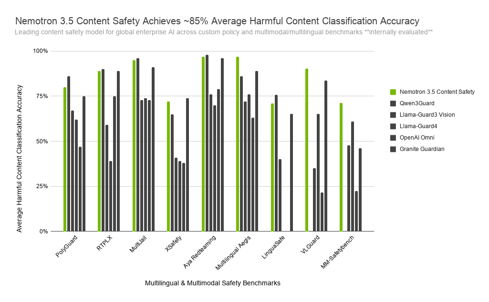

---

## Nemotron 3.5: The Superhero of AI Content Safety for Global Enterprises!

Imagine a world where AI not only understands text but also images, speaks over 140 languages, and can adapt to the unique safety policies of your industry. Sounds like science fiction? Well, say hello to **Nemotron 3.5**, NVIDIA’s latest AI model designed to make this a reality! 🌍✨

Nemotron 3.5 is not just an upgrade; it’s a game-changer in the realm of AI content safety. Built on the robust foundation of Google’s Gemma 3 4B IT, this model introduces **unified multimodal evaluation**, meaning it can analyze text, images, and even assistant responses *together* in a single context window. Why does this matter? Because safety violations often emerge from the interaction between text and images or between a user’s request and an AI’s response. Nemotron 3.5 catches these nuances in one go, closing a critical gap in multimodal safety. Think of it as a detective who doesn’t just look at clues individually but connects the dots to solve the case! 🕵️‍♂️

---

## Multilingual and Multimodal: Breaking Language Barriers

One of the standout features of Nemotron 3.5 is its **global language coverage**. While it explicitly supports 12 major languages—including English, French, Spanish, German, Chinese, Japanese, and Arabic—it also inherits strong zero-shot generalization across approximately 140 languages. This means even languages with sparse training data, like Southeast Asian or less-resourced African languages, benefit from Nemotron 3.5’s multilingual prowess. It’s like having a universal translator that not only speaks every language but also understands cultural nuances! 🌐

But wait, there’s more! Nemotron 3.5 doesn’t just stop at text. It’s **multimodal**, meaning it can evaluate images alongside text. This is crucial because safety violations often involve a combination of text and visuals. For example, a seemingly innocent image paired with a problematic text could slip through traditional safety filters. Nemotron 3.5 ensures such cases are caught, making it a robust solution for enterprises operating in diverse markets.

---

## Customizable Policies and Reasoning Traces: Safety on Your Terms

Every industry has its own set of rules and risks. A healthcare platform, for instance, has different safety concerns compared to a financial services chatbot or a children’s education app. Nemotron 3.5 addresses this with **custom policy enforcement**. You can feed the model your specific safety policies, and it will reason over them to deliver a verdict tailored to your needs. It’s like having a personal AI bodyguard that follows *your* rulebook! 🛡️

And here’s the cherry on top: **reasoning traces**. Ever wondered *why* an AI made a particular decision? Nemotron 3.5 can provide a step-by-step breakdown of its reasoning process, offering transparency and accountability. This is especially valuable for compliance, audit logging, and human review. Whether you need to justify a decision to regulators or refine your policies, reasoning traces make it all possible. Plus, they’re concise—most traces fit into just three sentences—so you get clarity without the clutter.

---

## Efficiency and Benchmarking: Why Nemotron 3.5 Stands Out

Nemotron 3.5 isn’t just powerful; it’s **efficient**. With a compact 4B parameter design, it’s optimized for real-time deployment on GPUs with as little as 8GB VRAM. This means you can run multimodal, multilingual safety checks without breaking the bank or slowing down your systems. It’s like having a sports car that’s also fuel-efficient! 🚗💨

When it comes to benchmarks, Nemotron 3.5 shines bright. It achieves an impressive **85% average accuracy** across multilingual and multimodal safety benchmarks, including VLGuard, MM-SafetyBench, and Aegis. On the Multilingual Aegis benchmark, it hits a staggering **96.5% accuracy** across 12 languages. These numbers aren’t just bragging rights; they translate to real-world reliability for enterprises deploying AI globally.

---

## Bridging the Gap in AI Safety

One of the biggest challenges in AI safety is the lack of comprehensive benchmarks, especially for multimodal and multilingual scenarios. Nemotron 3.5 tackles this head-on by incorporating **real images** (not just synthetic ones) and culturally nuanced multilingual prompts into its training data. This ensures the model is prepared for the complexities of real-world content, not just idealized test cases.

NVIDIA has also released the **Nemotron 3.5 Content Safety Dataset**, a rare move in the open-source safety model space. This dataset includes multimodal, multilingual safety reasoning traces, providing developers with valuable resources to train and refine their own models. It’s like getting a behind-the-scenes look at how the magic happens! 🎩✨

---

## Getting Started with Nemotron 3.5

Ready to bring Nemotron 3.5 into your AI pipeline? The model is available on Hugging Face under the NVIDIA Open Model License, making it accessible for both research and commercial use. It supports popular frameworks like Transformers, vLLM, and SGLang, and is also available as a production-grade NVIDIA NIM for teams needing a GPU-optimized inference microservice.

For those looking to dive deeper, NVIDIA provides tools like a Claude- and Codex-compatible skill for generating custom policies, along with cookbooks to guide you through implementation. Whether you’re a startup or a global enterprise, Nemotron 3.5 is here to make AI safety smarter, faster, and more adaptable than ever before. So, what are you waiting for? Let’s make AI safer, together! 🚀

Written with [Argos](https://github.com/Neilstid/argos)