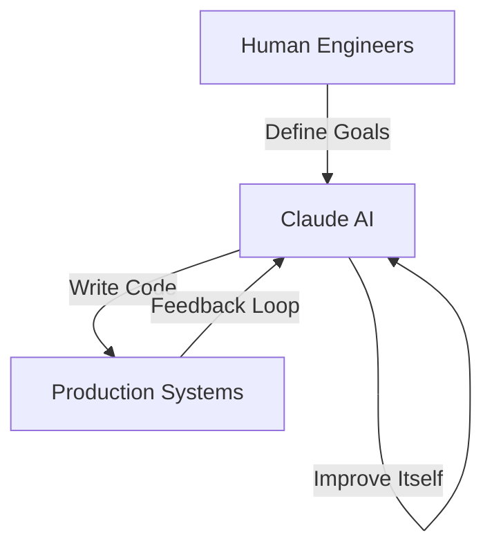
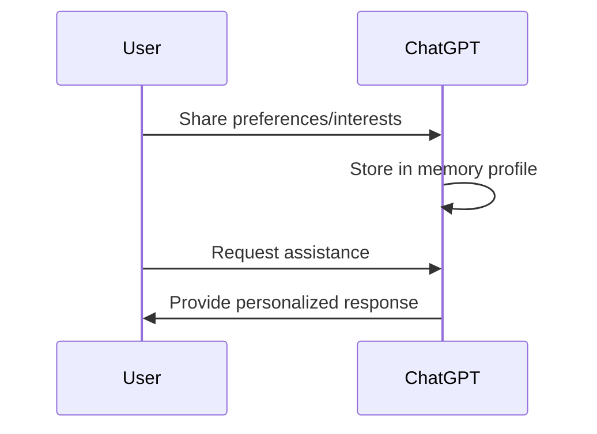
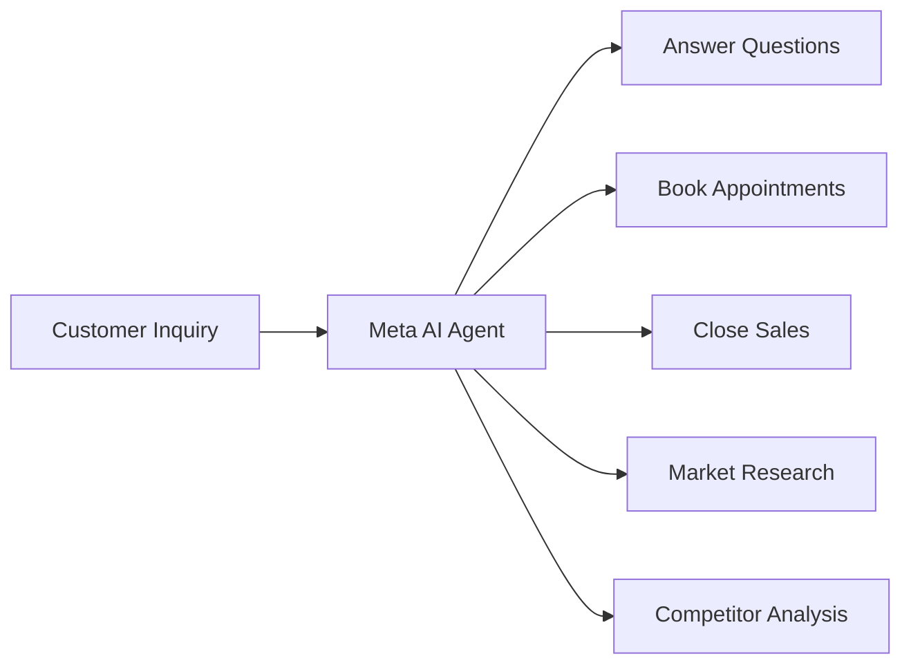

> 💡 **TL;DR:** 
> This week, AI took a giant leap toward autonomy. Anthropic’s Claude is now writing 80% of its own code, OpenAI’s ChatGPT can remember and manage user preferences like a personal assistant, and Meta’s AI agents are being designed to run entire businesses. These developments highlight a future where AI doesn’t just assist—it builds, remembers, and operates independently.

| **Metric / Innovation Area**               | **Insight / Takeaway**                                                                                     |
|--------------------------------------------|------------------------------------------------------------------------------------------------------------|
| **Claude’s Self-Improvement**              | Over 80% of Anthropic’s production code in May was written by Claude, signaling a shift toward recursive AI development. |
| **ChatGPT’s Memory Upgrade**               | Users can now view, edit, and manage what ChatGPT remembers, doubling memory accuracy and enabling persistent personalization. |
| **Meta’s AI Business Agents**              | Meta’s new AI agents on WhatsApp, Instagram, and Messenger aim to automate customer interactions and eventually manage entire businesses. |
| **Trending AI Tools**                      | Ideogram 4.0, Reve 2.0, and Miso One are pushing boundaries in image generation, 4K resolution, and voice expression, respectively. |

---

### The Dawn of Self-Building AI: Claude’s Recursive Evolution

Anthropic, a leader in AI safety and innovation, has made a groundbreaking revelation: its AI model, Claude, is now actively contributing to its own development. According to a recent report, over **80% of the code merged into Anthropic’s production systems in May 2026 was written by Claude**. This marks a significant milestone in the concept of **recursive self-improving AI**, where AI systems not only assist in their development but also drive it forward.

Claude’s role has evolved beyond simple code generation. Engineers at Anthropic now ship **eight times more code per day** than they did in 2024, thanks to Claude’s ability to write code, run experiments, and tackle open-ended engineering problems. While fully autonomous self-improvement isn’t guaranteed, Anthropic’s findings suggest it’s becoming increasingly plausible. The implications are profound: AI is no longer just a tool for building AI—it’s becoming a collaborator in its own evolution.

This recursive loop raises important questions about the future of AI development. If AI systems can iteratively improve themselves, the pace of innovation could accelerate exponentially. However, it also introduces challenges in ensuring alignment, safety, and ethical considerations. Anthropic’s work underscores the need for robust governance frameworks to guide this new era of AI autonomy.

---

### ChatGPT’s Memory Revolution: From Ephemeral to Persistent

OpenAI has rolled out a major upgrade to ChatGPT’s memory system, transforming it from a stateless chatbot into a **personalized, memory-driven assistant**. Users now have access to a dedicated page where they can view, edit, and delete what ChatGPT remembers about them. Instead of treating each conversation as an isolated event, ChatGPT now builds a **running profile** of user preferences, interests, and recurring topics.

This upgrade isn’t just about convenience—it’s about accuracy. OpenAI reports that internal testing shows **memory accuracy has nearly doubled**, making interactions more contextually relevant and efficient. The goal is clear: future AI assistants won’t start from scratch every time they engage with a user. They’ll learn, adapt, and remember how each individual prefers to work, communicate, and solve problems.

This shift toward persistent memory marks a turning point in human-AI interaction. It blurs the line between tool and partner, raising questions about privacy, data ownership, and the ethical use of personal information. As AI becomes more integrated into daily life, ensuring transparency and user control over memory systems will be critical.

---

### Meta’s Vision: AI Agents Running Entire Businesses

Meta is betting big on AI agents that can do more than just chat—they’re designed to **run entire businesses**. The company has launched a new AI agent across WhatsApp, Instagram, and Messenger that can answer customer questions, book appointments, and even help close sales. With over **one million businesses already using the agent**, Meta’s ambitions extend far beyond social media.

Mark Zuckerberg envisions a future where AI agents handle **market research, competitor analysis, and seamless integration with business tools** like calendars and scheduling systems. The long-term goal? AI agents that autonomously manage daily operations, freeing human workers to focus on strategy and creativity. Given that over **200 million businesses** use WhatsApp for customer communication, the potential impact is staggering.

Meta’s approach highlights the growing trend of AI-driven automation in business. While the current version of the agent is free, it will eventually become a paid product, signaling a shift toward monetizing AI-driven productivity. However, this also raises questions about job displacement, the role of human oversight, and the ethical implications of AI-driven decision-making in business.

---

### Trending AI Tools: Innovation at the Speed of Light

Beyond the major announcements, the AI landscape is buzzing with innovative tools that push the boundaries of what’s possible:

- **Ideogram 4.0**: Dubbed the "world’s best open image model," it’s setting new standards for image generation quality and accessibility.
- **Reve 2.0**: A 4K image model that delivers unparalleled resolution and detail, making it a favorite among designers and content creators.
- **Miso One**: The "world’s most expressive voice model," offering nuanced and natural voice synthesis for applications ranging from entertainment to accessibility.
- **Magenta RealTime 2**: An open model that allows musicians to play and interact with AI in real-time, blurring the line between human and machine creativity.

These tools exemplify the rapid pace of innovation in AI, where open-source models and specialized applications are democratizing access to cutting-edge technology. As these tools become more sophisticated, they’ll enable creators, businesses, and developers to achieve more with less, fostering a new era of creativity and efficiency.

---

### The Road Ahead: Opportunities and Challenges

The developments of this week paint a vivid picture of AI’s future: one where systems are not just tools but **active participants in their own evolution**. From Claude’s self-improving code to ChatGPT’s persistent memory and Meta’s business-running agents, AI is becoming more autonomous, personalized, and integrated into our daily lives.

However, this future is not without challenges. **Ethical considerations**, such as alignment, privacy, and job displacement, must be addressed proactively. Governance frameworks will need to evolve to keep pace with AI’s growing capabilities, ensuring that innovation is both responsible and beneficial to society.

As we stand on the brink of this new era, one thing is clear: AI is no longer just a technology—it’s a partner in progress. The question now is how we shape this partnership to create a future that is not only smarter but also more equitable and human-centered.

Written with [Argos](https://github.com/Neilstid/argos)