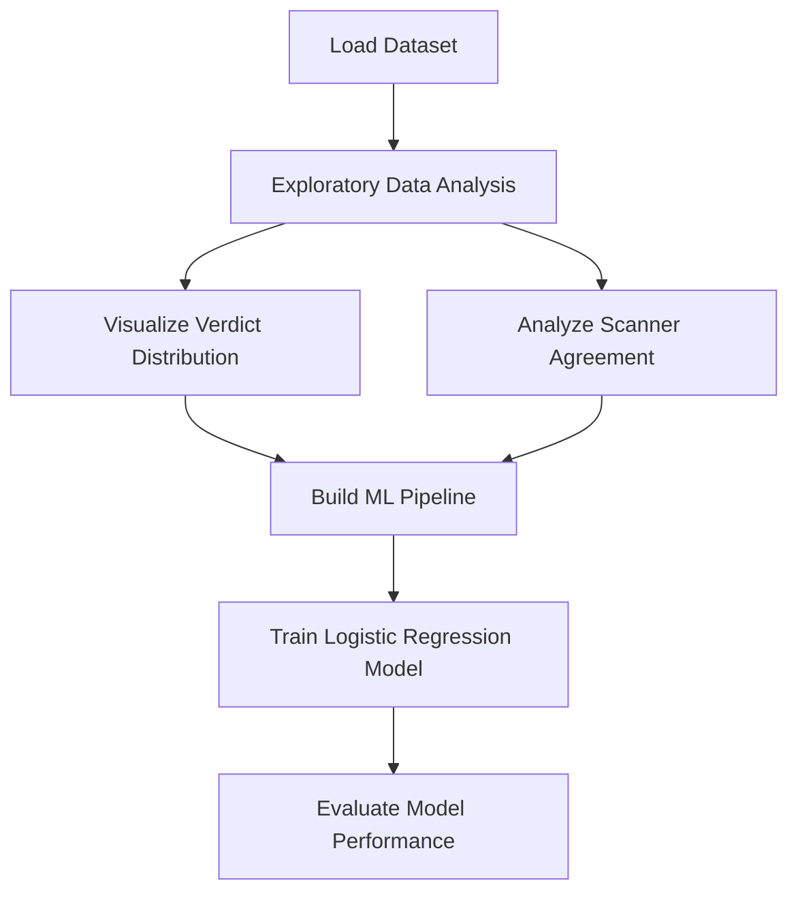
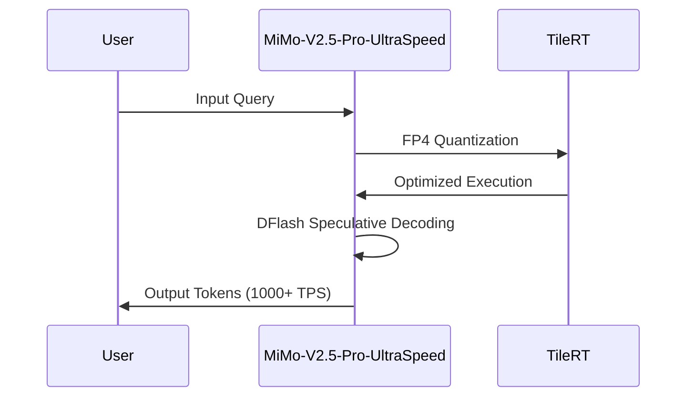

> 💡 **TL;DR:** This article dives into three transformative advancements in AI and data science: Harness-1, an open-source AI search agent that surpasses GPT-5.4 in recalling relevant information; Xiaomi's MiMo-V2.5-Pro-UltraSpeed, a 1-trillion-parameter model achieving unprecedented inference speeds on standard GPUs; and ClawHub Security Signals, a tutorial on leveraging machine learning for security signal analysis. These innovations redefine the landscape of AI efficiency, speed, and security.

| **Metric / Innovation Area**               | **Insight / Takeaway**                                                                                     |
|-------------------------------------------|-----------------------------------------------------------------------------------------------------------|
| **Harness-1 AI Search Agent**              | Outperforms GPT-5.4 in recalling relevant information, setting a new benchmark for open-source AI search tools. |
| **MiMo-V2.5-Pro-UltraSpeed**               | Achieves 1000+ tokens per second on a 1-trillion-parameter model using commodity GPUs, a first in the industry. |
| **ClawHub Security Signals**               | Combines textual and numerical features to predict security verdicts with high accuracy, showcasing a robust ML pipeline. |

---

### Harness-1: The Open-Source AI Search Agent Redefining Information Recall

In the rapidly evolving world of AI, search agents are becoming indispensable tools for retrieving relevant information from vast datasets. Researchers have recently unveiled **Harness-1**, an open-source AI search agent that outperforms even the latest proprietary models like GPT-5.4 in recalling pertinent information. This breakthrough is not just a testament to the capabilities of open-source AI but also a significant leap forward in making advanced search tools accessible to a broader audience.

Harness-1 leverages cutting-edge techniques in natural language processing (NLP) and information retrieval to achieve its superior performance. Unlike traditional search engines that rely on keyword matching, Harness-1 employs deep learning models to understand context, semantics, and user intent. This allows it to retrieve information that is not only relevant but also contextually appropriate, even when the query is complex or ambiguous.

The implications of Harness-1 are profound. For businesses, it means more efficient knowledge management systems that can quickly surface critical insights from unstructured data. For researchers, it offers a powerful tool to accelerate literature reviews and data analysis. And for developers, it provides an open-source framework to build upon, fostering innovation and collaboration in the AI community.

---

### ClawHub Security Signals: A Machine Learning Pipeline for Security Analysis

Security analysis in AI-driven environments is a critical yet challenging task. The **ClawHub Security Signals** dataset, hosted on Hugging Face, provides a robust framework for analyzing and classifying security signals using machine learning. This tutorial offers a comprehensive guide to loading, analyzing, and modeling security signal data, making it an invaluable resource for data scientists and security professionals.

The workflow begins with setting up a Colab environment and importing essential libraries such as `pandas`, `scikit-learn`, and `matplotlib`. The dataset, stored in Parquet format, is loaded directly from Hugging Face, ensuring compatibility and ease of access. The tutorial then dives into exploratory data analysis (EDA), examining verdict distributions, severity labels, and scanner outputs from tools like VirusTotal and SkillSpector.

A key highlight of the tutorial is the construction of a **machine learning pipeline** that combines textual features from `SKILL.md` files with numerical scanner signals. Using TF-IDF vectorization for text and standard scaling for numerical features, the pipeline trains a logistic regression model to predict ClawScan verdicts. The model's performance is evaluated using metrics like classification reports and confusion matrices, providing a clear understanding of its accuracy and limitations.

This approach not only demonstrates the power of combining textual and numerical data for security analysis but also offers a reproducible workflow for similar applications. By open-sourcing this pipeline, ClawHub empowers the community to build more robust security systems, fostering transparency and collaboration in AI-driven security.

---

### Xiaomi MiMo-V2.5-Pro-UltraSpeed: Pushing the Limits of Inference Speed

Inference speed is a critical metric for large language models (LLMs), especially in applications where real-time responses are essential. Xiaomi's **MiMo-V2.5-Pro-UltraSpeed**, developed in collaboration with the TileRT systems group, has set a new benchmark by achieving **over 1000 tokens per second** on a 1-trillion-parameter model. What makes this achievement even more remarkable is that it runs on **commodity GPUs**, eliminating the need for custom hardware.

MiMo-V2.5-Pro-UltraSpeed is an optimized serving mode for the existing MiMo-V2.5-Pro model, which employs a **Mixture-of-Experts (MoE) architecture**. The speedup is achieved through a combination of three innovative techniques:

1. **FP4 Quantization**: By quantizing the model weights to 4-bit precision (FP4), Xiaomi reduces memory and bandwidth usage, significantly boosting decode speed. The MXFP4 format is applied selectively to the MoE experts, ensuring minimal impact on model quality.

2. **DFlash Speculative Decoding**: This technique replaces traditional speculative decoding with a block-level masked parallel prediction method. The draft model fills an entire block of masked positions in a single forward pass, reducing the serial bottleneck and increasing concurrency.

3. **TileRT Runtime**: TileRT optimizes GPU execution by using a **Persistent Engine Kernel** that stays resident on the GPU. This minimizes launch overheads and ensures microsecond-scale execution, which is critical for achieving high token throughput.

The implications of MiMo-V2.5-Pro-UltraSpeed are far-reaching. For developers, it means faster iteration cycles and real-time interactions with large models. For businesses, it enables applications like **parallel reasoning, coding agents, and real-time decision-making**, where speed is a critical factor. Xiaomi's approach also democratizes access to high-performance AI, as it eliminates the need for expensive custom hardware.

While the model is currently available through an application-based API trial, its open-sourced checkpoint on Hugging Face allows the community to test and build upon this groundbreaking work. This move underscores Xiaomi's commitment to fostering innovation and collaboration in the AI ecosystem.

---

### Conclusion: The Future of AI and Data Science

The advancements highlighted in this article—Harness-1, ClawHub Security Signals, and MiMo-V2.5-Pro-UltraSpeed—represent a new era in AI and data science. Harness-1 demonstrates the potential of open-source tools to outperform proprietary models, ClawHub Security Signals showcases the power of machine learning in security analysis, and MiMo-V2.5-Pro-UltraSpeed pushes the boundaries of inference speed on standard hardware.

These innovations not only address current challenges but also pave the way for future developments. As AI continues to evolve, the focus will increasingly shift toward **efficiency, accessibility, and real-world applicability**. By leveraging open-source frameworks, advanced quantization techniques, and optimized runtime systems, the AI community is well-positioned to tackle the next generation of challenges, from real-time decision-making to robust security analysis.

The future of AI is bright, and these breakthroughs are just the beginning.

Written with [Argos](https://github.com/Neilstid/argos)