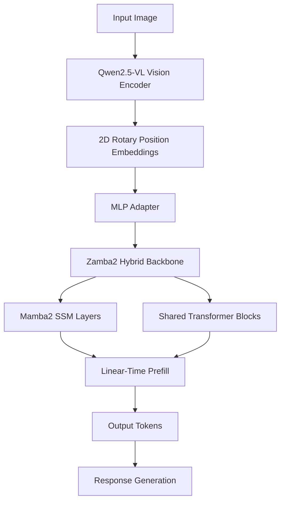
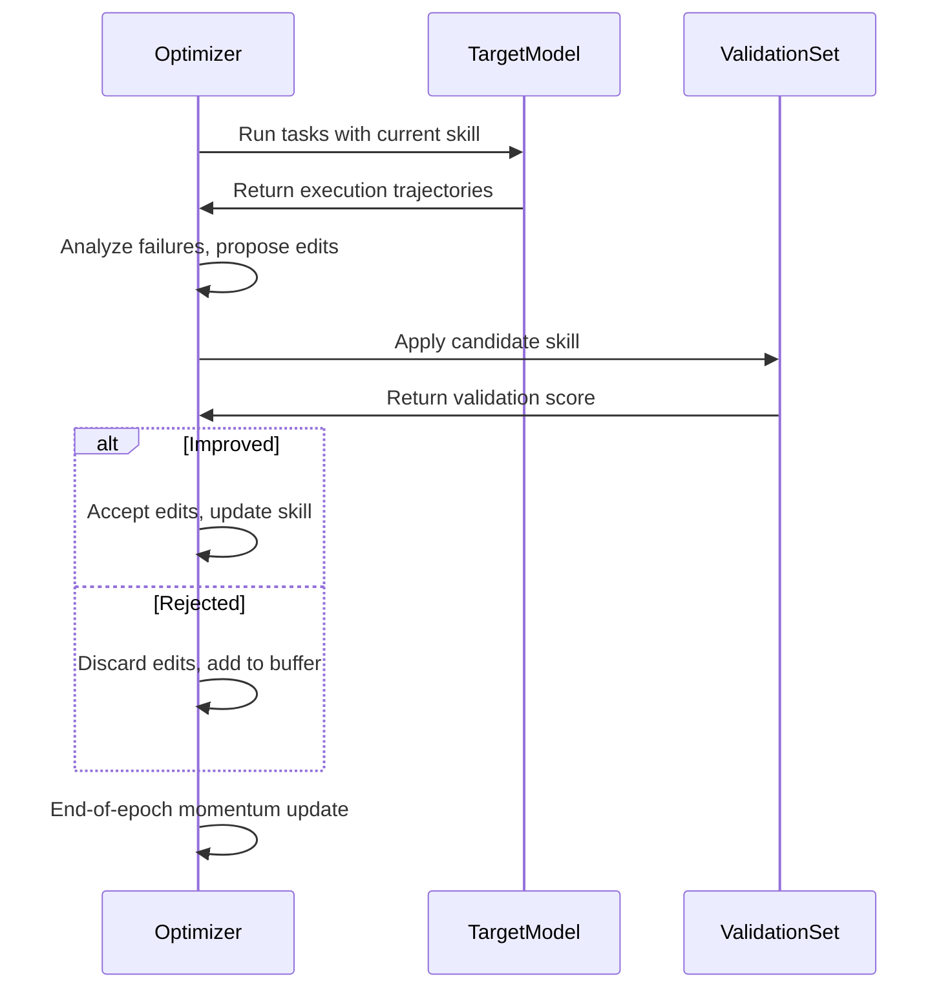
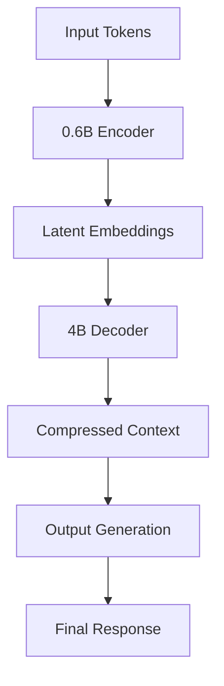

> 💡 **TL;DR:** This article dives into three transformative AI innovations: **Zyphra’s Zamba2-VL**, which slashes inference latency by an order of magnitude using a hybrid Mamba2-Transformer architecture; **Microsoft’s SkillOpt**, a framework that autonomously optimizes AI agent skills without touching model weights, delivering a 23.5-point accuracy boost for models like GPT-5.5; and **Latent Context Language Models (LCLMs)**, which compress LLM input contexts by 16x without significant accuracy loss, unlocking scalable long-context processing. Together, these advancements redefine efficiency, autonomy, and scalability in AI systems.

| Metric / Innovation Area | Insight / Takeaway |
|--------------------------|--------------------|
| **Zamba2-VL Architecture** | Hybrid Mamba2-Transformer backbone reduces time-to-first-token by ~10x vs. pure Transformers, ideal for real-time vision-language tasks. |
| **Zamba2-VL Performance** | Competitive accuracy in counting (PixMoCount: 82.5) and document understanding (DocVQA: 90.9) but lags in knowledge-heavy reasoning (MMMU: 37.7). |
| **SkillOpt Optimization** | Achieves +23.5-point accuracy improvement for GPT-5.5 via iterative, mathematically validated skill document edits. |
| **SkillOpt Portability** | Skills transfer across models (GPT-5.5 to GPT-5.4-nano) and harnesses (Codex CLI, Claude Code) with <2,000-token artifacts. |
| **LCLMs Compression** | 16x context compression with 75.06% accuracy on RULER benchmark, outperforming KV cache methods. |
| **LCLMs Efficiency** | 8.8x faster inference at 16x compression vs. KV cache baselines; scales to 1M-token contexts within memory bounds. |

---

### Introduction

The artificial intelligence landscape is undergoing a seismic shift, driven by breakthroughs in **vision-language models (VLMs)**, **agentic systems**, and **context management**. As AI models grow larger and more capable, three persistent challenges have emerged: **inference speed**, **autonomous skill adaptation**, and **scalable context processing**. This article explores three pioneering solutions—**Zyphra’s Zamba2-VL**, **Microsoft’s SkillOpt**, and **Latent Context Language Models (LCLMs)**—each addressing a critical bottleneck in modern AI deployment.

These innovations are not merely incremental improvements but **paradigm shifts** in how we design, deploy, and scale AI systems. From accelerating real-time image analysis to enabling self-optimizing agents and compressing context without sacrificing accuracy, these advancements are poised to redefine industries ranging from **healthcare and finance** to **autonomous systems and enterprise automation**.

---

### 1. Zamba2-VL: Hybrid Mamba2-Transformer Vision-Language Models for Faster Inference

#### 1.1 Overview

Zyphra’s **Zamba2-VL** represents a bold departure from traditional Transformer-based VLMs by introducing a **hybrid architecture** that combines **Mamba2’s state-space model (SSM)** with **Transformer layers**. Available in **1.2B, 2.7B, and 7B parameter** variants, Zamba2-VL achieves **an order-of-magnitude reduction in time-to-first-token (TTFT) generation** while maintaining competitive performance across vision-language benchmarks. This breakthrough is particularly significant for applications requiring **real-time processing**, such as interactive AI assistants, autonomous navigation, and high-throughput document analysis.

The model adheres to the **LLaVA-style VLM template**, where a pre-trained vision encoder (in this case, **Qwen2.5-VL’s Vision Transformer**) processes image patches into features, which are then projected into the language model’s embedding space via a lightweight MLP adapter. The hybrid backbone—comprising **Mamba2 SSM layers** and **shared Transformer blocks**—balances the **linear-time efficiency** of state-space models with the **in-context retrieval capabilities** of attention mechanisms.



#### 1.2 Key Features and Technical Deep Dive

- **Hybrid Architecture**: The backbone alternates between **Mamba2 SSM layers** (for efficient, linear-time processing) and **shared Transformer blocks** (for in-context retrieval). Each Transformer block includes a **unique LoRA adapter**, enabling fine-grained control over attention mechanisms.
  - **Mamba2 SSM**: Operates in **O(N)** time complexity, where $N$ is the sequence length, avoiding the **O(N²)** quadratic scaling of traditional attention.
  - **Shared Transformer Blocks**: Preserve the model’s ability to retrieve and reason over long-range dependencies, a weakness of pure SSM models.

- **Training Data**: Zamba2-VL was trained on **100B tokens** of vision-text and pure-text data, sourced from open web datasets. The **Mistral v0.1 tokenizer** is used for text processing.

- **Benchmark Performance**: Evaluated across **14 benchmarks**, Zamba2-VL excels in **visual counting** (e.g., PixMoCount: **82.5** for 2.7B) and **document understanding** (DocVQA: **90.9** for 2.7B) but trails larger models in **knowledge-heavy reasoning** (MMMU: **37.7** for 2.7B).

| Eval | Zamba2-VL-2.7B | InternVL3.5-2B | Qwen3-VL-2B | Molmo2-4B | Qwen3-VL-4B |
|------|----------------|-----------------|--------------|-----------|--------------|
| DocVQA (test) | 90.9 | 89.4 | 93.3 | 87.8 | 95.3 |
| ChartQA (test) | 79.6 | 81.6 | 78.7 | 86.1 | 81.8 |
| OCRBench | 73.6 | 83.4 | 84.1 | 62.0 | 84.1 |
| CountBenchQA | 87.5 | 70.0 | 87.9 | 91.2 | 87.3 |
| PixMoCount (test) | 82.5 | 32.8 | 55.7 | 87.0 | 89.2 |

- **Inference Efficiency**: The hybrid design avoids the **growing KV cache** problem of Transformers, achieving **near-linear-time prefill** and a **fixed-size recurrent state**. On a **32k-token prefill**, Zamba2-VL outperforms all Transformer VLM baselines in **score-vs-TTFT** trade-offs, with a **10x latency reduction**.

#### 1.3 Why It Matters and Future Outlook

Zamba2-VL’s **speed advantage** makes it ideal for **edge deployment** (e.g., mobile devices, IoT) and **real-time applications** (e.g., live video analysis, interactive chatbots). Its **Apache 2.0 license** and open-source availability on **Hugging Face** lower the barrier to adoption for researchers and enterprises.

**Use Cases:**
- **Document and Form Extraction**: Strong performance on **DocVQA** enables high-accuracy invoice parsing, receipt digitization, and contract analysis.
- **Retail and Inventory Management**: Excels in **PixMoCount and CountBenchQA**, making it suitable for automated stock counting and visual auditing.
- **On-Device Assistants**: The **1.2B model** targets phones and edge devices, where low latency is critical.

**Limitations:**
- **Knowledge Reasoning**: Lags behind larger models (e.g., Qwen3-VL-4B) on **MMMU and MathVista**, which require deep factual knowledge.
- **OCR Performance**: Trails **Qwen3-VL and InternVL3.5** on OCRBench, indicating room for improvement in text extraction from images.
- **Hardware Dependency**: Optimized kernels require **CUDA GPUs**; CPU inference is slow.

**Getting Started:**
Zamba2-VL models are available on Hugging Face. Below is a code snippet for inference:

```python
from transformers import Zamba2_VLForConditionalGeneration, Zamba2_VLProcessor
import torch
from PIL import Image
from qwen_vl_utils import process_vision_info
import requests

device = "cuda"
processor = Zamba2_VLProcessor.from_pretrained("Zyphra/Zamba2-VL-2.7B", temporal_patch_size=1)
model = Zamba2_VLForConditionalGeneration.from_pretrained(
    "Zyphra/Zamba2-VL-2.7B",
    device_map=device,
    torch_dtype=torch.bfloat16,
    attn_implementation="flash_attention_2",
)

url = "http://images.cocodataset.org/val2017/000000039769.jpg"
image = Image.open(requests.get(url, stream=True).raw)
question = "What do you see in the image? Give us some detail."
num_img_tokens = 3400

conversation = [
    {"role": "user", "content": [
        {"type": "image", "image": image,
         "max_pixels": num_img_tokens * 28 * 28, "min_pixels": 10 * 28 * 28},
        {"type": "text", "text": question},
    ]},
]

prompt = processor.apply_chat_template(conversation, add_generation_prompt=True)
images, _ = process_vision_info(conversation)
inputs = processor(text=prompt, images=images, add_special_tokens=True, return_tensors="pt")
inputs = {key: value.to(device) for key, value in inputs.items()}
outputs = model.generate(**inputs, max_new_tokens=100)
print(processor.tokenizer.decode(outputs[0][inputs["input_ids"].shape[-1]:]))
```

---

### 2. SkillOpt: Automated Agent Skill Optimization Without Model Weight Updates

#### 2.1 Overview

Microsoft’s **SkillOpt** introduces a **deep-learning-inspired optimization framework** for **agent skills**—procedural knowledge encoded in **text-based `.md` files**. Unlike traditional prompt engineering, which relies on manual trial-and-error, SkillOpt treats skill documents as **trainable objects**, iteratively refining them based on **performance feedback** without modifying the underlying model’s weights. This approach addresses a critical gap in AI agent development: **how to systematically improve agent behavior in complex, multi-step workflows**.

Agent skills are **external artifacts** that define domain heuristics, tool-use policies, output constraints, and failure modes. They enable **customization without retraining** the base model, but optimizing these skills has historically been a **labor-intensive, error-prone process**. SkillOpt automates this by importing **mathematical rigor** from deep learning—such as **learning rates, validation gates, and momentum**—into the optimization of text-based skills.

#### 2.2 How SkillOpt Works

SkillOpt’s optimization loop is structured as follows:

1. **Initialization**: Start with an initial skill document and a **frozen target model** (or execution harness). The target model runs a batch of tasks to generate **execution trajectories** (successes and failures).
2. **Analysis**: An **offline optimizer model** analyzes these trajectories, identifying **systematic procedural errors** (e.g., incorrect tool usage, formatting mistakes).
3. **Proposal**: The optimizer proposes **structural edits** (additions, deletions, replacements) to the skill document, ranked by **expected utility**.
4. **Validation**: Proposed edits are clipped to a **maximum edit budget** (acting as a **learning rate**) and evaluated on a **held-out validation set**. Only edits that **improve validation performance** are retained.
5. **Momentum**: At the end of an epoch, SkillOpt performs a **slow update**, comparing performance under the previous and current skill versions to carry forward **long-horizon procedural lessons**.



**Key Innovations:**
- **Edit Budget as Learning Rate**: Limits the number of edits per step to prevent **skill drift**.
- **Held-Out Validation**: Ensures edits are **mathematically validated** before acceptance.
- **Rejected-Edit Buffer**: Prevents the optimizer from repeating **failed edits** (analogous to **negative memory** in deep learning).
- **Momentum Mechanism**: Preserves **durable procedural knowledge** across epochs.

#### 2.3 Performance and Real-World Impact

SkillOpt was evaluated across **52 combinations** of models (GPT-5.5, GPT-5.4-mini, Qwen3.5-4B), benchmarks (SpreadsheetBench, multimodal QA, embodied interaction), and execution harnesses (plain chat, Codex CLI, Claude Code). Key results:

- **Accuracy Improvements**: Delivered an **average absolute improvement of +23.5 points** for **GPT-5.5** over a no-skill baseline.
- **Outperformed Baselines**: Surpassed **TextGrad, GEPA, EvoSkill**, and even a **hypothetical oracle baseline** that cherry-picked the best method for each problem.
- **Small Model Gains**: **GPT-5.4-nano** nearly **doubled its score** on multimodal document QA and **tripled its score** on sequential decision-making.
- **Portability**: Skills trained on one model/harness **transferred seamlessly** to others. For example, a skill trained in **Codex CLI** improved **Claude Code’s performance by +59.7 points** without further changes.
- **Efficiency**: Final deployed skills averaged **<2,000 tokens** (median: **920 tokens**), making them **auditable and human-readable**.

**Enterprise Applications:**
- **Document Data Extraction**: Improves **reliability** in tasks like **AP automation, claims processing, and compliance checks** by enforcing **precise formatting and self-verification**.
- **Tool Use and Workflow Automation**: Enhances **procedural discipline** in multi-step workflows, where frontier models often struggle **zero-shot**.
- **Cost Efficiency**: Reduces reliance on **manual prompt engineering**, lowering operational costs.

**Implementation Considerations:**
- **Training Cost**: For academic benchmarks, training tokens can reach **210M**, but real-world use cases require **far fewer tokens** (e.g., **$1–5 per task** in community frameworks like GBrain).
- **Requirements**: Needs **a few dozen representative examples** and a **scorable feedback signal**. Not suitable for **open-ended or subjective tasks**.
- **Integration**: Compatible with existing orchestration stacks (e.g., **DSPy**), enabling **harmonious deployment** alongside other optimization layers.

#### 2.4 Why It Matters

SkillOpt’s **autonomous skill evolution** represents a **step toward self-improving AI agents**. By treating **text as a trainable object**, it bridges the gap between **static prompt engineering** and **dynamic, feedback-driven optimization**. This is particularly valuable in **enterprise settings**, where **reliability, auditability, and adaptability** are paramount.

As **Yifan Yang**, Senior Research SDE at Microsoft Research Asia, notes:
> *"The valuable version of self-improvement is an agent autonomously discovering knowledge to improve its own behavior and the user experience, under verification and audit."*

SkillOpt’s **portability, efficiency, and mathematical rigor** make it a **game-changer** for deploying **highly capable, adaptable AI agents** in production.

---

### 3. Latent Context Language Models (LCLMs): 16x Context Compression Without Accuracy Loss

#### 3.1 Overview

Developed by a **multi-institutional team** (NYU, Columbia, Princeton, University of Maryland, Harvard, and Lawrence Livermore National Laboratory), **Latent Context Language Models (LCLMs)** introduce a **novel encoder-decoder compression framework** that compresses **input context tokens** before they reach the decoder. This approach **directly reduces decoder-side compute and memory**, unlike **KV cache compression methods**, which still materialize the full KV cache before eviction.

LCLMs enable **16x context compression** with **minimal accuracy loss**, making long-context processing **feasible at scale**. At **4x compression**, accuracy drops by **<3%** (from **94.41%** to **91.76%** on the RULER benchmark). At **16x compression**, where **93.75% of input tokens are removed**, accuracy remains at **75.06%**, **outperforming all KV cache baselines** tested at the same ratio.

#### 3.2 Technical Deep Dive

**Architecture:**
- **Encoder-Decoder Design**: A **0.6B-parameter encoder** compresses blocks of input tokens into **shorter latent embeddings**, which a **4B-parameter decoder** processes in place of the original tokens.
- **Training Data**: Trained on **>350B tokens**, including:
  - **Continual pre-training data** with compressed and uncompressed spans interleaved.
  - **Supervised fine-tuning data** for reasoning and long-context tasks.
  - **Auxiliary reconstruction tasks** to preserve fine-grained detail.

**Key Innovations:**
- **End-to-End Training**: LCLMs are trained **holistically** to handle long contexts **efficiently and accurately**, avoiding the **trade-off** between reconstruction accuracy and task performance seen in earlier work.
- **Latent Embeddings**: Input tokens are compressed into **dense, low-dimensional representations**, reducing memory usage while preserving semantic information.
- **Scalability**: The decoder’s capacity matters more than the encoder’s, as revealed by **architecture search**.



**Performance Highlights:**
- **RULER Benchmark**: At **4x compression**, accuracy is **91.76%** (vs. **94.41%** uncompressed). At **16x compression**, accuracy is **75.06%**, outperforming KV cache methods.
- **GSM8K Math Problems**: LCLMs **outscore all other methods** at every compression ratio, even when compressing the **entire prompt** (not just retrieved documents).
- **Speed**: At **16x compression**, LCLMs achieve **8.8x faster inference** than KV cache baselines on RULER.
- **Memory Efficiency**: At **1M tokens**, uncompressed inference **exceeds memory limits** on a single **H200 GPU**, but LCLMs at **16x compression remain within bounds**.

#### 3.3 Integration and Enterprise Implications

**Where LCLMs Fit in an Agentic Stack:**
LCLMs are designed for **seamless integration** into existing AI pipelines. As **Micah Goldblum**, co-lead advisor at Columbia University, explains:
> *"You can simply swap out LCLMs for any existing LLM. Whenever you retrieve data such as documents and want to dump it into your model’s context, simply run those documents through the LCLM’s compressor first."*

**Selective Decompression:**
Agents can **skim compressed content** and **decompress only the most relevant portions**, mimicking human behavior:
> *"Think about this like a human skimming content before zooming in on relevant details."*

**Enterprise Considerations:**
1. **Inference Cost Scaling**: Context length directly impacts **compute and memory costs**. LCLMs mitigate this by **reducing decoder-side load**.
2. **RAG Pipeline Tuning**: Teams must **validate compression behavior** against their **retrieval quality metrics** before large-scale deployment.
3. **Reasoning Trace Compression**: Currently **unsolved**. Naive approaches (e.g., periodic compression of reasoning traces) may work but require further testing.

**Availability:**
- **Models**: [Hugging Face - Latent Context](https://huggingface.co/latent-context)
- **Code**: [GitHub - LCLM](https://github.com/LeonLixyz/LCLM)

#### 3.4 Why It Matters

LCLMs address a **critical bottleneck** in modern LLMs: **context length scalability**. As context windows grow (e.g., **1M+ tokens**), traditional methods **struggle with memory and compute constraints**. LCLMs enable:
- **Cost-Effective Long-Context Inference**: Ideal for **legal document analysis, research assistants, and multi-turn conversations**.
- **Multiscale Approaches**: Agents can **skim vast amounts of text or code** and **zoom in on relevant details**, improving efficiency.
- **Integration with RAG**: LCLMs can be **seamlessly combined with Retrieval-Augmented Generation (RAG)** pipelines, enhancing both **speed and accuracy**.

**Survey Data Insight:**
According to **VB Pulse Q1 2026**, **33.3%** of organizations with **100+ employees** plan to adopt **hybrid retrieval** (up from **10.3%** in January). **Retrieval optimization** has overtaken **evaluation** as the **top investment priority** (28.9% of respondents), highlighting the urgency of solutions like LCLMs.

---

### Conclusion: The Future of AI Efficiency & Adaptability

The advancements in **Zamba2-VL, SkillOpt, and LCLMs** represent a **convergence of speed, autonomy, and scalability** in AI systems. Each innovation addresses a **fundamental challenge** in modern AI deployment:

1. **Zamba2-VL** demonstrates that **hybrid architectures** (Mamba2 + Transformer) can **dramatically reduce inference latency** while maintaining competitive performance, unlocking **real-time applications** in vision-language tasks.
2. **SkillOpt** proves that **agent skills can be optimized autonomously** using **deep-learning-inspired controls**, enabling **self-improving AI agents** that adapt to complex workflows without manual intervention.
3. **LCLMs** solve the **context length bottleneck** by compressing input tokens **before decoder processing**, making **long-context inference** feasible at scale.

Together, these technologies **push the boundaries of what AI can achieve**, from **computer vision and NLP** to **enterprise automation and beyond**. As **Yifan Yang** and **Micah Goldblum** highlight, the future of AI lies in **systems that are not only powerful but also efficient, adaptable, and scalable**.

For developers and researchers, the message is clear: **the next generation of AI systems will be faster, smarter, and more autonomous than ever before**. By embracing these breakthroughs, we can build **AI that doesn’t just perform tasks but evolves to meet the demands of an increasingly complex world**.

---

### Call to Action

Explore these cutting-edge models and frameworks today:
- **Zamba2-VL**: [Hugging Face - Zyphra/Zamba2-VL](https://huggingface.co/collections/zyphra/zamba2-vl-658016a139c7a70d7b23f08b)
- **SkillOpt**: [Microsoft Research - SkillOpt](https://www.microsoft.com/en-us/research/project/skillopt/)
- **LCLMs**: [Hugging Face - Latent Context](https://huggingface.co/latent-context) | [GitHub - LCLM](https://github.com/LeonLixyz/LCLM)

Written with [Argos](https://github.com/Neilstid/argos)