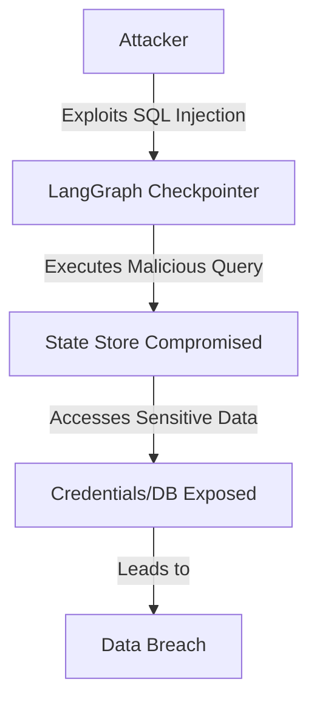
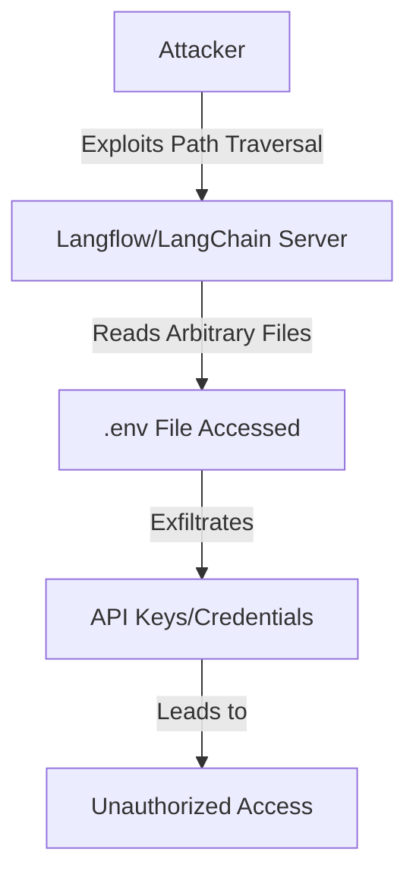
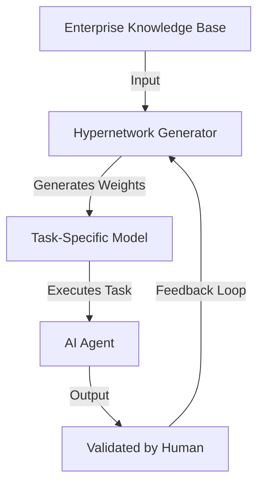

> 💡 **TL;DR:** Critical vulnerabilities in AI agent frameworks like LangGraph, Langflow, and LangChain—including SQL injection, RCE, and path traversal—pose severe risks to enterprise deployments. Meanwhile, hypernetwork-based agent memory systems emerge as a promising solution to enhance autonomy, reliability, and cost-efficiency by dynamically generating task-specific models at inference time.

| Metric / Innovation Area | Insight / Takeaway |
|--------------------------|--------------------|
| **LangGraph Vulnerabilities** | SQL injection (CVE-2025-67644, CVSS 7.3) and msgpack deserialization (CVE-2026-28277, CVSS 6.8) enable RCE, compromising agent state stores and exposing sensitive data. |
| **Langflow & LangChain Vulnerabilities** | Path traversal flaws (CVE-2026-5027, CVSS 8.8; CVE-2026-34070, CVSS 7.5) allow attackers to exfiltrate credentials, including API keys, via arbitrary file reads. |
| **Governance Blind Spots** | Insecure defaults, misclassification of AI tools, and supply chain risks create critical oversight gaps in enterprise AI deployments. |
| **Hypernetworks** | Dynamically generate task-specific models at inference time, avoiding catastrophic forgetting and context rot while improving autonomy and scalability. |
| **Enterprise Impact** | Unpatched vulnerabilities can lead to data breaches, compliance violations, and productivity losses, costing millions in damages and reputational harm. |

### Introduction

The rise of AI agents in enterprise environments marks a pivotal shift in how businesses automate workflows, analyze data, and interact with customers. Yet, this transformation is not without its shadows. Recent discoveries of critical vulnerabilities in frameworks like **LangGraph**, **Langflow**, and **LangChain** have exposed gaping holes in the security postures of organizations racing to adopt AI-driven automation. These flaws are not mere theoretical risks—they are actively exploited, with real-world implications for data integrity, compliance, and operational continuity.

At the same time, a new paradigm is emerging to address the limitations of traditional AI agent architectures. **Hypernetwork-based agent memory systems** promise to revolutionize how agents retain knowledge, adapt to tasks, and operate autonomously—without the pitfalls of fine-tuning or retrieval-augmented generation (RAG). This article dives deep into the security challenges plaguing AI agent frameworks, the governance gaps they reveal, and the innovative solutions that could redefine the future of safe, reliable AI.

### Key Security Vulnerabilities in AI Agent Frameworks

#### 1. LangGraph: SQL Injection and Remote Code Execution (RCE)

LangGraph, a popular framework for building AI agents with persistent memory, has become a prime target for attackers due to its **SQL injection** and **msgpack deserialization** vulnerabilities. The most severe of these, **CVE-2025-67644** (CVSS 7.3), allows attackers to inject malicious SQL queries into the agent’s state store, potentially leading to **Remote Code Execution (RCE)**. Another critical flaw, **CVE-2026-28277** (CVSS 6.8), stems from insecure deserialization of msgpack data, enabling arbitrary code execution in vulnerable environments.

The impact of these vulnerabilities cannot be overstated. LangGraph’s **checkpointer layer**, which stores the execution state of agents, is particularly exposed when misconfigured. Attackers exploiting these flaws can gain access to sensitive credentials, databases, and even customer relationship management (CRM) systems, leading to catastrophic data breaches. For enterprises, the stakes are high: a single compromised agent could unravel an entire security infrastructure.

Mitigation strategies include upgrading to patched versions (e.g., `langgraph-checkpoint-sqlite` **3.0.1**) and ensuring that no untrusted input reaches the `get_state_history()` endpoint. Enterprises should also **disable auto-login** and enforce strict access controls to minimize exposure.

#### 2. Langflow and LangChain: Path Traversal and Credential Exposure

Langflow and LangChain, two other widely adopted frameworks, are not immune to security flaws. **Langflow’s CVE-2026-5027** (CVSS 8.8) and **LangChain-core’s CVE-2026-34070** (CVSS 7.5) both involve **path traversal vulnerabilities** that allow attackers to read arbitrary files on the server. This includes sensitive `.env` files, which often contain **API keys, database credentials, and other secrets** critical to enterprise operations.

The consequences of such vulnerabilities are dire. Exposed API keys for services like **OpenAI, Anthropic, or cloud providers** can lead to unauthorized access, financial fraud, and further exploitation of enterprise systems. Worse, **active exploitation** of Langflow’s path traversal flaw has already been observed, with attackers scanning the internet for vulnerable instances.

To mitigate these risks, enterprises must **upgrade to the latest versions** (Langflow **1.9.0+**, LangChain-core **1.2.22**) and **disable auto-login** features. Additionally, restricting file uploads and enforcing **least-privilege access controls** can significantly reduce the attack surface.

### Why These Vulnerabilities Matter: The Governance Gap

#### Security Blind Spots in AI Adoption

The vulnerabilities in LangGraph, Langflow, and LangChain are symptomatic of a broader **governance gap** in enterprise AI adoption. Many organizations treat AI agent frameworks as **developer convenience tools** rather than **critical infrastructure**, leading to inadequate security oversight. This misclassification results in:

- **Insecure Defaults**: Frameworks often ship with default configurations that lack proper authentication and authorization. For example, Langflow’s **auto-login** feature and LangChain’s **unguarded prompt loader** create easy entry points for attackers.
- **Supply Chain Risks**: Enterprises rely heavily on third-party frameworks, meaning a vulnerability in one component can cascade into a **system-wide security failure**. The interconnected nature of modern AI systems amplifies this risk.
- **Lack of Ownership**: Without clear ownership, AI agent frameworks often fall through the cracks of traditional security governance, leaving them unpatched and exposed.

#### The Business Impact of Unaddressed Risks

The business implications of unaddressed AI agent vulnerabilities are severe and multifaceted:

- **Data Breaches**: A single exploited vulnerability can lead to the exposure of **sensitive customer data, intellectual property, or financial records**, resulting in **reputational damage, legal liabilities, and regulatory fines** (e.g., under GDPR or CCPA).
- **Compliance Violations**: Enterprises in regulated industries (e.g., healthcare, finance) must adhere to strict compliance standards. Unpatched vulnerabilities can lead to **audit failures, fines, and operational restrictions**.
- **Productivity Loss**: AI agents are designed to **automate tasks and improve efficiency**. However, vulnerabilities can force organizations to **revert to manual processes**, negating the benefits of AI adoption and increasing operational costs.

### Emerging Solutions: Hypernetwork-Based Agent Memory

#### The Problem with Fine-Tuning and In-Context Learning

Traditional approaches to AI agent memory—**fine-tuning** and **Retrieval-Augmented Generation (RAG)**—come with significant limitations:

- **Fine-Tuning**: While effective for embedding domain-specific knowledge into a model, fine-tuning suffers from **catastrophic forgetting**, where new knowledge overwrites existing information. This requires **frequent retraining**, which is **costly, time-consuming, and unscalable** for dynamic enterprise environments. The result is a **sprawling estate of task-specific models**, each requiring governance and maintenance.
  
  Mathematically, catastrophic forgetting can be represented as a loss in the model's ability to retain prior knowledge, often quantified by the **elastic weight consolidation (EWC)** regularization term:
  $$\mathcal{L}_{EWC} = \mathcal{L}_{task} + \lambda \sum_{i} F_i (\theta_i - \theta_{i,0})^2$$ 
  where $F_i$ are the Fisher information matrix diagonals, and $\theta_{i,0}$ are the initial parameters.

- **In-Context Learning (RAG)**: RAG systems dynamically inject relevant context into the model’s prompt, avoiding the need for retraining. However, they face **context rot**, where the model’s performance degrades as the prompt grows longer or includes outdated information. Additionally, **retrieval misses** (where the system fails to fetch the correct context) can lead to **hallucinations or incorrect outputs**, often indistinguishable from confident but wrong answers.

#### Hypernetworks: A Promising Alternative

Hypernetworks offer a **third path** that addresses the shortcomings of both fine-tuning and RAG. A **hypernetwork** is a neural network that **generates the weights of another network** (often a smaller, task-specific model) at inference time. This approach has several advantages:

- **On-Demand Model Generation**: Hypernetworks dynamically generate **task-specific models** from enterprise policies or knowledge bases, eliminating the need for static fine-tuning or unwieldy prompts. This ensures that agents always operate with **current, relevant knowledge** without forgetting prior information.
- **Improved Autonomy**: By generating specialized models on demand, hypernetworks enable agents to **operate independently for longer durations**, reducing the need for human intervention. This is particularly valuable for **long-running tasks** (e.g., overnight audits or compliance checks).
- **Scalability and Cost Efficiency**: Small, task-specific models generated via hypernetworks are **10 to 30 times cheaper to run** than large, general-purpose models (as noted in a 2025 Nvidia paper). They also reduce the **computational overhead** associated with fine-tuning and RAG.

**Commercial Applications**: Companies like **Nace.AI** are pioneering hypernetwork-based solutions. Their **MetaModel** technology generates **parameter adaptations** for models at inference time, tailored to specific business domains such as **compliance, risk assessment, and audit**. Nace.AI reports achieving a **90/10 autonomy split**, where agents handle 90% of the workflow autonomously, and humans validate the remaining 10%.

**Key Innovations in Hypernetworks**:
- **Sakana AI’s Text-to-LoRA**: Presented at **ICML 2025**, this system generates a **model adapter (LoRA)** from a plain-language description in a single pass, enabling rapid specialization without retraining.
- **SHINE Framework**: A 2026 system that positions hypernetwork adaptation as a **promising frontier** for AI agents, sidestepping the **retraining costs of fine-tuning** and the **context limits of RAG**.

**Challenges and Open Questions**:
While hypernetworks hold immense promise, several challenges remain:
- **Calibration**: Generated models must **know when they are unsure** to avoid overconfident errors. Recent research suggests that hypernetworks do not inherently improve calibration over fine-tuning, with gains appearing only under **specific constraints**.
- **Data Curation**: The quality of generated models depends heavily on the **policy data** used for generation, placing a premium on **high-quality, curated datasets**.
- **Scale**: Most published hypernetworks are **small-scale**. Nace.AI claims to have scaled its generator **beyond published sizes** and derived a **scaling law** for performance growth, though these results are still under peer review.

### Practical Steps for Enterprises to Secure AI Agents

#### 1. Patch and Update Frameworks Regularly

Enterprises must treat AI agent frameworks with the same rigor as other critical infrastructure. Key actions include:
- **Immediate Patching**: Ensure all frameworks (LangGraph, Langflow, LangChain, etc.) are updated to the **latest security patches**. For example, upgrade `langgraph-checkpoint-sqlite` to **3.0.1** and Langflow to **1.9.0+**.
- **Automated Security Checks**: Integrate **automated vulnerability scanning tools** (e.g., Snyk, GitHub Dependabot) to detect and mitigate flaws in third-party dependencies.
- **Isolation**: Deploy AI agent frameworks in **isolated environments** (e.g., containers, VMs) to limit exposure to sensitive data and systems.

#### 2. Implement Strong Security Governance

- **Classify AI Tools as Critical Infrastructure**: Assign **clear ownership** and **approval processes** for AI agent frameworks, treating them as **high-value assets** rather than developer tools.
- **Enforce Least Privilege**: Apply **least-privilege access controls** to ensure that only authorized personnel can access sensitive data and credentials.
- **Centralized Authentication**: Use **centralized identity providers** (e.g., Okta, Azure AD) to manage authentication, reducing reliance on insecure defaults.

#### 3. Adopt Emerging Solutions Like Hypernetworks

- **Pilot Hypernetwork-Based Agents**: Experiment with hypernetwork-based solutions (e.g., Nace.AI’s MetaModel) to evaluate their **autonomy, reliability, and cost-efficiency** in specific use cases.
- **Educate Teams**: Train **security and development teams** on the risks of AI agent frameworks and best practices for **proactive security measures**.
- **Monitor and Iterate**: Continuously monitor agent performance and security, iterating on solutions based on **real-world feedback and emerging threats**.

**Key Questions for Vendors**:
When evaluating hypernetwork-based solutions, enterprises should ask:
1. **Where does the business knowledge live?** (In weights, prompts, or generated on demand?)
2. **What does each output come with?** (Grounding, reasoning traces, or citations for verification?)
3. **What decides which work gets escalated to a human?** (Autonomy thresholds and error handling?)
4. **Whose model improves from feedback, and where does it run?** (Ownership of compounding knowledge?)

### Conclusion

The security vulnerabilities in AI agent frameworks like LangGraph, Langflow, and LangChain are a wake-up call for enterprises. These flaws highlight the **urgent need for proactive governance, rigorous security practices, and innovative solutions** to ensure the safe and reliable deployment of AI agents. **Hypernetwork-based agent memory systems** represent a promising path forward, offering **autonomy, scalability, and cost-efficiency** without the pitfalls of traditional approaches.

However, the journey is not without challenges. **Calibration, data curation, and scalability** remain open questions, and enterprises must carefully evaluate whether hypernetworks are the right fit for their use cases. For now, the most critical steps are **patching vulnerabilities, enforcing strong governance, and piloting emerging solutions** to stay ahead of the curve.

The future of AI lies in building systems that are not only **powerful** but also **secure, resilient, and aligned with business objectives**. As AI continues to evolve, so too must the strategies and technologies that underpin its safe and effective deployment.

Written with [Argos](https://github.com/Neilstid/argos)