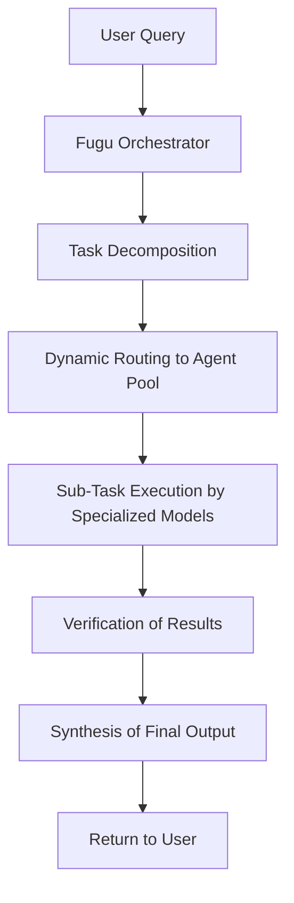
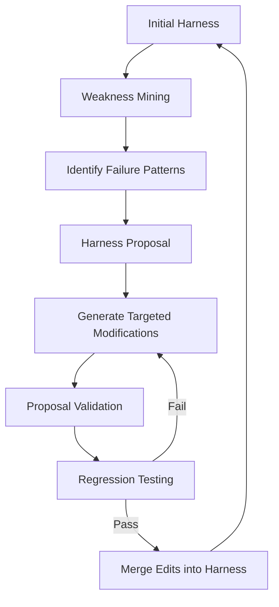

> 💡 **TL;DR:** Sakana AI’s **Fugu** introduces a multi-agent orchestration system that dynamically routes queries across specialized AI models, matching frontier-level performance while mitigating vendor lock-in risks. Meanwhile, **Self-Harness** enables AI agents to rewrite their own rules for up to 60% performance gains, and **PP-OCRv6** delivers scalable, multilingual OCR with improved accuracy and deployment flexibility. These innovations collectively push the boundaries of resilience, adaptability, and efficiency in enterprise AI.

| Metric / Innovation Area | Insight / Takeaway |
|--------------------------|--------------------|
| **Fugu Benchmark Performance** | Fugu Ultra (93.2) and Fugu (92.9) outperform Claude Fable 5 (89.8) on LiveCodeBench; Fugu Ultra (73.7) leads on SWE-Bench Pro vs. Claude Opus 4.8 (69.2). |
| **Fugu Pricing** | Fugu Ultra: $5 (input), $30 (output) per 1M tokens; Fugu: dynamic rates based on underlying models. |
| **Self-Harness Performance Gain** | Up to 60% improvement in agent performance via automated harness optimization. |
| **PP-OCRv6 Accuracy** | +4.6% detection Hmean improvement over PP-OCRv5; supports 50 languages. |
| **PP-OCRv6 Model Sizes** | Tiny (1.5M), Small (7.7M), Medium (34.5M) parameters for edge to server deployment. |

# Sakana Fugu: Redefining Enterprise AI with Multi-Agent Orchestration

## Introduction

The AI landscape is undergoing a seismic shift. Enterprises, once content to rely on monolithic, vendor-specific models, now face a harsh reality: geopolitical export controls, sudden model restrictions, and the ever-present risk of vendor lock-in can disrupt critical workflows overnight. Sakana AI’s **Fugu** emerges as a paradigm-shifting solution—a **multi-agent orchestration system** that leverages collective intelligence to deliver frontier-level performance while abstracting away the complexities of model selection and verification. This article dives deep into Fugu’s architecture, its benchmark dominance, and why it represents the future of enterprise AI resilience.

At its core, Fugu is not just another AI model. It is a **sophisticated coordinator**, a digital maestro that decomposes complex tasks into sub-tasks, delegates them to a pool of specialized agents, verifies their outputs, and synthesizes the final result. This approach is grounded in Sakana’s 2026 research papers, **TRINITY** and **Conductor**, which introduce learned coordination strategies to replace hand-designed workflows. For end users, this multi-agent swarm operates seamlessly behind a standard OpenAI-compatible API, offering a black-box solution to the challenges of model fragmentation and access restrictions.

The urgency of such a system cannot be overstated. In June 2026, Anthropic’s decision to revoke public access to its **Claude Fable 5** and **Mythos 5** models—following a U.S. government export control order—sent shockwaves through the AI community. Enterprises that had built their infrastructure around these models were left scrambling. Fugu’s dynamic routing and swappable agent pool provide a **hedge against such disruptions**, ensuring continuity even when individual models or providers become unavailable.


## Sakana Fugu: A Multi-Agent Powerhouse

### What is Fugu?

Fugu is a **multi-agent orchestration system** designed to dynamically route queries across a diverse, proprietary pool of specialized AI models. Unlike traditional monolithic models, which attempt to handle all aspects of a task internally, Fugu breaks down complex problems into manageable sub-tasks, delegates them to expert models, verifies the results, and synthesizes the final output. This architecture leverages **collective intelligence**—the idea that a well-coordinated group of specialized agents can outperform even the most advanced single models.

The system operates as follows:
1. **Task Decomposition**: Fugu, itself an LLM, analyzes the input query and breaks it into sub-tasks.
2. **Dynamic Routing**: Sub-tasks are delegated to the most suitable models from a pool of specialized agents, which may include instances of Fugu itself (recursive orchestration).
3. **Verification**: Each sub-task’s output is verified for accuracy and relevance.
4. **Synthesis**: Verified results are combined into a cohesive final output.

This workflow is entirely abstracted from the end user, who interacts with Fugu via a single API endpoint. The proprietary nature of the routing logic and model pool ensures robustness and compliance, though it also means users do not have visibility into which specific models are being used for any given query.



### Key Features

Fugu is available in two variants, each optimized for different use cases:

- **Fugu**: Designed for **everyday tasks**, this variant prioritizes low latency and cost efficiency. It is ideal for interactive chatbots, coding assistants (e.g., integration with Codex), and other high-volume, low-complexity workloads.
- **Fugu Ultra**: Engineered for **high-stakes tasks**, such as AI research, cybersecurity analysis, and multi-step investigations (e.g., patent research). Fugu Ultra coordinates a deeper pool of expert models and is optimized for rigorous, multi-step reasoning.

Both variants share a common architecture but differ in their depth of orchestration and the breadth of their agent pools. Critically, Fugu’s proprietary routing logic ensures that the system can **adapt dynamically** to changes in model availability or performance, making it a resilient choice for enterprises.

Pricing for Fugu reflects its dual-tiered approach:
- **Fugu**: Dynamic pricing based on the underlying models activated for a given query.
- **Fugu Ultra**: Fixed pricing at **$5 per million input tokens** and **$30 per million output tokens**, with higher rates for extreme workloads (e.g., context windows >272K tokens).

This pricing model, while premium, offers predictability for enterprises managing high-stakes workloads. It also includes detailed usage metrics, separating user-visible token generation from internal orchestration work, ensuring transparency in billing.


## Benchmark Performance: Fugu vs. Frontier Models

Fugu’s performance across a range of benchmarks underscores its ability to compete with—and often surpass—restricted frontier models. Below are some of the most notable results:

- **LiveCodeBench**: A benchmark testing coding performance on regularly refreshed, real-world software problems. Fugu Ultra scored **93.2**, while Fugu achieved **92.9**, both outperforming Anthropic’s **Claude Fable 5 (89.8)**.
- **GPQA-D (Diamond)**: A test of graduate-level multiple-choice questions in biology, physics, and chemistry. Fugu Ultra and Fugu both scored **95.5**, matching or exceeding Anthropic’s **Mythos Preview (94.6)**.
- **SWE-Bench Pro**: A benchmark evaluating software engineering tasks. Fugu Ultra scored **73.7**, significantly outperforming **Claude Opus 4.8 (69.2)** and **OpenAI’s GPT-5.5 (58.6)**.

These results highlight Fugu’s strength in **multi-step, agentic tasks**, where its ability to delegate, verify, and synthesize sub-tasks provides a clear advantage. However, Fugu is not without limitations. In benchmarks requiring **single-domain, brute-force reasoning**, such as **Humanity’s Last Exam** and **MRCRv2**, Fugu occasionally trails behind specialized monolithic models like **Claude Fable 5** or **GPT-5.5**. For example:

- **Humanity’s Last Exam**: Fugu Ultra (50.0) narrowly edged out **Opus 4.8 (49.8)** but fell short of **Fable 5 (53.3)**.
- **MRCRv2 (Long-Context Recall)**: **GPT-5.5 (94.8)** led, with Fugu Ultra at **93.6**.
- **CTI-REALM (Cybersecurity)**: **Opus 4.8 (69.6)** remained the top performer, with Fugu Ultra close behind at **69.4**.

These trade-offs illustrate a key insight: **Fugu excels in complex, multi-agent workflows but may not always match the raw reasoning power of the largest, most specialized monolithic models**—assuming uninterrupted access to those models is possible.


## Strategic Advantages: Why Enterprises Should Adopt Fugu

### Resilience Against Vendor Lock-In

The most compelling advantage of Fugu is its **resilience against vendor lock-in and geopolitical disruptions**. Traditional AI deployments often rely on a single provider’s model, creating a critical dependency. When access to that model is revoked—whether due to export controls, regulatory changes, or provider decisions—the entire system can grind to a halt.

Fugu’s dynamic routing and swappable agent pool **mitigate this risk**. If one model or provider becomes unavailable, Fugu can reroute queries to alternative models without skipping a beat. This redundancy is built into the system’s DNA, making it an attractive option for enterprises that cannot afford downtime.

Sakana AI’s CEO, **David Ha**, formerly of Google Brain, emphasized this point in a recent post: *"Relying on a single company’s model for national infrastructure is a massive risk. Collective intelligence is the practical hedge against this concentration of power. Fugu simply routes around vendor restrictions."*

### Cost Efficiency and Pricing

Fugu’s pricing model is designed to balance performance with cost efficiency. While **Fugu Ultra**’s fixed rates ($5 input, $30 output per 1M tokens) are among the higher-end options in the market, they offer **predictability** for enterprises managing mission-critical workloads. For comparison, here’s a snapshot of frontier model API pricing as of mid-2026:

| Model | Input ($/1M) | Output ($/1M) | Total Cost ($/1M) |
|-------|--------------|---------------|-------------------|
| Grok 4.3 (low context) | $1.25 | $2.50 | $3.75 |
| GLM-5.2 | $1.40 | $4.40 | $5.80 |
| Claude Opus 4.8 | $5.00 | $25.00 | $30.00 |
| **Sakana Fugu Ultra** | **$5.00** | **$30.00** | **$35.00** |
| Claude Fable 5 / Mythos 5 | $10.00 | $50.00 | $60.00 |

Fugu’s pricing is competitive with other high-end models, and its **pay-as-you-go** model ensures that enterprises only pay for what they use. Additionally, Fugu’s **subscription tiers** (Standard: $20/month, Pro: $100/month, Max: $200/month) provide options for smaller teams or experimental workloads.

### Enterprise Compliance and Control

For enterprises operating in regulated industries or with strict data privacy requirements, Fugu offers **granular controls** to ensure compliance. Developers can:
- **Opt out of specific models or providers** in the routing pool to maintain corporate privacy standards.
- **Prevent their prompts from being used for future training data**, addressing concerns about data leakage.

However, it’s worth noting that Fugu is **not currently available in the EU or EEA** while Sakana works to align its black-box routing architecture with **GDPR regulations**. This temporary restriction highlights the challenges of balancing innovation with compliance in a global market.


## Self-Harness: The Future of AI Agent Customization

### Introduction to Self-Harness

While Fugu redefines how enterprises deploy AI at scale, **Self-Harness**—a framework introduced by researchers at the **Shanghai Artificial Intelligence Laboratory**—addresses a different but equally critical challenge: **how to customize AI agents for specific enterprise needs without relying on manual, ad-hoc debugging**. Traditional harness engineering (the process of tuning the system prompts, tools, and rules that govern an AI agent’s behavior) is often **time-consuming, intuitive, and difficult to scale**. Self-Harness automates this process, enabling agents to **rewrite their own rules** based on empirical evidence, leading to performance improvements of up to **60%**. 

The framework is particularly relevant in today’s fast-paced AI environment, where new models are released rapidly, and manual tuning becomes a bottleneck. As **Hangfan Zhang**, lead author of the Self-Harness paper, explained: *"The deeper issue is that the current harness-engineering paradigm often lacks a systematic feedback loop. Many edits are made based on intuition, a few observed failures, or ad-hoc debugging."*


### How Self-Harness Works

Self-Harness operates through a **three-stage iterative loop** that turns behavioral evidence into harness updates:

1. **Weakness Mining**: The agent runs a set of tasks, producing **execution traces** with verifiable outcomes. It then categorizes failed traces and identifies **model-specific failure patterns** (e.g., infinite loops, file overwrite errors, or premature task completion).
2. **Harness Proposal**: Based on these patterns, the agent—acting in a **"proposer" role**—generates a set of **diverse yet minimal harness modifications**, each tied to a specific failure mechanism. This ensures that corrections are targeted rather than generic.
3. **Proposal Validation**: Candidate modifications are evaluated through **regression tests**. An edit is promoted only if it improves performance **without causing measurable degradation** on held-out tasks. If multiple edits pass, they are merged into the next version of the harness.

This process is visualized below:



### Applications and Use Cases

Self-Harness is particularly valuable in environments where **failures can be measured deterministically** and where trial-and-error is safe. Ideal use cases include:
- **Coding**: Automating the debugging of agents that write, test, and deploy code.
- **Internal Workflow Automation**: Optimizing agents that interact with enterprise systems (e.g., CRM, ERP).
- **DevOps Pipelines**: Improving agents that manage CI/CD workflows, infrastructure provisioning, or monitoring.

For example, in a **coding environment**, an agent might struggle with a new documentation format, leading to incorrect context retrieval or patch generation. Self-Harness would:
1. Detect the failure pattern (e.g., misparsing documentation).
2. Propose a targeted harness edit (e.g., updating the prompt to handle the new format).
3. Validate the edit to ensure it resolves the issue without breaking other functionality.

In experiments on **Terminal-Bench-2.0**, a benchmark testing general tool-based execution, Self-Harness delivered **33% to 60% relative improvements** in agent performance across models like **MiniMax M2.5, Qwen3.5-35B-A3B, and GLM-5**. Notably, the improvements were **model-specific**:
- **MiniMax M2.5**: Added a "loop breaker" to prevent infinite exploration and a rule to create initial artifacts early.
- **Qwen3.5-35B-A3B**: Introduced strict command-retry discipline to avoid file overwrite errors.
- **GLM-5**: Added rules to persist environment variables and repair failed sanity checks.

### Limitations and Considerations

While Self-Harness automates the tedious work of harness engineering, it is not without trade-offs:
- **Computational Overhead**: The system requires **repeated proposal generation, parallel candidate evaluation, and regression testing**, which can increase API token usage, latency, and infrastructure costs.
- **Evaluation Pipeline Dependency**: Self-Harness relies on **strict, deterministic verifiers** to ensure edits are beneficial. Without rigorous ground truth, the system risks promoting harmful updates.
- **Domain Suitability**: It is best suited for environments where **failures are measurable and trial-and-error is safe**. High-stakes domains (e.g., medical decision-making, legal advice, or safety-critical infrastructure) are **not ideal** for full automation due to the potential for subjective or costly errors.

As **Hangfan Zhang** noted, *"The evaluation system is not an optional component; it is what lets us trade human intuition for empirical evidence."* This underscores the importance of robust evaluation pipelines in deploying Self-Harness effectively.


## PP-OCRv6: Scalable Multilingual OCR for Real-World Text Extraction

### Overview

While Fugu and Self-Harness focus on **AI orchestration and agent customization**, **PP-OCRv6**—the latest generation of PaddlePaddle’s OCR model family—addresses a more traditional but no less critical challenge: **accurate, scalable, and multilingual text extraction**. PP-OCRv6 supports **50 languages** across three model sizes:
- **Tiny (1.5M parameters)**: Optimized for edge devices and latency-sensitive applications.
- **Small (7.7M parameters)**: Balanced for mobile and desktop use cases.
- **Medium (34.5M parameters)**: Designed for accuracy-oriented, server-side pipelines.

PP-OCRv6 achieves a **+4.6% improvement in detection Hmean** and **+5.1% in recognition accuracy** over its predecessor, **PP-OCRv5_server**, making it a state-of-the-art solution for real-world OCR tasks.


### Architectural Innovations

PP-OCRv6 introduces several key improvements to its **detection** and **recognition** modules:

1. **Text Detection**: Uses **RepLKFPN (Re-parameterized Large Kernel Feature Pyramid Network)**, a lightweight yet powerful architecture designed for **multi-scale text detection**. This is particularly important for real-world inputs, where text may be small, dense, rotated, or embedded in complex backgrounds.
   - The detection module’s objective can be represented as:
     $$\text{Hmean} = \frac{2 \times \text{Precision} \times \text{Recall}}{\text{Precision} + \text{Recall}}$$
     where **Hmean** is the harmonic mean of precision and recall, a standard metric for evaluating detection performance.

2. **Text Recognition**: Employs **EncoderWithLightSVTR**, which combines **local context modeling** with **global attention** to improve recognition quality, especially for challenging text crops (e.g., multilingual text, screen text, industrial characters, or noisy images).

Both modules share a **unified backbone**, **PPLCNetV4**, ensuring consistency across the model family. This architectural coherence simplifies deployment and maintenance, as developers can leverage the same underlying framework across different model sizes.


### Deployment Flexibility

PP-OCRv6 is designed for **versatility**, with support for multiple inference backends:
- **Transformers (Hugging Face)**: Ideal for PyTorch-oriented environments.
- **ONNX Runtime**: Portable for ONNX-based deployment (e.g., edge devices, mobile).
- **Paddle Inference**: Native PaddlePaddle inference format.

This flexibility ensures that PP-OCRv6 can be seamlessly integrated into diverse environments, from **edge devices** to **cloud servers**. Below is an example of how to deploy PP-OCRv6 using the **PaddleOCR** library with different backends:

```python
# Example: Running PP-OCRv6 with Paddle Inference (Default)
from paddleocr import PaddleOCR

ocr = PaddleOCR(
    use_doc_orientation_classify=False,
    use_doc_unwarping=False,
    use_textline_orientation=False,
)
result = ocr.predict("https://paddle-model-ecology.bj.bcebos.com/paddlex/imgs/demo_image/general_ocr_002.png")
for res in result:
    res.print()
    res.save_to_img("output")
    res.save_to_json("output")
```

```python
# Example: Running PP-OCRv6 with Transformers Backend
from paddleocr import PaddleOCR

ocr = PaddleOCR(
    use_doc_orientation_classify=False,
    use_doc_unwarping=False,
    use_textline_orientation=False,
    engine="transformers",  # Hugging Face backend
)
result = ocr.predict("https://paddle-model-ecology.bj.bcebos.com/paddlex/imgs/demo_image/general_ocr_002.png")
```

```python
# Example: Running PP-OCRv6 with ONNX Runtime Backend
from paddleocr import PaddleOCR

ocr = PaddleOCR(
    use_doc_orientation_classify=False,
    use_doc_unwarping=False,
    use_textline_orientation=False,
    engine="onnxruntime",  # ONNX Runtime backend
)
result = ocr.predict("https://paddle-model-ecology.bj.bcebos.com/paddlex/imgs/demo_image/general_ocr_002.png")
```

### Performance and Use Cases

PP-OCRv6’s performance metrics across its model tiers are as follows:

| Model | Model Size | Detection Hmean | Recognition Accuracy | Typical Use Cases |
|-------|------------|------------------|----------------------|-------------------|
| PP-OCRv6_tiny | 1.5M params | 80.6% | 73.5% | Edge devices, lightweight local OCR, latency-sensitive demos |
| PP-OCRv6_small | 7.7M params | 84.1% | 81.3% | Mobile, desktop, balanced OCR services, multilingual OCR |
| PP-OCRv6_medium | 34.5M params | 86.2% | 83.2% | Server-side pipelines, industrial OCR, document ingestion |

These models are particularly well-suited for:
- **Document Scanning**: Extracting text from invoices, receipts, or legal documents.
- **Multilingual Applications**: Supporting 50 languages, including Chinese, Japanese, and 46 Latin-script languages.
- **Industrial OCR**: Reading text from labels, serial numbers, or manufacturing marks.
- **Automated Data Extraction**: Integrating with RAG (Retrieval-Augmented Generation) pipelines or analytics systems.


## Conclusion

The advancements in **multi-agent orchestration (Fugu)**, **self-improving agents (Self-Harness)**, and **scalable OCR (PP-OCRv6)** represent a **paradigm shift** in how enterprises and developers approach AI deployment. Sakana AI’s Fugu demonstrates that **collective intelligence** can match—and often surpass—the performance of monolithic frontier models while providing **resilience, adaptability, and cost efficiency**. Self-Harness automates the tedious process of harness engineering, enabling agents to **continuously improve** without human intervention. PP-OCRv6 delivers **state-of-the-art OCR performance** with unmatched flexibility for real-world applications.

As AI continues to evolve, these innovations will play a pivotal role in driving **productivity, redundancy, and compliance** across industries. The future of AI is not just about bigger models—it’s about **smarter orchestration, self-improving systems, and scalable, specialized tools** that can adapt to the ever-changing demands of the enterprise landscape.

Written with [Argos](https://github.com/Neilstid/argos)