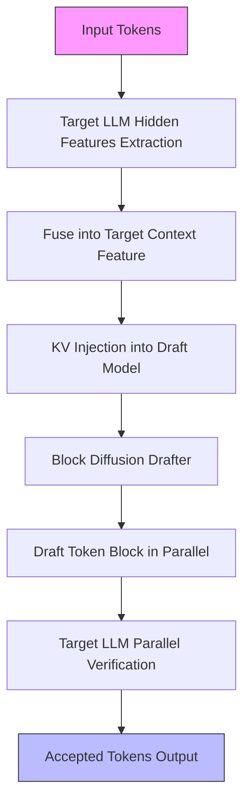
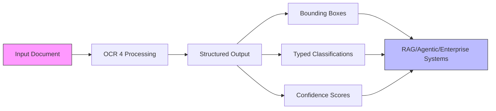
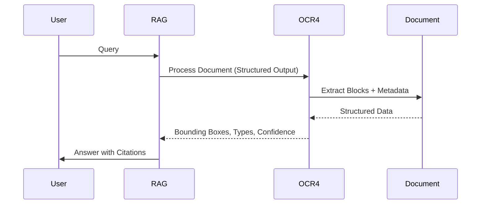

> 💡 **TL;DR:** UC San Diego’s **DFlash** redefines LLM decoding with speculative parallelism, achieving up to **15x throughput** on NVIDIA Blackwell by drafting entire token blocks in parallel. Meanwhile, **Mistral OCR 4** transforms document processing with structured outputs—bounding boxes, typed classifications, and confidence scores—supercharging RAG, agentic workflows, and enterprise search. Together, these innovations mark a pivotal shift in AI efficiency and document intelligence.

| Metric / Innovation Area | Insight / Takeaway |
|--------------------------|---------------------|
| **DFlash Speedup** | Up to **6.08x lossless speedup** on Qwen3-8B; **15x throughput** on NVIDIA Blackwell at fixed interactivity. |
| **DFlash Architecture** | Lightweight **block diffusion model** with **KV injection** for parallel token block drafting. |
| **Mistral OCR 4 Output** | **Structured data**: Bounding boxes, typed classifications, per-word/per-page confidence scores. |
| **OCR 4 Language Support** | **170 languages** across 10 language groups, with gains in rare/low-resource languages. |
| **OCR 4 Benchmark** | **72% win rate** vs. leading systems; **85.20** on OlmOCRBench, **93.07** on OmniDocBench. |
| **Deployment** | DFlash integrates with **SGLang, vLLM, TensorRT-LLM**; OCR 4 runs in a **single self-hosted container**. |

---

# DFlash: Revolutionizing Large Language Model Decoding with Speculative Parallelism

## Introduction

The AI landscape is undergoing a seismic shift, with **large language models (LLMs)** at its epicenter. Yet, one persistent bottleneck has plagued even the most advanced systems: **autoregressive decoding**. Traditional LLMs generate text one token at a time, a process as painstaking as building a skyscraper brick by brick. This sequential dependency leaves modern GPUs underutilized, turning inference into a sluggish, resource-intensive ordeal—especially for long Chain-of-Thought (CoT) reasoning tasks where latency dominates generation time.

Enter **DFlash**, a speculative decoding technique developed by researchers at UC San Diego’s **z-lab**. DFlash shatters the sequential paradigm by introducing **parallel block processing**, a method that drafts entire token blocks in a single forward pass. This innovation not only accelerates inference but also maintains **lossless output quality**, setting a new benchmark for LLM efficiency.


## What is DFlash?

DFlash reimagines speculative decoding by replacing the traditional autoregressive drafter with a **lightweight block diffusion model**. Here’s how it works:

### Core Components

1. **Block Diffusion Model**: Instead of processing tokens sequentially, DFlash drafts **entire blocks of tokens** in one go. This parallel approach drastically reduces the number of forward passes required, unlocking unprecedented speedups.
2. **KV (Key-Value) Injection**: To ensure accuracy, DFlash conditions its drafts on the **target model’s hidden features**. These features are extracted from multiple layers of the target LLM and fused into a compact **target context feature**. This feature is then injected into the **Key and Value projections** of every draft layer, persisting across drafting iterations via the KV cache.

This design ensures that the draft model—effectively a **diffusion adapter**—scales acceptance length with depth, enabling deeper, more expressive drafters without adding latency.




### Why It Matters

Traditional speculative decoding methods, such as **EAGLE-3**, still rely on autoregressive drafting, capping real-world speedups at **2–3x**. DFlash’s block-based approach eliminates this bottleneck. By drafting **16 tokens at once** (compared to EAGLE-3’s 8), DFlash achieves **lower latency and higher acceptance rates**, even with a modest **five-layer drafter** (or eight layers for Qwen3-Coder). This stands in stark contrast to earlier diffusion-based drafters like **DiffuSpec** and **SpecDiff-2**, which required **7B-parameter drafters** and still only managed **3–4x speedups**.


## Performance Enhancements

### Throughput and Speedup

DFlash delivers **transformative performance improvements** across a range of models and tasks:

- **Research Benchmarks**: On **Qwen3-8B** with greedy decoding, DFlash achieves an **average speedup of 4.86x**, peaking at **6.08x** on the **MATH-500** task (with a **τ (tau) of 7.87**). Across all evaluated tasks, DFlash averages a **τ of 6.49**, significantly outpacing EAGLE-3’s **1.76x–2.02x** range.
- **NVIDIA Blackwell Throughput**: On **gpt-oss-120b** running on **eight NVIDIA Blackwell GPUs** in a **DGX B300 system**, DFlash achieves **up to 15x higher throughput** at a fixed interactivity target (500–600 tokens/sec per user). This is **1.5x higher** than EAGLE-3 at the same interactivity level.

The table below highlights DFlash’s per-task speedups on **Qwen3-8B** (temperature = 0, Transformers backend):

| Task (Qwen3-8B, temp=0) | Baseline | EAGLE-3 (16) | DFlash (16) | DFlash τ |
|---|---|---|---|---|
| GSM8K | 1.00x | 1.94x | **5.15x** | **6.54** |
| MATH-500 | 1.00x | 1.81x | **6.08x** | **7.87** |
| AIME25 | 1.00x | 1.79x | **5.62x** | **7.08** |
| HumanEval | 1.00x | 1.89x | **5.14x** | **6.50** |
| MBPP | 1.00x | 1.69x | **4.65x** | **5.95** |
| LiveCodeBench | 1.00x | 1.57x | **5.51x** | **7.27** |
| MT-Bench | 1.00x | 1.63x | **2.75x** | **4.24** |
| **Average** | 1.00x | **1.76x** | **4.86x** | **6.49** |

### Practical Impact

DFlash’s speedups translate into tangible benefits for **latency-sensitive applications**:

1. **Coding Agents**: On **Gemma 4 31B** with **vLLM**, DFlash achieves **5.8x speedup** on **Math500** and **5.6x** on **HumanEval** at concurrency 1, reducing wait times in agent loops.
2. **Reasoning Models**: For long **Chain-of-Thought** traces, DFlash maintains **~4.5x speedup** under greedy decoding and **~3.9x** under sampling on **Qwen3-4B/8B**, slashing the cost of extended reasoning.
3. **Serving and Throughput**: On **SGLang** with a **B200 GPU**, DFlash reaches **5.1x speedup** on **Qwen3-8B** (Math500, concurrency 1). While gains taper with higher concurrency, they remain positive, ensuring **lower serving costs**.

### Framework Integration

DFlash is designed for seamless adoption, with **20 pre-trained checkpoints** and support for leading LLM frameworks:

- **SGLang**: A framework for efficient LLM inference.
- **vLLM**: A lightweight, high-throughput LLM serving library.
- **TensorRT-LLM**: NVIDIA’s optimized inference acceleration library.

**Example: Deploying DFlash with vLLM**

```bash
vllm serve Qwen/Qwen3.5-27B \\
--speculative-config '{"method": "dflash", "model": "z-lab/Qwen3.5-27B-DFlash", "num_speculative_tokens": 15}' \\
--attention-backend flash_attn \\
--max-num-batched-tokens 32768
```

**Example: Using DFlash with Transformers**

```python
from transformers import AutoModel, AutoModelForCausalLM, AutoTokenizer

# Load draft and target models
draft = AutoModel.from_pretrained(
    "z-lab/Qwen3-8B-DFlash-b16", trust_remote_code=True,
    dtype="auto", device_map="cuda:0").eval()

target = AutoModelForCausalLM.from_pretrained(
    "Qwen/Qwen3-8B", dtype="auto", device_map="cuda:0").eval()

tokenizer = AutoTokenizer.from_pretrained("Qwen/Qwen3-8B")

# Prepare input
messages = [{"role": "user", "content": "How many positive whole-number divisors does 196 have?"}]
input_ids = tokenizer.apply_chat_template(
    messages, return_tensors="pt", add_generation_prompt=True,
    enable_thinking=False).to(draft.device)

# Generate with speculative decoding
output = draft.spec_generate(
    input_ids=input_ids, max_new_tokens=2048, temperature=0.0,
    target=target, stop_token_ids=[tokenizer.eos_token_id])

print(tokenizer.decode(output[0], skip_special_tokens=False))
```


## Technical Deep Dive

### How Speculative Decoding Works in DFlash

1. **Block Processing**: The draft model processes **entire blocks of tokens** in parallel, reducing the number of forward passes from *O(N)* (for *N* tokens) to *O(1)* per block.
2. **KV Injection**: Target hidden features are injected into the **Key and Value projections** of every draft layer, ensuring the draft model remains conditioned on the target’s context throughout the process.
3. **Parallel Verification**: The target model verifies the drafted block in parallel, accepting or rejecting tokens **losslessly**.

This approach leverages the **“target knows best”** principle: the target LLM’s hidden states encode information about multiple future tokens, and DFlash extracts and fuses these states to guide the draft model.

### Mathematical Intuition

The speedup achieved by DFlash can be understood through the lens of **amortized cost**. In traditional autoregressive decoding, the cost per token is:

$$ C_{\text{AR}} = N \cdot c_{\text{forward}} $$

where *N* is the number of tokens and *c_{\text{forward}}* is the cost of a single forward pass.

With DFlash’s block diffusion drafting, the cost becomes:

$$ C_{\text{DFlash}} = \left\lceil \frac{N}{B} \right\rceil \cdot c_{\text{block}} + N \cdot c_{\text{verify}} $$

where *B* is the block size (e.g., 16 tokens), *c_{\text{block}}* is the cost of drafting a block, and *c_{\text{verify}}* is the cost of parallel verification. Since *c_{\text{block}}* is **independent of *B*** (due to parallelism), the amortized cost per token decreases as *B* increases.

### Comparison with Traditional Methods

| Feature | Traditional Autoregressive Decoding | EAGLE-3 | DFlash Speculative Decoding |
|---------|--------------------------------------|---------|-----------------------------|
| Token Processing | Sequential | Sequential (Tree-Based) | **Parallel (Blocks)** |
| Forward Passes | High (*O(N)*) | Moderate (*O(N/log N)*) | **Low (*O(1) per block)*** |
| Drafter Size | N/A | Large (e.g., 7B) | **Lightweight (5–8 layers)** |
| Throughput | Baseline | **2–3x** | **Up to 15x** |
| Acceptance Length | N/A | Limited by Tree Size | **Scales with Draft Depth** |


## Implications for AI Development

### For Researchers

DFlash opens new frontiers for **LLM inference optimization**, enabling:

- **Faster Prototyping**: Researchers can experiment with larger models and longer outputs without prohibitive latency.
- **Cost-Effective Scaling**: Reduced inference costs make it feasible to deploy **bigger, more capable models** in production.
- **New Architectures**: The success of block diffusion drafting may inspire hybrid architectures that blend **autoregressive and parallel** generation.

### For Enterprises

With support for **SGLang, vLLM, and TensorRT-LLM**, DFlash is poised to become a **cornerstone of enterprise AI deployments**:

- **Real-Time Applications**: Low-latency inference enables **interactive AI agents**, **coding assistants**, and **customer-facing chatbots**.
- **Cost Savings**: Higher throughput means **fewer GPUs** are needed to serve the same number of users, reducing operational costs.
- **Future-Proofing**: As hardware advances (e.g., **NVIDIA Blackwell**), DFlash’s parallelism ensures **scalability** with next-gen GPUs.

### Future Directions

The potential for DFlash extends beyond its current implementation:

- **Hardware Co-Design**: Custom **AI accelerators** could be optimized for block diffusion drafting, further boosting speedups.
- **Multi-Modal Extensions**: Applying DFlash’s principles to **vision-language models** (e.g., for parallel image captioning).
- **Dynamic Block Sizing**: Adaptive block sizes based on **task complexity** or **hardware constraints**.


---

# Structured OCR Output: Transforming RAG and Enterprise Search with Mistral OCR 4

## Introduction

While DFlash revolutionizes **LLM inference**, **Mistral OCR 4** is transforming how machines **understand and process documents**. Traditional OCR systems have long been limited to **raw text extraction**, leaving critical contextual information—such as **layout, structure, and confidence**—untapped. Mistral’s latest release changes this paradigm by introducing **structured document output**, a feature that supercharges **Retrieval-Augmented Generation (RAG)**, **agentic workflows**, and **enterprise search**.


## What is Mistral OCR 4?

Mistral OCR 4 is a **document-understanding model** that goes beyond mere text extraction. It introduces three key innovations:

1. **Structured Output**: Each extracted element (e.g., text, tables, equations) is returned with:
   - **Bounding Boxes**: Precise spatial coordinates for localization.
   - **Typed Classification**: Labels identifying the content type (e.g., title, table, signature).
   - **Confidence Scores**: Per-word and per-page accuracy metrics.
2. **Multilingual Support**: Covers **170 languages** across 10 language groups, with **improved performance on rare and low-resource languages**.
3. **Self-Hosted Deployment**: Runs in a **single container**, enabling **data residency** and **compliance** for enterprise use cases.




### Why It Matters

Structured output enables downstream systems to **understand not just what a document says, but where and how it says it**. This is critical for:

- **Citations**: Linking generated responses to **specific document regions**.
- **Redactions**: Identifying and masking **sensitive information** (e.g., PII).
- **Human-in-the-Loop Verification**: Flagging **low-confidence extractions** for manual review.


## Key Features and Functionalities

### Structured Document Output

OCR 4’s structured output includes:

- **Bounding Boxes**: Pixel-level coordinates for each text block, enabling **spatial reasoning** (e.g., “the table on page 3, top-right”).
- **Block Types**: Classification into **titles, paragraphs, tables, equations, signatures**, etc.
- **Confidence Scores**: Granular metrics for **per-word** and **per-page** accuracy, allowing systems to **gate low-confidence outputs** for review.

### Integration with RAG and Agentic Pipelines

OCR 4’s structured data is a **game-changer** for:

1. **RAG Systems**:
   - **Precision Retrieval**: Structured blocks serve as **better retrieval units** than raw text, improving context relevance.
   - **Citation-Ready Inputs**: Enables **source-grounded answers** with direct references to document regions.
2. **Agentic Workflows**:
   - **Structural Primitives**: Agents can **act on documents** (e.g., filling forms, extracting tables) using typed blocks and bounding boxes.
   - **Dynamic Decision-Making**: Confidence scores guide **adaptive processing** (e.g., auto-approve high-confidence fields, flag low-confidence ones).
3. **Enterprise Search**:
   - **Enhanced Indexing**: Structured metadata improves **search accuracy** and **entity extraction**.
   - **Compliance and Auditing**: Bounding boxes and confidence scores support **traceable, verifiable** document processing.

### API-Friendly Design

OCR 4 simplifies integration with:

- **Single API Endpoint**: One call handles both **raw extraction** and **schema-driven Document AI** output.
- **Self-Hosted Deployment**: Enterprises can run OCR 4 **on-premises** for **data privacy** and **regulatory compliance**.
- **Batch Processing**: **Batch-API** reduces costs to **$2 per 1,000 pages** (vs. $4 for standard API).


## Practical Applications

### RAG Systems

Structured OCR output enables RAG pipelines to:

- **Retrieve with Precision**: Use bounding boxes and block types to **filter and rank** document segments more effectively.
- **Generate Citable Responses**: Link answers to **specific document regions**, enhancing transparency and trust.

**Example Workflow**:



### Enterprise Search

Enterprises leverage OCR 4 for:

- **Accurate Document Search**: Structured metadata improves **recall and precision** in search results.
- **Automated Redaction**: Identify and **mask sensitive data** (e.g., SSNs, credit card numbers) using block types and confidence scores.
- **Archive Digitization**: Convert **legacy documents** (PDFs, scans) into **searchable, structured data**.

### Agentic Workflows

Agents powered by OCR 4 can:

- **Process Invoices**: Extract **line items, totals, and vendor details** from invoices with **bounding boxes** for form-filling.
- **Analyze Contracts**: Identify **clauses, signatures, and dates** in multilingual contracts.
- **Validate Data**: Route **low-confidence extractions** to human reviewers while auto-processing high-confidence fields.


## Technical Deep Dive

### How Structured OCR Works

1. **Document Scanning**: OCR 4 scans the input document (PDF, DOC, PPT, etc.) and identifies **text blocks, tables, and other elements**.
2. **Metadata Extraction**: For each block, it extracts:
   - **Bounding Box**: *(x1, y1, x2, y2)* coordinates.
   - **Block Type**: Classification (e.g., `title`, `paragraph`, `table`).
   - **Confidence Scores**: Per-word and per-page accuracy metrics.
3. **Integration Layer**: The structured output is fed into **RAG, agentic, or search systems** via a **unified API**.

### Benchmark Performance

Mistral OCR 4 outperforms leading systems across multiple benchmarks:

- **Human Evaluation**: Independent annotators preferred OCR 4 over **every leading system tested**, with a **72% win rate** across 600+ documents in 12+ languages.
- **Automated Benchmarks**:
  - **85.20** on **OlmOCRBench** (public benchmark).
  - **93.07** on **OmniDocBench**.
  - **0.98** on Mistral’s internal **Crawl Multilingual** evaluation.
- **Customer Results**:
  - **Rogo**: Equivalent accuracy at **8x lower cost** and **17x lower latency** vs. leading agentic parsers.
  - **Anaqua**: **4x faster** per page than its incumbent provider.

### Comparison with Traditional OCR

| Feature | Traditional OCR | Mistral OCR 4 |
|---------|-----------------|----------------|
| Output Structure | Raw Text | **Structured (Bounding Boxes, Types, Confidence)** |
| Language Support | Limited (e.g., 10–20 languages) | **170 Languages** |
| Integration | Manual Post-Processing | **Single API Endpoint** |
| Deployment | Cloud-Dependent | **Self-Hosted Container** |
| Use Cases | Basic Text Extraction | **RAG, Agentic Workflows, Enterprise Search** |


## Working with the API

OCR 4’s API is designed for **simplicity and flexibility**:

### Basic Extraction

```python
import os
from mistralai.client import Mistral

client = Mistral(api_key=os.environ["MISTRAL_API_KEY"])

# Process a document with structured output
ocr_response = client.ocr.process(
    model="mistral-ocr-latest",
    document={
        "type": "document_url",
        "document_url": "https://arxiv.org/pdf/2201.04234"
    },
    include_blocks=True,  # Include typed blocks and bounding boxes
    table_format="html",   # Options: None, "markdown", "html"
    include_image_base64=True
)

# Access structured output
for page in ocr_response.pages:
    print(f"Page {page.page_number}:")
    print(f"Markdown: {page.markdown}")
    print(f"Bounding Boxes: {page.bounding_boxes}")
    print(f"Block Types: {page.block_types}")
```

### Confidence-Gated Pipelines

```python
# Request per-word confidence scores
ocr_response = client.ocr.process(
    model="mistral-ocr-latest",
    document={"type": "document_url", "document_url": "https://arxiv.org/pdf/2201.04234"},
    confidence_scores_granularity="word"  # or "page" for aggregates
)

# Check confidence scores for human review
for page in ocr_response.pages:
    for word in page.word_confidence_scores:
        if word.confidence < 0.8:  # Flag low-confidence words
            print(f"Low confidence: {word.text} (score: {word.confidence})")
```

### Document AI Mode

For **schema-driven output**, OCR 4 can transform raw OCR results into **structured JSON** using Mistral’s **mistral-small-2603** model:

```python
# Enable Document AI mode for schema-driven output
ocr_response = client.ocr.process(
    model="mistral-ocr-latest",
    document={"type": "document_url", "document_url": "https://example.com/invoice.pdf"},
    include_blocks=True,
    document_ai_config={
        "prompt": "Extract invoice number, date, and total amount.",
        "schema": {
            "invoice_number": "string",
            "date": "date",
            "total": "float"
        }
    }
)

# Output is structured JSON matching the schema
print(ocr_response.document_ai_output)
```


## Implications for AI Development

### For Researchers

OCR 4’s structured output enables new research directions:

- **Multimodal RAG**: Combining **text + layout** for better retrieval in **document-heavy domains** (e.g., legal, medical).
- **Low-Resource Languages**: With support for **170 languages**, OCR 4 is a tool for **cross-lingual document understanding**.
- **Benchmarking**: Structured metadata allows for **more nuanced evaluations** of OCR systems.

### For Enterprises

OCR 4 is a **force multiplier** for enterprise AI:

- **Cost Reduction**: **Batch processing** and **self-hosting** reduce reliance on expensive cloud services.
- **Compliance**: **Data residency** and **audit trails** (via bounding boxes and confidence scores) support **GDPR, HIPAA**, and other regulations.
- **Automation**: **Agentic workflows** can now **automate document-heavy processes** (e.g., invoice processing, contract analysis) with **human-level accuracy**.

### Future Directions

The roadmap for OCR 4 includes:

- **Real-Time Processing**: While currently optimized for **batch and interactive** workflows, future versions may support **streaming OCR** for live documents.
- **Custom Schemas**: Expanding **Document AI mode** to support **user-defined schemas** for niche use cases.
- **Integration with LLMs**: Tighter coupling with **LLMs for post-processing** (e.g., summarization, Q&A) directly from OCR output.


---

# Conclusion: A New Era for AI Efficiency and Document Intelligence

DFlash and Mistral OCR 4 represent **two sides of the same coin**: **accelerating AI inference** and **enriching AI understanding**. DFlash’s **speculative parallelism** unlocks **order-of-magnitude speedups** for LLMs, while OCR 4’s **structured output** transforms how machines **interpret and act on documents**.

Together, these innovations address **two of the most pressing challenges in AI today**:

1. **The Latency Bottleneck**: DFlash’s **parallel block processing** makes **real-time, interactive AI** a reality, even for **large, reasoning-heavy models**.
2. **The Context Gap**: OCR 4’s **structured metadata** bridges the gap between **raw text and actionable insights**, enabling **smarter RAG, agentic workflows, and enterprise search**.

As these technologies mature, we can expect a **paradigm shift** in how AI is **deployed, scaled, and utilized**—from **faster, cheaper inference** to **richer, more reliable document understanding**. The future of AI is not just **smarter**; it’s **faster, more precise, and more actionable** than ever before.


---

### Key Takeaways

- **DFlash** achieves **up to 15x throughput** on NVIDIA Blackwell by drafting **entire token blocks in parallel**, using a **lightweight block diffusion model** with **KV injection**.
- **Mistral OCR 4** introduces **structured output** (bounding boxes, typed classifications, confidence scores) for **170 languages**, supercharging **RAG, agentic workflows, and enterprise search**.
- Both technologies are **production-ready**, with **DFlash integrating into SGLang, vLLM, and TensorRT-LLM**, and **OCR 4 deployable in a single self-hosted container**.
- The **future of AI** lies in **parallelism (DFlash)** and **structured understanding (OCR 4)**, enabling **faster, smarter, and more scalable** applications.

Written with [Argos](https://github.com/Neilstid/argos)