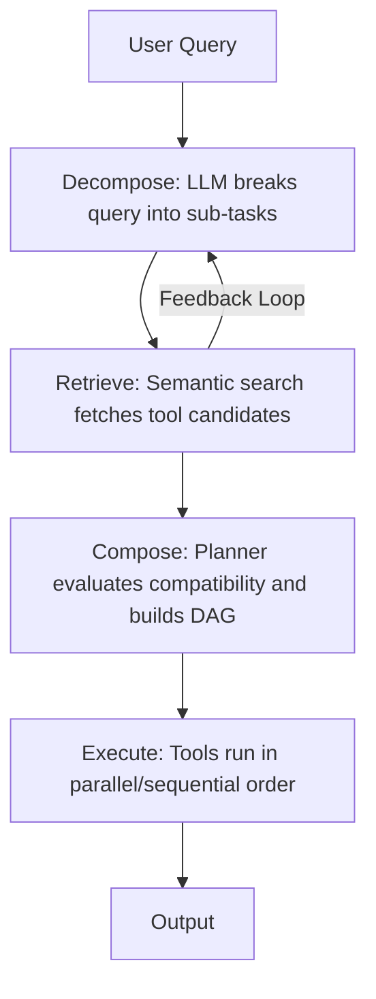
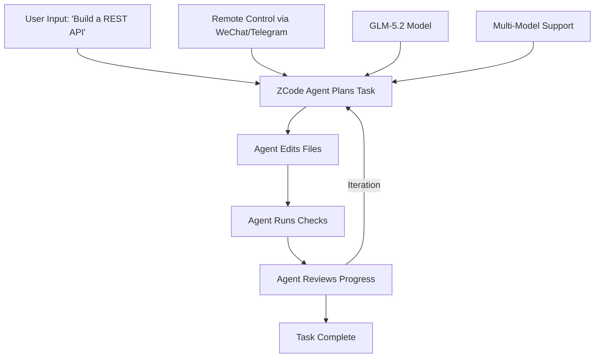
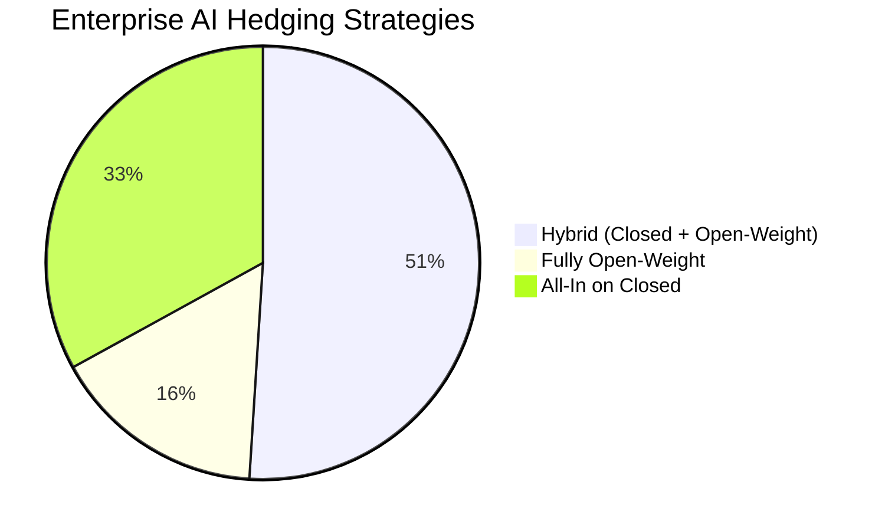

> 💡 **TL;DR:** AI agents are transforming enterprise workflows with advancements like **SkillWeaver**, a framework by Alibaba that slashes token usage by 99% through skill-aware decomposition, and **ZCode**, Z.ai’s agentic coding environment powered by the sovereign GLM-5.2 model. These innovations address critical challenges in efficiency, accuracy, and geopolitical risks, while enterprises grapple with the "Control Gap"—a disparity between rapid AI adoption and weak governance mechanisms.

| Metric / Innovation Area | Insight / Takeaway |
|--------------------------|-------------------|
| **Token Efficiency (SkillWeaver)** | Reduces token consumption by **99%** compared to naive tool exposure, from ~884K to ~1.16K tokens per query. |
| **Accuracy Improvement (SkillWeaver)** | Skill-Aware Decomposition (SAD) boosts task accuracy from **51%** to **92%** for complex, multi-skill workflows. |
| **Model Parameters (GLM-5.2)** | 744B-parameter Mixture-of-Experts (MoE) model with **40B active parameters**, trained on **28.5T tokens**. |
| **Context Window (GLM-5.2)** | **1M-token context window**, 5x larger than its predecessor, enabling long-horizon tasks. |
| **ZCode Pricing** | Starts at **$16.20/month**, undercutting competitors like Claude Code and Cursor by up to **82%**. |
| **Enterprise AI Hedging** | **67%** of enterprises use hybrid strategies (closed + open-weight models) to mitigate vendor dependency risks. |
| **AI Governance Gap** | Only **10%** of enterprises have automated monitoring for AI model drift or failures; **79%** have faced financial/operational failures due to shadow AI. |

---

### Introduction

The AI agent landscape is evolving at a breakneck pace, reshaping how enterprises automate workflows, route tasks, and make decisions. Two recent innovations—**SkillWeaver** and **ZCode**—exemplify this transformation. SkillWeaver, developed by Alibaba, introduces a **compositional approach** to tool routing, drastically improving efficiency and accuracy. Meanwhile, Z.ai’s **ZCode** leverages the **GLM-5.2** model to offer an agentic development environment that challenges industry giants like GitHub Copilot and Claude Code. These advancements are not just technical marvels; they address pressing challenges like **token efficiency, sovereign access risks, and the Control Gap**—the widening disparity between AI deployment and governance in enterprises.

This article explores the mechanics, implications, and future outlook of these innovations, while also examining the broader enterprise AI strategies in a world where geopolitical risks and vendor dependencies are becoming impossible to ignore.

---

### SkillWeaver: A Paradigm Shift in Skill-Based Routing

#### The Challenge of Skill Routing in AI Agents

As AI agents scale to handle complex, multi-step workflows, the problem of **skill routing**—matching user queries to the right tools—becomes increasingly acute. Traditional approaches, such as exposing entire tool libraries to Large Language Models (LLMs), are inefficient. They overwhelm the model’s context window, consume excessive tokens, and often lead to inaccurate tool selection. For example, a query like *“Download the dataset, transform it, and create visual reports”* requires breaking the task into atomic sub-tasks (e.g., API calls, data processing, visualization) and sequencing them into a cohesive plan. Most existing frameworks treat routing as a **single-skill selection problem**, which fails to address the **compositional nature** of real-world queries.

Enter **SkillWeaver**, a framework developed by Alibaba researchers that reframes skill routing as a **compositional problem**. Instead of relying on brute-force methods, SkillWeaver introduces a structured, three-stage pipeline: **Decompose, Retrieve, and Compose**, coupled with a novel feedback loop called **Skill-Aware Decomposition (SAD)**.

#### How SkillWeaver Works

1. **Decompose**: An LLM acts as a **task decomposer**, breaking down a complex user query into a sequence of atomic sub-tasks. For instance, the query *“Download the dataset, transform it, and create visual reports”* is split into:
   - Download the dataset (e.g., using `api-client` or `http-fetch`)
   - Transform the data (e.g., using `csv-parser` or `etl-pipeline`)
   - Create visual reports (e.g., using `chart-gen`)

2. **Retrieve**: The system uses **semantic search** (e.g., MiniLM embeddings with a FAISS index) to compare each sub-task against a library of **2,209 real-world skills** (sourced from the Model Context Protocol ecosystem). This step shortlists the top candidate tools for each sub-task.

3. **Compose**: A **planner** evaluates the retrieved candidates for **inter-skill compatibility**, ensuring the outputs of one tool flow seamlessly into the inputs of the next. It then constructs a **Directed Acyclic Graph (DAG)** to map dependencies, enabling parallel execution where possible.

The **key innovation** in SkillWeaver is **Skill-Aware Decomposition (SAD)**, a feedback loop that iteratively refines the task decomposition. Here’s how it works:
- The LLM drafts an initial decomposition plan.
- A preliminary semantic search retrieves loosely matching skills.
- These retrieved skills are fed back to the LLM as **hints**, allowing it to rewrite the decomposition to align with the actual tools available in the library.

This addresses a critical challenge: LLMs often generate **generic step descriptions** that fail to match the **technical vocabulary** of the tools in the library. SAD ensures the decomposition’s granularity and terminology perfectly align with the available skills.

#### Key Innovations: Skill-Aware Decomposition (SAD)

SAD’s feedback loop is a game-changer for **compositional skill routing**. In experiments, the researchers found that:
- Without SAD, a **7B-parameter model (Qwen2.5-7B-Instruct)** achieved only **51% decomposition accuracy** (i.e., correctly predicting the number of steps).
- With SAD, accuracy **jumped to 67.7%**. For larger models like **Qwen-Max**, accuracy soared to **92%**. 
- On **hard tasks** (requiring 4-5 distinct skills), SAD improved accuracy by **50%**. 

Interestingly, **larger models performed worse without SAD**. A **14B-parameter model** saw its accuracy plummet below the 7B model’s because it tended to **over-decompose** tasks into unnecessary, microscopic steps. SAD’s tool hints **anchored the model back to reality**, proving that **aligning the agent with tool vocabulary** is often more impactful than simply using a larger LLM.

#### Practical Impact and Benchmarks

SkillWeaver’s **retrieve-and-route approach** delivers staggering improvements in both **accuracy** and **efficiency**:
- **Token Savings**: The brute-force **LLM-Direct** method (stuffing all tool names into the prompt) consumed **~884,000 tokens per query** while achieving only **21.1% accuracy** in tool retrieval. SkillWeaver slashed token consumption to **~1,160 tokens per query**—a **99.9% reduction**—while vastly outperforming in accuracy.
- **Speed and Cost**: Lower token usage translates directly to **faster response times** and **drastically reduced API costs**, making it viable for enterprise-scale deployments.
- **Enterprise Readiness**: SkillWeaver is built using **off-the-shelf components** (e.g., MiniLM embeddings, FAISS indexing, LangChain orchestration), making it easy for developers to reproduce or integrate into existing workflows. For example, embedding and indexing all **2,209 skills** in the benchmark took just **15 seconds**, and retrieval adds **<15ms of latency per query**.

**Benchmark (CompSkillBench)**:
- **300 multi-step queries** of varying difficulty.
- **2,209 real-world skills** across 24 functional categories (e.g., cloud infrastructure, finance, databases).
- **Baselines**: LLM-Direct (brute-force), vanilla LLM decomposition (no SAD), and ReAct-style agent loop (which **completely failed**, achieving 0% decomposition accuracy).

#### Limitations and Future Directions

While SkillWeaver excels in **routing and planning**, it currently lacks **error recovery mechanisms**. In a pilot study, the researchers noted that if an API call fails in step two of a multi-step chain, the entire workflow breaks. Future work will focus on integrating **fallback, retry, and error-handling mechanisms** to make SkillWeaver production-ready. Additionally, the framework’s reliance on **semantic search** means it may struggle to consistently rank the **perfect tool** as the top candidate (achieving this only **37% of the time**). Teams may need to implement a **secondary cross-encoder or LLM-based reranker** to reorder the top 10 candidates.

For developers, SkillWeaver’s **SAD prompt templates** are publicly available, and the framework can be implemented using standard libraries like **LangChain, LlamaIndex, or raw Python scripts**. The researchers also found that swapping in a stronger embedding model (e.g., **BGE-base-en-v1.5**) immediately boosted accuracy without fine-tuning.

---

### ZCode: The Future of Agentic Coding Environments

#### Introduction to ZCode

On June 26, 2026, **Z.ai** (formerly Zhipu AI) officially launched **ZCode**, a **free desktop application** billed as an **Agentic Development Environment (ADE)** purpose-built for its flagship **GLM-5.2** model. ZCode is not just another IDE with AI bolted on; it is an **agent-first environment** designed for **long-horizon tasks**. Unlike traditional IDEs that rely on chat sidebars or autocomplete extensions, ZCode’s core workflow revolves around **continuous planning, execution, and iteration**:
1. The user describes an **outcome** (e.g., “Build a REST API for a to-do app”).
2. The **ZCode Agent** plans the work, edits files, runs checks, and reviews progress.
3. The agent continues across **multiple iterations** until the goal is met.

ZCode’s launch is a strategic move in a **$10 billion market** (per Gartner) for enterprise AI coding agents, where it competes directly with **Cursor, Claude Code, GitHub Copilot, and Google’s Antigravity**. Its timing coincides with a **geopolitical upheaval**—the U.S. export control directive that temporarily blocked access to Anthropic’s **Fable 5** model—highlighting the **sovereign access risks** of relying on closed-source AI models.

#### Core Features of ZCode

1. **Agentic Workflow**: ZCode’s **ZCode Agent** is deeply integrated with **GLM-5.2**, ensuring optimal performance for **multi-step, real-world development tasks**. The agent’s workflow is **continuous and iterative**, unlike traditional IDEs that treat AI as a secondary feature.

2. **Cross-Platform Support**: Users can manage tasks **remotely** via messaging platforms like **WeChat, Feishu, or Telegram**. This is a **key differentiator** for the Chinese developer market, where these platforms dominate professional communication. Sensitive commands (e.g., file changes, high-permission actions) require **explicit confirmation** before execution.

3. **Open-Source Model Integration**: ZCode leverages **GLM-5.2**, a **744-billion-parameter Mixture-of-Experts (MoE) model** with **40 billion active parameters**, trained on **28.5 trillion tokens**. Critically, GLM-5.2 was **built entirely on Huawei silicon**, making it a **sovereign alternative** to Western models. It boasts:
   - A **1-million-token context window** (5x larger than its predecessor).
   - **Second-place ranking** on **Code Arena** (as of mid-June 2026), trailing only Anthropic’s **Claude Fable 5**.
   - **API pricing** of **$1.40 per million input tokens** and **$4.40 per million output tokens**—an **82% cost reduction** compared to Anthropic’s Claude Opus 4.8.

4. **Subscription Model**: ZCode is **free to download**, with revenue flowing through **GLM Coding Plan** subscriptions:
   - **Lite**: $16.20/month
   - **Max**: $144/month
   These prices **undercut competitors** like Claude Code and Cursor by significant margins. Through July 31, 2026, ZCode offers a **1.5x effective quota bonus** for Coding Plan subscribers, with off-peak token consumption charged at a **0.67x coefficient**.

5. **Multi-Model Support**: While optimized for GLM-5.2, ZCode also supports **Claude Code, Codex, Gemini, and OpenCode**, acknowledging that no single model excels at every task.

#### Geopolitical and Economic Implications

ZCode’s launch is inextricably linked to the **U.S. export control directive** issued on June 12, 2026, which **suspended access** to Anthropic’s **Fable 5** and **Mythos 5** models for all foreign nationals—including foreign employees of Anthropic. The directive sent shockwaves through the AI industry, as enterprises in **finance, healthcare, SaaS, and critical infrastructure** found their core AI services **abruptly disabled** without warning or recourse.

While the directive was **lifted on June 30**, the episode exposed a critical vulnerability: **sovereign access risk**. Enterprises realized that their AI workflows could be **disabled overnight by government order**, rendering traditional evaluation criteria (e.g., benchmark scores, pricing) secondary to a more fundamental question: *Will this tool still work tomorrow?*

ZCode’s **BYOK (Bring Your Own Key) architecture** and **MIT-licensed open weights** for GLM-5.2 offer a partial solution. Enterprises can:
- **Download the model** and host it on their own infrastructure.
- **Run ZCode against it** without touching Z.ai’s cloud, eliminating **U.S. export-control risk** and **Chinese data-sovereignty concerns** in one move.

However, users of Z.ai’s **cloud API** remain subject to **Chinese law**, a risk that only **pure self-hosting** can mitigate.

#### Competitive Landscape and Market Dynamics

ZCode enters a **crowded and fast-moving market** for enterprise AI coding agents, estimated at **$9.8–11 billion annually** (Gartner, 2026). The market is defined by:
- **Frontier model providers** (e.g., Anthropic, OpenAI) moving into **direct competition** with application-layer vendors (e.g., GitHub, Cursor).
- **Gartner’s 2026 Magic Quadrant** naming **Anthropic, Cursor, GitHub, and OpenAI** as Leaders in the newly rebranded **“Enterprise AI Coding Agents”** category. Z.ai was not among the 12 vendors evaluated, highlighting its **nascent enterprise presence outside China**.

ZCode’s competitive advantages include:
1. **Deep Integration with GLM-5.2**: First-party optimization ensures **seamless performance** and **no manual endpoint configuration**.
2. **Aggressive Pricing**: Starts at **$16.20/month**, a fraction of Western competitors.
3. **Self-Hosting Capabilities**: **MIT-licensed open weights** allow enterprises to deploy GLM-5.2 on their own infrastructure, eliminating **regulatory kill-switch risks**.

However, ZCode faces challenges:
- **Limited Linux Support**: Currently in **beta**. 
- **Security Concerns**: Reviewers flag the need for **careful evaluation** of credential handling, especially for **remote development over SSH** and **messaging-platform-triggered tasks**.
- **Competition**: Established players like **Cursor ($2B ARR)**, **Claude Code ($2.5B ARR)**, and **GitHub Copilot** have **mature ecosystems** and **strong distribution networks**.

#### Challenges and Future Outlook

Z.ai’s **$128 billion valuation** (as of June 22, 2026) reflects investor confidence, but the company must still prove it can:
- **Build trust with Western enterprises** amid escalating **U.S.-China tech tensions**. 
- **Mature ZCode’s ecosystem** to compete with **Cursor’s polished UX** and **Claude Code’s deep agent primitives**. 
- **Sustain profitability** while losing money (Z.ai is not yet profitable).

Early community reception has been **enthusiastic**, with users praising ZCode’s **stability** and clamoring for more **Coding Plan capacity**. However, the **hard questions remain**: Can a Chinese AI company **compete globally** in a market dominated by Western players? And can ZCode’s **agentic workflow** and **sovereign model** outweigh its current limitations?

One thing is clear: The **Fable 5 blackout** proved that access to the world’s best coding models can **vanish overnight**. ZCode’s **open-source model, aggressive pricing, and self-hosting capabilities** make it a compelling **fallback option**—and in some cases, a **superior alternative** to closed-source tools.

---

### The Broader Impact: AI Governance and Enterprise AI Strategies

#### Vendor Dependency and the Control Gap

The **Anthropic export control directive** exposed the **fragility of enterprise AI strategies**. Two-thirds of enterprises had already implemented **hedging strategies** before the directive was issued:
- **51%** use a **hybrid model**: closed frontier models (e.g., Fable 5) for general reasoning + open-weight models (e.g., GLM-5.2) deployed locally for specialized tasks.
- **16%** have **fully pivoted** to open-weight models, moving core workflows off closed APIs entirely.
- **32%** remain **all-in on closed ecosystems** (e.g., Microsoft, OpenAI, Anthropic).

The directive was a **live stress test** for the **Control Gap**—the disparity between **how aggressively enterprises deploy AI** and **how little of it they can see, own, or govern**. Key findings from **VentureBeat Pulse Research** (145 enterprises surveyed in June 2026) include:

#### Key Findings from Enterprise Surveys

1. **Monitoring and Visibility**:
   - Only **10% of enterprises** have **automated monitoring** to detect AI model drift, failures, or misbehavior in production.
   - **30%** rely on **human review** of critical outputs (slow, inconsistent, and unscalable).
   - **19%** would **hear about failures from end users first**. 
   - **8%** have **no systematic visibility** into production AI behavior at all.

2. **Financial and Operational Failures**:
   - **79% of enterprises** have experienced **real financial or operational failures** due to **autonomous agents**, including:
     - **49%**: **Shadow AI** (departmental teams running unauthorized agentic pipelines on corporate credit cards, bypassing oversight).
     - **25%**: **Infinite-loop bills** (uncaught recursive workflows racking up thousands in token costs).
     - **6%**: **Database degradation** (unthrottled agent queries corrupting production databases).
   - Only **21%** report **guarded stability** (hard token throttling and budget caps at the infrastructure layer).

3. **Governance Barriers**:
   - **32%**: **No single owner** for AI across platforms (the **#1 barrier** to governance).
   - **25%**: **Vendor opacity** (lack of transparency from AI providers).
   - **16%**: **Missing tooling** (lack of observability and monitoring tools).
   - **5%**: **Lack of talent** (surprisingly low, suggesting the issue is **organizational**, not technical).

4. **AI Surface Complexity**:
   - **85% of enterprises** run **two or more platforms** claiming to be the “primary” AI layer (e.g., ERP, ITSM, productivity suites, data platforms).
   - **36%** have **four or more competing platforms**.
   - Only **8%** have **consolidated to one platform**.

#### Recommendations for Enterprises

To close the **Control Gap**, enterprises should:

1. **Adopt Hybrid AI Strategies**:
   - Use **closed frontier models** (e.g., Fable 5, GPT-5.6) for **high-impact, general reasoning tasks**. 
   - Deploy **open-weight models** (e.g., GLM-5.2, Llama 3) **locally** for **specialized, cost-sensitive workflows**. 
   - **Right-size models**: Use smaller, specialized models for routine tasks (e.g., **semantic routing** to decide which requests need frontier-scale reasoning).

2. **Implement Automated Monitoring**:
   - Deploy **AI observability tools** to detect **model drift, failures, or misbehavior** in real-time.
   - **Layer human review on top of automation**: Critical outputs should still be **manually reviewed and signed off** (as done by **Liberty Mutual** and **Morgan Stanley**).

3. **Assign AI Ownership**:
   - **38% of enterprises** have a **central team** governing AI behavior across platforms.
   - **21%** have **unclear or contested ownership**. 
   - **17%** have **no formal accountability** for AI at all.
   - **Solution**: Assign a **single accountable owner** (e.g., a **Chief AI Officer** or **AI Governance Team**) to oversee **cost, drift, and model choice** across all platforms.

4. **Right-Size AI Models**:
   - **Per-token inference costs** are falling **70–80% annually**, but **agentic workloads** consume **100–500x more tokens** than traditional LLM tools.
   - **Example**: For **resolving an insurance claim**, a **smaller, specialized model** may suffice—no need for a **frontier model** that knows the **history of Western civilization**.
   - **Pair models with semantic routing** to dynamically allocate tasks to the **most cost-effective model**.

5. **Address Shadow AI**:
   - **49% of enterprises** have faced **shadow AI** incidents (unauthorized agentic spending on corporate cards).
   - **Solution**: Implement **budget caps, token throttling, and approval workflows** at the **infrastructure layer**.

---

### Conclusion

The advancements in **AI agents**, exemplified by **SkillWeaver** and **ZCode**, are pushing the boundaries of what AI can achieve in **enterprise settings**. From **efficient skill routing** to **agentic coding environments**, these innovations not only enhance **productivity and accuracy** but also address critical challenges like **token efficiency, sovereign access risks, and geopolitical dependencies**.

As enterprises navigate the **Control Gap**, the lessons are clear:
- **Hedge your AI strategy**: Combine **closed and open-weight models** to mitigate vendor dependency risks.
- **Monitor aggressively**: Deploy **automated observability tools** to catch failures before they escalate.
- **Assign ownership**: A **single accountable team** is essential for governing AI across platforms.
- **Right-size your models**: Not every task requires a **frontier model**—**semantic routing** can save costs and improve efficiency.

The future of AI in enterprise is **dynamic, competitive, and fraught with both opportunity and risk**. Tools like **SkillWeaver** and **ZCode** are not just **technical marvels**—they are **strategic imperatives** for enterprises looking to **future-proof** their AI workflows in an era of **geopolitical uncertainty** and **rapid innovation**. 

The question is no longer *whether* to adopt AI agents, but *how* to do so **responsibly, efficiently, and sustainably**. The answer lies in **balancing innovation with governance**—and the clock is ticking.

Written with [Argos](https://github.com/Neilstid/argos)