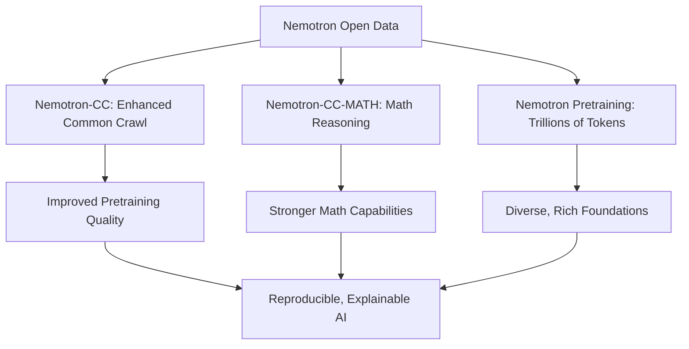
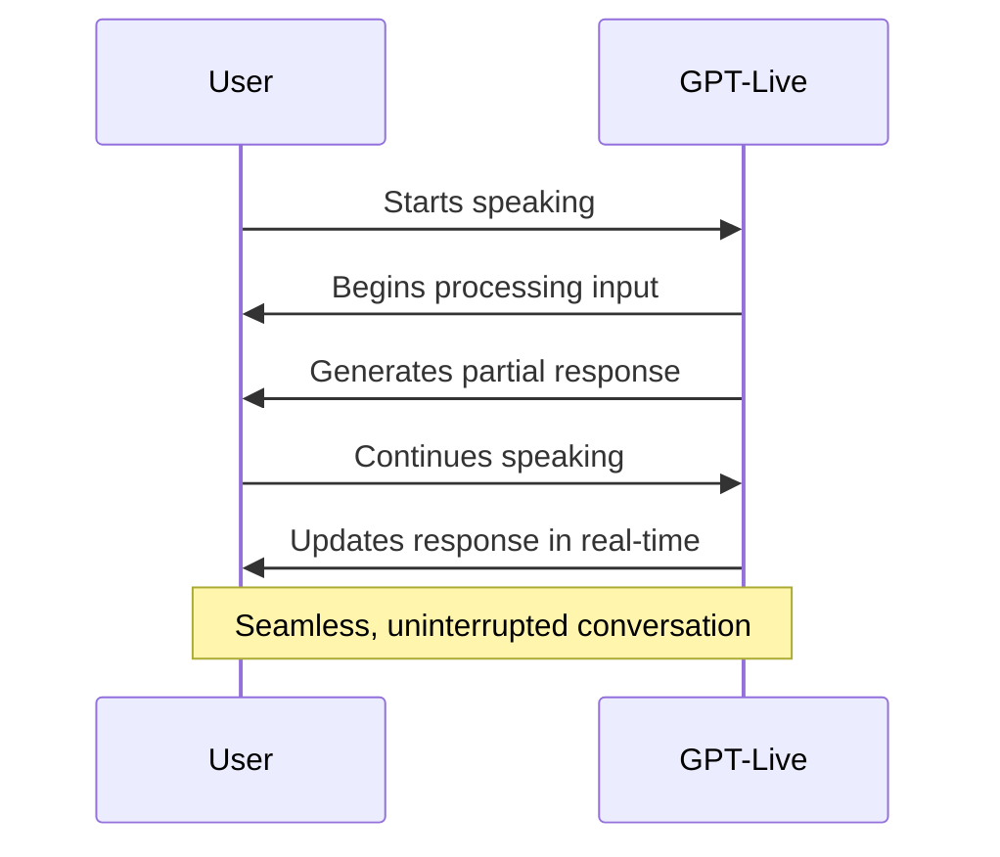
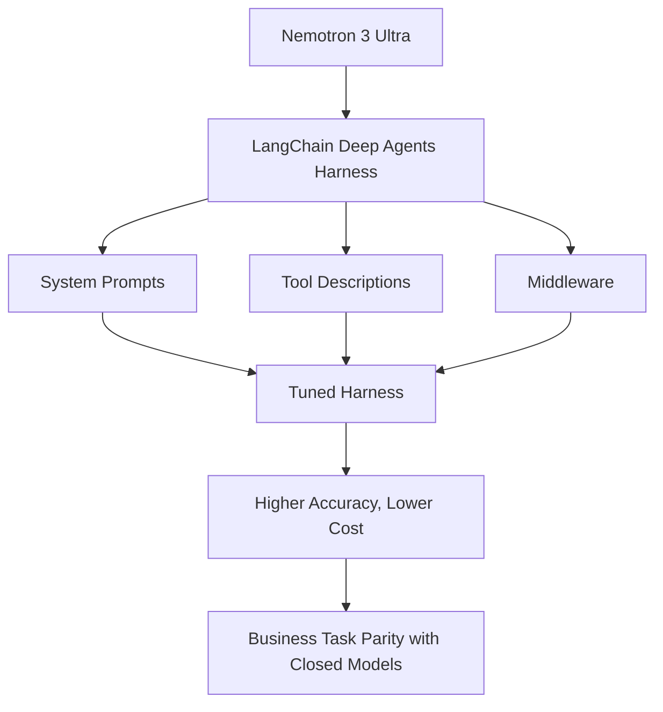

> \\u2728 **TL;DR:** NVIDIA Nemotron is revolutionizing AI with open datasets like Nemotron-CC and Nemotron-Personas, enabling transparency, inclusivity, and agentic innovation, while OpenAI’s GPT-Live introduces full-duplex voice AI for seamless, human-like conversations. Together, these advancements are setting new benchmarks for AI collaboration, safety, and user experience.

| Metric / Innovation Area | Insight / Takeaway |
|--------------------------|---------------------|
| **Nemotron 3 Ultra Performance** | Achieves business task parity with top closed models at 10x lower inference cost, tuned via LangChain’s Deep Agents harness. |
| **Open Data Initiatives** | Nemotron-CC, Nemotron-CC-MATH, and Nemotron Pretraining datasets foster reproducibility, explainability, and global collaboration. |
| **Synthetic Data Scale** | Over 10 trillion pretraining tokens and millions of post-training samples released, with tools like the Post-Training v3 Prompt Atlas for inspectability. |
| **Cultural Inclusivity** | Nemotron-Personas mirrors regional demographics for 2.4B+ people across 10 countries, ensuring locally grounded AI. |
| **GPT-Live Architecture** | Full-duplex voice AI enables simultaneous listening and speaking, with modular design decoupling voice and reasoning layers. |
| **Safety in GPT-Live** | Real-time safeguards and synthetic evaluations improve safety scores in categories like self-harm and hate speech. |

### Introduction

The AI landscape is undergoing a seismic shift, driven by two parallel revolutions: the democratization of data and the humanization of interaction. On one front, NVIDIA’s Nemotron initiative is dismantling the walls around AI development by releasing open datasets, tools, and frameworks that prioritize transparency, reproducibility, and cultural inclusivity. On another, OpenAI’s GPT-Live is redefining how humans converse with machines, introducing full-duplex voice technology that mirrors the fluidity of natural dialogue.

These advancements are not merely incremental; they represent a paradigm shift in how AI is built, deployed, and experienced. This article explores the technical depth and transformative potential of these innovations, from Nemotron’s open data ecosystems to GPT-Live’s real-time voice interactions, and why they matter for the future of AI.

---

### NVIDIA Nemotron: Open Data and Agentic Breakthroughs

#### Nemotron’s Open Data Initiatives

NVIDIA Nemotron is not just another entry in the race for larger models—it is a commitment to *open* AI development. At its core, Nemotron addresses a critical challenge: **AI models are only as good as the data they are trained on, and that data must be accessible, diverse, and inspectable**. Nemotron’s open data products—**Nemotron-CC**, **Nemotron-CC-MATH**, and **Nemotron Pretraining**—are designed to empower researchers, developers, and enterprises to build AI systems that are not only powerful but also *explainable* and *reproducible*.

- **Nemotron-CC** enhances the Common Crawl dataset with synthetic data, improving pretraining quality for large language models.
- **Nemotron-CC-MATH** focuses on mathematical reasoning, providing a synthetic dataset of math problems to bolster models’ problem-solving capabilities.
- **Nemotron Pretraining** is a vast collection spanning general text, code, math, and synthetic data across **trillions of tokens**, offering a rich foundation for model training.

These datasets are not just about scale; they are about **diversity** and **inspectability**. As NVIDIA’s VP of Applied Deep Learning Research, Bryan Catanzaro, notes: \"every company is built around a secret\"—a unique workflow, corpus, or customer pattern. Synthetic data allows organizations to preserve these proprietary insights while contributing to a shared, open ecosystem. This approach fosters **trust** and **collaboration** without compromising competitive advantages.

#### Nemotron Post-Training v3 Prompt Atlas

Understanding agent behavior is a complex task, especially when models interact with tools, APIs, and multi-step workflows. The **Nemotron Post-Training v3 Prompt Atlas** is an interactive visual tool that maps the post-training data landscape, allowing developers to explore, filter, and inspect prompts by dataset, domain, or tool use. Each point on the map represents a prompt sample, clustered semantically to reveal patterns in agentic behavior, safety, or reasoning.

For example, a developer can zoom into a cluster of prompts related to **coding algorithms** or **safety protocols**, examine representative samples, and use these insights to curate better datasets or debug model behavior. This level of transparency is critical for building **trustworthy** and **adaptable** AI agents.

The mathematical foundation of such clustering often relies on embeddings and similarity metrics. For a prompt embedding vector **$x$**, the similarity between two prompts can be computed using cosine similarity:

$$ \\text{similarity}(x, y) = \\frac{x \\cdot y}{\|x\| \|y\|} $$

This ensures that semantically similar prompts are grouped together, enabling intuitive exploration.

#### Nemotron-Personas: Culturally Grounded Synthetic Data

AI systems must reflect the diversity of their users, yet most datasets are trained on narrow, often Western-centric data. **Nemotron-Personas** addresses this gap by generating **culturally grounded synthetic personas** that mirror official regional demographics, languages, and occupations. Built using **NVIDIA’s NeMo Data Designer**, this dataset now covers **10 countries**, representing over **2.4 billion people**.

The goal is not to recreate real individuals but to ensure AI systems are tested against the **local nuances** of their target users. For instance, a toxicity classifier trained on English internet data might miss hostile messages in Korean or Japanese, where aggression is often encoded in politeness levels rather than explicit vocabulary. Nemotron-Personas enables developers to **locally ground** their models, ensuring they are inclusive and contextually aware.

This initiative underscores a critical insight: **data quality is local, not universal**. Only regional experts, native speakers, and stakeholders can truly validate the fidelity of data for their communities. By releasing Nemotron-Personas openly, NVIDIA invites global collaboration to refine and expand these datasets.

#### Why Open Data Matters

Open data is the backbone of **reproducible**, **explainable**, and **collaborative** AI. Here’s why it’s a game-changer:

1. **Reproducibility**: Open datasets allow researchers to verify and build upon existing work, accelerating innovation.
2. **Explainability**: Transparent data enables developers to understand *why* a model behaves in a certain way, fostering trust.
3. **Collaboration**: Open data breaks down silos, allowing diverse stakeholders—companies, governments, researchers—to contribute without exposing proprietary secrets.

As Catanzaro emphasizes, **synthetic data** is a key enabler of this ecosystem. It allows organizations to share insights without revealing sensitive information, building a **richer shared data layer** that benefits everyone.

However, synthetic data is not a panacea. It must be integrated into a **system of data sources** with clear documentation of what was generated, grounded, or reviewed. NVIDIA advocates for *"synthetic thresholds"**—points where data can no longer be treated as purely real—and stresses the need for **grounding, lineage, and human judgment** in its use.

---

### OpenAI’s GPT-Live: The Future of Full-Duplex Voice AI

#### What is GPT-Live?

OpenAI’s **GPT-Live** marks a watershed moment in voice AI. Unlike traditional voice assistants that operate in a **half-duplex** mode (where users must pause between speaking and listening), GPT-Live introduces a **full-duplex architecture**, enabling AI to **listen and speak simultaneously**, just like a human conversation.

This innovation eliminates the unnatural pauses and latency that have long plagued voice interactions, making AI feel more **natural**, **intuitive**, and **responsive**.

#### Key Features of GPT-Live

##### Continuous Interaction

GPT-Live processes input **continuously** while generating output. This means users can interrupt, clarify, or add to their statements without waiting for the AI to finish speaking. The system dynamically adjusts its responses based on the evolving context of the conversation, creating a **fluid, human-like dialogue**.

##### Modular Design

One of GPT-Live’s most innovative aspects is its **modular architecture**, which decouples the **voice interaction layer** from the **reasoning layer**. This design allows for:

- **Scalability**: Simple conversations can be handled by lightweight models, while complex tasks are offloaded to more powerful reasoning engines like **GPT-5.5**.
- **Flexibility**: Developers can customize the voice layer independently of the reasoning layer, tailoring the system to specific use cases.

This modularity is critical for **enterprise adoption**, where AI systems must handle everything from routine queries to high-stakes decision-making.

##### Enhanced Safety Measures

Real-time voice interactions introduce unique safety challenges. OpenAI has implemented several safeguards to address these:

- **Real-Time Safeguards**: The system can intervene *during* speech to steer responses away from harmful or inappropriate content.
- **Synthetic Evaluations**: GPT-Live has undergone rigorous testing, with improved safety scores in categories like **self-harm**, **sexual content**, and **hate speech**.
- **Teen User Protections**: Additional layers of protection are in place for vulnerable users, ensuring a safer experience for all.

These measures reflect OpenAI’s commitment to **responsible AI**, ensuring that the benefits of full-duplex voice technology are realized without compromising safety.

#### Impact on AI User Experience

GPT-Live is poised to **redefine** how users interact with AI. By bridging the gap between machine and human conversation, it unlocks new possibilities for:

- **Customer Support**: AI agents can handle complex, multi-turn conversations without the awkward pauses of traditional systems.
- **Accessibility**: Full-duplex voice AI makes technology more accessible to users with disabilities or those who prefer voice over text.
- **Productivity**: Professionals can use voice AI for **real-time collaboration**, such as brainstorming, coding, or problem-solving, with the AI acting as a true partner rather than a passive tool.

The shift from **AI assistants** (which answer questions) to **AI agents** (which take action) is already underway. GPT-Live accelerates this transition by making voice interactions **seamless** and **context-aware**.

---

### Nemotron 3 Ultra: Benchmark-Leading Performance with LangChain Deep Agents

#### A New Standard for Open Models

NVIDIA’s **Nemotron 3 Ultra** is not just another large language model—it is a **proof point** for the power of open models in enterprise AI. In collaboration with **LangChain**, Nemotron 3 Ultra has achieved **benchmark-leading performance** on the **Deep Agents** evaluation suite, matching the accuracy of top closed models while operating at **10x lower inference cost**.

The key to this achievement? **Harness engineering, not fine-tuning**. Instead of retraining the model, LangChain’s team analyzed the **execution traces** of Nemotron 3 Ultra on the Deep Agents benchmark, identifying areas where the agent lost points. They then **tuned the environment around the model**, adjusting:

- System prompts
- Tool descriptions
- Middleware

This approach demonstrates that **agent performance is not just about the model—it’s about the ecosystem**. By optimizing the **harness** (the framework that orchestrates the agent’s tools, memory, and workflows), LangChain was able to unlock Nemotron 3 Ultra’s full potential without touching the model weights.

#### The Open Stack Advantage

Nemotron 3 Ultra’s success is a testament to the power of **open stacks**. Unlike closed models, which lock users into proprietary ecosystems, Nemotron 3 Ultra is part of a **fully open stack** that enterprises can **customize, own, and run anywhere**. This stack includes:

- **Open Model**: Nemotron 3 Ultra’s weights and architectures are openly available.
- **Open Harness**: The tuned Deep Agents harness is accessible via LangChain.
- **Open Runtime**: **NVIDIA NemoClaw** provides a secure runtime for executing agent actions, ensuring safety and governance.

This openness is critical for **enterprise adoption**, where organizations need **control** over their AI systems. With NemoClaw for LangChain Deep Agents, enterprises can build **specialized agents** tailored to their workflows, running them on their own infrastructure, cloud, or governance frameworks.

Companies like **Abridge**, **Amdocs**, and **Box** are already embedding these agents into their platforms, while **EY** is expanding its NVIDIA implementation capabilities to help clients customize and govern agents across high-value workflows.

#### How to Get Started

Developers can access Nemotron 3 Ultra and the tuned Deep Agents harness through multiple platforms, including:

- Baseten
- Crusoe Cloud
- DeepInfra
- Fireworks
- Nebius
- Together AI

The tuned harness is available directly via LangChain, and the **NemoClaw for LangChain Deep Agents blueprint** serves as a starting point for building specialized agents from scratch.

For enterprises, **EY** offers consulting services to help build and deploy these agents using the open stack.

---

### The Bigger Picture: Why These Innovations Matter

#### For Developers and Researchers

The combination of **open data** (Nemotron) and **full-duplex voice AI** (GPT-Live) creates a **virtuous cycle** of innovation:

- **Open data** enables developers to build **better models** with diverse, inspectable datasets.
- **Agentic frameworks** like LangChain’s Deep Agents allow for **specialized, high-performance AI** without the need for proprietary models.
- **Full-duplex voice AI** makes interactions more **natural** and **accessible**, broadening the scope of AI applications.

This ecosystem lowers the barriers to entry for AI development, democratizing access to cutting-edge tools and techniques.

#### For Enterprises

For businesses, these advancements translate into **tangible benefits**:

- **Cost Efficiency**: Nemotron 3 Ultra delivers **10x lower inference costs** than closed models, making AI more affordable.
- **Customization**: Open stacks allow enterprises to tailor AI systems to their **unique workflows** and **proprietary data**.
- **Safety and Governance**: Modular designs and open runtimes enable **better control** over AI systems, ensuring compliance and security.

As AI shifts from **assistants** to **agents**, these capabilities will be critical for integrating AI into **core business processes**, from customer service to supply chain management.

#### For Society

On a broader scale, these innovations address some of AI’s most pressing challenges:

- **Inclusivity**: Nemotron-Personas ensures AI systems are **culturally aware** and representative of diverse populations.
- **Transparency**: Open data and inspectable agent behavior foster **trust** and **accountability** in AI.
- **Accessibility**: Full-duplex voice AI makes technology more **user-friendly** for people with disabilities or those who prefer voice interactions.

By prioritizing **openness**, **safety**, and **user experience**, NVIDIA and OpenAI are setting a new standard for **responsible AI development**.

---

### Conclusion: The Road Ahead

The advancements in **NVIDIA Nemotron’s open data initiatives** and **OpenAI’s GPT-Live** represent more than just technological milestones—they are **catalysts** for a new era of AI.

Nemotron’s open datasets and agentic tools are **democratizing AI development**, making it more **transparent**, **collaborative**, and **inclusive**. Meanwhile, GPT-Live’s full-duplex voice technology is **humanizing AI interactions**, bridging the gap between machines and humans.

Together, these innovations are not only pushing the boundaries of what AI can do but also **redefining how we build, deploy, and experience AI**. As we look to the future, one thing is clear: the next frontier of AI will be shaped by **openness**, **adaptability**, and **user-centric design**.

The tools are here. The data is open. The future is agentic—and it’s speaking our language.

Written with [Argos](https://github.com/Neilstid/argos)