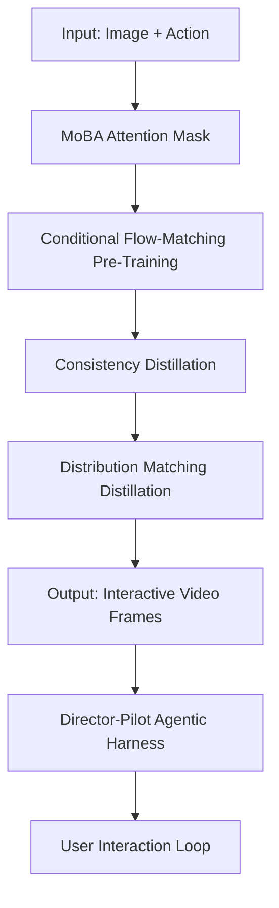
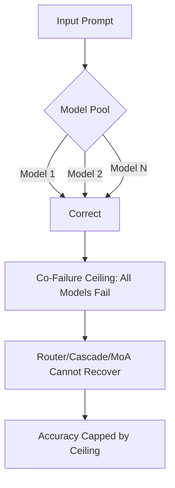
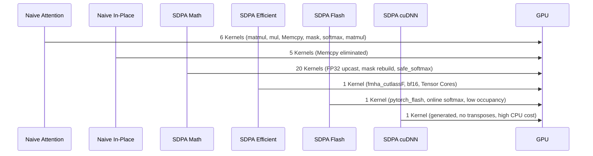

> \\💡 **TL;DR:** This article covers three pivotal AI developments: **LingBot-World-Infinity**, a 14B causal video generation model by Robbyant that simulates interactive worlds with unprecedented consistency; the **co-failure ceiling**, a newly identified limitation in multi-agent AI systems where diverse models fail simultaneously on complex prompts; and **PyTorch attention profiling**, revealing how optimized backends like Flash and Efficient Attention outperform naive implementations by leveraging fused kernels and Tensor Cores.

| Metric / Innovation Area | Insight / Takeaway |
|---|---|
| **LingBot-World-Infinity** | 14B causal video model with MoBA attention and distribution matching distillation to combat long-horizon drift. Supports 60-minute uninterrupted sessions across 20+ scenarios. |
| **Co-Failure Ceiling** | Multi-agent systems fail simultaneously on 5.2% of prompts (vs. predicted 2.3%), undermining diversity-based robustness assumptions. |
| **PyTorch SDPA Backends** | Flash and Efficient Attention backends achieve 3.7x speedups over naive math backend by fusing operations and leveraging Tensor Cores. |

---

### LingBot-World-Infinity: Revolutionizing Interactive World Simulation with Causal Video Generation

Robbyant’s **LingBot-World-Infinity** (LingBot-World 2.0) marks a paradigm shift in **embodied AI** and **interactive world modeling**. At its core, this 14B-parameter causal video generation model transforms static images and text prompts into dynamic, interactive 3D environments, addressing two critical failure modes: **long-horizon drift** (where textures and geometry degrade over time) and **interactive latency** (delays in real-time responsiveness).

#### The Architecture: MoBA and Two-Stage Training
The model’s breakthrough lies in its **Mixture of Bidirectional and Autoregressive (MoBA) Attention Mask**, a hybrid approach that combines the strengths of bidirectional and autoregressive attention. Traditional autoregressive video models suffer from **overfitting to context**, leading to visual degradation as the sequence length grows. MoBA mitigates this by appending a **bidirectional full-attention block** to the teacher-forcing mask, acting as a regularizer while enabling flexible-length generation.

Mathematically, the model formalizes interactive world generation as a **causal factorization**:
$$p_\theta(x_{1:T} \mid a_{1:T}) = \prod_t p_\theta(x_t \mid x_{<t}, a_{\leq t})$$
Here, $x_t$ represents the visual state at time $t$, and $a_t$ combines camera pose (using **Plücker embeddings**) and text prompts (injected via **cross-attention**). The camera pose is integrated through **adaptive layer normalization (AdaLN)**, while text prompts are processed chunk-wise.

To combat long-horizon drift, the team employs a **two-stage training process**:
1. **Pre-training**: Optimizes a **conditional flow-matching objective** with rectified-flow interpolation.
2. **Post-training**: Compresses the multi-step teacher into a few-step student using:
   - **Consistency distillation**: Ensures latents on the same teacher probability-flow ODE (PF-ODE) trajectory map to identical predictions.
   - **Distribution Matching Distillation (DMD)**: The generator follows the KL gradient between noised student and noised data distributions. Crucially, DMD is applied over **long self-rollout trajectories**, not just teacher-forced states, enabling the model to optimize its own prediction-induced state distribution.



#### The Agentic Harness: Director-Pilot Co-Simulation
LingBot-World-Infinity’s **Director-Pilot agentic harness** elevates it from a mere frame predictor to a fully interactive simulator. The system pairs a **Vision-Language Model (VLM) as the Director** with a **Diffusion Transformer (DiT) as the Pilot**:
- **Director (VLM)**: Governs **macroscopic semantic rules** and **causal reasoning**, proposing high-level events (e.g., "summon a snowstorm" or "spawn a creature").
- **Pilot (DiT)**: Handles **low-level physical dynamics** and **renders transitions**, ensuring realistic frame-by-frame generation.

The harness supports two interaction modes:
1. **Direct Semantic Interaction**: The VLM reads the current frame and generates **event cards** without requiring object masks.
2. **Tracking-Assisted Object Interaction**: A **Segment Anything Model (SAM)**-based loop tracks objects across chunks, allowing users to select and interact with specific entities (e.g., opening doors, rotating balls).

User inputs are game-like: **WASD** for movement, **IJKL** for view control, and dedicated keys for actions (e.g., **Space** to jump, **P** to glide). Textual interventions enable **global state shifts** (e.g., changing time of day) or **local entity injection** (e.g., spawning creatures).

#### Performance and Limitations
The model demonstrates **unbounded interaction horizons** with consistent output quality, a **distilled real-time variant** capable of driving **720p video streams at 60 fps**, and an expanded action space (e.g., attacking, archery, spell-casting). However, the public release is limited:
- Only the **14B causal-fast checkpoint** is available (other variants are marked as TODO).
- The reference script runs at **480×832 resolution on eight GPUs**, while the 60 fps headline requires an unreleased deployment stack.
- The model is licensed under **CC BY-NC-SA 4.0**, restricting commercial use.

**Code Snippet for Inference:**
```python
import torch
from diffusers import DiffusionPipeline
from diffusers.utils import load_image, export_to_video

pipe = DiffusionPipeline.from_pretrained(
    "robbyant/lingbot-world-v2-14b-causal-fast",
    dtype=torch.bfloat16, device_map="cuda"
)
frames = pipe(image=load_image("seed.png"), prompt="A serene lakeside scene...").frames[0]
export_to_video(frames, "output.mp4")
```

**Use Cases:**
- **Game and level prototyping**: Iterate on mood and assets before building a full pipeline.
- **Embodied simulation**: Generate first-person rollouts for policy learning without Unreal Engine.
- **Synthetic data for video understanding**: Chunk-wise prompts produce temporally localized events with built-in captions.
- **Agent evaluation**: Let the Director propose events and score downstream agent reactions.
- **Previsualization**: Dynamically restyle worlds mid-stream without losing reference images.

---

### The Co-Failure Ceiling: Why Multi-Agent AI Orchestration May Not Be as Effective as Expected

A recent study shatters a long-held assumption in AI: that **combining diverse models** inherently reduces failure rates. The **co-failure ceiling**—a phenomenon where **all models in a multi-agent system fail simultaneously** on a given prompt—exposes a critical flaw in the logic behind multi-agent orchestration.

#### Understanding the Co-Failure Ceiling
The co-failure ceiling arises from **common-mode atoms**: subsets of prompts where all models fail together, regardless of their individual strengths. Traditional metrics like **pairwise error correlation** fail to detect these shared failure points, leading enterprises to **underestimate failure rates by 2.25x**.

In the study, researchers evaluated **67 frontier models** (including GPT-5.5, Claude Opus 4.8, and Gemini 3.1 Pro) on the **MATH-500 benchmark**. While pairwise correlation predicted a **2.3% co-failure rate**, the actual rate was **5.2%**—more than double the expectation. For **open-ended tasks** (e.g., math problems), the co-failure rate was even higher, while **structured tasks** (e.g., SQL queries) were more predictable.



#### Why Multi-Agent Systems Fail
Enterprises often deploy multi-agent architectures under the assumption that **diversity reduces failure rates**. Common setups include:
1. **Model Routers**: Route queries to specialized models (e.g., coding vs. logic).
2. **Cascades**: Start with a cheap model, escalate to premium models if confidence is low.
3. **Mixture-of-Agents (MoA)**: Fuse outputs from multiple models via voting or synthesis.

However, these systems introduce **shadow costs**: added latency, infrastructure complexity, and governance risks. Worse, **naive majority voting across unequal models can degrade performance**. As Josef Chen, the study’s author, notes: "Diverse-but-weaker members outvote the strong one, leading to a **negative mean gain of 10 points** on hard tasks."*

#### Actionable Insights for Developers
1. **Use the Clopper-Pearson Bound**: This statistical formula provides a **worst-case scenario calculator** for co-failure rates. For example, if 5 models fail together on 2 out of 50 test queries, the true co-failure rate could be as high as **12%** (not the naive 4%).
   - **Formula**: The Clopper-Pearson bound is derived from the beta distribution and provides a confidence interval for binomial proportions.
   $$ \text{Lower bound} = \frac{x}{x + (n - x + 1)F_{\alpha/2, 2(n-x)+2, 2x}} $$ 
   $$ \text{Upper bound} = \frac{(x+1)F_{\alpha/2, 2(x+1), 2(n-x)}}{n - x + (x+1)F_{\alpha/2, 2(x+1), 2(n-x)}} $$ 
   where $x$ is the number of failures, $n$ is the sample size, and $F$ is the F-distribution quantile.

2. **Focus on Single-Model Solutions for Verifiable Tasks**: For tasks with **definitive answers** (e.g., SQL queries, JSON formatting, execution tests), a **single high-performing model** often outperforms multi-agent setups.

3. **Avoid Self-MoA Unless Models Are Matched**: Self-Mixture of Agents (Self-MoA) only works if models are within a **matched quality band**. Otherwise, it may not outperform high-correlation setups.

4. **Automate Co-Failure Calculations**: Integrate co-failure rate tracking into **CI/CD pipelines** to monitor performance as models or workloads change.

**Key Takeaway:** The co-failure ceiling reveals that **diversity alone does not guarantee robustness**. Enterprises must **profile co-failure rates** and **prioritize single-model solutions** for tasks requiring precision.

---

### Attention Profiling in PyTorch: Optimizing Performance with Scaled Dot Product Attention

PyTorch’s **Scaled Dot Product Attention (SDPA)** is a cornerstone of modern deep learning, but its performance varies dramatically across backends. A recent study dissects these disparities, revealing how **optimized backends** like Flash and Efficient Attention outperform naive implementations by **3.7x** through fused kernels and Tensor Core utilization.

#### Why Attention Profiling Matters
Attention mechanisms are computationally expensive due to their **quadratic time complexity** ($O(N^2)$ for sequence length $N$). Naive implementations suffer from:
- **Memory inefficiencies**: Redundant copies and materialization of intermediate matrices (e.g., the full $[seq, seq]$ score matrix).
- **FP32 upcasting**: Slower computations on CUDA cores instead of Tensor Cores.
- **Hidden overhead**: Operations like masking and softmax can introduce unexpected kernels (e.g., `Memcpy` for out-of-place operations).

#### Performance Disparities Across Backends
The study profiles **six attention variants**, each revealing unique insights:

| Variant | What Changed | Kernels/Forward | Key Insight |
|---|---|---|---|
| Naive Attention | Hand-built from primitives (matmul, mul, mask, softmax) | 6 | Hidden `Memcpy` from out-of-place `masked_fill`. |
| Naive In-Place | Replaced `masked_fill` with `masked_fill_` | 5 | One-line change eliminates `Memcpy` kernel. |
| SDPA Math | `F.scaled_dot_product_attention` (math backend) | 20 | Reference implementation: FP32 upcasting, mask rebuilt every call, `_safe_softmax`. **3.7x slower** than naive in-place. |
| SDPA Efficient | Efficient (xformers) backend | 1 | Fused `fmha_cutlassF` kernel, stays in bf16 on Tensor Cores. |
| SDPA Flash | FlashAttention-2 backend | 1 | Fused `pytorch_flash` kernel. Fastest, despite **13% occupancy** (deliberately heavy on-chip usage). |
| SDPA cuDNN | cuDNN backend | 1 | Per-problem generated kernel: no transposes, but **cost shifts to CPU** (214 µs vs. 138 µs for Flash). |



#### Key Findings
1. **Naive Attention’s Hidden Costs**: The out-of-place `masked_fill` introduces a `Memcpy` kernel, adding unnecessary overhead. Switching to in-place operations (`masked_fill_`) eliminates this kernel entirely.

2. **Math Backend: The Reference Trap**: The math backend is **dtype-safe and NaN-safe** but **3.7x slower** than naive in-place. It upcasts to FP32, rebuilds the causal mask on every call, and uses `_safe_softmax` to avoid NaNs. While not optimized for speed, it serves as a **baseline for correctness**.

3. **FlashAttention’s Genius**: FlashAttention-2 avoids materializing the full $[seq, seq]$ score matrix by:
   - Walking over $k$ and $v$ in **tiles**.
   - Keeping a **running softmax** (online softmax trick).
   - Accumulating output **one tile at a time**.
   This reduces memory traffic to HBM (GPU’s main memory) and enables a **single fused kernel** that stays in bf16 on Tensor Cores.

4. **cuDNN’s Trade-offs**: cuDNN generates **per-problem kernels** tailored to the input shape, eliminating transposes and using **WMMA (Warp Matrix Multiply Accumulate)** for Tensor Core acceleration. However, the **CPU cost** of selecting and preparing the kernel (214 µs) outweighs its GPU efficiency (186.3 µs) for some shapes.

#### Practical Applications
1. **For Researchers/Engineers**:
   - **Benchmark attention mechanisms** using PyTorch’s profiler to identify bottlenecks.
   - **Experiment with backends**: Use `torch.nn.attention.sdpa_kernel` to pin specific backends (e.g., Flash, Efficient).
   - **Leverage fused kernels**: Prioritize backends that fuse operations (e.g., Flash, Efficient) for large-scale models.

2. **For Data Scientists**:
   - **Optimize attention layers** in transformers to reduce latency.
   - **Use bfloat16**: Fused kernels in Flash and Efficient Attention leverage bfloat16 for speed.

**Code Snippet for Backend Selection:**
```python
from torch.nn import functional as F
from torch.nn.attention import SDPBackend, sdpa_kernel

# Pin to Flash backend
with sdpa_kernel(SDPBackend.FLASH_ATTENTION):
    output = F.scaled_dot_product_attention(q, k, v, is_causal=True)
```

**Key Takeaway:** Profiling is not just for experts—it’s a **discipline of asking "why is this happening?"** until the answer clicks. By understanding the trade-offs between backends, developers can **unlock significant performance gains** in their models.

---

### Conclusion: Navigating the AI Frontier

The three advancements covered here—**LingBot-World-Infinity**, the **co-failure ceiling**, and **PyTorch attention profiling**—each represent a leap forward in AI’s capabilities and our understanding of its limitations. 

- **LingBot-World-Infinity** demonstrates how **causal video generation** and **agentic harnesses** can create interactive worlds with unprecedented realism and consistency. Its MoBA attention and DMD techniques set a new standard for **long-horizon stability** in generative models.
- The **co-failure ceiling** serves as a cautionary tale for enterprises relying on **multi-agent orchestration**. By revealing the hidden risks of simultaneous failures, it forces a reevaluation of diversity-based strategies, advocating for **single-model solutions** in verifiable tasks.
- **PyTorch attention profiling** underscores the importance of **low-level optimization**. The disparities between backends highlight how **fused kernels** and **Tensor Core utilization** can transform theoretical efficiency into real-world speedups.

As AI continues to evolve, these insights will be critical for developers, researchers, and enterprises alike. Whether you’re building **interactive simulations**, **multi-agent systems**, or **optimized transformers**, understanding the underlying mechanics—and their pitfalls—will determine your success in this rapidly advancing field.

Written with [Argos](https://github.com/Neilstid/argos)