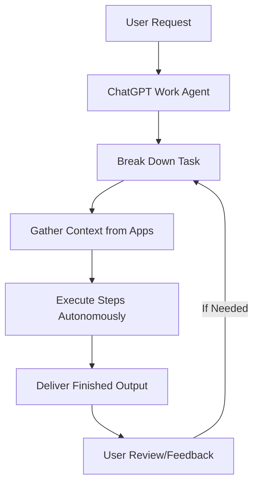
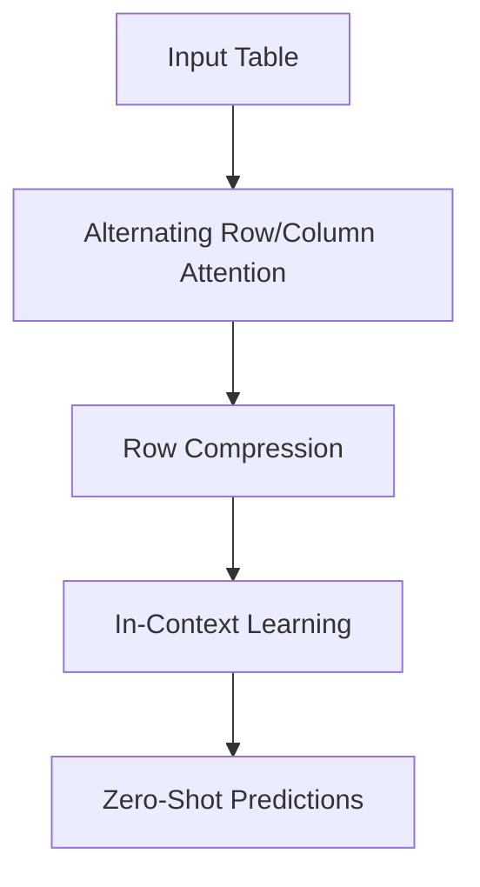

> 💡 **TL;DR:** OpenAI’s ChatGPT Work introduces a cloud-based autonomous AI agent powered by GPT-5.6, capable of executing complex, multi-step tasks across workplace tools like Slack, Gmail, and GitHub, redefining productivity. Meanwhile, Google’s TabFM revolutionizes tabular data analysis with zero-shot predictions, eliminating the need for per-dataset training. Both innovations underscore the growing importance of governed context layers in enterprise AI to ensure accuracy and reliability.

| Metric / Innovation Area | Insight / Takeaway |
|--------------------------|-------------------|
| **ChatGPT Work** | Autonomous cloud-based agent for workplace tasks, powered by GPT-5.6, available across Plus, Enterprise, and Edu tiers. |
| **User Base** | 900M weekly active users, 50M paying subscribers, 92% of Fortune 500 companies use ChatGPT. |
| **TabFM** | Zero-shot tabular predictions without per-dataset training, matching or exceeding supervised baselines on 51 datasets. |
| **Context Layer Adoption** | 25% of enterprises have a governed context layer; 58% are building or in production. |
| **Confident-Wrong Errors** | 57% of enterprises encountered AI agents providing incorrect but confident answers due to inconsistent context. |

### Introduction

The AI revolution is no longer a distant promise—it is here, reshaping how we work, analyze data, and interact with digital tools. Two groundbreaking innovations are leading this charge: **OpenAI’s ChatGPT Work** and **Google’s TabFM**. ChatGPT Work transforms AI from a conversational assistant into a **persistent, autonomous work agent**, capable of managing tasks across emails, calendars, and code repositories. Meanwhile, TabFM introduces a paradigm shift in tabular data analysis, enabling **zero-shot predictions** without the need for per-dataset training. Together, these advancements highlight the evolving role of AI in enterprise productivity and data science, while also underscoring the critical need for **governed context layers** to ensure accuracy and reliability in AI-driven decision-making.

This article explores the technical depths, practical applications, and future implications of these innovations, providing a comprehensive look at how AI is redefining the boundaries of work and data intelligence.

---

### OpenAI’s ChatGPT Work: A New Era of Autonomous AI Agents

#### A Paradigm Shift in Workplace AI

OpenAI’s latest innovation, **ChatGPT Work**, represents a bold leap forward in AI-driven productivity. Unlike traditional chatbots that respond to queries with text, ChatGPT Work is a **cloud-based AI agent** designed to autonomously execute complex, multi-step tasks across a user’s digital workspace. Powered by **GPT-5.6**, this agent can gather context from connected apps, files, and workflows to produce finished outputs—documents, spreadsheets, presentations, reports, and even websites—without human intervention.

The core architectural innovation behind ChatGPT Work is its **persistent virtual machine**, running in the cloud and always accessible, regardless of the user’s device. This design choice sets it apart from competitors whose agents require a local machine to remain powered on. As Ty Geri, a product manager at OpenAI, noted: \"What’s really exciting about ChatGPT Work is that it’s a virtual machine in the cloud that’s always on for you, and this is available across all of our paid tiers.\"

#### Key Features and Capabilities

ChatGPT Work is not just an incremental upgrade—it is a reimagining of what AI can do in a professional setting. Here’s how it stands out:

1. **Persistent Cloud Environment**: The agent operates continuously in the cloud, ensuring seamless functionality across devices. This is a deliberate departure from competitors like Anthropic’s Claude Cowork or Microsoft’s Copilot Cowork, which may require local resources.

2. **Mobile-First Innovation**: One of the most novel aspects of ChatGPT Work is its mobile-first design. Users can now **build and share websites directly from their phones**, a capability Geri described as \"missing from the market.\" This feature is particularly transformative for collaboration, allowing teams to create dynamic, interactive sites on the go.

3. **MCP-Based Plugins**: ChatGPT Work integrates with external tools like Gmail, Google Calendar, Slack, and GitHub via the **Model Context Protocol (MCP)**. This plugin architecture enables the agent to interact with workplace tools natively, automating tasks such as scheduling meetings, managing emails, or coordinating GitHub contributions.

4. **Customizable Workflows**: Users can personalize the agent’s behavior by teaching it their writing style, organizing outputs into projects, and even choosing a virtual pet to accompany them in the interface. This level of customization ensures that the agent aligns with individual workflows and preferences.

5. **Autonomous Task Execution**: The agent can break down complex tasks into smaller steps and execute them independently. For example, Geri demonstrated how ChatGPT Work could **schedule 10 bug bash sessions** across multiple features and contributors by checking Slack, GitHub, and Docs to find optimal times. Tasks that previously took 30 minutes or more can now be completed in seconds.



#### Why It Matters: Redefining Enterprise Productivity

ChatGPT Work is more than a productivity tool—it is a **strategic partner** for knowledge workers. By automating mundane and complex tasks alike, it frees up time for high-value work, such as strategic planning, creative problem-solving, and innovation. Geri emphasized that the agent is \"an extension of me, certainly not a replacement,\" highlighting its role as a collaborator rather than a competitor.

The financial stakes for OpenAI are immense. With **900 million weekly active users** and **50 million paying subscribers**, the company is positioning ChatGPT Work as a cornerstone of its enterprise strategy. The product’s availability across **Plus, Enterprise, and Edu tiers** ensures broad accessibility, driving adoption among businesses of all sizes. This aligns with OpenAI’s goal of making AI a **partner in work**, not a replacement for workers.

Moreover, ChatGPT Work enters a competitive landscape where **Anthropic’s Claude Cowork** and **Microsoft’s Copilot Cowork** are also vying for enterprise dominance. However, OpenAI’s **consumer distribution advantage**—with 92% of Fortune 500 companies already using ChatGPT—gives it a significant edge. The timing of ChatGPT Work’s launch also coincides with OpenAI’s IPO trajectory, as the company seeks to demonstrate its ability to generate **durable enterprise revenue**.

---

### Google’s TabFM: Zero-Shot Predictions for Tabular Data

#### The Challenge of Tabular Data in AI

Tabular data—structured information stored in rows and columns—is the backbone of enterprise operations. From financial ledgers to customer relationship management (CRM) systems, tabular data underpins critical business decisions. However, building reliable models for tabular data has traditionally required **extensive training, feature engineering, and retraining pipelines** to combat data drift. This process is time-consuming, costly, and often a bottleneck for data science teams.

Large language models (LLMs) have excelled in zero-shot inference for text and images, but they struggle with tabular data due to:
- **Context Limits**: LLMs quickly exhaust their context windows when processing medium-sized tables with thousands of rows and hundreds of columns.
- **Tokenization Inefficiency**: Numerical values are split awkwardly during tokenization, destroying mathematical precision.
- **Structural Blindness**: When a 2D table is serialized into a 1D text string, LLMs lose track of row-column relationships, leading to errors.

As Weihao Kong, a Research Scientist at Google Research, noted: \"That’s why, today, it is far more effective to use an LLM to write the code that handles feature engineering and calls XGBoost than to ask the LLM to read the table itself.\"

#### Introducing TabFM: A Foundation Model for Tables

Google’s **TabFM (Tabular Foundation Model)** addresses these challenges by treating tabular prediction as an **in-context learning problem**. Unlike traditional models that require per-dataset training, TabFM can generate predictions for **new, unseen tables in a single forward pass**, without updating any model weights. This reduces the time-to-production from weeks of pipeline engineering to a **single API call**.

TabFM’s architecture combines three key mechanisms:

1. **Alternating Row and Column Attention**: The model processes the raw table through a multilayer attention module that alternates between columns (features) and rows (examples). This captures complex feature interactions **without manual feature engineering**.
   - Mathematical representation of attention: $$\text{Attention}(Q, K, V) = \text{softmax}\left(\frac{QK^T}{\sqrt{d_k}}\right)V$$ where $Q$, $K$, and $V$ are queries, keys, and values derived from row/column embeddings.

2. **Row Compression**: After contextualization, the cross-attended information for each row is compressed into a **dense vector representation**. This reduces computational overhead, inspired by TabICL’s use of CLS tokens to compress row information.

3. **In-Context Learning (ICL)**: A causal Transformer operates on the sequence of compressed embeddings, enabling efficient processing of large datasets.



#### Training and Benchmarking

TabFM was trained exclusively on **hundreds of millions of synthetic datasets**, generated using **structural causal models (SCMs)**. These SCMs incorporate a wide variety of random functions, allowing TabFM to learn the fundamental mathematical priors of how tabular features interact—**without ingesting real-world, confidential data**.

To evaluate its performance, Google benchmarked TabFM on **TabArena**, a suite of 51 diverse tabular datasets spanning 38 classification and 13 regression tasks. The results were striking: **TabFM’s zero-shot predictions matched or exceeded the performance of hyper-optimized supervised baselines** in many cases. While it may not universally replace traditional models, TabFM offers **unparalleled velocity** for lean engineering teams, enabling rapid prototyping and deployment without dedicated data science resources.

For advanced use cases, Google introduced **TabFM-Ensemble**, which runs the model through 32 distinct variations and blends the results to push performance even further.

#### Practical Use Cases and Trade-offs

TabFM is particularly valuable in scenarios such as:
- **Rapid Prototyping**: Instantly spin up high-quality baseline models for new datasets.
- **High Data Drift Environments**: Adapt to changing data distributions without retraining.
- **Small to Medium-Sized Datasets**: Optimized for tables with up to **500 features** and **100,000 rows**.

However, TabFM has trade-offs:
- **Higher Inference Cost**: While training is free, inference requires more compute and memory due to the need to process the entire historical dataset as context for each prediction.
- **Latency Constraints**: TabFM’s forward-pass overhead makes it unsuitable for applications requiring **single-digit-millisecond response times**.
- **Scalability Limits**: For tables exceeding **1 million rows**, traditional models may still be preferable due to the need for aggressive row sampling.

Google has integrated TabFM into **BigQuery**, allowing analysts to run zero-shot predictions natively via the `AI.PREDICT` command. This integration places foundation model inference directly alongside data warehousing, making complex tabular machine learning as accessible as a basic database query.

For developers, TabFM offers a **scikit-learn-compatible API** (`TabFMClassifier` and `TabFMRegressor`), supporting both JAX and PyTorch backends. It natively handles mixed numerical and categorical columns and works directly with pandas DataFrames, requiring no manual preprocessing.

```python
from tabfm import TabFMClassifier
import pandas as pd

# Load data
df = pd.read_csv("customer_churn.csv")
X = df.drop("churn", axis=1)
y = df["churn"]

# Train and predict (zero-shot)
model = TabFMClassifier()
model.fit(X, y)  # No actual training; context is passed during inference
predictions = model.predict(X_new)
```

---

### The Context Layer: The Missing Piece in Enterprise AI

#### The Confident-Wrong Problem

AI agents are increasingly being deployed in enterprise settings to automate decisions, analyze data, and streamline workflows. However, a **critical flaw** has emerged: **57% of enterprises** have encountered AI agents providing **confident but incorrect answers**, according to a June 2026 survey by VentureBeat. These errors often stem from **inconsistent or stale business context**, where agents rely on retrieval-augmented generation (RAG) without a **governed context layer** to ensure accuracy.

The problem is exacerbated by the fact that **38% of enterprises** use RAG over documents as their default method for providing business context to agents. However, RAG systems are often selected based on **ease of ingestion and operational simplicity**, rather than retrieval accuracy. This leads to a situation where errors only surface **after the system is live**, potentially causing significant business disruptions.

#### Why a Governed Context Layer is Critical

A **governed context layer** acts as a **shared model of business data**, ensuring consistency and reducing errors by providing agents with a single source of truth. This layer is built once and referenced consistently, rather than being re-derived by every agent that touches the data. As Michael Ni, VP and Principal Analyst at Constellation Research, put it: \"Whoever controls runtime context controls the AI decision layer for enterprise data.\"

The adoption of governed context layers is still in its early stages:
- **25% of enterprises** currently have a context layer in production.
- **34% are building one**.
- **41% have not started**.

Among companies already using or building a context layer, **78% report having encountered confident-wrong failures**, compared to just **20% of companies with no plans to build one**. This suggests that enterprises that have already been burned by AI inaccuracies are far more likely to invest in a fix.

#### Architectural Approaches to Governed Context

Vendors are racing to develop context platforms, but there is **no consensus on architecture**. Here’s how some of the major players are approaching the problem:

- **DataHub**: Uses catalog metadata and years of analyst query behavior as a knowledge source, keeping it current as a living system.
- **Microsoft Fabric IQ**: Builds a business ontology that any agent can query over MCP.
- **Couchbase**: Pushes agent memory and context retrieval to the edge, arguing that the operational database is a more natural home for context.
- **Pinecone Nexus**: Compiles structural logic into the metadata layer ahead of runtime, betting that agents need pre-built structure more than faster search.
- **Snowflake**: Runs a two-layer system: **Horizon Context** for customer-managed definitions and **Cortex Sense** for platform-inferred context.
- **Oracle Unified Memory Core**: Folds vector, graph, and relational data into one transactional engine to eliminate sync layers.
- **Google Knowledge Catalog**: Mines query logs and usage patterns to curate semantic context automatically.
- **AWS Context**: Uses a knowledge graph that gets smarter from how agents use it, rather than manual re-curation.

Analysts agree that the underlying problem is **context fragmentation**. As Stephanie Walter, Practice Leader for AI Stack at HyperFRAME Research, noted: \"Agents don’t just need more tokens or better models. They need governed, current, low-latency context.\" The market is converging on the idea that **pre-compiled structure** is more effective than runtime chaos, but the path to implementation remains fragmented.

#### The Road Ahead for Enterprises

For enterprises, the message is clear: **retrieval alone will not close the context gap**. RAG is the default source for context in most enterprises today, but it is also the layer most closely associated with confident-wrong errors. Adding more documents or a bigger index does not fix inconsistent definitions across systems.

The **semantic context layer** is where the budget is moving. **58% of enterprises** are already engaged in building or deploying a context layer, but only **25% have one in production**. This gap highlights where enterprises have decided to invest, even if they haven’t yet arrived at a solution.

The buying decision is happening **this year**, with **57% of enterprises** planning to switch or add a retrieval or context platform within the next 12 months. This intent is concentrated among companies that have already encountered confident-wrong failures, with **81% of such enterprises** planning to adopt new tooling, compared to just **32% of those that haven’t faced the problem**.

---

### Conclusion: The Future of AI in Work and Data Science

#### ChatGPT Work: A Game-Changer for Workplaces

OpenAI’s ChatGPT Work represents a **paradigm shift** in how we interact with AI in professional settings. By integrating with workplace tools and enabling autonomous task execution, it empowers users to focus on **strategic, high-value work** rather than administrative tasks. Its availability across **Plus, Enterprise, and Edu tiers** ensures broad accessibility, making it a cornerstone of the next generation of AI tools.

The agent’s ability to handle both **mundane and complex tasks**—from scheduling meetings to analyzing user churn—demonstrates its potential to **compress months of work into days or weeks**. As Geri noted, \"Things that we would have spent three months doing, we can now spend a week doing—and do much more.\" This acceleration of productivity could redefine how teams are structured and how work is prioritized.

#### TabFM: Democratizing Tabular AI

Google’s TabFM is a **game-changer for tabular data analysis**. By enabling zero-shot predictions without per-dataset training, it reduces the complexity and time-to-production for enterprise AI workflows. TabFM’s ability to **match or exceed the performance of hyper-optimized supervised baselines** on diverse datasets makes it a powerful tool for data scientists and engineers.

While TabFM may not replace traditional models for all use cases, its **velocity and accessibility** make it ideal for rapid prototyping, high-drift environments, and small to medium-sized datasets. Its integration with **BigQuery** and scikit-learn-compatible API further lower the barrier to entry, democratizing advanced AI capabilities for a broader audience.

#### The Need for Governed Context Layers

As AI agents become more autonomous and integrated into enterprise workflows, **context accuracy** will be critical. The rise of confident-wrong errors highlights the urgent need for **governed context layers** to ensure that agents operate on consistent, reliable data. Enterprises must invest in these layers to prevent costly mistakes and unlock the full potential of AI-driven decision-making.

The future of AI in work and data science is **collaborative, autonomous, and context-aware**. With innovations like ChatGPT Work, TabFM, and governed context layers, we are entering an era where AI is not just a tool but a **strategic partner** in driving productivity, innovation, and growth. The question is no longer *if* AI will transform the workplace—it is *how quickly* we can adapt to harness its power.

Written with [Argos](https://github.com/Neilstid/argos)