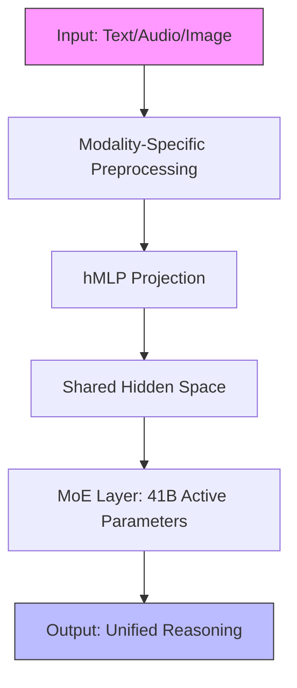
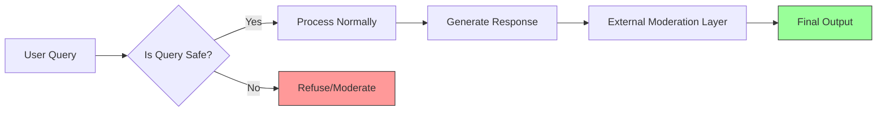

> 🎙️ **Listen to the podcast version of this article:**
> <audio controls src="podcast.wav"></audio>


---

> \u2665 **TL;DR:** Thinking Machines’ Inkling, a 975B-parameter open-source multimodal AI model, introduces controllable reasoning effort, native multimodality (text, vision, audio), and censorship resistance under an Apache 2.0 license. This article explores Inkling’s architecture, benchmarks, and enterprise implications, alongside insights from Cohere and Amazon on AI sovereignty, reliability, and the path forward for open-source AI adoption.


| Metric / Innovation Area | Insight / Takeaway |
|--------------------------|---------------------|
| **Model Scale & Architecture** | 975B total parameters, 41B active (sparse MoE), relative positional embeddings, and native multimodality (text, vision, audio). |
| **Controllable Thinking Effort** | Programmatically adjustable reasoning budget (0.2 to 0.99) for cost-performance optimization. |
| **Benchmark Performance** | Competitive in multimodal tasks (e.g., 73.3% on MMMU Pro, 77.2% on MMAU) but trails proprietary models in pure reasoning (e.g., 30.0% on HLE text-only). |
| **Censorship Resistance** | Designed to answer sensitive queries directly while maintaining safety (98.6% on StrongREJECT, 78.0% refusal rate on adversarial queries). |
| **Enterprise AI Sovereignty** | Cohere emphasizes control over the full agent stack (data, models, infrastructure, governance) to reduce vendor lock-in. |
| **AI Agent Reliability** | Amazon’s framework prioritizes consistency, robustness, predictability, and safety over raw capability. |


---

### 1. Introduction to the Breakthrough: Thinking Machines’ Inkling – The Future of Open-Source Multimodal AI

In a landscape dominated by proprietary AI giants, Thinking Machines’ **Inkling** emerges as a beacon of open-source innovation. Released under the permissive **Apache 2.0 license**, Inkling is the first natively multimodal language model to combine **text, vision, and audio** processing in a single, unified architecture. Founded by former OpenAI CTO **Mira Murati** and industry veterans like John Schulman, Thinking Machines has positioned Inkling as a tool for enterprises seeking **cost-efficiency, on-premise deployment, and programmatic control** over AI workloads.

At its core, Inkling is a **Mixture-of-Experts (MoE) model** with 975 billion total parameters, of which only **41 billion are active** during inference. This sparse activation strategy enables efficient scaling while maintaining performance. Unlike traditional transformers, Inkling employs **relative positional embeddings** instead of Rotary Positional Embedding (RoPE), a design choice that enhances its ability to handle long-range dependencies in multimodal data. Its **1-million-token context window** further solidifies its utility for complex, multi-step reasoning tasks.

Inkling’s native multimodality is achieved through an **encoder-free early fusion approach**. Audio is ingested as discrete dMel spectrograms, while visual data is processed as 40x40 pixel patches via a **hierarchical multi-layer perceptron (hMLP)**. All modalities are projected into a shared hidden space, enabling seamless cross-modal reasoning. This architecture is a departure from models that rely on bolted-on external encoders, offering a more integrated and efficient solution.



Performance benchmarks reveal Inkling as a **high-end, sub-state-of-the-art** model. It excels in **software engineering** (77.6% on SWE-bench Verified) and **voice understanding** (91.4% on VoiceBench), outperforming rivals like NVIDIA’s Nemotron 3. However, it trails proprietary models like **Claude Fable 5** and **GPT 5.6 Sol** in peak reasoning and coding tasks. For instance, Claude Fable 5 achieves **95.0% on SWE-bench Verified** compared to Inkling’s 77.6%. Yet, Inkling’s **native multimodality** keeps it competitive in vision (73.3% on MMMU Pro) and audio (77.2% on MMAU) benchmarks.

Why does this matter for enterprises? Inkling offers **true open-source freedom**—no revenue caps, no dual-use restrictions—enabling businesses to **customize, deploy on-premise, or integrate into private clouds** without vendor lock-in. Its **controllable thinking effort** mechanism, which we’ll explore next, further cements its appeal for cost-sensitive, real-world applications.


---

### 2. Controllable Thinking Effort: Redefining AI Workflows for Enterprises

One of Inkling’s most innovative features is its **controllable thinking effort**, a mechanism that allows developers to **programmatically adjust the model’s reasoning budget** on a scale from **0.2 to 0.99**. This granular control enables enterprises to **optimize token usage**—and thus costs—for tasks of varying complexity. For simple queries, a lower thinking effort reduces latency and computational overhead, while complex, multi-step reasoning tasks can leverage higher effort settings for improved accuracy.

Thinking Machines describes this as a **"continuous thinking effort"** that lets users "pick their point on the cost/performance curve." During reinforcement learning (RL) training, researchers observed an emergent phenomenon they termed **"chain of thought condensation."** Over 30 million rollouts, Inkling learned to **compress its internal reasoning steps**, dropping grammatical overhead while maintaining accuracy. This results in **drastically reduced latency** without sacrificing performance.

The practical implications are significant. Enterprises can now **dynamically allocate compute resources** based on task demands. For example:
- **Low-effort mode (0.2)**: Ideal for straightforward queries like data retrieval or simple classifications, where minimal reasoning is required.
- **High-effort mode (0.99)**: Suited for complex problem-solving, such as debugging code or synthesizing cross-modal insights.

This adaptability contrasts sharply with the **black-box scaling strategies** of frontier models, which often prioritize peak performance at the expense of efficiency. Inkling’s approach aligns with a growing enterprise demand for **predictable, cost-effective AI** that can be fine-tuned to specific workflows.

To illustrate, consider the following pseudocode for adjusting thinking effort in a hypothetical deployment:

```python
# Example: Adjusting Inkling's thinking effort for a task
from inkling import Model

model = Model(name="inkling-975b")

# Low effort for a simple Q&A task
response = model.generate(
    prompt="What is the capital of France?",
    thinking_effort=0.2
)

# High effort for a complex reasoning task
response = model.generate(
    prompt="Debug this Python function and explain the fix.",
    thinking_effort=0.99
)
```

By enabling **fine-grained control**, Inkling empowers enterprises to **balance performance with cost**, a critical factor for large-scale deployments.


---

### 3. Inkling’s Multimodality and Censorship Resistance: A Game-Changer for Enterprise AI

Inkling’s **native multimodality** is a standout feature in an era where agentic AI workflows increasingly rely on **cross-modal reasoning**. Unlike models that treat vision or audio as afterthoughts, Inkling processes all modalities **natively and simultaneously**, making it ideal for applications like **document analysis, video understanding, or multi-sensory data fusion**.

Benchmark results underscore its strengths:
- **MMMU Pro (Standard 10)**: 73.3% (competitive with proprietary models like GPT 5.6 Sol at 83.0%).
- **MMAU (Audio)**: 77.2% (close to Gemini 3.1 Pro’s 82.5%).
- **AIME 2026 (Math)**: 97.1% (outperforming DeepSeek V4 Pro’s 96.7%).

However, Inkling’s most controversial—and perhaps most valuable—feature is its **resistance to censorship**. In an AI ecosystem where open-weight models often adopt **overly restrictive safety guardrails** or echo state-aligned narratives, Inkling was explicitly designed to **answer directly on politically sensitive or censored topics**. This was validated through the **Propaganda and Censorship Eval** by AI startup Cognition, where Inkling demonstrated **"strong patterns of censorship non-compliance."**

Yet, this does not mean Inkling is unsafe. On the **StrongREJECT benchmark**, which tests responses to harmful requests, Inkling scored **98.6%**, aligning with frontier safety standards. On the **FORTRESS benchmark**, it achieved a **78.0% refusal rate** on adversarial queries (e.g., weapons, cyberattacks) while maintaining a **95.9% compliance rate** on benign queries. This balance between **openness and safety** is critical for enterprises operating in regulated or high-stakes environments.

Thinking Machines acknowledges that **external moderation tools** (e.g., Llama Guard) should still be deployed downstream to mitigate risks like jailbreaks or role-play prompts. For enterprises, this means Inkling offers **both transparency and control**—a rare combination in today’s AI landscape.




---

### 4. Enterprise AI Sovereignty: Control Over the Agent Stack – Cohere’s and Amazon’s Perspectives

As enterprises increasingly adopt AI, the concept of **AI sovereignty**—control over the full agent stack—has gained traction. **Cohere**, a leading AI lab, defines sovereignty as encompassing **data, AI models, infrastructure, and governance**. According to **Rachad Alao**, Cohere’s VP, this control is essential for **reducing vendor lock-in** and ensuring **alignment with enterprise values**.

Cohere’s approach includes:
- **Model Routing**: Dynamically selecting the best model for a given task to optimize performance and cost.
- **On-Premise Deployment**: Enabling enterprises to run models locally for **data privacy and compliance**.
- **Multimodal Search**: Extending beyond text to include **images and documents**, enhancing retrieval-augmented generation (RAG) workflows.

Cohere’s **North Mini Code** and **Command A+** models exemplify this philosophy. North Mini Code is optimized for **cost-efficient coding tasks**, while Command A+ balances **performance and versatility** for enterprise use cases. By offering **task-specific models**, Cohere helps enterprises avoid the **"one-size-fits-all"** pitfalls of indiscriminate token consumption.

Amazon, meanwhile, is tackling a different but equally critical challenge: **AI agent reliability**. At **VB Transform 2026**, **Bryan Silverthorn**, Director of AGI Autonomy at Amazon, argued that **reliability—not capability—** is the primary barrier to enterprise AI adoption. Citing Cisco data, he noted that **85% of enterprises are piloting AI agents**, but only **5% have deployed them in production**.

Silverthorn’s framework for reliability comprises four dimensions:
1. **Consistency**: Does the agent produce the same output for the same input?
2. **Robustness**: Can it handle edge cases or adversarial inputs?
3. **Predictability**: Are its failures understandable and manageable?
4. **Safety**: Does it refuse harmful or unethical requests?

He illustrated the gap between internal evaluations and real-world performance with a case study: an agent deployed for **serial number extraction** from screens worked flawlessly for two months—until a **software update** caused it to intermittently misread numbers. The root cause? The **vision encoder’s behavior varied** based on the serial number’s screen position. This underscores the need for **rigorous, real-world testing** that accounts for **dimensions of variability**.

Amazon’s solution involves a **cultural shift**. Internally, agents are treated like **"interns"**—capable but occasionally error-prone. Silverthorn advocates for **management strategies** over pure technical fixes: asking agents to **self-identify potential failures**, adding **backup systems**, and consciously accepting **calibrated risk**. For example, Amazon’s AGI lab allows agents to **run experiments autonomously**, accepting occasional mistakes in exchange for **research velocity**.

For enterprises, the takeaway is clear: **stop asking if your agent can do something impressive once; start asking if it can do it correctly a thousand times in a row**.


---

### 5. AI Agent Reliability: The Enterprise Challenge – Amazon’s AGI Autonomy Framework

Silverthorn’s insights reveal a **paradigm shift** in enterprise AI. Traditional benchmarks, which measure **peak capability**, are insufficient for production deployments. Instead, enterprises must prioritize **repeatability and reliability**.

A **VentureBeat survey** found that **50% of companies** shipped agents that passed internal evaluations but **failed in real-world scenarios**. This discrepancy arises because most enterprises **default to vendor-provided evaluations**, which often overlook **application-specific risks**.

Amazon’s **AGI Autonomy Framework** provides a roadmap for addressing these challenges:
- **Identify Dimensions of Variability**: Understand what factors (e.g., input format, environmental changes) could cause the agent to fail.
- **Match Measurement Rigor to Stakes**: High-risk applications (e.g., healthcare, finance) require **more stringent testing** than low-stakes tasks.
- **Embrace the "Intern" Metaphor**: Treat agents as **junior employees**—powerful but requiring oversight.

Practical steps for enterprises include:
1. **Adopt LLM-as-Judge Techniques**: Use AI to evaluate AI, but supplement with **human-in-the-loop validation**.
2. **Implement Redundancy**: Deploy **backup agents or fallback mechanisms** for critical tasks.
3. **Monitor Continuously**: Track **accuracy, not just uptime**, to catch silent failures.

Silverthorn also stressed that **computer use** (e.g., browser automation) will remain a core focus, but future agents will **integrate multiple tools** (e.g., MCP, APIs) to complete end-to-end workflows. For example, Amazon is already using agents to **stitch together warranty claims** across fragmented systems for a commercial trucking customer.

The ultimate goal? **Autonomous but accountable AI**—systems that can operate independently while providing **transparency, explainability, and control**.


---

### 6. Conclusion: The Path Forward for Open-Source AI and Enterprise Adoption

Thinking Machines’ **Inkling** represents a **watershed moment** for open-source AI. By combining **native multimodality, controllable reasoning, and censorship resistance** under a **permissive Apache 2.0 license**, Inkling offers enterprises a **rare blend of flexibility, control, and performance**. Its **sparse MoE architecture** and **controllable thinking effort** demonstrate that **efficiency and capability** are not mutually exclusive.

Cohere and Amazon’s contributions further highlight the **strategic imperatives** for enterprise AI:
- **Sovereignty**: Control over the **full agent stack** (data, models, infrastructure) is essential for **trust and compliance**.
- **Reliability**: **Consistency, robustness, and safety** must take precedence over raw capability in production deployments.

For readers looking to leverage these innovations, the path forward is clear:
1. **Experiment with Inkling**: Deploy it **on-premise or in private clouds** to test its multimodal and reasoning capabilities.
2. **Adopt a Sovereignty Mindset**: Evaluate tools based on **control and transparency**, not just performance.
3. **Prioritize Reliability**: Shift from **benchmarking capability** to **testing repeatability** in real-world scenarios.

The future of AI lies in **open, adaptable, and accountable systems**. With models like Inkling and frameworks from Cohere and Amazon, enterprises now have the tools to **democratize access to cutting-edge AI** while maintaining **control, safety, and efficiency**. The revolution has begun—**will your organization be part of it?**

Written with [Argos](https://github.com/Neilstid/argos)
