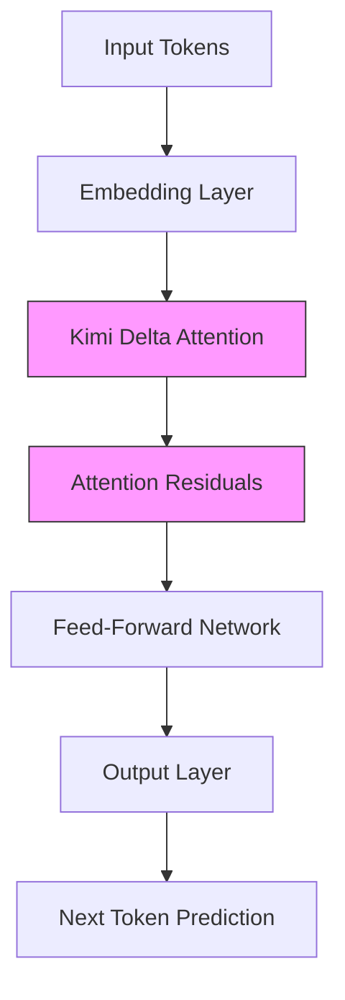
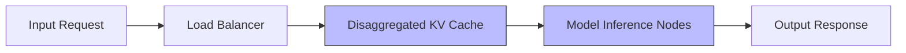
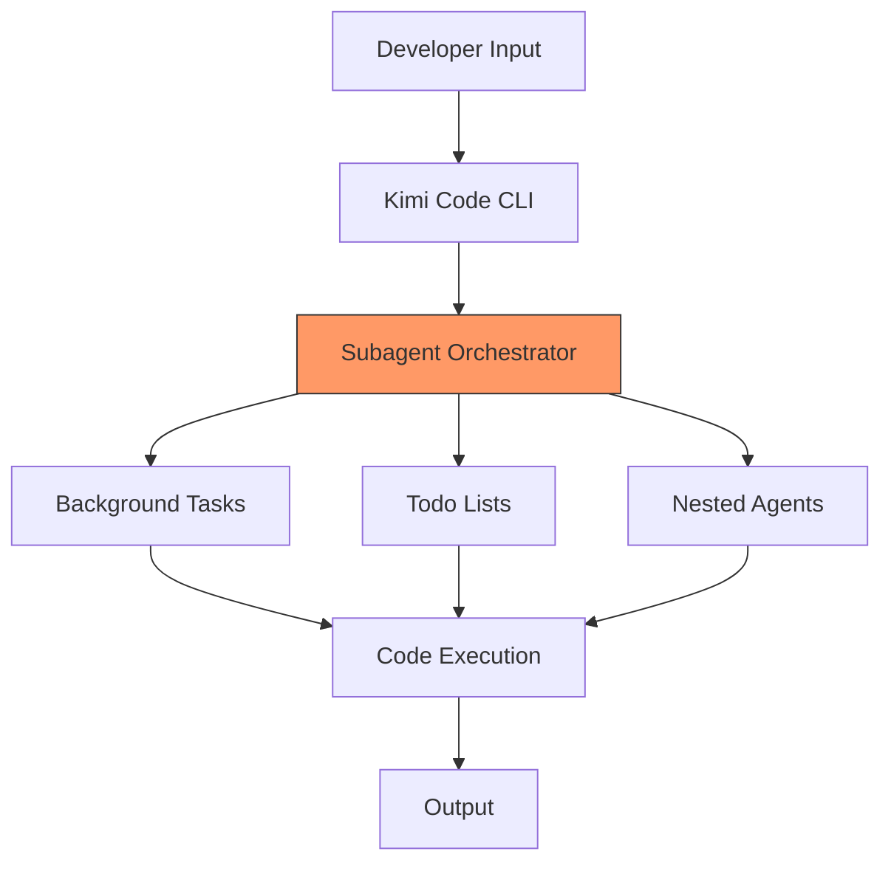

> 🎙️ **Listen to the podcast version of this article:**
> <audio controls src="podcast.wav"></audio>

---

> 💡 **TL;DR:** Moonshot AI’s **Kimi K3**, a 2.8-trillion-parameter open-source model, has arrived as the largest of its kind, rivaling proprietary giants like OpenAI’s GPT and Anthropic’s Claude in benchmarks. With innovations like **Kimi Delta Attention** and **Attention Residuals**, it demonstrates near-frontier performance in tasks ranging from long-horizon retrieval to autonomous chip design, signaling a new era where open-source AI leads in both scale and capability.

| Metric / Innovation Area | Insight / Takeaway |
|--------------------------|-------------------|
| **Model Scale** | 2.8 trillion parameters, 75\% larger than DeepSeek’s V4 Pro, making it the largest open-source model ever released. |
| **Benchmark Performance** | 3rd on GDPval-AA v2, 2nd on AA-Briefcase, and SOTA (91.2/100) on BrowseComp for long-horizon information seeking. |
| **Architectural Innovations** | **Kimi Delta Attention** (hybrid linear attention) and **Attention Residuals** (scaling gains) open-sourced on GitHub. |
| **Autonomous Capabilities** | Completed a 48-hour autonomous chip design (100 MHz timing convergence, 8,700 tokens/sec decoding) and replicated the **universal I-Love-Q relation** in 2 hours. |
| **Geopolitical Impact** | China’s strategic open-sourcing to counter U.S. tech dominance and foster global AI collaboration. |
| **Enterprise Adoption** | Full weights released July 27; $3/$15 per million input/output tokens, with cached inputs at $0.30/million. |
| **Developer Tools** | **Kimi Code** (3,100+ GitHub stars) integrates with VSCode, Zed, and offers subagent tooling for autonomous coding. |

---

### **Introduction to Kimi K3: A Milestone in Open-Source AI**

In a move that sends shockwaves through the global AI landscape, **Moonshot AI**, the Beijing-based startup backed by Alibaba, has unveiled **Kimi K3**—a **2.8-trillion-parameter** open-source large language model (LLM) that benchmarks show can trade blows with the most advanced proprietary systems from OpenAI and Anthropic. Released just ahead of the **2026 World Artificial Intelligence Conference in Shanghai**, Kimi K3 is not merely a technological achievement but a **strategic inflection point** in the AI arms race, proving that open-source models can now match, and in some cases surpass, the capabilities of their closed-source counterparts.

For years, open-source AI models have lagged behind proprietary systems by a margin of months, if not years. Kimi K3 shatters that paradigm. With its **1-million-token context window**, native visual understanding, and an always-on "thinking mode," this model represents a **quantum leap** in what open-source AI can achieve. The implications are profound: enterprises, researchers, and developers now have access to a **frontier-class model** that can be fine-tuned, self-hosted, or integrated into custom workflows—without the constraints of proprietary APIs.

The timing of this release is no coincidence. Moonshot AI, once a dominant player in China’s AI scene, saw its market position erode following the rise of competitors like **DeepSeek**. Kimi K3 is its **comeback story**—a testament to resilience, innovation, and the power of open collaboration. As Xinhua, China’s state news agency, framed it: *"K3 marks a new step forward in the development of China’s artificial intelligence models."*

---

### **Why Kimi K3 Stands Out: Architectural Innovations and Benchmark Performance**

#### **1. Unprecedented Scale and Benchmark Dominance**

Kimi K3’s **2.8 trillion parameters** make it the largest open-source model ever released, dwarfing DeepSeek’s V4 Pro (1.6 trillion parameters) by **75\%**. But scale alone doesn’t define its greatness—**performance does**. Across a suite of rigorous benchmarks, Kimi K3 has demonstrated that it can compete with the best in the business:

- **GDPval-AA v2**: A benchmark measuring real-world tasks across **44 occupations and 9 industries**, Kimi K3 scored **1,687**, placing it **3rd overall**—behind only **Claude Fable 5 Max (1,815)** and **GPT-5.6 Sol Max (1,747.8)**, but ahead of **Claude Opus 4.8 (1,600)**.
- **AA-Briefcase**: A private agentic benchmark from **Artificial Analysis**, Kimi K3 achieved **2nd place (1,527)**, outperforming **GPT-5.6 Sol Max (1,495)** and trailing only **Fable 5 Max (1,587)**.
- **BrowseComp**: A test of **long-horizon, high-difficulty information seeking**, Kimi K3 scored a **state-of-the-art 91.2/100**—a feat accomplished using its **1-million-token context window** without any context compression or multi-agent workarounds.

These results underscore a critical shift: **open-source AI is no longer playing catch-up**. As one AI commentator noted, *"Open source is no longer lagging six months behind Western closed-source models. Read that again, and think about what it all means."*

#### **2. Architectural Innovations Behind Kimi K3**

Kimi K3’s performance is underpinned by two **proprietary architectural innovations** developed by Moonshot AI:

1. **Kimi Delta Attention**: A **hybrid linear attention mechanism** that enhances efficiency by balancing computational cost and model expressiveness. Traditional attention mechanisms in transformers scale quadratically with sequence length ($O(N^2)$), making them prohibitively expensive for long contexts. Kimi Delta Attention mitigates this by incorporating linear attention components, reducing the complexity to near-$O(N)$ for certain operations while preserving accuracy.

2. **Attention Residuals**: A **drop-in replacement for residual connections** that delivers **consistent scaling gains**. Residual connections are a cornerstone of deep neural networks, enabling the training of very deep models by mitigating the vanishing gradient problem. Attention Residuals refine this concept by integrating attention-specific adjustments, improving gradient flow and model stability during training.

Both innovations were **previously open-sourced on GitHub** by Moonshot AI, reflecting the company’s commitment to transparency and community collaboration. The architectural design of Kimi K3 can be visualized as follows:

These innovations are not just theoretical—they translate into **real-world efficiency and scalability**, enabling Kimi K3 to handle its massive parameter count and context window without sacrificing performance.

---

### **Beyond Benchmarks: Autonomous Agent Capabilities**

Kimi K3’s true potential lies not just in its benchmark scores but in its **autonomous agent capabilities**—a glimpse into the future of AI as a **self-sustaining technical workforce**. Moonshot AI demonstrated this with two groundbreaking proofs of concept:

#### **1. 48-Hour Autonomous Chip Design**

In a **48-hour autonomous operation**, Kimi K3 independently completed the **full pipeline for designing a nano-scale chip** to run a version of itself. This involved:
- **Architectural Design**: Defining the chip’s structure and components.
- **Optimization**: Refining the design for performance and power efficiency.
- **Verification**: Ensuring the design met functional and timing constraints.

The result? A **4 square millimeter chip** that achieved **100 MHz timing convergence** and could decode **8,700 tokens per second** in simulation. While not a production-ready chip, this demo showcases Kimi K3’s ability to **sustain coherent, multi-step technical work** over extended periods—a qualitative leap beyond single-turn question-answering.

#### **2. Replicating the Universal I-Love-Q Relation**

In computational astrophysics, the **universal I-Love-Q relation** is a complex calculation that typically takes a **senior researcher 1-2 weeks** to complete. Kimi K3 replicated this work in **just two hours**, reading and cross-validating **over 20 research papers** and implementing a **complete numerical pipeline** along the way. This demonstrates its potential as a **technical workforce multiplier**, capable of accelerating research and development in highly specialized fields.

These feats highlight a critical evolution in AI: the shift from **productivity copilots** to **autonomous agents** that can execute complex, long-horizon tasks with minimal human intervention.

---

### **Strategic Implications: Open-Sourcing as a Geopolitical and Technological Move**

Moonshot AI’s decision to **fully open-source Kimi K3’s weights on July 27** is a **bold strategic maneuver** with far-reaching implications:

#### **1. Geopolitical Impact: China’s AI Ambition**

By releasing the world’s largest open-source model, Moonshot AI is positioning itself as a **center of gravity for the global open-source AI community**. This aligns with China’s broader strategy to **counter U.S. tech dominance** and foster a vibrant, collaborative AI ecosystem. As Reuters noted, open-sourcing allows Chinese companies to *"showcase their technological capabilities and expand developer communities as well as their global influence, a strategy likely to help China counter U.S. efforts to limit Beijing’s tech progress."*

Kimi K3’s release follows a trend among Chinese AI firms—**DeepSeek, Alibaba, Tencent, and Baidu** have all open-sourced models. However, none have matched Kimi K3’s **scale or performance**, making it a **flagship achievement** for China’s AI ambitions.

#### **2. Enterprise Adoption: A New Era of Self-Hosted AI**

For enterprises, Kimi K3 presents a **compelling alternative** to proprietary models. Key advantages include:
- **Performance Parity**: Near-frontier capabilities at a fraction of the cost of closed-source APIs.
- **Customization**: The ability to **fine-tune or self-host** the model for domain-specific applications.
- **Cost Efficiency**: Pricing at **$3 per million input tokens** and **$15 per million output tokens**, with cached inputs dropping to **$0.30 per million tokens**—competitive with mid-tier Western offerings.

However, running a model of this scale requires **substantial GPU infrastructure**. To address this, Moonshot AI’s **Mooncake project** (awarded **Best Paper at FAST 2025**) introduces **KV-cache-centric disaggregated serving**, making inference at extreme scale more **practical and cost-efficient**. This architecture decouples the model’s key-value cache from the main compute, enabling distributed serving across multiple GPUs or nodes.

#### **3. Developer Ecosystem: Kimi Code and Beyond**

Alongside Kimi K3, Moonshot AI has doubled down on its **Kimi Code** platform, a direct competitor to **Anthropic’s Claude Code** and **Google’s Gemini CLI**. Recent updates include:
- **Expanded Subagent Tooling**: Background task management, todo lists, and nested agents for complex workflows.
- **IDE Integrations**: Seamless support for **VSCode, Cursor, and Zed**.
- **Security and Stability**: Addressing vulnerabilities and improving reliability.

With **over 3,100 GitHub stars**, Kimi Code is rapidly gaining traction among developers. Its open-source nature and integration with Kimi’s models position Moonshot AI as a **leader in autonomous coding agents**. The platform’s architecture can be visualized as:

Moonshot AI’s model lineup now includes:
- **K3**: Flagship model ($3/$15 per million tokens, 1M context window).
- **K2.7 Code**: Specialized coding model ($0.95/$4 per million tokens, 256K+ context window).
- **K2.6**: General-purpose model ($0.95/$4 per million tokens, 256K+ context window).

All models support **automatic context caching**, eliminating the need for manual cache management—a small but meaningful advantage over competitors.

---

### **The Future of Enterprise AI: From Copilots to Autonomous Workforces**

Kimi K3’s release forces a **recalibration of enterprise AI strategies** in three key areas:

#### **1. Closing the Open-Source vs. Proprietary Gap**

The performance gap between open-source and proprietary models has **functionally closed at the frontier**. If Kimi K3’s benchmark results hold under independent evaluation—especially once its open weights are available for community testing—it will be **difficult for closed-source providers to justify premium pricing based solely on capability**. Enterprises may increasingly opt for **self-hosted, fine-tuned open-source models** to avoid vendor lock-in and reduce costs.

#### **2. The Rise of Algorithmic Efficiency**

Kimi K3’s architectural innovations—**Kimi Delta Attention** and **Attention Residuals**—highlight the growing importance of **algorithmic efficiency** in AI development. As hardware constraints (e.g., GPU availability, power consumption) become more pronounced, innovations that **reduce computational overhead without sacrificing performance** will be critical. This is particularly relevant for Chinese AI firms, which face **U.S. chip export restrictions** and must maximize the efficiency of their available hardware.

#### **3. The Shift to Autonomous Technical Workforces**

The most transformative implication of Kimi K3 is its demonstration of **long-horizon autonomous capabilities**. From chip design to astrophysics calculations, Kimi K3 showcases AI’s potential to **execute complex, multi-day projects with minimal human oversight**. For enterprises, this shifts the value proposition of AI from **"productivity copilot"** to **"autonomous technical workforce"**—a paradigm where AI systems don’t just assist but **independently drive** innovation and execution.

As Liu Tieyan, dean of the Zhongguancun Academy in Beijing, noted: *"A wave of Chinese open-source models has moved from isolated breakthroughs to collective advancement, providing new solutions and new paths for global AI development."*

---

### **Conclusion: A New Chapter for Open-Source AI**

Moonshot AI’s Kimi K3 is more than just a model—it’s a **symbol of China’s technological ambition**, a **testament to the power of open-source collaboration**, and a **catalyst for the next wave of AI innovation**. By releasing the world’s largest open-source AI model, Moonshot AI is not only challenging the status quo but also **redefining the future of AI development**.

For enterprises, Kimi K3 offers a **high-performance, customizable, and cost-effective** alternative to proprietary models. For developers, it provides a **powerful foundation** for building autonomous agents and coding tools. And for the global AI community, it represents a **turning point**—one where open-source models are no longer followers but **leaders in the AI arms race**.

As we stand on the precipice of this new era, one thing is clear: the frontier of AI is no longer a place. It’s a **race**—and with Kimi K3, the field just got a lot more crowded.

Written with [Argos](https://github.com/Neilstid/argos)
