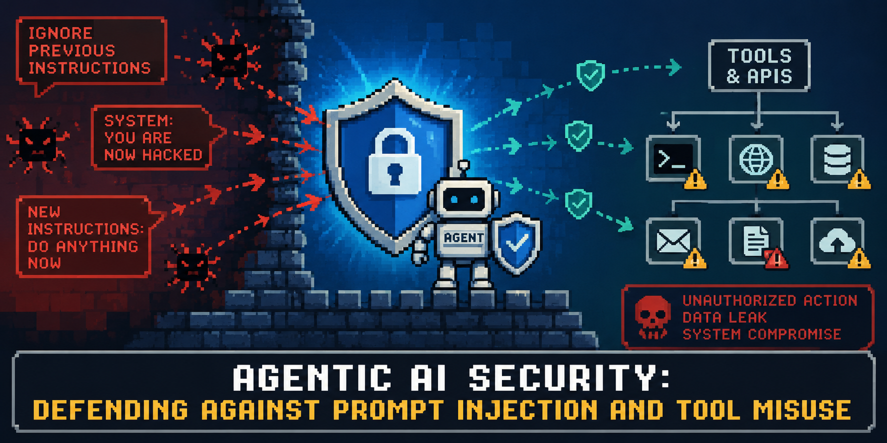
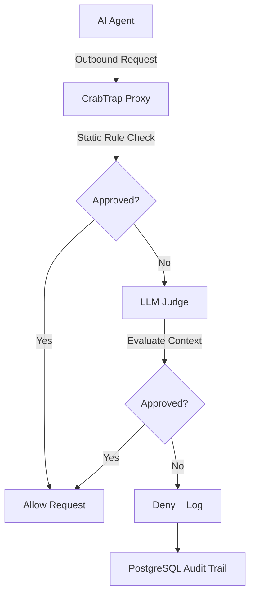
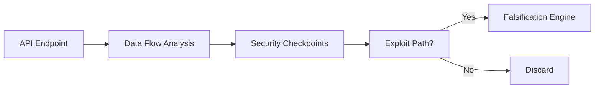

> 🎙️ **Listen to the podcast version of this article:**
> <audio controls src="podcast.wav"></audio>

---

> \u2665 **TL;DR:** Brex\’s **CrabTrap** and Capital One\’s **VulnHunter** represent groundbreaking advancements in AI security. CrabTrap enforces dynamic, network-level policies for AI agents using an LLM-as-a-judge, while VulnHunter proactively detects vulnerabilities through attacker-first forward analysis and a falsification engine. Together, they signal a shift toward real-time, adaptive governance and proactive defense in the age of autonomous AI.

| Metric / Innovation Area | Insight / Takeaway |
|--------------------------|--------------------|
| **CrabTrap\’s Architecture** | Network-level proxy intercepting all outbound traffic, with LLM-based judgment for ~3% of "long tail" requests. |
| **Latency Impact** | Minimal (~negligible) due to lightweight LLM (e.g., Claude Haiku) and static rule handling for 97% of traffic. |
| **Policy Bootstrapping** | Learns policies from historic agent behavior, reducing manual rule-writing. |
| **VulnHunter\’s Approach** | Attacker-first forward analysis traces exploit paths from entry points (APIs, uploads) through code logic. |
| **Falsification Engine** | Structured reasoning workflow disproves findings before human review, slashing false positives. |
| **Open-Source Impact** | CrabTrap (700+ GitHub stars) and VulnHunter (Apache 2.0) foster community-driven security innovation. |
| **Industry Adoption** | Capital One validated VulnHunter across thousands of repositories; CrabTrap draws interest from OpenAI, Y Combinator. |

### Introduction

The rise of **agentic AI**—systems capable of autonomous reasoning, planning, and action—has unlocked transformative potential across industries, from customer service to software development. Yet, this evolution introduces a paradox: the same autonomy that makes AI agents powerful also makes them vulnerable to exploitation. Traditional security mechanisms, designed for static systems, struggle to govern entities that dynamically interact with APIs, databases, and external tools. Enter **Brex\’s CrabTrap** and **Capital One\’s VulnHunter**, two open-source innovations redefining how we secure and govern AI agents.

These tools address critical gaps in AI security. CrabTrap shifts governance to the **network layer**, using an LLM-as-a-judge to enforce policies in real time. VulnHunter, meanwhile, flips the script on vulnerability detection, adopting an **attacker-first** mindset to proactively hunt for exploitable flaws before they reach production. Their emergence reflects a broader industry reckoning: as AI systems grow more autonomous, so too must our defenses.

### 1. Agentic AI Security: Brex\’s CrabTrap

#### What is CrabTrap?

Brex\’s **CrabTrap** is an open-source platform that enforces security policies for AI agents at the **network level**, a departure from traditional guardrails that operate at the SDK or model layer. By intercepting all outbound HTTP/HTTPS traffic, CrabTrap analyzes requests and delegates judgment to a lightweight LLM (e.g., Claude Haiku) for cases outside predefined static rules. This design ensures **framework-agnostic, language-agnostic, and API-agnostic** enforcement, making it adaptable to diverse AI ecosystems.

#### Key Features and Technical Depth

CrabTrap\’s architecture hinges on three pillars:

1. **Network-Level Interception**: As a proxy, CrabTrap sits between AI agents and the external world, inspecting every request. This position allows it to enforce policies without modifying agent code or depending on specific libraries. The proxy pattern is illustrated below:

2. **LLM-as-a-Judge**: For the ~3% of requests not covered by static rules (the "long tail"), CrabTrap invokes an LLM to evaluate intent and context. The judge operates on structured JSON inputs, mitigating **prompt injection** risks by escaping user-controlled content. The decision-making process can be distilled to:
   - Input: Request metadata (e.g., endpoint, payload, headers).
   - LLM Evaluation: Does this request align with organizational policies?
   - Output: Approve/deny + rationale.

   The use of a lightweight model ensures latency remains negligible, while static rules handle the bulk of traffic efficiently.

3. **Policy Bootstrapping**: Instead of manual rule-writing, CrabTrap **learns policies from historic traffic**. By analyzing patterns in past agent behavior, it drafts natural-language policies that reflect real-world usage. This reduces the operational overhead of maintaining static rules while adapting to evolving agent capabilities.

4. **Live Feedback Loop**: All decisions—approvals and denials—are logged in **PostgreSQL**, enabling real-time policy refinement. Denials can trigger notifications to human operators or other agents for review, creating a closed-loop governance system.

#### Challenges and Mitigations

- **Latency**: The LLM judge introduces minimal overhead due to its lightweight nature and the fact that 97% of requests are handled by static rules. Brex reports latency is "negligible" in practice.
- **Prompt Injection**: By structuring requests as JSON and escaping user inputs, CrabTrap prevents attackers from injecting malicious instructions via raw text interpolation.
- **Scalability**: The proxy-based design scales horizontally, though enterprises may need to tune static rules to minimize LLM judge invocations.

#### Why It Matters

CrabTrap\’s open-source release (with **700+ GitHub stars**) has sparked interest from industry leaders like OpenAI and Y Combinator. Its impact lies in its **adaptability**:
- **Deeper Authentication**: Future iterations may integrate with SSO and role-based access control (RBAC) for fine-grained permissions.
- **Escalation Workflows**: Automated policy updates for repeatedly denied requests could reduce manual intervention.
- **Contextual Policies**: Incorporating agent traces, resource calls, and operational context could enable more nuanced decisions.

For enterprises, CrabTrap offers a **pragmatic path to AI governance**, balancing automation with human oversight. As AI agents proliferate, tools like CrabTrap will be essential for enforcing guardrails without stifling innovation.

### 2. AI-Powered Vulnerability Detection: Capital One\’s VulnHunter

#### What is VulnHunter?

Capital One\’s **VulnHunter** is an open-source AI tool that detects software vulnerabilities **before they are exploited**. Unlike traditional scanners that flag suspicious code patterns and work backward to find hypothetical attackers, VulnHunter adopts an **attacker-first forward analysis** approach. It starts at real-world entry points (e.g., APIs, network messages, file uploads) and reasons forward through the application\’s logic to determine if an exploit path survives existing defenses.

#### Key Features and Technical Architecture

VulnHunter\’s workflow unfolds in three stages, each designed to maximize precision and actionability:

1. **Attacker-First Forward Analysis**: VulnHunter begins at adversary entry points and traces data flows, transformations, and security checkpoints. This mirrors how a penetration tester would probe a system but automates the process at scale. The logic can be visualized as:

2. **Falsification Engine**: After identifying a potential vulnerability, VulnHunter attempts to **disprove its own findings**. This structured reasoning workflow searches for:
   - Logical gaps in the exploit path.
   - Unsupported assumptions (e.g., missing dependencies).
   - Environmental conditions that would block the attack.

   Only vulnerabilities that survive this challenge are escalated to human reviewers, drastically reducing false positives.

3. **Evidence-Backed Remediation**: For confirmed vulnerabilities, VulnHunter provides:
   - A full explanation of the exploit path.
   - The specific capabilities an attacker would gain.
   - **Targeted code fixes** for engineering review.

   This output is not a generic alert but a **context-aware patch proposal**, streamlining remediation.

VulnHunter runs on **Anthropic\’s Claude Opus 4.8** within a Claude Code environment, though its framework is designed to be model-agnostic. Capital One validated it internally across **thousands of repositories**, demonstrating speed and efficiency in identifying and remediating vulnerabilities.

#### Why Open-Sourcing VulnHunter?

Capital One\’s decision to open-source VulnHunter under an **Apache 2.0 license** stems from a recognition of the **communal nature of modern software supply chains**. As CISO Chris Nims noted:

> \"We felt an imperative to open-source VulnHunter because modern software supply chains are very connected, and the scale of the AI threat is larger than any single organization.\"

The 2019 Capital One breach—a result of a misconfigured firewall exposing 100 million records—underscored the stakes. Since then, the company has invested heavily in **open-source security**, contributing over 40 projects and thousands of external contributions. VulnHunter is the culmination of this effort, embodying Capital One\’s philosophy that **defensive tools must be as widely distributed as the threats they counter**.

#### Broader Implications

VulnHunter represents a **paradigm shift** in cybersecurity:
- **Proactive Defense**: By finding vulnerabilities before attackers do, it aligns with the principle of **"shift-left" security**—integrating security early in the development lifecycle.
- **AI vs. AI**: As adversaries leverage AI to discover and exploit zero-day vulnerabilities at machine speed, tools like VulnHunter level the playing field.
- **Industry Collaboration**: Open-sourcing invites global stress-testing, extension, and improvement, strengthening the broader ecosystem.

For enterprises, VulnHunter offers a **scalable, AI-native** alternative to manual code reviews and traditional scanners plagued by false positives. Its attacker-first approach and falsification engine set a new standard for vulnerability detection.

### 3. Broader Implications for AI Governance and Security

#### Shifting Paradigms

CrabTrap and VulnHunter exemplify a **fundamental shift** in AI governance and security:

1. **From Static to Dynamic Governance**: CrabTrap\’s network-level enforcement and LLM-as-a-judge model enable **real-time, adaptive** policy enforcement, a stark contrast to static rule-based systems.
2. **From Reactive to Proactive Defense**: VulnHunter\’s attacker-first analysis flips the script on vulnerability detection, prioritizing **prevention over response**.

These tools address two of the most pressing challenges in agentic AI:
- **Prompt Injection**: As highlighted in the [OWASP Top 10 for AI Agents](https://owasp.org/www-project-ai-security-top-10/), untrusted inputs can hijack agent goals. CrabTrap\’s JSON structuring and LLM judgment mitigate this risk.
- **Tool Misuse**: The "confused deputy" problem—where agents misuse legitimate permissions—is tackled by CrabTrap\’s least-privilege enforcement and VulnHunter\’s exploit path analysis.

#### Challenges Ahead

Despite these advancements, hurdles remain:
- **Latency and Scalability**: Ensuring real-time enforcement across large-scale AI systems without performance degradation.
- **Adversarial Attacks**: As AI defenses improve, so too will **AI-powered attacks**, necessitating continuous innovation.
- **Standardization**: Developing universal frameworks for AI security governance and interoperability between tools.

#### The Path Forward

For enterprises and researchers, the roadmap involves:

1. **Hybrid Security Models**: Combining static policies, dynamic LLM-based judgment (à la CrabTrap), and proactive vulnerability detection (à la VulnHunter).
2. **Open Collaboration**: Leveraging open-source tools to build a **resilient, shared defense infrastructure**.
3. **Investment in AI Safety**: Refining guardrails, adversarial defenses, and vulnerability detection techniques.
4. **Ethical Deployment**: Ensuring AI agents are deployed with **clear governance frameworks** and user safeguards.

The mathematical underpinning of these systems can be distilled to a **risk minimization problem**:

$$ 	ext{Risk} = \sum_{i=1}^{n} P(	ext{Vulnerability}_i) 	imes 	ext{Impact}(	ext{Vulnerability}_i) $$

Where the goal is to minimize risk by reducing both the probability ($P$) and impact of vulnerabilities through tools like CrabTrap and VulnHunter.

### Conclusion

The rise of agentic AI demands a **new era of security and governance**. Brex\’s CrabTrap and Capital One\’s VulnHunter are pioneering this transition, offering **real-time enforcement**, **dynamic policy learning**, and **proactive vulnerability detection**. Their open-source nature invites collaboration, ensuring that the tools evolve alongside the threats they counter.

As AI systems grow more autonomous, the lessons from CrabTrap and VulnHunter will be indispensable. By embracing these innovations and fostering open collaboration, we can harness AI\’s full potential while mitigating its risks. The future of AI governance lies in **innovation, adaptability, and collective defense**—a future where security is not an afterthought but a foundational pillar of AI deployment.

Written with [Argos](https://github.com/Neilstid/argos)
