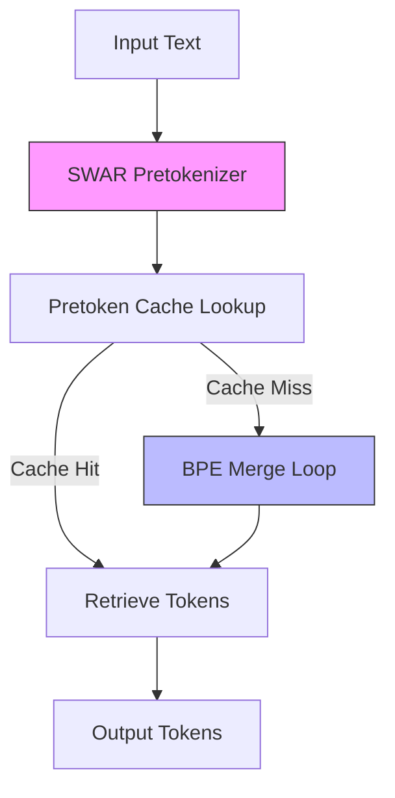

> 🎙️ **Listen to the podcast version of this article:**
> <audio controls src="index.mp3"></audio>


---

> 💡 **TL;DR:** The AI landscape in 2026 is marked by two standout innovations: **Gigatoken**, a Rust-based BPE tokenizer that achieves unprecedented speeds of **24.53 GB/s**—up to 989x faster than Hugging Face tokenizers—and a diversified open **Automatic Speech Recognition (ASR)** ecosystem where models like Cohere Transcribe, IBM Granite Speech 4.1, and ARK-ASR compete within a **1% Word Error Rate (WER)** margin. These advancements democratize high-performance NLP and ASR, shifting the focus from raw accuracy to deployment practicalities like licensing, latency, and language coverage.

| **Metric / Innovation Area**               | **Insight / Takeaway**                                                                                     |
|------------------------------------------|---------------------------------------------------------------------------------------------------------|
| **Tokenization Speed (Gigatoken)**        | 24.53 GB/s on AMD EPYC 9565; 989x faster than Hugging Face, 681x faster than tiktoken.                     |
| **ASR WER Range (2026)**                 | Top models (Cohere Transcribe, IBM Granite 4.1, ARK-ASR) separated by <1% WER.                          |
| **ASR Latency**                          | Streaming models (Voxtral, Kyutai STT) achieve **40–1200ms** delays; batch models prioritize throughput. |
| **Language Coverage**                    | Meta’s Omnilingual ASR supports **1,600+ languages** natively, extending to 5,400+ via zero-shot learning. |
| **Licensing Diversity**                  | Apache 2.0 (Cohere, IBM, Qwen), MIT (Whisper), CC-BY-4.0 (Kyutai, Parakeet) dominate open ASR.           |


---

### **Introduction: The Need for Speed and Precision in AI**

Artificial Intelligence is no longer just about building bigger models—it’s about making them **faster, leaner, and more accessible**. Two recent breakthroughs exemplify this shift: **Gigatoken**, a tokenizer that redefines speed limits for NLP pipelines, and the **2026 open ASR model ecosystem**, where the gap between top performers is now measured in fractions of a percent.

In an era where real-time processing and multilingual support are non-negotiable, these innovations address critical bottlenecks. Tokenization—a once-overlooked step in NLP—has become a performance chokepoint, while ASR models are evolving beyond the "Whisper monoculture" into a diverse, highly competitive field. This post dives into the technical brilliance behind these advances and their implications for developers, researchers, and industries at large.

---

### **1. Gigatoken: Rust-Powered Tokenization at Gigabytes Per Second**

#### **The Tokenization Bottleneck**
Tokenization—the process of converting raw text into numerical tokens for LLMs—has long been treated as a solved problem. Yet, as models grow larger and datasets expand, even this "solved" step can become a bottleneck. Traditional tokenizers like Hugging Face’s `tokenizers` or OpenAI’s `tiktoken` rely on regex engines and Python overhead, limiting their throughput. Enter **Gigatoken**, a Rust-based Byte Pair Encoding (BPE) tokenizer that shatters these limits.

#### **How Gigatoken Achieves 24.53 GB/s**
Gigatoken’s speed stems from two core optimizations:

1. **Hand-Written SWAR Pretokenizer**:
   Most tokenizers delegate pretokenization (splitting text into words/subwords) to regex engines. Gigatoken replaces this with a **hand-rolled state machine** optimized using **SWAR (SIMD Within A Register)**. SWAR processes 8 bytes at once using branchless arithmetic, eliminating the need for architecture-specific intrinsics. The optimization journey is a masterclass in performance tuning:
   - **Regex baseline**: ~47 MiB/s
   - **State machine**: ~380 MiB/s
   - **NEON SIMD**: ~462 MiB/s
   - **SWAR + lookup tables**: ~830 MiB/s
   - **Dual-cursor ILP (Instruction-Level Parallelism)**: **1,049 MiB/s**
   The final step exploits out-of-order execution by running two independent cursors, reducing latency bottlenecks.

2. **Pretoken Caching**:
   Repeated words (e.g., "the", "and") are common in text. Gigatoken caches their tokenized forms, avoiding redundant computations. This is particularly effective for long-tailed distributions where a few words dominate frequency.

The result? On a **144-core AMD EPYC 9565**, Gigatoken processes the **11.9 GB OpenWebText corpus at 24.53 GB/s**—**989x faster** than Hugging Face’s tokenizer and **681x faster** than `tiktoken`. Even on consumer hardware like an **Apple M4 Max (16 cores)**, it achieves **8.79 GB/s**, and on an **AMD Ryzen 7 9800X3D**, it hits **6.27 GB/s**.



#### **Benchmarking and Real-World Impact**
Gigatoken’s benchmarks are rigorous and transparent. It supports **23 tokenizer families**, including GPT-2, Llama 3/4, Qwen, and Mistral. However, performance varies by vocabulary type:
- **BPE (e.g., GPT-2)**: **24.53 GB/s** (989x speedup)
- **SentencePiece (e.g., Gemma)**: **2.51–3.47 GB/s** (7–10x speedup)
- **WordPiece**: Not yet supported

**Compatibility Mode**: For users needing exact parity with Hugging Face or `tiktoken`, Gigatoken offers a compatibility mode—though this reduces speedups to **200–300x** due to Python overhead.

**Why It Matters**:
- **Training Acceleration**: Faster tokenization means less time spent on data preprocessing, a critical step in LLM training pipelines.
- **Inference Latency**: Real-time applications (e.g., chatbots, live transcription) benefit from near-instant tokenization.
- **Scalability**: Gigatoken’s throughput scales with core count, making it ideal for **distributed systems** processing petabytes of text.

**Installation and Usage**:
Gigatoken is available on PyPI and can be installed via:
```bash
pip install gigatoken
```
Example usage in Python:
```python
from gigatoken import Tokenizer

# Load a tokenizer (e.g., GPT-2)
tokenizer = Tokenizer.from_pretrained("gpt2")

# Encode text
text = "Hello, world! This is Gigatoken."
tokens = tokenizer.encode(text)
print(tokens)
```

#### **Future Outlook**
Gigatoken’s approach—**hand-optimized, cache-aware, and architecture-agnostic**—sets a new standard for tokenizer performance. As NLP models continue to grow, tools like Gigatoken will become essential for maintaining efficiency. The project’s **MIT license** and **open-source nature** ensure it can be adopted widely, from research labs to production environments.

---

### **2. The 2026 Open ASR Landscape: Beyond Whisper’s Monoculture**

#### **The End of the Whisper Era**
For years, **Whisper** dominated open-source Automatic Speech Recognition (ASR). In 2026, the landscape has diversified dramatically. Models like **Cohere Transcribe**, **IBM Granite Speech 4.1**, **ARK-ASR-3B**, and **MOSS-Transcribe** now compete at the top of the [Hugging Face Open ASR Leaderboard](https://huggingface.co/spaces/hf-audio/open_asr_leaderboard), with **WER differences of less than 1%**.

This shift means **rank alone no longer determines the best model**. Instead, developers must consider:
- **License** (Apache 2.0, MIT, CC-BY-4.0)
- **Language Coverage** (from English-only to 1,600+ languages)
- **Streaming Latency** (critical for real-time applications)
- **Cost per Audio-Hour** (throughput and hardware efficiency)

#### **The Accuracy Tier: Top Contenders**
The following table summarizes the leading models, their WERs, and key features:

| **Model**               | **WER (Leaderboard)** | **Languages** | **Streaming Latency** | **License**       | **Key Features**                                                                 |
|------------------------|-----------------------|---------------|----------------------|-------------------|---------------------------------------------------------------------------------|
| Cohere Transcribe      | 5.42%                 | 14            | Low (~50ms)          | Apache 2.0        | Conformer encoder, lightweight Transformer decoder, human-preference evaluated. |
| IBM Granite Speech 4.1 | 5.33%                 | 6             | Moderate (~100ms)   | Apache 2.0        | Bidirectional speech translation, keyword biasing, punctuation/truecasing.      |
| ARK-ASR-3B             | 5.04%                 | Multi-lingual | High (~200ms)        | MIT               | Optimized for low-resource languages.                                          |
| MOSS-Transcribe        | ~5.0%                 | 50+           | Low (~40ms)          | Apache 2.0        | Diarization, word timestamps, hotword biasing.                                   |
| Qwen3-ASR-1.7B         | 5.76%                 | 52            | N/A                  | Apache 2.0        | Covers 30 languages + 22 Chinese dialects; forced alignment for timestamps.     |

**Note**: WERs are **not directly comparable** due to differences in evaluation datasets. For example:
- Cohere’s **5.42%** is averaged over **8 English datasets** (including TED-LIUM).
- ARK-ASR’s **5.04%** excludes TED-LIUM (an easier dataset), so recalculating Cohere’s score over the same 7 datasets yields **5.84%**.

This discrepancy highlights a critical insight: **Leaderboard averages cannot be subtracted meaningfully**. Models may be tuned for specific benchmarks (e.g., MOSS-Transcribe was fine-tuned on Open ASR Leaderboard data), and private evaluation sets (e.g., Appen’s held-back data) can reorder rankings entirely.

#### **The Throughput Tier: Speed Demons**
While accuracy differences are minimal, **throughput varies by orders of magnitude**. For high-volume applications, this often trumps WER in cost calculations.

- **Parakeet TDT 0.6B v3**:
  - **RTFx (Real-Time Factor)**: **3332.74** (14x faster than Granite 4.1 2B)
  - **Languages**: 25 European languages with auto language ID
  - **Hardware**: Processes **24 minutes of audio in a single pass on an A100 80GB**
  - **Trade-off**: 6.32% WER (1% higher than Granite 4.1)

- **IBM Granite Speech 4.1 2B-NAR**:
  - **Non-Autoregressive**: Uses a bidirectional LLM to edit CTC hypotheses in a **single forward pass**
  - **RTFx**: **~1820** on an H100 (batch size 128)
  - **Trade-offs**: Sacrifices Japanese, speech translation, and keyword biasing for speed

- **Qwen3-ASR-0.6B**:
  - **Throughput**: **2000x** at concurrency 128
  - **Languages**: All 52 supported

```mermaid
flowchart LR
    A[Audio Input] --> B{Model Type}
    B -->|Batch| C[High Throughput
(e.g., Parakeet TDT)]
    B -->|Streaming| D[Low Latency
(e.g., Voxtral Realtime)]
    C --> E[RTFx 1000+]
    D --> F[Latency <1s]
    style C fill:#9f9,stroke:#333
    style D fill:#f99,stroke:#333
```

#### **The Streaming Tier: Real-Time Champions**
For applications requiring **real-time transcription** (e.g., live captioning, voice assistants), latency is paramount. Two models stand out:

1. **Voxtral Mini 4B Realtime**:
   - **Architecture**: 3.4B language model + 970M causal audio encoder
   - **Streaming**: Sliding-window attention for **unbounded streaming**
   - **Latency**: Configurable in **80ms steps (80ms–1200ms)**; Mistral recommends **480ms** as optimal
   - **Hardware**: Runs on a **single 16GB GPU**
   - **WER**: **7.68%** (leaderboard score; real-world performance may vary)

2. **Kyutai STT**:
   - **Models**:
     - **1B**: English/French, **0.5s delay**, built-in **semantic VAD** (Voice Activity Detection)
     - **2.6B**: English-only, **2.5s delay**
   - **Throughput**: **400 concurrent streams** on an H100
   - **Key Innovation**: Semantic VAD predicts when a speaker has **actually finished**, reducing perceived turn-taking latency

#### **The Coverage Tier: Breaking Language Barriers**
For global applications, **language coverage** is non-negotiable. Two models lead this category:

1. **Meta’s Omnilingual ASR**:
   - **Languages**: **1,600+ natively**, **5,400+ via zero-shot in-context learning**
   - **Architecture**: wav2vec 2.0 encoder scaled to **7B parameters**, pre-trained on **4.3M hours** of audio
   - **Performance**: **<10% Character Error Rate (CER)** on 78% of supported languages, including **500+ never-before-served languages**
   - **License**: Apache 2.0 (models), CC-BY (corpus)
   - **Use Case**: Ideal for **low-resource languages** and global deployments

2. **Whisper large-v3**:
   - **Languages**: **99**
   - **License**: **MIT** (most permissive in the field)
   - **Ecosystem**: Mature runtime support (`whisper.cpp`, `faster-whisper`, WhisperX)
   - **Legacy**: Still the **default choice** for projects requiring broad language support and minimal licensing restrictions

#### **The Research Edge: Architectural Innovations**
Two models push the boundaries of ASR architecture:

1. **diffusion-gemma-asr-small (Interfaze)**:
   - **Approach**: **Parallel diffusion denoising** over a 256-token canvas in **8–16 steps**
   - **Decoding Cost**: **Does not grow with transcript length** (unlike autoregressive models)
   - **Parameters**: Only **42M trained** (0.16% of total weights) on top of a frozen **26B DiffusionGemma** and **whisper-small encoder**
   - **Performance**:
     - **6.6% WER** on LibriSpeech test-clean
     - **15.7% WER** on FLEURS English
     - **29.6% CER** on FLEURS Mandarin
   - **Why It Matters**: A proof-of-concept for **non-autoregressive, length-agnostic decoding**. Not production-ready, but a must-read for ASR researchers.

2. **MOSS-Transcribe-Diarize 0.9B**:
   - **Innovation**: **Joint ASR + diarization** in a single generation (no separate diarization stack)
   - **Features**: Speaker labels, word timestamps, transcript in one pass
   - **Context**: **128k tokens (~90 minutes of audio)**
   - **RTF**: **~0.017** on an RTX 4090
   - **Extras**: Hotword biasing

#### **Licensing: The Deployment Gatekeeper**
Licensing often determines whether a model can be shipped, regardless of its performance. The 2026 ASR landscape divides cleanly:

| **License**       | **Models**                                                                                     | **Key Considerations**                                                                 |
|-------------------|-----------------------------------------------------------------------------------------------|---------------------------------------------------------------------------------------|
| **Apache 2.0**    | Cohere Transcribe, IBM Granite Speech 4.1, Qwen3-ASR, Voxtral Realtime, Omnilingual ASR, ARK-ASR | No attribution required; commercial use unrestricted. Cohere’s repo is gated.          |
| **MIT**           | Whisper large-v3                                                                              | Most permissive; ideal for embedded products or white-labeled APIs.                     |
| **CC-BY-4.0**     | Canary-Qwen-2.5B, Parakeet TDT 0.6B v3, Kyutai STT                                           | Commercially usable but **requires attribution**. Often a blocker for embedded use.   |

**Key Takeaway**: **License first, benchmarks second**. If your project cannot accommodate CC-BY-4.0’s attribution requirement, models like Parakeet or Kyutai STT are off the table—**regardless of their WER**.

#### **How to Choose the Right ASR Model**
Follow this **decision hierarchy** (not the leaderboard order):
1. **License**: Eliminate models with incompatible licenses (e.g., CC-BY-4.0 if attribution is a blocker).
2. **Language Coverage**: Ensure the model supports your required languages (e.g., Cohere’s 14 vs. Omnilingual’s 1,600+).
3. **Streaming vs. Batch**: Architectural choice—streaming models cannot be repurposed for batch processing without significant overhead.
4. **Benchmark on Your Data**: The <1% WER spread on public benchmarks can balloon to **several percent** on domain-specific or noisy audio.
5. **Cost per Audio-Hour**: RTFx figures are measured at **large batch sizes on datacenter GPUs**—replicate tests on your hardware.

**Final Insight**: In 2026, **a 2B open-weight model on a permissive license can outperform closed APIs from 18 months ago**. The remaining decisions are **procurement questions**, not research ones.

---

### **Conclusion: The Democratization of High-Performance AI**

The advancements in **Gigatoken** and **open ASR models** in 2026 signal a broader trend in AI: **the shift from raw performance to practical deployment**. Gigatoken’s **24.53 GB/s tokenization** eliminates a long-overlooked bottleneck, while the ASR ecosystem’s diversification empowers developers to choose models based on **licensing, language support, and latency**—not just accuracy.

These innovations lower the barrier to entry for high-performance AI, enabling startups, researchers, and enterprises to build **faster, more inclusive, and more scalable** applications. As we look ahead, the focus will increasingly shift to **optimizing for real-world constraints**—whether that’s the cost of inference, the latency of streaming, or the breadth of language support.

One thing is clear: **The future of AI is not just about bigger models, but smarter, more efficient ones.**

Written with [Argos](https://github.com/Neilstid/argos)
