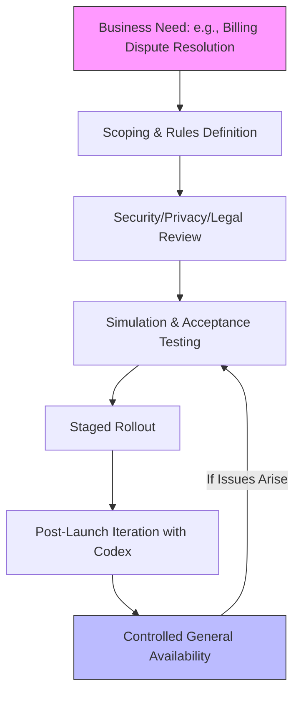
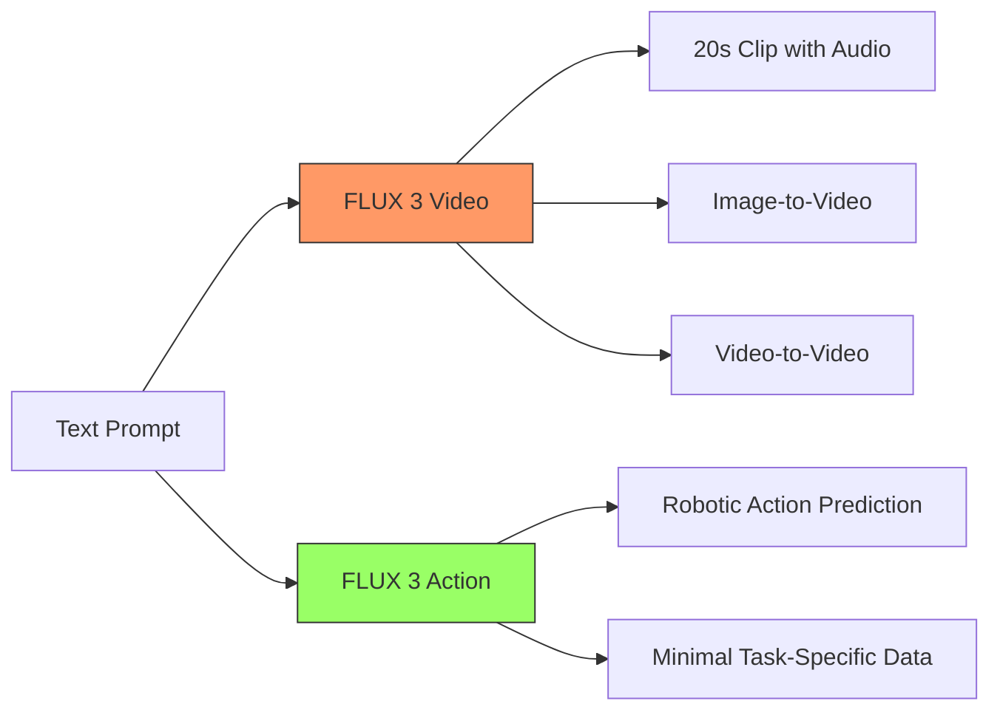
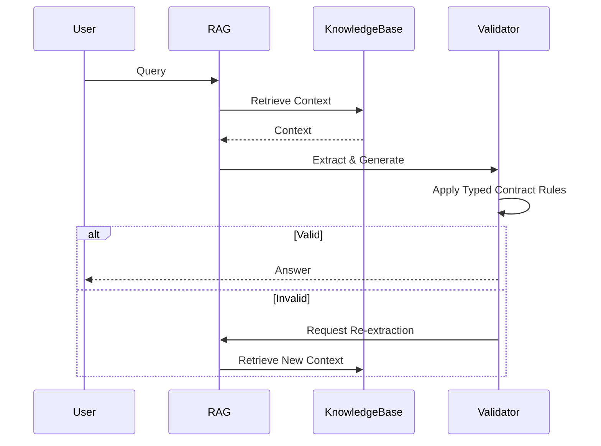

> 🎙️ **Listen to the podcast version of this article:**
> <audio controls src="index.mp3"></audio>

---

> 💡 **TL;DR:** OpenAI Presence introduces a managed, engineer-led approach to deploying enterprise AI agents, addressing governance and operational challenges. Meanwhile, Black Forest Labs’ FLUX 3 pushes the boundaries of multimodal AI with unified video, audio, and robotic action capabilities. Additionally, new "typed generation contracts" aim to mitigate RAG hallucinations, enhancing AI reliability in enterprise workflows.

| Metric / Innovation Area | Insight / Takeaway |
|--------------------------|--------------------|
| **OpenAI Presence Deployment Model** | Engineer-led, managed deployments with Forward Deployed Engineers (FDEs) ensure controlled, customized AI integration for enterprises. |
| **FLUX 3 Multimodal Capabilities** | Unified architecture for video (20s clips with audio), image, and robotic action prediction, targeting creative and industrial applications. |
| **RAG Hallucination Mitigation** | Typed generation contracts and validation protocols reduce extraction errors, improving AI output accuracy. |
| **Enterprise Adoption Barriers** | Governance, undefined business value, and operational discipline remain top challenges for AI agent projects. |
| **FLUX 3 Benchmark Performance** | Preliminary tests show FLUX 3 outperforms Luma Ray 3.2 (93% preference) and Runway Gen-4.5 (77%) in text-to-video tasks. |

### Introduction

The enterprise AI landscape is undergoing a seismic shift. No longer confined to API-driven experimentation, businesses are now demanding scalable, secure, and *operationalized* AI solutions. This evolution is being shaped by three pivotal developments: OpenAI’s **Presence**, a managed service for deploying AI agents with hands-on engineering support; **FLUX 3**, Black Forest Labs’ (BFL) multimodal powerhouse unifying video, audio, and robotic action prediction; and a growing focus on **structured contracts** to combat Retrieval-Augmented Generation (RAG) hallucinations. Together, these innovations signal a maturing industry where AI is not just powerful but *practical*.

### 1. OpenAI Presence: Enterprise AI Agents with Engineers Attached

#### The Problem: Why Enterprise AI Agents Fail

Gartner’s stark prediction—that **over 40% of agentic AI projects will be cancelled by 2027**—is not due to model limitations but to **governance gaps, undefined business value, and weak operational discipline**. Enterprises have spent years discovering that the hardest part of deploying AI agents lies not in the models themselves but in integration, permissions, and change management. OpenAI’s **Presence** directly addresses this pain point by bundling AI agents with **Forward Deployed Engineers (FDEs)**, a concept borrowed from Palantir’s playbook.

#### How Presence Works: A Six-Stage Process

OpenAI’s approach is refreshingly transparent about the labor involved. Presence is **not a self-serve product** but a managed program with limited general availability. Each deployment follows a rigorous six-stage process:

1. **Scoping Business Outcomes**: Defining the agent’s role (e.g., resolving billing disputes, handling insurance claims).
2. **Security, Privacy, and Legal Review**: Ensuring compliance and risk mitigation.
3. **Simulation and Acceptance Testing**: Validating the agent’s performance in controlled environments.
4. **Staged Rollout**: Gradual deployment to monitor and adjust.
5. **Post-Launch Iteration**: Continuous improvement via **Codex**, which analyzes production sessions and proposes updates.
6. **Controlled Access**: Only workflows with proven readiness and available FDE capacity are approved.

This method ensures that agents are **production-ready**, not just technically capable. OpenAI’s own phone support line, powered by Presence, now resolves **75% of inbound issues without human assistance**, cutting human handoffs by 15 percentage points in just 10 days.

#### Why It Matters: Accountability and Scalability

Presence’s model flips the script on traditional AI deployments. Instead of leaving integration challenges to customers, OpenAI **embeds its engineers** into enterprise workflows, ensuring accountability. However, this approach introduces new constraints:

- **Delivery Capacity**: FDEs are a finite resource. Unlike software, engineers embedded in a bank’s core systems don’t scale infinitely.
- **Cost and Pricing**: Pricing is **not publicly disclosed**, with costs set per customer and deployment. This opacity may deter some enterprises.
- **Model Flexibility**: Presence uses OpenAI models, but the specific model is **not pinned to a version**, allowing for evolution but potentially complicating long-term contracts.

For now, Presence sits alongside **ChatGPT Workspace Agents** (self-serve) and **API access to frontier models**, giving enterprises three paths to AI adoption—each separated less by capability than by **who does the work**.

### 2. FLUX 3: The Multimodal Revolution in Content Creation and Robotics

#### A Unified Architecture for a Multimodal World

Black Forest Labs’ **FLUX 3** is not just another multimodal model—it’s a **unified architecture** trained jointly across images, video, audio, and robotic actions. Unlike competitors that stitch together separate models, FLUX 3’s **Self-Flow** method aligns multimodal understanding and generation within a single framework. As BFL co-founder **Robin Rombach** puts it: *"You can’t cheat reality. A model that only learns images can only generate images. But the world is not made of still frames. It moves, sounds, changes, and responds."*

#### Capabilities: From Video to Robotics

FLUX 3’s capabilities are divided into four product lines:

1. **FLUX 3 Video**: Generates **20-second clips with synchronized audio** from a single prompt. Supports text-to-video, image-to-video, video-to-video, and keyframe-to-video generation. Early tests show it excels at **human facial expressions, sound-event association, and multilingual output**.
2. **FLUX 3 Image**: Enhances complex prompt handling and text generation, with preliminary evaluations showing significant improvements over prior FLUX versions.
3. **FLUX 3 Action**: Extends the architecture to **robotic vision and action prediction**, enabling robots to learn tasks with minimal data (e.g., **30 minutes vs. 30+ hours** for prior approaches).
4. **FLUX 3 Dev (Upcoming)**: Open-weight access for research and commercial use, spanning **video, audio, image, and action prediction**.

#### Benchmark Performance: Early Wins and Caveats

BFL’s preliminary evaluations (conducted on a **pre-release checkpoint**) show FLUX 3 outperforming competitors in text-to-video tasks:

- **93% preference over Luma Ray 3.2**
- **77% over Runway Gen-4.5**
- **69% over Grok Imagine Video**
- **52% over Google’s Gemini Omni Flash** (a statistical tie)

However, these results are **not yet independently verifiable**, and pricing, SLAs, and full benchmark methodologies remain undisclosed. For enterprises, this means **no cost-of-ownership calculations**—yet.

#### Why FLUX 3 Stands Out: Consolidation and Efficiency

For creative industries, FLUX 3’s appeal lies in **consolidation**. A single model can support:
- Storyboarding and image editing
- Product rendering and video variation
- Localization and multilingual dialogue
- **Agentic chaining** for multi-shot sequences (e.g., minutes-long videos with consistent characters)

For robotics, **FLUX-mimic** (developed with Mimic Robotics) leverages FLUX 3’s video backbone to enable **general-purpose robotic manipulation** with minimal task-specific data. As Elvis Nava, CTO of Mimic Robotics, notes: *"Because FLUX-mimic is built on top of frontier video models that already understand how the physical world behaves, it picks up a new task in minutes, not days."*

#### Open Weights: A Commitment to Enterprise Flexibility

BFL’s reputation was built on **open-weight models** (e.g., FLUX.1 Dev, FLUX.2 Dev), which became industry standards for their accessibility and performance. FLUX 3 Dev continues this tradition but raises the stakes by offering a **multimodal backbone** for local deployment. While details on licensing, parameter count, and hardware requirements are pending, the promise is clear: **secure, low-latency, customizable AI** for enterprises.

### 3. Addressing RAG Hallucinations: A Typed Generation Contract

#### The Hallucination Problem: Extraction vs. True Hallucinations

RAG systems often suffer from **extraction errors**—misinterpreting or misapplying retrieved context—rather than true hallucinations (fabricating information). Distinguishing between these errors is critical for maintaining trust in AI-generated content. A **typed generation contract** provides a structured approach to mitigate these issues.

#### Seven Patterns for Reliable RAG

To combat extraction errors, enterprises can implement the following **typed generation contract** patterns:

1. **Contextual Extraction**: Ensure the model accurately reads and extracts relevant context.
   - *Example*: Use **named entity recognition (NER)** to validate extracted entities against a knowledge base.
   - *Formula*: Precision = $ \frac{TP}{TP + FP} $, where TP = true positives, FP = false positives.

2. **Decomposition Rules**: Break complex tasks into smaller, verifiable steps.
   - *Example*: For a query like *"What are the side effects of Drug X?"*, decompose into:
     - Retrieve clinical trial data.
     - Extract side effects.
     - Cross-reference with FDA reports.

3. **Controlled Generation**: Enforce strict rules for model outputs (e.g., *"Only answer if the context includes a peer-reviewed source."*).

4. **Validation Protocols**: Use **automated checks** (e.g., regex, semantic similarity) to verify extracted data.

5. **Error Logging**: Track and analyze extraction errors to refine models.

6. **Model Fine-Tuning**: Continuously improve extraction capabilities with **domain-specific data**.

7. **Human-in-the-Loop**: Incorporate human review for high-stakes decisions.

#### Why It Matters: Trust and Operational Efficiency

For enterprises, the stakes of RAG hallucinations are high. **Incorrect data extraction** can lead to:
- **Compliance violations** (e.g., misreporting financial data).
- **Operational errors** (e.g., incorrect inventory management).
- **Reputational damage** (e.g., AI-generated misinformation).

By adopting typed generation contracts, businesses can:
- **Improve accuracy** by reducing reliance on unvalidated outputs.
- **Enhance trust** in AI-driven decisions.
- **Streamline workflows** with reliable, auditable data extraction.

### Conclusion: The Future of Enterprise AI

The enterprise AI landscape is rapidly evolving, with **OpenAI Presence**, **FLUX 3**, and **typed generation contracts** leading the charge. OpenAI’s engineer-led deployments address the **operational gaps** that have plagued AI projects, while FLUX 3’s unified multimodal architecture unlocks new possibilities in **content creation and robotics**. Meanwhile, structured approaches to RAG hallucinations are critical for building **trustworthy, production-ready AI systems**.

For enterprises, the message is clear: **AI is no longer just about capability—it’s about integration, accountability, and reliability**. As these innovations mature, businesses that embrace them will gain a competitive edge in efficiency, creativity, and decision-making. The future of enterprise AI is here, and it’s **managed, multimodal, and meticulously validated**.

Written with [Argos](https://github.com/Neilstid/argos)
