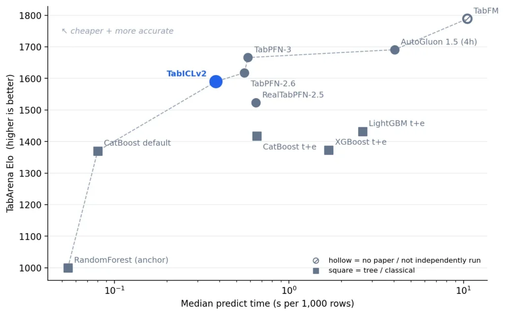
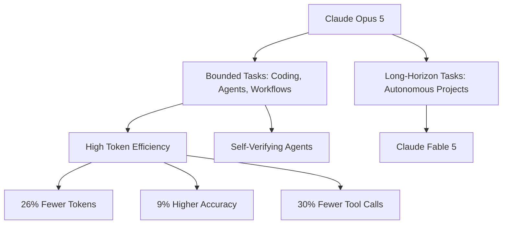
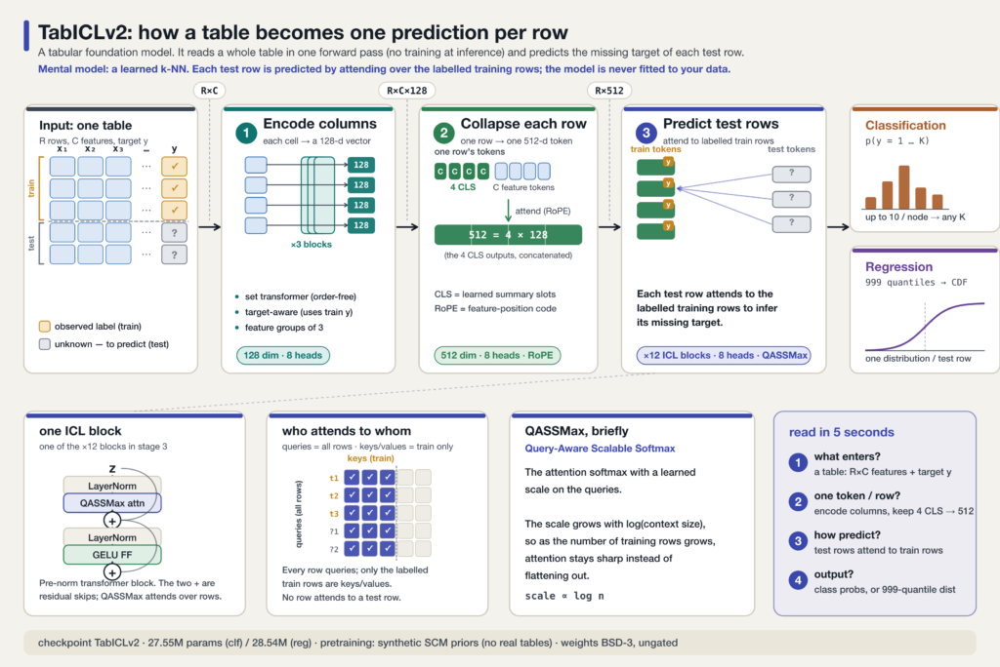
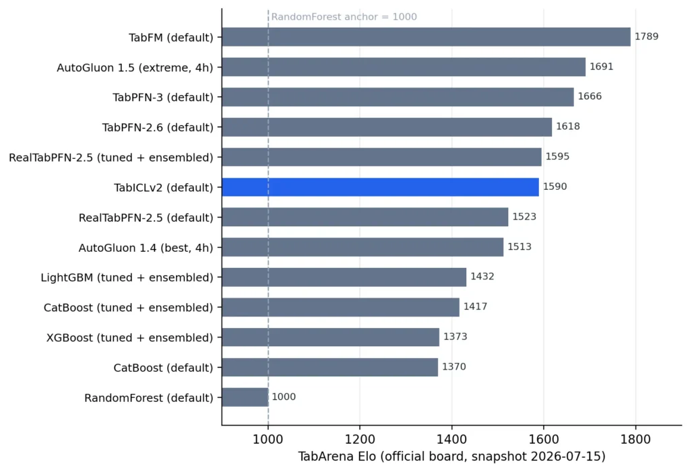

> 🎙️ **Listen to the podcast version of this article:**
> <audio controls src="index.mp3"></audio>


---

> \u2022 **TL;DR:** Anthropic\’s Claude Opus 5 delivers near-frontier AI intelligence at half the cost, redefining enterprise workflows with self-verifying agents and token efficiency. Meanwhile, Tabular LLMs emerge as zero-shot spreadsheet predictors, outpacing tuned XGBoost models on key benchmarks. For startups, the open-weight AI era demands new strategies to retain value amid hypergrowth and hidden inference costs.

| Metric / Innovation Area | Insight / Takeaway |
|-------------------------|---------------------|
| **Claude Opus 5 Cost** | $5M input / $25M output tokens, same as Opus 4.8 but with 2x performance |
| **Frontier-Bench v0.1** | 43.3% (vs. Opus 4.8\’s 18.7%, Fable 5\’s 33.7%) |
| **ARC-AGI 3** | 3x higher scores than next best model |
| **OSWorld 2.0** | Matches Fable 5 at 1/3 the cost |
| **Token Efficiency** | 26% fewer tokens, 9% higher accuracy, 30% fewer tool calls |
| **Tabular LLM Elo** | 1575 (TabICLv2) vs. 1432 (tuned LightGBM) on TabArena |
| **Tabular LLM Speed** | 2.9 pages/sec (Marker v2) vs. 0.54 (MinerU) |
| **Startup AI Revenue** | $9B projected for Anthropic (2025), $20-26B target (2026) |

---

# The AI Revolution of 2026: Claude Opus 5, Tabular LLMs, and the New Economics of Enterprise AI



## Introduction

The AI landscape of 2026 is defined by three seismic shifts: the rise of **cost-efficient frontier models** like Anthropic\’s Claude Opus 5, the emergence of **Tabular LLMs** as zero-shot spreadsheet predictors, and the **economic reckoning** facing startups in the open-weight era. These developments are not just technical milestones—they represent a fundamental reordering of how enterprises deploy AI, how data scientists approach prediction tasks, and how startups must structure their businesses to survive.

This analysis explores these three pillars of the AI revolution, their benchmarks, architectures, and the strategic implications for businesses and developers alike.

---

## Anthropic\’s Claude Opus 5: The Daily Driver for Enterprise AI

### What is Claude Opus 5?

Anthropic\’s **Claude Opus 5** is not just another incremental update—it\’s a strategic pivot in the AI economy. Positioned as the \"daily driver\" for enterprises, Opus 5 delivers **near-frontier intelligence** at a fraction of the cost of its predecessor, **Claude Fable 5**, which remains reserved for long-horizon, autonomous tasks. This model is optimized for **bounded tasks**, where efficiency, speed, and cost per task are critical.

The pricing model remains unchanged from Opus 4.8—**$5 per million input tokens and $25 per million output tokens**—but the performance gains are substantial. Opus 5 is now the default model on **Claude Max** (Anthropic\’s premium consumer tier) and the strongest model available on **Claude Pro**, signaling its role as the workhorse of the lineup.

### Key Features and Benchmarks

#### 1. Performance vs. Cost Efficiency

Opus 5\’s benchmarks reveal a model that punches far above its weight class:

- **Frontier-Bench v0.1 (Agentic Coding):** Opus 5 scores **43.3%**, more than double Opus 4.8\’s **18.7%** and ahead of Fable 5\’s **33.7%**—all at a lower cost per task.
- **ARC-AGI 3 (Novel Problem-Solving):** Opus 5 achieves **three times higher scores** than the next best model, demonstrating its prowess in creative and analytical tasks.
- **OSWorld 2.0 (Computer-Use Benchmarks):** It matches Fable 5\’s performance at **just over a third of the cost**, making it a compelling choice for enterprises balancing performance and budget.

These results come with notable caveats. Anthropic acknowledges that Opus 5 trails **Mythos 5** in cybersecurity and biology research, and an OpenAI model still leads in one agentic coding benchmark. However, the model\’s true strength lies in **bounded tasks**—scenarios where benchmarks can fully capture its capabilities.



#### 2. Self-Verifying Agents and Workflow Automation

One of Opus 5\’s most transformative features is its ability to **verify its own work** and iterate until success. This capability is a game-changer for enterprises, as it reduces the hidden costs of human review and accelerates deployment. Examples from Anthropic\’s testing include:

- **3D CAD Model Reconstruction:** Opus 5 autonomously extracted geometry from raw pixels, outperforming competitors in a task where it was intentionally given no direct view of the drawing.
- **Bug Fixing:** It identified root causes in open-source packages, whereas competitors only patched symptoms.
- **Market Data Feeds:** Engineers used Opus 5 to build a live market data feed for a new exchange in a single session, with the model even constructing its own test harness for validation.

Early adopters report similar behaviors in production. **Harvey**, a legal AI company, found Opus 5 achieved similar performance to Opus 4.8\’s maximum-reasoning mode while generating **26% fewer tokens on average**. **Fundamental Research Lab** observed **9% higher accuracy** on hard financial-modeling tasks while using **30% fewer turns and tool calls** and **60% less time**.

#### 3. Safety and Fallback Mechanisms

Anthropic\’s approach to safety in Opus 5 is both intricate and pragmatic. The model includes:

- **Automated Behavioral Audits:** Opus 5 scores **2.3 on misaligned behavior**, the lowest among Anthropic\’s lineup, with reduced rates of deceptive behavior and susceptibility to misuse.
- **Cybersecurity Safeguards:** While Opus 5 improved on vulnerability detection (nearly matching Mythos 5\’s 80% rate on the OSS-Fuzz evaluation), it intentionally avoids training on offensive cyber tasks. This results in a deliberate asymmetry: strong at **defense-relevant discovery** but weak at **offense-relevant exploitation**.
- **Fallback Routing:** If a request triggers a safety classifier, the system defaults to **Opus 4.8**, with clear user notifications. The logic: lower-capability models pose less risk, even if the question itself is the same.

### Enterprise Impact: Why This Matters

#### Cost Efficiency and Token Savings

Enterprise AI spending is no longer experimental—it\’s a **board-level expense**. Opus 5\’s pricing strategy is designed to make previously marginal tasks economically viable. Early customers report:

- **Zapier\’s AutomationBench:** Opus 5 topped the leaderboard **without spending more tokens** than prior models, achieving a **100% success rate** on churn-prevention workflows where previous models failed.
- **Cognition\’s Devin:** On FrontierCode 1.1, Opus 5 **approaches Fable-level performance at half the cost**, with particular strength in debugging and root-cause analysis.

The economic implications are clear: **every task that was marginal at Opus 4.8\’s cost becomes viable at Opus 5\’s**. For a company like Anthropic, whose revenue is projected to hit **$9 billion by the end of 2025** (with internal targets of **$20-26 billion for 2026**), this efficiency is critical to sustaining growth.

#### The Shift from Frontier to Forward Deployment

Anthropic\’s strategy signals a broader industry shift: the center of gravity in AI is moving from **what a model can do on its best day** to **what a very good model can do every day, affordably**. This is reflected in Opus 5\’s **adjustable effort settings**, which allow customers to trade intelligence for speed and token savings.

For enterprises, this means:
- **Recurring Revenue:** Efficient models drive recurring token usage, turning AI from a capital expense to an operational one.
- **Deployment Readiness:** Self-verifying agents reduce the need for human oversight, accelerating the path from pilot to production.
- **Scalability:** Lower costs per task enable broader adoption across workflows.

---

## Tabular LLMs: The Zero-Shot Spreadsheet Revolution

### What Are Tabular LLMs?

Tabular LLMs represent a **paradigm shift** in how we approach structured data prediction. Unlike traditional machine learning models, which require extensive feature engineering and hyperparameter tuning, Tabular LLMs are **foundation models** that predict missing columns in spreadsheets **zero-shot**—meaning they can make accurate predictions on new datasets without any training.

These models are inspired by the architecture of traditional LLMs but are optimized for **tabular data**, which includes structured datasets like CSV files, Excel sheets, and databases. They leverage **pretrained transformers** that learn to predict missing values by attending to similar rows in the provided context, much like how LLMs complete text based on prior examples.

### How Do Tabular LLMs Work?

Tabular LLMs operate using a **three-stage pipeline**, as illustrated in the architecture below:



1. **Tokenization and Embedding:** Each cell in the table is converted into an embedding that reflects its **contextual meaning** within its column. For example, the number \"450\" in a price column is treated differently from \"450\" in a postcode column.
2. **Row Summarization:** Each row is collapsed into a single vector using attention mechanisms, with learned query tokens (e.g., [CLS] tokens) summarizing the row\’s features.
3. **In-Context Learning:** The model predicts missing values for test rows by attending to labeled training rows, effectively performing a **learned k-nearest neighbors** operation.

Mathematically, this can be represented as:

$$ P(y | X_{test}) = 	ext{Attention}(X_{test}, X_{train}) \cdot y_{train} $$

Where:
- $X_{test}$ is the test row with missing values.
- $X_{train}$ is the set of labeled training rows.
- $y_{train}$ are the known labels for the training rows.
- The attention mechanism weights the contribution of each training row based on similarity to the test row.

### Benchmark Breakdown: Tabular LLMs vs. XGBoost

The **TabArena** benchmark, a living leaderboard for tabular data prediction, reveals that Tabular LLMs now **outperform fully tuned gradient-boosted trees (GBDTs)** like XGBoost in most scenarios. Here\’s how the models stack up:

- **TabICLv2 (28M parameters):** Achieves an **Elo score of 1575**, compared to **1432** for the best-tuned LightGBM configuration. This places it **158 Elo points ahead** of the strongest GBDT.
- **Speed:** TabICLv2\’s median predict time is **0.38 seconds per 1,000 rows**, faster than tuned LightGBM (2.64s) and comparable to tuned CatBoost.
- **Cost:** A full 51-dataset sweep on TabICLv2 costs just **$2** on an A10G GPU, demonstrating its efficiency.



#### Where XGBoost Still Wins

While Tabular LLMs are impressive, XGBoost and other GBDTs retain advantages in specific scenarios:

1. **High-Dimensional Data:** For tables with **>100 features**, GBDTs outperform Tabular LLMs. For example, on the **Bioresponse** dataset (1,776 features), tuned LightGBM wins decisively.
2. **High-Cardinality Categoricals:** On datasets like **Amazon_employee_access**, which has many unique categorical values, GBDTs maintain an edge.
3. **Interpretability:** Traditional ML models offer better interpretability, which is crucial for regulated industries.

### Practical Applications of Tabular LLMs

Tabular LLMs are versatile and can be applied across industries:

1. **Financial Forecasting:** Predict missing revenue or expense data in financial spreadsheets.
2. **Healthcare Analytics:** Fill in missing patient data, such as lab results or treatment outcomes.
3. **Supply Chain Optimization:** Predict missing inventory data to reduce stockouts and overstock.
4. **Customer Insights:** Predict missing customer behavior data for personalized marketing.

### Code Example: Using TabICLv2

Tabular LLMs are designed to be user-friendly, with interfaces similar to scikit-learn. Here\’s how to use **TabICLv2** for a classification task:

```python
from tabicl import TabICLClassifier
import pandas as pd

# Load your data
X_train = pd.DataFrame(...)  # Features
y_train = pd.Series(...)      # Labels
X_test = pd.DataFrame(...)    # Test features

# Initialize and fit the model (no hyperparameter tuning needed)
clf = TabICLClassifier()
clf.fit(X_train, y_train)  # Stores context, no gradient training

# Predict probabilities
proba = clf.predict_proba(X_test)  # One forward pass
```

This simplicity, combined with zero-shot performance, makes Tabular LLMs a powerful tool for data scientists and analysts.

### The Future of Tabular Prediction

The rise of Tabular LLMs signals a shift in how we approach structured data. While GBDTs like XGBoost will remain relevant for high-dimensional or interpretability-critical tasks, Tabular LLMs are poised to become the **default choice for most tabular prediction problems**, especially where speed, ease of use, and zero-shot performance are prioritized.

---

## Startup Spotlight: Navigating the Open-Weight AI Era

### The Problem with Hypergrowth AI Startups

The AI startup ecosystem is experiencing unprecedented growth, with companies achieving **$100 million ARR in record time**. However, this hypergrowth comes with hidden challenges, particularly around **open-weight AI models**—models whose weights are publicly available for free or low-cost use.

Key statistics highlight the prevalence of open-weight models:
- **80% of startups** use open-weight models.
- These models represent **25% to 50% of inference volume** on platforms like OpenRouter and Vercel.

While open-weight models are cost-effective, they introduce **hidden dependencies and inefficiencies**:

1. **Token Savings vs. Revenue Ownership:** Customers may expect cost savings, but if the model is free, the startup may not capture the full economic value.
2. **Inference Costs:** Even if the model is free, the cost of running inference at scale can become a significant expense.
3. **Vendor Lock-in:** Startups may become dependent on specific model providers, limiting flexibility and innovation.

### Open-Weight Unbundling: The Shrinking Capability Gap

The gap between **frontier models** (e.g., Anthropic\’s Fable 5) and **open-weight models** is shrinking rapidly—now just **4 to 6 months** in performance. This trend is accelerating the **unbundling of AI**, where:

- Startups can **choose models** based on cost and performance, rather than being locked into expensive frontier options.
- Open-weight models are becoming **more powerful**, reducing the need for costly proprietary models.
- Competition is intensifying, with companies like Anthropic, OpenAI, and others releasing open-weight alternatives.

#### Key Models to Watch

- **Kimi K3:** A cutting-edge open-weight model designed for efficiency and scalability.
- **Claude Opus 5:** Redefining the economics of enterprise AI with its cost-efficient performance.
- **OpenRouter and Vercel:** Platforms aggregating open-weight models for cost-effective inference.

### Strategies for Sustainable AI Startups

To thrive in the open-weight era, startups must adopt strategies that **retain value and ensure long-term sustainability**:

#### 1. Own the Value Chain

Instead of relying solely on open-weight models, startups should:
- **Develop proprietary models** or fine-tune open-weight models for specific use cases.
- **Build inference infrastructure** to reduce reliance on external providers.
- **Offer hybrid solutions** that combine open-weight models with custom logic.

#### 2. Focus on Forward Deployment Economics

**Forward deployment** involves embedding AI solutions directly into customer environments, ensuring:
- **Customer Trust:** Hands-on collaboration builds confidence in the solution.
- **Faster Iterations:** Real-world feedback drives rapid improvements.
- **Long-Term Partnerships:** Shared success fosters lasting relationships.

Anthropic\’s approach with Opus 5 exemplifies this strategy. By offering a model that excels in **bounded tasks**, they enable enterprises to deploy AI solutions quickly and cost-effectively, driving recurring revenue.

#### 3. Leverage Open-Weight Models Wisely

Startups should:
- **Benchmark open-weight models** against proprietary solutions to ensure cost-effectiveness.
- **Combine open-weight models** with custom validation and deployment logic to add unique value.
- **Monitor token usage** to avoid hidden costs in inference.

### Case Study: Legal AI Startup

Consider a legal AI startup using **Claude Opus 5** for document analysis but adding **custom legal validation** to ensure accuracy. This hybrid approach ensures:
- **Lower token costs** compared to using a full-fledged frontier model.
- **Higher revenue** from premium legal services.
- **Customer trust** through transparent, controlled workflows.

By combining open-weight models with proprietary logic, the startup retains value while benefiting from the cost efficiencies of open-weight AI.

---

## The Big Picture: Where AI Is Headed in 2026

The developments in **Claude Opus 5**, **Tabular LLMs**, and the **open-weight startup ecosystem** paint a clear picture of where AI is headed:

1. **Cost Efficiency as the New Frontier:** The AI race is shifting from raw capability to **economic viability**. Models like Opus 5 prove that near-frontier performance can be delivered at a fraction of the cost, making AI accessible to a broader range of enterprises.
2. **Zero-Shot Prediction as the Norm:** Tabular LLMs demonstrate that **foundation models** can outperform traditional ML techniques on structured data, reducing the need for manual feature engineering and hyperparameter tuning.
3. **Sustainable Business Models:** Startups must move beyond reliance on open-weight models alone. By **owning the value chain** and focusing on **forward deployment**, they can build resilient, profitable businesses.

### The Role of Regulation and Ethics

As AI becomes more integrated into enterprise workflows, **regulatory and ethical considerations** are coming to the forefront. Anthropic\’s **$1.5 billion copyright settlement** with book authors and the U.S. government\’s move to **block foreign access** to advanced models highlight the growing intersection of AI and policy. Startups must navigate these complexities while ensuring their models are **safe, transparent, and compliant**.

---

## Conclusion: The AI Economy in 2026

The AI landscape of 2026 is defined by **three revolutions**:

1. **Claude Opus 5** is redefining enterprise AI by delivering **frontier-level performance at half the cost**, enabling businesses to deploy AI solutions at scale without breaking the bank.
2. **Tabular LLMs** are transforming how we approach structured data, offering **zero-shot predictions** that outperform traditional ML models in most scenarios.
3. **Startups** must adapt to the open-weight era by **owning their value chains**, focusing on **forward deployment**, and leveraging open-weight models **strategically**.

For enterprises, developers, and startups alike, the message is clear: **the future of AI is not just about building better models—it\’s about building better businesses around them**. The tools and strategies emerging in 2026 are laying the foundation for a more **accessible, efficient, and sustainable** AI economy.

---

### Further Reading

- [Anthropic\’s Official Blog Post on Claude Opus 5](https://www.anthropic.com)
- [TabArena Benchmark: Frontier-Bench, ARC-AGI, and OSWorld 2.0](https://tabarena.ai)
- [TabICLv2: A Better, Faster, Scalable, and Open Tabular Foundation Model](https://huggingface.co/tabicl)
- [Datalab Marker v2 Benchmarks](https://github.com/datalab-ai/marker)
- [Enterprise AI Adoption Trends in 2026](https://contrary.com)

Written with [Argos](https://github.com/Neilstid/argos)
