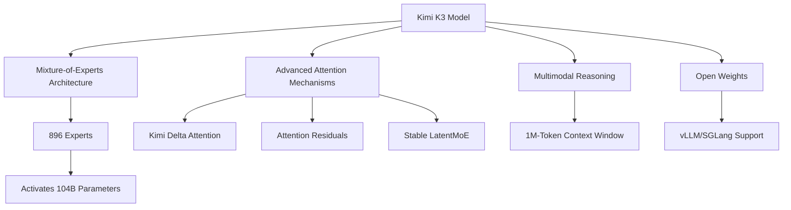
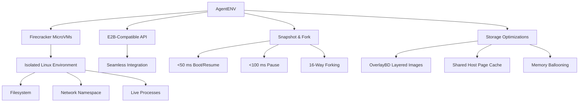
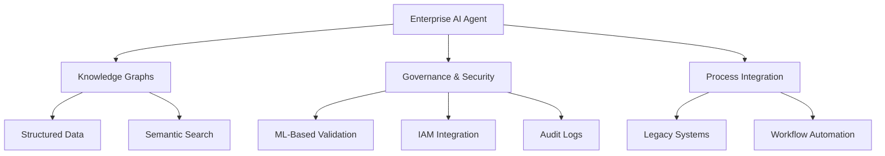

> 🎙️ **Listen to the podcast version of this article:**
> <audio controls src="index.mp3"></audio>

---

> 💡 **TL;DR:** Moonshot AI’s Kimi K3, a 2.8 trillion-parameter Mixture-of-Experts (MoE) model, has released full weights, enabling self-hosted deployments for enterprises. The model introduces advanced attention mechanisms and a custom license with revenue-based commercial obligations. Alongside, the open-sourced AgentENV system powers agentic reinforcement learning (RL) for Kimi K3, using Firecracker microVMs for scalable, isolated agent training. Enterprises must navigate licensing terms while leveraging these tools to build secure, context-aware AI agents.

| Metric / Innovation Area | Insight / Takeaway |
|--------------------------|---------------------|
| **Model Architecture** | 2.8T parameters, MoE with 896 experts, activating 104B parameters; 1M-token context window. |
| **Attention Mechanisms** | Kimi Delta Attention, Attention Residuals, and Stable LatentMoE for enhanced multimodal reasoning. |
| **Licensing Thresholds** | Commercial use requires negotiation for companies with >$20M annual revenue operating "Model as a Service." |
| **Attribution Requirements** | "Kimi K3" must be prominently displayed for deployments with >100M MAU or >$20M monthly revenue. |
| **Internal Use Exemption** | No restrictions for internal deployments not exposed to third parties. |
| **AgentENV Innovation** | Firecracker microVMs enable millisecond snapshot/resume and 16-way forking for scalable RL training. |
| **E2B Compatibility** | AgentENV’s API is E2B-compatible, allowing seamless integration with existing agent workflows. |

### Introduction

The AI landscape is undergoing a seismic shift as frontier models transition from closed, API-only systems to open-weight architectures that enterprises can self-host. At the forefront of this movement is **Moonshot AI’s Kimi K3**, a 2.8 trillion-parameter Mixture-of-Experts (MoE) model that combines cutting-edge architectural innovations with a nuanced licensing framework. Alongside Kimi K3, Moonshot and **kvcache-ai** have open-sourced **AgentENV**, a distributed system designed to power agentic reinforcement learning (RL) at scale.

This article dives into the technical and strategic implications of Kimi K3’s release, dissects its licensing terms for enterprise adopters, and explores how AgentENV is redefining the training of AI agents. We also examine how enterprises can integrate these advancements into their AI strategies, with a focus on knowledge graphs, governance, and scalable deployment.

---

### 1. Kimi K3: Open Weights and Licensing Insights

#### What is Kimi K3?

Kimi K3 is Moonshot AI’s latest flagship model, representing a leap forward in open-weight AI. With **2.8 trillion parameters**, it is one of the largest openly available models to date. Its architecture leverages a **Mixture-of-Experts (MoE) design**, activating **104 billion parameters** from a pool of **896 experts**, which allows for efficient inference while maintaining high performance. The model supports a **one-million-token context window**, enabling it to process and reason over exceptionally long inputs—critical for tasks like document analysis, code generation, and multimodal reasoning.

Kimi K3’s release includes not just the model weights but also a **47-page technical report** detailing its training innovations, optimized inference infrastructure, and deployment components. This comprehensive package is aimed at researchers and enterprises seeking to **self-host** the model rather than rely solely on Moonshot’s API. The model is compatible with popular inference frameworks like **vLLM** and **SGLang**, further lowering the barrier to deployment.

#### Key Features and Innovations

Kimi K3 introduces several architectural advancements that set it apart from previous generations:

- **Mixture-of-Experts (MoE) Architecture**: The MoE design allows Kimi K3 to dynamically activate a subset of its 896 experts, reducing computational overhead while maintaining performance. This is particularly valuable for enterprises balancing cost and capability.
- **Advanced Attention Mechanisms**: The model incorporates **Kimi Delta Attention**, **Attention Residuals**, and **Stable LatentMoE**, which enhance its ability to handle long-range dependencies and multimodal inputs. These mechanisms are critical for tasks requiring deep contextual understanding, such as legal document analysis or complex code generation.
- **Multimodal Reasoning**: Kimi K3 natively supports multimodal inputs, enabling it to process and reason over text, images, and other data types seamlessly.

The model’s **open-weight release** is a significant milestone, as it allows organizations to deploy Kimi K3 on their own infrastructure, ensuring data privacy and control. However, the term "open" comes with caveats, as we’ll explore in the next section.

#### Licensing Terms and Enterprise Implications

Kimi K3’s licensing terms are where the model’s "open" nature becomes nuanced. While the license grants broad permissions for **downloading, modifying, and deploying** the model for commercial purposes, it imposes specific obligations on larger enterprises and AI service providers. Here’s a breakdown of the key clauses:

1. **General Permissions**: Enterprises can freely use, modify, and distribute Kimi K3, provided they comply with applicable laws and include the copyright notice.
2. **"Model as a Service" Restrictions**: Companies with **aggregate annual revenue exceeding $20 million** that operate a "Model as a Service" (i.e., providing third parties with access to inference or fine-tuning capabilities) must negotiate a **separate commercial agreement** with Moonshot AI. This clause is particularly relevant for cloud providers, AI startups, and other organizations offering model-hosting services.
   - **Definition of "Model as a Service"**: This includes any deployment where third parties can exercise meaningful control over inputs, parameters, or training data. It explicitly excludes end-user products with embedded model capabilities (e.g., a chatbot feature in a larger application) or mere relaying of requests to other hosted models.
3. **Attribution Requirements**: For deployments with **>100 million monthly active users (MAU)** or **>$20 million in monthly revenue**, the "Kimi K3" branding must be **prominently displayed** in the user interface.
4. **Internal Use Exemption**: The restrictions in clauses 2 and 3 **do not apply** to internal use cases where the model’s capabilities are not exposed to third parties. This exemption is critical for enterprises using Kimi K3 for internal workflows, such as document analysis, code generation, or employee productivity tools.

The licensing terms have sparked debate in the AI community. While some praise Moonshot for releasing the weights and supporting infrastructure, others argue that the model is more accurately described as **"open weights" rather than "open source"**, given the commercial conditions attached to large-scale deployments. This distinction is becoming increasingly common among frontier AI models, as developers seek to balance openness with sustainable commercialization.

**Why It Matters for Enterprises**

For enterprises evaluating Kimi K3, the first step is to **clarify the intended use case**:
- **Internal Deployments**: If the model will be used exclusively for internal purposes (e.g., employee tools, research, or productivity workflows), the licensing terms are highly permissive.
- **Customer-Facing Deployments**: Organizations planning to build products or services on top of Kimi K3 must carefully assess whether their use case qualifies as "Model as a Service" and whether they meet the revenue thresholds. Legal and compliance teams should collaborate with engineering to ensure alignment with Moonshot’s terms.
- **Branding Considerations**: Companies expecting to scale to >100M MAU or >$20M monthly revenue must plan for the attribution requirement, which may impact product design and branding strategies.

The broader implication is that **"open weights" and "open source" are no longer synonymous** in the AI landscape. Enterprises must treat licensing terms with the same rigor as technical benchmarks, security reviews, and infrastructure planning.

---

### 2. Open-Sourcing AgentENV: Reinforcement Learning for Kimi K3

#### What is AgentENV?

AgentENV (AENV) is a **distributed system** open-sourced by Moonshot AI’s Kimi team and **kvcache-ai** to power **agentic reinforcement learning (RL) training** for Kimi K3. It addresses a critical bottleneck in agentic RL: the need for **isolated, scalable, and fast environments** where AI agents can act, learn, and iterate.

Traditional RL for language models often involves sampling text, but **agentic RL** requires the model to interact with a **real computer environment**—complete with a filesystem, network stack, and live processes. This introduces a trade-off:
- **Containers**: Fast to start but share the host kernel, weakening isolation for untrusted or model-generated code.
- **Full Virtual Machines (VMs)**: Provide strong isolation but are slow to boot and consume memory even when idle.

AgentENV bridges this gap by using **Firecracker microVMs**, a lightweight virtualization technology developed by AWS. Firecracker provides **kernel-level isolation** while enabling **millisecond-level snapshot and resume capabilities**, making it ideal for large-scale RL training.

#### Technical Highlights

AgentENV’s architecture is designed for **performance, scalability, and flexibility**:

- **Firecracker MicroVMs**: Each agent sandbox runs in its own Firecracker microVM, providing a **dedicated Linux kernel, filesystem, and network namespace**. This ensures strong isolation while maintaining efficiency.
- **E2B-Compatible API**: AgentENV exposes an API compatible with **E2B**, a popular framework for running AI agents in sandboxed environments. This allows teams already using E2B to **self-host AgentENV without rewriting their agent code**.
- **Snapshot and Fork Capabilities**: AgentENV supports **incremental snapshots** of memory and filesystem changes, enabling:
  - **Boot/Resume in <50 ms**
  - **Pause in <100 ms**
  - **16-way forking**: A running sandbox can clone into up to 16 independent child sandboxes on the same node, inheriting the parent’s filesystem, memory, and resource configuration. This is particularly valuable for RL, where expensive setup (e.g., installing dependencies, cloning repositories) can be done once and then branched into parallel rollouts.

The system also includes optimizations for **storage and memory efficiency**:
- **OverlayBD Layered Images**: The root filesystem is served via **ublk userspace block devices** backed by overlayBD, which shares read-only base layers across sandboxes while allowing each to write to its own upper layer.
- **Shared Host Page Cache**: Reduces memory overhead by sharing cache across storage and memory-snapshot data.
- **Memory Ballooning**: Reclaims unused guest memory to sustain overcommit as environments diverge.

#### Impact on AI Agent Development

AgentENV addresses several critical challenges in **scalable agent training**:

1. **Efficient Training Environments**: By leveraging Firecracker microVMs, AgentENV provides **kernel-level isolation** without the overhead of traditional VMs. This is essential for safely running untrusted or model-generated code during RL training.
2. **Scalability**: The ability to **fork sandboxes** into 16 independent children enables parallelized training workflows, significantly speeding up iteration cycles. This is particularly valuable for complex tasks requiring extensive exploration, such as software development or multi-step reasoning.
3. **Flexibility**: AgentENV’s compatibility with E2B and its support for **on-demand image loading** and **distributed storage** (via S3-compatible backends) make it adaptable to a wide range of deployment scenarios, from single-node setups to multi-node clusters.

**Deployment Paths**

AgentENV offers multiple deployment options to suit different infrastructure needs:
- **Install Script**: Runs the server as a **systemd service** (requires Linux kernel 6.8+ and `/dev/kvm` access).
- **Docker Image**: Available at `ghcr.io/kvcache-ai/aenv-server`.
- **Docker Compose**: Simulates a multi-node cluster for testing.
- **Kubernetes**: Includes manifests for a **gateway**, **scheduler**, and **node DaemonSet** for production-grade deployments.
- **Build from Source**: For advanced users, the project can be compiled using the Rust toolchain.

**Why It Matters**

AgentENV lowers the barrier to **large-scale agentic RL training**, enabling organizations to build more capable, autonomous AI agents. By providing a **scalable, isolated, and efficient** environment for agent training, it accelerates the development of agents that can interact with complex systems, such as enterprise workflows, development environments, or even other AI models.

For enterprises, this means the ability to **train custom agents** that can navigate proprietary systems, automate workflows, and perform tasks requiring deep contextual understanding—all while maintaining security and isolation.

---

### 3. Enterprise AI Agents: Knowledge Graphs and Governance

#### The Need for Enterprise Context

While models like Kimi K3 and systems like AgentENV provide the **computational foundation** for AI agents, enterprises must also ensure their agents are **grounded in company-specific knowledge**. Generic AI models, no matter how advanced, lack the **contextual understanding** of an organization’s internal processes, data, and workflows.

This is where **knowledge graphs** and **vector-embedded data** come into play. As highlighted by **SAP**, enterprise AI agents must be able to **retrieve and process internal information** accurately to perform tasks effectively. Knowledge graphs provide a structured way to represent relationships between entities (e.g., customers, products, transactions), enabling agents to **reason over complex data** and make contextually relevant decisions.

#### Key Strategies for Enterprise AI Agents

To deploy AI agents that are **secure, compliant, and effective**, enterprises should consider the following strategies:

1. **Knowledge Graphs**:
   - **Structured Data Representation**: Knowledge graphs allow agents to query and reason over **interconnected data**, such as customer relationships, supply chains, or financial transactions.
   - **Semantic Search**: By combining knowledge graphs with **vector embeddings**, agents can perform **hybrid search**—retrieving both structured data (via graph queries) and unstructured data (via semantic similarity).
   - **Example Use Case**: An AI agent assisting a sales team could use a knowledge graph to identify upsell opportunities by analyzing customer purchase histories and product compatibility.

2. **Governance and Security**:
   - **Machine Learning-Based Validation**: Enterprises can use ML models to **validate agent outputs**, ensuring they adhere to internal policies, regulatory requirements, and ethical guidelines.
   - **Identity and Access Management (IAM)**: Agents should integrate with existing IAM systems to **authenticate users** and **authorize actions**, preventing unauthorized access to sensitive data or systems.
   - **Audit Logs**: Maintaining detailed logs of agent interactions enables **traceability** and **accountability**, which are critical for compliance and debugging.

3. **Process Integration**:
   - **Legacy System Compatibility**: Many enterprises rely on **on-premises or legacy systems** that cannot be easily replaced. AI agents must be designed to **integrate with these systems**, whether through APIs, middleware, or custom connectors.
   - **Workflow Automation**: Agents should align with existing **business processes**, automating repetitive tasks (e.g., data entry, report generation) while escalating complex decisions to human operators.

#### SAP’s Approach to Autonomous AI Agents

SAP’s **Joule** platform exemplifies how enterprises can build **autonomous, context-aware AI agents**. Joule integrates:
- **Knowledge Graphs**: To enable agents to **navigate and reason over** SAP’s vast ecosystem of enterprise data.
- **Governance Frameworks**: To ensure agents operate within **compliance and security boundaries**.
- **Identity Management**: To authenticate users and control access to sensitive data.

By combining these elements, SAP’s agents can **automate complex workflows** (e.g., procurement, inventory management) while maintaining **transparency and accountability**. This approach serves as a blueprint for other enterprises looking to deploy AI agents at scale.

**Why It Matters**

For enterprises, the key to successful AI agent deployment lies in **balancing capability with control**. While models like Kimi K3 provide the **raw intelligence**, systems like AgentENV enable **scalable training**, and frameworks like knowledge graphs and governance ensure **contextual relevance and security**.

The future of enterprise AI will be defined by **autonomous agents** that can **reason, act, and learn** within the constraints of an organization’s data, processes, and policies. Companies that invest in these foundational elements today will be best positioned to **harness the full potential of AI** in the years to come.

---

### Conclusion

The release of **Kimi K3** and **AgentENV** marks a pivotal moment in the evolution of AI. Moonshot AI has not only pushed the boundaries of **open-weight models** but also provided the tools to **train and deploy next-generation AI agents** at scale. However, the nuanced licensing terms of Kimi K3 underscore a broader trend in the AI industry: the growing distinction between **"open weights" and "open source."**

For enterprises, the path forward involves:
1. **Evaluating Use Cases**: Determine whether Kimi K3 will be used internally or as part of a customer-facing service, and assess the licensing implications accordingly.
2. **Leveraging AgentENV**: Use AgentENV to build **scalable, isolated, and efficient** training environments for AI agents, enabling them to interact with complex systems safely.
3. **Investing in Context and Governance**: Ground agents in **enterprise-specific knowledge** using knowledge graphs and enforce **security and compliance** through governance frameworks.

As AI continues to evolve, the focus will shift from **model performance alone** to **how models are deployed, governed, and integrated** into real-world workflows. Kimi K3 and AgentENV are not just technological milestones—they are **catalysts for a new era of enterprise AI**, where autonomy, scalability, and control converge.

Written with [Argos](https://github.com/Neilstid/argos)
