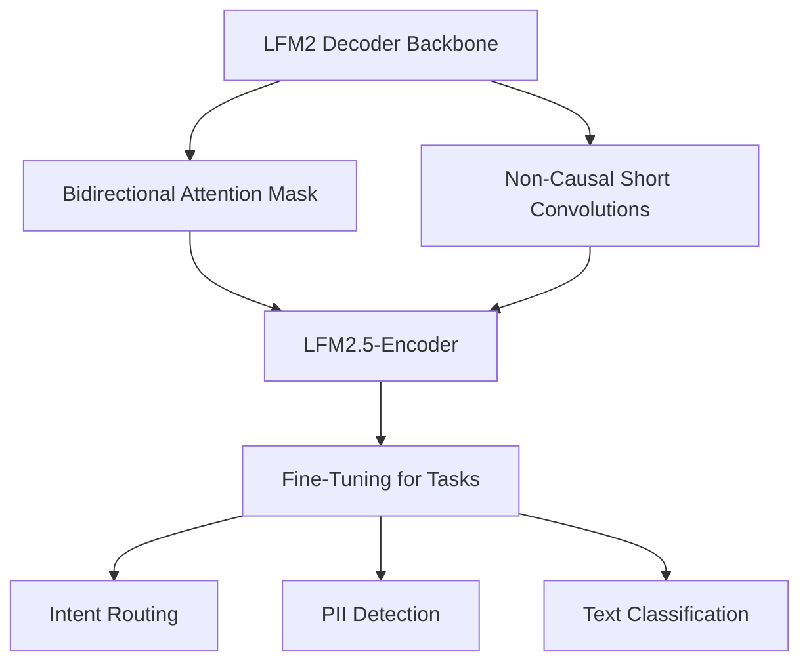
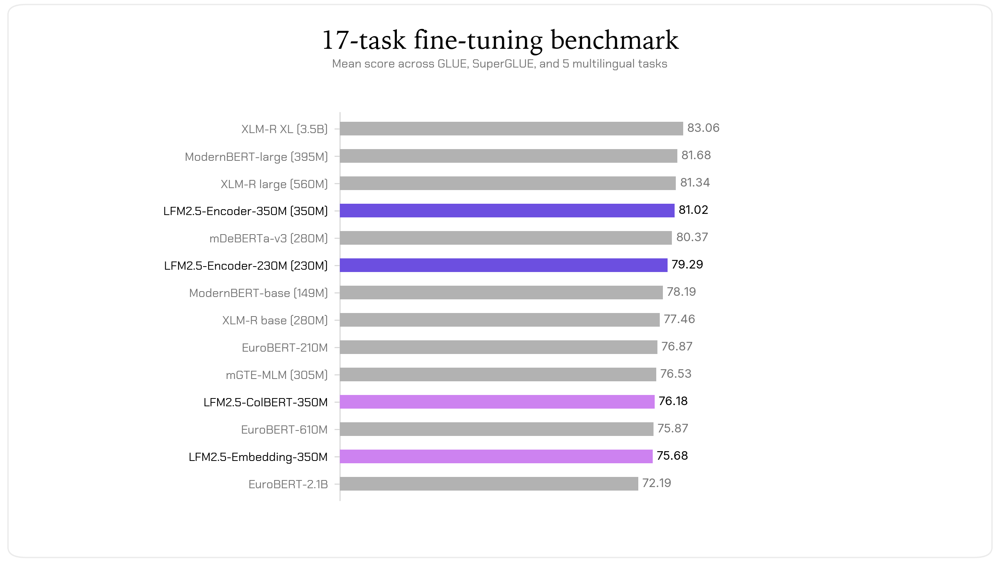
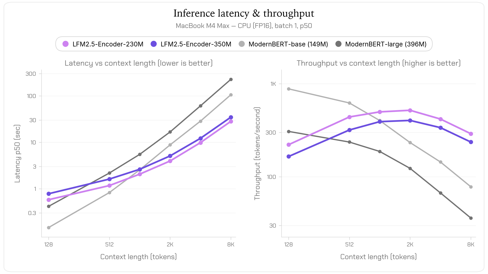
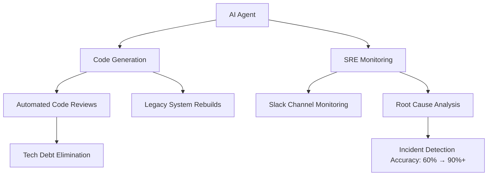

> 🎙️ **Listen to the podcast version of this article:**
> <audio controls src="index.mp3"></audio>


---

> 💡 **TL;DR:** This article dives into three transformative AI developments: **LFM2.5-Encoders**, which deliver lightning-fast, cost-effective NLP inference on CPUs with 8,192-token contexts; **Kimi K3**, Moonshot AI’s 2.8T-parameter open-weight multimodal model that rivals closed-source giants; and **Instacart’s AI-driven engineering revolution**, where agents handle 97% of code generation and SRE tasks, redefining the role of human engineers. Together, these innovations mark a shift toward faster, more accessible, and autonomous AI systems.

| Metric / Innovation Area | Insight / Takeaway |
|--------------------------|-------------------|
| **LFM2.5-Encoders** | 3.7x faster than ModernBERT on CPU for 8,192-token contexts; ranks 4th on GLUE/SuperGLUE benchmarks. |
| **Kimi K3** | 2.8T parameters, 1M-token context window, 88.3 Terminal-Bench score; open-weight for individuals and small companies. |
| **Instacart AI Agents** | 97% of code generation automated; SRE incident detection accuracy improved from 60% to >90%. |

---

### LFM2.5-Encoders: Revolutionizing Fast CPU-Based NLP Inference

#### Introduction to Lightweight, High-Performance Encoders
Natural Language Processing (NLP) has long been dominated by heavyweight models that demand GPU acceleration and vast computational resources. Yet, for many production applications—intent routing, PII detection, or text classification—what’s needed is **speed, efficiency, and reliability on commodity hardware**. Enter **LFM2.5-Encoders**, a breakthrough in lightweight NLP models designed for **blazing-fast CPU-based inference** while supporting contexts up to **8,192 tokens** with minimal latency.

These models are not just fast; they’re **highly accurate**, ranking **fourth on GLUE/SuperGLUE benchmarks**—outperforming larger models like ModernBERT in tasks such as intent routing and PII detection. Built from the ground up for production-grade tasks, LFM2.5-Encoders are open-source, cost-effective, and optimized for the kind of high-volume, low-latency workloads that power modern applications.


#### Key Features and Advantages
LFM2.5-Encoders are engineered for **three core advantages**: performance, accuracy, and accessibility.

- **Minimal Latency on CPU**: Unlike traditional transformers that slow to a crawl on long contexts, LFM2.5-Encoders maintain **near-constant latency** as input length grows. At 8,192 tokens, they are **3.7x faster than ModernBERT-base on CPU**, processing a full contract or transcript in under 30 seconds on a laptop. This is a game-changer for applications where GPU resources are scarce or cost-prohibitive.
- **High Accuracy**: Despite their lightweight design, these encoders achieve **top-tier performance** on benchmark tasks. The **LFM2.5-Encoder-350M** ranks fourth among 14 models on GLUE/SuperGLUE, surpassing models **10x its size**. The smaller **230M variant** even outperforms ModernBERT-base while being more compact.
- **Open-Source and Production-Ready**: Designed for seamless integration, these models are **open-weight** and compatible with the Hugging Face `transformers` library. They’re ideal for high-throughput tasks like classification, routing, and extraction—where a fine-tuned encoder is **smaller, faster, and far cheaper** than a generative LLM.

For developers, this means **no more trade-offs between speed and accuracy**. You can deploy NLP applications on existing CPU infrastructure without sacrificing performance.


#### Technical Insights: Architecture and Design
LFM2.5-Encoders are derived from **LFM2 decoders**, repurposed into bidirectional encoders through a series of architectural tweaks. Here’s how they work:

1. **Bidirectional Attention Mask**: Unlike causal decoders, which only attend to past tokens, LFM2.5-Encoders use a **bidirectional mask**, allowing each token to see its neighbors on both sides. This is critical for tasks like classification, where context from the entire sequence matters.
2. **Non-Causal Short Convolutions**: The model’s convolutions are **symmetrically padded**, ensuring each token’s receptive field includes both left and right neighbors. This preserves the bidirectional nature of the encoder.
3. **Masked Language Modeling (MLM)**: During training, **30% of tokens are masked**, and the model learns to predict them—a standard but effective approach for encoders.

The training process unfolds in **two stages**:
- **General Language Competence**: Short-context MLM on a large web corpus (1,024-token context).
- **Long-Context Adaptation**: Extending the context to **8,192 tokens** while strengthening factual, legal, and multilingual capabilities.

This modular design ensures compatibility with existing NLP pipelines while introducing **unprecedented efficiency** for long-context tasks.




#### Benchmark Performance and Real-World Demos
On **GLUE/SuperGLUE benchmarks**, LFM2.5-Encoders hold their own against much larger models. The **350M variant** ranks fourth overall, while the **230M variant** outperforms ModernBERT-base despite its smaller size. But benchmarks only tell part of the story—**real-world performance** is where these models shine.



For **CPU inference**, the speed advantage is undeniable. At 8,192 tokens, ModernBERT-base takes **over 90 seconds per forward pass**, while LFM2.5-Encoder-230M completes the same task in **~28 seconds**—a **3.7x speedup**. On GPU, the margin narrows, but LFM2.5-Encoders still lead for long inputs (>2K tokens).



To showcase their versatility, Liquid AI has deployed **live demos** for:
- **Zero-shot prompt routing**: Define routing lanes as free text; the model scores prompts against all lanes in one pass.
- **Zero-shot policy linting**: Check text against company rules, with token-level scoring.
- **Spell checking**: Correct misspellings token by token.
- **PII detection**: Identify and remove **40 types of PII across 16 languages**.
- **Masked-diffusion text generation**: A bonus demo where the encoder generates text by iteratively unmasking tokens.


#### Why It Matters for Developers and Enterprises
For **developers**, LFM2.5-Encoders offer a **rare combination of speed, accuracy, and ease of use**. You can fine-tune them for your specific task with minimal overhead, and deploy them on **existing CPU infrastructure** without costly GPU investments. The open-source nature means **no vendor lock-in**, and the Hugging Face integration ensures compatibility with familiar tools.

For **enterprises**, the implications are even broader. NLP applications like **intent routing, compliance filtering, and document classification** can now run **24/7 on CPUs** with sub-30-second latency for long documents. This reduces operational costs while maintaining **production-grade accuracy**.

**Code Snippet: Getting Started with LFM2.5-Encoders**
```python
from transformers import AutoModelForMaskedLM, AutoTokenizer
import torch

# Load model and tokenizer
model_id = "LiquidAI/LFM2.5-Encoder-230M"  # or "LiquidAI/LFM2.5-Encoder-350M"
tok = AutoTokenizer.from_pretrained(model_id, trust_remote_code=True)
mlm = AutoModelForMaskedLM.from_pretrained(model_id, trust_remote_code=True)

# Masked-token prediction example
text = f"The capital of France is {tok.mask_token}."
enc = tok(text, return_tensors="pt")
with torch.no_grad():
    logits = mlm(**enc).logits
pos = (enc["input_ids"][0] == tok.mask_token_id).nonzero()[0].item()
print([tok.decode([t]).strip() for t in logits[0, pos].topk(5).indices.tolist()])
# Output: ['Paris', 'Strasbourg', 'Lyon', 'Versailles']
```

For downstream tasks, you can attach a custom head (classification, token classification, etc.) to the encoder body:
```python
from transformers import AutoModel
body = AutoModel.from_pretrained(model_id, trust_remote_code=True)
# Add your custom head here
```

**Pro Tip**: If your GPU supports it, use **Flash Attention 2** for even higher efficiency:
```bash
pip install flash-attn
```


---

### Kimi K3: The Frontier of Open-Weight AI Models

#### Introduction to Kimi K3
In the race to democratize artificial intelligence, **Moonshot AI** has fired a shot across the bow with **Kimi K3**, a **2.8 trillion-parameter open-weight model** that punches well above its weight class. Unlike many open-source models that lag behind proprietary giants, Kimi K3 is **designed to compete head-to-head with the likes of Claude and GPT-5**—while remaining **accessible to individuals and small companies**.

Kimi K3 isn’t just big; it’s **versatile**. It natively supports **text, images, and video** without requiring additional plugins or fine-tuning. And with a **1 million-token context window**, it can process **entire codebases, long documents, or extended conversations** in a single pass. This makes it a **Swiss Army knife** for developers, researchers, and enterprises alike.


#### Key Features and Performance
Kimi K3’s feature set reads like a wish list for AI practitioners:

- **Multimodal by Design**: Unlike many LLMs that treat multimodality as an afterthought, Kimi K3 **natively understands text, images, and video**. This means you can feed it a **mix of inputs**—a document with embedded charts, a video with subtitles, or a codebase with inline comments—and it will **reason across all of them seamlessly**.
- **1M-Token Context Window**: Most models struggle with contexts beyond 100K tokens. Kimi K3’s **1 million-token window** means it can handle **entire books, lengthy codebases, or hours of video transcripts** without losing track of the narrative.
- **Top-Tier Benchmark Performance**: With a score of **88.3 on Terminal-Bench**, Kimi K3 demonstrates **state-of-the-art capabilities** in complex reasoning, coding, and multimodal tasks.

But perhaps its most compelling feature is its **accessibility**.


#### Accessibility and Licensing: A New Model for Open AI
Kimi K3 is **open-weight**, meaning its **parameters are publicly available** for download and fine-tuning. This is a **rare offering** in the 2T+ parameter range, where most models are either closed-source or gated behind expensive APIs.

- **Free for Individuals and Small Companies**: If you’re a researcher, hobbyist, or small business, you can **use Kimi K3 for free**—no strings attached.
- **Commercial Use for Larger Enterprises**: Companies with **annual revenues exceeding $20 million** must negotiate a commercial license. Additionally, **large platforms** (e.g., cloud providers) must **display Kimi K3 branding** when offering it as a service.

This **tiered licensing model** strikes a balance between **openness and sustainability**, ensuring that Moonshot AI can continue investing in R&D while keeping the model accessible to the broader community.


#### Technical Compatibility: Plug-and-Play Integration
One of Kimi K3’s standout features is its **out-of-the-box compatibility** with popular AI frameworks. Whether you’re using **vLLM, SGLang, Ollama, or Docker**, Kimi K3 integrates seamlessly into your existing workflow. This reduces the **friction of adoption**, allowing teams to **deploy it quickly** without rewriting their infrastructure.

For example, running Kimi K3 with **vLLM** (a high-throughput LLM serving library) is as simple as:
```python
from vllm import LLM, SamplingParams

# Load Kimi K3 with vLLM
llm = LLM(model="moonshotai/Kimi-K3", tensor_parallel_size=4)
sampling_params = SamplingParams(temperature=0.8, top_p=0.95)

# Generate text
prompts = ["Explain the architecture of Kimi K3 in detail."]
outputs = llm.generate(prompts, sampling_params)

for output in outputs:
    print(output.outputs[0].text)
```

Or, if you prefer **Ollama** for local deployment:
```bash
ollama pull kimi-k3
ollama run kimi-k3
```

This **plug-and-play approach** makes Kimi K3 one of the most **developer-friendly** large models on the market.


#### Impact on AI Development
Kimi K3’s release has **far-reaching implications** for the AI ecosystem:

- **For Developers**: It **lowers the barrier to entry** for cutting-edge AI. No longer do you need to rely on expensive API calls to access **state-of-the-art multimodal capabilities**. You can **self-host Kimi K3** and fine-tune it for your specific needs.
- **For Enterprises**: It **reduces dependency on proprietary models**, fostering **competition and innovation**. Companies can now **build custom solutions** on top of Kimi K3 without worrying about vendor lock-in.
- **For the Open-Source Community**: It **sets a new standard** for what open-weight models can achieve. By proving that a **2.8T-parameter model** can be both **powerful and accessible**, Moonshot AI is **pushing the entire industry forward**.

**Why It Matters**: Kimi K3 isn’t just another large language model—it’s a **catalyst for change**. It challenges the notion that **only closed-source giants** can deliver top-tier performance, and it empowers **developers and enterprises** to take control of their AI destiny.


---

### AI Agents and the Future of Engineering: Redefining Workflows

#### Introduction to AI Agents in Engineering
At **Instacart**, CTO **Anirban Kundu** is leading a **paradigm shift** in how engineering teams operate. His thesis is simple yet provocative: **"What if most of the work your engineers do today should, in fact, be done by machines?"**

In a keynote at **VB Transform 2026**, Kundu argued that **engineers spend too much time on repetitive, high-volume tasks**—writing boilerplate code, debugging, and maintaining legacy systems. These are **exactly the kinds of tasks AI agents excel at**. By offloading this work to AI, human engineers can **focus on what they do best**: **judgment, intent, and exception handling**.

The results? **97% of Instacart’s code generation is now automated**. Engineers **rarely even review the code**—instead, they rely on **intent-based evaluation**, ensuring the AI’s output aligns with their goals.


#### How AI Agents Are Transforming Engineering Practices
Instacart’s AI-driven engineering transformation rests on **two pillars**: **code generation and Site Reliability Engineering (SRE)**.

**Code Generation and Maintenance**
- **Automated Code Creation**: AI agents **generate and maintain code** for new projects, often **regenerating it weekly** to keep it fresh. This eliminates **tech debt** almost entirely. As Kundu puts it: **"Things that are not active just get dropped out and then it gets rebuilt."**
- **Minimal Human Intervention**: In **97% of cases**, engineers **don’t read the generated code**. Instead, they focus on **defining intent** and **supervising evaluations**. The AI handles the rest.
- **Legacy Systems and Compliance**: The remaining **3% of work** involves **legacy systems, compliance-sensitive code, or latency-critical paths**. These still require **human oversight**, but Instacart is **actively reducing this footprint** through its **"Atoms" project**, which breaks down monoliths into **modular, RPC-driven architectures**.

**AI-Driven Site Reliability Engineering (SRE)**
Instacart’s **agentic SRE system** is trained on **years of the company’s own incidents and root-cause analyses**—not generic failure data. This **domain-specific training** makes it **far more effective** than generic models.

- **Automated Root Cause Analysis**: The AI SRE system **monitors 200+ Slack channels, alerts, and signals**, looking for patterns that humans might miss. In one incident, it **identified a database shard failure** caused by an AWS EBS volume hiccup **20 minutes before humans did**, tying it to a misconfigured feature flag system.
- **Improved Accuracy**: Since deploying the AI SRE, Instacart has seen **incident detection accuracy jump from 60% to over 90%**. The AI doesn’t just react faster—it **sees connections humans overlook**.
- **Comprehensive Analysis**: Humans tend to **default to familiar patterns** when debugging. AI, on the other hand, **evaluates all signals comprehensively**, leading to **faster and more accurate resolutions**.




#### Redefining the Engineer’s Role
The rise of AI agents isn’t just about **automation**—it’s about **redefining the engineer’s role**. Here’s how Instacart is **reshaping engineering workflows**:

- **Intent-Based Evaluation**: Instead of **writing and reviewing code**, engineers now **define intent** and **supervise AI-generated outputs**. This requires a **shift in mindset**—from **"How do I write this code?"** to **"How do I communicate my intent to the AI?"**
- **Domain Expertise Democratization**: Traditionally, **only specific teams** could modify certain parts of the codebase. Instacart is **embedding domain knowledge into specifications**, allowing **any team to make changes** without bottlenecks. As Kundu puts it: **"We’re trying to move into a world where the code becomes completely democratized across groups."**
- **Focus on High-Value Work**: With AI handling **repetitive tasks**, engineers can **concentrate on complex, judgment-driven problems**—**system design, edge case handling, and strategic decision-making**.

**The Future of Engineering**: In this new paradigm, **engineers become AI supervisors**, **architects of intent**, and **curators of domain knowledge**. The **tactical work** (writing code, debugging) is **automated**, while the **strategic work** (design, evaluation, innovation) remains **firmly human**.


#### Why It Matters for the Tech Industry
Instacart’s approach offers a **blueprint for the future of engineering**:

- **For Startups and Enterprises**: AI agents can **dramatically reduce tech debt** and **accelerate development cycles**. Teams that embrace this model will **outpace competitors** still mired in manual processes.
- **For Engineers**: The role of the engineer is **evolving from coder to strategist**. Those who **adapt to this shift** will thrive; those who **resist it** risk being left behind.
- **For the AI Industry**: Instacart’s success proves that **AI agents are ready for prime time** in **production environments**. This could **accelerate adoption** across the tech industry, leading to a **new wave of AI-driven innovation**.

**Key Takeaway**: The future of engineering isn’t about **humans vs. machines**—it’s about **humans and machines working together**. AI handles the **repetitive**, while humans focus on the **creative**. The result? **Faster development, fewer bugs, and more innovation**.


---

### Conclusion: The AI Revolution in Full Swing
The developments we’ve explored—**LFM2.5-Encoders, Kimi K3, and Instacart’s AI-driven engineering**—each represent a **fundamental shift** in how we think about artificial intelligence.

- **LFM2.5-Encoders** prove that **NLP doesn’t need GPUs to be fast and accurate**. By optimizing for **CPU-based inference**, they make **production-grade NLP accessible to everyone**.
- **Kimi K3** shatters the myth that **open-weight models can’t compete with closed-source giants**. With **2.8T parameters, multimodal support, and a 1M-token context window**, it’s a **game-changer for developers and enterprises**.
- **Instacart’s AI agents** demonstrate that **engineering workflows can be transformed** by offloading **repetitive tasks to AI**. The result is **faster development, fewer errors, and more time for high-value work**.

Together, these innovations paint a picture of an AI future that is **faster, more accessible, and more collaborative** than ever before. The question is no longer **"Can AI do this?"** but **"How soon can we integrate it?"**

For developers, enterprises, and AI enthusiasts, the message is clear: **The revolution is here. It’s time to adapt—or be left behind.**

Written with [Argos](https://github.com/Neilstid/argos)
