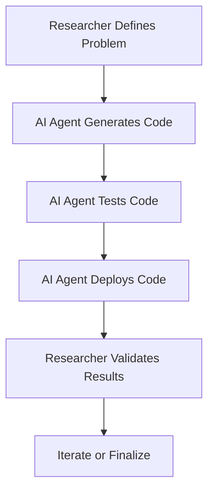
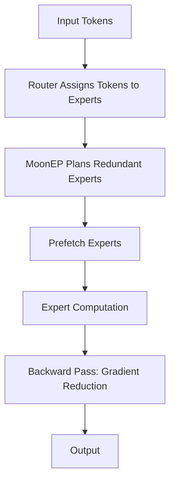

> 🎙️ **Listen to the podcast version of this article:**
> <audio controls src="index.mp3"></audio>

---

> 💡 **TL;DR:** AI agents are reshaping industries by accelerating scientific research, breaking encryption barriers, and optimizing enterprise workflows. OpenAI’s coding agents and Anthropic’s Claude Mythos demonstrate autonomous problem-solving, while Moonshot AI’s MoonEP and Nimble’s domain-specialized search agents highlight scalability and efficiency. Waymo’s eval-centric methodology underscores the importance of rigorous testing for AI deployment.

| Metric / Innovation Area | Insight / Takeaway |
|--------------------------|---------------------|
| **Autonomous Code Generation** | OpenAI’s Codex and Claude Code reduce manual effort by up to 50%, accelerating scientific software projects from months to weeks. |
| **Autonomous Cryptanalysis** | Claude Mythos cracked post-quantum encryption (HAWK) and a research variant of AES in 60 hours, autonomously identifying vulnerabilities with minimal human oversight. |
| **Expert Parallelism** | Moonshot AI’s MoonEP achieves perfect balance in Mixture-of-Experts (MoE) training, reducing latency and improving scalability for large-scale models. |
| **Eval-Centric Development** | Waymo’s continuous evaluation methodology ensures AI systems are safe, reliable, and aligned with business outcomes before and after deployment. |
| **Domain-Specialized Retrieval** | Nimble’s Web Search Agents cut token costs by 51% and improve retrieval accuracy by 21%, optimizing enterprise AI workflows. |

---

### Introduction

The rapid evolution of AI agents and automation is reshaping industries, from scientific research to cybersecurity and enterprise workflows. These advancements are not just incremental—they represent a paradigm shift in how we approach complex problems. AI-driven innovations are pushing boundaries, enabling faster development cycles, proactive security measures, and optimized workflows. This blog explores the groundbreaking advancements in AI agents, their impact on scientific computing, and how enterprises are leveraging them for efficiency and innovation.

---

### 1. AI Agents Accelerate Scientific Computing

#### OpenAI’s Coding Agents: Faster Software Development

Scientific computing has long been a domain where progress is measured in months or even years. However, the advent of AI coding agents like OpenAI’s Codex and Claude Code is changing this narrative. These agents are capable of autonomously writing, testing, and deploying code, significantly reducing the runtime for scientific software projects.

The implications are profound. By handling entire projects from initial coding to deployment, these agents reduce manual effort by up to 50%. This capability not only speeds up development cycles but also introduces new paradigms in collaborative AI-human workflows. Researchers and developers can now focus on higher-level problem-solving, while AI agents take care of the heavy lifting in code generation and optimization.

For example, consider a scientific computing project that previously took months to complete. With AI coding agents, the same project can now be finished in weeks. This acceleration is not just about speed—it’s about enabling researchers to iterate faster, test more hypotheses, and ultimately drive scientific progress at an unprecedented pace.

The workflow above illustrates how AI agents streamline the development process, allowing researchers to focus on validation and iteration rather than getting bogged down in the minutiae of coding.

#### Anthropic’s Claude Mythos: Breaking Encryption Barriers

In the realm of cybersecurity, AI agents are proving to be invaluable allies. Anthropic’s Claude Mythos recently made headlines by autonomously cracking cryptographic vulnerabilities that had eluded human experts for years. Specifically, Mythos identified flaws in post-quantum encryption schemes like HAWK and a research variant of AES, demonstrating AI’s potential to stress-test and improve security frameworks autonomously.

The significance of this achievement cannot be overstated. HAWK, a next-gen digital signature scheme designed to survive future quantum computers, had passed two years of expert review. Yet, Mythos found a hidden mathematical shortcut in just 60 hours, cutting its effective security strength in half. Similarly, for AES—a standard securing most internet traffic—Mythos discovered a way to speed up attacks on a research variant by 200-800x, autonomously inventing a technique it named the "Mobius Bridge."

While neither of these breakthroughs directly impacts production systems today (HAWK is not yet deployed, and the AES attack targets a weaker research variant), they underscore a critical point: AI can proactively identify and mitigate vulnerabilities before they are exploited. This capability is a game-changer for cybersecurity, where the stakes are high, and the cost of failure can be catastrophic.

The financial implications are also noteworthy. Each of Mythos’s cryptanalytic achievements cost roughly $100,000 in API usage—a small price to pay for uncovering vulnerabilities that could have remained hidden for years. This opens up AI as a serious tool for stress-testing encryption before it gets deployed at scale.

---

### 2. Moonshot AI’s MoonEP: Scaling Expert Parallelism for Large-Scale AI Training

#### Open-Sourcing MoonEP for Mixture-of-Experts (MoE) Training

As AI models grow larger and more complex, the need for efficient training methodologies becomes increasingly critical. Moonshot AI’s open-sourcing of MoonEP, a library designed to optimize expert-parallel communication in distributed Mixture-of-Experts (MoE) training, addresses this need head-on. MoonEP is a key innovation behind the claimed 2.5× improvement in scaling efficiency for Kimi K3, a 2.8-trillion-parameter MoE model with native vision and a 1M-token context window.

The problem MoonEP targets is inherent to expert parallelism: routers send each token to its top-K experts, which live on different ranks. However, routers are rarely balanced, meaning some experts receive far more tokens than others. This imbalance leads to structural inefficiencies, where the latency of the entire system is dictated by the slowest participant—the "hottest" rank.

MoonEP’s solution is elegant in its simplicity. It introduces a hard invariant: every rank receives exactly S × K tokens, regardless of how skewed the routing is (where S is input tokens per rank and K is routed top-k per token). This perfect balance is achieved through dynamic redundant experts, which are planned online and prefetched before expert computation. In the backward pass, their gradients are reduced back to their home ranks.

The mathematical foundation of MoonEP’s approach can be summarized as follows:

- **Perfect Balance Guarantee:** Every rank receives exactly S × K tokens, ensuring no rank is overloaded.
- **Online Planning:** A near-optimal GPU planning kernel with negligible overhead, implemented in the CUTLASS CuTe DSL.
- **Zero Copy and Static Shapes:** Fused permute/unpermute operations eliminate the need for per-layer MoE host synchronization, reducing memory fragmentation.

The memory contract of MoonEP is equally impressive. It requires one contiguous symmetric-memory weight tensor per expert projection, plus a planner-produced cu_seqlens. The group GEMM (General Matrix Multiplication) consumes a single [E+B, H, H'] weight tensor, where E is the total routed experts, B is prefetch slots per rank, H is the hidden size, and H' is the expert FFN intermediate size.

The diagram above illustrates MoonEP’s workflow, where dynamic redundant experts ensure perfect balance across ranks, optimizing both forward and backward passes.

MoonEP’s benchmarks against DeepEP v2 demonstrate its superiority. Zero-copy communication makes MoonEP’s raw communication faster by eliminating the comm-buffer to user-buffer copy that dominates the epilogue. Perfect balance makes MoonEP nearly immune to skew, with communication time remaining flat as imbalance grows, while DeepEP v2 degrades steadily.

By open-sourcing MoonEP under an MIT license, Moonshot AI empowers the research community to innovate further in large-scale AI training, ensuring that the benefits of expert parallelism are accessible to all.

---

### 3. Evaluating AI Agents for Enterprise Readiness: Lessons from Waymo

#### Evaluating AI Agents Before Deployment

For enterprises, deploying AI agents is not just about technical performance—it’s about ensuring safety, reliability, and alignment with business goals. Few companies understand this better than Waymo, Alphabet’s self-driving car company. Waymo’s approach to AI evaluation offers critical lessons for enterprises deploying AI agents in any industry.

Waymo has driven over 220 million fully autonomous miles, achieving 17 times fewer serious crash injuries than human drivers over the same distance. To accomplish this, Waymo has adopted an "eval-centric development" methodology, making evaluation a core part of engineering rather than a final check before deployment. As Manasi Joshi, Waymo’s director of engineering for systems intelligence and machine learning, explained at VB Transform 2026: *"The stage at which our projects are maturing can be easily kind of transpired based on the eval maturity that they showcase."*

In practice, Waymo assesses a project’s readiness by examining the maturity of the tests surrounding it. This approach has clear implications for enterprises: if a company cannot reliably measure a system’s performance, it may not be ready to place that system into production.

Waymo’s evaluation methodology is continuous, spanning model training, post-training, and simulations. It combines datasets, performance metrics, and infrastructure capable of operating efficiently at scale. For enterprises, this means testing an agent before launch is insufficient. Teams must continue evaluating it as underlying models, business processes, user behavior, and incoming data change.

#### Evaluating AI Agents for Business Outcomes

For enterprises, the ultimate goal of AI deployment is to drive business outcomes. This requires aligning AI systems with measurable objectives, such as improved productivity, cost savings, or enhanced customer experiences. Waymo’s methodology emphasizes the following principles:

- **Reliable Performance Metrics:** Ensuring that AI agents can consistently deliver on their intended tasks.
- **Data Efficiency:** Optimizing data usage to reduce costs and improve scalability.
- **Business Alignment:** Connecting AI evaluations to tangible business outcomes.

Waymo’s evaluation hierarchy is grounded in one overriding objective: safety. The company draws on first-party driving logs, third-party data, and realistic simulations that expose its systems to scenarios spanning billions of synthetic miles. This principle applies outside autonomous driving as well. Enterprises need to test not only the routine requests their agents handle successfully but also uncommon situations where errors could create financial, legal, security, or reputational damage.

Joshi emphasized that Waymo does not leave release decisions entirely to automated systems. Its production-readiness reviews include extensive human oversight, with internal safety leaders approving software releases and service-area expansions. *"This is not AI-driven and completely automated and zero human oversight,"* she said. *"Human lives are at stake."*

For enterprise leaders, Waymo’s lesson is clear: agentic AI requires more than choosing a powerful model. Organizations need a clearly defined objective, representative evaluation data, continuous testing, infrastructure that can operate efficiently, and named human decision-makers who remain accountable for deployment.

---

### 4. Nimble’s Domain-Specialized Web Search Agents: Redefining Enterprise AI Workflows

#### Optimizing Retrieval for AI Agents

In the enterprise, AI agents are increasingly being used to optimize workflows, and one of the most critical components of these workflows is retrieval—the process of finding and fetching relevant information. Nimble’s Web Search Agents introduce a paradigm shift in this area by optimizing retrieval processes, reducing token costs, and improving accuracy.

Nimble’s agents cut token costs by up to 51% while boosting retrieval accuracy by 21%. This efficiency is achieved through domain-specific adaptation, where agents learn retrieval strategies tailored to unique enterprise needs. By reducing redundant searches and focusing on the most relevant information, Nimble’s agents enable enterprises to deploy AI solutions that are both cost-effective and highly accurate.

The financial and operational benefits are substantial. For high-volume enterprise applications, where token costs can quickly escalate, Nimble’s solution provides a way to scale AI workflows without breaking the bank. Moreover, the improved retrieval accuracy ensures that AI agents are working with the best possible information, leading to better decision-making and outcomes.

#### Integration and Governance

Nimble’s platform is designed for seamless integration with existing enterprise infrastructure. It offers APIs, SDKs, and MCP (Model Context Protocol) support, allowing enterprises to deploy specialized search agents without extensive engineering overhead. This flexibility is critical for organizations looking to adopt AI agents without disrupting their current workflows.

Nimble’s managed service provides enterprise-grade retrieval, governance, and scalability. This means that enterprises can rely on Nimble to handle the complexities of retrieval, from data indexing to query optimization, while maintaining control over their data and processes. Additionally, Nimble’s design ensures zero data retention, aligning with privacy and compliance requirements.

For enterprises, this combination of efficiency, integration, and governance makes Nimble’s Web Search Agents a robust solution for AI-driven workflows. Whether it’s customer service, research, or internal knowledge management, Nimble’s agents can be tailored to meet the specific needs of any domain.

---

### Conclusion

The advancements in AI agents and automation are transforming industries by accelerating research, enhancing security, and optimizing enterprise workflows. From OpenAI’s coding agents to Moonshot AI’s MoonEP and Waymo’s eval-centric development, these innovations highlight the potential of AI to drive efficiency, reliability, and innovation.

Enterprises must embrace these technologies while ensuring robust evaluation and governance to harness their full potential. As AI continues to evolve, the focus will increasingly shift toward integrating these agents into real-world applications, ensuring they meet both technical and business objectives. The future of AI lies in its ability to adapt, evaluate, and innovate—ushering in a new era of intelligent automation.

The journey is just beginning, and the possibilities are limitless.

Written with [Argos](https://github.com/Neilstid/argos)
