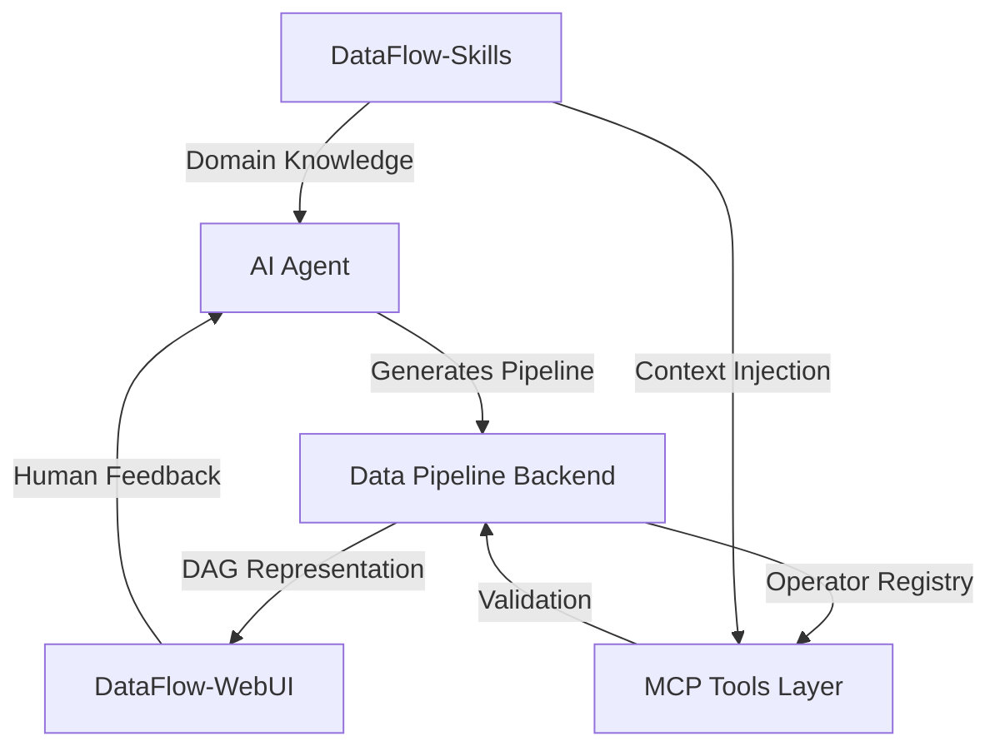
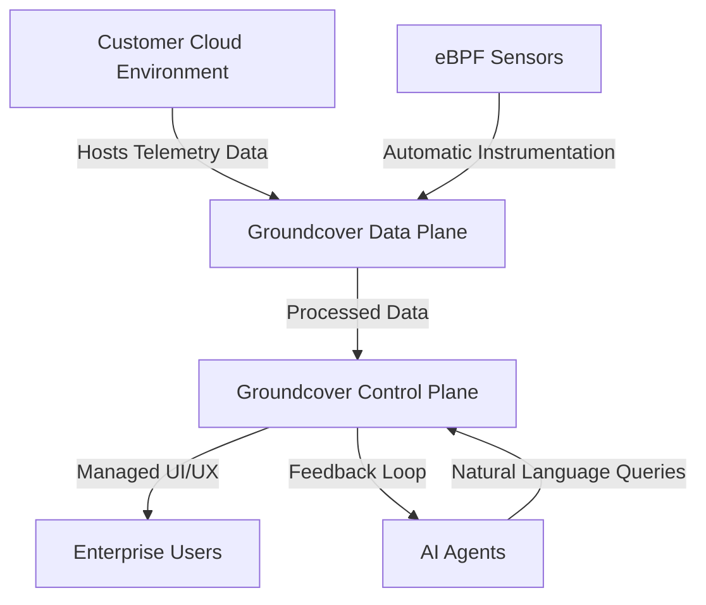

> 🎙️ **Listen to the podcast version of this article:**
> <audio controls src="index.mp3"></audio>

---

> 💡 **TL;DR:** This article dives into two groundbreaking advancements reshaping enterprise AI: **DataFlow-Harness**, a framework that enables AI agents to build structured, production-ready data pipelines, and **Groundcover**, an observability platform leveraging AI and eBPF to provide cost-efficient, enterprise-grade telemetry control. Together, they address critical gaps in AI-driven workflows, from pipeline reliability to observability scalability.

| Metric / Innovation Area | Insight / Takeaway |
|--------------------------|---------------------|
| **DataFlow-Harness Success Rate** | 93.3% end-to-end pass rate on a 12-task benchmark, outperforming free-form AI code generation. |
| **Cost Reduction (DataFlow-Harness)** | 72.5% lower API costs and 49.9% reduced response latency compared to traditional AI coding agents. |
| **Groundcover Funding** | $100M Series C round led by One Peak, totaling $160M in funding and 250+ paying customers. |
| **Groundcover Pricing Model** | Host-based pricing (not data volume), enabling predictable costs for high-telemetry AI workloads. |
| **eBPF Integration** | Automatic instrumentation for deep observability without manual code changes, critical for AI-driven systems. |

### Introduction

The AI revolution is not just about smarter models—it’s about **scalable, reliable, and observable systems** that can handle the complexity of modern enterprise workflows. Two innovations, **DataFlow-Harness** and **Groundcover**, are leading the charge in addressing two of the most pressing challenges in AI today: **structured data pipeline generation** and **AI-native observability**.

As AI agents become more autonomous, the need for **governable, auditable pipelines** and **comprehensive telemetry** has never been greater. Traditional approaches—whether one-off scripts for data processing or SaaS-based observability platforms—are struggling to keep pace. This article explores how these two technologies are redefining the landscape.

---

### 1. Closing the "NL2Pipeline" Gap: DataFlow-Harness for Structured AI Data Pipelines

#### **The Challenge: AI Agents and the Free-Form Code Problem**

Large Language Models (LLMs) excel at generating ad-hoc Python scripts for simple tasks, such as parsing a JSON file or cleaning a small dataset. However, when tasked with building **complex, multi-stage data pipelines**—such as ingesting thousands of documents, chunking text, scoring quality, and filtering noise for a Retrieval-Augmented Generation (RAG) system—they often produce **disposable, unmaintainable code**. This creates a critical gap: **AI-generated pipelines lack structure, auditability, and production readiness**.

Enterprises cannot afford to deploy such pipelines in high-stakes environments where reliability, compliance, and scalability are non-negotiable. The result? A **fragmented workflow** where human engineers must manually refactor AI-generated code, slowing down innovation and increasing technical debt.

#### **The Solution: DataFlow-Harness Architecture**

Developed by researchers at **Peking University, Zhongguancun Academy, and Shanghai’s Institute for Advanced Algorithms Research**, **DataFlow-Harness** is an open-source framework designed to **guide AI agents in constructing structured, visual, and production-ready data pipelines**. At its core, the framework treats pipelines as **directed acyclic graphs (DAGs)**, where nodes represent data sources, operators, or transformations, and edges define dependencies.

The system comprises four key components:

1. **Data Pipeline Backend**: The authoritative source of truth, representing pipelines as a DAG with data sources, operators, and execution dependencies. This ensures **consistency and correctness** across the pipeline lifecycle.
2. **DataFlow-WebUI**: A **visual DAG editor** that enables human-AI collaboration. Engineers can inspect, modify, and validate AI-generated changes in real time, bridging the gap between automation and human oversight.
3. **MCP Tools Layer**: Empowers AI agents to interact with the live operator registry and pipeline state. It validates changes for **structural and semantic correctness**, ensuring that only valid, logical pipelines are generated.
4. **DataFlow-Skills**: Injects **domain-specific knowledge** into the model’s context window, guiding it on operator selection, schema inference, and assembly procedures. This is critical for tasks requiring implicit expertise, such as data cleaning or quality scoring.

The architecture can be visualized as follows:

#### **Key Advantages and Performance Metrics**

DataFlow-Harness delivers **tangible improvements** over traditional AI code generation:

- **93.3% End-to-End Pass Rate**: On a **12-task benchmark**, the framework outperforms free-form code generation, demonstrating its ability to handle complex, real-world data processing tasks.
- **Cost and Performance Gains**: Reduces API costs by **72.5%** and response latency by **49.9%** compared to vanilla AI coding agents. This is achieved by **minimizing redundant computations** and leveraging structured, reusable components.
- **Enterprise Readiness**: Produces **auditable, editable, and production-ready** pipelines, reducing technical debt and ensuring compliance with organizational standards.

The framework’s effectiveness is rooted in its ability to **formalize the pipeline construction process**. Instead of generating free-form code, AI agents work within a **constrained, structured environment**, ensuring that outputs are both **correct and maintainable**.

#### **Mathematical Underpinnings: DAGs and Pipeline Optimization**

At the heart of DataFlow-Harness is the **DAG-based representation** of pipelines. This allows for:

- **Topological Sorting**: Ensures that dependencies are resolved in the correct order, preventing race conditions and data inconsistencies. The complexity of sorting a DAG with $N$ nodes and $E$ edges is $O(N + E)$.
- **Parallel Execution**: Independent branches of the DAG can be executed concurrently, improving throughput. The critical path (longest path in the DAG) determines the minimum execution time:
  $$T_{min} = \sum_{v \in 	ext{Critical Path}} t_v$$
  where $t_v$ is the execution time of node $v$.
- **Resource Optimization**: By modeling pipelines as DAGs, DataFlow-Harness can apply **scheduling algorithms** (e.g., list scheduling, dynamic programming) to optimize resource allocation.

#### **Use Cases and Real-World Impact**

DataFlow-Harness has been validated across a range of **high-impact use cases**, including:

- **QA Generation**: Automating the creation of question-answer pairs for training or evaluation datasets.
- **Synthetic Data Generation**: Producing large-scale, labeled datasets for machine learning tasks.
- **Math Data Cleaning**: Standardizing and validating mathematical datasets, where domain-specific knowledge (e.g., symbolic reasoning) is critical.

In each case, the framework’s **structured approach** ensures that pipelines are not only **functional** but also **maintainable and scalable**. For example, in a RAG system, DataFlow-Harness can automate the ingestion, chunking, and embedding of documents while ensuring that each step is **traceable and reproducible**.

#### **Why It Matters: The Future of AI-Driven Data Engineering**

As AI agents become more integrated into enterprise workflows, the ability to **generate reliable, production-ready pipelines** will be a key differentiator. DataFlow-Harness addresses this need by:

- **Reducing the Gap Between AI and Human Engineers**: Enables seamless collaboration, where AI handles the heavy lifting of pipeline construction, and humans provide oversight and refinement.
- **Lowering Operational Costs**: By improving efficiency and reducing errors, the framework cuts down on the resources required to deploy and maintain AI-driven data workflows.
- **Enabling Scalability**: Structured pipelines are easier to **parallelize, optimize, and extend**, making them suitable for large-scale enterprise applications.

In the long term, frameworks like DataFlow-Harness could **democratize AI-driven data engineering**, allowing organizations of all sizes to leverage advanced data processing without sacrificing reliability or control.

---

### 2. AI Observability in the Enterprise: Groundcover’s BYOC Revolution

#### **The Problem: Traditional Observability in the Age of AI**

Enterprises are generating **exponentially more telemetry** due to the rise of AI-assisted software development, autonomous agents, and complex distributed systems. Traditional observability platforms—such as **Datadog, Dynatrace, Splunk, and Grafana**—were designed for a pre-AI era, where telemetry was primarily used for **post-production monitoring** and troubleshooting.

Today, AI systems introduce **new layers of complexity**:

- **AI-Assisted Development**: Coding assistants generate more code, faster, leading to **rapidly evolving infrastructure** and a higher volume of operational data.
- **Autonomous Agents**: AI agents execute multi-step workflows, call external tools, and interact with production systems, generating **rich, context-dependent telemetry**.
- **Distributed AI Workloads**: Modern applications combine microservices, Kubernetes clusters, APIs, and LLMs, creating **interconnected, dynamic systems** that are difficult to monitor with traditional tools.

The result is a **telemetry explosion** that strains traditional observability models, particularly those that charge based on **data ingestion volume**. To control costs, enterprises often resort to **sampling, shortening retention periods, or limiting data collection**—all of which **reduce visibility** precisely when it’s needed most.

#### **The Solution: Groundcover’s BYOC and eBPF Architecture**

**Groundcover**, a startup backed by **One Peak Ventures**, offers a **radically different approach** to observability, designed from the ground up for the AI era. Its solution hinges on three key innovations:

1. **Bring-Your-Own-Cloud (BYOC) Model**: Unlike traditional SaaS platforms, Groundcover allows enterprises to **retain full control** over their telemetry data. The **data plane** (storage and processing) remains within the customer’s cloud environment (AWS, Azure, or Google Cloud), while Groundcover provides a **managed control plane** and user experience. This ensures **data sovereignty, compliance, and security**.
2. **Host-Based Pricing**: Instead of charging for data volume, Groundcover prices its service based on the **number of monitored hosts**. This aligns costs with infrastructure rather than telemetry, making it **predictable and scalable** for high-density AI workloads.
3. **eBPF for Deep Observability**: Groundcover leverages **eBPF (Extended Berkeley Packet Filter)**, a Linux kernel technology that enables **automatic, low-overhead instrumentation** of applications. This eliminates the need for manual code changes, reducing deployment complexity and increasing telemetry coverage.

The architecture can be visualized as follows:

#### **Key Features and Differentiators**

Groundcover’s approach offers several **compelling advantages** over traditional observability platforms:

- **AI-Native Observability**: Groundcover’s **Agent Mode** allows engineers to investigate incidents using **natural language queries** across logs, metrics, traces, and Kubernetes events. This is particularly valuable for debugging **AI-driven workflows**, where understanding the context of agent decisions is critical.
- **Complete Telemetry Retention**: With host-based pricing, enterprises can **retain all telemetry data** without worrying about cost spikes, enabling richer analysis and compliance.
- **Automatic Instrumentation**: eBPF enables **deep, kernel-level observability** without requiring developers to manually instrument code. This is especially important for **Kubernetes and cloud-native applications**, where manual instrumentation is impractical.
- **Future-Proof Architecture**: Groundcover’s combination of **BYOC, eBPF, and AI-assisted operations** positions it as a leader in **autonomous software development observability**.

#### **Why Enterprises Are Adopting Groundcover**

Groundcover’s value proposition resonates with enterprises facing the following challenges:

- **Cost Efficiency**: Avoids the **data ingestion pricing spiral** of traditional platforms, where costs scale unpredictably with telemetry volume.
- **Enhanced Visibility**: Provides **unfiltered, comprehensive telemetry**, critical for debugging AI-driven systems and understanding agent behavior.
- **Scalability**: Works seamlessly with **Kubernetes clusters and cloud-native applications**, making it ideal for modern, dynamic environments.

The company reports **250+ paying customers** and a **tripling of annual recurring revenue** over the past year, indicating strong market traction. However, as noted in its own briefing, these figures are **self-reported**, and independent validation is recommended.

#### **Challenges and Considerations**

While Groundcover’s model is innovative, enterprises should consider the following:

- **Implementation Overhead**: Integrating Groundcover with existing tech stacks may require **engineering effort**, particularly for organizations with complex, legacy systems.
- **Compliance and Security**: Although telemetry remains within the customer’s cloud, enterprises must ensure that **metadata and operational data** are handled in compliance with their policies.
- **Market Competition**: Groundcover enters a **highly competitive** observability market dominated by incumbents like Datadog and Dynatrace. Success will depend on whether enterprises prioritize **architectural flexibility** over the maturity and ecosystem of established vendors.

#### **The Future: Observability as AI Feedback Loop**

Groundcover’s long-term vision extends beyond traditional monitoring. The company envisions observability as the **feedback mechanism** that informs AI agents about production behavior, enabling them to **learn, adapt, and improve** over time.

For example, an AI agent might:

1. **Deploy a new feature** based on a user request.
2. **Monitor its performance** using Groundcover’s telemetry.
3. **Detect an anomaly** (e.g., increased latency or errors).
4. **Investigate the issue** using natural language queries.
5. **Recommend or implement a fix**, which is then validated through further observability data.

This creates a **closed-loop system** where AI agents are not just **consumers** of observability data but also **contributors** to it. Over time, this could lead to **fully autonomous software development**, where AI systems continuously optimize themselves based on real-world performance.

---

### 3. The Bigger Picture: AI-Driven Development and Observability as a Unified Discipline

#### **The Convergence of Data Pipelines and Observability**

The advancements in **DataFlow-Harness** and **Groundcover** are not isolated innovations—they represent a **paradigm shift** in how enterprises build, deploy, and monitor AI systems. Together, they address two sides of the same coin:

- **DataFlow-Harness** ensures that **AI-generated pipelines** are **structured, reliable, and production-ready**.
- **Groundcover** ensures that **AI-driven systems** are **observable, debuggable, and optimized** in real time.

This convergence is critical because **AI systems are only as good as the data they process and the feedback they receive**. Without structured pipelines, AI agents may produce **unreliable or inefficient workflows**. Without comprehensive observability, enterprises cannot **understand, debug, or improve** those workflows.

#### **The Role of AI Agents in the Future of Software**

As AI agents become more autonomous, their role in software development and operations will expand beyond **assistive tools** to **active participants**. This evolution will require:

1. **Structured Workflows**: Frameworks like DataFlow-Harness will ensure that AI-generated code is **governable, auditable, and maintainable**.
2. **Comprehensive Observability**: Platforms like Groundcover will provide the **telemetry and feedback loops** needed for AI agents to learn and adapt.
3. **Collaborative Ecosystems**: Human engineers and AI agents will work **side by side**, with humans providing oversight and AI handling execution.

#### **Industry Implications and Competitive Landscape**

The success of DataFlow-Harness and Groundcover highlights a broader trend: **AI is forcing a rethinking of enterprise software architectures**. Traditional tools and pricing models, designed for a pre-AI era, are struggling to keep up with the **scale, complexity, and dynamism** of modern AI-driven systems.

- **For Data Pipelines**: The shift from **free-form code** to **structured, DAG-based workflows** will enable enterprises to **scale AI-driven data processing** without sacrificing reliability.
- **For Observability**: The move from **SaaS-based, volume-priced models** to **BYOC, host-based models** will allow enterprises to **retain full control** over their telemetry while reducing costs.

Incumbents like Datadog and Dynatrace are not standing still. Many have introduced **AI-powered features**, such as root cause analysis and anomaly detection. However, as Groundcover’s CEO Shahar Azulay argues, these are **incremental improvements** rather than **architectural shifts**. The real opportunity lies in **reimagining observability for an AI-native world**.

#### **What’s Next: The Path to Autonomous AI Systems**

The future of enterprise AI will be defined by **autonomy, scalability, and reliability**. To achieve this, organizations will need:

- **Unified Platforms**: Tools that combine **data pipeline construction, observability, and AI feedback loops** into a single, cohesive system.
- **Standardized Interfaces**: Common frameworks for **AI-agent collaboration**, such as **Model Context Protocol (MCP)**, will enable seamless integration across tools.
- **Regulatory and Ethical Frameworks**: As AI systems take on more responsibility, **governance, compliance, and ethics** will become critical considerations.

DataFlow-Harness and Groundcover are **early examples** of this future. As they mature, we can expect to see:

- **More AI-Native Tools**: Frameworks and platforms designed **from the ground up** for AI-driven workflows.
- **Greater Automation**: AI agents will take on **more complex tasks**, from pipeline construction to incident response.
- **Deeper Integration**: Observability will evolve from a **post-production tool** to a **real-time feedback mechanism** for AI systems.

---

### Conclusion: The AI Revolution Is Just Getting Started

The advancements in **DataFlow-Harness** and **Groundcover** are more than just technical innovations—they are **catalysts for a new era of enterprise AI**. By addressing the gaps in **structured data pipelines** and **AI-native observability**, these tools are enabling organizations to:

- **Build more reliable, scalable AI systems** that can handle the complexity of modern workflows.
- **Monitor and manage AI-driven processes** with unprecedented visibility and cost efficiency.
- **Collaborate more effectively** between human engineers and AI agents, unlocking new levels of productivity and innovation.

As AI continues to permeate every aspect of enterprise operations, the need for **structured, observable, and autonomous systems** will only grow. The future belongs to those who can **harness the power of AI while maintaining control, reliability, and transparency**—and DataFlow-Harness and Groundcover are leading the way.

For developers, data scientists, and AI engineers, now is the time to explore these technologies. Whether you’re looking to **optimize your data pipelines** or **enhance your observability strategy**, these tools offer a glimpse into the **next frontier of AI-driven innovation**.

Written with [Argos](https://github.com/Neilstid/argos)
