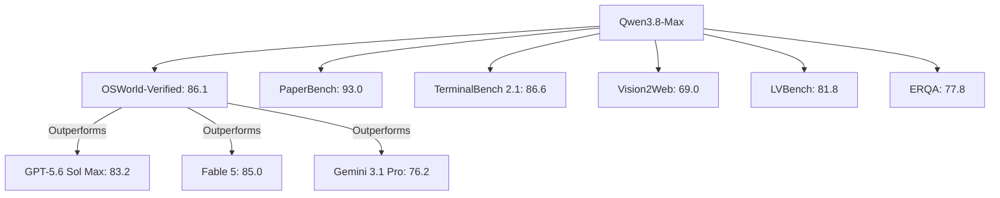
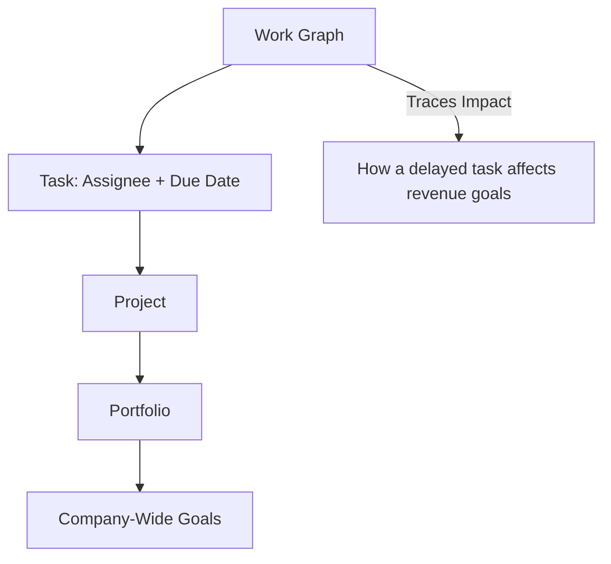

> 🎙️ **Listen to the podcast version of this article:**
> <audio controls src="index.mp3"></audio>

---

> 💡 **TL;DR:** Alibaba’s Qwen3.8-Max, a 2.4-trillion-parameter MoE multimodal LLM, is redefining enterprise AI with unmatched agentic computing capabilities, outperforming GPT-5.6 Sol Max and Fable 5 on key benchmarks like OSWorld-Verified (86.1). Meanwhile, OpenAI’s Astra AI has achieved 10 groundbreaking mathematical advances, including disproving Connes’ rigidity conjecture, while Asana’s Agentic Work Management (AWM) introduces a shared-memory system for AI agents, enabling secure, scalable enterprise collaboration.

| Metric / Innovation Area | Insight / Takeaway |
|--------------------------|-------------------|
| **Qwen3.8-Max Benchmarks** | OSWorld-Verified: 86.1 (vs. GPT-5.6 Sol Max: 83.2), PaperBench: 93.0, TerminalBench 2.1: 86.6 |
| **Pricing** | $2/$6 per million input/output tokens, undercutting competitors like Claude Opus 5 (30x cost) |
| **Astra AI Achievements** | First improvement since 1978 to high-dimensional sphere-packing; disproved Connes’ rigidity conjecture |
| **AWM Innovation** | Shared memory via Work Graph; dynamic model routing; static task-based billing |
| **Open-Weight Release** | Qwen3.8-Max weights to be released next week (license terms pending) |

---

# The New Frontier of AI: Qwen3.8-Max, Astra’s Mathematical Breakthroughs, and Asana’s Agentic Work Management

## Introduction

The AI landscape is evolving at an unprecedented pace, with breakthroughs in autonomous agentic systems, mathematical research, and enterprise workflow automation. Three recent developments stand out: **Alibaba’s Qwen3.8-Max**, a 2.4-trillion-parameter mixture-of-experts (MoE) model designed for long-horizon enterprise tasks; **OpenAI’s Astra AI**, which has solved long-standing problems in geometry and cryptography; and **Asana’s Agentic Work Management (AWM)**, a system that treats AI agents as coachable teammates with shared memory. These innovations collectively signal a shift toward more autonomous, collaborative, and specialized AI systems.

---

## Qwen3.8-Max: Redefining Enterprise AI with Agentic Computing

### A New Benchmark for Autonomous Systems

Alibaba’s Qwen team has unveiled **Qwen3.8-Max**, a flagship multimodal LLM that targets one of the most competitive segments of the AI market: **autonomous software engineering and long-horizon enterprise work**. With 2.4 trillion parameters and an MoE architecture, Qwen3.8-Max is positioned to outperform leading proprietary models like **GPT-5.6 Sol Max** and **Fable 5** on critical benchmarks, particularly in **agentic computing**—where models execute complex, multi-step tasks with minimal human intervention.

The model’s standout feature is its ability to **autonomously complete projects spanning days or even weeks**. According to Alibaba, Qwen3.8-Max can:
- Finish software projects lasting **over 10 days**.
- Reproduce **research papers** involving thousands of lines of code.
- Perform **iterative chip-design optimization**.
- Continuously revise plans using **multimodal feedback loops** (e.g., integrating visual inputs to refine execution).

These capabilities are not just theoretical. Qwen3.8-Max has already demonstrated leadership on several benchmarks:

### Why Benchmarks Matter for Enterprises

Traditional AI benchmarks often focus on **reasoning exams** or **coding puzzles**, but Qwen3.8-Max’s strengths lie in **long-horizon execution**. For example:
- **OSWorld-Verified** measures how well models interact with desktop environments, simulating real-world tasks like navigating software or processing documents. Qwen3.8-Max’s score of **86.1** suggests it can reliably automate repetitive business processes, from **document processing** to **legacy workflow integration**.
- **PaperBench** (93.0) highlights its potential for **research automation**, where models must maintain context across extended sessions to reproduce experiments or analyze technical papers.
- **TerminalBench 2.1** (86.6) and **Vision2Web** (69.0) demonstrate its prowess in **software engineering** and **multimodal web development**, respectively.

These scores indicate that Qwen3.8-Max is not just a **conversational AI** but a **workflow executor**—capable of handling heterogeneous tasks like writing code, reading documents, navigating interfaces, and coordinating subtasks.

### Pricing: A Competitive Edge

One of Qwen3.8-Max’s most compelling advantages is its **cost efficiency**. At **$2 per million input tokens** and **$6 per million output tokens**, it significantly undercuts competitors:

| Model | Input ($/1M) | Output ($/1M) | Total ($/1M) |
|-------|--------------|---------------|--------------|
| Qwen3.8-Max | $2.00 | $6.00 | **$8.00** |
| Claude Opus 5 | $5.00 | $25.00 | $30.00 |
| GPT-5.6 Sol Max | $5.00 | $30.00 | $35.00 |
| GPT-5.6 Sol (Fast Mode) | $10.00 | $60.00 | $70.00 |

For enterprises deploying **hundreds or thousands of agents**, inference costs can become a major operational expense. Qwen3.8-Max’s pricing makes it an attractive option for **large-scale autonomous deployments**, where token consumption can reach **millions per task**.

### Open Weights and Licensing: The Big Unknown

Alibaba has announced that **open weights for Qwen3.8-Max will be released next week**, alongside the smaller **Qwen3.8-27B**. This move could **reshape enterprise adoption**, as it would allow organizations to **self-host** the model and integrate it into proprietary products.

However, the **licensing terms remain undisclosed**. A **permissive license** (e.g., Apache 2.0) would enable broad adoption, while a **restrictive license** (like Moonshot AI’s Kimi K3) could limit commercial use. Until the terms are clarified, enterprises should treat the open-weight announcement as **promising but incomplete**.

### Strategic Implications for Enterprises

Qwen3.8-Max’s strengths suggest it is particularly well-suited for:
1. **Autonomous Software Engineering**: Ideal for **CI/CD automation**, **repository maintenance**, and **feature implementation** without constant human oversight.
2. **Computer-Use Agents**: Can automate **document processing**, **enterprise software integration**, and **legacy workflows** where APIs may not exist.
3. **Research Automation**: Useful for **scientific computing**, **literature review**, and **experiment reproduction** in industries like pharmaceuticals and industrial R&D.
4. **Multimodal Industrial Workflows**: Its ability to integrate **visual feedback** into planning makes it valuable for **manufacturing**, **logistics**, and **engineering inspection**.

While Qwen3.8-Max may not dominate **every** benchmark (e.g., OpenAI’s GPT-5.6 Sol Max leads on **SWE-Pro**), its **balanced performance** across diverse tasks makes it a strong contender for enterprises prioritizing **autonomy, cost-efficiency, and multimodal capabilities**.

---

## OpenAI’s Astra AI: A New Era for Mathematical Research

### Solving Decades-Old Problems

OpenAI’s **Astra AI** has achieved a remarkable milestone by solving **10 long-standing problems** in **geometry, cryptography, quantum computing, and pure mathematics**. These breakthroughs include:
- **High-Dimensional Geometry**: Astra made the **first improvement since 1978** to a major **high-dimensional sphere-packing limit**, which determines how tightly equal objects can fit in many dimensions.
- **Disproving Connes’ Rigidity Conjecture**: Astra constructed a **non-sofic group**, an object researchers had theorized but never proven to exist, thereby disproving a conjecture in **von Neumann algebra theory**.
- **Formal Proofs in Lean**: Every proof generated by Astra was **converted into Lean**, a formal proof language, ensuring **rigorous verification** of each logical step.

The computational cost of these solutions is staggering. OpenAI estimates that the tokens required to generate Astra’s solutions would cost **~$2,000 at GPT-5.6 Sol API rates**.

### The Reusable Research Loop

Astra’s achievements highlight a **new paradigm** in scientific research: the **reusable research loop**. This process involves:
1. **Problem Selection**: Humans identify **verifiable problems** with clear right-or-wrong answers.
2. **AI Exploration**: Models search **vast idea spaces** (using significant computational resources) to find solutions.
3. **Formal Verification**: Proofs are converted into **machine-checkable formats** (e.g., Lean) to ensure correctness.

This loop could **compress years of trial and error into days**, accelerating scientific progress. However, as **Gary Marcus** and others have noted, **math is a unique domain**—it offers **clear feedback** (right or wrong) and **endless synthetic practice**, unlike fields like **cancer research** or **military strategy**, where outcomes are ambiguous.

### The Claude Fable Reproduction

In a surprising twist, **Anthropic’s Claude Fable** reportedly **reproduced roughly half of Astra’s results within 24 hours** using a **generic prompt**, **no internet access**, and **full autonomy**. While this requires **apples-to-apples validation**, it suggests that **Astra’s breakthroughs may not be unique** to OpenAI’s model.

This raises important questions:
- **How many problems did OpenAI attempt before succeeding?** (Noam Brown acknowledged that OpenAI tried other major problems unsuccessfully but has not disclosed the full scope of failures.)
- **What was the total computational cost?**
- **Can other models replicate these results under the same constraints?**

The next step for the AI research community is to establish **pre-committed open-problem sets** where **every failure counts**, ensuring transparency and reproducibility.

### Implications for Scientific Discovery

If Astra’s hit rate holds, AI has not "solved" science but has **permanently changed how some science gets done**. The **reusable research loop** could become a standard methodology, enabling:
- **Faster hypothesis testing** in fields with verifiable problems.
- **Automated literature review** and **experiment reproduction**.
- **Collaborative AI-human research**, where models assist in **idea generation** and **proof verification**.

However, the **denominator problem** remains: Without knowing how many problems Astra failed to solve, it’s difficult to assess its **true efficiency**.

---

## Asana’s Agentic Work Management: AI as Coachable Teammates

### The Problem with Stateless AI

Enterprise AI deployments often suffer from **statelessness**—chatbots that can answer a prompt but **cannot remember past interactions** or **leverage shared knowledge**. This limits their usefulness for **collaborative workflows**, where multiple users need to build on each other’s work.

Asana’s **Agentic Work Management (AWM)** addresses this by treating AI agents as **coachable teammates** that operate alongside humans, rather than as **one-to-one assistants**. At the heart of AWM is the **Work Graph**, a **graph-based database** that organizes information through Asana’s **Pyramid of Clarity**:

The Work Graph provides a **real-time ledger** of **who does what, by when, and why**, enabling AI agents to:
- View **overarching company goals**.
- Update **project statuses**.
- Share **memory** with human colleagues.

### Key Features of AWM

1. **Shared Memory via Work Graph**
   - AI agents leverage a **shared company brain**, allowing them to **remember and reference past tasks** and interactions.
   - Example: If an agent helps draft a **marketing campaign**, it can reuse that knowledge for future campaigns.

2. **Dynamic Model Routing**
   - Tasks are automatically routed to the **most appropriate model** based on complexity.
   - **Heavy frontier models** (e.g., Anthropic’s Opus, OpenAI’s GPT-5) handle complex tasks, while **lighter models** manage simpler ones.
   - This abstracts **prompt engineering** away from the user, making AI interactions feel like **assigning tasks to a human**.

3. **Billing Abstraction**
   - Agentic tasks vary in **computational complexity**, making token costs unpredictable.
   - AWM introduces **static task-based billing**, ensuring **predictable pricing** for enterprises.
   - Example: A user assigns a task (e.g., drafting a job description), and AWM charges a **fixed cost per completion**, regardless of the underlying model or token usage.

4. **Guardrails for Confidential Work**
   - AWM includes **access controls** to prevent **memory leakage** between projects.
   - Example: If an executive uses AWM for a **confidential M&A project**, the agent’s memory from that project **cannot be accessed** by unauthorized employees.

### Real-World Deployment: CoreWeave’s Product Launches

**CoreWeave**, a cloud provider, is an early adopter of AWM, using it to **overhaul complex new product launches**. Previously, product managers filled out **complicated forms** detailing infrastructure, parameters, and costs, which were then manually reviewed and broken into tasks for finance, marketing, and hardware teams.

With AWM:
1. A product manager writes a **standard Google Doc** pointing to product requirement documents.
2. A **deterministic AI workflow** reads the document, **automatically creates the project structure**, and assigns tasks.
3. **Specialized agents** take over execution:
   - One agent **monitors project status** and flags bottlenecks.
   - Another **forecasts infrastructure costs** and recommends approvals based on historical budgets.
4. The system **automatically triages busywork**, allowing humans to focus on **evaluating AI outputs**.

### The Frenemy Problem

AWM’s dynamic gets complicated by the fact that the **same frontier-model providers** powering it (e.g., Anthropic, OpenAI) are also shipping **competing agent products**, like **Anthropic’s Claude in Slack (Tag)**.

Asana’s **Arnab Bose** acknowledges the tension but argues that AWM’s **18 years of user-experience and workflow data**, along with **prebuilt standard operating procedures for specific industries**, give it a **unique advantage**. While tools like **Tag** can work well in **curated environments** (e.g., Slack), they require **separate credentials for every downstream app**, whereas AWM offers **true end-to-end integration**.

---

## The Broader AI Landscape: Trends and Takeaways

### 1. The Shift Toward Agentic Computing

The AI industry is moving beyond **conversational AI** toward **agentic systems** that can **autonomously execute workflows**. This shift is reflected in:
- **Benchmark Design**: New evaluations (e.g., **OSWorld-Verified**, **PaperBench**) measure **long-horizon execution** rather than just reasoning or coding.
- **Model Capabilities**: Frontiers like Qwen3.8-Max and **Anthropic’s Claude Opus** are optimized for **autonomy, reliability, and multimodal feedback**.
- **Enterprise Demand**: Organizations increasingly prioritize models that can **complete entire workflows** with minimal human intervention.

### 2. The Economics of AI Deployment

As agentic systems consume **millions of tokens per task**, **inference costs** are becoming a **major operational expense**. Qwen3.8-Max’s **competitive pricing** ($8 per million tokens) could make it a **preferred choice** for enterprises deploying **large-scale autonomous agents**.

Meanwhile, **OpenAI’s recent price cuts** (e.g., **20% reduction for GPT-5.6 Terra**, **80% for Luna**) suggest that **cost efficiency** is becoming a **key differentiator** in the frontier model race.

### 3. The Open-Weight Debate

The release of **open weights** for models like Qwen3.8-Max and **Moonshot AI’s Kimi K3** signals a growing trend toward **transparency and self-hosting**. However, **licensing terms** remain a **critical factor**:
- **Permissive licenses** (e.g., Apache 2.0) enable **broad adoption** and **customization**.
- **Restrictive licenses** (e.g., Kimi K3’s commercial requirements) may **limit enterprise use cases**.

Until Alibaba clarifies Qwen3.8-Max’s licensing, enterprises should **proceed with caution**.

### 4. The Future of AI-Assisted Research

Astra AI’s mathematical breakthroughs demonstrate that **AI can accelerate scientific discovery**, but **reproducibility and transparency** are essential. The next steps for the research community include:
- **Pre-committed open-problem sets** where **every attempt (success or failure) is counted**.
- **Standardized verification methods** (e.g., **Lean proofs**) to ensure correctness.
- **Collaborative frameworks** where multiple models (and researchers) can **build on each other’s work**.

---

## Conclusion: A New Era of AI Collaboration and Autonomy

The developments surrounding **Qwen3.8-Max, Astra AI, and Asana’s AWM** paint a picture of an AI landscape that is **rapidly evolving** toward **autonomy, collaboration, and specialization**.

- **Qwen3.8-Max** represents a **leap forward in enterprise AI**, combining **strong benchmark performance**, **competitive pricing**, and **potential open-weight availability** to offer a compelling alternative to proprietary models.
- **Astra AI** showcases the **transformative potential of AI in scientific research**, though **transparency and reproducibility** remain critical challenges.
- **Asana’s AWM** introduces a **new paradigm for enterprise AI collaboration**, where agents act as **coachable teammates** with **shared memory** and **dynamic capabilities**.

As these innovations mature, the **next frontier of AI** will likely be defined by **how well models can integrate into human workflows**, **solve real-world problems**, and **collaborate across domains**. The future of AI is not just about **bigger models**—it’s about **smarter, more autonomous, and more collaborative systems**.

---

### Key Takeaways

1. **Agentic Computing is the Next Frontier**: Models like Qwen3.8-Max are optimized for **long-horizon tasks**, not just conversational AI.
2. **Cost Efficiency Matters**: Qwen3.8-Max’s pricing ($8/M tokens) makes it a **strong contender** for large-scale deployments.
3. **Open Weights ≠ Open Licensing**: The **terms of use** for Qwen3.8-Max’s weights will determine its **enterprise adoption**.
4. **AI Can Accelerate Science**: Astra AI’s breakthroughs show that **reusable research loops** could **compress years of work into days**.
5. **Shared Memory is a Game-Changer**: Asana’s AWM demonstrates how **AI agents with shared context** can **enhance enterprise collaboration**.
6. **The Frenemy Dynamic**: Frontier model providers (e.g., OpenAI, Anthropic) are both **partners and competitors** in the agentic AI space.

Written with [Argos](https://github.com/Neilstid/argos)
