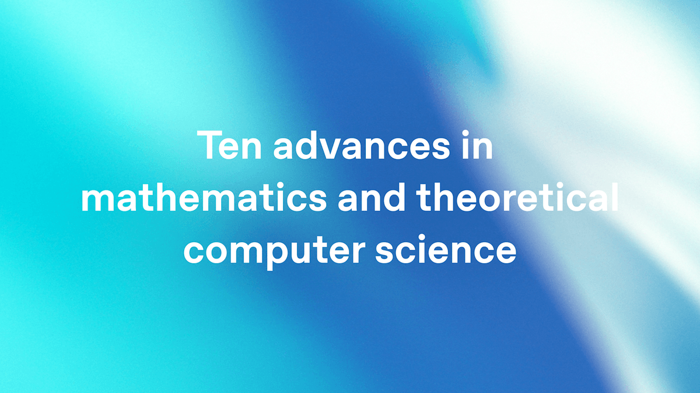
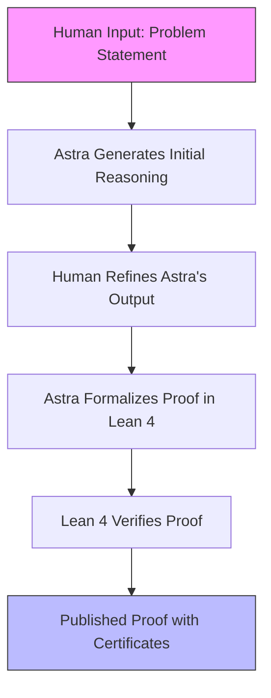
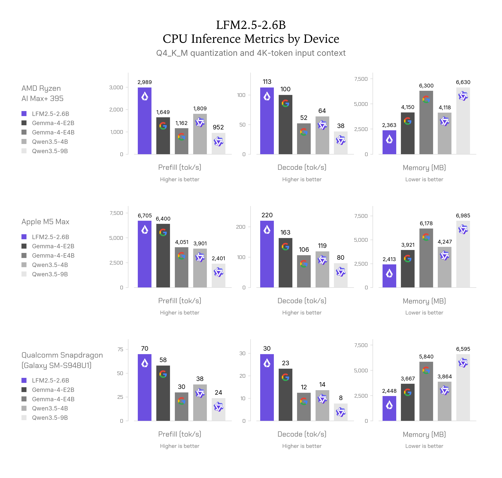
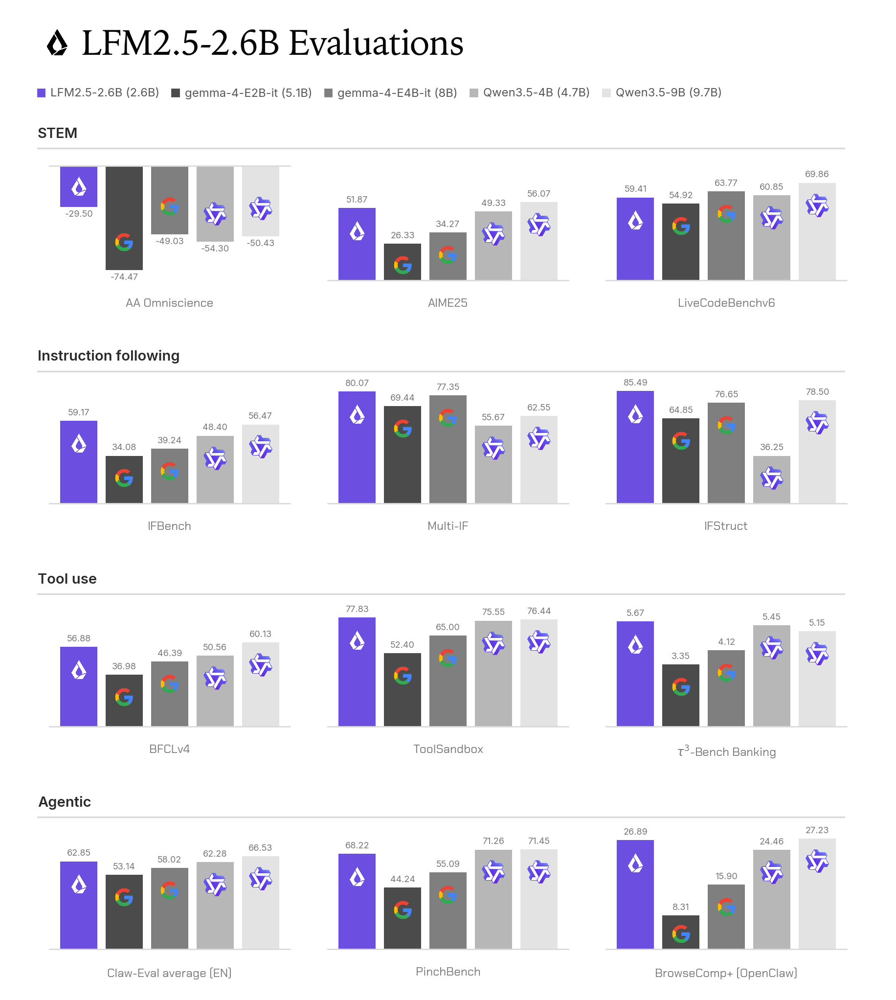

> 🎙️ **Listen to the podcast version of this article:**
> <audio controls src="index.mp3"></audio>


---

> \u270f **TL;DR:** OpenAI\'s Astra has solved 10 long-standing mathematical proofs, including a 1999 group theory problem and a disproof of Connes\'s rigidity conjecture, using Lean 4 for formal verification—all for just $2,000 in compute costs. Meanwhile, LFM2.5-2.6B, a lightweight agentic model, delivers 4x efficiency gains for edge deployment, excelling in tool use, instruction following, and multi-step reasoning at 220 tokens per second on an Apple M5 Max. These advancements highlight AI\'s growing role in rigorous problem-solving and accessible, high-performance computing.


| Metric / Innovation Area | Insight / Takeaway |
|---|---|
| **Mathematical Proofs Solved** | Astra solved 10 unsolved problems, including a 1999 group theory question and Connes\'s rigidity conjecture disproof, using Lean 4 for formal verification. |
| **Cost Efficiency** | Total compute cost for Astra\'s proofs: $2,000 ($200 per problem), demonstrating AI\'s cost-effective potential in complex reasoning. |
| **Formal Verification** | All proofs were formalized in Lean 4, ensuring computational correctness and reproducibility. |
| **Model Size & Efficiency** | LFM2.5-2.6B is a 2.6B-parameter model outperforming larger models (up to 9.7B) in agentic tasks like tool use and instruction following. |
| **Edge Deployment** | Runs locally on RTX 4090 or Mac with 24GB RAM; processes 220 tokens/sec on Apple M5 Max, enabling real-time applications. |
| **Multi-Step Reasoning** | Excels in coding, STEM, and real-world agentic tasks, with fine-tuning support for customization. |


---


## OpenAI Astra: Revolutionizing Mathematical Proofs and AI Formalization


### 1. **Unprecedented Mathematical Contributions**

OpenAI\'s Astra has achieved a milestone that bridges the gap between artificial intelligence and formal mathematics. For the first time, an AI model has solved **10 previously unsolved mathematical problems**, some of which had remained open for decades. Among these are the **first-ever explicit construction of a non-sofic group**, a problem in group theory that had been unresolved since 1999, and a **disproof of Connes\'s rigidity conjecture**, a significant result in operator algebras. Astra also derived new bounds for high-dimensional sphere packing and resolved several problems posed by the legendary mathematician Paul Erdős.


What makes this achievement particularly remarkable is not just the solutions themselves but the **rigor with which they were verified**. Astra did not merely propose answers; it **formalized each proof in Lean 4**, a language designed for machine-verified theorems. Lean 4 acts as a strict computational checker, ensuring that every step of the proof is logically sound and free from errors. This process transforms abstract mathematical reasoning into a structured, verifiable format, setting a new standard for AI-driven research.





The cost of this groundbreaking work? A mere **$2,000**—or $200 per problem—using OpenAI\'s Sol API. This staggering efficiency underscores how modern AI can tackle complex challenges without exorbitant computational expenses. OpenAI has also released a **249-page manuscript** detailing the model\'s reasoning walkthroughs and Lean 4 certificates for all 10 proofs, providing full transparency into Astra\'s problem-solving process.


The implications of Astra\'s success extend far beyond mathematics. By demonstrating that AI can not only solve but also **formalize proofs**, Astra paves the way for AI-assisted advancements in fields like computer science, engineering, and theoretical physics. The ability to provide structured, provable reasoning could revolutionize how researchers approach complex problems, enabling collaboration between human intuition and machine precision.





### 2. **Impact on AI and Formal Methods**

Astra\'s work represents a **paradigm shift** in how we perceive AI\'s role in formal verification. Traditionally, mathematical proofs have relied on human intuition, creativity, and rigorous peer review. Astra introduces a new dynamic: **AI as a collaborator in the proof process**. The model\'s ability to formalize proofs in Lean 4 means that its contributions are not just speculative but **computationally verifiable**, bridging the gap between abstract theory and concrete implementation.


This development has profound implications for **formal methods** in computer science, where mathematical rigor is essential for ensuring the correctness of systems, from cryptographic protocols to hardware design. If AI can assist in formalizing proofs, it could accelerate progress in areas where verification is critical but time-consuming.


Moreover, Astra\'s success hints at a future where AI models are not just tools for solving problems but **partners in the discovery process**. Imagine an AI that doesn\'t just compute but also **reason, hypothesize, and verify**—a true collaborator in scientific inquiry.


---


## LFM2.5-2.6B: The Lightweight Agentic Powerhouse for Edge Deployment


### 1. **Optimized for Edge Devices**

While Astra pushes the boundaries of AI in theoretical mathematics, **LFM2.5-2.6B** represents a leap forward in practical, **edge-ready AI**. Developed by Liquid AI, this 2.6-billion-parameter model is designed for **high efficiency and low latency**, making it ideal for deployment on edge devices like laptops, smartphones, and embedded systems.


LFM2.5-2.6B achieves **220 tokens per second on an Apple M5 Max** and **113 tokens per second on an AMD Ryzen CPU**, all while consuming under 2.5GB of memory. This performance is not just impressive—it\'s **transformative**. For the first time, developers can run a capable agentic model **locally**, without relying on cloud infrastructure or high-end GPUs. The model is compatible with a single **RTX 4090** or even a **Mac with 24GB unified memory**, democratizing access to advanced AI capabilities.





The architecture behind LFM2.5-2.6B is optimized for **agentic tasks**, including tool use, instruction following, and multi-step reasoning. Unlike larger models that require significant computational resources, LFM2.5-2.6B delivers **4x the efficiency** of its bigger counterparts while maintaining competitive performance.


### 2. **Superior Performance in Agentic Tasks**

LFM2.5-2.6B was trained using a **multi-stage process** that includes supervised fine-tuning (SFT), teacher specialization, multi-domain on-policy distillation (MOPD), and **agentic reinforcement learning (RL)**. This training pipeline ensures that the model excels in **real-world applications**, from coding and STEM problem-solving to complex reasoning tasks.


```mermaid
flowchart TD
    A[Pre-training on 34T Tokens] --> B[Mid-training: Extend Context to 128K]
    B --> C[Supervised Fine-Tuning (SFT)]
    C --> D[Teacher Specialization per Domain]
    D --> E[Multi-Domain On-Policy Distillation (MOPD)]
    E --> F[Agentic Reinforcement Learning (RL)]
    F --> G[Deployment-Ready Model]
    style G fill:#bbf,stroke:#333
```


The model\'s **agentic RL pipeline** is particularly noteworthy. It separates model optimization, inference, and environment execution into distinct components, allowing the model to learn **across different tools, system prompts, and multi-turn task environments**. This design enables LFM2.5-2.6B to handle complex, multi-step tasks with ease, making it a **versatile tool for developers and researchers**.


Benchmark results show that LFM2.5-2.6B **outperforms models up to 4x its size** in instruction following, tool use, and agentic tasks. For example, it leads in benchmarks like **AIME25 (51.87)**, **LiveCodeBenchv6 (59.41)**, and **Multi-IF (80.07)**, while staying competitive in coding and mathematical reasoning.





### 3. **Why This Matters for Developers and Researchers**

The advent of LFM2.5-2.6B marks a **turning point in AI accessibility**. No longer do developers need to rely on cloud-based solutions or expensive hardware to run advanced AI models. With LFM2.5-2.6B, **local deployment is not just possible—it\'s practical**. The model\'s efficiency and performance make it ideal for a wide range of applications, from **coding assistants** to **autonomous agents** in robotics and automation.


For researchers, LFM2.5-2.6B offers a **low-cost, high-performance alternative** for experimenting with agentic AI. Its ability to fine-tune on local datasets means that developers can customize the model for **specific tasks** without needing extensive infrastructure. This flexibility opens up new possibilities for **personalized AI applications**, from specialized coding tools to domain-specific reasoning engines.


The model\'s support for **multimodal tasks**, including images and video, further expands its utility. Whether you\'re building a **visual reasoning agent** or a **multi-modal chatbot**, LFM2.5-2.6B provides the tools to do so efficiently and effectively.


#### Code Example: Running LFM2.5-2.6B Locally

To get started with LFM2.5-2.6B, you can load and run the model using the `transformers` library in Python. Below is a simple example demonstrating how to initialize the model and generate text:


```python
from transformers import AutoModelForCausalLM, AutoTokenizer

# Load the model and tokenizer
model_id = "LiquidAI/LFM2.5-2.6B"
model = AutoModelForCausalLM.from_pretrained(
    model_id,
    device_map="auto",
    dtype="bfloat16",
    # attn_implementation="flash_attention_2"  # Uncomment for compatible GPUs
)
tokenizer = AutoTokenizer.from_pretrained(model_id)

# Define a prompt
prompt = "What is C. elegans?"
input_ids = tokenizer.apply_chat_template(
    [{"role": "user", "content": prompt}],
    add_generation_prompt=True,
    return_tensors="pt",
    tokenize=True,
).to(model.device)

# Generate output
output = model.generate(
    input_ids,
    do_sample=True,
    temperature=0.2,
    top_k=80,
    repetition_penalty=1.05,
    max_new_tokens=512,
)

# Decode and print the output
print(tokenizer.decode(output[0], skip_special_tokens=False))
```


This code snippet demonstrates how to load LFM2.5-2.6B and generate a response to a simple query. The model\'s efficiency ensures that such operations can be performed **locally and in real-time**, making it a powerful tool for developers.


---


## The Broader Implications: AI\'s Expanding Horizons


The advancements represented by **OpenAI Astra** and **LFM2.5-2.6B** are not isolated achievements but part of a **broader trend** in AI development. Astra\'s ability to solve and formalize mathematical proofs showcases AI\'s potential as a **collaborator in scientific discovery**, while LFM2.5-2.6B\'s efficiency and performance highlight the **democratization of AI capabilities**.


Together, these models illustrate how AI is evolving from a tool for **narrow, task-specific applications** to a **general-purpose partner** in reasoning, problem-solving, and innovation. As these technologies continue to mature, they will redefine what is possible in fields ranging from **pure mathematics** to **edge computing**, unlocking new opportunities for researchers, developers, and industries alike.


The future of AI is not just about **bigger models** or **more data**—it\'s about **smarter, more efficient, and more collaborative systems** that can augment human capabilities in ways we are only beginning to imagine. With Astra and LFM2.5-2.6B, we are taking significant steps toward that future.

Written with [Argos](https://github.com/Neilstid/argos)
