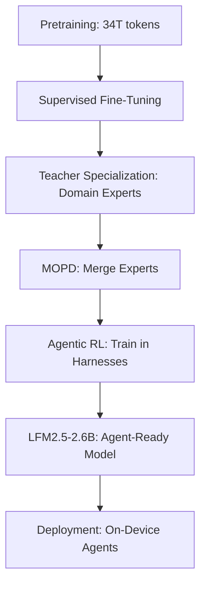
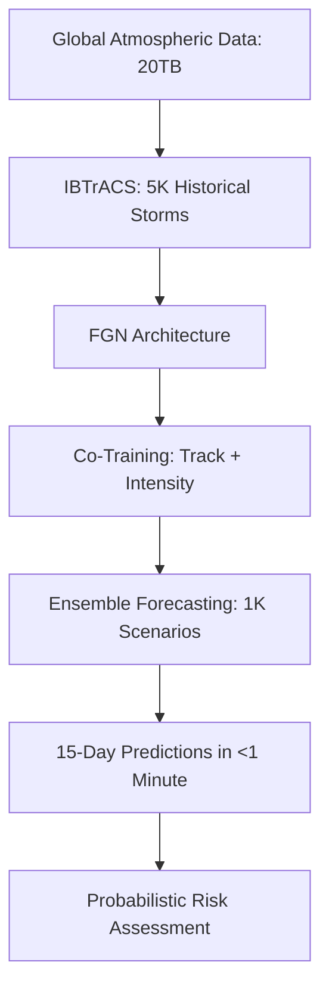
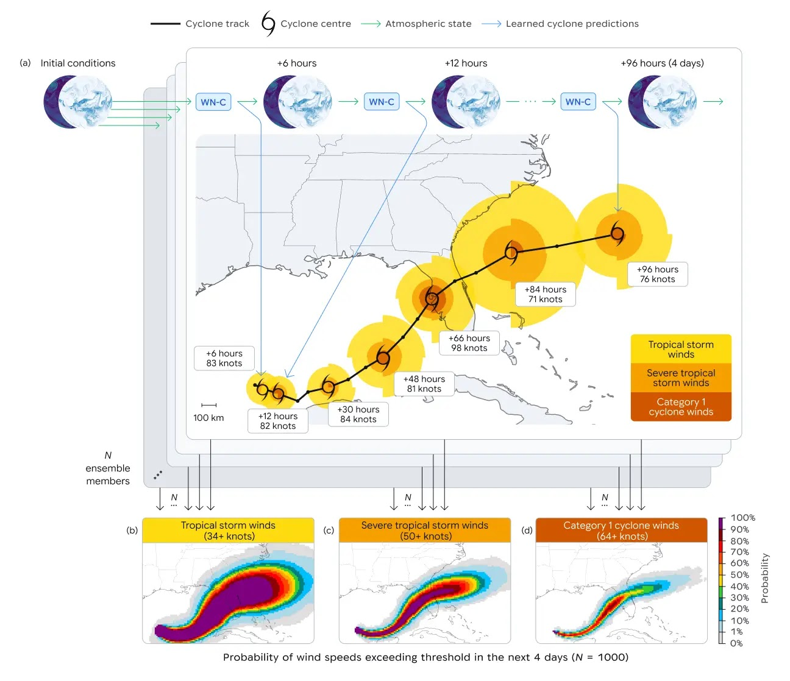
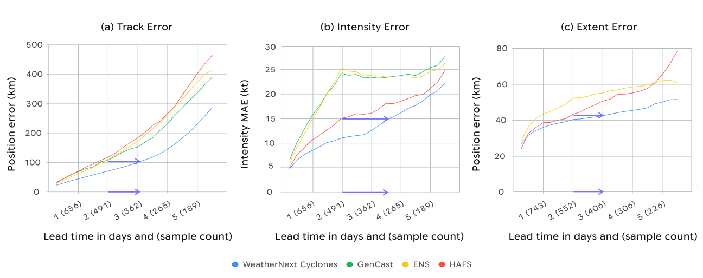

> 🎙️ **Listen to the podcast version of this article:**
> <audio controls src="index.mp3"></audio>


---

> \u2728 **TL;DR:** Liquid AI\’s **LFM2.5-2.6B** redefines edge AI by delivering agentic capabilities on devices as small as a Raspberry Pi, while Google DeepMind\’s **WeatherNext** achieves a decade\’s worth of progress in cyclone forecasting by adding an extra day of predictive accuracy. Both innovations prioritize accessibility, scalability, and real-world impact—from on-device automation to disaster preparedness.

| **Metric / Innovation Area**               | **Insight / Takeaway**                                                                                     |
|-------------------------------------------|---------------------------------------------------------------------------------------------------------|
| **Model Size & Scope**                     | LFM2.5-2.6B: 2.6B parameters, 128K context window; WeatherNext: 20TB atmospheric data, 1K scenario forecasts |
| **Hardware Compatibility**                | LFM2.5-2.6B runs on Raspberry Pi to Nvidia H100 (15K tokens/sec); WeatherNext operates on TPUs               |
| **Agentic Capabilities**                   | LFM2.5-2.6B excels in tool calling, workflow automation, and background routines                          |
| **Forecasting Breakthrough**              | WeatherNext adds 24+ hours of lead time for cyclone track, intensity, and wind structure predictions   |
| **Licensing Model**                       | LFM2.5-2.6B: Open for orgs <$10M revenue; WeatherNext: Fully open-source (Apache 2.0)                     |
| **Real-World Impact**                     | LFM2.5-2.6B: MacPaw partnership for macOS; WeatherNext: NHC hurricane forecasts and renewable energy planning |

---

# Liquid AI’s LFM2.5-2.6B: Revolutionizing Edge AI with Agentic Capabilities

## Introduction

The AI landscape is undergoing a tectonic shift. While the industry has long fixated on ever-larger models and cloud-based inference, a new paradigm is emerging: **edge AI**, where powerful models run locally on everything from smartphones to embedded systems. Leading this charge is **Liquid AI’s LFM2.5-2.6B**, a 2.6-billion-parameter model designed not for chatbot conversations but for **agentic workflows**—autonomous, tool-wielding assistants that operate entirely on-device. This isn’t just an incremental improvement; it’s a reimagining of where and how AI can be deployed.

At its core, LFM2.5-2.6B addresses a critical gap: the need for **private, low-latency, and cost-effective AI** in regulated industries, connectivity-limited environments, and resource-constrained devices. By eliminating reliance on cloud inference, Liquid AI is unlocking use cases in healthcare, finance, robotics, and beyond—where data sensitivity or operational continuity cannot tolerate cloud dependencies.

## What Makes LFM2.5-2.6B Unique?

### 1. **Designed for Agentic Workflows**

LFM2.5-2.6B is purpose-built for **agents**, not chat. Traditional language models are optimized for dialogue, but Liquid AI recognized a growing trend: **AI is increasingly consumed through agent frameworks** like Hermes Agent, OpenClaw, or custom harnesses. These agents don’t just respond to prompts—they proactively manage tools, documents, calendars, and workflows, often running continuously in the background.

The model’s training pipeline reflects this focus:

1. **Supervised Fine-Tuning (SFT)**: Aligns the model with precise instruction-following.
2. **Teacher Specialization**: Trains domain-specific experts (e.g., math, coding, tool use) separately.
3. **Multi-Domain On-Policy Distillation (MOPD)**: Merges expert capabilities into a single, unified student model.
4. **Agentic Reinforcement Learning**: Trains the model *inside* production agent frameworks (e.g., Hermes Agent) on realistic tasks like research, coding, and automation.

This pipeline yields a "happy accident": improvements spill over into general capabilities. As Maxime Labonne, Liquid AI’s Head of Post-Training, noted, "We got better at math, at instruction following… we even got really good at code." The model’s **128K-token context window** and **native tool-calling** further enable long-running, complex workflows.



### 2. **Performance on Diverse Hardware**

LFM2.5-2.6B’s most striking feature is its **hardware agnosticism**. Unlike models optimized for GPU benchmarks, it’s designed for **real-world CPU performance**, making it viable on everything from a **Raspberry Pi** to an **Nvidia H100**. Benchmarks reported by Liquid AI include:

- **Apple M5 Max**: ~220 tokens/second
- **AMD Ryzen AI Max+ 395**: ~113 tokens/second
- **Smartphones**: ~30 tokens/second (via Liquid’s **Apollo** app)
- **Nvidia H100**: ~15,000 tokens/second (1.3B tokens/day per GPU)

The model’s **<2.5GB memory footprint** ensures it fits on low-power devices, while its **dense architecture** (no sparsity or quantization tricks) maintains performance. Labonne emphasized: *"You can deploy it in target devices where you are not able to deploy the other ones at all."*

### 3. **Open Weights and Deployment Flexibility**

Liquid AI has released LFM2.5-2.6B under the **LFM Open License v1.0**, which permits commercial use, modification, and redistribution for organizations with **< $10M annual revenue**. Larger enterprises require a separate commercial agreement—a **revenue-gated model** that balances openness with sustainability.

The model is available on **Hugging Face** with day-one support for major inference stacks:

- **llama.cpp** (CPU/GPU)
- **MLX** (Apple Silicon)
- **vLLM** (GPU serving)
- **SGLang** (high-throughput serving)
- **ONNX** (cross-platform)

Developers can also leverage **LEAP**, Liquid AI’s open-source fine-tuning framework, to customize the model for niche use cases. Labonne noted that fine-tuning can bridge the gap to **GPT-4/Claude-level performance** for task-specific deployments: *"If you fine-tune it well, it’s going to match the performance of GPT and Claude—really, if your task is not the most complex task in the world."*

```python
# Example: Loading LFM2.5-2.6B with llama.cpp
from llama_cpp import Llama

model = Llama(
    model_path="liquid-ai/LFM2.5-2.6B",
    n_ctx=128000,  # 128K context window
    n_threads=4,     # CPU parallelism
)

# Agentic tool-calling example
response = model(
    prompt="Summarize this document and email the key points to my team.",
    tools=["read_file", "send_email"],  # Hypothetical tool integrations
    max_tokens=1024,
)
```

## Licensing and Enterprise Adoption

### Open vs. Revenue-Gated Licensing

LFM2.5-2.6B’s hybrid licensing model reflects a pragmatic approach to **sustainable open-source AI**. While smaller organizations can use the model freely, larger enterprises must negotiate commercial terms. Labonne acknowledged the enforcement challenge: *"I don’t know [how we’ll detect misuse]. And even if you’re above $10 million, the only thing we ask is to contact us."*

This model ensures Liquid AI can continue funding development while keeping the technology accessible. It’s a middle ground between fully permissive licenses (e.g., Apache 2.0 for Google’s Gemma) and restrictive ones.

### Strategic Partnerships

Liquid AI’s partnership with **MacPaw** underscores the model’s enterprise potential. MacPaw’s **Eney** assistant will use LFM2.5-2.6B to power on-device AI on macOS, leveraging Apple Silicon via MacPaw’s **Elix** inference engine and **Mnemos** memory layer. Labonne highlighted the **size advantage**: *"One of the reasons they chose us is because the model is quite small, and they don’t have the memory budget for larger models."*

This collaboration signals a broader trend: **hardware vendors and OS developers are investing heavily in local AI execution**, and LFM2.5-2.6B is positioned to capitalize on it.

## Broader Implications for AI Deployment

### Edge AI and Privacy Concerns

In industries like healthcare, finance, and government, **data privacy is non-negotiable**. LFM2.5-2.6B’s on-device operation eliminates cloud inference risks, reducing latency, improving security, and cutting costs. For example:

- **Healthcare**: HIPAA-compliant AI agents analyzing patient data locally.
- **Finance**: Fraud detection models running on ATMs or POS systems.
- **Robotics**: Autonomous systems making real-time decisions without cloud dependency.

### Cost-Effectiveness and Scalability

The economic case for edge AI is compelling. Enterprises can deploy **high-volume, task-specific agents** at near-zero marginal cost (just electricity). Labonne framed it as a **deployment economics** problem: *"You should use [edge AI] when you can’t use a cloud model."*

For use cases like:
- **Calendar automation** (e.g., scheduling, reminders)
- **Document management** (e.g., summarization, tagging)
- **Background routines** (e.g., monitoring, alerts)

...LFM2.5-2.6B offers a **generalizable, repurposable** solution. Swap the **harness** (not the model) to adapt the same agent to new tools or workflows.

---

# WeatherNext: AI’s Breakthrough in Cyclone Forecasting

## Introduction

While Liquid AI is redefining edge AI, **Google DeepMind and Google Research** are pushing the boundaries of **climate resilience** with **WeatherNext**, an AI model that adds **an extra day of predictive accuracy** to cyclone forecasting. Published in *Nature*, WeatherNext represents a **decade’s worth of meteorological progress**, enabling forecasters to predict a cyclone’s **track, intensity, and wind structure** with unprecedented lead time.

The stakes are high: tropical cyclones have caused **700,000+ deaths and $1.4 trillion in economic losses** over the past 50 years. Every hour of additional warning time can save lives and mitigate damage. WeatherNext’s breakthrough is already proving its worth—during the **2025 hurricane season**, it helped the **National Hurricane Center (NHC)** predict **Hurricane Melissa’s** rapid intensification and landfall in Jamaica, enabling advanced evacuations.

## How WeatherNext Works

### Functional Generative Networks (FGNs)

WeatherNext’s core innovation is its use of **Functional Generative Networks (FGNs)**, a novel architecture that processes **20 terabytes of global atmospheric data** and **expert-curated historical observations** (from the **IBTrACS** database, spanning ~5,000 storms). Unlike traditional models that trade off between **global track prediction** and **local intensity modeling**, WeatherNext **bridges this gap** by:

1. **Co-Training on Dual Modalities**: Combines global weather dynamics with fine-scale cyclone observations.
2. **Low-Resolution Inputs**: Achieves state-of-the-art accuracy with **28x28km resolution data** (100x coarser than traditional models). Even a **111x111km resolution** mini-version performs well.
3. **Ensemble Forecasting**: Generates **1,000 scenario forecasts in under a minute** on a TPU, capturing rare but critical events like rapid intensification.

The model’s ability to deliver **15-day forecasts** with **sub-minute inference times** empowers forecasters to evaluate **tail risks** (e.g., extreme wind events) probabilistically.



### Open-Source Tools and Impact

Google has open-sourced **three variants** of WeatherNext to accelerate global adoption:

1. **WeatherNext 2**: Full-scale model for advanced weather analysis.
2. **WeatherNext Cyclones**: Specialized for cyclone forecasting.
3. **WeatherNext 2-mini**: Lightweight version for broader accessibility.

These tools are designed to:
- **Enhance disaster preparedness** (e.g., early warnings for evacuations).
- **Support renewable energy planning** (e.g., wind/solar farm optimization).
- **Improve climate resilience** (e.g., infrastructure adaptation).

Users can explore forecasts via **Weather Lab**, a refreshed interface that visualizes **temperature, precipitation, wind speed, and cyclone tracks** globally.


*WeatherNext Cyclones generates localized probability maps of tropical storm to hurricane-force winds by running 1,000-member ensembles.*

## Enhancing Disaster Preparedness

### Predictive Accuracy and Early Warning Systems

WeatherNext’s **24+ hour lead time improvement** is a game-changer for **early warning systems**. For example:

- **Hurricane Melissa (2025)**: WeatherNext predicted its **rapid intensification** and **Jamaica landfall**, enabling the NHC to issue **advance warnings** that saved lives.
- **Probabilistic Forecasts**: The 1,000-scenario ensembles help forecasters assess **low-probability, high-impact events** (e.g., sudden storm surges).

This level of accuracy is equivalent to **a decade of progress** in meteorological forecasting, as shown in the benchmark comparisons below:


*WeatherNext Cyclones gains >24 hours of lead time for track, intensity, and wind structure predictions compared to prior models.*

### Renewable Energy Planning

Accurate weather forecasting is critical for **renewable energy sectors**, particularly **wind and solar**. WeatherNext enables:

- **Grid Stability**: Better prediction of wind patterns for turbine optimization.
- **Energy Storage**: Anticipating lulls in solar/wind generation to manage battery reserves.
- **Demand Forecasting**: Aligning energy supply with consumption patterns.

By integrating WeatherNext, energy providers can **reduce costs, improve efficiency, and lower carbon footprints**.

## Challenges and Future Directions

### Scalability and Integration

While WeatherNext’s capabilities are transformative, **integration into existing meteorological infrastructures** poses challenges:

- **Data Accessibility**: Requires high-quality, global atmospheric data.
- **Real-Time Processing**: Ensuring sub-minute inference at scale.
- **Model Interpretability**: Understanding how FGNs achieve accuracy with coarse inputs remains an **open research question**.

### Collaboration and Open Innovation

Google’s decision to **open-source WeatherNext** reflects a commitment to **collaborative innovation**. By making the models and code freely available, the company aims to:

- **Empower researchers** to build localized or specialized models.
- **Support meteorological agencies** in developing countries.
- **Accelerate climate resilience** through shared knowledge.

As Peter Battaglia, a co-author on the *Nature* paper, noted: *"By combining advanced machine learning with human forecasters’ expertise, we can create a collaborative ecosystem that saves lives and helps communities adapt to climate change."*

---

# Comparative Analysis: LFM2.5-2.6B vs. WeatherNext

While **LFM2.5-2.6B** and **WeatherNext** operate in distinct domains—**edge AI** and **climate modeling**, respectively—they share key philosophical alignements:

| **Aspect**               | **LFM2.5-2.6B**                          | **WeatherNext**                          |
|--------------------------|------------------------------------------|-----------------------------------------|
| **Primary Use Case**     | On-device agentic workflows              | Cyclone and weather forecasting         |
| **Hardware Focus**       | CPUs, Raspberry Pi, smartphones          | TPUs, cloud infrastructure               |
| **Data Scale**           | 34T tokens (text)                         | 20TB atmospheric data + 5K storms        |
| **Key Innovation**       | Agentic RL, MOPD                          | FGNs, ensemble forecasting               |
| **Licensing**            | Revenue-gated open weights               | Fully open-source (Apache 2.0)           |
| **Real-World Impact**    | Privacy-preserving enterprise AI         | Disaster preparedness, energy planning   |

Both models exemplify a **shift toward practical, deployable AI**—whether that means **running agents on a phone** or **forecasting cyclones with a day’s extra warning**.

---

# Conclusion: The Future of AI is Everywhere

Liquid AI’s **LFM2.5-2.6B** and Google DeepMind’s **WeatherNext** represent two sides of the same coin: **AI that meets the world where it is**. LFM2.5-2.6B brings **agentic intelligence to the edge**, enabling private, low-cost, and reliable automation across devices. WeatherNext **extends the horizon of climate resilience**, giving forecasters and communities critical time to prepare for disasters.

Both innovations underscore a broader trend: **the next frontier of AI isn’t just about scale—it’s about accessibility, adaptability, and real-world impact**. As Labonne put it, *"The best models will be in the cloud… but you should use [edge AI] when you can’t use a cloud model."* Meanwhile, WeatherNext proves that **AI can augment human expertise** to tackle some of humanity’s most pressing challenges.

For enterprises, the message is clear: **the future of AI deployment is hybrid**—cloud for scale, edge for privacy and latency, and open collaboration for global progress. The tools are here. The question is: *How will you use them?*

---

## Further Reading and Resources

- [Liquid AI’s LFM2.5-2.6B on Hugging Face](https://huggingface.co/liquid-ai/LFM2.5-2.6B)
- [Liquid AI’s LEAP Fine-Tuning Framework](https://github.com/liquid-ai/leap)
- [MacPaw & Liquid AI Partnership Announcement](https://macpaw.com/liquid-ai-partnership)
- [WeatherNext *Nature* Paper](https://www.nature.com/weathernext)
- [WeatherNext Open-Source Repository](https://github.com/google-deepmind/weathernext)
- [Weather Lab: Interactive Forecasts](https://weatherlab.google)
- [Google Research Blog: WeatherNext](https://blog.google/technology/ai/weathernext-ai-cyclone-forecasting/)

Written with [Argos](https://github.com/Neilstid/argos)
