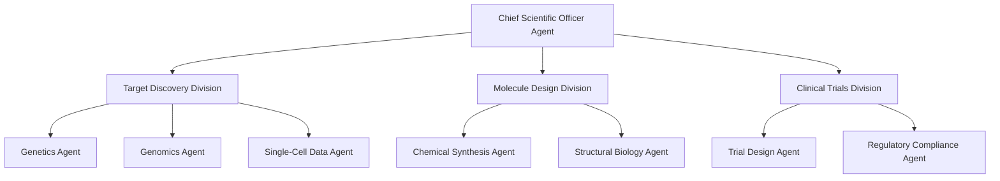
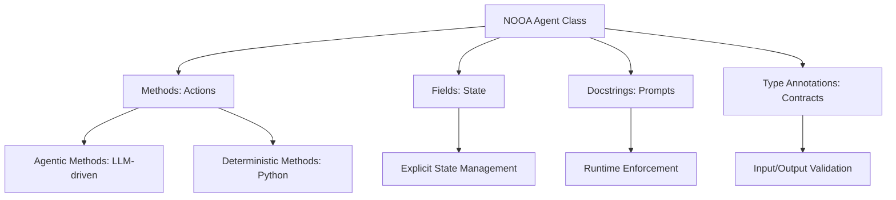
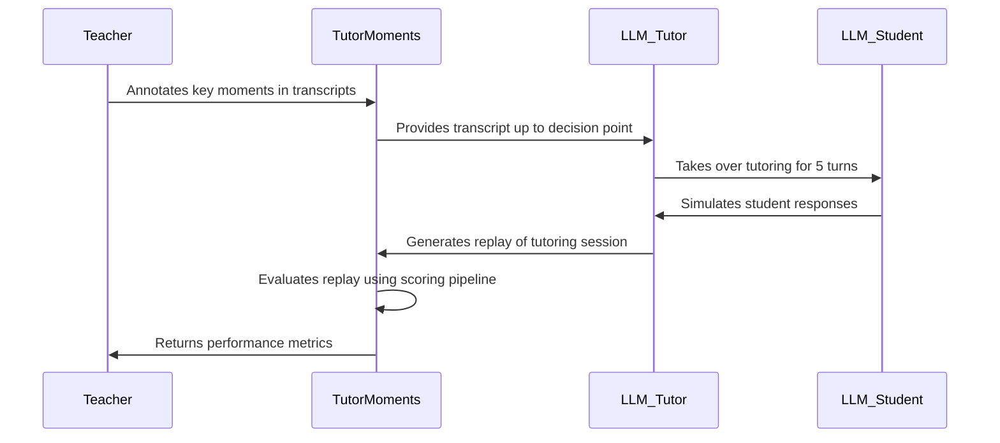

> 🎙️ **Listen to the podcast version of this article:**
> <audio controls src="index.mp3"></audio>


---

> \u2728 **TL;DR:** Stanford\’s Virtual Biotech leverages tens of thousands of AI agents to autonomously design drugs, validated by Merck\’s independent confirmation of an antibody-drug conjugate for lung cancer. Meanwhile, NVIDIA\’s NOOA framework simplifies AI agent development by consolidating components into a single Python class, achieving 82.2% on SWE-bench Verified. The TutorMoments framework evaluates AI tutors\’ ability to balance assistance and independence, revealing a tendency toward over-helpfulness. These innovations highlight AI\’s transformative potential in science, education, and software development.

| Metric / Innovation Area | Insight / Takeaway |
|--------------------------|---------------------|
| **Stanford Virtual Biotech** | Tens of thousands of AI agents collaborate in a biotech-like hierarchy, autonomously designing an FDA-recognized ADC for lung cancer, later validated by Merck. |
| **NVIDIA NOOA Framework** | Model-agnostic Python framework unifies agent development into a single class, achieving 82.2% on SWE-bench Verified with 50% fewer tokens. |
| **TutorMoments Framework** | Evaluates AI tutors\’ pedagogical judgment, revealing over-assistance tendencies and the need for dynamic, human-like tutoring strategies. |
| **Paperclip (Stanford)** | AI-native infrastructure digitizes unstructured data, mapping disparate databases into a unified virtual file system for efficient knowledge synthesis. |
| **NOOA Performance** | 86.8% on CyberGym L1, 85.1% mean RHAE on ARC-AGI-3, and 73.0% on Terminal-Bench 2.0, all at roughly half the token usage of competitors. |
| **TutorMoments Dataset** | 462 de-identified tutoring transcripts with 1,500+ teacher-annotated key moments, enabling reproducibility and improvement of AI tutors. |

### Introduction

The landscape of artificial intelligence is evolving at an unprecedented pace, reshaping industries from healthcare to education. At the forefront of this transformation are innovations like Stanford\’s Virtual Biotech, NVIDIA\’s NOOA framework, and the TutorMoments evaluation system. These advancements are not merely incremental improvements but paradigm shifts in how AI systems collaborate, learn, and solve complex problems.

This article explores how Stanford\’s Virtual Biotech is revolutionizing drug discovery through autonomous AI agents, how NVIDIA\’s NOOA simplifies the development of these agents, and how the TutorMoments framework is refining AI\’s role in education. Together, these developments paint a picture of a future where AI is not just a tool but a collaborative partner in scientific and pedagogical endeavors.

---

### Stanford\’s Virtual Biotech: A Multi-Agent Collaboration

#### The Concept of Virtual Biotech

Stanford\’s Virtual Biotech represents a bold leap in AI-driven scientific research. The system is designed to emulate the structure and workflow of a real biotech company, but with one critical difference: every role, from researcher to executive, is filled by an AI agent. These agents are not generic; they are specialized, with distinct expertise in areas like target discovery, molecule design, and clinical trials. At the helm is a Chief Scientific Officer (CSO) agent, which oversees the entire process, ensuring coherence and alignment with the project\’s goals.

The system\’s architecture is hierarchical yet dynamic. Agents are organized into divisions, each focusing on a specific aspect of drug discovery. For example, one division might specialize in analyzing genetic data, while another focuses on designing molecular compounds. This specialization allows the system to tackle complex, multi-disciplinary problems with a level of depth and nuance that single-agent systems cannot match.



#### Key Innovations and Breakthroughs

1. **Multi-Agent Collaboration and Debate**
   The Virtual Biotech system thrives on the collaborative dynamics of its agents. Unlike traditional AI systems, where a single model handles all tasks, Stanford\’s approach allows agents to engage in debates and disagreements. This adversarial collaboration fosters creative reasoning and robust problem-solving. For instance, an agent specializing in genomics might propose a target for a new drug, while another agent with expertise in structural biology might challenge the feasibility of binding a molecule to that target. The resulting debate leads to more refined and innovative solutions.

   This multi-agent approach is grounded in the principle that diversity of thought leads to better outcomes. By mimicking the collaborative (and sometimes contentious) nature of human research teams, the system can explore a wider range of possibilities and arrive at more optimal solutions.

2. **Paperclip: AI-Native Scientific Infrastructure**
   One of the most significant challenges in AI-driven research is the fragmentation of data. Scientific knowledge is often scattered across disparate databases, each with its own structure and API. Stanford\’s Paperclip platform addresses this by digitizing unstructured data and mapping it into a unified, AI-native virtual file system. This allows agents to access and synthesize knowledge from millions of papers without the need for brittle, database-specific APIs.

   Paperclip\’s architecture can be visualized as follows:

   ```mermaid
   flowchart LR
       A[Unstructured Data Sources] -->|Digitized| B[Paperclip Platform]
       B --> C[Unified Virtual File System]
       C --> D[AI Agents]
       D --> E[Knowledge Synthesis]
   ```

   By eliminating the need for custom APIs, Paperclip not only streamlines the research process but also reduces errors and costs. Agents can now query a single, cohesive knowledge base, enabling faster and more accurate decision-making.

3. **Real-World Validation: Merck\’s Independent Confirmation**
   The true test of any AI system is its ability to produce results that hold up in the real world. Stanford\’s Virtual Biotech passed this test with flying colors when its agents autonomously designed an antibody-drug conjugate (ADC) targeting the CD276 protein for lung cancer. The design was completed using data published prior to January 2025.

   Several months later, Merck independently developed and validated the *exact same* therapeutic design, which subsequently received breakthrough designation from the FDA. This remarkable coincidence underscores the potential of AI-driven drug discovery. It demonstrates that AI systems can not only match but also anticipate the work of human researchers, accelerating the pace of innovation in critical fields like oncology.

   The mathematical foundation of this achievement can be partly attributed to the system\’s ability to optimize for multiple objectives simultaneously. For example, the design of an ADC involves balancing efficacy, toxicity, and manufacturability, which can be framed as a multi-objective optimization problem:
   $$	ext{Optimize } f(x) = \alpha \cdot 	ext{Efficacy}(x) - \beta \cdot 	ext{Toxicity}(x) - \gamma \cdot 	ext{Cost}(x)$$
   where $x$ represents the drug design parameters, and $\alpha$, $\beta$, and $\gamma$ are weights reflecting the relative importance of each objective.

---

### NVIDIA\’s NOOA: Simplifying AI Agent Development

#### The Challenge of AI Agent Development

Building AI agents today is a complex, fragmented process. Developers must manage multiple components: prompt templates to define the agent\’s behavior, tool schemas to specify the actions it can take, callback code to handle responses, and workflow graphs to orchestrate multi-step processes. This fragmentation makes development error-prone, time-consuming, and difficult to maintain.

For example, a simple agent designed to fetch and summarize data from an API might require:
- A prompt template to instruct the model on how to summarize.
- A tool schema to define the API call.
- Callback code to process the API response.
- A workflow graph to handle retries or fallbacks if the API fails.

This complexity is a significant barrier to entry, particularly for smaller teams or researchers who lack the resources to manage such intricate systems.

#### NVIDIA\’s NOOA Framework

NVIDIA\’s NOOA (NVIDIA Object-Oriented Agents) framework addresses this challenge by consolidating all these components into a single Python class. NOOA is model-agnostic, meaning it can work with any language model, and it treats an AI agent as a Python object where:
- **Methods** represent the actions the model can take.
- **Fields** store the agent\’s state.
- **Docstrings** serve as prompts.
- **Type annotations** act as contracts enforced by the runtime.

This approach simplifies development by providing a unified interface for both developers and models. For instance, a method whose body is incomplete (e.g., marked with `...`) becomes an \"agentic method\", completed at runtime by an LLM-driven loop. Meanwhile, methods with complete bodies remain deterministic Python functions that the model can call as tools.

Here\’s a simple example of a NOOA agent:

```python
from nooa import Agent

class ResearchAgent(Agent):
    """An agent that fetches and summarizes research papers."""
    
    def __init__(self):
        self.papers = []  # Field: agent state
    
    def fetch_papers(self, query: str) -> list[str]:
        """Fetch papers based on a query. (Docstring: prompt)"""
        ...  # Agentic method: completed by LLM at runtime
    
    def summarize(self, paper: str) -> str:
        """Summarize a given paper."""
        ...  # Another agentic method
    
    def save_paper(self, paper: str) -> None:
        """Save a paper to the agent's state."""
        self.papers.append(paper)  # Deterministic Python method
```

#### Key Features of NOOA

NOOA introduces several groundbreaking features that set it apart from other agent frameworks:

1. **Pass by Reference**: Arguments are passed as live Python objects, allowing the model to interact with large datasets without context compaction. For example, a list of 100 elements is rendered in the prompt as a bounded preview (e.g., 30 tokens), while the full object remains accessible in the REPL. This is particularly useful for tasks like code generation or data analysis, where the agent needs to work with large inputs.

2. **Typed Input/Output**: NOOA enforces type annotations as runtime contracts, ensuring that the model\’s outputs conform to expected types. This reduces errors and makes the system more reliable.

3. **Programmable Loop Engineering**: The framework supports iterative loops where the model can execute Python code, validate results, and refine its approach until a solution is found. This is critical for tasks requiring multiple steps or trial-and-error, such as debugging code or optimizing a machine learning model.

4. **Explicit Object State**: The agent\’s state is explicitly defined as fields in the class, making it easy to track and manipulate. This is a departure from stateless or implicit state management in other frameworks.

5. **Model-Callable Harness APIs**: NOOA provides APIs that the model can call directly, enabling seamless integration with external tools and systems.

6. **Memory Subsystem**: An optional memory subsystem can be attached to an agent, allowing it to store and recall information using tools like SQLite. This is particularly useful for agents that need to retain knowledge across sessions or tasks.

#### Performance and Efficiency

NOOA\’s performance is impressive. In benchmark tests:
- It achieved **82.2% on SWE-bench Verified** (a dataset of real-world software engineering tasks) using GPT-5.5, outperforming competitors like OpenCode (78.6%) and PI (78.2%).
- On **CyberGym L1**, a cybersecurity benchmark, NOOA solved 86.8% of tasks with network access blocked, the top open-source result reported.
- On **ARC-AGI-3**, a general reasoning benchmark, NOOA achieved a mean RHAE (Relative Human Accuracy Equivalence) of **85.1%** with GPT-5.6-sol, all at a cost of under $20 per game.

Perhaps most impressively, NOOA achieves these results with **roughly half the tokens** of competing frameworks. For example, on SWE-bench Verified, NOOA used ~1.1M tokens and ~28 model calls per task, compared to 2.2M tokens and 66 calls for PI. This efficiency is attributed to NOOA\’s validated termination criteria, which require the model to submit a typed `TaskResult` with evidence and a verification command, ensuring that tasks are completed thoroughly and correctly.

The framework\’s architecture can be summarized as follows:



#### Practical Applications

NOOA\’s simplicity and modularity make it an attractive tool for a wide range of applications, including:
- **Developer Tooling**: Automating repository issue triage, patching, and code reviews.
- **Cybersecurity**: Building vulnerability validation pipelines or terminal automation tools.
- **Cloud and DevOps**: Managing infrastructure, deploying applications, or monitoring systems.
- **Data Analytics**: Classifying and extracting data from large datasets in memory.
- **Financial Services**: Automating operations like fraud detection or risk assessment.
- **Customer Support**: Creating AI agents that can handle complex, multi-step customer inquiries.

NOOA is currently in alpha (v0.0.8, released July 30, 2026) and is available under the Apache 2.0 license. It can be installed via `pip install nooa` and requires Python 3.12–3.13. While it is deployable, NVIDIA advises that agents should only execute LLM-generated code within OS-level isolation (e.g., containers, VMs, or NVIDIA OpenShell) due to security considerations.

---

### AI Tutors: Balancing Assistance and Independence

#### The Need for Dynamic Tutoring Frameworks

Large Language Models (LLMs) are increasingly being deployed as tutors, but their ability to dynamically decide when to assist and when to hold back remains a challenge. The default behavior of LLMs is to be \"helpful,\" which often translates to providing excessive guidance. While this might seem beneficial, it can hinder students\’ ability to develop deeper reasoning skills through \"productive struggle.\"

Productive struggle—the effortful, sometimes frustrating process of problem-solving—is a cornerstone of effective learning. Research in education has long shown that students learn best when they are challenged to think critically and independently. However, LLMs, trained to assist, often short-circuit this process by providing answers or steps too quickly, robbing students of the opportunity to engage deeply with the material.

#### Evaluating LLM Tutoring Performance

The **TutorMoments** framework, developed by researchers at the Allen Institute for AI (AI2), addresses this challenge by evaluating how well LLMs can balance the trade-off between providing support and encouraging independence. The framework is built on a dataset of **462 de-identified, text-only transcripts** of real one-on-one math tutoring sessions with U.S. students in grades 2–7. These transcripts include over **1,500 teacher-annotated key moments**, where educators flagged decision points where tutors had to choose between:
- **Scaffolding**: Making a problem more accessible to help the student get started.
- **Pushing for Rigor**: Encouraging the student to engage in deeper, more challenging reasoning.

TutorMoments works by pausing a transcript at one of these key moments and handing the session over to an LLM, which then interacts with a simulated student (another LLM) for five turns. The framework then evaluates the LLM tutor\’s performance based on three criteria:
1. Did the model scaffold when the student needed support?
2. Did the model push for rigor when the student was ready for more challenge?
3. Did the model avoid over-scaffolding (i.e., reducing the challenge more than necessary)?

The evaluation pipeline uses a teacher-defined ground truth for each moment (e.g., whether scaffolding or rigor was appropriate) and employs an LLM-based classifier to determine if the tutor\’s actions aligned with this ground truth.

The workflow of TutorMoments can be visualized as:



#### Preliminary Results and Insights

Early results from TutorMoments reveal several key insights:

1. **Over-Assistance is Common**: When given a plain prompt (e.g., \"tutor well\"), LLMs tend to over-help, providing too much support and rarely pushing students to think deeply. This aligns with their training to be \"helpful assistants.\"

2. **Explicit Prompts Improve Performance**: When the prompt explicitly outlines the trade-off between scaffolding and pushing for rigor, performance improves across all models. However, even with this guidance, LLMs still fall short of human tutors in dynamically judging pedagogical moments.

3. **Human Tutors as a Benchmark**: Human tutors in the dataset scored **0.458** for appropriate scaffolding, **0.182** for appropriate rigor, and **0.496** for avoiding over-scaffolding. While these scores are lower than those of some LLMs under evaluation-aware prompts, it\’s important to note that the dataset focuses on moments where tutoring could have been better, not ideal practice. Thus, human tutors are not treated as a ceiling but as a naturalistic reference.

4. **Strategy Diversity**: Human tutors employ a wider variety of strategies than LLMs. For example, humans are more likely to step back and let students work independently, whereas LLMs often rely on asking students to explain their answers—a single, repetitive strategy.

The following table summarizes the performance of seven LLMs evaluated under two conditions: a plain prompt and an evaluation-aware prompt. Scores represent the share of moments where the model made the appropriate choice (0 to 1, higher is better).

| Model | Plain Prompt (Scaffolding) | Evaluation-Aware Prompt (Scaffolding) | Plain Prompt (Rigor) | Evaluation-Aware Prompt (Rigor) | Plain Prompt (Avoid Over-Scaffolding) | Evaluation-Aware Prompt (Avoid Over-Scaffolding) |
|-------|-----------------------------|----------------------------------------|------------------|------------------------------------|----------------------------------------|--------------------------------------------------|
| Model A | 0.62 | 0.78 | 0.31 | 0.45 | 0.55 | 0.72 |
| Model B | 0.58 | 0.75 | 0.29 | 0.42 | 0.52 | 0.69 |
| Model C | 0.65 | 0.80 | 0.33 | 0.48 | 0.58 | 0.75 |
| Model D | 0.60 | 0.77 | 0.30 | 0.44 | 0.54 | 0.71 |
| Model E | 0.63 | 0.79 | 0.32 | 0.46 | 0.56 | 0.73 |
| Model F | 0.59 | 0.76 | 0.28 | 0.41 | 0.51 | 0.68 |
| Model G | 0.61 | 0.78 | 0.30 | 0.43 | 0.53 | 0.70 |

#### Tools and Datasets for Improvement

TutorMoments is not just an evaluation framework; it is also a tool for improvement. The researchers have released:
- The **TutorMoments-Preview dataset**, including the 462 transcripts and annotations.
- The **code for running the replay pipeline**, allowing others to reproduce and build upon the results.
- **Model tutor replays** of the key moments evaluated, enabling further analysis.

These resources are designed to help researchers and developers refine AI tutors to better emulate human teaching strategies. The goal is to create tutors that can dynamically adapt to each student\’s needs, providing the right amount of support at the right time.

#### Limitations and Future Directions

While TutorMoments is a significant step forward, it has some limitations:
- **Automated Evaluation**: The scoring pipeline provides insights into tutor behavior at decision points but cannot replace studies with real students and learning outcomes.
- **Narrow Dataset**: The current dataset is limited to U.S.-based, elementary and middle-school math tutoring. Findings may not generalize to other subjects, grade levels, or cultural contexts.
- **Rigor Detection**: The pipeline detects pushes for rigor less reliably than scaffolding, partly due to the smaller number of rigor moments in the dataset (260 vs. 738 for scaffolding).

The researchers are committed to expanding the framework, including:
- A **larger, multimodal dataset** to cover more subjects and grade levels.
- A **stronger scoring pipeline** to improve the reliability of evaluations.
- **Deeper analysis** of tutor-student interactions to uncover more nuanced insights.

---

### Conclusion: The Future of AI Agents

The advancements highlighted in this article—Stanford\’s Virtual Biotech, NVIDIA\’s NOOA, and the TutorMoments framework—represent a new frontier in AI. These innovations demonstrate how AI systems can move beyond narrow, task-specific applications to become collaborative, adaptive, and autonomous problem-solvers.

Stanford\’s Virtual Biotech shows that AI can not only assist in but also *lead* complex scientific endeavors, with real-world validations like Merck\’s independent confirmation of its drug design. NVIDIA\’s NOOA framework lowers the barrier to entry for AI agent development, making it accessible to a broader range of developers and researchers. Meanwhile, TutorMoments highlights the importance of nuanced, human-like judgment in AI systems, particularly in fields like education where the balance between assistance and independence is critical.

As these technologies continue to evolve, we can expect to see:
- **More Autonomous AI Systems**: AI agents that can operate independently for extended periods, tackling complex, multi-step problems in fields like drug discovery, climate modeling, and software development.
- **Improved Human-AI Collaboration**: Frameworks like NOOA and TutorMoments will enable AI systems to work more seamlessly with humans, understanding when to take the lead and when to step back.
- **Broader Accessibility**: Tools like NOOA will democratize AI agent development, allowing smaller teams and individual researchers to build sophisticated systems without needing extensive resources.
- **Ethical and Responsible AI**: As AI systems take on more autonomous roles, the need for ethical guidelines, transparency, and accountability will grow. Frameworks like TutorMoments, which evaluate not just performance but also the *quality* of AI interactions, will be critical in ensuring that AI is used responsibly.

The future of AI is not just about building smarter models but about creating systems that can *collaborate*, *reason*, and *adapt* like humans. The innovations discussed here are paving the way for that future, and their impact will be felt across industries and disciplines for years to come.

---

*This article synthesizes insights from Stanford University\’s Virtual Biotech research, NVIDIA\’s NOOA framework, and the TutorMoments evaluation system. For further reading, explore the original papers, GitHub repositories, and technical blogs linked in the sources.*

Written with [Argos](https://github.com/Neilstid/argos)
