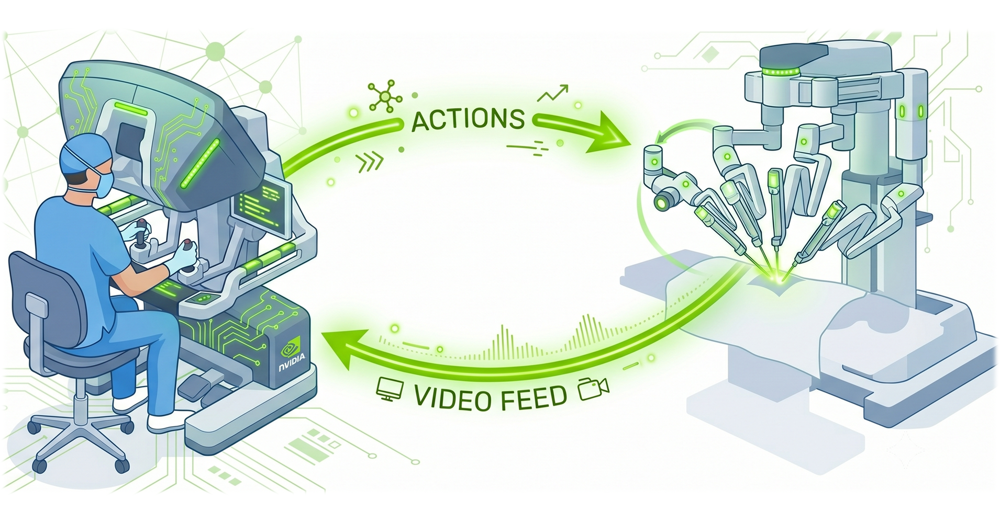
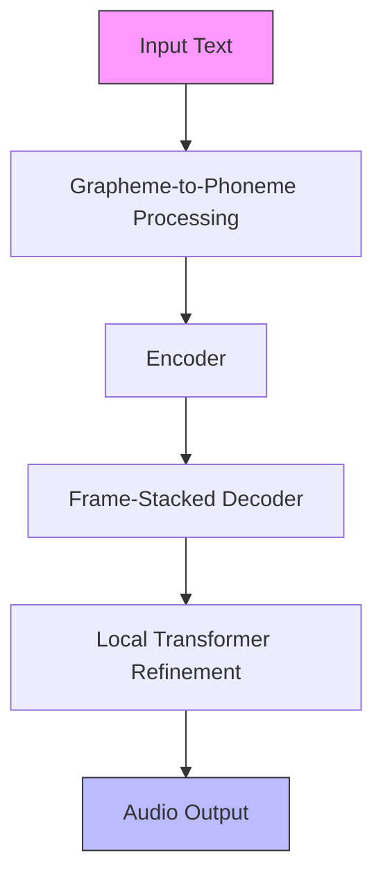
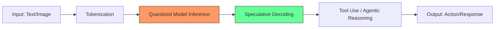
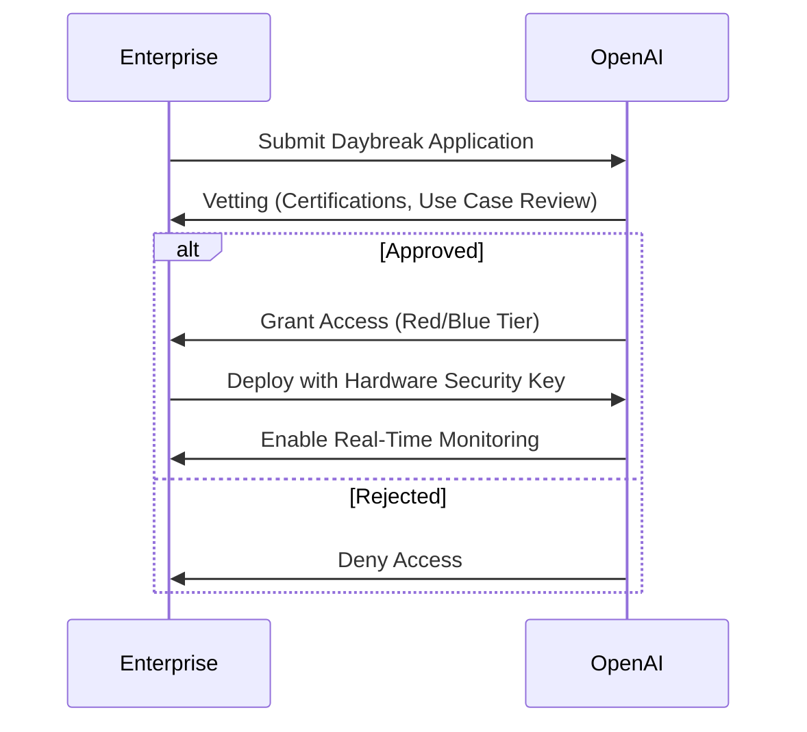

> 🎙️ **Listen to the podcast version of this article:**
> <audio controls src="index.mp3"></audio>


---

> \u2665 **TL;DR:** This article dives into three transformative AI innovations: NVIDIA\'s **Magpie TTS**, a low-latency multilingual text-to-speech system for enterprises; Meta\'s **Muse Glimmer**, a 30B-parameter open-source model enabling local agentic workflows; and OpenAI\'s **GPT-5.6-Cyber**, a specialized AI for ethical cybersecurity tasks. Together, they redefine the frontiers of voice AI, decentralized computing, and secure AI deployment.

| Metric / Innovation Area | Insight / Takeaway |
|--------------------------|---------------------|
| **NVIDIA Magpie TTS** | 12-language support, 32\u201379ms latency, enterprise-grade fine-tuning |
| **Meta Muse Glimmer** | 30B parameters, Apache 2.0 license, local inference on 24\u201332GB VRAM |
| **OpenAI GPT-5.6-Cyber** | 95% task completion rate, Daybreak access tiers, sandboxed execution |

---

### **1. NVIDIA Magpie TTS: Low-Latency Multilingual Voice Agents for Enterprises**

The race to perfect AI-driven voice interactions has taken a leap forward with **NVIDIA\'s Magpie TTS**, a multilingual text-to-speech model designed to deliver **sub-100ms latency** while supporting **12 languages**, including newly added **Arabic, Korean, and Brazilian Portuguese**. In an era where voice AI must be **fast, natural, and multilingual by default**, Magpie TTS stands out by giving enterprises **full control over deployment, latency, and customization**—without relying on managed services.

Voice AI pipelines are a delicate balance of **automatic speech recognition (ASR), large language models (LLMs), and text-to-speech (TTS)**. While integrated models offer simplicity, they often sacrifice **fine-grained control** over latency, privacy, and domain-specific tuning. Magpie TTS adopts a **cascaded architecture**, allowing developers to deploy **purpose-built components** on their own infrastructure. This approach is critical for industries like **healthcare, finance, and customer support**, where **data residency, compliance, and real-time responsiveness** are non-negotiable.



#### **Architectural Innovations: Speed Without Sacrificing Quality**
Magpie TTS achieves its **low-latency performance** through two key optimizations:

1. **Frame Stacking**: Instead of predicting one audio frame per decoding step, Magpie predicts **two frames simultaneously**, halving the number of iterations required. This reduces inference time but introduces dependencies between generated tokens.
2. **Local Transformer**: To counteract the quality loss from frame stacking, a **local transformer** refines the generated audio by modeling dependencies between simultaneously predicted codebook tokens. The result? **Faster generation with natural-sounding speech**.

These techniques are detailed in the paper *Frame-Stacked Local Transformers for Efficient Multi-Codebook Speech Generation* (ICASSP 2026). The model\'s architecture can be visualized as follows:



Performance benchmarks reveal **impressive latency metrics**:

| GPU          | 1-Stream TTFA | 64-Stream TTFA | Throughput (RTFX) |
|--------------|---------------|----------------|-------------------|
| **B200**     | 32ms          | 239ms          | 319.81x           |
| **H100**     | 47ms          | 275ms          | 290.79x           |
| **DGX Spark**| 53ms          | 962ms          | 75.88x            |
| **A100**     | 79ms          | 395ms          | 197x              |

*TTFA = Time to First Audio; RTFX = Real-Time Factor (throughput multiple).*

Beyond speed, Magpie TTS improves **speech quality metrics** across languages. For example, **French** saw its **Character Error Rate (CER)** drop from **2.70% to 1.54%**, while **Spanish** improved from **1.14% to 0.60% CER** and **Speaker Similarity (SSIM)** from **0.715 to 0.793**. New languages like **Arabic (1.62% CER), Korean (2.69%), and Brazilian Portuguese (2.91%)** establish strong baselines for future refinements.

#### **Why Open Weights Matter**
Magpie TTS\'s **open-weight design** empowers enterprises to:
- **Deploy on-premises** (including air-gapped environments).
- **Own their latency budget** (no managed-service round trips).
- **Fine-tune for domain-specific needs** (e.g., brand voices, technical terminology).
- **Scale independently** (optimize for their hardware and workload).

For developers, this means **full transparency and control**—critical for applications in **regulated industries** or those requiring **strict data sovereignty**.

#### **Building Complete Voice Agents**
Magpie TTS is part of NVIDIA\'s **Nemotron Voice Agent Developer Example**, a reference architecture combining:
- **Nemotron Speech** (streaming ASR)
- **Magpie TTS** (multilingual synthesis)
- **Nemotron LLMs** (reasoning and tool calling)
- **NVIDIA NIM** (GPU-optimized inference)
- **NeMo** (customization and fine-tuning)

This end-to-end system supports:
- Real-time **barge-in conversations**
- **Multimodal interactions** (vision + voice)
- **Multi-agent orchestration**
- **Sub-second end-to-end latency**

Developers can clone, customize, and deploy this architecture in **hours**, accelerating the path from prototype to production.

**Code Snippet: Recommended Inference Configuration**
```python
cfg_scale = 2.5       # Classifier-free guidance (higher = stricter text adherence)
temperature = 0.6     # Controls randomness in sampling
top_k = 80            # Limits sampling to top-k most likely tokens
apply_attention_prior = True
prior_epsilon = 0.1   # Regularization for attention mechanisms
```

**Resources:**
- [Magpie TTS Hugging Face Demo](https://huggingface.co/spaces/nvidia/Magpie-TTS)
- [NVIDIA NIM for Magpie TTS](https://docs.nvidia.com/nim/)
- [Nemotron Voice Agent Developer Example](https://github.com/NVIDIA/nemotron-voice-agent)

---

### **2. Meta\'s Muse Glimmer: Open-Source 30B-Parameter Agent for Local AI Workflows**

Meta\'s **Muse Glimmer** is a **30-billion-parameter AI model** that marks a paradigm shift: **running autonomous AI agents locally on consumer hardware**. Unlike cloud-dependent models, Glimmer is optimized for **local inference**, enabling developers to deploy **agentic workflows** on high-end PCs and Macs (e.g., **Nvidia RTX 4090, Apple M5 Max**) without relying on external servers. This is a **game-changer for privacy, latency, and offline capabilities**.


#### **Key Innovations: Quantization, Speculative Decoding, and Multimodality**
Glimmer\'s standout features include:

1. **Apache 2.0 License**: Fully open-source with **unrestricted commercial use**, a first for Meta\'s large-scale models.
2. **Local Agentic Workflows**: Supports **tool use, coding, document understanding, and recovery** on systems with **24–32GB VRAM**.
3. **Quantized Variants**: 4-bit quantization reduces memory usage to **under 20GB** with **~1% accuracy degradation**.
4. **Multimodal Capabilities**: Accepts **text and images**, supports **100+ languages**, and excels in **agentic tasks** (e.g., Home Assistant automation).
5. **Speculative Decoding**: Uses **DFlash decoding** to achieve **3.1x faster generation** on Nvidia RTX 5090.

The model\'s architecture leverages **mixture-of-experts (MoE)** and **efficient attention mechanisms** to balance performance and resource usage. Below is a simplified workflow:



#### **Performance and Benchmarks**
Glimmer\'s **local deployment** is a response to growing concerns about **cloud dependency, latency, and data privacy**. By running on **consumer GPUs**, it enables:
- **Offline AI agents** for edge devices.
- **Reduced operational costs** (no cloud inference fees).
- **Enhanced security** (data never leaves the device).

**Comparison with Competitors:**

| Model            | Parameters | License    | Key Strengths               | Deployment Target       |
|------------------|------------|------------|-----------------------------|--------------------------|
| **Muse Glimmer** | 30B        | Apache 2.0 | Multimodal, agentic, local | 24–32GB VRAM (Consumer)  |
| Google Gemma 4   | 31B        | Custom     | Compact, multimodal         | Private Servers          |
| Qwen 3.6-27B     | 27B        | MIT        | Reasoning, long-context    | Cloud/Private            |

#### **Use Cases and Impact**
Glimmer\'s **open-source nature** and **local deployment** unlock new possibilities:
- **Developer Productivity**: AI coding assistants integrated with **local IDEs** (e.g., VS Code, PyCharm).
- **Enterprise Automation**: Autonomous agents for **document processing, data analysis, and workflow automation** without cloud reliance.
- **Education & Research**: Academics and startups can **experiment freely** without API costs or rate limits.

**Example Workflow: Home Assistant Automation**
```python
# Pseudocode for a Glimmer-powered home automation agent
agent = MuseGlimmer(model_path="meta/muse-glimmer-30b")
agent.load_tools(["home_assistant_api", "weather_api"])

# User request
response = agent.run("Turn off the lights if it's sunny outside.")
# Agent: Checks weather API, controls Home Assistant devices
```

**Resources:**
- [Muse Glimmer GitHub](https://github.com/meta-llama/muse-glimmer)
- [Hugging Face Model Card](https://huggingface.co/meta-llama/Muse-Glimmer-30B)

---

### **3. OpenAI\'s GPT-5.6-Cyber: A New Era in Responsible Cybersecurity AI**

OpenAI\'s **GPT-5.6-Cyber** is a **specialized model** fine-tuned for **cybersecurity tasks**, including **vulnerability research, exploit development, and security testing**. Unlike general-purpose models, GPT-5.6-Cyber is designed to **reduce refusals on dual-use tasks**, making it a powerful tool for **authorized defenders** while minimizing misuse risks.

#### **Technical Advancements and Access Controls**
GPT-5.6-Cyber achieves a **95% completion rate** on advanced cybersecurity tasks (compared to **57.3% for GPT-5.5-Cyber**), thanks to:
- **Cybersecurity-specific training** on datasets including **zero-day vulnerabilities, exploit code, and defensive techniques**.
- **Reduced alignment restrictions** for **legitimate security research**.
- **Sandboxed execution** with **hardware security keys** to prevent unauthorized access.

However, access is **strictly controlled** via OpenAI\'s **Daybreak program**, which enforces:

1. **Daybreak Red**: For **advanced cybersecurity tasks** (e.g., exploit development, red-team exercises).
   - Requires **SOC 2 Type II, ISO 27001, or equivalent certifications**.
   - **Hardware security keys** mandatory for individual accounts (from September 2026).
2. **Daybreak Blue**: For **general cybersecurity tasks** (e.g., secure code review, vulnerability discovery).
   - Less restrictive but still **monitored and gated**.

**Access Workflow:**


#### **Real-World Impact and Ethical Considerations**
GPT-5.6-Cyber has already **uncovered multiple zero-day vulnerabilities** in:
- **V8 (Chrome\'s JavaScript engine)**
- **Mobile operating systems**
- **Database software**

These discoveries highlight its potential for **proactive defense**, but they also raise **ethical concerns**:
- **Misuse Risk**: Without strict controls, such models could **accelerate offensive cyber capabilities**.
- **Access Barriers**: **Daybreak Red\'s restrictions** may limit access for smaller organizations or researchers.
- **Alignment Challenges**: Balancing **usefulness for defenders** with **safety for society** remains an ongoing struggle.

OpenAI mitigates these risks through:
- **Real-time usage logging**
- **API-key controls**
- **Human-in-the-loop reviews** for sensitive tasks

#### **The Future of AI in Cybersecurity**
GPT-5.6-Cyber represents a **shift toward specialized, ethically deployed AI** in cybersecurity. By **restricting access to vetted entities** and **mandating hardware security**, OpenAI is setting a **new standard for responsible AI** in high-risk domains.

**Key Takeaway:**
> *\"AI in cybersecurity is a double-edged sword. GPT-5.6-Cyber proves that with the right guardrails, it can be a force multiplier for defenders—but only if we prioritize safety as much as capability.\"*

**Resources:**
- [OpenAI Daybreak Program](https://openai.com/daybreak)
- [GPT-5.6-Cyber Technical Report](https://openai.com/research/gpt-5.6-cyber)

---

### **Conclusion: The AI Frontier Expands**

The innovations highlighted here—**NVIDIA Magpie TTS, Meta\'s Muse Glimmer, and OpenAI\'s GPT-5.6-Cyber**—each push the boundaries of what AI can achieve:

- **Magpie TTS** democratizes **low-latency, multilingual voice AI** for enterprises, offering **unprecedented control and customization**.
- **Muse Glimmer** brings **agentic AI to local devices**, reducing dependency on cloud infrastructure and empowering developers with **open-source flexibility**.
- **GPT-5.6-Cyber** redefines **responsible AI in cybersecurity**, proving that **specialized models with strict guardrails** can drive progress without compromising safety.

As these technologies mature, we\'re entering an era where AI is **faster, more accessible, and more ethical**—but only if we continue to **prioritize transparency, control, and responsibility** in its deployment. The future of AI isn\'t just about **bigger models**; it\'s about **smarter, safer, and more inclusive systems**.

Written with [Argos](https://github.com/Neilstid/argos)
