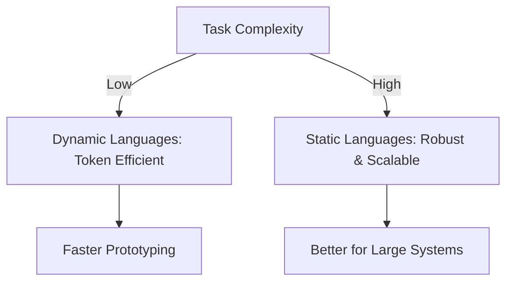
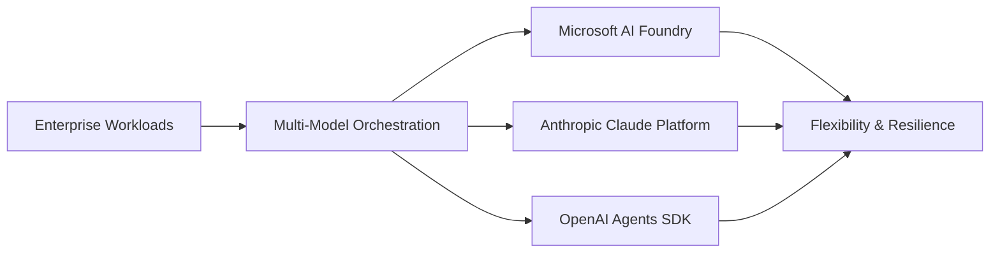
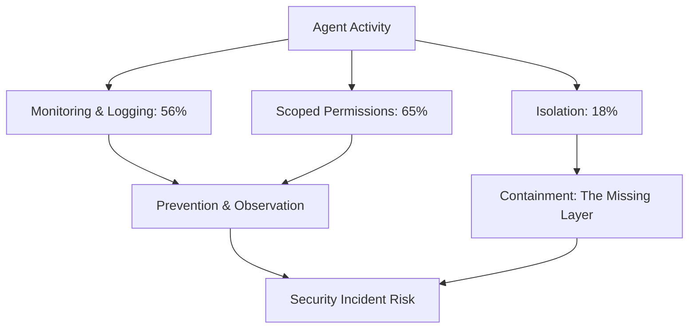

> 🎙️ **Listen to the podcast version of this article:**
> <audio controls src="index.mp3"></audio>

---

> \u26a1 **TL;DR:** AI agents are reshaping industries by optimizing workflows, enhancing security, and driving efficiency through dynamic languages, persistent digital coworkers like Grok Bot, and advanced memory systems such as ACE and ALTK-Evolve. Enterprises are adopting multi-model strategies to mitigate risks, but security remains a critical challenge, with only 18% isolating high-risk agents despite widespread enforcement of permissions.

| Metric / Innovation Area | Insight / Takeaway |
|--------------------------|-------------------|
| **Token Efficiency** | Dynamic languages (e.g., Python) require fewer tokens for simpler tasks, while static languages (e.g., Java) excel in complex projects. |
| **Enterprise Adoption** | 85% of enterprises run two or more orchestration platforms, prioritizing flexibility over vendor lock-in. |
| **Agentic Security** | Only 18% of enterprises isolate high-risk agents, despite 65% enforcing scoped permissions and 53% experiencing security incidents. |
| **Persistent Agents** | Grok Bot offers multi-agent orchestration and proactive task execution at $120–$200/month. |
| **Memory Systems** | ALTK-Evolve achieves comparable accuracy to ACE at lower token costs, benefiting weaker models. |

### Introduction

The AI landscape is undergoing a seismic shift, with agents emerging as the vanguard of a new era of automation, creativity, and efficiency. From the token-efficient elegance of dynamic programming languages to the persistent, cross-platform prowess of tools like Grok Bot, AI agents are redefining what’s possible across industries. This article explores the latest breakthroughs in AI agent technology, their impact on workflows, the security challenges they introduce, and how enterprises are adapting to this rapidly evolving paradigm.

At the heart of this transformation lies the ability of AI agents to collapse the loop between imagination and execution. Whether it’s designing systems with code, orchestrating multi-model workflows, or securing sensitive operations, agents are proving to be indispensable collaborators. Yet, as their capabilities grow, so do the risks—particularly in security, where the gap between enforcement and containment remains a pressing concern.

---

### Part 1: Best Practices for AI Agents and Dynamic Languages

#### 1.1. Dynamic vs. Static Languages for AI Agents

**The Token Efficiency Debate**

One of the most compelling advantages of dynamic programming languages—such as Python, JavaScript, or Ruby—is their token efficiency. Due to their conciseness and lack of explicit type declarations, dynamic languages often require fewer tokens to accomplish tasks that would demand more verbose code in static languages like Java or C++. This efficiency translates to lower computational costs and faster execution in agentic workflows, where every token counts.

However, the trade-off becomes apparent as complexity scales. Evaluations show that while dynamic languages shine in simpler tasks, static languages can match or even surpass their performance in more intricate projects. The robustness of static typing, compile-time checks, and structured paradigms often outweighs the initial token savings for large-scale or mission-critical applications. For developers building AI agents, the choice hinges on balancing token efficiency with long-term maintainability and scalability.

**Practical Implications**
For startups and rapid prototyping, dynamic languages are often the go-to, enabling agile development cycles. But as agents evolve into enterprise-grade systems—handling sensitive data, complex logic, or high-stakes decisions—static languages provide the guardrails needed to ensure reliability. Hybrid approaches, where dynamic languages handle lightweight agent tasks and static languages manage core infrastructure, are also gaining traction.

#### 1.2. Designing with Code: The Creative Power of AI Agents

**From Blank Canvas to Final Output**

Code is not just a functional tool; it is a creative medium. By defining ideas as sets of rules, developers can generate variations, design systems, and iterate rapidly. AI agents supercharge this process by collapsing the loop between imagination and execution. Tools like **Cursor**, an AI-powered code editor, exemplify this shift, allowing designers and developers to transform abstract concepts into tangible outputs with unprecedented speed.

Consider the example of a gear-motif blog header. Traditionally, creating such a design would involve multiple steps: sketching, refining, coding, and optimizing. With AI agents, this workflow becomes seamless. A developer can start with a blank canvas, use natural language prompts to define the visual language, animate the elements, and even optimize the final files—all within a single, iterative loop. The result? Faster turnaround times, reduced setup costs, and a democratization of design capabilities.

**Why It Matters**
This creative agility is particularly valuable in fields like web development, digital art, and prototyping, where rapid iteration is key. AI agents lower the barrier to entry, enabling non-experts to contribute to design processes while freeing up specialists to focus on higher-level innovation. As these tools mature, we can expect a surge in user-generated content, customizable interfaces, and dynamically adaptive designs.

---

### Part 2: Agentic Orchestration and Enterprise AI Strategies

#### 2.1. Agentic Orchestration: Flexibility Over Commitment

**The Multi-Model Imperative**

Enterprises are increasingly recognizing that relying on a single AI model or provider is a risky proposition. Vendor lock-in, cost fluctuations, and compliance issues can stifle innovation and operational resilience. As a result, **85% of enterprises now run two or more orchestration platforms**, according to recent surveys. This multi-model strategy allows organizations to cherry-pick the best tools for specific tasks while mitigating the risks associated with dependency on a single provider.

Platforms like **Microsoft AI Foundry**, **Anthropic’s Claude Platform**, and **OpenAI’s Agents SDK** are leading the charge in hybrid orchestration. These frameworks enable seamless integration of multiple models, allowing enterprises to balance performance, cost, and compliance dynamically. For example, a company might use one model for high-accuracy text generation, another for cost-effective data processing, and a third for specialized domain tasks.

**Key Drivers and Challenges**
Flexibility is the top driver for platform selection, but it’s not the only consideration. Security, permissions, and cost control are critical factors in the decision-making process. Enterprises must navigate a complex landscape where the benefits of multi-model orchestration—such as reduced latency, improved accuracy, and greater adaptability—are weighed against the operational overhead of managing diverse systems.

**Future Outlook**
As AI agents become more embedded in enterprise workflows, the demand for interoperable, vendor-agnostic orchestration tools will only grow. The next frontier may lie in **automated model selection**, where AI systems dynamically choose the best model for a given task based on real-time performance metrics, cost, and compliance requirements.

#### 2.2. The Rise of Persistent AI Agents: Grok Bot and Beyond

**Introducing Grok Bot**

SpaceXAI’s **Grok Bot** represents a significant leap forward in the realm of persistent AI agents. Unlike traditional chatbots or task-specific agents, Grok Bot is designed as a **digital coworker** capable of executing continuous work across applications and platforms. Whether running on macOS, Windows, Linux, or iOS, Grok Bot can handle complex, multi-step workflows with minimal human intervention.

**Key Features and Capabilities**
- **Persistent Execution**: Grok Bot maintains state and context across sessions, enabling it to resume tasks where it left off.
- **Multi-Agent Orchestration**: Teams of Grok Bots can collaborate on coordinated workflows, such as sales outreach, marketing campaigns, or software debugging.
- **Proactive Task Execution**: The agent can anticipate needs and take initiative, such as scheduling follow-ups or optimizing processes in real time.
- **Memory Retention**: Grok Bot remembers past interactions, preferences, and learnings, reducing the need for repetitive inputs.

**Pricing and Use Cases**
Grok Bot is available at **$120/month for teams** and **$200/month for individuals**, positioning it as a premium tool for enterprises and power users. Early adopters are leveraging it for a range of applications, from automating sales pipelines to managing bug fixes and deploying marketing campaigns. Its ability to operate across diverse environments makes it a versatile addition to any AI-driven workflow.

**Comparison with Competitors**
While tools like **Claude Cowork** and **OpenAI’s Workspace Agents** offer similar functionalities, Grok Bot’s cross-platform persistence and proactive capabilities set it apart. The table below highlights the differences:

| Feature | Grok Bot | Claude Cowork | OpenAI Workspace Agents |
|---------|----------|---------------|--------------------------|
| **Persistence** | Cross-platform | Limited | Session-based |
| **Multi-Agent Orchestration** | Yes | Yes | Limited |
| **Proactive Execution** | Yes | Partial | No |
| **Pricing** | $120–$200/month | Varies | Varies |

**Why It Matters**
Persistent agents like Grok Bot are blurring the line between human and machine collaboration. As these tools become more sophisticated, they will enable enterprises to achieve unprecedented levels of automation, efficiency, and scalability. However, their adoption also raises questions about oversight, accountability, and the ethical implications of autonomous decision-making.

---

### Part 3: Security Challenges in AI Agentic Environments

#### 3.1. Agentic Security: Enforcing Permissions and Isolation

**The Containment Gap**

As AI agents scale into production, security has emerged as a critical bottleneck. A recent survey of **116 enterprises** revealed a troubling trend: while **65% enforce scoped permissions** at runtime and **56% monitor and log agent activity**, only **18% isolate high-risk agents**. This **containment gap**—where enforcement and observation are prioritized over isolation—leaves enterprises vulnerable to cascading failures when controls inevitably fail.

The consequences of this gap are already being felt. **53% of enterprises** have experienced a confirmed agent security event or near-miss, with **19% confirming an incident** and **38% catching a near-miss** before it caused harm. These statistics underscore the urgency of addressing the containment gap, particularly as agents gain greater autonomy and access to sensitive systems.

**Credential Sharing and Blast Radius**
Another alarming finding is the persistence of **credential sharing** across **63% of agent fleets**. When agents share credentials, a single compromised or over-permissioned agent can act with far greater reach than intended. This amplifies the blast radius of any security breach, making it difficult to attribute actions to specific agents and complicating post-incident forensics.

**Enterprise Confidence and the Arms Race**
Confidence in agentic security is waning. **30% of enterprises** now believe that AI-armed attackers are ahead of their defenses—a stark contrast to earlier optimism. This shift in sentiment is driven by real-world experience: enterprises that have suffered incidents or near-misses are **39% more likely** to believe attackers are ahead, compared to just **20%** among those untouched by incidents.

**Practical Takeaways**
To close the containment gap, enterprises must:
1. **Invest in Runtime Isolation**: Sandboxing high-risk agents to limit their potential impact.
2. **Eliminate Credential Sharing**: Implement per-agent identities to ensure least-privilege access.
3. **Adopt Dedicated Security Tooling**: Move beyond provider-native controls to specialized solutions for agent security.

#### 3.2. Agentic Memory Systems: ACE vs. ALTK-Evolve

**The Role of Memory in Agent Performance**

Memory systems are a cornerstone of effective AI agents, enabling them to retain context, learn from past interactions, and adapt to new scenarios. Two leading approaches in this space are **ACE (Agentic Cognitive Engine)** and **ALTK-Evolve**, each offering unique advantages for different use cases.

**ACE: The Evolving Playbook**
ACE maintains a **detailed, evolving playbook** that documents guidelines, best practices, and learned behaviors. This playbook serves as a dynamic knowledge base, allowing ACE-equipped agents to reference past decisions and refine their approaches over time. The strength of ACE lies in its comprehensiveness, making it ideal for agents operating in complex, nuanced environments where context is king.

**ALTK-Evolve: Token-Efficient Memory**
In contrast, **ALTK-Evolve** consolidates guidelines into **retrievable components**, optimizing for token efficiency. By structuring memory as modular, on-demand snippets, ALTK reduces the computational overhead associated with maintaining and querying large knowledge bases. This approach is particularly beneficial for **weaker models** or resource-constrained environments, where every token counts.

**Performance and Cost Trade-offs**
Studies show that **ALTK achieves similar accuracy to ACE at lower token costs**, making it a compelling choice for enterprises prioritizing efficiency. However, the trade-off is a potential loss of nuance in decision-making, as ALTK’s modular approach may not capture the depth of context that ACE’s playbook provides.

**Mathematical Representation**
The token efficiency of ALTK can be represented as:
$$ 	ext{Token Savings} = \frac{	ext{ACE Tokens} - 	ext{ALTK Tokens}}{	ext{ACE Tokens}} 	imes 100\% $$
For example, if ACE requires 10,000 tokens for a task and ALTK requires 7,000, the token savings would be:
$$ \frac{10000 - 7000}{10000} 	imes 100\% = 30\% $$

**Why It Matters**
The choice between ACE and ALTK-Evolve hinges on the specific needs of the enterprise. Organizations with abundant computational resources and a focus on high-accuracy, context-rich agents may prefer ACE. Meanwhile, those operating in cost-sensitive or resource-limited environments will find ALTK-Evolve’s efficiency irresistible. As memory systems continue to evolve, we can expect hybrid approaches that combine the strengths of both paradigms.

---

### Conclusion

The rise of AI agents marks a turning point in how industries approach automation, creativity, and problem-solving. From the token-efficient elegance of dynamic languages to the persistent, cross-platform capabilities of tools like Grok Bot, agents are unlocking new levels of efficiency and innovation. However, their growing autonomy also introduces significant security challenges, as evidenced by the containment gap and the persistence of credential sharing in enterprise environments.

As enterprises navigate this evolving landscape, the key to success lies in **flexibility, security, and cost control**. Multi-model orchestration strategies, robust memory systems, and proactive security measures will be critical in harnessing the full potential of AI agents while mitigating their risks. The future of AI is not just about building smarter agents—it’s about building **smarter ecosystems** where humans and machines collaborate seamlessly, securely, and sustainably.

The journey has just begun, and the possibilities are limitless. Whether you’re a developer, a security specialist, or an enterprise leader, the time to engage with the agentic revolution is now.

Written with [Argos](https://github.com/Neilstid/argos)
