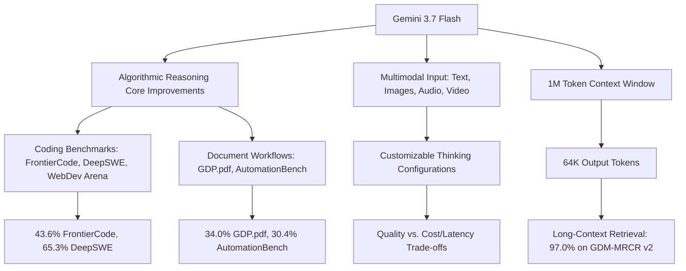
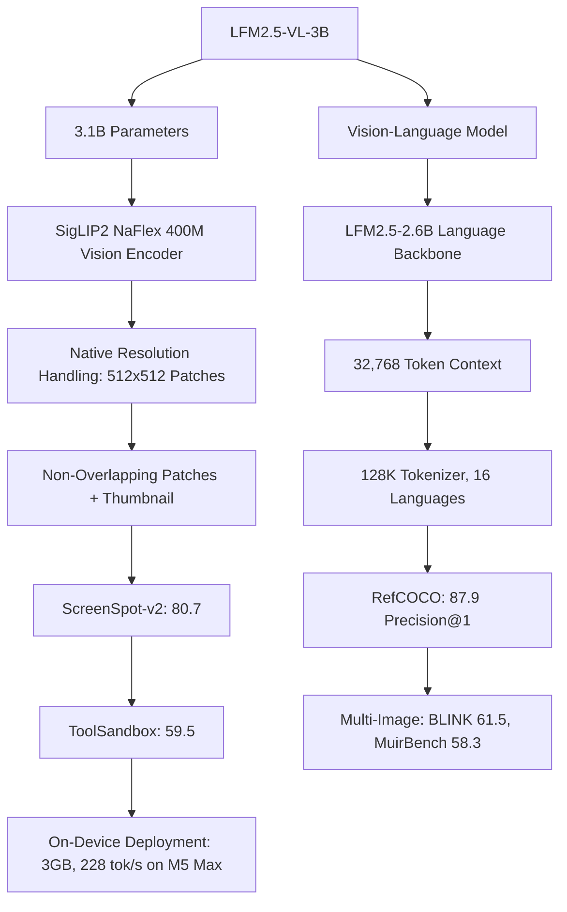
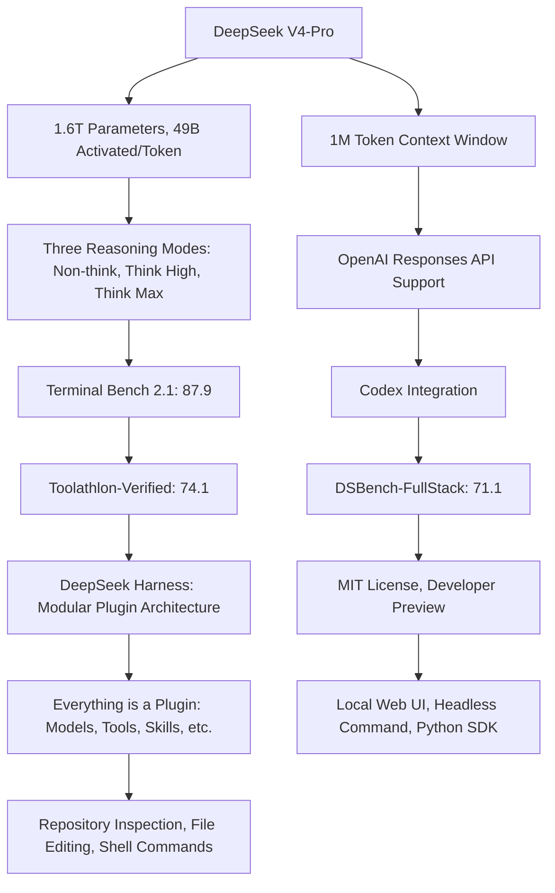

> 🎙️ **Listen to the podcast version of this article:**
> <audio controls src="index.mp3"></audio>

---

> 💡 **TL;DR:** This week marks a pivotal moment in AI with three major releases: Google’s **Gemini 3.7 Flash** delivers cutting-edge coding and agent capabilities at a disruptive price point ($0.75/$3.75 per 1M tokens), **Liquid AI’s LFM2.5-VL-3B** introduces a 3.1B-parameter vision-language model optimized for on-device deployment with 228 tokens/s on Apple M5 Max, and **DeepSeek’s Harness + V4-Pro** offers an open-source, modular agent framework paired with a reasoning-optimized model. These innovations collectively push the boundaries of cost, deployment flexibility, and agentic workflows.

| Metric / Innovation Area | Insight / Takeaway |
|-------------------------|---------------------|
| **Gemini 3.7 Flash Pricing** | $0.75/$3.75 per 1M tokens (introductory until Dec 2026), ~3x cheaper than Claude Sonnet 5 or GPT-5.6 Terra |
| **Coding Benchmarks (Gemini 3.7 Flash)** | 43.6% on FrontierCode 1.1, 65.3% on DeepSWE v1.1, 1588 Elo on WebDev Arena |
| **LFM2.5-VL-3B Performance** | 80.7 on ScreenSpot-v2, 87.9 on RefCOCO grounding (30-point improvement), 59.5 on ToolSandbox |
| **LFM2.5-VL-3B Efficiency** | 3GB footprint, 228 tokens/s on Apple M5 Max, 20 tokens/s on Galaxy S26 Ultra |
| **DeepSeek V4-Pro Context** | 1M token context window, 3 reasoning modes (Non-think, Think High, Think Max) |
| **DeepSeek Harness** | MIT-licensed, modular plugin architecture for agent workflows (file editing, shell access, tool calling) |

### 1. Google Gemini 3.7 Flash: Coding and Agent Model Redefinition

Google’s rapid iteration in the AI space continues with **Gemini 3.7 Flash**, a refinement of its predecessor, **Gemini 3.6 Flash**, released just three weeks prior. This model is not a ground-up retraining but an **algorithmic enhancement** to its reasoning core, designed to excel in software engineering, document-heavy knowledge work, and web development. The most compelling argument for adoption? **Pricing.**

At **$0.75 per 1M input tokens and $3.75 per 1M output tokens** (introductory until December 31, 2026), Gemini 3.7 Flash undercuts competitors like Claude Sonnet 5 ($2.00/$10.00) and GPT-5.6 Terra ($2.00/$12.00) by a significant margin. For teams running high-volume agent workloads, this translates to a **blended cost of ~$1.35 per 1M tokens** (assuming an 80/20 input-output mix), compared to $3.60 for Sonnet 5 and $4.00 for GPT-5.6 Terra. The economic advantage is undeniable, but the model’s performance gains are equally noteworthy.

#### **Benchmark Dominance and Use Cases**
Gemini 3.7 Flash demonstrates **substantial improvements** in coding and document comprehension benchmarks:
- **FrontierCode 1.1 Main:** 43.6% (vs. 34.4% for 3.6 Flash)
- **DeepSWE v1.1:** 65.3% (vs. 48.6% for 3.6 Flash)
- **WebDev Arena:** 1588 Elo (vs. 1538 for 3.6 Flash)
- **GDP.pdf (PDF comprehension):** 34.0% (vs. 22.0% for 3.6 Flash)
- **AutomationBench (enterprise workflows):** 30.4% (ahead of Claude Sonnet 5 at 10.7% and GPT-5.6 Terra at 23.6%)

However, **GPT-5.6 Terra still leads** in terminal and computer-use agent tasks (e.g., Terminal-bench 2.1 at 87.4%, OSWorld-2.0 at 50.2%). A minor regression in **CharXiv Reasoning** (84.5% vs. 85.2% for 3.6 Flash) is also noted.

#### **Deployment and Accessibility**
Gemini 3.7 Flash is **API and enterprise-only**, with no open weights available. Access is provided through:
- **Hosted surfaces:** Gemini API, Google AI Studio, Android Studio, Gemini Enterprise Agent Platform
- **Consumer access:** Gemini Spark on Google AI Pro and Ultra plans

This makes it ideal for **startups, mid-market teams, and regulated enterprises** (via Gemini Enterprise), though organizations with **data-residency or air-gap requirements** are out of luck—self-hosting is not an option.

#### **Why It Matters**
Google’s aggressive pricing and performance improvements position Gemini 3.7 Flash as a **cost-effective alternative** for long-running coding agents, document automation, and UI generation. The model’s **multimodal capabilities** (text, images, audio, video) and **customizable thinking configurations** (trading quality for cost/latency) further enhance its versatility. For developers and enterprises, this release is a **game-changer** in balancing intelligence and affordability.

---

### 2. Liquid AI LFM2.5-VL-3B: Vision-Language Model for On-Device Deployment

Liquid AI’s **LFM2.5-VL-3B** is a **3.1B-parameter vision-language model** purpose-built for **on-device deployment**, offering a rare combination of **performance, efficiency, and privacy**. With a **3GB memory footprint** and **228 tokens/s decoding speed on Apple M5 Max**, this model is optimized for edge AI applications where latency and data locality are critical.

#### **Performance Breakthroughs**
LFM2.5-VL-3B delivers **state-of-the-art results** for its size class:
- **ScreenSpot-v2:** 80.7 average score (desktop: 78.7, mobile: 81.2, web: 82.2), outperforming **Gemma-4-E4B (51.2)** and rivaling **Qwen3.5-4B (78.5)** and **InternVL-3.5-4B (84.1)**.
- **RefCOCO Grounding:** Precision@1 improves from **57.1 to 87.9** (a **30-point gain**), driven by scaled synthetic grounding data.
- **ToolSandbox (Function Calling):** Scores jump from **26.4 to 59.5**, showcasing its new **tool-use capabilities** via Pythonic function calls.
- **Multi-Image Input:** BLINK improves from **50.2 to 61.5**, and MuirBench from **34.9 to 58.3**.

Across **28 vision benchmarks**, LFM2.5-VL-3B averages **69.4**, matching **InternVL-3.5-4B (69.4)** and trailing **Qwen3.5-4B (70.1)** by just 0.7 points—despite being **~1.6B parameters smaller**.

#### **Architecture and Training**
The model’s **language backbone** is **LFM2.5-2.6B**, paired with a **SigLIP2 NaFlex shape-optimized 400M vision encoder**. Key innovations include:
- **Native Resolution Handling:** Splits large images into **non-overlapping 512×512 patches** + a resized thumbnail.
- **Context Length:** 32,768 tokens.
- **Multilingual Support:** 16 languages, with an **expanded 128K tokenizer** for better non-Latin script coverage.
- **Training Data:** ~34T tokens (4× scaling in vision pre-training with curated/synthetic data).
- **Post-Training:** Supervised Fine-Tuning (SFT) with knowledge distillation, **Antidoom training**, and multi-reward reinforcement learning.

#### **Deployment and Licensing**
LFM2.5-VL-3B is **highly deployable**, with checkpoints available in **native, GGUF, ONNX, and MLX formats**. Supported runtimes include **llama.cpp, MLX, vLLM, SGLang, and ONNX**.

The **LFM Open License v1.0** (Apache-2.0-based) allows **free commercial use** for companies with **< $10M annual revenue**. Enterprises above this threshold must negotiate a license. **Research, education, and non-profits** face no revenue restrictions.

#### **Why It Matters**
This model **democratizes vision-language AI for edge devices**, enabling applications like:
- **On-device screen agents** (GUI automation, testing)
- **PDF-to-structured-text** with layout labels
- **Real-time object detection** (automotive, robotics)
- **Offline translation** (menus, road signs)
- **Multi-image comparison** (e-commerce, QA)

Its **efficiency and privacy** make it ideal for **consumer electronics, healthcare, and industrial robotics**, where cloud-based solutions may be impractical or undesirable.

---

### 3. DeepSeek Harness + V4-Pro: The Open-Source Agent Stack

DeepSeek is **expanding beyond model development** into the **agent workflow layer**, challenging established players like **Anthropic’s Claude Code** and **OpenAI’s Codex**. The release of **DeepSeek Harness (dsh)** and **V4-Pro** marks a strategic shift toward **open, modular, and developer-friendly agent systems**.

#### **DeepSeek V4-Pro: Agent-Optimized Model**
V4-Pro is a **1.6T-parameter model** (49B activated per token) with a **1M-token context window**, now **generally available** across DeepSeek’s **web interface, mobile app, and API**. Key features include:
- **Three Reasoning Modes:**
  - **Non-think:** Fast, low-latency for routine tasks.
  - **Think High:** Balanced for complex problem-solving.
  - **Think Max:** Maximum reasoning for difficult problems.
- **Native OpenAI Responses API Support:** Simplifies integration with existing tooling.
- **Codex Integration:** One-click setup for OpenAI’s open-source harness.

Benchmark highlights (company-reported):
- **Terminal Bench 2.1:** 87.9
- **Toolathlon-Verified:** 74.1
- **DSBench-FullStack:** 71.1
- **DSBench-Hard:** 67.2

Note: Some results were achieved using **DeepSeek Harness in “minimal mode”**, meaning they reflect **model + harness performance**, not just the model alone.

#### **DeepSeek Harness: The Modular Agent Framework**
Harness (dsh) is an **MIT-licensed, open-source agent framework** built on **Cordis**, with a **“everything is a plugin”** philosophy. This modularity extends to:
- **Models, Tools, Skills, Sessions, Sandboxes, Filesystems, Loops, Orchestration, UIs**

Key capabilities:
- **Repository inspection, file editing, shell commands, web search**
- **Planning, subagents, approval policies**
- **Configurable permission controls and sandboxing**
- **Multi-interface support:** Local web UI, headless command, Python SDK

Harness is currently in **developer preview**, with **breaking changes expected**. However, its **modularity** makes it a **potential game-changer** for developers who need **customizable, replaceable agent components**.

#### **Pricing Shifts: A Strategic Pivot**
DeepSeek’s API pricing is undergoing a **major revision**, introducing **peak/off-peak rates** starting **August 16, 2026 (16:00 UTC)**. The changes represent **50% to >1,100% increases** over current rates:

| Model | Old Input ($/1M) | Old Output ($/1M) | New Off-Peak Input ($/1M) | New Peak Input ($/1M) | New Off-Peak Output ($/1M) | New Peak Output ($/1M) |
|-------|------------------|-------------------|----------------------------|------------------------|-----------------------------|--------------------------|
| V4-Flash | $0.14 | $0.28 | $0.22 | $0.44 | $0.66 | $1.32 |
| V4-Pro | $0.435 | $0.87 | $0.66 | $1.32 | $1.98 | $3.96 |

For a **1M input + 1M output workload**:
- **V4-Flash:** $0.42 → **$0.88 (off-peak) / $1.76 (peak)**
- **V4-Pro:** $1.305 → **$2.64 (off-peak) / $5.28 (peak)**

While still **competitive** compared to Western labs, this shift signals that **DeepSeek’s ultra-low prices are not permanent**. Organizations must now consider **workload scheduling, caching, and self-hosting** to optimize costs.

#### **Why It Matters**
DeepSeek is **moving up the stack**, competing not just on **model intelligence** but on **agent infrastructure**. Harness’s **modularity** could make it a **de facto standard** for developers who prioritize **flexibility and openness** over vertical integration. Meanwhile, **V4-Pro’s reasoning modes** and **API standardization** (OpenAI Responses, Codex) make it easier to integrate into existing workflows.

For enterprises, the **trade-off** is clear: **Harness offers long-term flexibility**, but **API costs are rising**. The question is whether the **open-source advantage** outweighs the **hosted pricing premium**.

---

### **The Bigger Picture: Where AI Is Headed**

This week’s releases highlight **three critical trends** in AI:
1. **Cost Efficiency as a Competitive Moat:** Google’s **Gemini 3.7 Flash** and DeepSeek’s **V4-Pro** (pre-price hike) show that **intelligence-per-dollar** is becoming as important as raw performance.
2. **Edge AI and Privacy:** Liquid AI’s **LFM2.5-VL-3B** proves that **on-device deployment** is no longer a compromise—it’s a **first-class citizen** in AI, enabling **low-latency, private, and offline applications**.
3. **Open-Source Agent Stacks:** DeepSeek **Harness** challenges the **walled gardens** of Claude Code and Codex, offering developers **unprecedented control** over their agent workflows.

The future of AI is **not just about bigger models**—it’s about **smarter deployment, better economics, and more flexible tools**. This week’s innovations bring us closer to that reality.

Written with [Argos](https://github.com/Neilstid/argos)
