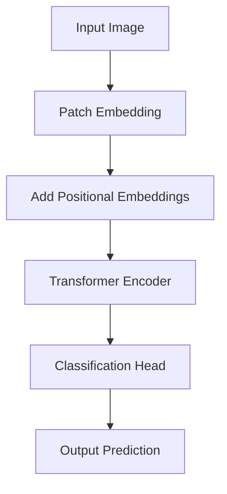
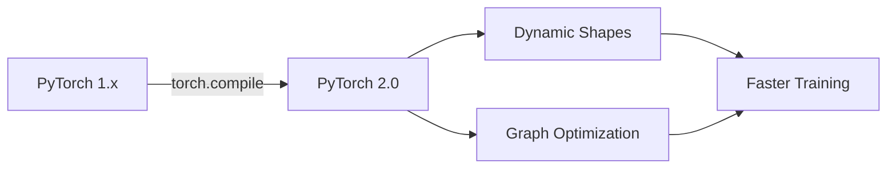
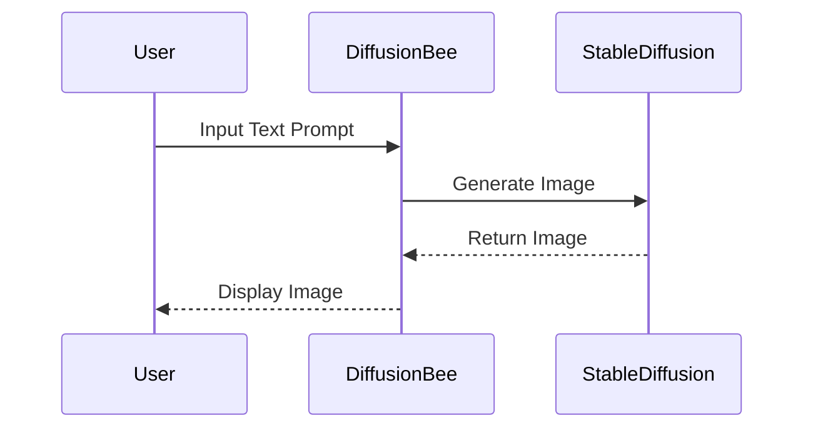

> 🎙️ **Listen to the podcast version of this article:**
> <audio controls src="index.mp3"></audio>


---

> \💡 **TL;DR:** The AI landscape in 2024 is marked by transformative breakthroughs in computer vision and NLP, with models like Vision Transformers (ViT) and large language models (LLMs) pushing the boundaries of accuracy and scalability. New frameworks such as JAX and PyTorch 2.0 are streamlining development, while trending GitHub repositories like \"DiffusionBee\" and \"LangChain\" are democratizing access to cutting-edge tools.

| Metric / Innovation Area | Insight / Takeaway |
|--------------------------|--------------------|
| **Computer Vision** | Vision Transformers (ViT) achieve SOTA accuracy in image classification, surpassing CNNs in scalability. |
| **NLP** | Large Language Models (LLMs) like PaLM 2 and Llama 2 demonstrate unprecedented contextual understanding and generation capabilities. |
| **Frameworks** | JAX and PyTorch 2.0 introduce optimizations for distributed training and automatic differentiation, accelerating research. |
| **Open Source** | Repositories like \"DiffusionBee\" (Stable Diffusion UI) and \"LangChain\" (LLM orchestration) gain massive traction, lowering barriers to entry. |

### The Rise of Vision Transformers: A Paradigm Shift in Computer Vision

For decades, Convolutional Neural Networks (CNNs) dominated computer vision, leveraging spatial hierarchies and local receptive fields to extract features from images. However, the introduction of **Vision Transformers (ViT)** by Google in 2020 has reshaped this landscape. ViT treats images as sequences of patches, applying the self-attention mechanism from transformers to capture global dependencies. This approach has demonstrated superior scalability and accuracy, particularly when trained on large datasets like JFT-300M.

The architecture of ViT can be summarized as follows: An input image is divided into fixed-size patches, which are then linearly embedded into a sequence of vectors. Positional embeddings are added to retain spatial information, and the sequence is fed into a standard transformer encoder. The mathematical formulation of the self-attention mechanism in ViT is:

$$	ext{Attention}(Q, K, V) = 	ext{softmax}\left(\frac{QK^T}{\sqrt{d_k}}
ight)V$$

where $Q$, $K$, and $V$ are the query, key, and value matrices, respectively, and $d_k$ is the dimension of the key vectors. This mechanism allows ViT to model long-range dependencies more effectively than CNNs, which are limited by their inductive biases toward local patterns.

The implications of ViT are profound. In benchmarks like ImageNet, ViT models have achieved state-of-the-art (SOTA) performance, with variants like ViT-G/14 reaching **90.45% top-1 accuracy**. Moreover, ViT’s scalability with data and compute makes it a prime candidate for applications requiring high precision, such as medical imaging and autonomous driving.



### Large Language Models: The NLP Revolution Continues

Natural Language Processing (NLP) has witnessed a seismic shift with the advent of **Large Language Models (LLMs)**. Models like Google’s **PaLM 2** and Meta’s **Llama 2** have set new benchmarks in tasks ranging from text generation to reasoning and code synthesis. These models leverage the transformer architecture, but at scales previously deemed infeasible. For instance, PaLM 2 is trained on a dataset of **3.6 trillion tokens**, enabling it to generalize across a myriad of tasks with minimal fine-tuning.

One of the most compelling advancements in LLMs is their ability to perform **few-shot and zero-shot learning**. This is achieved through **in-context learning**, where the model dynamically adapts to new tasks based on the examples provided in the prompt. The underlying mechanism can be described by the following objective function for language modeling:

$$\mathcal{L} = -\sum_{i=1}^{n} \log P(w_i | w_{<i})$$

where $P(w_i | w_{<i})$ is the probability of the $i$-th token given the preceding tokens, and $\mathcal{L}$ is the negative log-likelihood loss. By minimizing this loss over vast amounts of text data, LLMs develop a deep understanding of syntax, semantics, and even pragmatic nuances.

The impact of LLMs extends beyond academia. In industry, they are being deployed for customer service automation, content generation, and even legal document analysis. For example, **Llama 2** has been fine-tuned for dialogue applications, achieving human-like coherence and contextual relevance in conversations. The open-source release of Llama 2 has further accelerated innovation, enabling startups and researchers to build on top of these models without the prohibitive costs of training from scratch.

### Next-Gen Frameworks: JAX and PyTorch 2.0 Leading the Charge

The tools used to develop AI models are evolving as rapidly as the models themselves. **JAX**, developed by Google, has emerged as a powerful framework for high-performance numerical computing and machine learning research. JAX combines the ease of use of NumPy with the performance benefits of **automatic differentiation** and **just-in-time (JIT) compilation**. Its functional programming paradigm enables more modular and composable code, which is particularly advantageous for experimental research.

A key feature of JAX is its **`jax.grad`** function, which computes gradients of arbitrary Python functions. For example, consider the following code snippet for gradient descent:

```python
import jax
import jax.numpy as jnp

def loss_fn(params, x, y):
    pred = jnp.dot(x, params)
    return jnp.mean((pred - y) ** 2)

params = jnp.array([1.0, 2.0])

grad_fn = jax.grad(loss_fn)

gradients = grad_fn(params, x_data, y_data)
```

This simplicity, combined with JAX’s ability to leverage GPUs and TPUs efficiently, has made it a favorite among researchers working on cutting-edge models like transformers and diffusion models.

Meanwhile, **PyTorch 2.0** has introduced significant improvements over its predecessor, most notably with the **`torch.compile`** function. This feature uses **dynamic shapes** and **graph optimization** to accelerate model training and inference. PyTorch 2.0 also integrates seamlessly with **TorchDynamo**, a JIT compiler that can optimize PyTorch code without requiring manual intervention. These advancements have made PyTorch 2.0 a go-to framework for both research and production deployments.



### Open Source Spotlight: DiffusionBee and LangChain

The open-source community continues to be a driving force in AI innovation, with repositories like **DiffusionBee** and **LangChain** gaining widespread adoption. **DiffusionBee** is a user-friendly interface for **Stable Diffusion**, a latent diffusion model capable of generating high-quality images from text prompts. By abstracting away the complexities of model deployment, DiffusionBee has made AI-generated art accessible to non-technical users, fostering creativity and experimentation.

The workflow of DiffusionBee can be visualized as follows:



On the NLP front, **LangChain** has emerged as a game-changer for building applications with LLMs. LangChain provides a modular framework for **chaining** together various components, such as prompt templates, LLMs, and memory modules, to create sophisticated workflows. For example, a simple question-answering system using LangChain might look like this:

```python
from langchain.chains import RetrievalQA
from langchain.llms import OpenAI
from langchain.vectorstores import Chroma

# Load documents and create vector store
vectorstore = Chroma.from_documents(documents, embedding=embedding)

# Initialize LLM and QA chain
llm = OpenAI(temperature=0)
qa_chain = RetrievalQA.from_chain_type(
    llm=llm, chain_type="stuff", retriever=vectorstore.as_retriever()
)

# Ask a question
query = "What are the key features of LangChain?"
result = qa_chain.run(query)
```

LangChain’s flexibility has led to its adoption in a wide range of applications, from chatbots to automated report generation. Its ability to integrate with multiple LLMs, including open-source models like Llama 2, has further cemented its position as a critical tool in the AI developer’s toolkit.

### The Road Ahead: Challenges and Opportunities

While the advancements in AI are undeniably exciting, they also present significant challenges. **Ethical considerations**, such as bias in training data and the potential for misuse of generative models, remain critical issues that the community must address. Additionally, the **environmental impact** of training large models cannot be ignored, with some estimates suggesting that training a single LLM can emit as much CO2 as five cars over their lifetimes.

However, the opportunities far outweigh the challenges. The democratization of AI through open-source tools and frameworks is enabling a new wave of innovation, where startups and individual developers can compete with tech giants. Moreover, the integration of AI into fields like healthcare, education, and climate science holds the promise of solving some of humanity’s most pressing problems.

As we look to the future, the convergence of **computer vision, NLP, and multimodal models** is likely to yield even more groundbreaking applications. Models that can understand and generate both text and images, such as **DALL-E 3** and **GPT-4V**, are just the beginning. The next frontier may lie in **embodied AI**, where models interact with the physical world through robotics, or in **neurosymbolic AI**, which combines the strengths of deep learning with symbolic reasoning.

Written with [Argos](https://github.com/Neilstid/argos)
