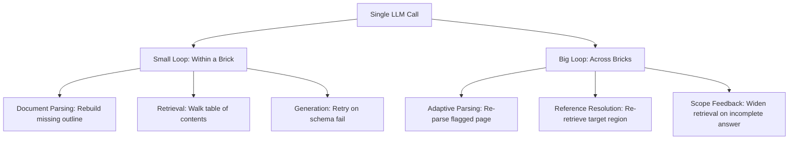
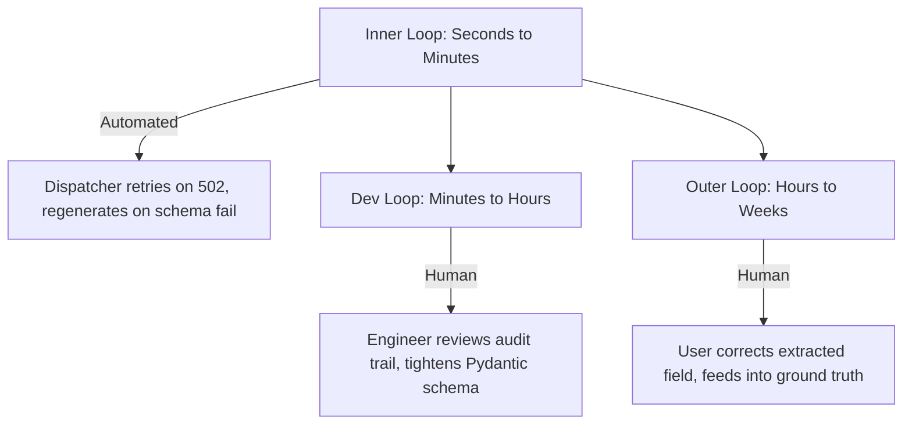

> 🎙️ **Listen to the podcast version of this article:**
> <audio controls src="index.mp3"></audio>

---

> \u2728 **TL;DR:** This week\'s AI landscape witnesses a seismic shift: Alibaba\'s Qwen3.8-27B delivers frontier-class multimodal capabilities in a locally deployable 27B-parameter model, ByteDance\'s CUDA Agent uses agentic RL to outperform compilers in GPU kernel generation, Cursor\'s Origin platform reimagines code hosting for an AI-native workflow, and loop engineering emerges as the critical discipline for robust RAG systems. Together, these innovations democratize access to cutting-edge AI, redefine performance optimization, and address the scalability challenges of agent-driven development.

| Metric / Innovation Area | Insight / Takeaway |
|-------------------------|---------------------|
| **Qwen3.8-27B Model** | 27B parameters, 262K token context, native image/video understanding; 4-bit quantization enables 17GB local deployment; benchmarks rival proprietary models like GPT-5.6 Luna and Claude Opus 4.8. |
| **CUDA Agent Performance** | 98.8% pass rate, 96.8% faster-than-torch.compile on KernelBench; 2.11\u00d7 geomean speedup; discrete milestone rewards outperform raw speedup ratios by 36.4%. |
| **Cursor Origin Adoption** | AI-native code hosting with integrated PR reviews and agent-driven changes; syncs with GitHub as source of truth; 35% of Cursor\'s merged PRs are agent-generated. |
| **Loop Engineering for RAG** | Introduces trigger, termination, and recovery as control surfaces; small loops (per-brick) and big loops (cross-brick) prevent spinning and ensure robustness. |

---

### 1. Qwen3.8-27B: The Open-Source Multimodal Model That Redefines Local AI

Alibaba\'s release of **Qwen3.8-27B** under an Apache 2.0 license marks a watershed moment for open-source AI. This 27-billion-parameter model packs frontier-class capabilities—native image and video understanding, a 262,144-token context window, and configurable reasoning—into a package small enough to run on consumer-grade hardware. The implications are profound: for the first time, developers can deploy a model with performance rivaling proprietary systems like OpenAI\'s GPT-5.6 Luna or Anthropic\'s Claude Opus 4.8 **locally**, without relying on cloud APIs.

#### **Technical Breakthroughs and Benchmarks**
Qwen3.8-27B\'s architecture leverages **Multi-Token Prediction (MTP)**, which accelerates inference by predicting multiple tokens simultaneously. This, combined with its dense (non-sparse) design, enables efficient scaling across tasks. Alibaba\'s internal benchmarks report impressive scores:
- **61.7** on SWE-bench Pro (software engineering tasks)
- **90.3** on LiveCodeBench v6 (live coding evaluations)
- **70.7** on CoWorkBench (office workflow simulations)
- **84.3** on OSWorld-Verified (operating system command execution)

Third-party validations echo these claims. **Artificial Analysis** assigned Qwen3.8-27B a score of **52** on its Intelligence Index—a composite metric spanning coding, science, reasoning, and professional tasks—matching OpenAI\'s GPT-5.6 Luna at its maximum reasoning setting. On the Agentic Index, which measures performance in agentic workflows, Qwen3.8-27B scored **51**, surpassing Claude Opus 4.8, a model released just three months prior.

#### **Hardware Accessibility and Quantization**
The model\'s practicality lies in its **hardware efficiency**. At full 16-bit precision, Qwen3.8-27B requires **~56GB of GPU memory**, but quantization options make it far more accessible:
- **FP8 quantization**: ~28GB
- **4-bit quantization (Q4_K_M)**: ~17GB

This places the model within reach of high-end consumer GPUs, such as those found in gaming desktops or well-equipped laptops. Developers like **Simon Willison** have demonstrated its capabilities on an M5 Max MacBook Pro, running tasks like code generation, image interpretation, and agentic workflows (e.g., navigating codebases or converting JSONL to Markdown) with just a 17GB quantized version. As Willison noted, \"The fact that a 17GB file can do all of this stuff on my home machines is a miracle.\"

#### **Why It Matters: The Democratization of Frontier AI**
Qwen3.8-27B\'s release underscores a growing trend: **the decoupling of capability from scale**. While frontier models from OpenAI, Anthropic, and Google dominate headlines, actual usage data from Hugging Face reveals that smaller models (below 70B parameters) account for the majority of downloads. Alibaba\'s strategy of offering models across practical size classes has made Qwen a staple in local deployment workflows.

For enterprises, the appeal is clear:
- **Privacy and Security**: Apache 2.0 weights can be inspected, modified, and hosted behind corporate firewalls, ensuring data never leaves the organization.
- **Cost Savings**: Local deployment eliminates cloud API costs, which can scale prohibitively for high-volume tasks.
- **Customization**: Organizations can fine-tune the model for domain-specific applications without vendor lock-in.

However, the model is not without trade-offs. Its default reasoning behavior can be **overly verbose**, generating excessive tokens (e.g., 22,000 tokens for a simple SVG request). This inefficiency highlights the need for better inference optimization, though tools like **llama.cpp** with MTP enabled have shown **~72% performance improvements**.

As developer **Sharif Cherf (0xSero)** succinctly put it: \"A model that runs on $3k USD of hardware is beating everything from 4 months ago. Including Opus. Permanent underclass is cancelled.\" For power users and enterprises alike, Qwen3.8-27B proves that frontier-class AI is no longer the exclusive domain of cloud giants.

---

### 2. CUDA Agent: Agentic RL for Next-Generation GPU Kernel Optimization

In a collaboration between **ByteDance Seed** and **Tsinghua AIR**, the **CUDA Agent** project introduces a paradigm shift in GPU kernel generation: **agentic reinforcement learning (RL)**. Traditional compilers like `torch.compile` are highly optimized but often struggle with specific kernel sequences, particularly in latency-critical paths. CUDA Agent addresses this by training a large language model (LLM) to write **faster, optimized CUDA kernels** than those produced by compilers.

#### **The Problem: Correct but Slow CUDA Kernels**
Frontier LLMs can already generate **correct** CUDA code, but their outputs are often **suboptimal in performance**. For example, ByteDance\'s **Seed1.6** (a 23B active / 230B total parameter MoE model) achieves a **74.0% pass rate** on KernelBench tasks but outperforms `torch.compile` in only **27.2%** of cases, with a **0.69\u00d7 geometric-mean speedup**—meaning its kernels are, on average, *slower* than the compiler\'s.

#### **The Solution: Agentic RL with Real-World Feedback**
CUDA Agent places the LLM inside a **real CUDA development environment** with:
- **Profiling tools** to measure kernel performance.
- **Correctness checks** to validate outputs.
- A **permission-locked sandbox** to prevent reward hacking.

The system uses **Proximal Policy Optimization (PPO)** for **150 training steps** with a **131,072-token context window**. The result? A dramatic improvement:
- **98.8% pass rate** (vs. 74.0% for Seed1.6).
- **96.8% faster-than-torch.compile rate** (vs. 27.2%).
- **2.11\u00d7 geometric-mean speedup** over `torch.compile`.

On the **Level-3 split** (the most challenging tasks), CUDA Agent achieves a **94.0% pass rate** and **90.0% faster rate**, outperforming **Claude Opus 4.5 (50.0%)** and **Gemini 3 Pro (52.0%)** by roughly **40 percentage points**.

#### **Architecture and Reward Design**
The CUDA Agent environment mirrors **OpenHands tooling**, providing the LLM with actions like `Bash`, `Read/Write`, `Edit/MultiEdit`, and `NotebookEdit`. The **SKILL.md** specification guides the agent through a structured workflow:
1. Profile the PyTorch model.
2. Rewrite `model_new.py` with custom kernels.
3. Compile and test in a GPU sandbox.
4. Iterate until the kernel is **\u22655% faster** than `torch.compile` (with tolerances `atol=1e-2`, `rtol=1e-2`).

The **reward function** is discrete, with four possible outcomes:
- **\u22121**: Correctness failure.
- **1**: Kernel clears eager mode but not `torch.compile`.
- **2**: Kernel clears eager mode only.
- **3**: Kernel is **\u22655% faster** than both eager and `torch.compile`.

This design prevents **reward hacking** through five countermeasures:
1. Permission-locked verification and profiling scripts.
2. Context managers that forbid `torch.nn.functional` fallbacks.
3. Checks against five random inputs.
4. Profiling with device synchronization and warm-up.
5. No web search tool access.

#### **Case Studies and Ablations**
CUDA Agent\'s effectiveness is demonstrated in real-world optimizations:
- **Diagonal matmul rewritten as row-wise scaling**: **73.31\u00d7 speedup** over `torch.compile`.
- **Matmul-divide-sum-scale chain reordered and fused**: **24.04\u00d7 speedup**.
- **ResNet BasicBlock with BatchNorm folded into convolution**: **3.59\u00d7 speedup**.

Ablation studies reveal the importance of each component:
- Removing the agent loop drops the faster-than-`torch.compile` rate from **96.8% to 14.1%**. 
- A raw speedup reward achieves only **60.4%**. 
- No **Reinforcement Fine-Tuning (RFT)** or value pretraining collapses performance to **49.8%** or **50.9%**, respectively.

#### **Why It Matters: The Future of Learned Optimization**
CUDA Agent represents a **shift toward learned optimization** in high-performance computing (HPC). Traditional compilers rely on handcrafted heuristics, while CUDA Agent **learns** to optimize kernels through trial, error, and feedback. This approach is particularly valuable in domains where:
- **Fused kernels** are latency-critical (e.g., AI inference, autonomous driving, quantitative trading).
- **Operator sequences** are poorly handled by `torch.compile`.
- **Kernel retuning** is needed across GPU generations.

The system\'s **scalability** is notable: the profiling sandbox alone used **128 NVIDIA H20 GPUs**, placing full replication within the reach of frontier labs and large infrastructure teams. Mid-sized teams can still adopt the **CUDA-Agent-Ops-6K dataset**, **SKILL.md spec**, and **reward recipes** with open base models.

While the trained agent weights are **not publicly released**, the open-sourcing of the dataset and methodology provides a foundation for the community to build upon. As the paper concludes, CUDA Agent \"turns a 17-step collapse into 150 stable steps,\" proving that **agentic RL can outperform traditional compilers** in complex optimization tasks.

---

### 3. Cursor Origin: AI-Native Code Hosting for the Agent Era

On the heels of a **six-hour GitHub outage** that disrupted pull requests, issues, and API access worldwide, **Cursor** launched **Origin**, its own code hosting platform. The timing was coincidental but serendipitous, highlighting a growing pain point: **GitHub\'s reliability struggles** in the face of surging demand from AI-driven development.

#### **The Problem: GitHub in the Agent Era**
GitHub\'s dominance as the default code hosting platform is unquestioned, but its **reliability has become a liability**. According to **LeadDev**, there were **257 incidents** between May 2025 and April 2026, including **48 major outages**—roughly **one significant disruption per week**. February 2026 was the worst month on record, with **37 incidents**. GitHub Actions alone accounted for **57 outages** in twelve months.

The issue is structural. GitHub\'s CTO, **Vlad Fedorov**, admitted the platform \"wasn\'t built for the scale it\'s now being asked to handle\" and must design for **30\u00d7 today\'s load**. In an April 2026 engineering post, GitHub acknowledged it had \"failed to meet its own reliability standards,\" citing **rapid growth, tight architectural coupling, and inadequate load shedding**.

Compounding the problem is the rise of **AI-generated code**. GitHub\'s **Octoverse 2025** report revealed that **35% of pull requests merged inside Cursor were opened by agents** running autonomously in cloud VMs. As **RuntimeWire** noted, this shifts the nature of code review from a **conversation** (between humans) to a **scheduling problem** (managing agent-generated changes).

#### **Cursor Origin: A Platform Built for Agents**
Origin is designed as an **AI-native forge**, where code, pull requests, and agents coexist in a unified interface. Key features include:
- **Integrated Agent Workflows**: Agents can read files, leave review comments, revise pull requests, and push branches—all within the Cursor editor.
- **Pull Request Sync with GitHub**: Origin does **not** require teams to migrate away from GitHub. Instead, it **mirrors** GitHub repositories, with:
  - **Bidirectional sync** for pull request conversations (comments in Cursor post to GitHub and vice versa).
  - **Permission mirroring** (read/write access aligns with GitHub\'s settings).
  - **GitHub as the source of truth** (pushes continue to GitHub for existing repos).
- **Compatibility with Existing Workflows**: Origin supports **GitHub Actions workflows** out of the box, along with integrations for **Vercel** (preview deployments), **Depot**, and **Buildkite** (CI/CD).

This **wedge strategy** is brilliant: by leaving GitHub as the authoritative source, Cursor minimizes migration friction. Teams can **test Origin risk-free**, as it breaks nothing if abandoned. If Origin\'s review experience proves superior, the **source of truth may eventually follow the attention**.

#### **The Graphite Acquisition: Stacked Pull Requests**
Cursor\'s ability to deliver a best-in-class review experience is partly due to its **December 2025 acquisition of Graphite**, a code review startup valued at **$290M+**. Graphite\'s **stacked pull requests** feature allows developers to ship **dependent changes without waiting for approvals**, addressing a major bottleneck in traditional PR workflows.

As **Graphite co-founder Tomas Reimers** demonstrated at Cursor\'s **Compile conference**, Origin is the \"radical idea\" that merges writing and collaborating on code into a seamless experience. The boundary between the two, as Cursor noted in its acquisition announcement, \"feels increasingly arbitrary.\"

#### **The SpaceX Factor: Trust and Governance Questions**
Cursor\'s trajectory has been meteoric. Founded in 2022 by MIT students, it raised:
- **$8M** (October 2023, OpenAI Startup Fund).
- **$100M** at a **$2.5B valuation** (2024).
- **$900M** at a **$9.9B valuation** (2025).
- **$2.3B** at a **$29.3B valuation** (November 2025).

Then, in May 2026, **Bloomberg reported** that **SpaceX** completed a **$60B all-stock acquisition** of Cursor, folding it into a new division called **SpaceXAI**. This raises **critical governance questions** for enterprises considering Origin:
1. **Data Ownership**: With Cursor (and thus Origin) now under SpaceX, which also owns **xAI**, what happens when one company controls the **editor (Cursor)**, the **code host (Origin)**, and the **AI models (xAI)**?
2. **Security and Compliance**: Origin\'s **pricing, security architecture, data-handling terms, and migration tooling** remain **unpublished**. The changelog only states that Origin is available to \"all paid plan users starting today, except enterprise orgs whose admins opt out.\" (Note: **opt-out, not opt-in**.)
3. **Past Vulnerabilities**: In July 2026, **Mindgard researchers** disclosed that Cursor would **execute malicious `git.exe` files** planted in a Windows project\'s root directory **without prompting the user**. Cursor declined to patch the issue, calling it \"out of scope\" under a shared-responsibility model. This raises concerns about **repository poisoning** in a platform now asking users to trust it with their source code.

#### **Why It Matters: The Future of Code Hosting**
Origin\'s launch is not just about features—it\'s about **redefining the procurement question** for code hosting. For 18 years, choosing a code host was a **boring, low-stakes decision**. In the agent era, it has become a **strategic, high-stakes one** with implications for:
- **Reliability**: Can the platform handle **30\u00d7 current load**?
- **Agent Integration**: Can it manage **agent-generated PRs** at scale?
- **Governance**: Who controls the code, and what are their incentives?

GitHub\'s **Agent HQ** (which lets customers orchestrate third-party agents inside GitHub) concedes the agent layer while keeping the substrate. **Origin attacks the substrate itself**. Whether enterprises will trust a **rocket company** with their proprietary code remains to be seen, but the **architectural argument** for an AI-native forge is undeniable.

---

### 4. Loop Engineering for RAG: The Discipline That Keeps Systems Robust

While Qwen3.8-27B, CUDA Agent, and Cursor Origin dominate headlines, a quieter but equally transformative innovation is emerging in **Retrieval-Augmented Generation (RAG) systems**: **loop engineering**. As AI systems grow more complex, the ability to **recover from failures**—rather than just execute a single pass—has become critical.

#### **The Problem: One-Shot Pipelines Fail Silent**
Traditional RAG pipelines follow a **one-shot approach**: parse once, retrieve once, generate once, and return the result. But in real-world scenarios, failures are inevitable:
- **Retrieval misses** (no relevant documents found).
- **Generation fails schema validation** (invalid JSON output).
- **API timeouts** (rate limits, 5xx errors).
- **Incomplete answers** (e.g., a listing query returns partial results).

Without a mechanism to **detect and recover** from these failures, systems either **return incorrect results** or **crash entirely**.

#### **The Solution: Loop Engineering**
Loop engineering introduces **three control surfaces** to manage iterative retries:
1. **Trigger**: The condition that fires a new call (e.g., schema validation fails, API times out).
2. **Termination**: The condition that stops the loop (e.g., success, max retries reached).
3. **Recovery**: What happens when a call fails (e.g., retry with backoff, escalate to a larger model).

The **golden rule** of loop engineering: **\"A loop that retries the same action on the same error is not learning—it is spinning.\"** To avoid this, every retry must **change something** from the previous attempt:
- **The payload** (e.g., widen retrieval scope, rephrase the query).
- **The model** (e.g., escalate from a 3B to a 7B model).
- **The strategy** (e.g., switch from keyword to dense retrieval).

#### **Small Loops vs. Big Loops**
Loop engineering operates at **two scales**:

- **Small loops** operate **within a single brick** (e.g., document parsing, retrieval, generation). Example: If a JSON output fails schema validation, the system retries with a corrected prompt.
- **Big loops** operate **across bricks**. Example: If generation flags its input as insufficient (`complete_answer_found=false`), the system **widens the retrieval scope** and regenerates.

#### **Failure Modes and Mitigations**
Loop engineering guards against three common failure modes:

| Failure Mode | Example | Mitigation |
|--------------|---------|------------|
| **Infinite loop on transient failure** | API 429 errors retry indefinitely | Hard cap on retries (e.g., 6 attempts) + explicit `RuntimeError` |
| **Spinning on deterministic failure** | Schema rejects due to a typo, retry with same prompt | Modify prompt to include validator error message |
| **Confidence-flag ignored** | Low-confidence answer returned without warning | Apply confidence threshold; escalate or flag low-confidence answers |

#### **The Human in the Loop**
Loop engineering doesn\'t just apply to machine iterations—it extends to **human oversight**. As **Andrew Ng** outlined in his \"Three Key Loops for Building Great Software\" framework, there are **three nested loops** in a robust system:

- **Inner loop**: Automated retries (e.g., retry-with-backoff on a 502 error).
- **Dev loop**: Engineers review audit trails, fix schemas, and redeploy.
- **Outer loop**: Users correct errors, which feed back into the system as ground truth.

The key insight: **\"As long as the human knows something the AI does not, human-in-the-loop is needed to inject that knowledge into the system.\"** This is the **\"amplify-the-expert\"** thesis in practice.

#### **Why It Matters: The Backbone of Production RAG**
Loop engineering is the **third discipline** of RAG systems, alongside **prompt engineering** and **context engineering**. Without it, systems are brittle—failing silently or wasting resources on futile retries. With it, they become **self-correcting**, **resilient**, and **scalable**.

The discipline is already embedded in production systems. For example:
- **Retry-with-backoff**: The library\'s `llm_parse` wrapper (6 attempts, exponential delay with jitter).
- **Generate-and-filter**: V1 Article 8\'s structured-output schema (retry on Pydantic validation failure).
- **Classify-and-act**: V1 Article 13\'s composite dispatcher (route based on parsed question shape).

As RAG systems evolve into **agentic workflows** (covered in **V4 of the Enterprise Document Intelligence series**), loop engineering will only grow in importance. The ability to **detect, recover, and adapt** is what separates **toy demos** from **production-grade AI**.

---

### Conclusion: The AI Ecosystem in Flux

The innovations covered here—**Qwen3.8-27B, CUDA Agent, Cursor Origin, and loop engineering**—each represent a **fundamental shift** in their respective domains:

1. **Qwen3.8-27B** proves that **frontier-class AI can run locally**, democratizing access and redefining the cost-performance trade-off for enterprises.
2. **CUDA Agent** shows that **agentic RL can outperform traditional compilers**, paving the way for learned optimization in HPC and beyond.
3. **Cursor Origin** challenges GitHub\'s dominance by offering an **AI-native forge**, where agents and humans collaborate seamlessly—though its long-term success hinges on **trust and governance**.
4. **Loop Engineering** provides the **missing discipline** for robust RAG systems, ensuring they can **recover from failures** rather than fail silently.

Together, these advancements paint a picture of an AI ecosystem in **rapid evolution**—one where **capabilities are democratized**, **optimization is learned**, **workflows are reimagined**, and **resilience is engineered**. For developers, enterprises, and researchers, the message is clear: the future of AI is not just about **bigger models**, but about **smarter systems**.

Written with [Argos](https://github.com/Neilstid/argos)
