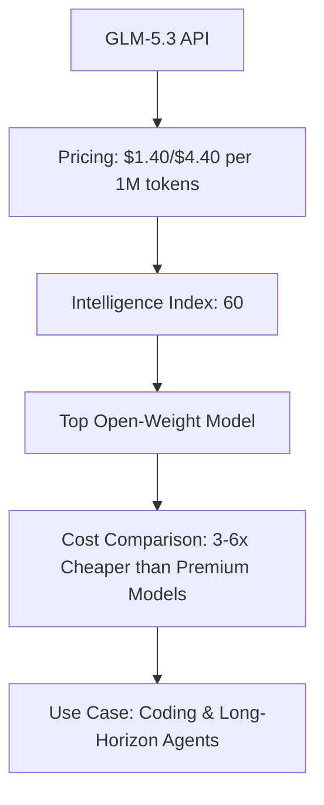
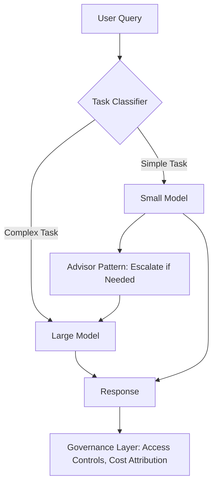

> 🎙️ **Listen to the podcast version of this article:**
> <audio controls src="index.mp3"></audio>


---

> \u2728 **TL;DR:** This week in AI: Z.ai\’s GLM-5.3 hits the API at $1.40/$4.40 per million tokens, offering frontier-class performance at a fraction of the cost of competitors like Claude Opus 5 and GPT-5.6 Sol. NVIDIA\’s TensorRT Model Connect (TRTMC) debuts in public preview, enabling two-command conversion of Hugging Face checkpoints to native C++ inference without ONNX. Meanwhile, Snowflake\’s Cortex AI Gateway introduces dynamic model routing, cutting enterprise AI costs by up to 3x through intelligent task classification and governance-aware optimization.

| Metric / Innovation Area | Insight / Takeaway |
|--------------------------|-------------------|
| **GLM-5.3 API Pricing** | $1.40 input / $4.40 output per 1M tokens; 60 Intelligence Index score, tying Kimi K3 as the top open-weight model. |
| **TensorRT Model Connect** | Two-command build from Hugging Face to native C++ TensorRT inference; no ONNX step required. |
| **Snowflake Auto-Routing** | Cuts AI costs up to 3x via advisor pattern + task classifier; governance-integrated. |

### GLM-5.3 Hits the API: Z.ai\’s Cost-Effective Challenger to Frontier Models

Z.ai\’s GLM-5.3 has officially landed on the API, marking a pivotal moment for developers seeking frontier-level performance without the premium price tag. Priced identically to its predecessor at **$1.40 per million input tokens** and **$4.40 per million output tokens**, GLM-5.3 undercuts heavyweights like Claude Opus 5 ($30 per million tokens) and GPT-5.6 Sol ($35 per million tokens) by a staggering margin. For context, a combined input/output workload of 1M tokens each costs **$5.80** on GLM-5.3, compared to **$8 for Grok 4.6**, **$18 for Kimi K3**, and **$30–$35 for top-tier models** from Anthropic and OpenAI.

The model\’s cost efficiency is further validated by its **Intelligence Index score of 60**, tying with Kimi K3 as the highest-rated open-weight model globally. However, Artificial Analysis notes that GLM-5.3\’s increased verbosity means per-task costs may rise despite flat token rates—a critical consideration for budget-conscious deployments. For now, developers can leverage GLM-5.3 via Z.ai\’s API using the OpenAI Chat Completions-compatible protocol, with cached input storage temporarily free.



**Why It Matters:** GLM-5.3 democratizes access to frontier-class AI, enabling startups and enterprises to experiment with advanced coding and agentic workloads without prohibitive costs. Its competitive pricing and open-weight heritage (with weights promised for future release) position it as a disruptor in a market dominated by closed, high-priced models.

---

### NVIDIA TensorRT Model Connect: Streamlining Hugging Face to Native C++ Inference

NVIDIA\’s **TensorRT Model Connect (TRTMC)**, now in public preview, eliminates a major friction point in deploying Hugging Face models: the cumbersome ONNX export step. TRTMC converts supported Hugging Face or local checkpoints directly into **versioned `.bundle` artifacts** for native C++ inference using just two commands. This breakthrough allows inference to run in C++ environments—such as robotics, embedded systems, or automotive stacks—**without PyTorch in the runtime path**.

The workflow is refreshingly simple. For example, building and running Qwen3-0.6B requires:

```bash
trtmc build Qwen/Qwen3-0.6B --precision bf16 --max-cache-length 16384 --output qwen3-0.6b.bundle
trtmc run ./qwen3-0.6b.bundle --prompt "What is the capital of France? Answer in one word." --chat-template --no-thinking
```

The `.bundle` artifact is the linchpin of TRTMC\’s design, splitting the Python-based build process (checkpoint resolution and TensorRT engine construction) from the C++ runtime. Applications interact with task-specific APIs like `generate()`, `transcribe()`, or `embed()`, abstracting away the complexities of model-specific integration.

```mermaid
sequenceDiagram
    participant Developer
    participant TRTMC
    participant HuggingFace
    participant C++App
    Developer->>TRTMC: trtmc build [model]
    TRTMC->>HuggingFace: Fetch Checkpoint
    TRTMC->>TRTMC: Convert to .bundle
    TRTMC->>Developer: Return .bundle
    Developer->>C++App: trtmc::load(\"./model.bundle\")
    C++App->>C++App: Run Inference (No PyTorch)
```

**Supported Models & Performance:** As of the July 29, 2026 GB300 snapshot, TRTMC covers **105 release profiles across 76 model families**, with **102 profiles outperforming their reference implementations by over 5%**. Current limitations include Linux aarch64-only wheels (x86_64 requires Docker source builds) and dependencies on Python 3.10/3.12 and TensorRT 11.1.0.106.

**Why It Matters:** TRTMC is a game-changer for industries requiring **low-latency, PyTorch-free inference**, such as robotics, medical devices, and defense systems. By removing ONNX export bottlenecks and standardizing deployment via `.bundle` artifacts, NVIDIA accelerates the transition from research to production for C++-centric applications.

---

### Snowflake\’s Auto-Model Routing: Cutting AI Costs Up to 3x for Enterprise Workloads

Enterprise AI deployments often suffer from a **one-size-fits-all model problem**: either overpaying for simple queries with a high-end model or under-serving complex tasks with a budget option. Snowflake\’s **Cortex AI Gateway** now addresses this with **dynamic model routing**, an intelligent system that automatically selects the optimal model for each task based on cost, quality, and governance constraints.

The routing mechanism employs two core strategies:
1. **Advisor Pattern**: A smaller model attempts the task first. If it struggles, it escalates to a larger model as a "tool," ensuring efficiency without sacrificing accuracy.
2. **Task Classifier**: A classifier trained on historical queries routes straightforward questions to simpler (and cheaper) models, reserving premium models for complex workloads.

Crucially, Snowflake\’s approach integrates **governance at every layer**. Access controls follow the task—not just the data—with role-based permissions extending to models and agents. For example, an agent might have read-only access to a connected tool like email, while open models (e.g., DeepSeek-V4-Flash or GLM-5.3) can run within a customer\’s region to satisfy data residency requirements.



**Real-World Impact:** Snowflake reports **up to 3x cost reductions** in internal tests, driven by avoiding overkill on simple queries. The system also leverages **Horizon Context** and **Cortex Sense** to pre-package context, reducing the need for exploratory work (e.g., SQL generation or data searches) that typically requires more capable—and expensive—models.

**Why It Matters:** As enterprises scale AI agents, manual model selection becomes a **cost liability**. Snowflake\’s governance-first routing ensures that cost optimization aligns with existing data access controls, making it ideal for organizations already centered on Snowflake\’s platform. Competitors like Databricks (Unity AI Gateway) and OpenRouter focus on different governance models (e.g., ML lineage or neutral model breadth), but Snowflake\’s strength lies in its **seamless integration with enterprise data estates**.

**Key Takeaway:** The future of enterprise AI isn\’t just about model performance—it\’s about **intelligent, governed routing** that balances cost, capability, and compliance. Snowflake\’s auto-routing is a step toward making AI deployments as efficient as they are powerful.

Written with [Argos](https://github.com/Neilstid/argos)
