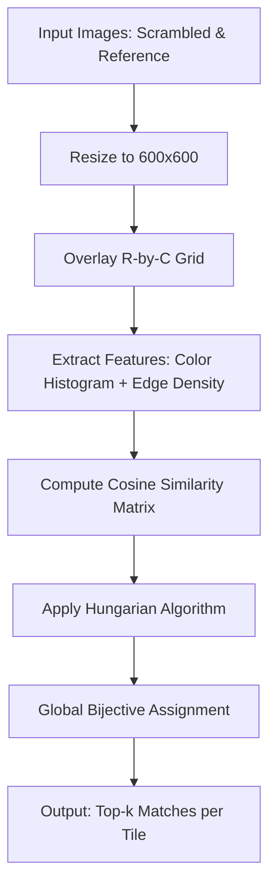
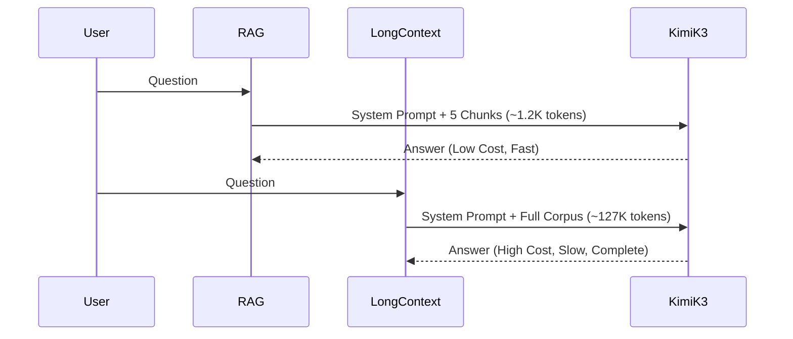
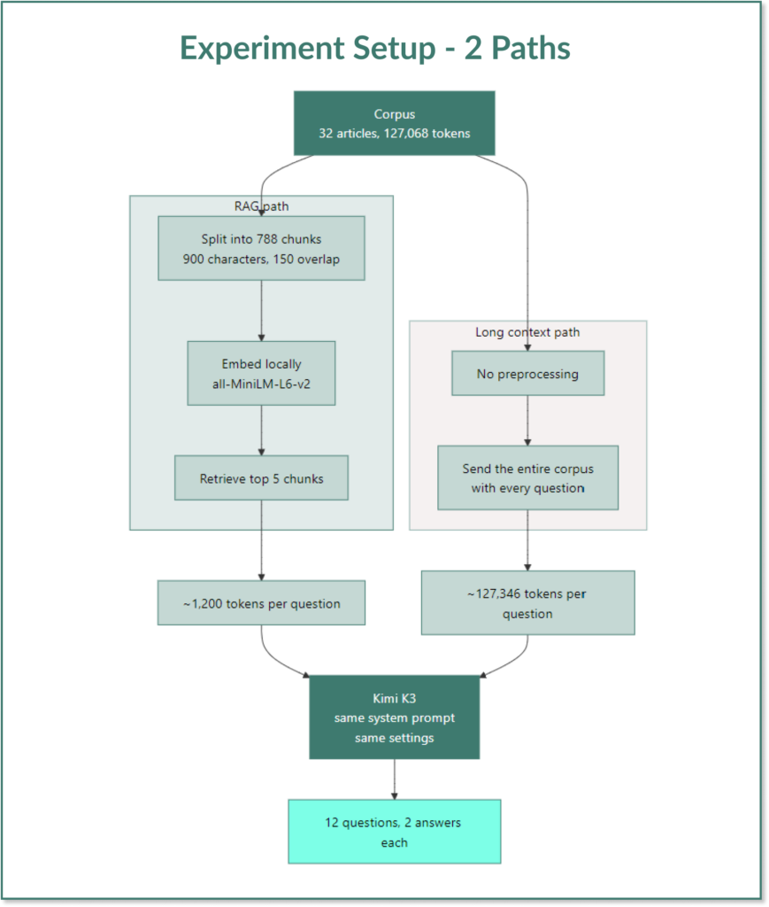
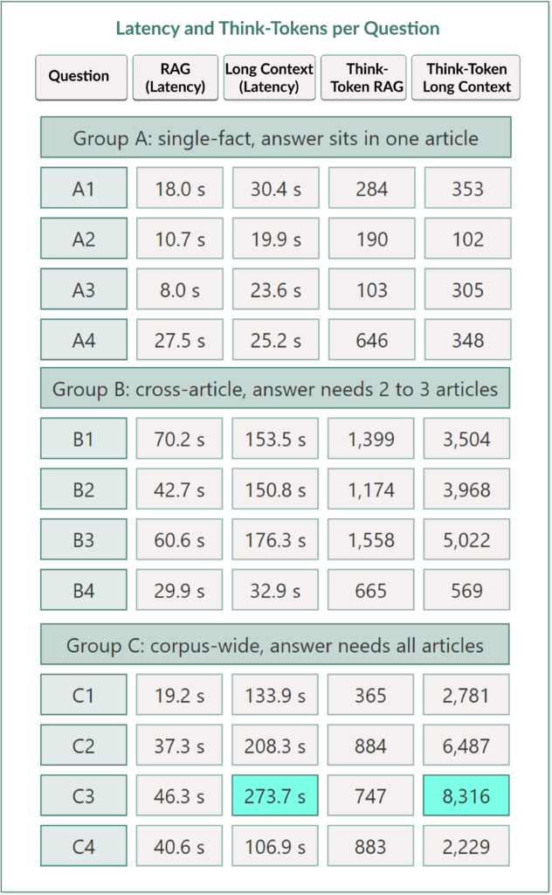
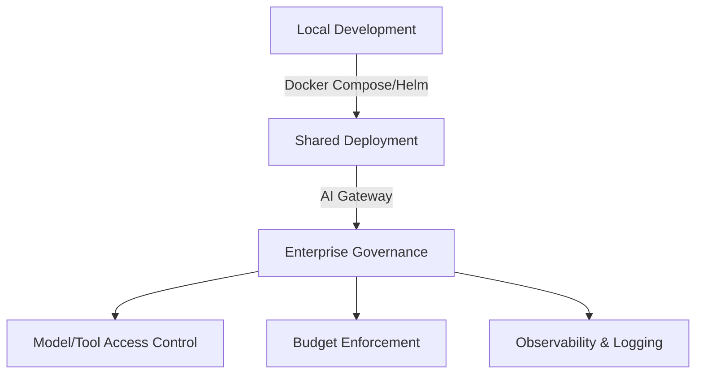

> 🎙️ **Listen to the podcast version of this article:**
> <audio controls src="index.mp3"></audio>


---

> 💡 **TL;DR:** This week’s AI and data science highlights include a Python-based computer vision solution for solving jigsaw puzzles using OpenCV and global optimization, a rigorous comparison of Kimi K3’s 1M-token context window against RAG pipelines for cost, latency, and accuracy, and TrueFoundry’s open-source AI agent harness, TrueForge, which delivers 30%-75% cost savings over managed alternatives while offering vendor-neutral flexibility for enterprise deployments.

| Metric / Innovation Area | Insight / Takeaway |
|--------------------------|--------------------|
| **Jigsaw Jeeves (CV)** | Uses OpenCV, NumPy, and SciPy to match puzzle pieces via color histograms, edge density, and the Hungarian algorithm for global assignment. Achieves 99.8% search space reduction for 5,000-piece puzzles. |
| **Kimi K3 (1M Token Context)** | Long-context (127K tokens) outperforms RAG in completeness (2.00 vs. 0.83) but costs 16x more ($3.82 vs. $0.23 per 12 questions) and is 3x slower (111s avg latency). |
| **TrueForge (AI Agents)** | Open-source harness with 30%-75% cost savings vs. Claude Managed Agents. Supports local-to-production deployment with Docker/Helm and integrates with TrueFoundry’s AI Gateway for governance. |

### Computer Vision: Jigsaw Jeeves – A Puzzle Assistant Built with Python and OpenCV

The frustration of a stalled jigsaw puzzle—where progress grinds to a halt—is a universal experience. Enter *Jigsaw Jeeves*, a computer vision-based assistant designed to provide "just enough" guidance to reignite your solving momentum without robbing you of the satisfaction of completion. Unlike fully automated solvers, which struggle with the combinatorial complexity of piece alignment, rotations, and lighting variations, this assistant narrows down the search space to a manageable neighborhood, turning a 5,000-piece puzzle into a series of smaller, tractable sub-problems.

#### The Problem: Why Jigsaws Are Hard for AI
Jigsaw puzzles present a multifaceted challenge for automation. Each piece has a unique shape, arbitrary rotation, and visual ambiguity (e.g., sky or grass regions where pieces look identical). Additionally, input data is noisy: the scrambled photo may suffer from shadows, glare, or perspective distortion, while the reference (e.g., the box cover) might have overlaid text, color casts, or scaling differences. The goal of *Jigsaw Jeeves* is not to solve the puzzle but to **localize** each piece to a small region of the board, reducing the search space by orders of magnitude.

The problem is formally framed as a **bijective mapping** between scrambled and reference tiles. Given an R-by-C grid overlay on both images, the task is to find a one-to-one correspondence between scrambled and solved tiles using visual features. Three key challenges emerge:
1. **Visual Ambiguity**: Uniform regions (e.g., blue sky) produce nearly identical feature vectors, making local matching unreliable.
2. **Global Consistency**: Greedy local assignments (e.g., matching each piece to its best candidate) fail to guarantee a bijective mapping, leading to conflicts or suboptimal placements.
3. **Distribution Shift**: The scrambled photo and reference image often come from different visual distributions (e.g., lighting, color profiles), complicating direct comparisons.

#### The Solution: A Three-Stage Pipeline
The pipeline consists of three stages:
1. **Grid Overlay**: Both images are resized to 600x600 pixels and divided into an R-by-C grid. The grid resolution must balance granularity (too coarse loses detail; too fine introduces noise).
2. **Feature Extraction**: Each tile is converted into a 513-dimensional vector combining:
   - A **3D color histogram** (8 bins per RGB channel, normalized to sum to 1).
   - **Edge density** (proportion of edge pixels detected via Canny edge detection).
   This representation is rotation-invariant and robust to lighting variations.
3. **Global Assignment**: Cosine similarity measures the discrepancy between tile vectors. The **Hungarian algorithm** (implemented via `scipy.optimize.linear_sum_assignment`) solves the assignment problem globally, ensuring a bijective mapping that maximizes total similarity.

The Hungarian algorithm’s cubic time complexity ($O(N^3)$) limits practical grid sizes to a few hundred cells, but even a 20x25 grid (500 pieces) reduces the search space by 99.8%.



#### Hands-On Implementation in Python
The solution leverages OpenCV for image processing, NumPy for numerical operations, and SciPy for optimization. Key functions include:
- `generate_scrambled_image`: Simulates a scrambled puzzle by slicing and permuting tiles.
- `load_image`: Preprocesses images (background suppression, resizing).
- `extract_features`: Computes the 513-D feature vector for each tile.
- `predict_solution`: Builds the similarity matrix and applies the Hungarian algorithm.

Here’s a snippet of the feature extraction:
```python
import cv2
import numpy as np

def extract_features(cell: np.ndarray) -> np.ndarray:
    # 3D color histogram (8 bins per channel)
    hist_color = cv2.calcHist(
        [cell], [0, 1, 2], None, [8, 8, 8], [0, 256, 0, 256, 0, 256]
    ).flatten()
    hist_color /= (np.sum(hist_color) + 1e-6)  # Normalize
    
    # Edge density via Canny edge detection
    edges = cv2.Canny(cv2.cvtColor(cell, cv2.COLOR_RGB2GRAY), 80, 160)
    edge_density = np.array([np.sum(edges > 0) / (edges.size + 1e-6)])
    
    return np.concatenate([hist_color, edge_density])
```

#### Why It Matters and Broader Applications
While *Jigsaw Jeeves* targets puzzles, its underlying techniques—grid overlay, feature extraction, and global assignment—have applications in:
- **Manufacturing**: Detecting misplaced components on assembly lines.
- **Satellite Imaging**: Stitching aerial tiles into mosaics.
- **Forensics**: Reconstructing shredded documents.
- **Art Restoration**: Matching fragments of damaged frescoes.

The pipeline’s simplicity (no GPU required) and interpretability make it a practical starting point for similar fragment-to-reference matching problems. For larger puzzles, improvements like **approximate nearest-neighbor search** (FAISS) or **deep embeddings** (CLIP) can enhance robustness, albeit at the cost of complexity.


---

### Large Context LLMs: Kimi K3’s 1M Token Window vs. RAG – Cost, Latency, and Answer Quality

The advent of large context windows in models like **Kimi K3** (1M tokens) challenges the dominance of **Retrieval-Augmented Generation (RAG)** for knowledge-intensive tasks. But does "it fits" mean "it works better"? A controlled experiment compares Kimi K3’s long-context mode against a top-5 RAG pipeline across 12 questions, evaluating **cost, latency, correctness, completeness, and grounding**.

#### The Experiment: One Corpus, Two Paths
The corpus consists of **32 articles (127,068 tokens)** from the author’s own work, ensuring ground-truth knowledge. Both paths use the same system prompt and model (Kimi K3), with the only difference being the input:
- **RAG Path**: Splits articles into 788 chunks (900 chars each, 150-char overlap), embeds with `all-MiniLM-L6-v2`, and retrieves the top-5 chunks (~1,200 tokens per query).
- **Long-Context Path**: Feeds the entire corpus (127,346 tokens) into the prompt before each question.

Crucially, the corpus is placed **before** the question to leverage **prefix caching**, where the model retains the processed prefix across calls, reducing costs. However, caching is unreliable: in the experiment, it kicked in for only **33% of calls**, leading to a 30% higher cost than optimistic estimates.

#### Key Findings: The Trade-Offs
| Metric               | RAG          | Long-Context (Kimi K3) |
|----------------------|--------------|-------------------------|
| **Cost per 12 Qs**   | $0.23        | $3.82                   |
| **Avg Latency**      | 46.3s        | 111s                    |
| **Correctness**      | 1.92/2.00    | 2.00/2.00               |
| **Completeness**     | 0.83/2.00    | 2.00/2.00               |
| **Grounding**        | 2.00/2.00    | 2.00/2.00               |

1. **Cost**: Long-context is **16x more expensive** due to the massive input token count. Prefix caching mitigates this but is inconsistent.
2. **Latency**: Long-context is **3x slower** (111s avg vs. 46.3s for RAG). The bottleneck is **thinking tokens**: Kimi K3’s reasoning steps (internal monologue) consume the `max_completion_tokens` budget, leaving little for the final answer. For example, one question used **3,997 thinking tokens** before aborting with an empty response.
3. **Quality**: Long-context **dominates in completeness** (2.00 vs. 0.83). RAG’s answers were often incomplete or imprecise, particularly for **corpus-wide questions** (e.g., "How many articles link to GitHub?"). However, RAG **never hallucinated**—thanks to a strict system prompt instructing it to admit ignorance when the answer wasn’t in the retrieved chunks.

#### Why RAG Failed Gracefully
RAG’s limitations were most evident in **Group C (corpus-wide) questions**, where 5 chunks cannot possibly cover 32 articles. Yet, RAG’s failures were **clean**: it either admitted ignorance or provided partial answers with explicit caveats. For example:
- **Question C1** (GitHub links): RAG responded, *"None of the excerpts contain a link... it’s possible a GitHub link exists elsewhere in the full text."* Long-context correctly identified **13 articles** with links.
- **Question C2** (most mentioned tools): RAG stated, *"I can’t answer that definitively... I only have partial chunks from five articles."* Long-context provided a ranked list.

This behavior underscores the importance of **system prompts** in RAG: the instruction *"If the text does not contain the answer, say so plainly instead of guessing"* prevented hallucinations, keeping the **grounding score perfect (2.00/2.00)**.

#### When to Use Which?
| Scenario                          | Recommended Approach       | Rationale                                                                 |
|-----------------------------------|----------------------------|---------------------------------------------------------------------------|
| Small corpus (<20% of context)    | Long-Context               | Simpler setup, no retrieval overhead, complete answers.                 |
| Frequent queries (1000s/day)      | RAG                        | Cost-effective ($0.23 vs. $3.82 for 12 queries).                        |
| Real-time applications            | RAG                        | Lower latency (46s vs. 111s avg).                                         |
| Corpus-wide questions             | Long-Context               | RAG cannot cover all documents; long-context ensures completeness.       |
| Strict no-hallucination requirement | RAG + Strong System Prompt | RAG with explicit instructions to admit ignorance outperforms.         |

#### Lessons Learned
1. **Reasoning Models Are Expensive**: In Kimi K3, `max_completion_tokens` limits **both thinking and output**. A model may exhaust its budget on reasoning, leaving no tokens for the answer. Always log `finish_reason` to detect this.
2. **Prefix Caching Is Unreliable**: Cache hit rates varied unpredictably (33% in this experiment). Plan for the worst-case cost.
3. **Temperature=1 Limits Reproducibility**: Kimi K3’s fixed temperature means identical prompts can yield different results (e.g., one run used 3,997 thinking tokens; a repeat used 884). For rigorous benchmarks, models with `temperature=0` are preferable.
4. **Daily Quotas Matter**: The long-context path consumed **1.5M input tokens** for 12 questions, exceeding Moonshot’s entry-tier daily quota (1.5M tokens).






---

### AI Agents: TrueFoundry’s TrueForge – A Vendor-Neutral Harness for Enterprise

As AI agents proliferate in enterprises, the need for **control, cost efficiency, and flexibility** grows. **TrueFoundry**, a San Francisco-based B2B startup, addresses this with **TrueForge**, an open-source AI agent harness released under the **MIT License**. TrueForge enables developers to build, deploy, and scale agents **vendor-neutrally**, with claimed cost savings of **30%-75%** compared to managed alternatives like Anthropic’s Claude Managed Agents.

#### The Problem: Agent Proliferation Without Control
Enterprises adopting AI agents face several pain points:
1. **Vendor Lock-in**: Managed agent services (e.g., Claude Managed Agents) tie users to proprietary ecosystems.
2. **Cost**: Running agents at scale can be expensive, especially with reasoning models.
3. **Deployment Complexity**: Moving from local development to production requires re-architecting.
4. **Governance**: Ensuring agents adhere to enterprise policies (e.g., access controls, budgets) is non-trivial.

TrueForge tackles these by providing a **unified harness** that works with any model, integrates with **Model Context Protocol (MCP)** tools, and scales from local development to production deployments.

#### TrueForge’s Architecture: Context Engineering for Efficiency
TrueForge’s core innovation is **context management**—minimizing the tokens sent to the model at each step to reduce costs and improve performance. Key features include:
- **Lazy Loading of MCP Schemas**: Tool definitions are loaded only when needed, reducing context bloat.
- **Subagents**: Isolated tasks are delegated to specialized subagents, keeping the main context lean.
- **Large-Result Offloading**: Oversized tool outputs are stored in files instead of the context window.
- **Context Compaction**: Long conversations are automatically summarized (default threshold: 50,000 tokens).
- **Sandbox-as-a-Tool**: Sandboxes are provisioned on-demand for code execution or file operations, rather than running persistently.

These optimizations directly translate to **cost savings**. In benchmarks on **DevRev’s Enterprise-Bench** (14 tasks across CRM, issue tracking, and document management):
- **GLM-5.2 (Open-Source) + TrueForge**: $2.90 per task vs. **$11.80** with Claude Managed Agents (75% savings).
- **Claude Opus 4.8 + TrueForge**: $8.50 per task vs. **$11.80** with Claude Managed Agents (30% savings).

#### Deployment: From Local to Production
TrueForge supports a **progressive deployment model**:
1. **Local Development**: Run as a single process with SQLite.
2. **Shared Deployment**: Use Docker Compose or Helm with Postgres and Redis for scalability.
3. **Enterprise Governance**: Integrate with TrueFoundry’s **AI Gateway** for centralized control of models, tools, and permissions.



#### Comparison with Leading Harnesses
| Feature               | TrueForge               | DeepSeek Harness       | OpenAI Codex CLI       | LangChain Deep Agents  | Claude Managed Agents  |
|-----------------------|-------------------------|------------------------|------------------------|------------------------|-------------------------|
| **License**           | MIT                     | MIT                    | Apache 2.0             | MIT                    | Proprietary             |
| **Model Flexibility**| Vendor-Neutral          | Multi-Provider         | Configurable          | Multi-Provider         | Claude-Only            |
| **Deployment**        | Local → Production      | Local/Self-Hosted      | Local/CLI              | Self-Hosted            | Managed                 |
| **Cost**              | Free (Harness)          | Free                   | Free                   | Free                   | $0.08/session-hour      |
| **Key Differentiator**| Enterprise Path + Gateway Integration | Modular Plugins | Software-Engineering Focus | LangChain Ecosystem | Fully Managed |

#### Why TrueForge Stands Out
1. **Vendor Neutrality**: Works with any model (e.g., GLM-5.2, Claude Opus 4.8) and MCP-compatible tools.
2. **Cost Efficiency**: Context engineering reduces token usage, directly lowering costs.
3. **Enterprise Readiness**: Seamless integration with TrueFoundry’s **AI Gateway** for governance (SSO, permissions, budgets).
4. **Open Source**: MIT License allows forking, modification, and commercial use.

However, **open source ≠ governed**. TrueForge itself does not enforce enterprise policies; these must be implemented separately or via TrueFoundry’s commercial gateway. As Anuraag Gutgutia, TrueFoundry’s COO, noted:
> *"If you are using just the open source version of our agent harness, yes, you will need to put the right controls therein or in front of some other internal control system."*

#### Use Cases and Early Adopters
TrueFoundry reports that **NetApp** used TrueForge for **incident response and ticket triage**, while **Automattic** (WordPress) and **Siemens Healthineers** are among early adopters. The harness is particularly suited for:
- **Multi-Step Workflows**: Agents that interact with CRM, databases, or APIs.
- **Code Execution**: Sandboxed environments for safe code runs.
- **Human-in-the-Loop**: Approval checkpoints for critical actions.

#### The Bigger Picture: TrueFoundry’s Strategy
TrueFoundry’s business model revolves around its **AI Gateway**, a control plane for enterprise AI traffic. TrueForge extends this strategy into the **agent runtime layer**, creating a full-stack solution:
- **Gateway**: Manages models, tools, and access controls.
- **TrueForge**: Executes agents with efficiency and flexibility.

This positions TrueFoundry as a **neutral infrastructure provider**, akin to how Kubernetes abstracts container orchestration. Whether enterprises use TrueForge, Claude Managed Agents, or other harnesses, TrueFoundry aims to be the underlying layer that **routes, secures, and observes** all AI traffic.

#### Getting Started with TrueForge
TrueForge is available on [GitHub](https://github.com/truefoundry/trueforge) with documentation for local and production deployments. Key commands:
```bash
# Local development
pip install trueforge
trueforge start --model <your-model> --tools <mcp-tools>

# Production deployment (Docker Compose)
docker-compose -f docker-compose.prod.yml up
```

---

### Final Thoughts: The Week’s AI Landscape
This week’s highlights showcase the **diversity of AI innovation**—from low-level computer vision to high-level agent orchestration. **Jigsaw Jeeves** demonstrates how classical techniques (histograms, Hungarian algorithm) can solve niche problems elegantly. **Kimi K3’s long-context experiment** reveals that while large context windows enable new capabilities, they introduce trade-offs in cost, latency, and reliability. Meanwhile, **TrueForge** exemplifies the enterprise shift toward **open, controllable, and cost-efficient** AI deployments.

For practitioners, the takeaways are clear:
- **For computer vision tasks**, start simple: feature engineering and global optimization can outperform deep learning in constrained domains.
- **For knowledge-intensive LLMs**, long-context is powerful but expensive; RAG remains a pragmatic choice for most production use cases.
- **For enterprise agents**, vendor-neutral harnesses like TrueForge offer flexibility and savings, but governance requires additional layers.

The common thread? **Balance**. Whether it’s balancing local vs. global matching in puzzles, cost vs. completeness in LLMs, or flexibility vs. control in agents, the most effective solutions are those that **adapt to the problem’s constraints**—not the other way around.

Written with [Argos](https://github.com/Neilstid/argos)
