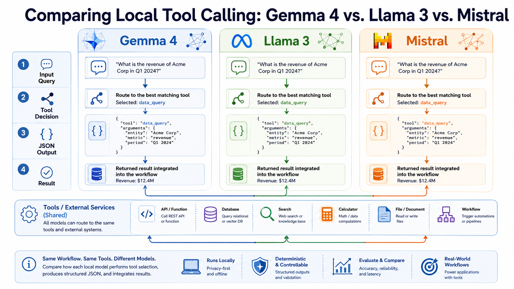
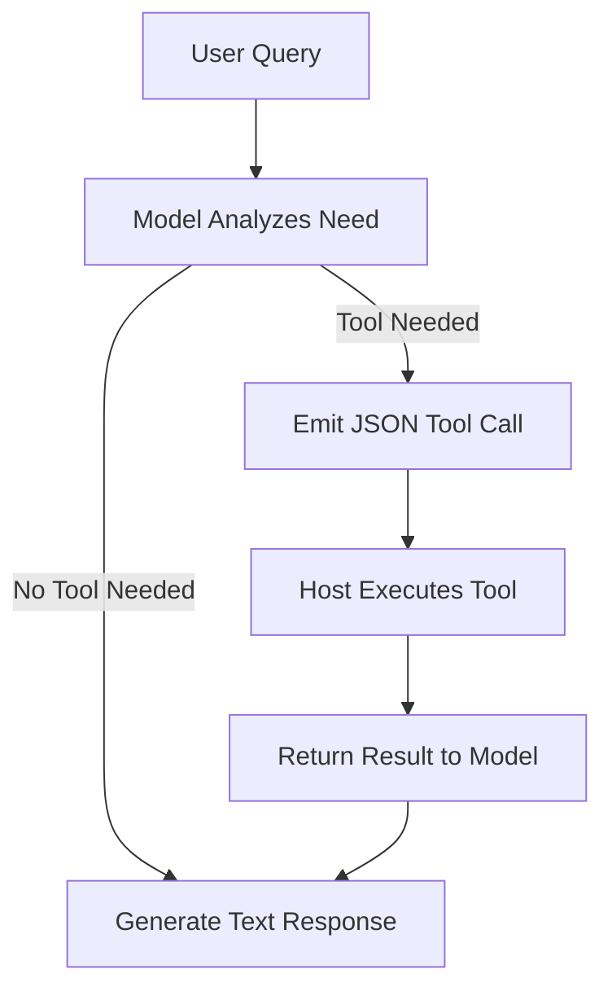
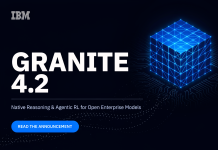
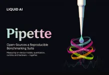
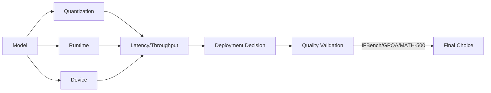

> 🎙️ **Listen to the podcast version of this article:**
> <audio controls src="index.mp3"></audio>

---

> 💡 **TL;DR:** The AI landscape in 2026 is defined by three pivotal trends: the rise of **local tool-calling** in models like Gemma 4, Llama 3, and Mistral; **IBM’s Granite 4.2**, which introduces native reasoning and agentic reinforcement learning for code, terminal, and web tasks; and **Liquid AI’s Pipette**, an open-source benchmarking suite that measures on-device performance across models, quantization, runtimes, and hardware. These developments collectively push the boundaries of deployable, agentic AI—whether on edge devices or in the cloud.

| **Metric / Innovation Area**               | **Insight / Takeaway**                                                                                     |
|--------------------------------------------|----------------------------------------------------------------------------------------------------------|
| **Local Tool-Calling Leaders**             | Gemma 4 (edge-optimized), Llama 3 (ecosystem depth), Mistral (efficiency) each excel in distinct deployment contexts. |
| **IBM Granite 4.2**                        | 3B/8B/30B models with **thinking/low-effort/non-thinking modes**; 8B/30B feature **agentic RL** for code/terminal/web tasks. 30B achieves **57.00 on SWE-Bench Verified** and **29.24 on Terminal-Bench 2.1**. |
| **Pipette Benchmarking Suite**             | Open-source, **Apache 2.0** suite measuring **1,000+ configurations** (model + quantization + runtime + device). Reveals **78.4% vs. 33.8% context-scaling retention** for near-identical models. |
| **Hardware Efficiency**                    | Mistral Small (119B total, 6B active params) and Gemma 4’s E2B/E4B variants target **on-device/edge deployments** with minimal VRAM. |
| **Agentic AI Trends**                      | Native reasoning, **multi-stage RL**, and **sandboxed environments** (e.g., Granite 4.2) are becoming standard for enterprise-grade models. |

---

### Introduction: The Surge in Tool-Calling and On-Device Benchmarking
The AI revolution of 2026 is not just about bigger models—it’s about **smarter, more deployable ones**. Two trends dominate the conversation: **tool-calling capabilities** in locally run models and the **benchmarking of on-device performance**. Tool calling transforms language models from passive text generators into active agents that can query APIs, execute functions, and interact with external systems—all without cloud dependency. Meanwhile, on-device benchmarking addresses a critical gap: how do models *actually* perform on smartphones, laptops, or embedded systems, where memory, compute, and latency constraints reign?

This article explores three groundbreaking developments:
1. **Local Tool-Calling Showdown**: How Gemma 4, Llama 3, and Mistral implement tool use, their trade-offs, and ideal use cases.
2. **IBM Granite 4.2**: A family of open reasoning models with **native agentic RL** for code editing, terminal control, and web searches.
3. **Liquid AI’s Pipette**: An open-source benchmarking suite that measures **quality, quantization, runtime, and hardware** together—finally answering how models behave *in the wild*.

---

### Comparing Local Tool Calling: Gemma 4 vs. Llama 3 vs. Mistral

#### **Why Tool Calling Matters for Local AI**
Tool calling—sometimes called *function calling*—is the mechanism that lets a model **invoke external functions** (e.g., APIs, scripts, or databases) rather than relying solely on its training data. For locally deployed models, this is a game-changer:
- **No internet dependency**: The model can fetch live data or perform computations without cloud access.
- **Structured interactions**: Tools are defined via **JSON schemas**, and the model emits structured requests (e.g., `{"function": "get_weather", "args": {"city": "Paris"}}`).
- **Bridging the gap**: Local models lack live memory or connectivity; tool calling lets them **act** in the real world.

The workflow is consistent across models:
1. The host application provides a list of available tools (with names, descriptions, and parameters).
2. The model analyzes the user’s query and decides whether to call a tool.
3. If a tool is needed, the model emits a **JSON object** specifying the function and arguments.
4. The host executes the tool and returns the result to the model, which incorporates it into a response.

#### **Gemma 4: Native Agentic Support for Edge Devices**
Google DeepMind’s **Gemma 4** (released April 2026) is a **multimodal** family (text, image, video, audio) with **native tool-calling support** baked into its architecture. Key features:
- **Purpose-built for edge**: Smaller variants (E2B, E4B) are optimized for on-device deployment, while larger models (26B, 31B) support **256K-token contexts**.
- **Configurable thinking**: Developers can adjust the model’s **reasoning depth** before tool calls—critical for agentic workflows where precision matters.
- **Apache 2.0 license**: Fully open-weight, available on Hugging Face, Kaggle, and Google AI Studio.

**Strengths**:
✅ Best for **edge/embedded deployments** (e.g., laptops, IoT).
✅ **Native system prompt support** reduces boilerplate for structured conversations.
✅ **Mixture-of-Experts (MoE)** in some variants balances efficiency and performance.

**Trade-offs**:
⚠️ Smaller models may struggle with **complex multi-tool scenarios** compared to Llama 3’s 70B+ variants.

#### **Llama 3: The Ecosystem Favorite**
Meta’s **Llama 3** (2024) and its **3.1/3.2 updates** introduced **native JSON-based tool calling**, eliminating the need for constrained generation or prompt engineering hacks. Key features:
- **Dense architecture**: Text-focused, with **70B and 405B** models excelling at tool selection.
- **Community support**: The most **tutorials, fine-tunes, and integrations** (e.g., LangChain, LlamaIndex) of any open-weight family.
- **Licensing**: Permits commercial use (with restrictions on training competing models).

**Strengths**:
✅ **Reliable tool use** in 70B+ models, even with **ambiguous or complex tool definitions**.
✅ **Pythonic tool calling** in Llama 3.2 (1B/3B models emit Python-style function calls).
✅ **Widest ecosystem** for developers.

**Trade-offs**:
⚠️ **8B model struggles** with multi-tool scenarios.
⚠️ **No native system prompt support** (unlike Gemma 4).

#### **Mistral: Efficiency Meets Capability**
Mistral AI’s **Mistral Small 4** (March 2026) consolidates reasoning, vision, and tool use into a **single 119B-parameter model** with **6B active parameters per token** via MoE. Key features:
- **Tool calling since v0.3**: JSON-based, with **community templates** (e.g., vLLM) improving reliability.
- **Apache 2.0 license**: Open-weight, available on Hugging Face, Ollama, and La Plateforme.
- **Hardware efficiency**: Runs **faster on consumer GPUs** than dense 70B models.

**Strengths**:
✅ **Best performance-per-parameter** ratio.
✅ **Mistral Small 4** is ideal for **mid-range hardware** (e.g., 16GB VRAM).
✅ **Unified model** for reasoning + vision + tools.

**Trade-offs**:
⚠️ Historically required **additional configuration** for consistent tool-calling reliability.

#### **Practical Deployment Considerations**
| **Model**       | **Best For**                          | **Hardware Requirements**       | **Tool-Calling Reliability** |
|-----------------|---------------------------------------|----------------------------------|-------------------------------|
| **Gemma 4**     | Edge/on-device, agentic workflows    | 8–16GB RAM/VRAM (E2B–12B)        | High (native support)          |
| **Llama 3**     | Ecosystem depth, established frameworks | 8GB (8B) to 40GB+ (70B/405B)   | High (70B+), Medium (8B)       |
| **Mistral**     | Efficiency, constrained hardware     | 8–16GB VRAM (7B–Small 4)         | High (with templates)         |

**Tools for Local Deployment**:
- **[Ollama](https://ollama.ai/)**: CLI for downloading, serving, and querying models (supports all three families).
- **[LM Studio](https://lmstudio.ai/)**: GUI alternative for non-technical users.

---

### IBM Granite 4.2: Native Reasoning and Agentic RL for Enterprise AI

IBM’s **Granite 4.2** (released 2026) is a **decoder-only dense transformer** family (3B, 8B, 30B) with **three key innovations**:
1. **Native Reasoning Modes**: Every model exposes a **thinking / low-effort / non-thinking switch** in its chat template.
2. **Agentic Reinforcement Learning**: The **8B and 30B** models undergo **multi-stage RL** to master **code editing, terminal control, and web searches** in sandboxed environments.
3. **Open-Source Apache 2.0**: Fully permissive for commercial use.

#### **Architecture and Training**
- **Dense Transformer**: No MoE; uses **Grouped Query Attention (8 KV heads)**, **RoPE (θ=10M)**, **SwiGLU MLPs**, and **RMSNorm (ε=1e-5)**.
- **Pre-Training**: ~15 trillion tokens from scratch, with a **512K-token long-context phase**.
- **Post-Training**:
  - **Supervised Fine-Tuning (SFT)**: 7.2M samples (~100B tokens), with **69% agentic data** (mostly software engineering).
  - **Multi-Stage RL**: Asynchronous **GRPO** runs with **leave-one-out baselines** and **truncated importance sampling**. Stages:
    1. **RLVR** (Reinforcement Learning from Verifier Feedback)
    2. **Skill Boosters**
    3. **SWE (Software Engineering)**
    4. **Terminal**
    5. **Search**
    6. **RLHF (Reinforcement Learning from Human Feedback)**
- **Agentic RL Block**: Only the **8B and 30B** models receive this training, explaining their superior performance in **SWE-Bench Verified** and **Terminal-Bench**.

#### **Benchmark Results**
IBM’s reported scores (higher is better):

| **Benchmark**            | **3B**   | **8B**    | **30B**   |
|--------------------------|----------|-----------|-----------|
| **SWE-Bench Verified**  | NA       | **47.67** | **57.00** |
| **Terminal-Bench 2.1**   | NA       | **20.56** | **29.24** |
| **τ³-bench**            | 50.99    | **66.34** | **68.05** |
| **BFCL (v4)**            | 52.41    | 50.29     | **61.39** |
| **AIME25**               | 78.33    | **86.67** | **89.17** |
| **GPQA**                 | 54.80    | **64.14** | **66.41** |
| **MMLU-Pro**             | 67.84    | **74.04** | **77.60** |
| **RULER 128K**           | 55.30    | **71.41** | **81.38** |

**Key Takeaways**:
- The **30B model leads in agentic tasks** (SWE-Bench, Terminal-Bench) due to **agentic RL**.
- **8B is a sweet spot** for mid-market teams (single GPU deployable).
- **3B fits laptops** (via Ollama/LM Studio) but lacks agentic RL.

#### **Granite Speech 5.0 Turbo CTC**
IBM also released **470M-parameter speech models** with:
- **No LLM backbone**: Uses **Connectionist Temporal Classification (CTC)** for audio-to-text.
- **Throughput**: **12,600 RTFx** on a single H200 (vs. ~6,000 for competitors).
- **WebGPU demo**: Live [here](https://huggingface.co/spaces/IBM/Granite-Speech-5.0-Turbo-CTC).

#### **Why Granite 4.2 Matters**
- **Enterprise-ready**: On-prem weights, Apache 2.0 license, and **sandboxed agentic training** make it ideal for **regulated industries** (finance, healthcare, telecom).
- **Developer Tools**: Excels at **code editing, terminal automation, and deep-research agents**.
- **Hardware Flexibility**: **3B (laptop) → 30B (A100/H100)** scales with needs.

---

### Liquid AI’s Pipette: Benchmarking On-Device AI at Scale

Model cards typically report performance under **server-class, full-precision conditions**—but these numbers **rarely predict real-world behavior on edge devices**. **Liquid AI’s Pipette** solves this by treating **on-device performance as a property of the *entire deployed system***, not just the model.

#### **What Pipette Measures**
Pipette evaluates **full configurations**:
`Model + Quantization + Runtime + Device + Context Length`

**Metrics**:
1. **Latency**: Time to first token and inter-token latency.
2. **Throughput**: Tokens generated per second.
3. **Memory Usage**: Peak RAM/VRAM consumption.
4. **Quality**: Matched to **IFBench, GPQA Diamond, MATH-500** (evaluated on H100 reference systems).
5. **Context Scaling**: How performance degrades with longer inputs.

**Launch Dataset**:
- **1,000+ configurations** across **30+ models**.
- **Runtimes**: llama.cpp (macOS, iOS, Windows, Android).
- **Devices**: MacBook Pro (M5 Max), iPhone 17 Pro, Galaxy S26 Ultra (AMD Ryzen AI Max+ 395 and Radeon 8060S coming soon).
- **Context Lengths**: 256 to 8,192 tokens.

#### **Key Findings**
1. **Context Scaling Divergence**:
   - On **Galaxy S26 Ultra (Q4_K_M)**, **Granite-4.0-H-350M** retains **78.4%** of its decode throughput at 4,096 tokens vs. **33.8%** for Granite-4.0-350M.
   - **Implication**: Near-identical models can have **2.3x differences** in context-scaling efficiency.

2. **Sparse Activation ≠ Memory Savings**:
   - **LFM2.5-8B-A1B** (1.5B active params per token) decodes **2.4x faster** than Qwen3.5-4B at 2,048 tokens on Galaxy S26 Ultra—but still peaks at **5.29 GiB** (all expert weights occupy memory).

3. **Speed vs. Quality Trade-offs**:
   - On **iPhone 17 Pro (Q4_K_M)**, **MiniCPM5-1B** completes a 2,048-in/256-out workload in **3.47s** (vs. 4.12s for LFM2.5-1.2B), but **LFM2.5 scores 9.0 points higher on MATH-500**.

4. **Task-Level Reversals**:
   - **Granite-4.1-8B** and **Ministral-3-8B-Instruct-2512** differ by **2.4% in throughput** and **1.2% in RAM** on M5 Max—but **Granite leads IFBench by 7.3 points**, while **Ministral leads GPQA Diamond by 14.0 points**.

#### **Methodology**
- **Performance Runs**:
  - Fixed token shapes, greedy decoding.
  - 5 measured repetitions (after warm-up).
  - Thermal/load checks before each run; failing runs are discarded.
- **Quality Evaluations**:
  - Deterministic, model-blind scoring.
  - Results matched to on-device runs (not measured on-device).

#### **Why Pipette Matters**
- **Reproducibility**: Open-source (**Apache 2.0**) with a **public dashboard** and **native iOS/Android apps**.
- **Industry Applications**:
  - **Model selection** before sprint commits.
  - **Hardware procurement validation** (e.g., SoC choices).
  - **Regression testing** for runtime/OS/driver updates.
  - **Vendor claim verification** (e.g., OEMs, chip vendors).
- **Democratization**: Solo developers to enterprises can use Pipette **without infrastructure**.

---
### Comparative Takeaways: What This Means for AI Deployment

#### **1. Local Tool-Calling: Choosing the Right Model**
| **Use Case**               | **Recommended Model** | **Why?**                                                                 |
|---------------------------|------------------------|--------------------------------------------------------------------------|
| **Edge/On-Device**        | Gemma 4 (E2B–12B)     | Native tool-calling, system prompt support, MoE efficiency.            |
| **Ecosystem & Reliability** | Llama 3 (70B+)       | Best community support, reliable multi-tool use.                      |
| **Efficiency on Mid-Range Hardware** | Mistral Small 4 | 6B active params, unified reasoning/vision/tools.                     |
| **Agentic Workflows**     | Granite 4.2 (8B/30B)  | Native reasoning modes + agentic RL for code/terminal/web.             |

**Pro Tip**: Use **Ollama** for CLI deployments or **LM Studio** for a GUI. For **multi-tool agents**, Llama 3.1+ or Granite 4.2’s 8B/30B are the safest bets.

#### **2. Agentic AI: The Rise of Native Reasoning**
- **Granite 4.2’s thinking/low-effort/non-thinking switch** is a **game-changer** for controlling compute costs.
- **Agentic RL** (code, terminal, web) is becoming a **must-have** for enterprise models.
- **Sandboxed training** (e.g., IBM’s GB200 NVL72 cluster) ensures **safe, real-world agentic behavior**.

**Equation for Agentic Success**:
$$
	ext{Agentic Performance} = f(	ext{Reasoning Depth}, 	ext{Tool-Calling Reliability}, 	ext{RL Fine-Tuning})
$$

#### **3. On-Device AI: Benchmarking Beyond the Model**
Pipette’s insights reveal that:
- **Quantization matters**: Q4_K_M can **halve memory usage** with minimal quality loss.
- **Runtime optimizations** (e.g., llama.cpp) can **outperform hardware upgrades**.
- **Context length impacts vary**: Some models **scale gracefully**; others **collapse**.

**Mermaid Diagram: On-Device Performance Factors**

#### **4. Open-Source Trends**
- **Apache 2.0 Dominance**: Gemma 4, Granite 4.2, and Pipette all use **permissive licenses**.
- **Community-Driven Tooling**: Llama 3’s ecosystem, Mistral’s templates, and Pipette’s dashboard **lower barriers to entry**.
- **Hardware Awareness**: The focus is shifting from **model size** to **deployment efficiency**.

---
### Conclusion & Further Reading

The AI landscape of 2026 is defined by **three pillars**:
1. **Tool-Calling Everywhere**: Local models (Gemma 4, Llama 3, Mistral) are becoming **first-class agents**.
2. **Agentic Reasoning**: IBM’s Granite 4.2 proves that **native reasoning + RL** can deliver **enterprise-grade automation**.
3. **On-Device Reality Checks**: Pipette’s benchmarking suite **demystifies edge deployment**, revealing that **model choice is just the beginning**.

#### **How to Experiment**
- **Tool-Calling**:
  - Try **Gemma 4 in Google AI Studio** or **Llama 3 via Ollama**.
  - Build a **multi-tool agent** with [LangChain](https://python.langchain.com/) or [LlamaIndex](https://www.llamaindex.ai/).
- **Granite 4.2**:
  - Download from [IBM’s GitHub](https://github.com/IBM/granite) and test the **thinking modes**.
  - Benchmark on **SWE-Bench** or **Terminal-Bench**.
- **Pipette**:
  - Run the **iOS/Android apps** to test your device.
  - Explore the [dashboard](https://pipette.liquid.ai/) for **model comparisons**.

#### **The Road Ahead**
- **Edge AI will explode**: Expect more **quantized, runtime-optimized models** for smartphones and IoT.
- **Agentic RL will standardize**: Following IBM’s lead, **code/terminal/web agents** will become table stakes.
- **Benchmarking will mature**: Tools like Pipette will **unify quality, speed, and hardware metrics**.

The future of AI is **not just smarter—it’s more deployable, more actionable, and more accessible than ever**. Whether you’re a developer, researcher, or enterprise leader, the tools and models of 2026 are ready for you to **build the next generation of intelligent systems**.

---
*Featured Image: *

Written with [Argos](https://github.com/Neilstid/argos)
