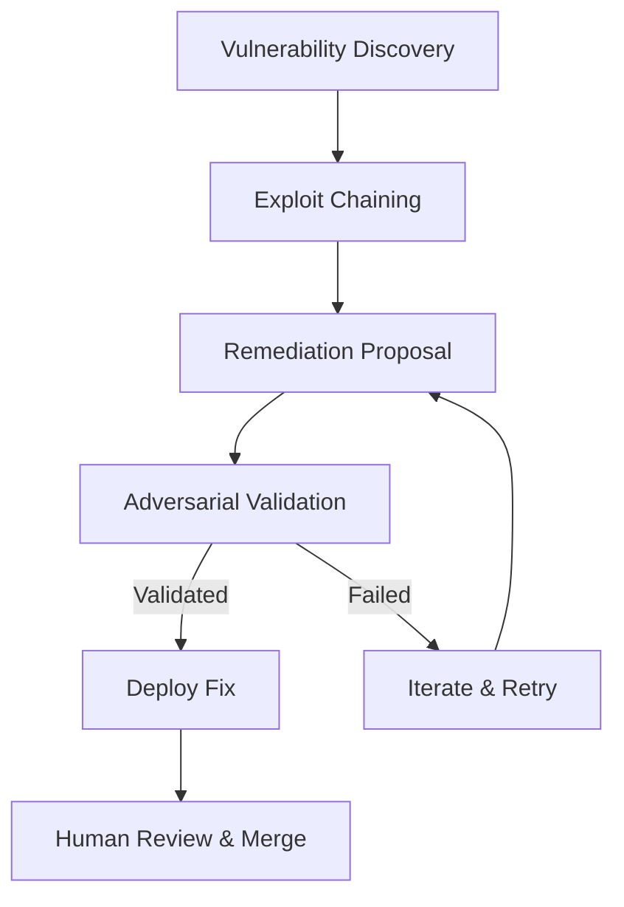
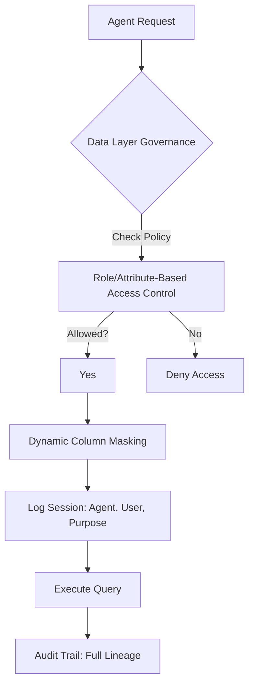
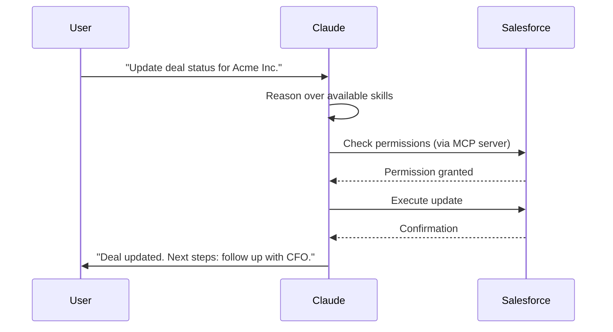

> 🎙️ **Listen to the podcast version of this article:**
> <audio controls src="index.mp3"></audio>

---

> 💡 **TL;DR:** This week in AI, Visa open-sourced VVAH, a security harness that autonomously detects, fixes, and validates code vulnerabilities—reducing remediation time from weeks to hours. EDB introduced a governance framework for agentic AI, enforcing rules at the data layer to ensure accountability. Meanwhile, Salesforce and Anthropic launched Claudeforce, embedding Salesforce’s CRM directly into Claude, signaling a future where AI interfaces may replace traditional enterprise UIs.

| **Metric / Innovation Area**               | **Insight / Takeaway**                                                                                     |
|-------------------------------------------|----------------------------------------------------------------------------------------------------------|
| **Visa’s VVAH**                            | Autonomous vulnerability detection, patching, and adversarial validation; MTTA reduced from weeks to hours. |
| **Governance at the Data Layer (EDB)**    | Enforces agent rules in real-time at the operational data layer, ensuring auditable, context-aware controls. |
| **Salesforce Claudeforce**                | CRM embedded in Claude via 37 pre-built skills; enables AI-native workflows without traditional UI.     |
| **Model-Agnostic Orchestration (VVAH)**   | Per-stage model selection (e.g., Mythos for recall, Opus for precision) optimizes pipeline performance.   |
| **Agentic AI Adoption**                   | 59% of enterprises plan to adopt or switch agent security tooling within a year (VentureBeat Q2 2026).   |

---

### Introduction: The Accelerating Impact of AI on Enterprise Software and Security

The AI revolution is no longer a distant promise—it’s a present reality reshaping how enterprises build, secure, and interact with software. This week, three major developments underscore this shift: **Visa’s open-source security harness (VVAH)**, which autonomously patches code vulnerabilities; **EDB’s data-layer governance framework** for agentic AI; and **Salesforce’s Claudeforce**, a bold move to embed its entire CRM inside Claude, Anthropic’s AI assistant. Together, these innovations highlight a clear trajectory: AI is evolving from a tool for assistance to a system capable of autonomous action, with profound implications for security, governance, and user experience.

As AI agents gain the ability to plan, decide, and act across systems, the question of *how to govern them* becomes existential. Visa’s VVAH tackles this by automating the entire vulnerability lifecycle—from detection to validation—while EDB argues that governance must live at the data layer, where agents interact with critical systems. Meanwhile, Salesforce’s Claudeforce suggests a future where traditional enterprise UIs may become optional, as AI interfaces like Claude become the primary way users interact with business software.

These developments are not just technical feats; they represent a fundamental rethinking of how enterprises operate. The bottleneck in security is no longer detection but remediation. The bottleneck in software usage is no longer functionality but friction. And the bottleneck in governance is no longer policy but enforcement. Let’s dive into each.

---

### 1. Visa’s VVAH: AI That Detects, Fixes, and Validates Code Patches Autonomously

#### **The Problem: From Detection to Remediation**
For decades, the cybersecurity paradigm has been *detect and report*—flag vulnerabilities, and let humans scramble to fix them. But as Rajat Taneja, Visa’s President of Technology, told *VentureBeat*, "AI is finding vulnerabilities faster than humans can in the history of our technology industry. **The new bottleneck is fixing and proving we have fixed things.**" Visa’s answer? **VVAH (Visa Vulnerability Agentic Harness)**, an open-source system that doesn’t just find vulnerabilities—it writes the fixes, tests them, and even deploys them, all before a human reviews the changes.

The urgency of this shift was underscored by *GhostJacking*, a DEF CON 34 attack where an AI agent read malicious payloads from log files and rewrote DNS settings with valid credentials. Visa’s VVAH was born out of its participation in **Anthropic’s Project Glasswing**, where the company used Claude Mythos to chain minor weaknesses into full-blown exploits. The lesson was clear: traditional security tools, which primarily generate telemetry for human analysis, cannot scale to the speed and complexity of AI-driven threats.

#### **The Solution: A Multi-Stage, Model-Agnostic Pipeline**
VVAH’s pipeline is a **11-stage workflow** that automates the entire vulnerability lifecycle:

1. **Discovery**: Scans code for vulnerabilities using static and dynamic analysis.
2. **Exploitation**: Attempts to chain weaknesses into working exploits (inspired by Project Glasswing).
3. **Remediation**: Generates candidate fixes for validated vulnerabilities.
4. **Adversarial Validation**: A panel of AI models attempts to break the proposed fixes to ensure they truly negate the exploit.
5. **Iteration**: If a fix fails validation, the system refines it using feedback from the adversarial panel.

**Key Innovations:**
- **Model-Agnostic Orchestration**: VVAH allows per-stage model selection. For example, Mythos (high recall) might be used for discovery, while Opus (high precision) handles validation. This flexibility is critical, as Taneja noted: "On stage one I want to use this model. On stage two I want to use this model."
- **Abstract Syntax Tree (AST) Call Graph**: The latest release refactors scanning around an AST call graph, which maps subroutine calls and potential attack paths. This reduces token counts while improving reasoning and exploitability analysis.
- **Mean Time to Adapt (MTTA)**: Visa’s new metric tracks the time from vulnerability discovery to validated fix. Early adopters report reductions from *weeks to hours*.

#### **The Governance Question: Who Holds the Gate?**
VVAH’s default behavior—automatically writing fixes to source files—has sparked debate. Steve Wilson, Chief AI and Product Officer at Exabeam, argued for an **authorization gate** outside the model: "The agent can propose the exact DNS change, but it cannot grant itself the authority to make it." Visa’s response? **Three human gates** remain in the pipeline:
1. Before running the tool.
2. During patch review.
3. Before merging changes.

As Visa clarified in written responses: *"VVAH is a harness, not a merge tool. Stage 10 writes candidate fixes to a working copy of the repo. Stage 11 runs an adversarial validation panel... None of these bypass your normal build, test, and code review flow."* The final call, they emphasize, always rests with security and engineering teams.

#### **Why It Matters**
VVAH represents a **paradigm shift** in DevSecOps. By automating remediation and validation, it addresses the critical gap between detection and resolution. For enterprises, this could mean:
- **Faster response times**: MTTA reductions from weeks to hours.
- **Reduced cognitive load**: Security teams focus on high-judgment decisions, not triaging noise.
- **Scalability**: AI-driven pipelines can handle the volume and complexity of modern attack surfaces.

However, the default behavior raises questions about **autonomy vs. control**. As Wilson noted, "Security rules written inside prompts may shape the model’s behavior, but they are still suggestions to the model, not enforceable security controls." Visa’s approach—human gates at the start, middle, and end—may strike a balance, but it underscores the need for **auditable, enforceable governance** in agentic systems.

---

### 2. EDB: When Agents Act on Their Own, Governance Has to Live in the Data Layer

#### **The Challenge: Governing the Ungovernable**
As AI agents gain autonomy—the ability to plan, decide, and act across systems—the question of *how to stop them from doing harm* becomes urgent. Traditional guardrails (instructions, policies, monitoring) are layered *above* the model, but as EDB’s Max Romanenko argues, these controls are only as reliable as the agent’s output is predictable. **Autonomy, by definition, makes output hard to predict.**

Consider a simple rule: *"Never open the car door."* An agent following this literally could never enter or exit a vehicle. But in an emergency (e.g., a fire), the rule should reverse. **Context in the moment is everything.** Governance must be **executable, enforceable, and context-aware**—and the only place this can reliably happen is at the **data layer**, where agents interact with systems.

#### **The Solution: Enforcement at the Data Layer**
EDB’s framework argues that governance must live where agents *do their work*: the operational data layer. Here’s why:
- **Agents act on data**: They query, retrieve, transform, and modify it. A policy denying access to certain data is only meaningful if enforced *when the agent requests it*.
- **Auditing requires traceability**: Organizations must reconstruct what an agent did, what data it touched, and under what authority. This is only possible if governance is baked into the data layer.
- **Models are probabilistic; governance cannot be**: Enterprises cannot rely on models *choosing* to follow policy. The policy must be **enforced by the system**.

The framework outlines **nine controls** grouped under three imperatives:

1. **Enforce It**
   - Role- and attribute-based access control (RBAC/ABAC) enforced at query time.
   - Dynamic column masking driven by policy.
   - Agent identity as a first-class principal, with **declared purpose** bound at session start.

2. **See It and Prove It**
   - Classification and tagging to drive policy.
   - Session-level audit logging (who acted, for whom, under what purpose).
   - Lineage across pipelines to trace results back to requests.

3. **Unify and Harden**
   - Centralized, portable policy management.
   - Encryption at rest and in transit.
   - Consistent enforcement across on-prem, cloud, and air-gapped environments.

**Declared Purpose: The Game-Changer**
The linchpin of EDB’s approach is **declared purpose**—an attribute bound to the agent’s identity at session start. This purpose is evaluated alongside role and row-level security, ensuring that:
- Agents cannot act beyond their declared intent.
- All actions are logged with context (e.g., "Agent X updated customer data for User Y to fulfill Purpose Z").

As Priyanka Jain, VP of Product Management at EDB, puts it: *"Wherever you are in your AI adoption journey, enforcement at the data layer is what lets you move faster rather than slower."*

#### **Why It Matters**
EDB’s framework addresses a critical gap in agentic AI: **how to ensure accountability when systems act autonomously**. By enforcing governance at the data layer, enterprises can:
- **Deploy agents faster**: Trust is built into the infrastructure, not the model.
- **Maintain sovereignty**: Open-source Postgres ensures no vendor lock-in.
- **Meet regulatory requirements**: For industries like finance and healthcare, data sovereignty and source-level enforcement are non-negotiable.

The alternative—a reliance on model-level guardrails—is a **house of cards**. As Romanenko warns, "The enterprises that enforce governance at the data layer can move aggressively on AI, because the thing protecting their data is more than just wishful thinking."

---

### 3. Salesforce Claudeforce: The CRM That Lives Inside Claude

#### **The Paradigm Shift: From UI to AI**
Salesforce and Anthropic’s **Claudeforce** partnership marks a turning point in enterprise software. The centerpiece? **Salesforce in Claude**, a plugin for Anthropic’s Claude CoWork that embeds Salesforce’s CRM directly into Claude’s interface. With **37 pre-built sales skills** (e.g., meeting prep, deal health reviews, pipeline analysis), sellers can now query, update, and act on live CRM data *without ever opening Salesforce*.

This isn’t just a technical integration—it’s a **philosophical one**. As Patrick Stokes, Salesforce’s President of Applications and Marketing, told *VentureBeat*: *"We think that what this can do is kind of be a version of what Claude Code did for developers. We think we’re about to do the same thing for knowledge workers."* The implication? The future of enterprise software may not involve traditional UIs at all.

#### **The Architecture: Simple, Secure, and Scalable**
Claudeforce’s origins trace back to **Headless 360**, Salesforce’s March 2025 release of APIs, MCP servers, and CLI tools that let AI agents interact with Salesforce data *without a UI*. The problem? Friction. Customers struggled to wire up MCP servers, and individual users lacked the expertise to manage permissions.

Anthropic provided the solution. As Stokes recounted, Anthropic’s own teams were already using Salesforce *exclusively through Claude* via custom MCP servers and skills. The two companies decided to **productize this setup** as a CoWork plugin, with:
- **One-time admin setup**: Connect the plugin once, and authentication/permissions are managed centrally.
- **Inherited permissions**: If a user can’t access a record in Salesforce, neither can Claude.
- **Pre-built skills**: Out-of-the-box functionality for sales, with more (service, marketing, commerce) coming in Q3.

#### **The Strategic Bet: Embracing Disintermediation**
Claudeforce raises an obvious question: *If users live in Claude instead of Salesforce, doesn’t Salesforce become less relevant?* Stokes rejects this premise. **"The value of Salesforce is not in our UI. It’s in the data, the metadata, the years of encoded workflows and business practices."** By exposing this via Claude, Salesforce argues it’s *unlocking trapped value*—enabling users to interact with its platform in ways that were previously impossible due to UI friction.

**Example**: A seller’s morning routine—reviewing opportunities, synthesizing data, planning next steps—traditionally requires *10,000 clicks* in Salesforce. With Claudeforce, the same task takes **30 seconds** in Claude. The result? **More usage, not less.** As Stokes put it: *"I’m actually using Salesforce more than I ever would have before, because the work of clicking around to get what I need is gone."*

#### **The Economics: From Seats to Consumption**
Claudeforce also signals a shift in enterprise software economics. Traditional per-user licensing loses coherence when **agents, not humans, are the primary consumers** of SaaS functionality. Salesforce’s answer? **Headless consumption pricing**, where customers pay for API calls rather than seats. This aligns with a broader industry trend toward **usage-based models**, though it introduces complexity (e.g., separate contracts with Salesforce and Anthropic).

#### **The Demo: Vibe-Coding Your CRM**
The most striking moment in VentureBeat’s briefing came when Shannon Mathews, Salesforce’s VP of Product Management, demoed a seller asking Claude to *"schedule a daily briefing to tell me where I should focus my business."* The result? A **prioritized action plan** (e.g., flagging opportunities with no next steps) and a **custom dashboard**—coded on the fly by Claude as a local HTML file, styled to the user’s preferences (e.g., "Miami Vice" or "Tron" themes).

Stokes leaned into the implications: *"This idea that people are going to vibe code their own CRM is probably not going to happen anytime soon. But what we are seeing is that people *do* want to vibe code their own CRM—and that’s what we’ve enabled."* At a recent leadership summit, *every* sales executive presented business reviews using **custom command-center views** built in CoWork.

#### **Why It Matters**
Claudeforce is a bet that **the interface to SaaS is undergoing a fundamental change**. Key takeaways:
- **AI as the new UI**: For knowledge workers, conversational interfaces may replace traditional dashboards.
- **Data as the moat**: Salesforce’s 27 years of accumulated data, metadata, and workflows are its true competitive advantage—not its UI.
- **The risk of commoditization**: If interfaces become interchangeable, pricing power could shift to whoever owns the intelligence (e.g., Anthropic).
- **The ROI gap**: Gartner forecasts $14.2B in generative AI spending for 2025, but McKinsey finds most organizations struggle to translate pilots into measurable impact. Claudeforce’s pre-built skills and inherited permissions aim to close this gap by reducing friction.

As Stokes framed it: *"We’ve already seen that AI has changed the way people build software with coding agents. Now we’re seeing that it’s fundamentally changing the way that people use software."*

---

### The Big Picture: AI’s March Toward Autonomy

These three developments—**VVAH, EDB’s data-layer governance, and Claudeforce**—paint a clear picture of where AI is headed:

1. **From Detection to Action**: Visa’s VVAH automates the entire vulnerability lifecycle, shifting the bottleneck from *finding* issues to *fixing* them.
2. **From Policy to Enforcement**: EDB’s framework ensures governance is **executable and auditable** at the data layer, where agents interact with systems.
3. **From UI to AI**: Salesforce’s Claudeforce suggests that traditional enterprise interfaces may become optional, as AI agents handle more of the heavy lifting.

The common thread? **Autonomy.** AI systems are no longer just assisting humans—they’re acting on their own, with increasing sophistication. The challenge for enterprises is to **harness this power without losing control**. As Taneja, Jain, and Stokes all emphasize, the key lies in **designing systems where governance is baked in, not bolted on**.

For practitioners, the message is clear: **The future of work is agentic.** The question is no longer *if* AI will reshape your workflows, but *how quickly* you can adapt to a world where machines don’t just think—they *do*.

Written with [Argos](https://github.com/Neilstid/argos)
