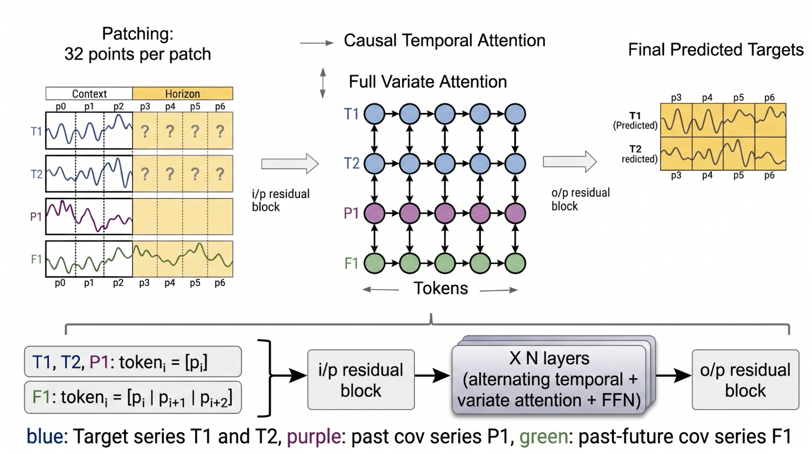
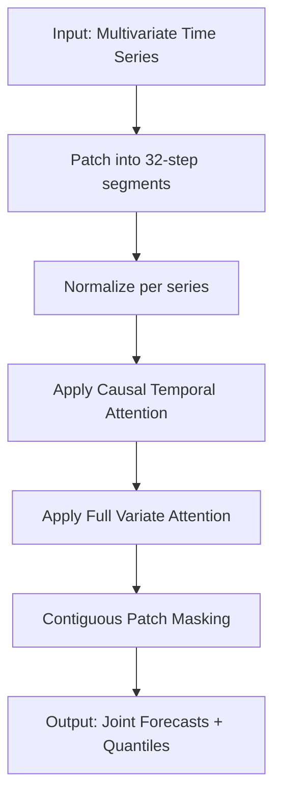
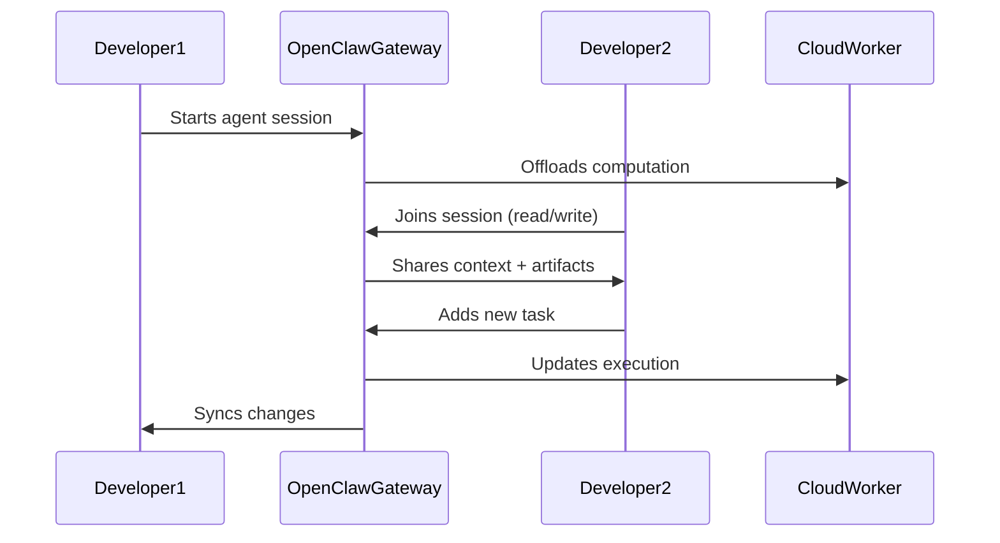

> 🎙️ **Listen to the podcast version of this article:**
> <audio controls src="index.mp3"></audio>

---

> 💡 **TL;DR:** This week, Google AI unveiled TimesFM-3, a 330M-parameter zero-shot foundation model for multivariate time-series forecasting, while OpenClaw 2.0 introduced multiplayer AI coding with shared cloud sessions and enterprise-grade security. Meanwhile, Gradium AI’s new TTS model achieved an 81.0% hard-case pass rate at 216 ms latency, setting a new benchmark for real-time voice synthesis. These advancements signal a shift toward more collaborative, accurate, and scalable AI systems.

| **Metric / Innovation Area**               | **Insight / Takeaway**                                                                                     |
|-------------------------------------------|----------------------------------------------------------------------------------------------------------|
| **TimesFM-3 (Google AI)**                 | 330M-parameter multivariate time-series model; #1 rank on GIFT-Eval, fev-bench, and TIME leaderboards.   |
| **OpenClaw 2.0**                          | Multiplayer AI coding with shared cloud sessions, role-based permissions, and enhanced sandboxing.      |
| **Gradium AI TTS Model**                 | 81.0% hard-case pass rate (5 languages), 216 ms P50 time-to-first-audio, tight 30 ms interquartile spread. |
| **Licensing (TimesFM-3)**                 | Non-commercial, non-production license; TimesFM-2.5 remains Apache-2.0 for production use.               |
| **Enterprise Readiness (OpenClaw 2.0)**   | Supports Docker/Podman sandboxes, approval workflows, and auditing; requires deliberate hardening.        |

---

### Introduction: Curating the Most Compelling AI and Data Science Breakthroughs of the Week

The AI and data science ecosystem is evolving at a breakneck pace, with each week bringing innovations that redefine what’s possible. This week is no exception. We’re witnessing a convergence of advancements in **time-series forecasting**, **collaborative AI development**, and **real-time text-to-speech (TTS) synthesis**—each pushing the boundaries of accuracy, scalability, and usability. 

From Google AI’s **TimesFM-3**, which introduces native multivariate forecasting to its foundation model lineup, to **OpenClaw 2.0’s** bold leap into multiplayer AI coding for enterprises, and **Gradium AI’s** TTS model that balances speed and precision like never before, these developments are not just incremental improvements—they’re paradigm shifts. Below, we dive into the technical depths, practical implications, and future trajectories of these breakthroughs.

---

### 1. Google AI Releases TimesFM-3: A 330M-Parameter Zero-Shot Foundation Model for Multivariate Time-Series Forecasting

#### **Context: The Univariate Limitation**
Time-series forecasting has long been a cornerstone of AI applications, from financial modeling to supply chain optimization. However, most foundation models—including Google’s own **TimesFM-2.5**—have been constrained to **univariate forecasting**: predicting a single series based solely on its historical data. Real-world scenarios, though, are rarely so simple. Consider forecasting ice cream sales: the target isn’t just past sales data but also **foot traffic, weather, promotions, and holidays**—all of which are interdependent variables.

Google AI’s **TimesFM-3** shatters this limitation by introducing **native multivariate forecasting** capabilities. With **330 million parameters** and pretraining on over **1 trillion time points**, TimesFM-3 can jointly forecast multiple related series while incorporating **past covariates** (historical data like foot traffic) and **past-future covariates** (known future events like promotions) in a **zero-shot** manner—no task-specific fine-tuning required.

#### **Architectural Innovations**
TimesFM-3’s architecture is a masterclass in balancing efficiency and expressiveness. Here’s how it works:

1. **Patch-Based Processing**: Contiguous time points are grouped into **patches of 32 steps**, normalized per series to prevent scale dominance. This ensures that series with vastly different magnitudes (e.g., temperature vs. stock prices) are treated equitably.

2. **Dual Attention Mechanisms**:
   - **Causal Temporal Attention**: Operates horizontally across time steps within a series, ensuring strict causality (no future data leakage).
   - **Full Variate Attention**: Operates vertically across series at a given time step, capturing **cross-series correlations** (e.g., how weather affects sales).

   The alternating attention layers enable the model to learn both **temporal dependencies** and **inter-series relationships** simultaneously.

3. **Contiguous Patch Masking (CPM)**: Inspired by **TiRex**, this training strategy masks placeholder tokens for the entire forecast horizon in one forward pass. Past-future covariates remain visible, allowing the model to leverage known future signals (e.g., scheduled promotions). The result? **Faster inference, reduced compounding errors, and simultaneous prediction of all horizon patches**.

   Mathematically, the model outputs **9 quantiles (10th to 90th percentile)** for each target at every horizon step, providing probabilistic forecasts out of the box.

#### **Benchmark Dominance**
TimesFM-3 doesn’t just improve on paper—it **leads the pack** in real-world evaluations. On three major benchmarks:
- **GIFT-Eval** (General-purpose Interactive Forecasting Test)
- **fev-bench** (Forecasting Evaluation Benchmark)
- **TIME Leaderboard** (Temporal Information Mining Evaluation)

TimesFM-3 ranks **#1 among pretrained foundation models** for both **point forecasts** (single-value predictions) and **probabilistic forecasts** (distributions). Notably, it achieves:
- **Rank #1 overall on fev-bench** (100 real-world tasks)
- **Rank #1 overall on TIME** (50 domain datasets, 98 evaluation tasks)
- **Rank #1 among foundation models on GIFT-Eval**

#### **Licensing and Deployment Considerations**
Here’s the catch: while the **TimesFM repository code is Apache-2.0 licensed**, the **TimesFM-3 weights** are released under a **non-commercial, non-production license** (`timesfm-non-commercial-license-v1.0`). This means:
- ✅ **Allowed**: Benchmarking, research, and non-commercial experimentation.
- ❌ **Restricted**: Production deployment or commercial use.

For production-ready multivariate forecasting, **TimesFM-2.5** (Apache-2.0) remains the go-to option. Google’s move reflects a growing trend: **open weights for research, restricted licenses for commercial use**—a balance between innovation and monetization.

#### **Why It Matters**
TimesFM-3’s release signals a shift toward **more realistic, multivariate forecasting** in foundation models. Its zero-shot capabilities mean businesses can **deploy it immediately** without fine-tuning, while its probabilistic outputs provide **uncertainty estimates**—critical for risk-sensitive applications like finance or inventory management. The licensing constraint, however, may push enterprises toward **custom fine-tuning of TimesFM-2.5** or alternative open-source models.

---

### 2. OpenClaw 2.0: Ushering in the Era of ‘Multiplayer’ AI Coding

#### **Context: From Personal Agents to Team Infrastructure**
When **OpenClaw** first emerged, it was a **personal AI coding harness**—a way for individual developers to turn language models into autonomous workers via messaging apps like Telegram or Discord. But as AI agents mature, the focus is shifting from **personal productivity** to **team collaboration**. Enter **OpenClaw 2.0**, a transformative update that reimagines AI coding as a **shared, persistent workspace** for enterprises.

As Peter Steinberger, OpenClaw’s creator, put it:
> *"Multiplayer coding + infinite compute with nodes and cloud sessions has been a game changer for how we build. Local harnesses now feel like relics of the past."*

#### **Key Innovations**
OpenClaw 2.0 introduces a suite of features designed to turn AI agents from **personal tools** into **enterprise infrastructure**:

1. **Shared Cloud Sessions and Multi-User Collaboration**:
   - Agents now operate in **persistent workspaces** that outlive individual terminals or employees.
   - **Multi-user Gateways** track session ownership, participant contributions, and permissions (read-only, draft mode, or direct collaboration).
   - **Typing indicators and presence** mimic real-time collaborative editing tools like Google Docs.

2. **Redesigned Control UI**:
   - Conversations are now the **primary interface**, with threads in a sidebar and the active conversation in the main workspace.
   - **Files, approvals, settings, and live agent activity** are accessible alongside the conversation, blending simplicity with depth.
   - The UI resembles **ChatGPT or Claude**, lowering the barrier for non-technical users while retaining **terminal-level control** for developers.

3. **Enhanced Security and Sandboxing**:
   - **Role-based permissions**: Approvals can be tied to specific requests, commands, sessions, or users.
   - **Sandboxing**: Supports **Docker/Podman containers**, per-agent/per-session scopes, and configurable read-only/read-write access.
   - **Protected Credentials**: A **team-scoped Secret Store** distinguishes protected secrets from ordinary environment data. Supported requests can use **gateway-hosted HTTPS** to avoid exposing credentials to the model.
   - **Auditing**: Expanded logs for execution identity, approvals, session actions, and outbound messages.

4. **Enterprise-Grade Workflows**:
   - **Approval controls**: Commands can require **explicit approval** from administrators or specific roles.
   - **Isolated Execution**: Sessions can run on **paired devices or cloud workers** while maintaining workspace context.
   - **Model Provider Management**: Centralized configuration for **credentials, quotas, and budgets** across multiple LLM providers.

#### **Security: OpenClaw vs. NanoClaw**
OpenClaw 2.0’s security model is **enterprise-oriented but not secure-by-default**. Here’s how it compares to **NanoClaw**, a rival project prioritizing **container-first isolation**:

| **Feature**               | **OpenClaw 2.0**                                                                 | **NanoClaw**                                                                 |
|---------------------------|---------------------------------------------------------------------------------|------------------------------------------------------------------------------|
| **Sandboxing**            | Docker/Podman support; **off by default** (trusts single operator).            | **Container-first**; OS-level isolation by design.                          |
| **Credential Handling**   | Protected Secret Store + gateway-hosted HTTPS substitution.                    | Agent Vault for credential injection; **egress-lockdown mode**.             |
| **Multi-Tenancy**         | **Not supported**; one Gateway = one trust domain.                            | **Isolated by design**; separate containers for each tenant.               |
| **Default Posture**       | **Permissive**; requires deliberate hardening.                                | **Restrictive**; isolation is architectural.                                |

**Key Takeaway**: OpenClaw 2.0 can be **configured** to match NanoClaw’s security, but it requires **explicit effort**. For enterprises needing **strong isolation out of the box**, NanoClaw may still be preferable. However, OpenClaw’s **broader control plane** (UI, auditing, model management) makes it a compelling choice for teams prioritizing **usability and collaboration**.

#### **Why It Matters**
OpenClaw 2.0 represents a **fundamental shift** in how AI agents are deployed:
- **From Personal to Shared**: Agents are no longer tied to individual developers. They become **team infrastructure**, with persistent context and collaborative workflows.
- **From Terminal to Browser**: The new UI makes AI agents accessible to **non-technical users** while preserving depth for engineers.
- **From Ad-Hoc to Governed**: Role-based permissions, approvals, and auditing address **enterprise compliance** concerns.

For companies like **Solvely**, OpenClaw 2.0 has already transformed workflows. As CEO Colin Johnson noted:
> *"The session itself became the handoff document. We were working inside the same context."*

This **context-as-artifact** approach could redefine how teams collaborate on complex projects, reducing friction in **knowledge transfer** and **task handoffs**.

---

### 3. Gradium AI’s New Default TTS Model: 81.0% Hard-Case Pass Rate at 216 ms Latency

#### **Context: The Speed-Accuracy Tradeoff in TTS**
Text-to-speech (TTS) systems have long struggled with a **fundamental tradeoff**: **speed vs. accuracy**. Fast models often mispronounce **hard cases**—phone numbers, emails, IBANs, or technical jargon—while accurate models introduce **unacceptable latency** for real-time applications like voice agents.

Gradium AI’s new default TTS model **shatters this tradeoff**. It achieves:
- **81.0% human-rated pass rate** on a **500-sentence hard-case evaluation set** (spanning English, German, French, Spanish, and Portuguese).
- **216 ms P50 time-to-first-audio** (median latency) on **Coval’s benchmark**, with a **30 ms interquartile range** (P75-P25) over 480 runs.

For comparison, here’s how it stacks up against competitors (all tested in August 2026 with default settings):

| **Model**                          | **Hard-Case Pass Rate** | **P50 Latency (ms)** | **Interquartile Range (ms)** |
|------------------------------------|-------------------------|----------------------|-------------------------------|
| Gradium AI TTS                     | **81.0%**               | **216**              | **30**                        |
| Cartesia Sonic 3.6                 | 75.1%                   | 454                  | 165                           |
| ElevenLabs v3 Conversational       | 65.4%                   | 329                  | N/A                           |
| Fish Audio S2.1 Pro                | 49.5%                   | 291                  | N/A                           |
| Inworld TTS 1.5 Max                 | 46.5%                   | 166                  | N/A                           |

**Key Insight**: Gradium’s model is **not the fastest** (Inworld TTS 2 is faster at 166 ms), but it’s the **only one** combining **sub-250 ms latency** with **>80% hard-case accuracy** and **minimal variance** (30 ms spread).

#### **The Hard-Case Evaluation Set**
Gradium’s benchmark is **rigorous and transparent**:
- **500 sentences** across **10 criteria** in **5 languages** (EN, DE, FR, ES, PT).
- **7 atomic criteria**: Spelling, acronyms, alphanumeric tokens, dates, regular numbers, large/floating numbers, emails.
- **3 composite criteria**: Orders, IT Ticket, Claims (stacking multiple atomic criteria into realistic agent turns).
- **Scoring**: **Strict human evaluation**. A sentence passes **only if every element** (e.g., every digit in a phone number) is pronounced **correctly and completely**. One error = failure.
- **Open-Sourced**: The evaluation set is available on **Hugging Face** under **CC BY 4.0**, enabling third-party validation.

#### **Architectural and Deployment Highlights**
- **No Text Normalization Required**: The model handles **raw text** (e.g., "Call 1-800-123-4567 or email support@example.com") without preprocessing.
- **Seamless Deployment**: The model is **already live** as the default across Gradium’s **API and Studio** (as of August 31, 2026). **No migration needed**—existing voices (including custom clones) continue to work.
- **Latency Breakdown**: The **30 ms interquartile range** is the **tightest** among competitors, meaning **consistent performance** (no unpredictable spikes).

#### **Why It Matters**
Gradium’s TTS model addresses a **critical pain point** in voice AI: **real-time accuracy for high-stakes interactions**. Consider a customer service call where the agent must:
- Read a **16-digit credit card number** without error.
- Spell an **email address** with hyphens and numbers.
- Recite a **reference code** with mixed case and symbols.

Traditional TTS models often **fail these tasks**, leading to **customer frustration** and **operational inefficiencies**. Gradium’s model **eliminates this gap**, enabling:
- **Voice agents** that handle **complex, data-dense interactions** reliably.
- **Real-time applications** (e.g., live transcription, gaming, or accessibility tools) with **sub-250 ms response times**.
- **Multilingual support** without sacrificing accuracy.

The **open evaluation set** is a bonus: it allows researchers and competitors to **replicate and improve** upon Gradium’s benchmarks, fostering **transparency and progress** in TTS development.

---

### Conclusion: Trends Shaping the Future of AI Models, Tools, and Developer Workflows

This week’s breakthroughs—**TimesFM-3, OpenClaw 2.0, and Gradium AI’s TTS model**—highlight three **key trends** reshaping the AI landscape:

1. **From Univariate to Multivariate**: AI models are evolving to handle **real-world complexity**. TimesFM-3’s multivariate forecasting reflects a broader shift toward **context-aware, interconnected systems** that mirror how humans solve problems.

2. **From Personal to Collaborative**: AI agents are no longer **siloed tools** for individual users. OpenClaw 2.0’s multiplayer sessions and enterprise-grade controls signal a move toward **shared, persistent AI workspaces**—where teams, not just individuals, leverage AI to **scale productivity**.

3. **From Tradeoffs to Breakthroughs**: The **speed-accuracy tradeoff** in TTS is just one example of how AI is overcoming **long-standing limitations**. Gradium’s model proves that **latency and precision** can coexist, paving the way for **real-time, high-stakes applications**.

#### **The Road Ahead**
- **For Forecasting**: Expect **more multivariate foundation models** and **hybrid approaches** (e.g., combining TimesFM-3 with fine-tuned domain-specific models). The licensing constraints on TimesFM-3 may also **accelerate open-source alternatives**.
- **For AI Coding**: **Multiplayer agents** will become the norm, with **security and governance** as the next frontiers. OpenClaw 2.0’s **control plane** could inspire **new enterprise-grade AI platforms**.
- **For TTS**: The focus will shift to **edge deployment** (on-device TTS) and **ultra-low-latency** applications (e.g., **<100 ms** for gaming or AR/VR). Gradium’s open evaluation set may **standardize TTS benchmarks** industry-wide.

As these technologies mature, the line between **human and AI collaboration** will continue to blur—ushering in an era where **AI isn’t just a tool, but a teammate**.

Written with [Argos](https://github.com/Neilstid/argos)
