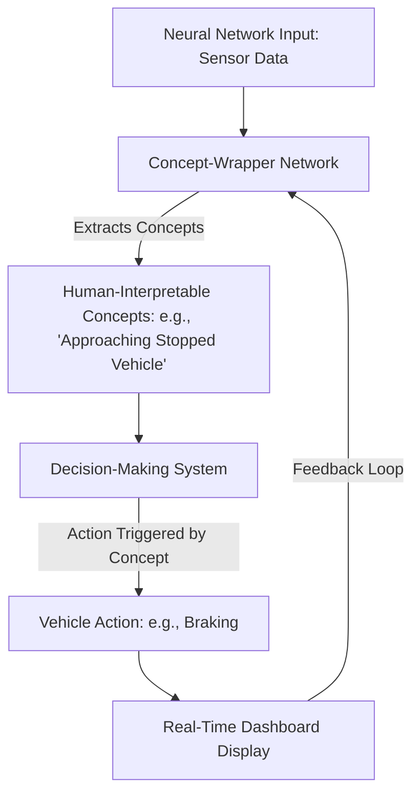
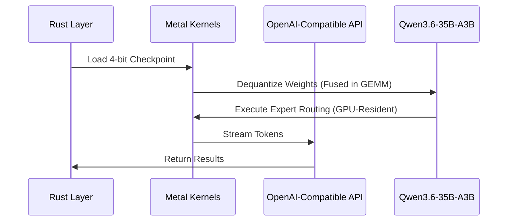
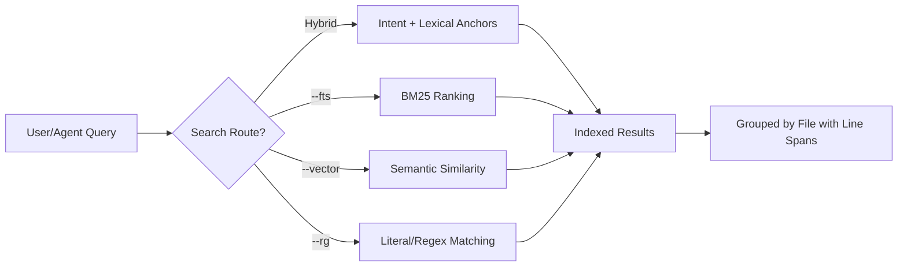

> 🎙️ **Listen to the podcast version of this article:**
> <audio controls src="index.mp3"></audio>

---

> 💡 **TL;DR:** This article dives into three transformative AI innovations: Motional and MIT’s real-time explainable AI for self-driving cars (CW-Net), Perplexity’s open-source Lily engine for high-performance local LLM inference on Apple Silicon, and Qwen’s zg tool, which unifies ripgrep, BM25, and vector search into a single local-first interface. These advancements tackle transparency, efficiency, and workflow integration, respectively, marking significant strides in AI for autonomous systems, NLP, and developer productivity.

| Metric / Innovation Area | Insight / Takeaway |
|--------------------------|-------------------|
| **Explainable AI (Motional & MIT)** | CW-Net translates neural network logic into human-readable concepts (e.g., "Approaching Stopped Vehicle") with <1% performance trade-off, enabling real-time transparency for autonomous vehicles. |
| **Local LLM Inference (Perplexity Lily)** | Rust + Metal engine achieves 1.23x prefill and 1.35x decode throughput vs. MLX-LM on M5 Max, specializing for Qwen3.6-35B-A3B with GPU-resident routing and fused dequantization. |
| **Unified Search (Qwen zg)** | Combines ripgrep, BM25, and vector search in one tool, cutting tool calls by 40-50% and tokens by ~37% in benchmarks, with on-device embeddings and strict authorization gates. |

---

### Explaining the Black Box: Motional and MIT's Real-Time Self-Driving AI Explanations

The "black box" problem in AI has long been a stumbling block for autonomous vehicles (AVs). While neural networks excel at processing vast amounts of driving data to make split-second decisions, their internal reasoning remains opaque—even to the engineers who design them. This lack of transparency is a critical barrier to widespread adoption, as passengers, regulators, and safety operators demand to understand *why* a vehicle brakes suddenly or swerves unexpectedly. Enter **Motional and MIT’s Concept-Wrapper Network (CW-Net)**, a system that bridges the gap between machine logic and human comprehension.

#### The Need for Transparency in Autonomous Vehicles
Autonomous driving systems today rely heavily on end-to-end deep learning models trained on petabytes of data. These models achieve impressive performance, but their decision-making processes are often inscrutable. As Laura Major, CEO of Motional, notes, *"The general end-to-end only approach can get to a really good 80-90 percent—maybe even 95 percent—solution, but that’s not good enough to remove a driver or to earn the trust of cities, communities, and customers."* The stakes are high: a single unexplained error could erode public trust or lead to catastrophic outcomes. CW-Net addresses this by converting the internal calculations of a self-driving system’s neural network into **human-interpretable concepts** like *"Approaching Stopped Vehicle"* or *"Close to Cyclist."* These concepts are not post-hoc explanations but **causally faithful** triggers—meaning the vehicle’s actions are *directly* tied to them.

#### How CW-Net Works: From Model Decisions to Natural-Language Explanations
CW-Net operates by embedding human-readable concepts into the decision-making pipeline of the AV. Unlike traditional explainable AI (XAI) methods that generate natural-language explanations *after* a decision is made (which can be misleadingly plausible but inaccurate), CW-Net ensures that the vehicle’s final actions are *directly* influenced by these concepts. This causal link guarantees that explanations are not just correlated with decisions but are their root cause. For example, if the system brakes hard, the dashboard can display the exact concept—*"Hallucinated Stopped Vehicle Ahead"*—that triggered the action.

The system was tested rigorously on public roads in Las Vegas, where it uncovered critical insights. In one case, an AV repeatedly stopped near a traffic cone, leading engineers to initially assume the cone was the cause. CW-Net revealed the true culprit: the model was *hallucinating* a stopped vehicle ahead, a flaw traced back to its training data. In another instance, the AV stopped for a cyclist, but CW-Net showed the primary planner wasn’t actually using the cyclist’s presence as input—the braking was handled by a backup safety system. These revelations enabled faster debugging and more precise safety protocols.

#### Real-World Implications and User Trust
The operational benefits of CW-Net extend beyond debugging. Safety operators can now distinguish between *intended* behaviors and system faults with unprecedented clarity, reducing response times and improving incident reporting. Regulators, too, are increasingly demanding transparency in AI-driven systems, and tools like CW-Net could soon become a baseline requirement for AV deployment. Beyond passenger vehicles, the technology has applications in **autonomous drones** and **robotic surgery**, where understanding an AI’s reasoning is non-negotiable.

The performance cost of adding explainability? Less than 1% in driving capability benchmarks—a negligible trade-off for the gains in trust and safety. As Motional’s research demonstrates, explainability doesn’t have to come at the expense of performance.

---

### High-Performance Local LLM Inference: Perplexity's Open-Source Lily Engine

Running large language models (LLMs) locally has long been a challenge, particularly for models with tens of billions of parameters. Traditional frameworks like PyTorch or MLX offer flexibility but often sacrifice speed due to their general-purpose design. **Perplexity’s Lily engine** flips this script by specializing for a single model—**Qwen3.6-35B-A3B**—on a single hardware family: **Apple Silicon**. The result? A **Rust + Metal** powerhouse that outpaces MLX-LM in both prefill and decode throughput.

#### Overview of Lily and Its Rust + Metal Architecture
Lily is a **single-process runtime** designed for one task: running Qwen3.6-35B-A3B as efficiently as possible on Apple’s M-series chips. It eschews PyTorch and MLX entirely, opting instead for hand-written **Metal kernels** that execute the model directly. This specialization allows Lily to optimize every layer of the stack, from weight loading to token generation. The engine supports an **OpenAI-compatible chat-completions API**, making it seamless to integrate with existing workflows.

Key architectural choices include:
- **Groupwise affine 4-bit quantization**: Compresses 70 GB of bfloat16 weights into 19.4 GB, with dequantization fused into the grouped GEMM (General Matrix Multiplication) operation to avoid memory bottlenecks.
- **GPU-resident expert routing**: For Qwen3.6-35B-A3B’s Mixture of Experts (MoE) layers, Lily keeps routing computations on the GPU, eliminating CPU synchronization overhead.
- **Concurrent Metal passes**: Decode steps launch hundreds of kernels, and Lily overlaps independent operations to maximize throughput.

#### Benchmark Results: Prefill and Decode Throughput on M5 Max
On a **40-core, 128 GB M5 Max**, Lily delivers impressive gains over MLX-LM:
- **Prefill throughput**: 1.23x faster on average (4,156 tokens/s vs. 3,388 tokens/s).
- **Decode throughput**: 1.35x faster on average (170.0 tokens/s vs. 126.4 tokens/s).
- **Peak performance**: At 4K prompt and 4K context, Lily reaches **5,749.9 tokens/s prefill** and **186.6 tokens/s decode**, compared to MLX-LM’s 4,737.5 and 140.9, respectively.

The biggest wins come from:
- **GPU-resident expert routing**: +89% prefill speed at 512 tokens.
- **Fused dequantization in GEMM**: +77.4% prefill speed.
- **GQA (Grouped Query Attention) packing**: +23.8% decode speed at 32K tokens.
- **Fixed-block attention layout**: +40.2% decode speed at 128K tokens.

Lily’s perplexity is just **0.04% higher** than MLX-LM’s, with the same top-ranked token **96.35% of the time**—proof that specialization doesn’t sacrifice accuracy.

#### Impact on Developers Running Large Models Locally
For developers, Lily offers a compelling alternative to cloud-based inference. The **4-bit checkpoint** (19.4 GB) fits comfortably on a Mac with 32 GB of unified memory, and the engine’s **minimal OpenAI-compatible API** makes it easy to deploy. While Lily is currently tailored for Qwen3.6-35B-A3B, its design principles—**narrow scope, deep optimization**—could inspire similar engines for other models and hardware.

The trade-off? Lily’s specialization means it won’t run other models or architectures out of the box. But for those prioritizing speed and efficiency for Qwen3.6-35B-A3B on Apple Silicon, it’s a game-changer. As Perplexity’s Hybrid Compute product demonstrates, local inference is becoming a viable alternative to cloud-based solutions, especially for latency-sensitive applications.

---

### zg (zvec-grep): Unifying Text, BM25, and Vector Search in One Local Tool

Search is a fundamental operation in NLP and data science workflows, but it’s often fragmented. Developers juggle **ripgrep** for exact matches, **BM25** for keyword ranking, and **vector search** for semantic similarity—each requiring separate tools, indexes, and integrations. **Qwen’s zg (zvec-grep)** consolidates these into a **single, local-first search layer**, streamlining workflows for both humans and AI agents.

#### Why a Unified Search Layer Matters
Coding agents, for example, spend a significant portion of their tool budget on search. When the target is a known symbol, ripgrep provides exact matches. But when the target is a behavior described in plain language, keyword matching often fails, forcing agents to guess terms, read entire files, or assemble context manually—all of which are costly in terms of tool calls, tokens, and time. zg eliminates this friction by offering **four retrieval routes** under one interface:
1. **Hybrid default**: Combines intent (vector search) with lexical anchors (BM25).
2. **--fts**: Pure BM25-ranked exact terms.
3. **--vector**: Conceptual similarity without lexical ranking.
4. **--rg**: Exhaustive literal or regex matching (no index required).

#### Key Features: Tiny MCP Surface, On-Device Embedding Catalog, Authorization Gate
zg’s design is deliberately minimalist. The **Model Context Protocol (MCP) surface** exposes only two tools by default:
- `zvec_grep_search`: For when the intent is known but the exact string isn’t.
- `zvec_grep_rg`: For when a symbol, path, or regex is known.

Index lifecycle (create, drop, status) is handled via the CLI, ensuring agents cannot silently modify persistent indexes. This restraint reduces complexity and prevents unintended side effects.

The **embedding catalog** supports **10 local models** (e.g., `potion-code-16m-v2`, `jina-embeddings-v2-base-code`) and **3 remote Qwen endpoints** (e.g., `qwen3.7-text-embedding`). Remote embeddings require explicit authorization via `--allow-remote` or a signed workspace grant (`zg auth grant`), ensuring data privacy. The default model, `potion-code-16m-v2`, is a **static Model2Vec** with 256-dimensional output and no GPU dependency.

#### Use Cases: Hybrid Retrieval, Developer Productivity
zg’s unified approach shines in **hybrid retrieval** scenarios, where both semantic and lexical signals are critical. In benchmarks:
- **SWE-QA-Bench (20 questions)**: Tool calls dropped by **>50%**, input tokens by **~46%**, and Judge score **increased by 1.50 points**.
- **BrowseComp-Plus (80 questions)**: Accuracy improved from **98.67% to 99.00%**, while input tokens fell by **37.56%**, tool calls by **43.52%**, and agent time by **38.58%**.
- **Django repository (3,457 files)**: Indexing completed in **<30 seconds** on an Apple M4 Pro.

For developers, zg accelerates workflows by reducing the need to switch between tools. For AI agents, it minimizes token usage and tool calls, making autonomous coding and analysis more efficient. The tool is **npm-installable** (`@zvec/zvec-grep`), works on macOS/Linux/Windows, and requires **Node.js 22+** (no GPU needed for the default model).

---

### Conclusion and Takeaways

The innovations highlighted in this article—**Motional and MIT’s CW-Net, Perplexity’s Lily, and Qwen’s zg**—represent a trifecta of progress in AI: **transparency, efficiency, and integration**. Each addresses a critical pain point:

1. **Explainable AI for Autonomous Systems**: CW-Net demonstrates that interpretability can coexist with high performance, paving the way for safer, more trustworthy AVs and other safety-critical applications.
2. **High-Performance Local Inference**: Lily proves that specialization can unlock unprecedented speed, making local LLM inference a viable alternative to cloud-based solutions.
3. **Unified Search Workflows**: zg eliminates the fragmentation in search tools, offering a seamless, local-first solution for developers and AI agents alike.

These advancements are particularly impactful in **computer vision** (e.g., AVs) and **NLP** (e.g., LLMs, search), but their implications extend far beyond. As AI systems become more complex and integrated into our daily lives, the ability to **understand, optimize, and unify** their operations will be paramount. The future of AI isn’t just about bigger models or more data—it’s about **smarter, more transparent, and more efficient systems** that work for us, not against us.

Written with [Argos](https://github.com/Neilstid/argos)
