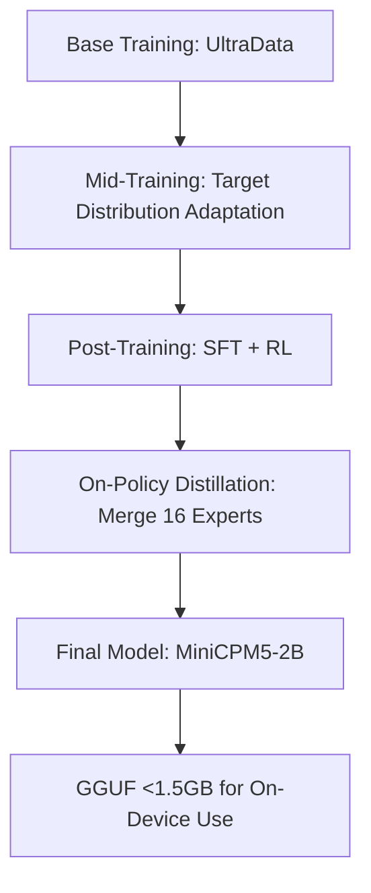
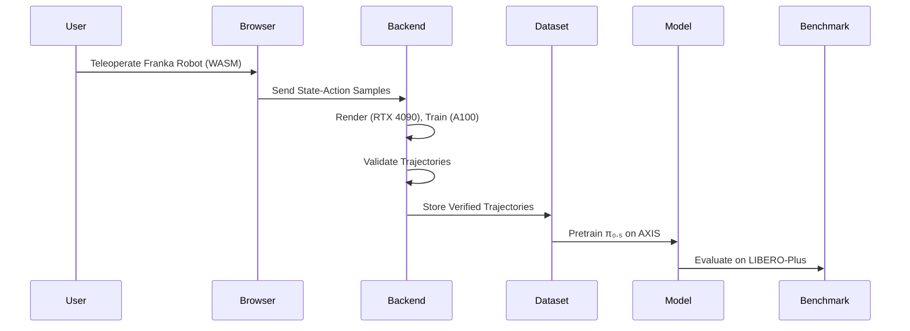

> 🎙️ **Listen to the podcast version of this article:**
> <audio controls src="index.mp3"></audio>


---

> 💡 **TL;DR:** This article highlights three transformative AI innovations: **MiniCPM5-2B**, a 2.52B-parameter language model outperforming larger models in tool use and coding; **Reducto r-1**, a single-pass document parser reducing errors by 20% at 1 cent per page; and **AXIS**, a browser-based robotics data engine enabling scalable, crowd-sourced demonstration collection with 50,129 verified trajectories. Together, they redefine efficiency in NLP, document processing, and robotics.

| **Metric / Innovation Area**               | **Insight / Takeaway**                                                                                     |
|-------------------------------------------|----------------------------------------------------------------------------------------------------------|
| **Model Size & Performance**              | MiniCPM5-2B (2.52B params) averages **53.9** across 34 benchmarks, surpassing Qwen3.5-4B (51.1).          |
| **Context Window**                         | Native **131K token** context window, ideal for long-form reasoning and retrieval.                        |
| **On-Device Efficiency**                  | GGUF builds start at **<1.5 GB**, enabling deployment on edge devices.                                   |
| **Document Parsing Accuracy**              | Reducto r-1 reduces errors by **20%** while cutting costs to **1 cent/page** (vs. 3–6 cents previously).   |
| **Robotics Data Scalability**             | AXIS delivers **207 tasks** and **50,129 trajectories**, boosting pretraining performance by **+4.9 points**. |
| **Cost Efficiency**                        | r-1 consolidates OCR, layout detection, and grounding into **one pass**, eliminating multi-stage pipelines. |
| **Training Innovation**                    | MiniCPM5-2B uses **on-policy distillation** to merge 16 expert models into one checkpoint.               |

---

### Introduction: The Next Wave of AI and Data Science Breakthroughs

The AI landscape is evolving at a breakneck pace, with innovations in **natural language processing (NLP)**, **computer vision**, and **robotics** redefining what’s possible—both in terms of performance and accessibility. This month, three standout advancements have captured the attention of researchers and practitioners alike: **MiniCPM5-2B**, a compact yet formidable language model; **Reducto r-1**, a paradigm-shifting document parser; and **AXIS**, a browser-based data engine for robotics. Each of these breakthroughs addresses longstanding challenges in their domains—**efficiency, cost, and scalability**—while opening new avenues for real-world deployment.

What ties these innovations together is their focus on **practicality without compromise**. MiniCPM5-2B proves that smaller models can outperform larger ones in specialized tasks. Reducto r-1 demonstrates how consolidating complex pipelines can slash costs and errors. AXIS, meanwhile, shows how moving data collection to the browser can democratize robotics research. Together, they signal a shift toward **leaner, more agile AI systems** that don’t sacrifice capability for deployability.

---

### MiniCPM5-2B: A 2.52B-Parameter Powerhouse for On-Device AI

#### **Context: The Rise of Compact, High-Performance Models**
The AI community has long grappled with a trade-off: **model size versus performance**. Larger models like Qwen3.5-4B or Gemma-4-E4B-it dominate benchmarks but are resource-intensive, limiting their deployment on edge devices. OpenBMB’s **MiniCPM5-2B** challenges this narrative by delivering **state-of-the-art results in tool use, coding, and long-context retrieval**—all while fitting into a **2.52-billion-parameter** footprint. With a native **131,072-token context window**, it’s designed for applications where **memory efficiency** and **real-time inference** are critical.

#### **Tech Deep Dive: Architecture and Training Innovations**
MiniCPM5-2B employs a **standard LlamaForCausalLM architecture** with **42 layers**, **grouped-query attention (16 query heads, 2 key/value heads)**, and a **native context window of 131K tokens**. This design ensures compatibility with mainstream inference engines like **vLLM, SGLang, llama.cpp, Ollama, and MLX**—no custom kernels required. The model’s training pipeline is equally impressive:

1. **Base Training**: Uses **UltraData**, a tiered data management method, with stable and decay phases to refine the model’s foundational knowledge.
2. **Mid-Training**: Adapts the model to the target data distribution, preparing it for specialized tasks.
3. **Post-Training**: Combines **400B tokens of deep-thinking supervised fine-tuning (SFT)** with **reinforcement learning (RL)** using the **critic-based JustRL II algorithm**. The final step, **on-policy distillation (OPD)**, merges **16 expert models** (including 5 agentic ones) into a single checkpoint. The OPD process computes **reverse KL divergence** between student and teacher logits to estimate advantages, replacing verification-based methods.

The model’s performance is validated across **34 benchmarks**, where it averages **53.9**, outperforming **Qwen3.5-4B (51.1)**. Its strengths are particularly pronounced in:
- **Tool Use**: 97.1 on τ²-Bench Telecom, 66.6 on BFCL v4, and 20.8 on τ³-Bench Banking (vs. 6.8 for baselines).
- **Code Reasoning**: 69.1 on LiveCodeBench v6 (vs. 56.4) and 46.4 on SWE-bench Verified (vs. 33.6).
- **Long-Context Retrieval**: 68.1 on NoLiMa (vs. 43.5), though it trails slightly on AA-LCR (59.0 vs. 61.0).

#### **Why It Matters: On-Device AI for the Masses**
MiniCPM5-2B’s **GGUF builds start at just 1.56 GB**, making it a viable option for **on-device deployment** in smartphones, IoT devices, and edge servers. Its **Apache 2.0 license** and compatibility with popular frameworks (e.g., Transformers, llama.cpp) further lower the barrier to adoption. For developers, this means:
- **Lower Latency**: No need for cloud-based inference, reducing dependency on network connectivity.
- **Cost Savings**: Reduced reliance on GPU-heavy infrastructure.
- **Privacy**: Sensitive data can be processed locally, addressing concerns about cloud-based AI.

The model’s **open datasets** (e.g., Ultra-FineWeb, UltraData-Code, UltraData-RL-2609) and **intermediate checkpoints** (Base, Midtrain, SFT-only) also enable researchers to **reproduce, audit, and build upon** its training process—a rare level of transparency in the LLM space.



**Future Outlook**: MiniCPM5-2B sets a new benchmark for **compact, high-performance models**. As on-device AI becomes more prevalent, we can expect further optimizations in **quantization, pruning, and distillation techniques** to push the boundaries of what’s possible on resource-constrained hardware.

---

### Reducto r-1: Single-Pass Document Parsing at 1 Cent Per Page

#### **Context: The Fragmented State of Document Parsing**
Document parsing has traditionally been a **multi-stage, multi-model process**, with separate steps for **OCR, layout detection, table extraction, and formatting**. This approach is not only **slow** but also **error-prone**, as each stage introduces potential inaccuracies. For industries like **finance, legal, and healthcare**, where precision is paramount, these pipelines can become a bottleneck—both in terms of **cost** (3–6 cents per page) and **complexity**.

Reducto’s **r-1** model disrupts this paradigm by consolidating **all parsing tasks into a single pass**, reducing errors by **20%** and slashing costs to **1 cent per page**.

#### **Tech Deep Dive: How r-1 Works**
r-1 is a **single-pass model** that handles:
- **Digital text, scans, and handwriting**
- **Table structure extraction** (including merged cells and nested headers)
- **Layout resolution** (columns, headers, footers, sidebars, reading order)
- **Figure detection** with generated descriptions
- **Formatting preservation** (headings, lists, bold, underlines, strikethroughs)
- **Grounding** via page-relative bounding boxes

The model replaces Reducto’s legacy **multi-stage agentic pipeline**, which previously relied on **separate OCR, layout detection, and post-processing steps**. By unifying these tasks, r-1 eliminates **latency overhead** and **orchestration complexity**, making it ideal for **high-volume, high-accuracy** use cases.

#### **Performance and Pricing**
- **Error Reduction**: 20% fewer errors compared to Reducto’s own legacy pipelines (note: this is **not** a third-party benchmark).
- **Cost**: Flat **1 cent per page**, with no feature multipliers or credit costs.
- **Deployment**: Available via **Reducto’s V3 Parse API** (no open weights or self-hosting options yet).

For teams migrating from legacy systems, r-1 offers a **seamless transition path**. Existing Parse requests continue to work (defaulting to legacy models unless `settings.model: "r-1"` is specified), and **agentic processing** remains available for **custom prompts or advanced chart extraction**.

```python
# Example: Invoking r-1 via Reducto's Parse API
result = client.parse.run(
    input=upload.file_id,
    settings={"model": "r-1"}
)
```

#### **Why It Matters: Simplifying Document AI**
Reducto r-1 addresses two critical pain points in document parsing:
1. **Accuracy**: Fewer errors mean **higher reliability** for downstream tasks like **contract analysis, invoice processing, and compliance checks**.
2. **Cost**: At **1 cent per page**, it’s **6x cheaper** than legacy pipelines, making large-scale digitization projects **financially viable**.

The model’s **single-pass design** also reduces **operational complexity**. Instead of managing multiple vendors (e.g., Amazon Textract, Azure Document Intelligence) and post-processing steps, organizations can rely on **one API call** to get **structured, grounded, and formatted** output.

**Future Outlook**: Reducto has hinted at **r-1 mini** (for speed/cost-sensitive workloads) and **automatic per-page routing** (to dynamically select the best model for each page). These advancements could further **democratize high-accuracy document parsing**, making it accessible to **smaller businesses and startups**.

---

### AXIS Robotics: A Browser-Based Data Engine for Scalable Robot Manipulation

#### **Context: The Data Bottleneck in Robotics**
Robotics research has long suffered from a **data scarcity problem**. Unlike NLP or computer vision, where datasets like **Common Crawl** or **ImageNet** provide vast training corpora, **robot manipulation datasets** are **small, static, and expensive** to produce. Traditional approaches rely on **expert operators** collecting demonstrations in **lab environments**, a process that is **slow, centralized, and difficult to scale**.

**AXIS (Autonomous eXploration and Interaction System)** flips this model on its head by moving **demonstration collection to the browser** and offloading **heavy computation to backend GPUs**. The result? A **continually expanding dataset** with **207 tasks** and **50,129 verified Franka trajectories**—all collected without requiring **local GPUs or physical robots**.

#### **Tech Deep Dive: How AXIS Works**
AXIS’s architecture is built on **asymmetry**:
- **Frontend (Browser)**: Contributors teleoperate a **Franka Research 3 robot** with a **parallel-jaw gripper** using a **MuJoCo WebAssembly (WASM) frontend**. Inputs can come from **keyboard, mouse, virtual joystick, or gamepad**. Physics stepping and **Three.js rendering** run off the **React UI thread**, ensuring **low-latency interaction**.
- **Backend (GPUs)**: **Rendering** (8x RTX 4090 GPUs), **training**, and **evaluation** (8x A100 GPUs) are handled remotely.

Tasks are **generated programmatically** using **TaskGen**, which:
1. Decomposes a **language instruction** into **task, scene, and object configs**.
2. Retrieves or generates **3D meshes** via an **image-to-3D pipeline**.
3. Rescales objects to **plausible physical sizes** and proposes a **2.5D layout**.
4. Validates the scene using a **layout supervisor**, which relocates or reorients objects if constraints fail.

Each task includes a **structured success checker**, which the backend re-runs to ensure **data quality**.

#### **Dataset and Performance**
The current AXIS dataset includes:
- **207 tasks**
- **50,129 episodes**
- **>60K task or scene variants** across **7 scene categories**
- **Trajectory data**: Task metadata, robot/object states, actions, success labels, and **RGB-D observations** (third-view + wrist cameras).

**Data Cleaning**: To ensure high-quality trajectories, AXIS applies:
- **Static sample filtering**: Drops samples with joint variation < **5e-3**.
- **Smoothing**: Uses a **Savitzky-Golay filter** (window=15, polynomial order=3) for continuous motion.
- **Resampling**: Converts from **6 Hz to 20 Hz** using **cubic splines**.

The trade-offs are transparent:
- **Mean acceleration** drops from **1.3539 to 0.4885** (63.9% reduction).
- **Mean jerk** drops from **11.5899 to 2.2243** (80.8% reduction).
- **Replay success** falls from **100% to 86.2%** (due to smoothing).

#### **Benchmark Results: Pretraining on AXIS**
AXIS’s impact is best illustrated by its **pretraining performance** on **LIBERO-Plus**:
- **Baseline (π₀.₅)**: 83.9 overall score.
- **π₀.₅ + AXIS-100%**: **88.8** (+4.9 points).
- **Volume-matched RoboCasa365 control**: **57.5** (showing AXIS’s superiority isn’t just due to data volume).

**Scaling Results**:
- **AXIS-25%**: 84.7
- **AXIS-50%**: 85.7
- **AXIS-100%**: 88.8

**Per-Axis Gains**:
- **Sensor Noise**: +13.7
- **Camera**: +11.3 (though it dips at AXIS-50% before recovering)
- **Background**: +3.7
- **Robot Pose**: +3.8
- **Layout**: +2.6
- **Light/Language**: **Regress** (-1.7 and -1.3, respectively).



#### **Why It Matters: Democratizing Robotics Research**
AXIS addresses three major challenges in robotics:
1. **Scalability**: By moving data collection to the browser, AXIS enables **crowd-sourced contributions** from **>70,000 community members** (so far).
2. **Cost**: No need for **local GPUs or physical robots**, lowering the barrier to entry for researchers.
3. **Continual Learning**: Unlike static datasets, AXIS is designed to **keep growing**, ensuring models can **continuously improve** with new data.

The **2.36 TB dataset** (gated for non-commercial academic use) is a **game-changer** for researchers working on **imitation learning, reinforcement learning, and multi-modal robotics**. While the **training code is public** (as a patch over **OpenPI**), the lack of **policy checkpoints** means the community will need to **build upon the raw data**—a small trade-off for the **unprecedented scale** AXIS offers.

**Future Outlook**: AXIS’s **browser-based approach** could inspire similar **web-first data collection** methods in other domains (e.g., **autonomous driving, AR/VR**). As the dataset grows, we may see **even larger performance gains** in **generalizable robot manipulation**, bringing us closer to **true "robot foundation models."**

---

### Conclusion: A New Era of Efficiency in AI

The common thread across **MiniCPM5-2B, Reducto r-1, and AXIS** is **efficiency**—whether in **model size, cost, or data collection**. These innovations prove that **bigger isn’t always better**; instead, **smarter design, consolidation, and scalability** can yield **breakthrough performance** without proportional increases in resources.

- **MiniCPM5-2B** shows that **small models can punch above their weight** in specialized tasks, making **on-device AI** a reality.
- **Reducto r-1** demonstrates that **simplifying pipelines** can **reduce errors and costs** simultaneously.
- **AXIS** proves that **crowd-sourced, browser-based data collection** can **accelerate robotics research** at an unprecedented scale.

As these technologies mature, we can expect a **paradigm shift** in how AI is **developed, deployed, and democratized**. The future of AI isn’t just about **bigger models or more data**—it’s about **working smarter, not harder**.

Written with [Argos](https://github.com/Neilstid/argos)
