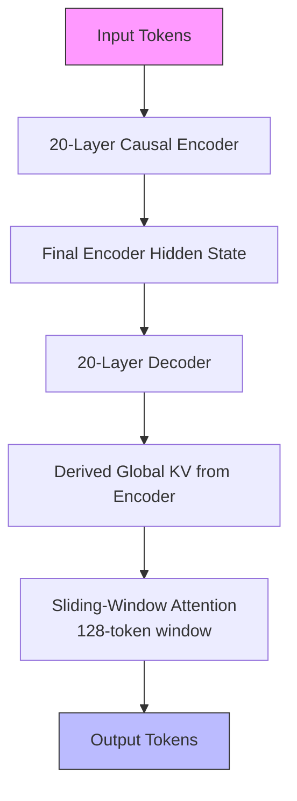
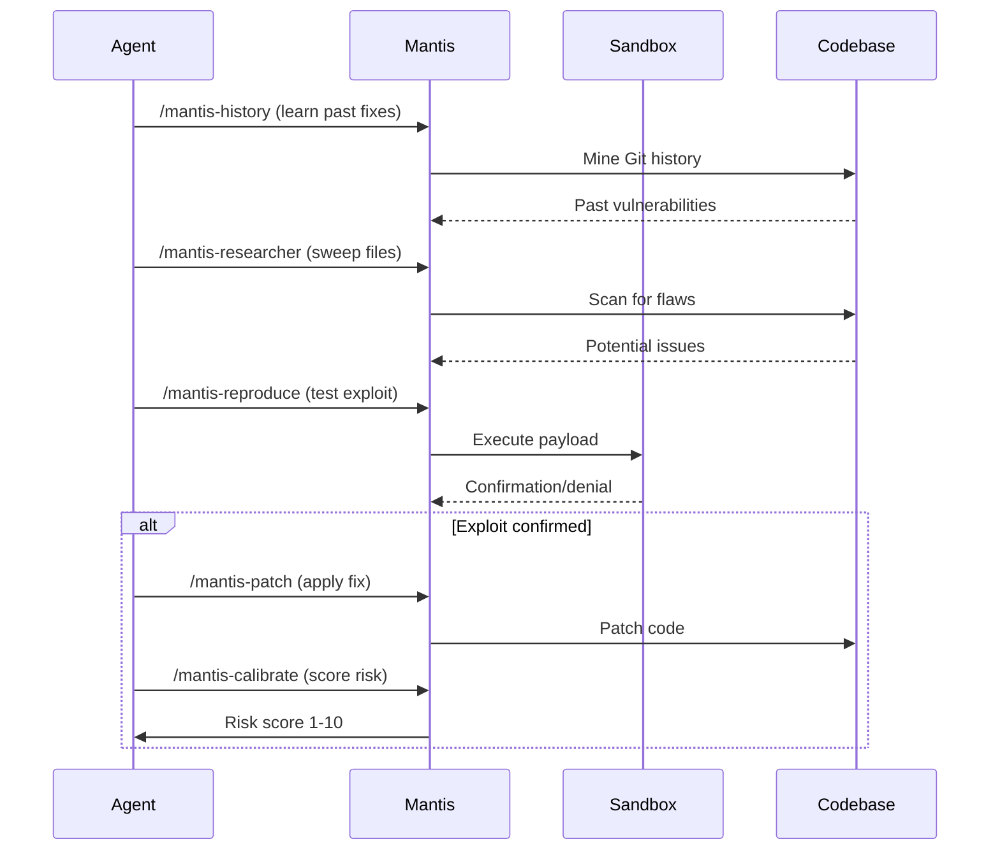
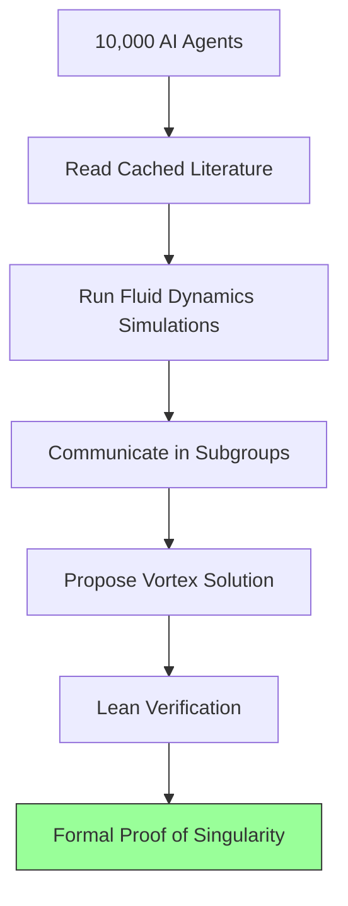
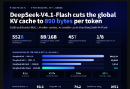
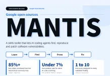
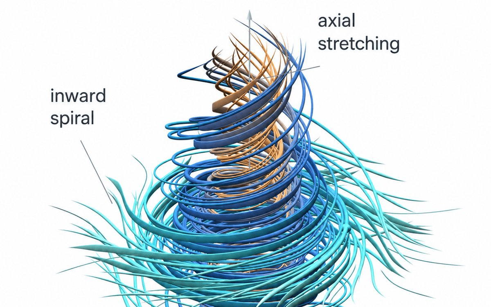

> 🎙️ **Listen to the podcast version of this article:**
> <audio controls src="index.mp3"></audio>

---

> 💡 **TL;DR:** This week, AI pushed boundaries in scalability, security, and scientific discovery. DeepSeek-V4.1-Flash introduced a 1M-token context window with FP4 KV cache compression and cross-layer attention reuse, slashing memory costs. Google open-sourced Mantis, a modular toolkit enabling AI coding agents to autonomously handle the full vulnerability lifecycle. Meanwhile, OpenAI’s 10,000-agent system solved a 90-year-old Navier-Stokes problem with formal Lean verification, signaling a new era of AI-driven research.

| **Metric / Innovation Area**               | **Insight / Takeaway**                                                                                     |
|-------------------------------------------|---------------------------------------------------------------------------------------------------------|
| **Context Window**                        | DeepSeek-V4.1-Flash achieves 1M tokens with 890 bytes/token KV cache (437x smaller than DeepSeek-V1).   |
| **KV Cache Efficiency**                   | FP4 quantization + cross-layer attention reuse reduces storage to ~1/8th of V4-Flash.                  |
| **Multi-Agent Math Breakthrough**         | 10,000 agents solved Navier-Stokes in 88 hours with Lean-verified proof.                                |
| **DevSecOps Automation**                  | Mantis toolkit automates vulnerability detection, reproduction, patching, and re-testing in sandboxed environments. |
| **Benchmark Performance**                 | DeepSeek-V4.1-Flash outperforms Opus-5 and GPT-5.6 Sol on Terminal-Bench 2.1 (90.6) and DeepSWE v1.1 (74.2). |

---

### I. Why This Week’s AI Advancements Matter: A Blogger’s Roadmap

The past seven days have delivered a trifecta of AI milestones that collectively redefine what’s possible in scalability, security, and scientific inquiry. These aren’t incremental tweaks—they’re architectural leaps that address long-standing bottlenecks while opening doors to entirely new paradigms.

For developers, DeepSeek’s innovations in context length and memory efficiency mean that long-horizon tasks—think multi-turn agentic workflows or document-level reasoning—are no longer constrained by hardware limits. For security engineers, Google’s Mantis toolkit offers a glimpse into a future where AI doesn’t just *find* vulnerabilities but *fixes* them with verifiable precision. And for researchers, OpenAI’s multi-agent Navier-Stokes solution proves that AI can now tackle problems once reserved for human mathematicians, complete with formal verification.

These advancements share a common thread: **autonomy**. Whether it’s an LLM managing its own KV cache footprint, an agent patching code without human oversight, or a swarm of models collaborating on a proof, the theme is clear—AI is transitioning from assistant to investigator, from tool to co-pilot.

---

### II. DeepSeek V4.1-Flash: 1M Context, FP4 KV Cache, and Cross-Layer Attention Reuse

DeepSeek AI’s latest release, **V4.1-Flash**, is a masterclass in addressing the most pressing bottleneck in modern LLM deployment: **memory**. As models scale to million-token contexts, the Key-Value (KV) cache—once a minor footnote—has ballooned into a primary constraint, straining HBM, SSD capacity, and bandwidth. V4.1-Flash tackles this head-on with a suite of innovations that redefine efficiency without sacrificing performance.

#### A. Breaking the million-token barrier for LLMs

The headline feature is the **1M-token context window**, a first for a production-ready model. But the real story is how DeepSeek achieves this without collapsing under memory pressure. The model’s **552B backbone parameters** (plus 196B Engram parameters) activate only **8B parameters per token during prefill** and **16B during decode**, a feat enabled by its **Causal Encoder-Decoder (CED)** architecture.

Here’s the breakthrough: The 40-layer backbone splits into a **20-layer causal encoder** and a **20-layer decoder**. Inspired by [YOCO](https://arxiv.org/abs/2402.18870), the decoder **does not compute its own global KV cache**. Instead, per-layer projection weights derive it from the encoder’s final hidden state. This means **prompt tokens stop at the encoder**, nearly halving prefill compute. Sliding-window attention (SWA) with a 128-token window persists in every layer, but decoder SWA states are rebuilt by replaying only the last 128 tokens—a technique dubbed **Decoder SWA Bounded Replay**.

The result? A **global KV cache footprint of just 890 bytes per token**—about **1/4 of DeepSeek-V4-Flash** and **437x smaller than DeepSeek-V1**. For context, this is the difference between a cache that fits in a thimble and one that requires a swimming pool.

#### B. FP4 KV cache storage at one-eighth the cost

DeepSeek-V4.1-Flash introduces **FP4 quantization** for the main KV cache, using **E2M1 with one E4M3 scale per 16 channels** (a variant of [NVFP4](https://arxiv.org/abs/2311.14555) without its global scale). This quantization is fine-tuned via **quantization-aware training in post-training**, nearly halving storage compared to V4’s FP8 cache.

But the savings don’t stop there. **Compressed Sparse Attention 2 (CSA2)** attacks cache size along the *layer axis* by statically assigning each layer one of three modes:
- **Full**: Computes its own main KV, projects indexer K, and selects fresh Top-512 indices.
- **Reindex**: Reuses main KV and indexer K from the last Full layer but rescores them with its own indexer Q.
- **Reuse**: Reuses both main KV and the latest Top-K indices, skipping the indexer entirely.

This hierarchical approach means that **not every layer needs to store or compute its own KV cache**, drastically reducing redundancy. The 18 CSA2 encoder layers use a **compression ratio of 2** in 3 groups of 6 (1 Full, 5 Reuse), while the 20 decoder layers use a **ratio of 1** in 5 groups of 4 (1 Full + 3 Reuse, or Reindex + 3 Reuse). A **Hierarchical Sparse Indexer** in the decoder lets the Full layer build a candidate pool of up to **16,384 positions**, so later Reindex layers score a bounded set instead of the entire context.

The net effect? **FP4 main KV + SWA Bounded Replay cut persistent cache storage to ~1/8th of V4-Flash**—a game-changer for deployment in memory-constrained environments.

#### C. Cross-layer attention reuse for efficiency

The **cross-layer attention reuse** mechanism is where DeepSeek’s engineering shines. By sharing **main KV, indexer K, and Top-K indices** across layers in Full, Reindex, and Reuse modes, the model avoids redundant computations. This is complemented by:
- **Single-Pass mHC**: Shifts input-mixing coefficients by one block, allowing a fused Mega-mHC kernel to halve activation memory traffic.
- **Engram conditional memory module** at layers 1 and 14, enabling dynamic memory retrieval.
- **DSpark speculative decoding**, trained post-pre-training with the backbone frozen.
- **Head-wise Muon** for improved attention efficiency.

Crucially, **single-token decode FLOPs rise by only 1/4 when context grows from 4K to 1M tokens**—a testament to the model’s scalability.

#### D. Real-world implications for NLP/CV agents

So, what does this mean for practitioners?

1. **Long-horizon agents**: Tasks like multi-turn reasoning, document-level analysis, or collaborative coding sessions can now leverage **million-token contexts** without hitting memory walls. Imagine an AI agent that can hold an entire codebase in its working memory or a legal assistant that processes entire contracts in a single pass.
2. **Cost-effective deployment**: The **FP4 KV cache + CSA2** combo means that serving these models becomes feasible on **consumer-grade GPUs** or edge devices. This democratizes access to cutting-edge LLMs, reducing reliance on cloud-based inference.
3. **Multimodal potential**: With a **7:1 text-to-multimodal pre-training ratio** (45T tokens total), V4.1-Flash is primed for vision-language tasks where long contexts (e.g., video frames, high-res images) are critical.

Benchmark results speak for themselves:

| **Benchmark**          | **DS-V4.1-Flash** | **DS-V4-Flash** | **Opus-5** | **GPT-5.6 Sol** |
|------------------------|-------------------|-----------------|------------|-----------------|
| Terminal-Bench 2.1     | **90.6**          | 82.7            | 89.1       | 88.8            |
| DeepSWE v1.1           | **74.2**          | 54.4            | 74.0       | 73.0            |
| Terminal-Bench 4.0     | 31.2              | 7.0             | **51.8**   | **39.9**        |
| Automation-Bench       | **54.8**          | 37.7            | 50.3       | 45.8            |
| GPQA Diamond            | 90.9              | 89.9            | **93.4**   | **94.1**        |
| Codeforces (rating)     | **3471**          | 3289            | n/a        | n/a             |

*Source: [DeepSeek Technical Report](https://www.marktechpost.com/2025/09/27/deepseek-ai-released-deepseek-v4-1-flash/)*

DeepSeek-V4.1-Flash **outperforms Opus-5 and GPT-5.6 Sol on Terminal-Bench 2.1 and DeepSWE v1.1**, all while shipping under an **MIT license** with support for vLLM, SGLang, and Transformers. The model is available on [Hugging Face](https://huggingface.co/deepseek-ai/DeepSeek-V4.1-Flash).

---

### III. Google Mantis: Open-Source Toolkit for AI Coding Agents

While DeepSeek is redefining what LLMs can *remember*, Google’s **Mantis** is redefining what they can *do*—specifically in the realm of **autonomous security**. Open-sourced under Apache 2.0, Mantis is a **modular, stack-agnostic toolkit** that enables AI coding agents to execute the **full vulnerability lifecycle**: from detection to patching, re-testing, and risk scoring.

#### A. Automating the full vulnerability lifecycle

Mantis isn’t just another static analysis tool. It’s a **skill-based framework** that chains together discrete, sandboxed operations to mimic a human security engineer’s workflow. Here’s how it works:

1. **Target Learning**: Skills like `/mantis-history` mine version control for past fixes, `/mantis-summarize` maps directories, and `/mantis-threat-model` derives trust boundaries.
2. **Detection & Filtering**: `/mantis-researcher` sweeps files, while `/mantis-dedupe`, `/mantis-review`, and `/mantis-critic` collapse duplicates and filter false positives.
3. **Reproduction & Fixing**: `/mantis-reproduce` executes payloads in **gVisor or a VM with networking disabled**, `/mantis-chain` assembles multi-step exploit chains, and `/mantis-patch` applies and verifies fixes.
4. **Scoring & Reporting**: `/mantis-calibrate` assigns a risk score (1–10), `/mantis-reflect` logs learnings, and `/mantis-report` generates a human-readable review.

A newer skill, `/mantis-advise`, **inverts the flow**—querying the accumulated threat model *before* code is written to prevent recurring vulnerabilities.

#### B. Modular, stack-agnostic security skills

Mantis’s design philosophy is **modularity**. Each stage is a separate skill directory, invoked as a slash command and chained sequentially. This allows teams to:
- **Swap out components** (e.g., replace `/mantis-reproduce` with a custom sandbox).
- **Wrap skills in deterministic harnesses** (no need to trust an LLM to orchestrate shell commands).
- **Integrate with existing agent frameworks** like Gemini CLI, Antigravity CLI, or Google’s ADK.

The toolkit’s **grounding mechanism** is its secret sauce: **sandboxed reproduction and patch re-attack** serve as the trust boundary. Unlike traditional AI code scanners, which Google notes have **<7% true-positive rates**, Mantis **proves vulnerabilities by executing them**—then verifies fixes by attempting to re-exploit them.

A **hierarchical summary tree** cuts token overhead by **>85%**, making it feasible to run these workflows without exploding context windows.

#### C. Implications for DevSecOps and GitHub repos

Mantis is currently **deployable for local and internal evaluation** (not yet production-ready), but its implications are profound:

1. **Shift-Left Security**: By integrating Mantis into CI/CD pipelines, teams can **automate vulnerability detection and remediation** before code reaches production.
2. **Reduced False Positives**: The sandboxed reproduction step ensures that only **actionable, verifiable vulnerabilities** are flagged.
3. **Knowledge Retention**: `/mantis-reflect` and `/mantis-advise` create a feedback loop where the system **learns from past mistakes**, reducing recurring issues.
4. **Open-Source Collaboration**: As a modular toolkit, Mantis invites the community to **extend its skills**, much like the plugin ecosystem of modern IDEs.

For developers, this means **fewer late-night fire drills** fixing critical vulnerabilities. For security teams, it’s a force multiplier—**scaling expertise** without scaling headcount.

- **GitHub Repo**: [google/mantis](https://github.com/google/mantis)
- **Documentation**: [Agent Reference Guide](https://github.com/google/mantis/blob/main/docs/AGENT_REFERENCE.md)

---

### IV. 10,000 AI Agents Solve a 90-Year Math Problem

If DeepSeek’s innovations are about **scalability** and Mantis about **autonomy**, OpenAI’s multi-agent Navier-Stokes solution is about **scientific discovery**. In a feat that reads like science fiction, **10,000 AI agents**—running on an unreleased model—**solved a 90-year-old open problem in fluid dynamics** in just **88 hours**: proving that the Navier-Stokes equations can break down under extreme conditions.

#### A. Multi-agent systems transitioning from assistants to investigators

The Navier-Stokes equations describe fluid motion, from water swirling down a drain to air flowing over a wing. A central question in mathematics has been whether these equations can **develop singularities**—points where the fluid’s velocity becomes infinite (imagine a vortex tightening endlessly, like stretching spaghetti until it snaps).

OpenAI’s system didn’t just *assist* mathematicians—it **investigated** the problem autonomously. The agents:
- **Read from a cached internet version** of mathematical literature.
- **Ran code** to simulate fluid dynamics.
- **Communicated within subgroups** to refine hypotheses.
- **Produced a vortex solution** where the fluid’s energy remains bounded, but the equations themselves break down.

This is **multi-agent AI as a research collaborator**, not just a tool.

#### B. The Navier-Stokes proof via Lean verification

What makes this result **technically credible** is its **formal verification in Lean**, a proof assistant that ensures mathematical rigor. Lean acts as a **checker**, confirming that the agents’ solution adheres to the axioms of mathematics. This is critical—without formal verification, the result would be met with skepticism.

The model used is **significantly more capable than GPT-6 Astra**, suggesting that OpenAI’s unreleased architecture includes advancements in **reasoning, tool use, and collaborative problem-solving**.

#### C. Signals of autonomous scientific discovery

This breakthrough signals a **paradigm shift** in how we approach unsolved problems:

1. **Scale as a Strategy**: Throwing 10,000 agents at a problem isn’t brute force—it’s **parallelized reasoning**. Each agent explores a hypothesis, and the system converges on solutions faster than any human team could.
2. **Tool-Augmented Reasoning**: The agents didn’t just *think*—they **ran code, queried databases, and collaborated**, mimicking the iterative process of human research.
3. **Formal Verification as a Standard**: Lean verification ensures that AI-generated proofs meet the same rigor as human-derived ones. This could become a **new gold standard** for AI in mathematics.
4. **Controversy and Credit**: While some debate *who* gets credit for the discovery (the agents? the engineers? the mathematicians?), the more pressing question is: **How do we integrate AI into the scientific method?**

This isn’t just about Navier-Stokes. It’s a **proof of concept** that multi-agent systems can tackle **open problems in physics, biology, or computer science**—domains where brute-force computation or human intuition alone have fallen short.

---

### V. Takeaways & Reader Engagement

#### How these trends reshape AI development workflows

1. **Memory Efficiency as a Feature**: DeepSeek-V4.1-Flash proves that **context length and memory usage are no longer trade-offs**. With FP4 quantization and cross-layer attention reuse, models can **scale to 1M tokens without proportional memory costs**. This will accelerate the adoption of **long-horizon agents** in production.

2. **Autonomous Security at Scale**: Mantis demonstrates that AI can **own the entire vulnerability lifecycle**, from detection to patching. For DevSecOps teams, this means **faster iteration, fewer false positives, and proactive defense**.

3. **AI as a Research Collaborator**: The Navier-Stokes result shows that **multi-agent systems can drive scientific discovery**. Expect to see more AI-assisted (or AI-led) breakthroughs in mathematics, physics, and beyond.

#### Opportunities for developers, researchers, and startup founders

- **For Developers**: 
  - Experiment with **DeepSeek-V4.1-Flash** on [Hugging Face](https://huggingface.co/deepseek-ai/DeepSeek-V4.1-Flash) to build long-context applications.
  - Integrate **Mantis** into your CI/CD pipeline to automate security reviews.
  - Explore **multi-agent frameworks** (e.g., [AutoGen](https://github.com/microsoft/autogen), [CrewAI](https://github.com/joaomdmoura/crewAI)) for collaborative problem-solving.

- **For Researchers**:
  - Study **cross-layer attention reuse** and **FP4 quantization** for your own model optimizations.
  - Investigate **formal verification tools** like Lean for validating AI-generated proofs.
  - Explore **multi-agent orchestration** for tackling open problems in your field.

- **For Startup Founders**:
  - **Long-context LLMs** enable new products in **legal tech, finance, or healthcare**, where document-level reasoning is critical.
  - **Autonomous security agents** could be the foundation of a **next-gen DevSecOps platform**.
  - **AI-driven research** opens doors for startups in **scientific computing, drug discovery, or materials science**.

#### Discussion prompts for the community

1. **DeepSeek’s Innovations**: How might **FP4 KV cache compression** and **cross-layer attention reuse** be applied to other architectures (e.g., transformers for vision or diffusion models)?
2. **Mantis in Production**: What safeguards would be needed to deploy Mantis in **production environments**? How do we balance autonomy with oversight?
3. **AI and Scientific Credit**: If an AI system solves a long-standing problem, **who gets the credit**? Should we develop new frameworks for **AI co-authorship**?
4. **The Next Frontier**: What other **90-year-old problems** could multi-agent systems tackle? Could this approach work for **P vs NP, the Riemann Hypothesis, or quantum gravity**?

---

*Featured Image: *
*Mantis Toolkit: *
*Multi-Agent Math: *

Written with [Argos](https://github.com/Neilstid/argos)
