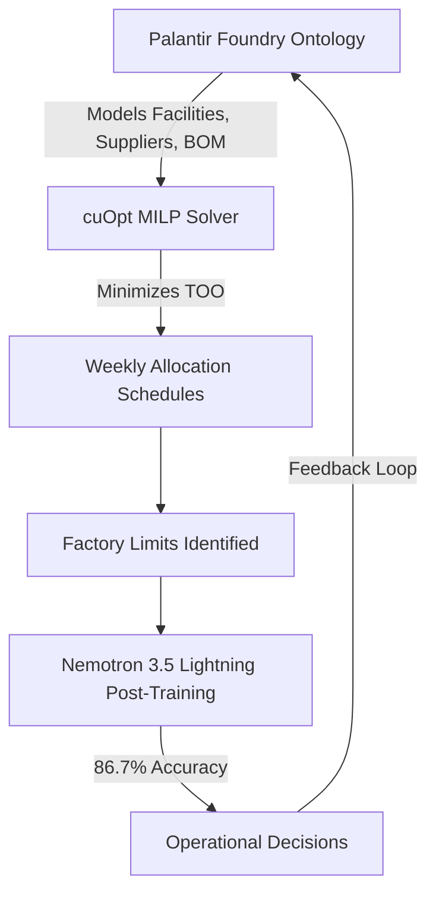
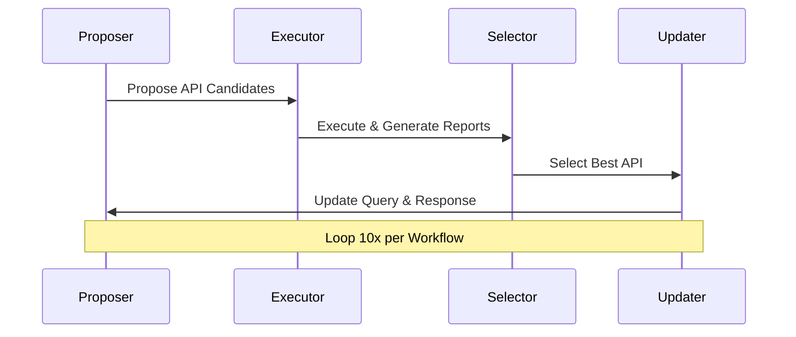

> 🎙️ **Listen to the podcast version of this article:**
> <audio controls src="index.mp3"></audio>


---

> 💡 **TL;DR:** This article dives into three transformative AI developments: NVIDIA’s AI-optimized supply chain for hardware allocation using Palantir Foundry and cuOpt, Cohere’s North Small Translate—a 218B MoE model achieving 83.6 on WMT26 across 50 languages, and Google’s ToolGrad framework, which inverts tool-use data generation to achieve a 99.8% pass rate on ToolBench. These innovations redefine efficiency, scalability, and precision in AI-driven systems.

| **Metric / Innovation Area**               | **Insight / Takeaway**                                                                                     |
|--------------------------------------------|----------------------------------------------------------------------------------------------------------|
| **NVIDIA Supply Chain Optimization**      | AI-driven allocation with Palantir Foundry and cuOpt reduces "Time of Ownership" and improves decision accuracy by 86.7% using Nemotron 3.5 Lightning. |
| **Cohere North Small Translate**          | 218B MoE model with 25B active parameters scores 83.6 on WMT26, outperforming DeepL and Google Translate. |
| **Google ToolGrad Framework**              | Answer-first data generation achieves 99.8% pass rate on ToolBench; Gemma-3-12B fine-tuned on 500 samples scores 83.1 on BFCL. |

---

### NVIDIA Supply Chain Automation with Palantir Foundry and cuOpt

The global hardware supply chain is a labyrinth of dependencies, where a single delayed component can cascade into weeks of lost productivity. NVIDIA, a titan in AI hardware, is tackling this complexity head-on by integrating **Palantir Foundry** and **cuOpt** to automate allocation decisions across its global manufacturing network. The goal? To shrink the "Time of Ownership" (TOO)—the window from when a facility receives materials to when finished sub-assemblies depart—and optimize the flow from *wafer-out* to *first token*.

At the heart of this system lies a **mixed-integer linear programming (MILP)** solver, powered by cuOpt, which models the supply chain as a constraint satisfaction problem. The objective function minimizes TOO by evaluating parts constraints across every tier of the bill of materials (BOM). For example, an NVIDIA Grace Blackwell NVL72 rack requires 18 compute trays, each demanding two Grace CPUs, four Blackwell GPUs, and 32 HBM3e memory packages—sourced from thousands of suppliers, OEMs, and contract partners. The upcoming Vera Rubin architecture doubles the supply chain’s complexity, making optimization non-negotiable.


To capture unstructured operational variables—supplier call transcripts, weather forecasts, geopolitical events—NVIDIA post-trained **Nemotron 3.5 Lightning**, a 30B-parameter mixture-of-experts (MoE) model with ~3B active parameters per forward pass. The pipeline leverages **NeMo Anonymizer** for data redaction, **NeMo Data Designer** for synthetic scenario generation, and **NeMo AutoModel** for low-rank adaptation (LoRA). The result? An **86.7% decision accuracy**—a leap from 55.5% (Nemotron 3 Ultra) and 17.5% (untuned Lightning). Fine-tuning completed in minutes on two NVIDIA B200 GPUs, proving that domain-specific optimization can be both fast and effective.



Why does this matter? NVIDIA’s approach bridges the gap between **mathematical optimization** and **human intuition**, using AI to dynamically reallocate resources across a network that spans continents. The future? Reinforcement learning (RL) routines will score recommendations on allocation precision, policy compliance, and evidence grounding—though production models will remain isolated from live retraining to mitigate risk.

---

### Cohere North Small Translate: A 218B Mixture-of-Experts Translation Model

Machine translation has come full circle. In 2017, Google’s *Attention Is All You Need* paper revolutionized NLP with the Transformer architecture, using WMT14 English-to-German and English-to-French as benchmarks. Nine years later, **Cohere’s North Small Translate**—a **218B-parameter sparse MoE model**—returns to this foundational task, achieving a **83.6 score on WMT26** across 50 languages, from Albanian to Vietnamese. With **25B active parameters per token**, it outperforms DeepL, Google Translate, and open alternatives like GLM 5.2 and Mistral Large 3.

The architecture is a decoder-only sparse MoE Transformer with **128 experts**, **8 activated per token**, plus shared experts applied universally. The router uses a **sigmoid over expert logits**, normalized over the top-*k* selections. Attention layers alternate between **sliding-window** (window size 4096, RoPE) and **global** (no positional embeddings) in a 3:1 ratio, a design first introduced in Cohere’s Command A. The model supports **16K input and output tokens**, with ~11.5% of weights active per token. Post-training focuses exclusively on translation quality.


Performance benchmarks reveal a compelling story:
- **North Small Translate (Agentic)**: 84.36 on WMT26
- **North Small Translate**: 83.60
- **Qwen 3.5 397B A17B**: 81.56
- **DeepL NextGen**: 81.37
- **Google Translate**: 68.20

The **Agentic variant** employs a multi-pass workflow to self-correct errors, pushing scores into the 80–100 range (Cohere’s "perfect or minor errors only" band). Regionally, North Small Translate dominates in Europe (82.17 vs. Gemma 4 31B’s 72.73) and holds its own in South Asia (86.16 vs. Gemma’s 88.04). For long documents, it scores **48.9** (xCOMET-XL) on translating two book chapters in a single call, compared to Google Translate’s 21.3 and Gemma 4 31B’s 19.4.

**Deployment is flexible**: Use Cohere’s free API (until rate limits), self-host non-commercially, or license commercially via **Cohere Model Vault** or **RWS Language Weaver**. Checkpoints are optimized for efficiency:
- **BF16**: 4x B200 or 8x H100
- **FP8**: 2x B200 or 4x H100
- **NVFP4 W4A16**: 1x B200 or 2x H100

Cost-wise, North Small Translate delivers **80.1 quality at $0.000676 per task** (661 tokens avg.), undercutting **Gemini 3.1 Pro Preview (high)** by **58x** ($0.038928 per task).

```python
from cohere import ClientV2
co = ClientV2(api_key="<YOUR_API_KEY>")
response = co.chat(
    model="north-small-translate-1-0",
    messages=[{"role": "user",
               "content": "Translate everything that follows into French:\n\nEnterprises need accurate translations of business-critical documents."}],
)
print(response.message.content[0].text)
```

Cohere frames translation as a **sovereignty issue**: organizations that cannot communicate globally cannot maintain independence. North Small Translate is the first in Cohere’s **North family**, following Tiny Aya and Command A Translate, and was built in collaboration with **RWS Language Weaver**’s linguists and scientists.

---

### Google Research ToolGrad: Answer-First Framework for Tool-Use Data Generation

Training LLMs to use tools reliably requires high-quality datasets pairing user queries with correct tool-use chains. Traditional **query-first** approaches (e.g., ToolBench, ToolACE) are inefficient: they sample APIs, generate a hypothetical query, and use depth-first search (DFS) to find a valid tool path. This often fails, wasting compute and discarding samples. **ToolGrad**, introduced by Google Research, inverts this pipeline: **build a verified API chain first, then write the query**. The result? A **99.8% pass rate on ToolBench** (vs. 63.8% for DFS) and longer, more complex chains.

The framework operates via a **4-module loop**:
1. **API Proposer**: Narrows a sampled set of APIs to candidates that extend the current workflow.
2. **API Executors**: Run candidates in parallel, producing execution reports.
3. **API Selector**: Picks the best-performing call (the "textual gradient") and appends it to the workflow.
4. **LLM Updater**: Rewrites the synthetic query and AI response to match the new API set.

Each iteration yields one sample: a user query, a verified API workflow, and the final response. Default settings use **10 iterations over 50 sampled APIs per workflow**.



Efficiency gains are stark:
- **Pass rate**: 63.8% (DFS) → **99.8%** (ToolGrad)
- **Ground-truth tool uses per sample**: 2.1 → **3.4** (longer chains)
- **Tool-use steps per sample**: 34.3 → **20.0**
- **LLM invocations per sample**: 64.5 → **63.9**

The **ToolGrad-500** dataset (500 samples generated with **Gemini 2.5 Flash-Lite**) was used to fine-tune **Gemma-3** at 1B, 4B, and 12B parameters. On the **Berkeley Function Calling Leaderboard (BFCL)**, an out-of-distribution test with unseen tools:
- **ToolGrad-12B**: **83.1** (vs. **Gemini 2.5 Pro** at 83.2, **Claude 4.5 Opus** at 82.8, **GPT-5** at 74.4)
- The **12B student model outperformed its teacher** (Gemini 2.5 Flash-Lite).

All code, datasets, and models are **open-source under Apache-2.0**, with reproduction scripts targeting BFCL V1/V2 via a customized vLLM Docker image. The work underscores a paradigm shift: **answer-first data generation** is not just more efficient—it’s a pathway to **frontier-level tool-use performance** with minimal fine-tuning.

---

### The Bigger Picture: AI’s March Toward Autonomy

These three innovations—NVIDIA’s supply chain AI, Cohere’s MoE translation, and Google’s ToolGrad—highlight a broader trend: **AI is evolving from a tool to a co-pilot, and now, an autonomous agent**. NVIDIA’s system blends optimization with human-like reasoning, Cohere’s model democratizes high-quality translation, and Google’s framework redefines how we train LLMs to interact with tools. Together, they signal a future where AI doesn’t just assist but **orchestrates**, **translates**, and **generates** with unprecedented precision and efficiency.

Written with [Argos](https://github.com/Neilstid/argos)
