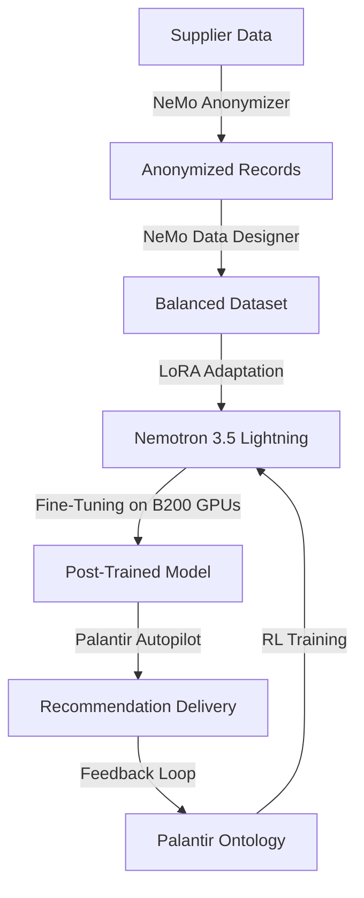

> 🎙️ **Listen to the podcast version of this article:**
> <audio controls src="index.mp3"></audio>


---

> 💡 **TL;DR:** DeepSeek’s new 552B parameter model, V4.1-Flash, outperforms its predecessor with 8B active input and 16B active output parameters, slashing cache memory needs by 4x and API costs by 50% off-peak. Meanwhile, an Anthropic researcher’s resignation over "racing toward self-improving superintelligence"—co-signed by the alignment lead—casts a shadow over the company’s IPO preparations. NVIDIA, on the other hand, is quietly revolutionizing its supply chain with Palantir Foundry and cuOpt, using AI to automate hardware allocation and even fine-tuning Nemotron models for operational decisions.

| **Metric / Innovation Area**               | **Insight / Takeaway**                                                                                     |
|-------------------------------------------|---------------------------------------------------------------------------------------------------------|
| **DeepSeek V4.1-Flash**                   | 552B parameters, 8B/16B active; 4x smaller cache, 50% cheaper off-peak API pricing; #1 on Terminal-Bench 2.1. |
| **Anthropic’s Warning**                   | Resignation over "self-improving superintelligence" risks, co-signed by alignment lead amid IPO rumors.     |
| **NVIDIA’s Supply Chain AI**               | Palantir Foundry + cuOpt automate hardware allocation; Nemotron 3.5 Lightning achieves 86.7% decision accuracy. |


---

### **1. DeepSeek’s 552B Monster Model: Bigger, Leaner, and Cheaper**

The AI model landscape just got a seismic jolt. DeepSeek’s new **V4.1-Flash** model packs a staggering **552 billion parameters**—yet it activates only **8 billion for input processing** and **16 billion for output generation**. This selective activation is akin to a vast library where only the relevant books are pulled from the shelves, drastically reducing computational overhead. The result? A model that doesn’t just match but **surpasses its own flagship V4-Pro** in speed, cost, and performance, prompting DeepSeek to retire the Pro variant entirely.

The architectural innovation extends to memory efficiency. The model’s **cache—its scratchpad for retaining context between calls—now requires 4x less RAM and 8x less storage**. For developers building AI agents, this translates directly to **lower API costs**, especially with off-peak pricing slashed by 50%. And yes, it’s **natively multimodal**, processing images without additional setup. Benchmarking data places it at **#1 on Terminal-Bench 2.1**, outpacing heavyweights like Claude Opus 5 and GPT-5.6.

```python
# Example API call for DeepSeek V4.1-Flash
import deepseek

# Initialize client
client = deepseek.Client(api_key="YOUR_API_KEY")

# Query the model (automatically routes to V4.1-Flash)
response = client.chat(
    model="deepseek-flash",
    messages=[{"role": "user", "content": "Explain quantum computing in simple terms."}]
)
print(response.choices[0].message.content)
```

**Why It Matters:** This model exemplifies the **scaling efficiency paradox**—bigger models that are cheaper to run. For AI agents, reduced cache sizes mean **lower latency and cost**, while the multimodal capability expands use cases from text to vision. The retirement of V4-Pro signals DeepSeek’s confidence in this new architecture, setting a precedent for how future models might balance size, performance, and cost.


---


### **2. Anthropic’s Doomsday Warning: A Cautionary Tale Amid IPO Buzz**

In a move that sent ripples through the AI community, an **Anthropic researcher resigned** this week, issuing a stark warning on X: the company is *"racing straight to self-improving superintelligence and gambling with our lives."* What makes this resignation particularly unsettling is that **Anthropic’s own alignment lead co-signed the message**—rather than distancing the company from the claim. This isn’t the first "doomer" warning in AI, but the timing is exquisite: Anthropic is reportedly **preparing for an IPO**, a moment when public scrutiny and investor expectations are at their peak.

The warning taps into a growing unease about the **unchecked pace of AI development**. Self-improving superintelligence—where models recursively enhance their own capabilities—remains a theoretical but plausible risk. The fact that a **lead alignment researcher** (the very person tasked with ensuring AI systems remain safe and controllable) endorsed the warning suggests internal dissent over Anthropic’s direction. This isn’t just a technical debate; it’s a **cultural and ethical one**, forcing the industry to confront whether the race for AGI is worth the existential risks.

**Why It Matters:** The incident underscores a **fracture in AI safety consensus**. If alignment leads are publicly expressing concern, it signals that even the most cautious organizations are struggling to reconcile **innovation with risk mitigation**. For investors and regulators, this is a red flag—one that could influence Anthropic’s valuation and public perception as it moves toward going public.


---


### **3. NVIDIA’s Supply Chain Automation: Where AI Meets Hardware at Scale**

NVIDIA’s dominance in AI hardware isn’t just about GPUs—it’s about **orchestrating a global supply chain** with surgical precision. The company is leveraging **Palantir Foundry** and its own **cuOpt** (a GPU-accelerated optimization library) to automate hardware allocation decisions across manufacturing sites worldwide. The goal? To measure and minimize the **"Time of Ownership" (TOO)**—the duration from when a facility receives materials to when finished sub-assemblies ship out.

#### **The Challenge: A Supply Chain on Steroids**
NVIDIA’s **Grace Blackwell NVL72** rack, for instance, contains **18 compute trays**, each requiring:
- 2 Grace CPUs
- 4 Blackwell GPUs
- 32 HBM3e memory packages

These components are sourced from **thousands of suppliers, OEMs, and contract partners**. The upcoming **Vera Rubin architecture** will double the complexity of this network. Assembly can’t proceed until parts arrive from **three channels**: direct inventory, consignment stock, and external suppliers. Delays in any component can **halt entire production lines**, extending TOO and inflating costs.

#### **The Solution: Mixed-Integer Linear Programming + AI**
NVIDIA’s **Digital Supply Chain Intelligence** command center, built on Palantir Foundry, models facilities, suppliers, and production targets as interconnected objects. **cuOpt** then formulates the distribution problem as a **mixed-integer linear program (MILP)** to minimize TOO, evaluating constraints across every tier of the bill of materials.

$$ \text{Minimize } TOO = \sum_{i=1}^{n} (t_{\text{arrival},i} - t_{\text{departure},i}) \times x_i $$
*Where* $x_i$ *is a binary decision variable for component allocation.*

But mathematical optimization alone wasn’t enough. Human planners rely on **unstructured data**—supplier call transcripts, weather forecasts, geopolitical events—that traditional solvers can’t process. Enter **Nemotron 3.5 Lightning**, a **30B-parameter mixture-of-experts (MoE) model** fine-tuned for supply chain decisions.

#### **The AI Pipeline: From Data to Decisions**
NVIDIA’s engineering pipeline is a masterclass in **operational AI**:
1. **Data Processing**: Historical records are anonymized via **NeMo Anonymizer**, balanced with synthetic scenarios using **NeMo Data Designer**, and adapted with **LoRA (Low-Rank Adaptation)** while keeping base weights frozen.
2. **Model Training**: Fine-tuning Nemotron 3.5 Lightning on **two NVIDIA B200 GPUs** takes **minutes**, not hours.
3. **Benchmarking**: The post-trained model achieved:
   - **86.7% decision accuracy** (vs. 55.5% for Nemotron 3 Ultra and 17.5% for the untuned base model).
   - **58.6% balanced accuracy** and **57.5% macro-F1 score** (outperforming Ultra’s 42% and 39.5%, respectively).


**Reinforcement Learning on the Horizon**
Operational choices, planner revisions, and factory outputs are **continuously fed back** into Palantir’s Ontology. This dataset will soon power **reinforcement learning (RL) routines**, scoring recommendations on **allocation precision, policy compliance, and evidence grounding**—while keeping production models **isolated from live retraining** to avoid instability.



**Why It Matters:** NVIDIA isn’t just selling GPUs—it’s **redefining how hardware is built and delivered**. By integrating **symbolic optimization (cuOpt) with generative AI (Nemotron)**, the company is setting a new standard for **supply chain intelligence**. The implications extend beyond NVIDIA: this is a blueprint for how **AI can automate complex, multi-tiered industrial processes**, from semiconductors to automotive manufacturing.


---


### **The Big Picture: Power, Peril, and Precision**

These three stories—**DeepSeek’s model, Anthropic’s warning, and NVIDIA’s supply chain AI**—paint a vivid picture of the AI industry in 2025:

- **Innovation is accelerating**, with models growing in capability while shrinking in operational cost.
- **Safety concerns are escalating**, with even insiders questioning whether the pace of development is sustainable—or wise.
- **AI is permeating every layer of industry**, from the digital (model training) to the physical (supply chain logistics).

The common thread? **The tension between progress and caution**. DeepSeek’s model proves that **bigger doesn’t have to mean more expensive**, but Anthropic’s warning reminds us that **bigger might mean riskier**. NVIDIA’s supply chain, meanwhile, shows how AI can **solve real-world problems at scale**—if deployed thoughtfully.

As the industry charges forward, the question isn’t just *what* AI can do next, but *how* we ensure it does so **safely, efficiently, and equitably**.

Written with [Argos](https://github.com/Neilstid/argos)
