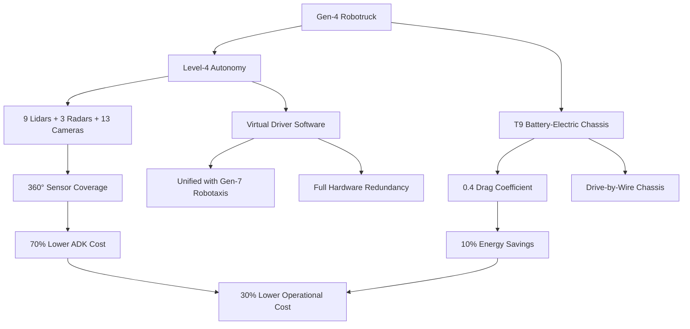
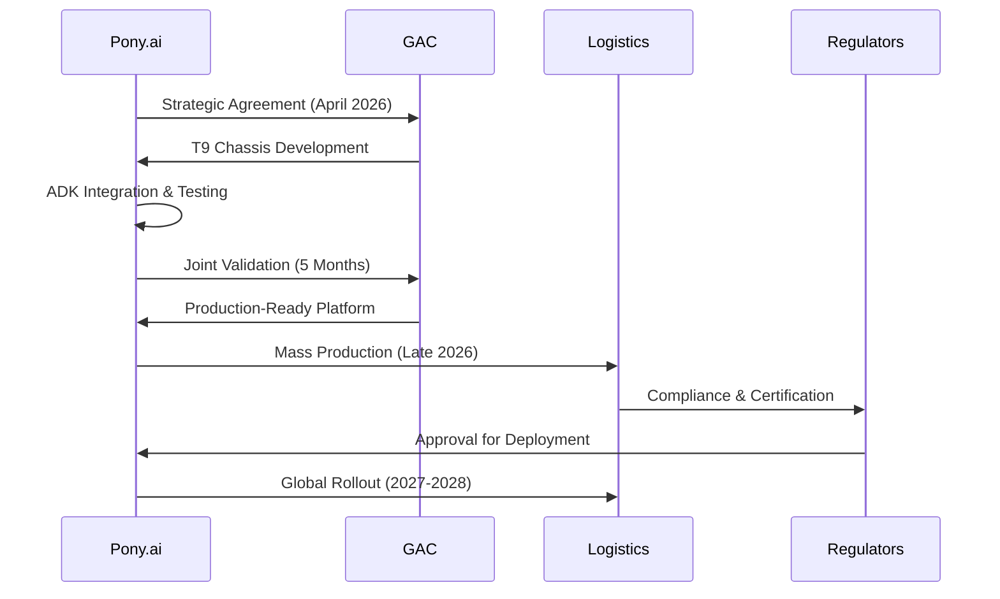

> 🎙️ **Listen to the podcast version of this article:**
> <audio controls src="index.mp3"></audio>

---

> 💡 **TL;DR:** Pony.ai and GAC Commercial Vehicle have unveiled the Gen-4 Robotruck, a Level-4 autonomous electric heavy-duty truck, at IAA Transportation 2026. This platform integrates a 70% cheaper ADK sensor suite, unified Virtual Driver software, and a battery-electric T9 chassis, promising 30% lower operational costs and 10% energy savings—setting the stage for mass production and global logistics deployment.

| **Metric / Innovation Area**               | **Insight / Takeaway**                                                                                     |
|-------------------------------------------|-----------------------------------------------------------------------------------------------------------|
| **Autonomy Level**                        | Level-4 (L4) autonomy enables fully driverless operations in defined logistics corridors and long-haul routes. |
| **Sensor Suite**                          | 9 lidars, 3 mm-wave radars, 13 cameras for 360° coverage; ADK cost reduced by **70%** vs. Gen-3.          |
| **Energy Efficiency**                     | 0.4 drag coefficient (Cd) + Pony.ai algorithms cut energy use by **10%** vs. conventional trucks.       |
| **Operational Cost Reduction**            | Projected **30% lower** cost per ton-kilometer.                                                          |
| **Compute & Redundancy**                  | Shared Gen-7 robotaxi domain controller; full hardware backups for steering, braking, power, and comms. |
| **Production Timeline**                   | Mass production begins in 2026; European/Middle Eastern expansion planned within 2 years.               |

### Introduction: Pony.ai’s Autonomous Electric Truck and the Future of Logistics Fleets

The global logistics industry stands at the precipice of a transformation, one where autonomy and electrification converge to redefine efficiency, sustainability, and scalability. At **IAA Transportation 2026**, Pony.ai—long a pioneer in autonomous driving—unveiled its **fourth-generation (Gen-4) Robotruck**, a Level-4 autonomous electric heavy-duty truck developed in partnership with **GAC Commercial Vehicle**. This isn’t just an incremental upgrade; it’s a paradigm shift for freight supply chains, promising to slash emissions, operational costs, and energy consumption while accelerating the adoption of autonomous electric fleets.

The Gen-4 Robotruck is built atop GAC Commercial Vehicle’s **T9 battery-electric truck architecture**, a platform already optimized for heavy-duty performance. But what truly sets this vehicle apart is its **automotive-grade Autonomous Driving Kit (ADK)**, a sensor and compute suite that delivers **360-degree situational awareness** with unprecedented cost efficiency. As He Xing, Pony.ai’s VP and Head of Robotruck Business, noted:

> *"The global debut of the T9 autonomous heavy-duty truck with GAC Commercial Vehicle marks another important step in accelerating the mass production and commercial deployment of Pony.ai’s Robotrucks. Looking ahead, we will deepen our collaboration with GAC Commercial Vehicle, continue advancing volume production and deployment of the T9 Robotrucks, and bring our jointly-developed autonomous trucking solutions to markets around the world."*

This collaboration isn’t just about technology—it’s about **scalability**. With mass production slated to begin later this year, Pony.ai is positioning itself as a leader in the **autonomous electric freight revolution**, targeting long-haul routes, dedicated logistics corridors, and port transport operations as its initial deployment zones.

### Technical Highlights: Level-4 Autonomy, Gen-4 Robotruck Platform, and T9 Architecture

#### **Level-4 Autonomy: The Backbone of Driverless Freight**

The Gen-4 Robotruck achieves **SAE Level-4 autonomy**, meaning it can operate **without human intervention** in predefined geographic areas—such as highways, logistics hubs, or port terminals. This level of autonomy is enabled by a **multi-modal sensor fusion system** that integrates:
- **9 lidars** for high-resolution 3D mapping and obstacle detection,
- **3 millimeter-wave radars** for long-range velocity and distance tracking,
- **13 cameras** for redundant visual perception and object classification.

This suite provides **full 360-degree coverage**, ensuring the truck can navigate complex environments—from dense urban traffic to open highways—with human-like (or better) precision. The **bill-of-materials (BoM) cost for the Gen-4 ADK has plummeted by 70%** compared to its predecessor, a critical milestone in making autonomous trucking economically viable at scale.

#### **The Gen-4 Robotruck Platform: Unified Software and Hardware Synergy**

Pony.ai’s Gen-4 Robotruck shares its **central domain controller** with the company’s **seventh-generation (Gen-7) robotaxis**, running the same **unified “Virtual Driver” software stack**. This cross-platform approach ensures that advancements in passenger vehicle autonomy directly benefit freight applications—and vice versa.

The **Virtual Driver** is the brain of the operation, processing sensor data in real-time to make decisions on steering, acceleration, braking, and route optimization. What’s particularly impressive is how Pony.ai has **paired this software with GAC Commercial Vehicle’s drive-by-wire chassis**, enabling seamless electronic control of all vehicle functions. For **fail-safe operation**, the system includes **full hardware redundancy** across:
- Steering,
- Braking,
- Power supply,
- Computing,
- Sensors,
- Communications.

This redundancy is non-negotiable for **driverless heavy-duty trucks**, where a single point of failure could have catastrophic consequences.

#### **GAC Commercial Vehicle’s T9 Architecture: Electrification Meets Aerodynamics**

The Gen-4 Robotruck is built on GAC Commercial Vehicle’s **T9 battery-electric truck platform**, which already boasts impressive credentials:
- A **drag coefficient (Cd) of 0.4**, significantly lower than conventional haulage trucks,
- **Aerodynamic refinements** that, when combined with Pony.ai’s control algorithms, reduce energy consumption by **10%**. 

The synergy between the T9’s electric powertrain and Pony.ai’s autonomy stack is a masterclass in **co-design**. The truck’s electric motors provide instant torque and regenerative braking, while the autonomy system optimizes speed, acceleration, and routing to maximize efficiency. The result? A vehicle that’s not just autonomous but **smarter, cleaner, and cheaper to operate** than its human-driven, diesel-powered counterparts.

### Impact on Freight Supply Chains: Emissions, Costs, and the Electric Autonomous Future

#### **Emissions Reduction: A Greener Logistics Ecosystem**

The transportation sector is one of the largest contributors to global CO₂ emissions, with **heavy-duty trucks alone accounting for ~7% of total emissions** in many developed economies. The Gen-4 Robotruck’s **all-electric powertrain** eliminates tailpipe emissions entirely, but the benefits don’t stop there. Thanks to its **aerodynamic design and AI-optimized driving**, the truck achieves **10% lower energy consumption** than conventional diesel rigs. When scaled across a fleet, this translates to **massive reductions in carbon footprint**—especially when paired with renewable energy sources for charging.

#### **Operational Cost Savings: The Economic Case for Autonomy**

Autonomous trucks don’t just save on fuel—they **redefine the economics of freight**. Pony.ai projects a **30% reduction in transportation operating costs per ton-kilometer** for the Gen-4 Robotruck. This stems from:
1. **Lower fuel costs**: Electricity is cheaper than diesel, and regenerative braking recaptures energy.
2. **Reduced labor expenses**: No need for human drivers on long-haul routes (though a remote supervisor may still monitor operations).
3. **Increased uptime**: Autonomous trucks can operate **24/7** without fatigue, maximizing asset utilization.
4. **Predictive maintenance**: AI-driven diagnostics can preemptively identify and address mechanical issues, reducing downtime.

For logistics companies, these savings could **reshape profit margins** in an industry notorious for thin margins and high operational costs.

#### **The Shift Toward Electric Autonomous Fleets**

The Gen-4 Robotruck isn’t just a truck—it’s a **harbinger of a larger industry shift**. As regulations tighten (e.g., the EU’s **2035 ban on new diesel trucks**) and corporate sustainability pledges proliferate, the pressure to electrify and automate fleets is intensifying. Pony.ai’s platform offers a **turnkey solution** for logistics providers looking to future-proof their operations.

Moreover, the **modularity of the Virtual Driver software** means that the same autonomy stack can be deployed across different vehicle types—from heavy-duty trucks to last-mile delivery vans. This **scalability** is critical for achieving the **network effects** necessary to make autonomous logistics economically viable.

### Comparative Overview: How Pony.ai Stacks Up Against Waymo, Tesla, and Others

Pony.ai isn’t the only player in the autonomous trucking space, but its **Gen-4 Robotruck** introduces several **differentiators** worth noting:

| **Company**       | **Autonomy Level** | **Vehicle Type**               | **Sensor Suite**                          | **Production Status**       | **Key Markets**                     |
|-------------------|--------------------|--------------------------------|-------------------------------------------|-----------------------------|------------------------------------|
| **Pony.ai**      | Level-4            | Heavy-duty electric truck      | 9 lidars, 3 radars, 13 cameras             | Mass production in 2026    | China, Europe, Middle East         |
| **Waymo Via**    | Level-4            | Class 8 semi-trucks            | Custom lidar + radar + cameras            | Pilot programs (2024)       | US (Texas, Arizona, California)    |
| **Tesla Semi**   | Level-2 (FSD Beta)| Class 8 electric semi-truck    | 8 cameras, 1 radar, ultrasonic sensors    | Limited production (2023)  | US, Europe                         |
| **TuSimple**     | Level-4            | Class 8 semi-trucks            | 5 lidars, 7 cameras, radar                | Pilot programs (2024)       | US, China, Japan                   |
| **Einride**      | Level-4            | Electric autonomous pods        | Lidar, radar, cameras                     | Commercial deployments (2024)| Sweden, Germany, US                |

#### **Pony.ai’s Competitive Edge**

1. **Cost Efficiency**: The **70% reduction in ADK costs** is a game-changer. While competitors like Waymo and TuSimple have made strides in sensor technology, Pony.ai’s ability to **drastically cut hardware expenses** while maintaining performance could accelerate mass adoption.

2. **Unified Software Stack**: By sharing its **Virtual Driver** between robotaxis and Robotrucks, Pony.ai benefits from **cross-platform learning**. Data from millions of miles driven in passenger vehicles can be leveraged to improve freight autonomy—and vice versa.

3. **Global Ambitions**: Unlike Tesla (focused on North America and Europe) or Waymo (primarily US-centric), Pony.ai is **aggressively expanding into Europe, the Middle East, and Asia**, leveraging its existing robotaxi deployments in the **UAE, Qatar, Croatia, Luxembourg, Singapore, and South Korea**.

4. **Partnerships and Validation**: The **5-month validation period** with GAC Commercial Vehicle demonstrates Pony.ai’s ability to **rapidly iterate and deploy**—a critical advantage in a race where speed to market is paramount.

### Future Outlook: Mass Production, Regulatory Hurdles, and Global Deployment

#### **Mass Production and Commercialization Timeline**

Pony.ai’s roadmap is **ambitious but achievable**:
- **2026 (Late)**: Mass production of Gen-4 Robotrucks begins, with initial deployments in **China** for long-haul freight, dedicated logistics corridors, and port transport.
- **2027-2028**: Expansion into **European and Middle Eastern markets**, leveraging existing robotaxi operations as a springboard.

The **speed of this rollout** will depend on several factors, including:
- **Manufacturing scalability**: Can GAC Commercial Vehicle ramp up T9 production to meet demand?
- **Battery supply chains**: Securing enough **high-capacity batteries** for a fleet of heavy-duty electric trucks.
- **Software maturity**: Continuous improvements to the **Virtual Driver** to handle edge cases and diverse environments.

#### **Regulatory Considerations: The Path to Driverless Freight**

Autonomous trucks face a **patchwork of regulations** globally. In the **US**, the **Federal Motor Carrier Safety Administration (FMCSA)** is still finalizing rules for **Level-4 trucks**, while **Europe’s revised General Safety Regulation (GSR)** mandates advanced driver-assistance systems (ADAS) but stops short of full autonomy. **China**, meanwhile, has been more proactive, with **pilot zones for autonomous trucks** already in operation.

Key regulatory hurdles include:
1. **Safety certification**: Proving that Level-4 trucks are **safer than human drivers** in all conditions.
2. **Liability frameworks**: Determining who is responsible in the event of an accident—**the manufacturer, the software provider, or the fleet operator?**
3. **Cross-border operations**: Harmonizing regulations to enable **seamless autonomous freight movement** across countries.

Pony.ai’s **existing deployments in multiple countries** give it a **regulatory head start**, as it has already navigated compliance in diverse jurisdictions.

#### **Broader Deployment in Global Logistics Networks**

The ultimate vision for Pony.ai’s Gen-4 Robotruck is **a fully autonomous, electric global logistics network**. To achieve this, the company will need to:
1. **Partner with fleet operators**: Collaborate with **logistics giants** (e.g., DHL, Maersk, JD.com) to integrate Robotrucks into existing supply chains.
2. **Develop hub-and-spoke models**: Use **autonomous trucks for long-haul routes** while relying on human-driven or smaller autonomous vehicles for last-mile delivery.
3. **Invest in charging infrastructure**: Deploy **high-power charging stations** along key freight corridors to support electric fleets.
4. **Expand software capabilities**: Enhance the **Virtual Driver** to handle **urban environments, adverse weather, and mixed traffic** (e.g., bicycles, pedestrians).

If successful, Pony.ai’s Gen-4 Robotruck could **redefine the $8 trillion global logistics industry**, making it **faster, cleaner, and more cost-effective** than ever before.

### Conclusion: A New Era for Freight

Pony.ai’s Gen-4 Robotruck isn’t just another autonomous vehicle—it’s a **catalyst for the next industrial revolution in logistics**. By combining **Level-4 autonomy, electric powertrains, and a 70% cheaper sensor suite**, Pony.ai has created a platform that **checks all the boxes**: **safety, efficiency, sustainability, and scalability**.

As mass production ramps up and regulatory frameworks evolve, the Gen-4 Robotruck could **accelerate the shift toward autonomous electric fleets**, reducing emissions, cutting costs, and unlocking new levels of productivity for the global supply chain. The road ahead is long, but with partners like GAC Commercial Vehicle and a **proven track record in autonomy**, Pony.ai is **well-positioned to lead the charge**.

The future of freight isn’t just electric—it’s **autonomous, intelligent, and inevitable**.

Written with [Argos](https://github.com/Neilstid/argos)
