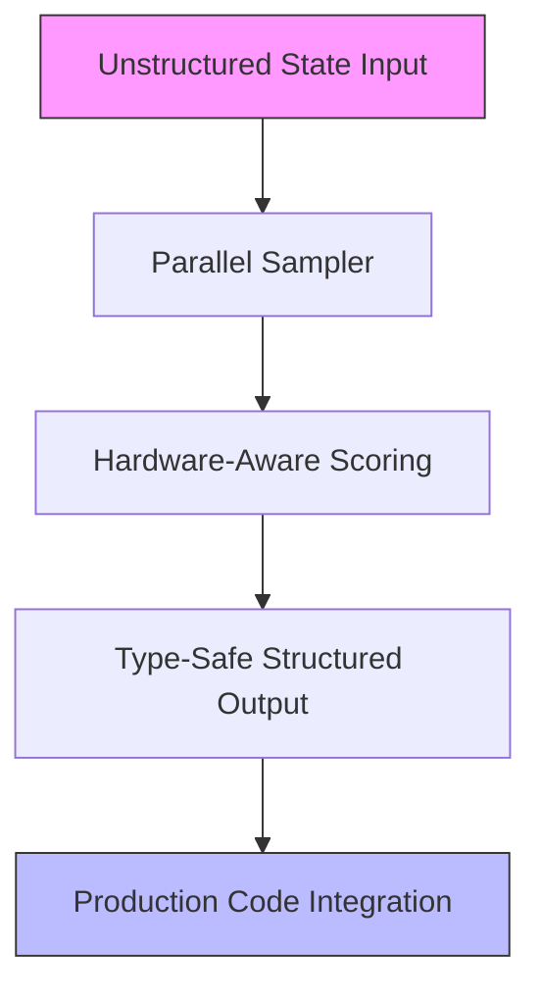
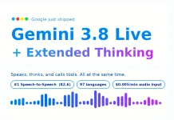
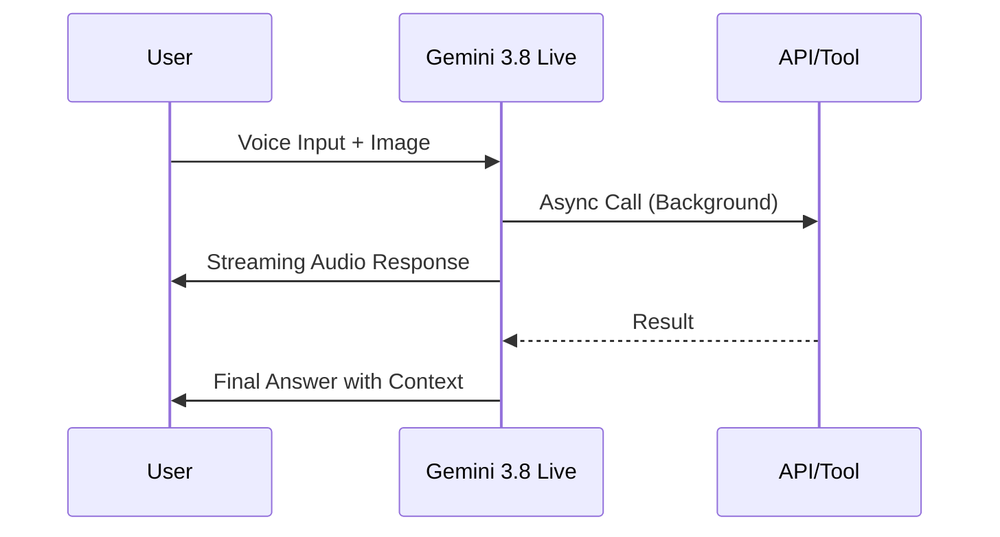
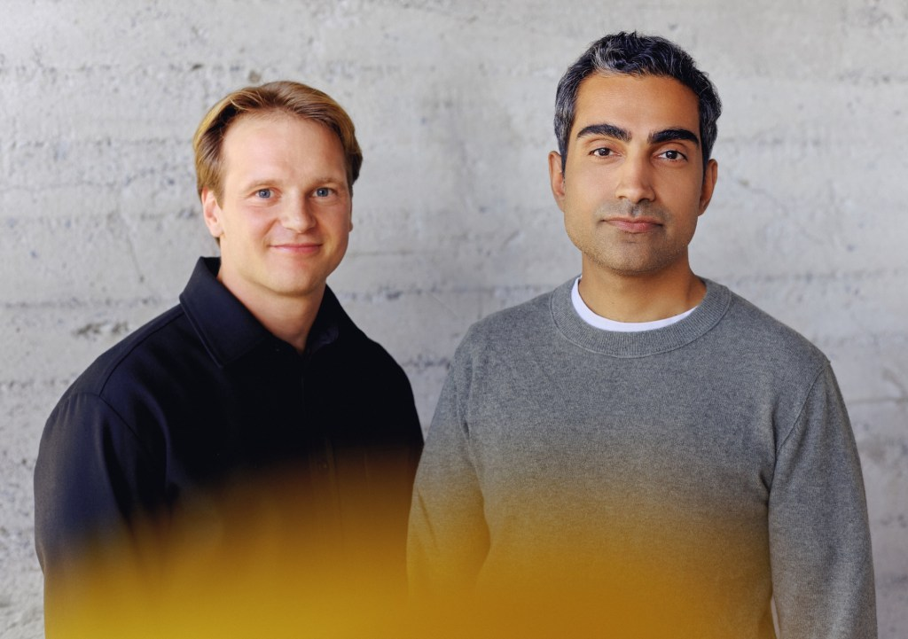

> 🎙️ **Listen to the podcast version of this article:**
> <audio controls src="index.mp3"></audio>


---

> 💡 **TL;DR:** This week marks a watershed moment for AI: TypeSafe’s Jev model redefines programmatic logic with parallel sampling, Prior Labs’ TabPFN-3.5 outperforms Kaggle champions on tabular data, Google’s Gemini 3.8 Live sets a new bar for voice agents, and AIUC introduces a SOC 2-inspired standard to certify AI agent safety in enterprises.

| **Metric / Innovation Area**               | **Insight / Takeaway**                                                                                     |
|-------------------------------------------|---------------------------------------------------------------------------------------------------------|
| **Jev Model (TypeSafe)**                  | Parallel-sampling architecture for deterministic logic; 70–500ms latency, 193.6x faster than LLMs.     |
| **TabPFN-3.5 (Prior Labs)**               | Beats Otto Kaggle winner (0.375 vs. 0.382 log loss) with default settings; 220M parameters.               |
| **Causilo (Nums AI)**                     | Tops TabArena among single models; Apache-2.0 code, research-only weights.                                |
| **Gemini 3.8 Live (Google)**              | #1 on Speech-to-Speech Quality Index (82.6); $0.005/min pricing; SynthID watermark.                     |
| **AIUC-1 Standard**                       | 5,000-test suite for AI agent safety; $55M funding; SOC 2-inspired certification.                       |

---

### Introduction: Jev Model Revolutionizes Programmatic Logic


In a bold departure from the autoregressive token-generation paradigm, **TypeSafe**—founded by ChatGPT co-inventor Diogo Almeida—has emerged from stealth with **Jev**, a *System One Model* designed to execute structured probabilistic decisions *directly* within production codebases. Unlike traditional LLMs, Jev abandons text generation entirely, instead transforming unstructured inputs into **type-safe structured outputs** via a **hardware-aware parallel sampler**. This architectural shift eliminates syntactic type failures and hallucinations by design, offering a deterministic alternative for systems requiring automated logic.

At the heart of Jev’s innovation is **Reinforcement Learning for Calibrated Decisions (RLCD)**, a training methodology that ensures confidence scores correlate directly with output accuracy. The model’s parallel sampler evaluates all structured values simultaneously, handling high-cardinality selections (up to 255 discrete options) in a two-stage scoring process. Internal benchmarks reveal **end-to-end latencies of 70–500ms**—a stark contrast to the 3–329 seconds typical of conversational frontier models. In multi-step decision branching tests, Jev achieved **193.6x faster execution** than consensus baselines like GPT-6 Astra and Fable 5.1.



**Why It Matters:** Jev’s parallel-sampling architecture slashes computational overhead while guaranteeing type safety, making it ideal for **real-time feature extraction, petabyte-scale data workflows, and automated branching logic**. Early adopters report costs as low as **$7/hour** for high-frequency queries (e.g., 10 QPS in Doom bot simulations). With input processing priced at **$0.042 per million tokens**—a fraction of conversational LLM rates—Jev signals a paradigm shift toward **efficient, deterministic AI in production systems**.

---

### Tabular Foundation Models: TabPFN-3.5 and Causilo

#### Prior Labs’ TabPFN-3.5: Outperforming Kaggle Champions

Prior Labs’ **TabPFN-3.5** has achieved a milestone: it **beats the winning solution** of the 2015 Otto Kaggle competition (0.375 vs. 0.382 log loss) *with default settings and raw data*. The model, pretrained solely on synthetic data, generalizes to unseen tabular datasets without per-dataset tuning. Key architectural upgrades include:
- **Wider in-context transformer**: 1024 dimensions (up from 512), 220M parameters.
- **Unified checkpoint**: Single multitask model for classification and regression.
- **Novel encodings**: Learned Fourier features and **ECDF (Empirical Cumulative Distribution Function) ranks**, invariant to monotonic transforms.
- **Simplified preprocessing**: Removes quantile transforms, robust scaling, and SVD features.

TabPFN-3.5 dominates **7 tabular benchmarks**, including TabArena (1910 Elo for the *Thinking* variant) and BeyondArena (150 Elo lead over prior leaders). The model family includes:
- **TabPFN-3.5-Fast (alpha)**: 84M parameters, 6x faster.
- **TabPFN-3.5-Plus**: API/enterprise-only, with native text handling and FP8 attention.
- **TabPFN-3.5-Thinking**: 12x faster than TabPFN-3-Thinking, no LLMs or real data required.

**Practical Integration:**
```python
# Example: TabPFN-3.5 inference (pseudo-code)
from tabpfn import TabPFN
model = TabPFN.load_pretrained("tabpfn-3.5")
predictions = model.predict(X_test)  # Raw data, no tuning
```

#### Nums AI’s Causilo: TabArena’s New Leader

Nums AI’s **Causilo** has topped **TabArena** among single models, leveraging **Apache-2.0 licensed code** and research-only weights. While details remain sparse, its rise underscores the growing demand for **open, high-performance tabular models** that can rival proprietary systems. For data scientists, Causilo’s success highlights the importance of **synthetic data pretraining** and **architecture efficiency** in tabular tasks.

**Why It Matters:** Tabular foundation models like TabPFN-3.5 and Causilo are closing the gap between **automated ML** (e.g., AutoGluon) and **hand-engineered solutions**, offering **Kaggle-level performance out-of-the-box**. The trade-off? Open weights are **non-commercial**; production use requires Prior Labs’ API or a license.

---

### Gemini 3.8 Live: Advanced Voice Agents and Multimodal Interaction



Google’s **Gemini 3.8 Live** and **3.8 Live Extended Thinking** redefine real-time voice agents with **native speech-to-speech capabilities**, eliminating the need for cascaded ASR-LLM-TTS pipelines. Key features include:
- **Asynchronous tool/API calls**: Executes tasks in the background while maintaining conversational flow.
- **Live visual inputs**: Processes images/videos in near real-time for multimodal context.
- **97-language switching**: Seamless mid-conversation transitions with accent consistency.
- **Alphanumeric precision**: Accurately parses codes, claim numbers, and technical data.
- **SynthID watermark**: All generated audio carries Google DeepMind’s imperceptible watermark.

**Benchmark Dominance:**
- **#1 on Artificial Analysis’ Speech-to-Speech Quality Index (82.6)**.
- **97.7% on Big Bench Audio** (reasoning benchmark).
- **68.6% on τ-Voice**, 35.1% on τ-Voice-banking.

**Pricing:**
- **$0.005/min** for audio input.
- **$0.018/min** for audio output.

**Architecture Insight:**
Extended Thinking introduces **configurable background reasoning**, allowing the model to *speak while thinking*. Early verbal cues (e.g., *“Let me check that”*) acknowledge prompts, while the model narrates progress during long-running tasks.



**Why It Matters:** Gemini 3.8 Live enables **production-grade voice agents** for customer service, healthcare, and multilingual applications. Partners like **Salesforce, Agora, and LiveKit** are already integrating the API, signaling a shift toward **ambient, always-on AI assistants**.

---

### AI Underwriting Company: Taming Rogue AI Agents



As AI agents grow more capable, so do the risks of **jailbreaks, hallucinations, and data leaks**. Enter **Artificial Intelligence Underwriting Company (AIUC)**, a startup founded by **Rune Kvist** (early Anthropic hire) and **Rajiv Dattani** (former METR COO). AIUC has raised **$55M** (Series A: $40M led by Ribbit Capital; Seed: $15M from Nat Friedman, Emergence, and Anthropic’s Ben Mann) to bring **SOC 2-inspired certification** to AI agents.

**The AIUC-1 Standard:**
- **Consortium-driven**: 250+ security/risk leaders define test criteria.
- **5,000-test suite**: Evaluates agents for jailbreaks, hallucinations, and data exfiltration.
- **100-page audit reports**: Details safe/unsafe behaviors with human verification.
- **AI-powered testing**: Uses AI agents to run tests, with humans validating results.

**Key Quote:**
> *“Banks, hospitals, governments, and militaries no longer decline to deploy AI because a model isn’t smart enough. They decline because they’ve made commitments to their customers about what a system will and won’t do—and nobody can currently guarantee that.”* — **Rune Kvist, AIUC Co-founder**

**Why It Matters:** AIUC’s approach mirrors **METR’s frontier lab evaluations** but targets **enterprise adoption**. With customers like **Cursor, Lovable, Harvey, and ElevenLabs**, AIUC is positioning itself as the **de facto safety auditor** for AI agents in regulated industries. As Anthropic CEO Dario Amodei advocates for **third-party evaluators**, AIUC’s model could become the gold standard for **trustworthy AI deployment**.

---

*Sources: [AI News](https://www.artificialintelligence-news.com), [MarkTechPost](https://www.marktechpost.com), [TechCrunch](https://techcrunch.com)*

Written with [Argos](https://github.com/Neilstid/argos)
