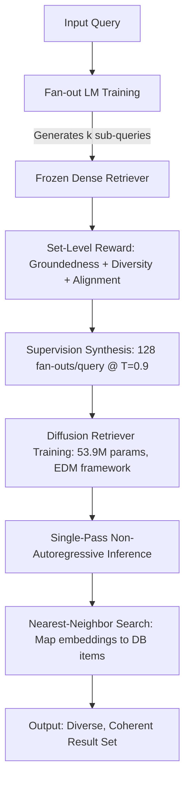
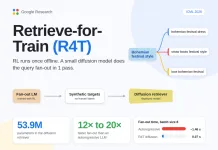
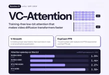
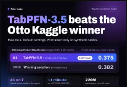
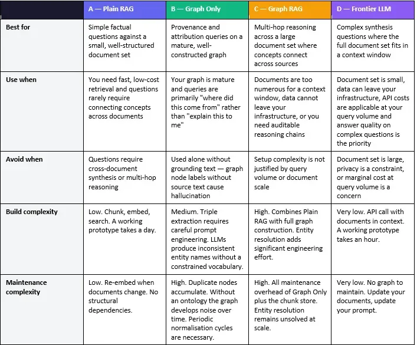

> 🎙️ **Listen to the podcast version of this article:**
> <audio controls src="index.mp3"></audio>


---

> 💡 **TL;DR:** This article covers four groundbreaking AI innovations: Google’s **Retrieve-for-Train (R4T)**, a diffusion-based retriever achieving **12×–20× faster query fan-out**; Nunchux AI’s **VC-Attention**, a training-free kernel accelerating video diffusion transformers by **3.58× on RTX 5090**; Knowledgator’s **GLiFormer**, a 575M-parameter encoder hitting **91.10 F1 on nested JSON extraction** without token generation; and a **hands-on Graph RAG experiment** revealing its strengths in multi-hop reasoning and provenance tracking.

| **Metric / Innovation Area**               | **Insight / Takeaway**                                                                                     |
|-------------------------------------------|---------------------------------------------------------------------------------------------------------|
| **Query Fan-Out Speed**                   | R4T’s diffusion retriever runs **12×–20× faster** than autoregressive fan-out, with **0.07s latency at batch size 8**. |
| **Video DiT Acceleration**                | VC-Attention achieves **3.58× attention speedup** on RTX 5090 (4-bit) and **1.59× on B200 (8-bit)**.         |
| **Nested JSON Extraction**                | GLiFormer Large scores **91.10 F1**, rivaling GPT-5.6-luna’s **91.96**, with **zero generated tokens**.       |
| **Graph RAG Utility**                     | Excels in **multi-hop reasoning** and **provenance tracking** but struggles with retrieval completeness.     |

---

### **Google Research’s Retrieve-for-Train (R4T): RL-Compiled Diffusion for 12×–20× Faster Query Fan-Out**

Search and recommendation systems often need to return **diverse, coherent sets** of results—not just a single best match. For example, a query like *“camping gear”* should return a tent, a sleeping bag, a stove, and a headlamp, not 10 near-identical tents. Traditional **autoregressive fan-out** (splitting a broad query into sub-queries) suffers from two critical flaws: **paraphrastic collapse** (where sub-queries become near-synonyms, yielding homogeneous results) and **latency** (due to repeated retrieval calls and Best-of-N sampling).

Google Research’s **Retrieve-for-Train (R4T)** tackles these issues with a **three-step pipeline**:

1. **Fan-out LM Training**: A **fan-out language model (FOLM)** generates *k* sub-queries, which a frozen dense retriever executes. A **set-level reward** (not per-item) scores the entire retrieved set, optimizing for **groundedness**, **diversity**, and **alignment**.
2. **Supervision Synthesis**: The trained FOLM samples 128 fan-outs per query at temperature 0.9, creating *(query, target set)* pairs **without human labels**. For open-ended tasks, targets are retrieved-content embeddings; for compositional tasks, they’re sub-query embeddings.
3. **Diffusive Retriever Training**: A **53.9M-parameter diffusion transformer** learns to map a query embedding to a **full set of target embeddings** in a **single non-autoregressive pass**, using a **variance-exploding formulation** within the EDM framework.

#### **Reward Design: Blocking Hacking and Collapse**
R4T’s reward function for **open-ended abstract retrieval (OAR)** combines three weighted terms:
- **Groundedness** ($\lambda_g = 0.6$): Penalizes distance between sub-query embeddings and their nearest database items.
- **Diversity** ($\lambda_d = 0.2$): Uses the **Vendi Score** over representative retrieved items (e.g., top-1 per sub-query).
- **Alignment** ($\lambda_a = 0.2$): Mean cosine similarity between sub-queries and the original query.

Ablation studies show that **all three terms are necessary**: groundedness alone led to degenerate outputs like *“line ending line ending line ending”*, while adding alignment **accelerated collapse** into paraphrases. Diversity closed both loopholes.

The system uses **GRPO with soft PPO regularization**, adding forward/reverse KL penalties, with a **global batch size of 512** and learning rate of $1 \times 10^{-7}$.

#### **Performance and Efficiency**
On the **Polyvore fashion dataset** (CLIP-based matryoshka encoder, 128D) and a proprietary **music playlist dataset** (MuLan embeddings), R4T demonstrated:
- **OAR Quality**: Gemma3-4B R4T-FOLM scored **49.1** (vs. 40.9 for Best-of-N, 38.5 zero-shot) on Polyvore, with diversity improving from **56.0 (zero-shot) to 76.8 (R4T-FOLM)**. R4T-Diffusion retained **74.3 diversity**.
- **WSCR Results**: R4T-FOLM (Qwen) achieved **20.9 Recall@5K** and **64.6 Hit@5K** (vs. 15.7 and 52.1 for Gemini-2.5-Flash), though its Vendi Score dropped to **27.5** due to reduced output entropy under strong RL.
- **Speedup**: At **batch size 8**, autoregressive fan-out took **1.46s**, while diffusion took **0.07s**. At **batch size 1024**, autoregressive hit **~50s**, vs. **4.21s** for diffusion—a **12×–20× speedup**.



**Why It Matters**: R4T eliminates the **latency bottleneck** of autoregressive fan-out while ensuring **diversity and groundedness**—critical for applications like e-commerce search, recommendation systems, and multi-document QA. The **offline RL training** and **diffusion-based inference** make it scalable for production deployments.

---

### **Nunchux AI’s VC-Attention: A Training-Free Low-Bit Kernel for Faster Video Diffusion Transformers**

Video **Diffusion Transformers (DiTs)** like Wan2.2-14B flatten clips into **spatiotemporal tokens** and run **full self-attention** at every layer. For a **5-second 720p clip**, this can mean **~70K tokens**—and on an **RTX 5090**, attention consumes **>64% of generation time**. Even on **B200/H200 GPUs**, attention dominates **two-thirds of every denoising step** in models like MiniMax-H3.

**VC-Attention** targets two bottlenecks:
1. **Value Quantization Error**: Prior methods (e.g., SageAttention2) smooth queries/keys, but the **value term** still accounts for **82% of output error** on Wan2.2.
2. **Slow Softmax Stage**: The **FP32 exponential** and its **FP8 cast** become the longest pipeline stage on B200/H200.

#### **V-Smooth: Fixing Value Outliers**
Value outliers are **sparse** (few tokens) and **dynamic** (channels shift across heads/layers/steps). Traditional **Hadamard rotation** preserves token norms, so it **doesn’t remove outliers**. VC-Attention’s **V-Smooth** takes a different approach:
- **Group**: Online **k-means** clusters value tokens per batch/head. Keys/values are permuted together, preserving non-causal attention output.
- **Demean**: Each **128-token hardware block** subtracts its mean; only the **residual** is quantized (per-channel **E4M3 at 8-bit** or **NVFP4 at 4-bit**).
- **Restore**: The mean is added back using the **row sum** from the softmax (no second pass/extra buffer needed).

This removes **8% of block energy** in sequence order, **12% under DeltaQuant’s static cube**, and **36% after sorting**—at a cost of **0.125 bits per value element**. Grouping runs only on the **first 25% of denoising steps**, with permutations reused across **4 adjacent steps**, adding **3–4% attention time overhead**.

#### **ExpCast-FP8: Eliminating the Softmax Bottleneck**
An **E4M3 byte** is already close to the **logarithm** of its stored value. Reading it as an integer:
$$\text{E4M3\_byte} \approx 8 \log_2(v) + 56$$
**ExpCast-FP8** writes the byte **directly from the log-domain score** with **1 fused multiply-add**, using a constant **β = -0.35** to center residual error. This avoids fitting per-model constants.

The direct path matches the **FP32 exponent-then-cast** path **79.6% of the time**; otherwise, it lands **1 code away**. The paper proves a **per-row total variation bound < 3.64%**, with a measured average of **1.6%** across **204.8K Wan2.2 attention rows**.

Hand-written **CuTe/CUDA fusion** reduces a **V-Smooth call** from **42.2ms to 4.8ms** on B200.

#### **Benchmarks**
VC-Attention was tested on **4 open-weight video DiTs**: Wan2.2-T2V-A14B, LongCat-Video, HunyuanVideo-1.5, and MiniMax-H3. Fidelity was measured against **BF16 FlashAttention-4** outputs over **100 prompts**.

| **GPU (Wan2.2)**       | **Precision** | **Attention Speedup** | **End-to-End Speedup** |
|------------------------|---------------|------------------------|-------------------------|
| B200                   | 8-bit         | **1.59×**              | **1.19×**               |
| H200                   | 8-bit         | **1.46×**              | **1.13×**               |
| RTX PRO 6000           | 4-bit         | **2.27×**              | **1.36×**               |
| RTX 5090               | 4-bit         | **3.58×**              | **1.70×**               |

**Fidelity Improvements**:
- At **8-bit**, V-Smooth adds **+2.3 dB PSNR** (Wan2.2) and **+2.8 dB** (HunyuanVideo-1.5) over SageAttention2.
- Adding **ExpCast-FP8** recovers **0.7–2.1 dB** but still beats SageAttention2 on all 4 models.
- At **4-bit**, V-Smooth outperforms SageAttention3 by **+2.9 dB** (Wan2.2) and **+3.6 dB** (LongCat-Video).

On **MiniMax-H3 (1344×768)**, attention runs **1.60× faster** than BF16 FlashAttention-4 on B200, with **PSNR 20.2 dB** (vs. 19.9 dB for SageAttention2). Nunchux’s proprietary **Nunchux Attention** reaches **1.91× (B200)** and **1.83× (B300)** speedups.

**Why It Matters**: VC-Attention **eliminates the softmax bottleneck** and **reduces quantization error** without retraining, enabling **real-time video generation** on consumer GPUs. Its **training-free** nature means it can be **dropped into existing DiT pipelines** with minimal integration effort.

---

### **Knowledgator’s GLiFormer: A 575M-Parameter Encoder for 91.10 F1 Nested JSON Extraction—Without Generating Tokens**

Information extraction pipelines often **chain multiple models**: one for **NER**, another for **classification**, a third for **relation extraction**, and yet another for **structuring**. Knowledgator’s **GLiFormer** unifies these tasks into a **single encoder framework**, conditioned on **schemas at inference time**. Two checkpoints are available: **Base (264.2M params)** and **Large (575.6M params)**, both **Apache 2.0 licensed** and installable via `pip install gliformer`.

#### **The Problem: Token-by-Token Generation is Inefficient**
LLMs can emit **nested JSON**, but they generate **field names, punctuation, and values token-by-token**—a slow, error-prone process. GLiFormer **removes output generation entirely**, grounding every value in **source text spans**.

#### **How GLiFormer Works**
GLiFormer builds on **GLiNER** and generalizes its **label matching** via an **anchor**—an object each runtime label is scored against. Anchors can be:
- A **group vector** (classification)
- An **entity pair** (relations)
- A **record slot** (structuring)

The **source is encoded once**, and **multiple schemas** for the same document run as **task-local groups** over the shared encoding. Head compute scales with the number of **groups, labels, and anchors**.

For **structuring**, GLiFormer operates in **4 stages**:
1. **Ground field values** as spans from the source text.
2. **Assign spans** to unordered record slots (trained with **Hungarian matching**).
3. **Predict directed parent-child links** (restricted to schema-allowed paths).
4. **Assemble nested JSON** with a **deterministic decoder**.

Since values are **source spans**, the model **cannot hallucinate** missing text—but **span selection, assignment, and hierarchy** can still introduce errors.

#### **Architecture and Training**
Both **v1 checkpoints** use the `gliformer-layout` model type with **5 heads**:
- NER
- Classification
- Joint relations
- Multilevel structuring
- Embeddings

Each configures a **12-word max span width** and **100 record anchors**. Specs:

| **Spec**               | **Base v1** | **Large v1** |
|------------------------|-------------|--------------|
| Parameters             | 264.2M      | 575.6M       |
| Encoder Layers         | 12          | 24           |
| Embedding Dimension    | 768         | 1024         |
| Max Length             | 16,384      | 8,192        |

**GLiFormer-Base** starts from a **DeBERTa backbone** further pretrained on **100B tokens**, with **1.36M broad multitask examples** and **372K task-focused post-training examples**.

#### **Benchmarks**
All scores are reported by Knowledgator:
- **Nested JSON (500 examples)**: Large **91.10 F1**, Base **87.20 F1** (vs. GPT-5.6-luna **91.96**, GPT-5-mini **82.56**). The metric is **order-free and boundary-tolerant**.
- **Classification (13 datasets)**: Large **75.03 mean macro-F1**, Base **72.36** (vs. GLiNER2.5 **64.89**, GPT-5-mini **79.79**).
- **CrossNER (5 domains)**: Base **65.10 F1**, Large **64.35** (vs. Gemma-4-31B-IT **70.74**).
- **Relations (4 benchmarks)**: Large **21.33 micro-F1**, Base **18.94** (vs. GLiNER-Relex **25.6**, Gemma-4-31B-IT **25.08**).

On **combined NER + classification**, Large **beats Gemma-4-E4B** with **~14× fewer parameters**.

#### **Speed: Up to 95.8× Faster Than Token Generation**
Knowledgator timed **GLiFormer-Base** on **40 structuring documents** (batch size 1):
- **69ms median latency** on **NVIDIA RTX PRO 6000 Blackwell GPU (FP16)**.
- **547ms** on an **8-thread AMD EPYC 9B45 CPU (FP32)**.

The **“up to 95.8× faster”** claim is an **analytical estimate** (not measured), assuming:
- **Prefill**: 2,000 input tokens/sec
- **Generation**: 60 output tokens/sec
- Excludes **queueing, network delay, or reasoning overhead**.

#### **Usage Example**
```python
from gliformer import GLiFormer

model = GLiFormer.from_pretrained("knowledgator/gliformer-large-v1")
records = model.structure(
    "Alice works at Acme.",
    {"employee": ["name", "company"]},
)
print(records)
# Output: {'employee': [{'name': 'Alice', 'company': 'Acme'}]}
```

**Why It Matters**: GLiFormer **eliminates token generation overhead** while ensuring **faithfulness to source text**. Its **multi-task capability** reduces pipeline complexity, and its **CPU/GPU compatibility** makes it deployable in **resource-constrained environments**. However, **relation extraction still trails** specialized models like GLiNER-Relex.

---

### **When Does Graph RAG Actually Add Value? A Hands-On Experiment**

**Retrieval-Augmented Generation (RAG)** is a cornerstone of modern LLM applications, but **Graph RAG**—which augments retrieval with **knowledge graphs**—promises to unlock **multi-hop reasoning** and **structured relationships**. To test its practical value, a **hands-on experiment** compared **four retrieval architectures** on the same documents and questions:

1. **System A: Plain RAG** – Traditional chunk-based vector retrieval.
2. **System B: Graph Only** – Retrieves **structured knowledge** (entities/relationships) from a Neo4j graph.
3. **System C: Graph RAG** – Combines **document chunks + graph relationships**.
4. **System D: Full-Context Frontier Model** – **No retrieval**; both documents provided directly to **Claude Haiku 4.5**.

#### **Experiment Setup**
- **Documents**: Two **Anthropic AI Security articles** (small corpus to fit in Haiku’s context window).
- **Models**:
  - **Phi-4 (14B params)** for answer generation (local, via Ollama).
  - **all-MiniLM-L6-v2** for embeddings (384D).
  - **Claude Haiku 4.5** for full-context baseline.
- **Graph Construction**:
  - **Phi-4** extracted **entity-relationship triples** (subject–relationship–object).
  - **Constrained vocabulary** for relationship types (to avoid proliferation).
  - **Neo4j** stored nodes with **vector embeddings** for semantic search.
- **Evaluation**:
  - **Claude Haiku** scored responses on **Accuracy, Completeness, Reasoning, Provenance** (1–10 scale).
  - **Three test questions**:
    1. **Multi-hop reasoning** (connecting concepts across documents).
    2. **Cross-document synthesis** (retrieval completeness).
    3. **Provenance tracking** (attribution).

#### **Key Findings**

**1. Multi-Hop Reasoning (Q1: How does the four-question risk framework relate to SDLC security controls?)**
- **Plain RAG struggled**: Retrieved relevant chunks but lacked **cross-document context** to connect the framework and controls.
- **Graph RAG excelled**: Combined **document passages + graph relationships** to identify meaningful connections.
- **Frontier Model won**: With **full context**, it reasoned across both documents seamlessly.

**Takeaway**: Graph RAG **adds the most value** when the task requires **connecting dispersed concepts**.

**2. Cross-Document Synthesis (Q2: What controls appear in both the CISO guide and the SDLC post?)**
- **All retrieval systems underperformed**: None retrieved **all overlapping controls**.
- **Graph Only failed worst**: Without **source text**, it **hallucinated controls** not in either document.
- **Frontier Model succeeded**: With **full documents**, it identified **all common controls**.

**Takeaway**: Graph RAG **doesn’t solve retrieval completeness**—if relevant chunks/nodes aren’t retrieved, the graph has **nothing to reason over**.

**3. Provenance Tracking (Q3: Which document introduced sandboxed execution?)**
- **Graph Only performed surprisingly well**: The graph’s **structural context** was sufficient for attribution.
- **All systems scored closely**: The task was **single-fact lookup**, not synthesis.

**Takeaway**: Graph-based approaches **shine for provenance** but **struggle for synthesis** without grounding text.

#### **When to Use Graph RAG?**
| **Use Case**               | **Plain RAG** | **Graph Only** | **Graph RAG** | **Full-Context LLM** |
|---------------------------|---------------|----------------|---------------|------------------------|
| **Multi-hop reasoning**   | ❌ Weak        | ⚠️ Limited      | ✅ Strong      | ✅ Best                |
| **Retrieval completeness**| ⚠️ Partial     | ❌ Poor         | ⚠️ Partial     | ✅ Best                |
| **Provenance tracking**   | ✅ Good        | ✅ Strong       | ✅ Strong      | ✅ Best                |

**Lessons Learned**:
1. **Start with an ontology**: A **constrained relationship vocabulary** prevents **label proliferation** and improves graph consistency.
2. **Entity resolution matters**: Without it, the same concept (e.g., *“prompt injection”*, *“injection attack”*) may be **split across nodes**, fragmenting knowledge.
3. **Evaluation must be rigorous**: Early tests had **truncation bugs** that skewed results. **Independent scoring** and **representative test cases** are critical.

#### **Code and Reproducibility**
The full implementation is available at:
[**github.com/arijitghoshal222/graph-rag-experiment**](https://github.com/arijitghoshal222/graph-rag-experiment)
Includes:
- Neo4j graph construction
- Triple extraction
- All four RAG systems
- Evaluation framework
- Gradio UI

**Why It Matters**: Graph RAG is **not a silver bullet**—its value depends on the **problem type**. It **excels at reasoning over relationships** but **fails at pure retrieval coverage**. For small corpora, **full-context LLMs** may outperform retrieval systems entirely. The experiment underscores the need for **careful problem analysis** before adopting complex architectures.

---

### **Conclusion: The Future of AI is Specialized, Efficient, and Context-Aware**

These four innovations highlight **key trends** in AI development:

1. **Efficiency as a First-Class Citizen**: 
   - **R4T** replaces **autoregressive fan-out** with **diffusion-based inference**, achieving **order-of-magnitude speedups**.
   - **VC-Attention** optimizes **low-bit attention** for video DiTs, making **real-time generation** feasible on consumer hardware.

2. **Task-Specific Architectures**:
   - **GLiFormer** eliminates **token generation** for structured extraction, ensuring **faithfulness** and **speed**.
   - **Graph RAG** shines in **multi-hop reasoning** but requires **careful design** to avoid pitfalls.

3. **The Retrieval vs. Context Trade-off**:
   - For **small corpora**, **full-context LLMs** may outperform retrieval systems.
   - For **large-scale knowledge**, **hybrid approaches** (e.g., Graph RAG + dense retrieval) are essential.

As AI systems grow more **sophisticated and specialized**, the focus shifts from **raw scale** to **precision, efficiency, and adaptability**. The next wave of breakthroughs will likely come from **clever architectural innovations**—like those explored here—that **squeeze more performance out of existing models** while **reducing computational overhead**.

---

*All credit for the research discussed goes to the respective teams at Google Research, Nunchux AI, Knowledgator, and the independent experiment authors. For further reading, check out the linked papers, repositories, and benchmarks.*






Written with [Argos](https://github.com/Neilstid/argos)
