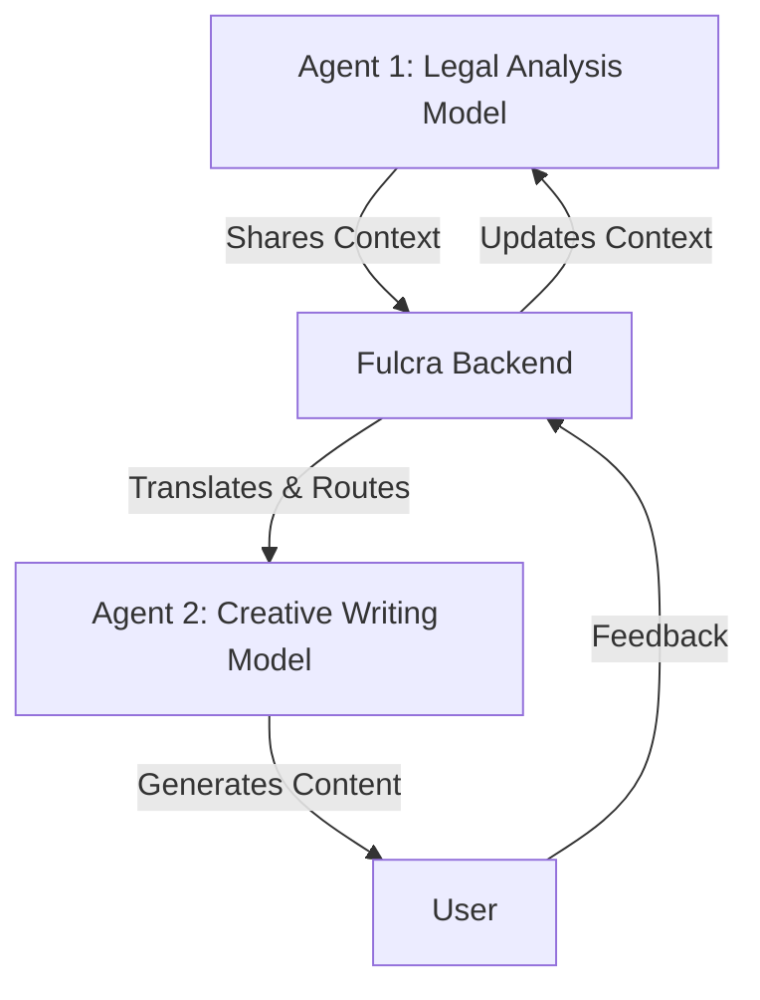
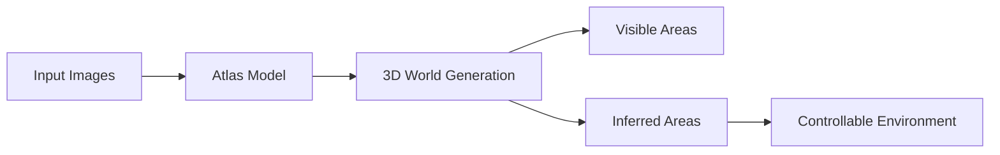

> 🎙️ **Listen to the podcast version of this article:**
> <audio controls src="index.mp3"></audio>


---

> 💡 **TL;DR:** This week in AI, Fulcra introduces universal multiplayer for AI agents, enabling seamless collaboration across models without vendor lock-in. Alibaba’s Qwen3.8-Omni-Flash redefines multimodal understanding with a 1M-token context and agentic audio-video capabilities. Meanwhile, World Labs’ Atlas generates controllable 3D worlds from sparse images, raising questions about model transparency in generative environments.

| Metric / Innovation Area | Insight / Takeaway |
|--------------------------|--------------------|
| **Multi-Agent Collaboration** | Fulcra’s universal multiplayer allows AI agents to collaborate across models, unlocking flexibility and scalability. |
| **Multimodal Context Length** | Qwen3.8-Omni-Flash supports 1M-token context, reducing token usage by ~45.7% on OmniVideoBench. |
| **3D World Generation** | Atlas creates controllable 3D environments from a few images, filling in unseen areas with generative inference. |
| **Agentic Audio-Video Understanding** | Qwen3.8-Omni-Flash integrates tool use and task planning, bridging NLP and CV for real-world applications. |
| **Model Transparency** | Atlas’s ability to "invent" unseen areas in 3D worlds highlights the need for explainability in generative AI. |

---

### Fulcra’s Universal Multiplayer: Breaking the Silos in AI Agent Collaboration

The AI agent ecosystem has long been fragmented by proprietary models and closed systems. Enter **Fulcra Dynamics**, a Boston-based innovator, whose latest breakthrough—**universal multiplayer for AI agents**—promises to dismantle these silos. Unlike traditional frameworks that lock users into a single AI model, Fulcra’s approach enables **agent-to-agent collaboration across heterogeneous models**, fostering a new era of interoperability and user ownership.

At its core, Fulcra’s system acts as a **context backend**, allowing agents to share, retrieve, and build upon contextual information dynamically. Imagine a scenario where an agent powered by a reasoning-specialized model (e.g., for legal analysis) collaborates with another agent optimized for creative tasks (e.g., content generation). Fulcra’s multiplayer architecture facilitates this by abstracting the underlying models, enabling seamless interaction through a unified interface. This is akin to a **universal translator** for AI agents, where the "language" of one model is fluidly interpreted by another.



The implications are profound. For enterprises, this means **scalability**—teams can deploy agents tailored to specific tasks without worrying about compatibility. For developers, it unlocks **flexibility**, as they can mix and match models from different providers (e.g., open-source LLMs, proprietary vision models) without vendor lock-in. Early adopters might include **collaborative workflow platforms**, where agents assist in complex, multi-step processes like research synthesis or cross-disciplinary project management.

Why does this matter? As AI agents become more autonomous, the ability to **orchestrate diverse models** will define the next generation of AI applications. Fulcra’s innovation could be the catalyst for a **modular AI economy**, where agents are as interchangeable as APIs are today.

---

### Qwen3.8-Omni-Flash: The 1M-Context Multimodal Powerhouse

Alibaba’s Qwen team has once again pushed the envelope with **Qwen3.8-Omni-Flash**, a model that doesn’t just understand text—it **comprehends audio, video, and executes tool-based tasks** with a staggering **1-million-token context window**. This isn’t just an incremental upgrade; it’s a paradigm shift in how multimodal models can process and reason about the world.

At the heart of Qwen3.8-Omni-Flash is its **agentic audio-video understanding**, which allows it to parse and act on multimodal inputs in real time. For example, the model can watch a video of a cooking tutorial, extract the steps, and then **generate a shopping list or adjust a recipe** based on user preferences. This is enabled by its ability to **call external tools** (e.g., APIs for web searches, calculators, or databases) dynamically, blending perception with action.

One of the most impressive metrics is its efficiency: Qwen3.8-Omni-Flash reports **~45.7% fewer tokens** on the **OmniVideoBench** benchmark, a testbed designed to evaluate multimodal understanding across diverse video tasks. This reduction in token usage translates to **faster inference and lower computational costs**, making it more accessible for deployment in resource-constrained environments.

The model’s architecture leverages a **unified transformer backbone** to process text, audio, and video in a single forward pass. Mathematically, this can be represented as:

$$ h = \text{Transformer}(x_{\text{text}}, x_{\text{audio}}, x_{\text{video}}) $$

where $h$ is the combined hidden representation, and $x_{\text{text}}$, $x_{\text{audio}}$, and $x_{\text{video}}$ are the input embeddings for each modality. The model’s ability to **fuse these modalities** at scale is what enables its agentic capabilities.

```python
# Example: Using Qwen3.8-Omni-Flash for a multimodal task
from qwen_omni import QwenOmniFlash

model = QwenOmniFlash.from_pretrained("Qwen/Qwen3.8-Omni-Flash")

# Process a video and extract actionable insights
video_path = "cooking_tutorial.mp4"
query = "List the ingredients and their quantities."

result = model.analyze_video(video_path, query)
print(result)
# Output: {"ingredients": [{"name": "flour", "quantity": "2 cups"}, ...]}
```

The impact of Qwen3.8-Omni-Flash extends beyond research. In **robotics**, it could enable robots to understand and respond to human commands in real-world environments by processing visual and auditory cues. In **healthcare**, it might assist in analyzing medical videos (e.g., surgical procedures) while cross-referencing patient records. The model’s **long-context capability** also makes it ideal for **documentary analysis** or **legal discovery**, where understanding extended multimodal narratives is critical.

---

### World Labs Atlas: Generating 3D Worlds from a Handful of Images

World Labs’ **Atlas** is a generative AI model that does something almost magical: it **creates controllable 3D worlds from just a few input images**. But here’s the catch—Atlas doesn’t just replicate what it sees. It **fills in the gaps**, inventing details for areas not captured in the input images. This capability is both its superpower and its ethical dilemma.

Traditional 3D reconstruction methods (e.g., photogrammetry) require **hundreds of images** to create a detailed model. Atlas, however, uses a **diffusion-based generative approach** to infer the missing geometry and textures. Think of it as a **3D version of inpainting**, where the model hallucinates plausible structures for occluded or unseen regions. For example, if given images of a room’s corners, Atlas can generate the entire layout, including furniture and decor that weren’t visible in the inputs.



The applications are vast. For **creators**, Atlas could revolutionize game design, allowing developers to sketch a few concept images and let the model generate a full 3D level. In **simulation**, it could rapidly prototype virtual environments for training AI agents or testing robotics. For **architecture**, it might help visualize buildings from sparse blueprints.

However, the model’s ability to **"invent" content** raises critical questions about **transparency and trust**. If Atlas generates a 3D world for a robotics simulation, how do we know which parts are based on real data and which are hallucinated? This is particularly concerning in **safety-critical applications**, such as autonomous vehicle training, where the fidelity of the simulation directly impacts real-world performance.

World Labs has yet to release full details on how Atlas balances **generation vs. reconstruction**, but the model’s potential is undeniable. As generative AI continues to blur the line between real and synthetic data, tools like Atlas will force us to rethink **how we validate and trust AI-generated environments**.

---

### The Big Picture: Where These Innovations Converge

These three advancements—**Fulcra’s multi-agent collaboration**, **Qwen3.8-Omni-Flash’s multimodal reasoning**, and **Atlas’s 3D world generation**—paint a picture of AI’s future: **more autonomous, more interconnected, and more generative**. Fulcra’s work addresses the **fragmentation** of AI systems, Qwen’s model tackles the **complexity** of multimodal understanding, and Atlas pushes the boundaries of **creativity and simulation**.

Together, they hint at a world where:
- **AI agents** work in teams, leveraging the strengths of different models to solve complex problems.
- **Multimodal models** understand and act on the world with human-like context and reasoning.
- **Generative environments** enable new forms of creation, from virtual worlds to robotic training grounds.

The common thread? **Agency and adaptability**. Whether it’s agents collaborating across models, a model understanding a million-token video, or a system generating a 3D world from sparse inputs, the goal is to make AI **more capable, more flexible, and more aligned with human needs**. The challenges—**transparency, efficiency, and trust**—will define the next chapter of this journey.

Written with [Argos](https://github.com/Neilstid/argos)
