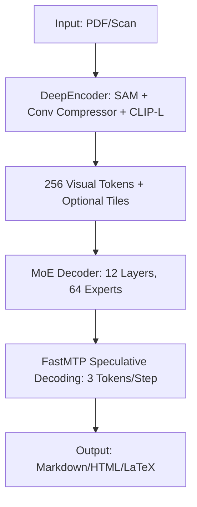

> 🎙️ **Listen to the podcast version of this article:**
> <audio controls src="index.mp3"></audio>


---

> 💡 **TL;DR:** This article dives into three transformative AI advancements: **SPARSEUP**, a 149M-parameter sparse embedding model by Linkup Research that achieves 56.4 nDCG@10 on BEIR-13 with sub-millisecond recall; **jina-ocr-v1**, Jina AI’s 3.4B MoE document parser that converts PDFs and scans to Markdown at 2.57 pages/second on an A100; and **Ternary Bonsai 2 27B**, a 5.9GB ternary-weight compression of Qwen3.8 27B retaining 98.2% of its performance across 20 benchmarks. Together, they showcase the cutting edge of efficiency, accuracy, and scalability in modern AI systems.

| Metric / Innovation Area | Insight / Takeaway |
|-------------------------|--------------------|
| **SPARSEUP (Sparse Embeddings)** | 149M parameters, 56.4 nDCG@10 on BEIR-13, >97% recall in ~380µs with Seismic index, Apache 2.0 license |
| **jina-ocr-v1 (MoE OCR)** | 3.4B total / 570M active parameters, 91.14 OmniDocBench v1.6, 83.4 olmOCR-Bench, 2.57 pages/s on A100, CC BY-NC 4.0 |
| **Ternary Bonsai 2 27B (Compression)** | 5.9GB (vs 53.8GB FP16), 98.2% performance retention, 262K token context, Apache 2.0 |

---

### **SPARSEUP – A 149M-Parameter Open-Source Sparse Embedding Model**

#### **Motivation and Backbone: Why Sparse? Why Now?**
The AI retrieval landscape has long been dominated by **dense embedding models**, which represent texts as single, continuous vectors. While effective, these models often struggle with interpretability and scalability—especially when matching rare or domain-specific terms. Enter **SPARSEUP**, Linkup Research’s open-source answer to this challenge. Built on a **149M-parameter ModernBERT backbone**, SPARSEUP is a **learned sparse embedding model** that outputs weights over a vocabulary, where each dimension corresponds to a real token. This design allows vectors to fit seamlessly into inverted indexes (like Elasticsearch’s Seismic) and, critically, makes them human-readable.

The impetus for SPARSEUP was the release of LightOn’s **DenseOn** and **LateOn** models, which provided open data, training recipes, and dense/late-interaction baselines. SPARSEUP fills the missing "sparse" slot in this trio, enabling a direct comparison across retrieval paradigms using identical backbones and fine-tuning data. As Linkup Research puts it, this is the **strongest public vocabulary-based sparse encoder under 150M parameters** they’re aware of.

#### **Sparse Encoding Tricks: Logit Shift, Top-12 Expansion, and Case Folding**
SPARSEUP’s innovation lies in its **sparsity-inducing techniques**, which address common pitfalls in sparse models (e.g., stopword saturation). The team identified three key fixes:

1. **Logit Shifting**: ModernBERT’s MLM logits were too high, saturating the log function and producing dense bags at initialization. SPARSEUP applies a **log(1 + ReLU(x - 15))** transformation to the encoder’s output, ensuring sparsity from the outset.
   $$\text{logit_shift}(x) = \log(1 + \text{ReLU}(x - 15))$$

2. **Per-Position Top-12 Expansion**: Instead of capping the total vector size, SPARSEUP limits each input token to its **12 strongest vocabulary dimensions** before max pooling. This prevents explosive growth in vector size while preserving semantic richness.

3. **Case Folding**: Byte-level BPE tokenizers often treat cased variants (e.g., "heat", "Heat", "Ġheat") as separate tokens. SPARSEUP folds these onto a single ID, retaining the largest weight. This reduces the output vocabulary from ~50k to ~34k dimensions.

Training starts from the **LateOn-unsupervised** checkpoint, with ModernBERT’s original MLM head grafted back. Fine-tuning uses LightOn’s contrastive learning mixture, with **7 hard negatives per query** sampled from a pool of 50, plus in-batch negatives. Notably, no cross-encoder distillation is used, and the entire process fits on a **single H100 GPU**.

#### **Retrieval Performance: BEIR-13 and Seismic Speed**
SPARSEUP achieves a **56.4 nDCG@10** on the **BEIR-13 benchmark**, outperforming other sparse encoders like `opensearch-neural-sparse-encoding-v1` (52.44) and `splade-v3` (51.7). However, in a controlled comparison with identical backbone and data, it trails **LateOn (58.9)** and **DenseOn (57.9)** by 1.5–2.5 points. SPARSEUP excels on datasets like **ArguAna** and **Touché**, but lags on semantic-heavy sets like **FiQA** and **DBPedia**.

| Model | BEIR-13 avg |
|-------|-------------|
| SPARSEUP | **56.4** |
| opensearch-neural-sparse-encoding-doc-v3-gte | 54.6 |
| opensearch-neural-sparse-encoding-v1 | 52.44 |
| ModernBERT-VT | 52.4 |

On **MS MARCO**, SPARSEUP averages **47 non-zero terms per query** and **190 per document** (vs. SPLADE-v3’s 25 and 170). With the **Seismic inverted index**, it achieves **>97% recall** against exact search in **~380 microseconds per query**—single-threaded. Linkup notes that increasing vector size could add 1–2 BEIR points but deliberately prioritizes sparsity for efficiency.

#### **Licensing and Availability**
SPARSEUP is released under the **Apache 2.0 license**, with weights available on Hugging Face. It can be loaded via `transformers` or `sentence-transformers` with `trust_remote_code=True`. For deployment, the model integrates seamlessly with existing inverted index systems like Seismic.

```python
from transformers import AutoModel, AutoTokenizer

model = AutoModel.from_pretrained("LinkupResearch/SPARSEUP", trust_remote_code=True)
tokenizer = AutoTokenizer.from_pretrained("LinkupResearch/SPARSEUP")

# Encode a query
query = "What is sparse embedding?"
inputs = tokenizer(query, return_tensors="pt")
outputs = model(**inputs)
```

---

### **jina-ocr-v1 – A 3.4B MoE Document Parser with Speculative Decoding**

#### **Document-to-Markdown Conversion: A One-Pass Revolution**
Jina AI’s **jina-ocr-v1** is a **visual document parser** that converts **PDFs, scans, tables, charts, and invoices** into structured Markdown in a single pass. Built on **DeepSeek-OCR**, it features a **3.4B total parameter** architecture with **~570M active parameters per token**, optimized for low-budget GPUs like the **NVIDIA L4**. The model’s standout feature? A **built-in FastMTP speculative decoding head** that drafts **3 tokens per step** while maintaining **lossless output**—a first for OCR systems.

#### **MoE Architecture: Efficiency Meets Scale**
The model’s design is a masterclass in **Mixture of Experts (MoE) efficiency**:

- **DeepEncoder (380M params)**: Combines **SAM (Segment Anything Model)**, a **16x convolutional compressor**, and **CLIP-L** to process a **1024×1024 page view** into **256 visual tokens**. A dynamic-resolution mode adds up to **9 local tiles at 100 tokens each**, capping a page at **1,156 visual tokens**.

- **Decoder (DeepSeek-3B-MoE)**: 12 layers with **64 routed experts** and **2 shared experts**. **Top-6 routing** activates ~570M parameters per token, with a **32,768-token position limit**. Outputs are **Markdown-formatted**, with tables in HTML and formulas in LaTeX.

The architecture is visualized below:



#### **FastMTP Speculative Decoding: Lossless Speedup**
OCR output is **near-deterministic** and **locally structured**, making it ideal for speculative decoding. Jina AI’s **FastMTP head** uses:

1. **Draft Phase**: A **single dense block** recursively generates **K=3 draft tokens** per step.
2. **Verification Phase**: The decoder **greedily verifies** the drafts, accepting the longest matching prefix and committing **1 additional token**. If all 3 drafts match, the extra token is a bonus.

The result? **2.73 tokens committed per step on average**—a **lossless speedup** that maintains identical output to greedy decoding. This is critical for OCR, where **exact transcription** is non-negotiable.

#### **Benchmarks: Accuracy and Throughput**
jina-ocr-v1 scores **91.14 on OmniDocBench v1.6** and **83.4 on olmOCR-Bench**, outperforming its **DeepSeek-OCR** backbone by **7.4 points** on the latter. While it doesn’t lead in raw accuracy (e.g., **PaddleOCR-VL-1.6** scores 96.34 on OmniDocBench), its **throughput** is unmatched:

| Model | OmniDocBench v1.6 | olmOCR-Bench | Pages/s (A100) |
|-------|-------------------|---------------|-----------------|
| jina-ocr-v1 | **91.14** | **83.4** | **2.57** |
| DeepSeek-OCR | — | 76.0 | — |
| DeepSeek-OCR-2 | 90.25 | — | — |
| PaddleOCR-VL-1.6 | **96.34** | — | — |

On an **A100 40GB** at concurrency 32, jina-ocr-v1 parses **2.57 pages/second**—the highest of **14 systems** Jina AI benchmarked. It also emits the **shortest output (1,085 tokens/page)** among systems scoring above 83. On an **NVIDIA L4**, eager decoding speeds up from **42.7 to 83.1 tokens/second** (1.95x) with a **57.6% acceptance rate**.

#### **Post-Training with Dense Verifiable Rewards**
Jina AI’s post-training regimen combines:
- **Instruction alignment**
- **Robustness fine-tuning** on degraded pages
- **GRPO (Group Relative Policy Optimization)**

Rewards are **deterministic code-based metrics** scored against reference transcriptions, covering:
- Content accuracy
- Formula correctness
- Table structure
- Structural validity
- Unit tests
- Repetition penalties
- Format adherence

To address the scarcity of natural pages with formulas/tables, Jina AI created **JinaOCRSynth**—synthetic pages packed with both, each carrying **olmOCR-Bench-style unit tests**. An agent merges candidate checkpoints under a **fixed evaluation budget**, and the draft head is trained last against the frozen verifier.

#### **Licensing and Deployment**
jina-ocr-v1 is released under **CC BY-NC 4.0**, with weights available on Hugging Face. For non-commercial use, it can be deployed via:
- **Jina Reader**: Send a URL to `r.jina.ai` with the header `X-Respond-With: jina-ocr-v1`.
- **OpenAI-compatible endpoint**: `https://api.jina.ai/v1/chat/completions`
- **Self-hosting**: Requires `vLLM 0.21+` and `trust_remote_code=True`.

```bash
# Example: Using Jina Reader
curl -X POST https://r.jina.ai 
  -H "X-Respond-With: jina-ocr-v1" 
  -H "Content-Type: application/json" 
  -d '{"url": "https://example.com/document.pdf"}'
```

---

### **Ternary Bonsai 2 27B – Ternary-Weight Qwen3.8 27B Compression**

#### **Compression Ratio: 5.9GB vs. 53.8GB FP16**
PrismML’s **Ternary Bonsai 2 27B** is a **ternary-weight** compression of **Qwen3.8 27B**, shrinking the model from **53.8GB (FP16)** to just **5.93GB**—a **9.1x reduction**. Despite this, it retains **98.2% of the parent model’s average performance** across **20 benchmarks**, including **text, vision, and multimodal tasks**. The model supports a **262K-token context** and is demonstrated powering **Cline coding agents** and general computer use on an **RTX 5090**.

#### **Ternary Format: 1.72 Bits per Weight**
Ternary weights take **1 of 3 values: -1, 0, or +1**. Each group of **128 weights** shares a single **FP16 scale**, achieving:
- **1.585 bits/weight** (log₂(3)) for ternary values
- **+0.125 bits/weight** for scales (16 bits per 128 weights)
- **Total: ~1.71 bits/weight** (1.72 including high-precision tensors)

PrismML implements **two GGUF packings**:
1. **PTQ1_0**: Trits packed densely at **1.76 bits/weight** (5.93GB).
2. **PQ2_0**: Each trit stored in a **2-bit slot** at **7.25GB** (cheaper to unpack).

Weights are stored in a **rotated basis** using a **blockwise Hadamard transform** (block size 1,024). The runtime applies the inverse transform to activations before multiplication, an idea inspired by **SpinQuant**. PrismML does not disclose the ternary assignment method.

#### **Performance Retention: 98.2% Across 20 Benchmarks**
Ternary Bonsai 2 27B was evaluated in **thinking mode** using **EvalScope** and **vLLM** on H100 GPUs. Results show **near-parity** with the FP16 baseline:

| Capability | Qwen3.8 27B (FP16) | Ternary Bonsai 2 27B | Retention |
|------------|---------------------|------------------------|-----------|
| Knowledge & Reasoning | 86.66 | 83.95 | **96.9%** |
| Math | 97.06 | 96.57 | **99.5%** |
| Coding | 82.17 | 81.58 | **99.3%** |
| Agentic & Tool Calling | 79.74 | 77.57 | **97.3%** |
| Instruction Following | 81.25 | **82.66** | **101.7%** |
| Vision | 81.64 | 78.59 | **96.3%** |
| **Overall (20 benchmarks)** | **85.4** | **83.9** | **98.2%** |

The model **outperforms conventional quantization** (e.g., IQ2_XXS at 7.3GB averages **75.2** on the same benchmarks). On **AIME26**, it scores **95.83** vs. IQ2_XXS’s **78.6**; on **LiveCodeBench v6**, it’s **90.07** vs. **70.05**.

However, **long-horizon agent tasks** show larger gaps:
- **Terminal-Bench 2.1**: 52.8 (Bonsai) vs. 69.7 (FP16) → **~75% retention**
- **SWE-bench Verified**: 60.8 vs. 80.6 → **~75% retention**

#### **Hardware Performance: 142.5 Tokens/s on RTX 5090**
PrismML’s custom kernels deliver impressive throughput (batch size 1 decode, measured Sept. 16, 2026):
- **RTX 5090**: **142.5 tokens/s** at **0.582 mWh/token**
- **RTX 4090**: **96.7 tokens/s** (PTQ1_0)
- **NVIDIA L4 (72W)**: **32.1 tokens/s**
- **Apple M5 Max**: **46.8 tokens/s**
- **Apple M5 Pro**: **27.7 tokens/s**

Packing choice matters:
- **PTQ1_0** is faster on **Ada-generation GPUs** and the **L4**.
- **PQ2_0** is faster on **Blackwell, Hopper, Ampere**, and **Apple silicon**, as well as for **prompt processing** on all hardware.

PrismML also claims **40% better energy efficiency** than a full-precision 8B model.

#### **How to Run It**
Ternary Bonsai 2 27B requires **PrismML’s fork of llama.cpp** (stock versions reject PTQ1_0/PQ2_0). The **Bonsai-demo repo** is the supported path:

```bash
# Clone and setup
git clone https://github.com/PrismML/bonsai-demo
cd bonsai-demo
./setup.sh

# Start the server (chat, vision, tools)
./scripts/start_llama_server.sh
```

For **Mac users**, the **MLX pack** includes a bundled loader. A **WebGPU demo** runs the model in-browser.

---

### **The Big Picture: Where These Innovations Fit in AI’s Future**

These three models—**SPARSEUP, jina-ocr-v1, and Ternary Bonsai 2 27B**—represent a **triple frontier** in AI:

1. **SPARSEUP** proves that **sparse embeddings** can rival dense counterparts in retrieval tasks while offering **interpretability, efficiency, and inverted-index compatibility**. Its **sub-millisecond recall** with Seismic makes it a game-changer for production search systems.

2. **jina-ocr-v1** demonstrates how **MoE architectures** and **speculative decoding** can unlock **high-throughput, lossless OCR** on modest hardware. Its ability to parse **2.57 pages/second on an A100**—while outputting clean Markdown—sets a new bar for document AI.

3. **Ternary Bonsai 2 27B** showcases the **extreme compression** possible with **ternary weights**, retaining **98.2% of a 53.8GB model’s performance** in just **5.9GB**. This could democratize **27B-scale LLMs** for edge devices and budget GPUs.

Together, they highlight a clear trend: **AI is moving toward models that are not just smarter, but faster, smaller, and more deployable**. Whether it’s **sparse retrieval**, **MoE OCR**, or **ternary compression**, the future of AI lies in **efficiency without compromise**.

Written with [Argos](https://github.com/Neilstid/argos)
