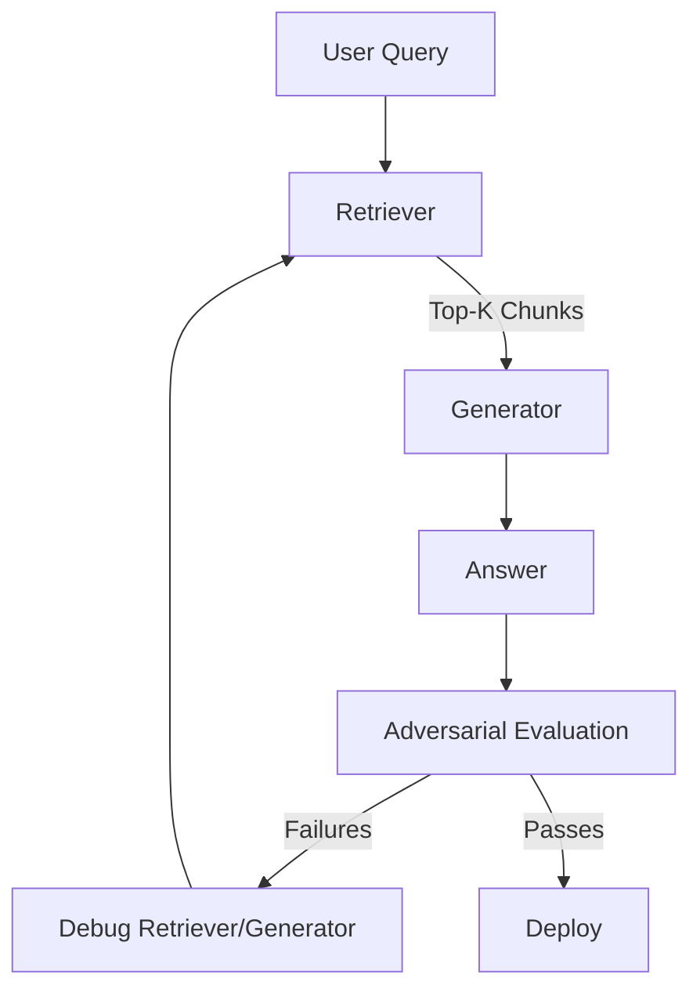

> 🎙️ **Listen to the podcast version of this article:**
> <audio controls src="index.mp3"></audio>


---

> 💡 **TL;DR:** OpenAI’s GPT-6 Sol and Luna redefine cost-efficiency in frontier AI, offering 50% cheaper API pricing and near-Astra performance. Anthropic’s Claude Opus 5.5 matches Fable 5.1 at 40% lower cost, excelling in agentic coding. Meanwhile, the RAG vs. Fine-Tuning debate rages on—this article clarifies their mechanical differences, provides code examples, and offers a decision framework for production systems.

| **Metric / Innovation Area**               | **Insight / Takeaway**                                                                                     |
|------------------------------------------|---------------------------------------------------------------------------------------------------------|
| **GPT-6 Sol & Luna**                      | 50% cheaper than GPT-5.6, with Sol outperforming Claude Opus 5 on AutomationBench at 9% of its cost.       |
| **Claude Opus 5.5**                       | 40% lower running cost than Opus 5, with Fable 5.1-level performance and 30% faster output generation.   |
| **RAG vs. Fine-Tuning**                   | RAG handles dynamic knowledge; Fine-Tuning shapes behavior. 60% of production systems use both.         |
| **Adversarial RAG Testing**               | Stress-test pipelines with adversarial datasets to uncover retrieval failures standard evals miss.     |

---

### 1. GPT-6 Sol and Luna: OpenAI’s New Frontier Models – Capabilities, Cost Balance, and Early Use Cases

OpenAI’s latest expansion of the GPT-6 family—**Sol** and **Luna**—marks a strategic pivot toward democratizing frontier intelligence. While [GPT-6 Astra](https://openai.com/index/gpt-6/) remains the gold standard for raw capability, Sol and Luna are designed to distribute Astra’s advancements at a fraction of the cost, making cutting-edge AI accessible for everyday tasks. The models inherit Astra’s training methodologies, delivering improvements in **professional work, factuality, coding, computer use, and alignment**—but with a focus on efficiency.

#### **Cost-Efficiency and Performance Benchmarks**
The standout feature of Sol and Luna is their **50% price reduction** compared to GPT-5.6’s promotional pricing, achieved through optimizations in caching and inference. On **AutomationBench**, a test of business workflows across applications, GPT-6 Sol at *xhigh effort* outperforms **Claude Opus 5 at max effort**—while costing just **9% of Opus 5’s price per task**. Even at *high effort*, Luna improves on its predecessor by **5.4 percentage points** at **58% lower cost per task**. These metrics underscore OpenAI’s push to dominate the **cost-intelligence curve**, where Sol and Luna offer exceptional value without sacrificing performance.


For coding, Sol and Luna shine on **FrontierCode** and **DeepSWE v1.1**, benchmarks evaluating real-world software engineering tasks. Sol at *max effort* scores **68.8%** on DeepSWE, within **1.1 percentage points** of Claude Fable 5’s highest score—**at 80% lower cost per task**. Luna, meanwhile, achieves **66.6%**, comparable to Opus 5 and Fable 5 at *medium effort*, while costing **93% less than Opus 5** and **96% less than Fable 5**. These results highlight their viability for **sustained, high-volume coding tasks**, where cost scalability is critical.

#### **Factuality and Alignment Improvements**
OpenAI reports significant strides in **factual reliability**. On internal evaluations based on real-world user conversations, GPT-6 Sol makes **half as many mistakes** as its predecessor, approaching Astra-level accuracy at a fraction of the cost. Luna also improves substantially, matching GPT-5.6 Sol’s performance at **~1% of its cost** at higher effort levels. Both models benefit from Astra’s alignment work, reducing misleading claims—particularly in coding contexts.

#### **Prompt Caching and Developer Tools**
To further reduce costs, OpenAI has enhanced **prompt caching** for GPT-6, achieving **90% discounts on cached input-token reads** and higher cache hit rates by default. Developers can now:
- Monitor caching performance via the [Prompt Caching Dashboard](https://platform.openai.com/docs/guides/prompt-caching).
- Adjust reasoning effort and tool availability without breaking cache.
- Optimize cached prefixes with explicit breakpoints.

GitHub reports these improvements have **reduced the share of prompt tokens requiring fresh processing by over 50%** across billions of requests, accelerating response times for tools like Copilot.

#### **Availability and Use Cases**
Sol and Luna are available in **ChatGPT Work and Codex** for Plus, Pro, Business, Enterprise, and Edu users, with Luna also accessible in the desktop app for Free and Go users. API access is provided via `gpt-6-sol` and `gpt-6-luna`. Early adopters can expect:
- **Higher usage limits** for iterative tasks.
- **Improved communication style**, with clearer, less jargon-heavy responses in technical conversations.
- **Agentic workflows** that leverage Sol’s ability to outperform competitors at lower costs.

---

### 2. Claude Opus 5.5 Launch – Performance Gains, 40% Lower Running Cost, and Implications for Agentic Coding

Anthropic’s **Claude Opus 5.5** arrives as the first model in the new **Claude 5.5 family**, delivering **Fable 5.1-level performance** at a **40% lower running cost** than Opus 5. The model is deployable via **managed API** on the Claude Platform, AWS, Google Cloud, and Azure, with **zero data retention**—a key feature for privacy-conscious enterprises.

#### **Benchmark Dominance**
Opus 5.5 leads on multiple benchmarks, particularly in **agentic coding, computer use, and knowledge work**. Below are its scores (at *adaptive thinking, max effort*) compared to competitors:

| **Benchmark**               | **Opus 5.5** | **Fable 5.1** | **Opus 5** | **GPT-6 Astra** |
|----------------------------|--------------|---------------|------------|-----------------|
| Terminal-Bench 4.0         | 66.4%        | 55.8%         | 52.3%      | 57.9%           |
| FrontierCode v1.1          | 54.4%        | 50.3%         | 48.0%      | 53.3%           |
| CursorBench 4.0            | 57.8%        | 51.8%         | 46.6%      | n/r             |
| OSWorld 2.0                | 81.8%        | 80.7%         | 74.0%      | n/r             |
| AutomationBench            | 40.0%        | 31.4%         | 26.9%      | 41.4%           |

**Cost-adjusted performance** is where Opus 5.5 truly excels. At *medium effort*, it scores **54.6% on FrontierCode**, surpassing GPT-6 Astra’s top score of **53.3% at ~1/5th the cost per task**. On CursorBench, its *medium effort* score of **52.5%** beats GPT-5.6 Sol’s best by **11 points** at **~1/3rd the cost**.

#### **Pricing and Speed**
Opus 5.5’s pricing reflects its efficiency:

| **Per 1M Tokens**          | **Opus 5.5** | **Opus 5** |
|----------------------------|--------------|------------|
| Input                      | $4           | $5         |
| Output                     | $20          | $25        |
| Cache Reads                | $0.20        | $0.50      |
| Cache Writes               | $5           | $6.25      |

**Cache reads**, which dominate agentic and coding costs, drop by **60%**, contributing to the **40% overall cost reduction**. Output generation is **>30% faster** than Opus 5, with *Fast Mode* offering **2.5x speed** at $8/$40 per million tokens (input/output).

#### **Early Tester Insights**
Real-world deployments reveal impressive gains:
- A **680,000-line code migration** completed in **<1 day** (vs. Opus 5’s multi-day timeline).
- A **200,000-line codebase audit** finished in **<3 hours** (Opus 5 took **>20 hours** and **2.5x the tokens**).
- A **C-to-Rust port of HAProxy** completed in **9.5 hours** (Fable 5.1: 12 hours; Opus 5.5 cost **51% less**).
- **Deloitte** found Opus 5.5 at *lowest effort* caught **72% of known review bugs** (Opus 5 at *high effort*: 56%).

#### **Safety and API Changes**
Opus 5.5 introduces stricter safeguards:
- **Cybersecurity**: Routine tasks allowed; advanced requests rerouted to Opus 4.8.
- **Biology**: Comparable to Mythos 5.1, with vetting via the **Life Sciences Verification Program**.
- **Distillation**: Preserved thinking prevents context editing to extract reasoning (applies to API accounts created **≥Aug 31, 2026**).
- **Watermarking**: Added for **EU AI Act compliance**.
- **Thinking**: Can no longer be disabled.

---

### 3. Retrieval-Augmented Generation vs. Fine-Tuning for Domain Adaptation – Mechanical Differences, Benchmarks, and a Decision Framework

The **RAG vs. Fine-Tuning** debate is one of the most contentious in applied LLM work. The reality? **~60% of production LLM deployments use both**—not because teams are indecisive, but because RAG and fine-tuning solve **fundamentally different problems**. This section breaks down their mechanics, provides code examples, and offers a **6-point decision framework**.

#### **What RAG Actually Is (and Isn’t)**
Retrieval-Augmented Generation **does not modify the model’s weights**. Instead, it dynamically injects relevant knowledge into the model’s context window at inference time. This makes RAG ideal for:
- **Large or frequently updated knowledge bases** (e.g., internal documentation, real-time data).
- **Traceability**: Every claim can be cited back to a source document (critical for compliance/audits).
- **Rapid deployment**: No training required; works out-of-the-box with a document corpus.

**What RAG *doesn’t* fix**:
- Model behavior (e.g., tone, output format consistency).
- Underlying knowledge gaps if the retrieval fails.

#### **What Fine-Tuning Actually Is (and Isn’t)**
Fine-tuning **modifies the model’s weights** via training on labeled examples. Using **LoRA/QLoRA**, teams can train a small adapter (often **<1% of base model parameters**) in hours for a few hundred dollars. Fine-tuning excels at:
- **Behavioral consistency** (e.g., strict output formats, domain-specific jargon).
- **Latency-sensitive applications** (no retrieval hop needed).

**What fine-tuning *doesn’t* fix**:
- **Factual knowledge**: Fine-tuned models **do not reliably memorize** training data. For granular facts, RAG is superior.

#### **Code Examples: RAG vs. Fine-Tuning in Practice**

**RAG Pipeline for Incident Runbooks**
Consider an engineering team querying internal **incident runbooks** and **postmortems**—documents that evolve weekly. Here’s a minimal RAG implementation:

```python
# documents.py
DOCUMENTS = [
    {
        "id": "runbook-db-failover-001",
        "title": "Database Failover Runbook",
        "text": (
            "When the primary Postgres instance becomes unresponsive, first check "
            "replication lag on the standby via `SELECT now() - pg_last_xact_replay_timestamp()`. "
            "If lag is under 30 seconds, promote the standby using `pg_ctl promote`. "
            "Update the connection string in the config service immediately after promotion. "
            "Do not attempt manual failover if replication lag exceeds 5 minutes, escalate "
            "to the database team instead, since promoting a stale standby risks data loss."
        ),
    },
    # Additional documents...
]
```

```python
# retrieval.py
from dataclasses import dataclass
from sklearn.feature_extraction.text import TfidfVectorizer
from sklearn.metrics.pairwise import cosine_similarity
import re

@dataclass
class Chunk:
    doc_id: str
    title: str
    text: str

def chunk_document(doc: dict, max_sentences: int = 2) -> list[Chunk]:
    sentences = re.split(r"(?<=[.!?])\s+", doc["text"])
    chunks = []
    for i in range(0, len(sentences), max_sentences):
        chunk_text = " ".join(sentences[i:i + max_sentences])
        chunks.append(Chunk(doc_id=doc["id"], title=doc["title"], text=chunk_text))
    return chunks

class RetrievalIndex:
    def __init__(self, documents: list[dict]):
        self.chunks = [chunk for doc in documents for chunk in chunk_document(doc)]
        self.vectorizer = TfidfVectorizer()
        self.chunk_vectors = self.vectorizer.fit_transform([c.text for c in self.chunks])

    def search(self, query: str, top_k: int = 3) -> list[tuple[Chunk, float]]:
        query_vector = self.vectorizer.transform([query])
        scores = cosine_similarity(query_vector, self.chunk_vectors)[0]
        ranked = sorted(zip(self.chunks, scores), key=lambda pair: pair[1], reverse=True)
        return ranked[:top_k]
```

```python
# generate.py
import os
import anthropic

SYSTEM_PROMPT = """
You are an internal engineering assistant. Answer only using the provided source excerpts. 
Cite the source document ID for every claim in square brackets, like [runbook-db-failover-001]. 
If the sources don't contain the answer, say so explicitly rather than guessing.
"""

def answer_question(question: str, index: RetrievalIndex, top_k: int = 3) -> str:
    results = index.search(question, top_k=top_k)
    context = "\n\n".join(f"[Source: {c.title} ({c.doc_id})]\n{c.text}" for c, score in results)
    client = anthropic.Anthropic(api_key=os.environ["ANTHROPIC_API_KEY"])
    response = client.messages.create(
        model="claude-sonnet-4-6",
        max_tokens=500,
        system=SYSTEM_PROMPT,
        messages=[{"role": "user", "content": f"Sources:\n\n{context}\n\nQuestion: {question}"}],
    )
    return "".join(block.text for block in response.content if block.type == "text")
```

**Fine-Tuning for Structured Outputs**
Now consider a **financial services** use case: classifying customer complaints into a strict taxonomy (`BILLING_DISPUTE`, `UNAUTHORIZED_TRANSACTION`, etc.). Here, fine-tuning ensures **consistent structured outputs** at scale:

```python
# dataset.py
import json

CATEGORIES = ["BILLING_DISPUTE", "UNAUTHORIZED_TRANSACTION", "ACCOUNT_ACCESS", "FEE_INQUIRY", "CARD_FRAUD_SUSPECTED"]

def make_example(complaint_text: str, category: str, severity: int, requires_immediate_action: bool) -> dict:
    return {
        "messages": [
            {"role": "system", "content": "Classify the customer complaint into exactly one category from: " + ", ".join(CATEGORIES) + ". Return a JSON object with category, severity (1-5), and requires_immediate_action (boolean)."},
            {"role": "user", "content": complaint_text},
            {"role": "assistant", "content": json.dumps({"category": category, "severity": severity, "requires_immediate_action": requires_immediate_action})},
        ]
    }

TRAINING_EXAMPLES = [
    make_example("I see a charge for $340 I don't recognize on my statement from yesterday.", "UNAUTHORIZED_TRANSACTION", 4, True),
    make_example("Why was I charged a $35 overdraft fee? I thought I had overdraft protection.", "FEE_INQUIRY", 2, False),
    # Additional examples...
]
```

```python
# fine_tuning.py
from transformers import AutoModelForCausalLM
from peft import LoraConfig, get_peft_model, TaskType

model = AutoModelForCausalLM.from_pretrained("your-base-model", load_in_4bit=True, device_map="auto")
lora_config = LoraConfig(
    r=8,
    lora_alpha=16,
    lora_dropout=0.1,
    target_modules=["q_proj", "k_proj", "v_proj", "o_proj"],
    task_type=TaskType.CAUSAL_LM,
)
peft_model = get_peft_model(model, lora_config)
peft_model.print_trainable_parameters()  # Only ~3.33% of parameters are trainable
```

#### **Decision Framework: RAG vs. Fine-Tuning**
Use this **6-point framework** to choose the right approach:

| **Criteria**                                      | **RAG** | **Fine-Tuning** | **Both** |
|---------------------------------------------------|---------|-----------------|----------|
| Knowledge is large/changing                       | ✅      | ❌              | ✅       |
| Need traceable, auditable answers                 | ✅      | ❌              | ✅       |
| No labeled data / need quick deployment           | ✅      | ❌              | ⚠️       |
| Model struggles with tone/format consistency     | ❌      | ✅              | ✅       |
| Latency budget is tight                          | ❌      | ✅              | ⚠️       |
| High query volume / cost sensitivity              | ⚠️      | ✅              | ✅       |

**Key Takeaway**:
- **RAG** = What the model **needs to know** (dynamic knowledge).
- **Fine-Tuning** = How the model **needs to behave** (consistency, style).
- **Start with RAG**, then add fine-tuning for persistent behavioral issues.

---

### 4. Stress-Testing Your RAG Pipeline – An Adversarial Test Set That Reveals Retrieval Failures

Standard evaluations often miss **retrieval failures** in RAG pipelines. Adversarial testing—deliberately crafting edge cases—can expose gaps in:
- **Query understanding** (e.g., ambiguous or misphrased questions).
- **Document chunking** (e.g., splitting sentences mid-procedure).
- **Retriever biases** (e.g., favoring recent but irrelevant documents).

#### **Why Adversarial Testing Matters**
A RAG system may perform well on **in-distribution** queries but fail on:
- **Out-of-domain questions** (e.g., asking about a document not in the corpus).
- **Ambiguous phrasing** (e.g., "How do I fix the database?" when multiple runbooks exist).
- **Negative queries** (e.g., "What *isn’t* covered in the failover runbook?").

#### **Building an Adversarial Test Set**
1. **Identify failure modes**: Review logs for user queries where the RAG system returned incorrect or unhelpful answers.
2. **Craft edge cases**:
   - **Paraphrased queries** (e.g., "Primary DB is down" vs. "Postgres instance unresponsive").
   - **Partial matches** (e.g., "What’s the escalation policy for payments?" when the policy is buried in a longer document).
   - **Distractor documents** (e.g., include irrelevant but keyword-rich documents in the corpus).
3. **Evaluate retrieval quality**:
   - **Precision@K**: Are the top-*K* retrieved chunks relevant?
   - **Recall**: Does the correct answer exist in the retrieved chunks?
   - **Latency**: Does retrieval add unacceptable delay?

#### **Example Adversarial Test Cases**
| **Query**                                      | **Expected Behavior**                                                                 | **Common Failure**                          |
|------------------------------------------------|--------------------------------------------------------------------------------------|---------------------------------------------|
| "What’s the escalation policy for checkout?"   | Retrieve `runbook-oncall-escalation-003` and cite the direct escalation rule.         | Returns generic on-call policy instead.     |
| "How do I promote a stale standby?"            | Explicitly state: "Do not attempt; escalate to DB team."                              | Returns steps for promoting a healthy standby. |
| "What *isn’t* in the failover runbook?"        | Acknowledge the runbook’s scope limitations.                                         | Hallucinates non-existent content.          |

#### **Tools for Adversarial Testing**
- **RAGAS**: Evaluates retrieval and generation quality.
- **TruLens**: Tracks faithfulness and answer relevance.
- **Custom scripts**: Use the `retrieval.py` index from earlier to test edge cases programmatically.



**Pro Tip**: Use **human-in-the-loop** validation for adversarial test sets. Tools like **Prodigy** or **Label Studio** can help annotate edge cases at scale.

---

### Final Thoughts: The AI Landscape in 2026

The releases of **GPT-6 Sol/Luna** and **Claude Opus 5.5** signal a shift toward **cost-efficient frontier intelligence**, making advanced AI practical for broader use cases. Meanwhile, the **RAG vs. Fine-Tuning** debate highlights the need for **hybrid approaches** in production systems—where dynamic knowledge and behavioral consistency are both critical.

For teams building LLM applications:
1. **Start with RAG** for knowledge-heavy tasks.
2. **Add fine-tuning** for behavioral consistency.
3. **Stress-test with adversarial queries** to catch retrieval failures early.

The future of AI isn’t just about bigger models—it’s about **smarter, leaner, and more reliable systems** that integrate seamlessly into real-world workflows.

Written with [Argos](https://github.com/Neilstid/argos)
