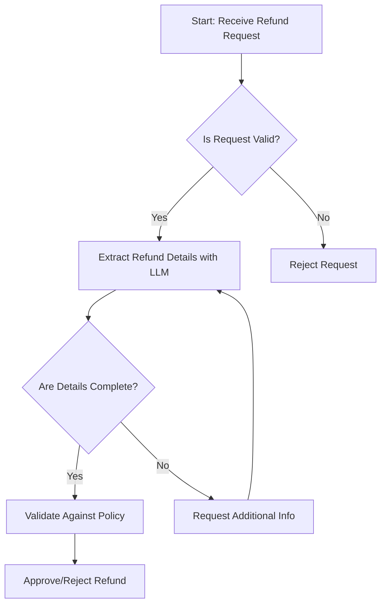
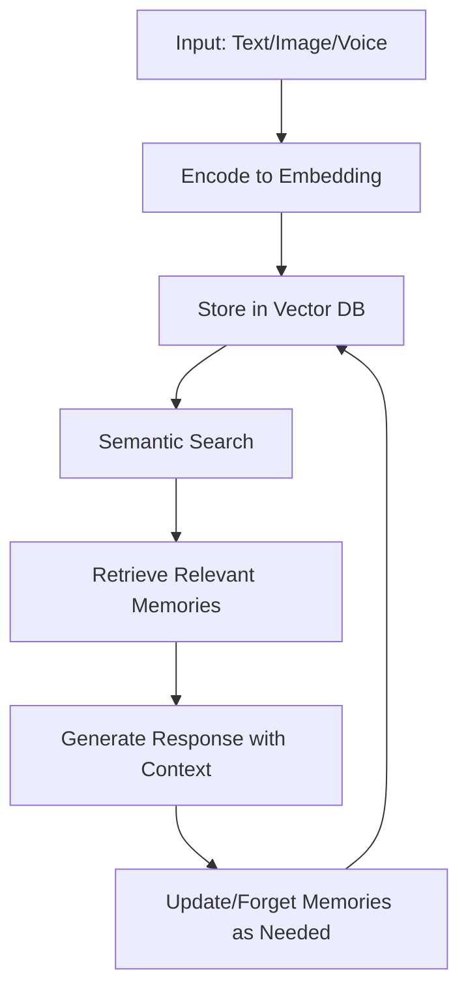
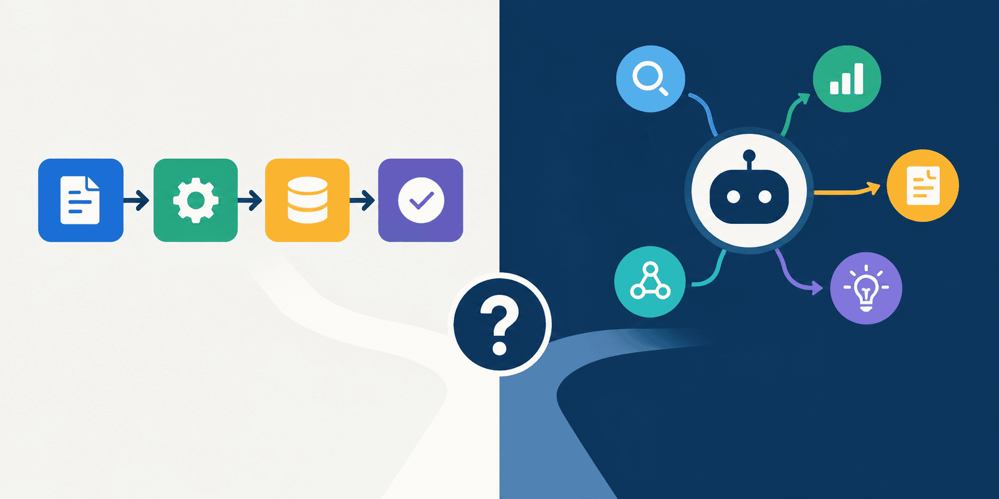
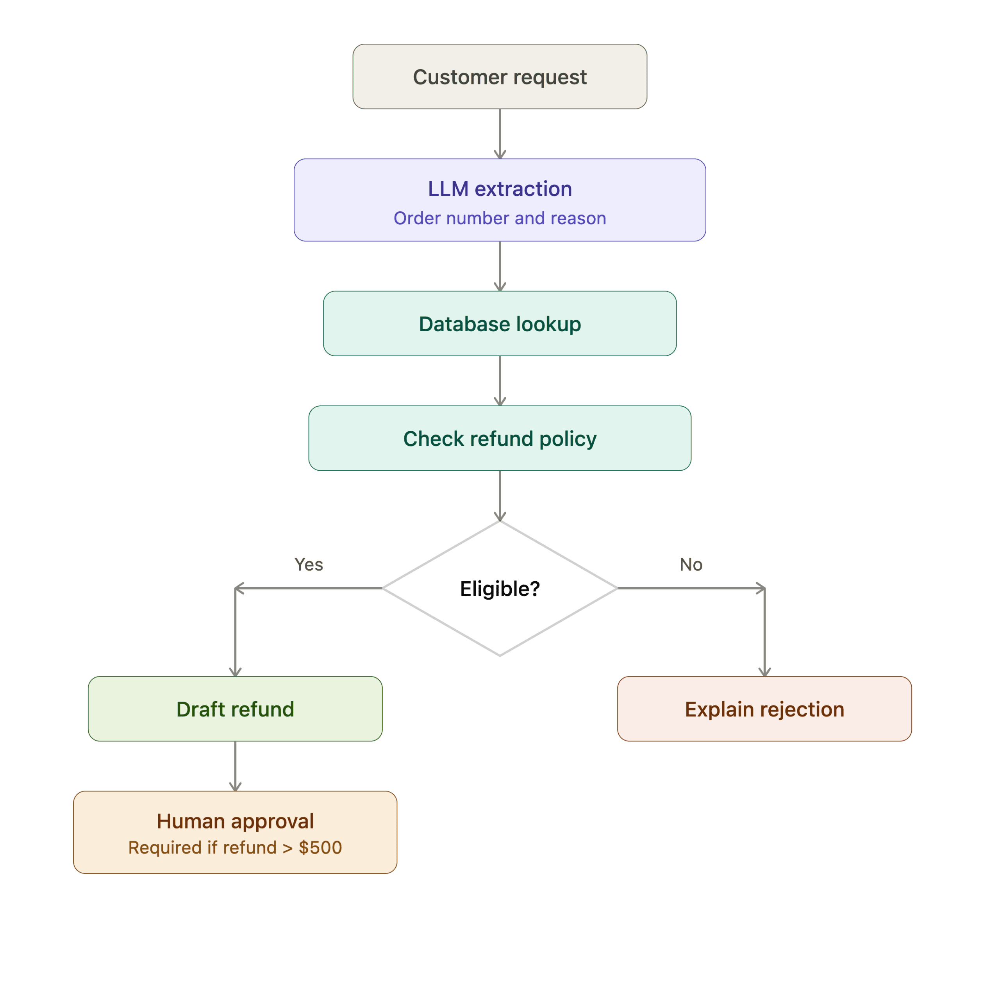
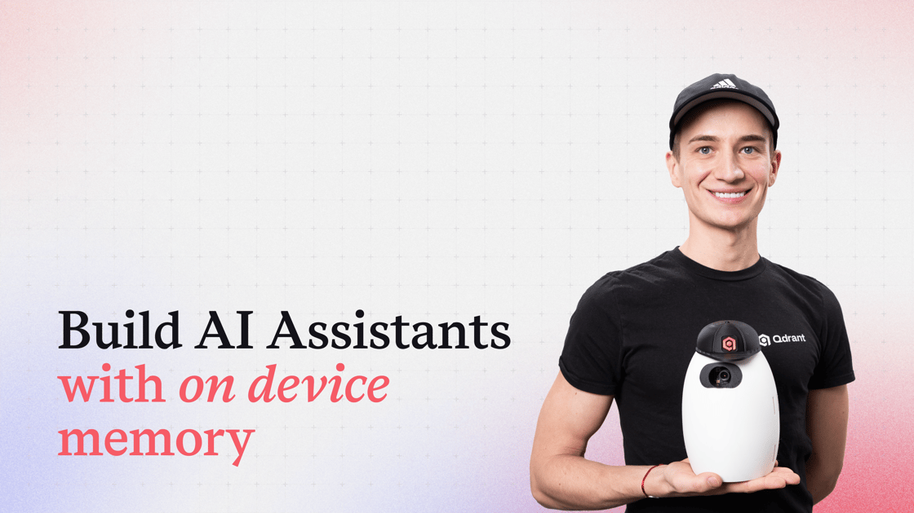

> 🎙️ **Listen to the podcast version of this article:**
> <audio controls src="index.mp3"></audio>


---

> 💡 **TL;DR:** This article dissects the AI agent vs. workflow debate with a practical test for implementation, reproduces Anthropic’s toy models of superposition in tiny networks to reveal emergent patterns, and explores building on-device AI assistants with persistent, privacy-preserving memory for text, voice, and images.

| **Metric / Innovation Area**               | **Insight / Takeaway**                                                                                     |
|-------------------------------------------|----------------------------------------------------------------------------------------------------------|
| AI Agents vs. Workflows                   | Use a workflow if the control flow is fixed at design time; opt for an agent if runtime discoveries dictate next steps. |
| Tiny Networks & Superposition             | Training a 2-neuron network with hand-derived gradients reveals pentagon patterns, illustrating emergent behaviors in compressed models. |
| On-Device AI Memory                       | Local memory systems enable assistants to store, retrieve, and forget text/image memories without cloud dependency. |

---

### AI Agents vs Workflows: Deciding the Right Approach

The AI landscape is awash with terminology, and few words have been as overused—or as misunderstood—as *"agent."* From chatbots with a handful of tools to fully autonomous systems capable of planning, acting, and adapting, the label *"agent"* is often slapped onto systems that are, in reality, far simpler. This semantic inflation risks obscuring the genuine value of agentic systems while saddling developers with unnecessary complexity. So, how do we cut through the noise?

#### Key Differences: Workflows vs. Agents
A **workflow** (or pipeline/chain) is a system where the control flow is *fixed at design time*. The developer predefines the sequence of steps, branches, and stop conditions. Even if an LLM is used for one or more steps, the overall path remains predetermined. Consider a customer refund processing system:



Here, every possible path is known in advance. The system may use an LLM for extraction or validation, but the logic is static. This is a *workflow*.

An **agent**, by contrast, is a system where the *LLM itself decides the next action at runtime*. Given a goal and access to tools, the agent dynamically determines which tool to call, in what order, and when to stop. For example, diagnosing a production outage might require the agent to:
1. Check error rates.
2. Inspect recent deployments *or* segment failures by region (depending on initial findings).
3. Drill down into stack traces, CDN status, or DNS errors based on intermediate results.

The critical distinction: *In a workflow, the developer draws the flowchart. In an agent, the LLM draws it as it goes.*

#### The Practical Test: Can You Draw the Flowchart?
Before writing a single line of code, ask yourself: **Can I draw a complete flowchart of the task before the LLM runs?**
- If **yes**, and every major step/branch can be listed with confidence, build a **workflow**. 
- If the next step depends on *runtime discoveries* (e.g., new data, unexpected tool results), you likely need an **agent**.

This test alone can eliminate many unnecessary agents. For instance, extracting data from contracts and saving it to a database is a workflow—the steps are known. But investigating an open-ended customer issue where the path isn’t predictable? That’s agent territory.

#### Applications and Limitations
Workflows excel in high-volume, low-latency, or compliance-sensitive scenarios (e.g., fraud detection pipelines). Agents shine in open-ended tasks like root-cause analysis or creative problem-solving. However, agents introduce complexity: they’re slower, costlier (more tokens/API calls), and harder to debug. A hybrid approach—starting with a workflow and adding agentic components only where necessary—often strikes the best balance.

**Why It Matters:** Over-engineering with agents when a workflow suffices leads to bloated systems. Conversely, underestimating the need for agentic flexibility can result in brittle, inflexible tools. The key is to *start constrained* and expand only when the workflow fails.

---

### Tiny Networks and Superposition: From Data Compression to Emergent Patterns

Anthropic’s ["Toy Models of Superposition"](https://transformer-circuits.pub/2022/toy_model/index.html) paper demonstrated how tiny neural networks could exhibit *superposition*—a phenomenon where a single neuron encodes multiple features simultaneously, much like a quantum bit. Reproducing this experiment from scratch in NumPy, with hand-derived gradients, offers a fascinating window into how models compress data and how emergent patterns (like pentagons) can arise from simplicity.

#### Reproducing Superposition in a 2-Neuron Network
The toy model consists of a network with just two neurons, trained to perform a seemingly simple task: mapping input vectors to output vectors. Yet, the training process reveals something unexpected. The network doesn’t just learn the task—it develops an internal representation where features overlap in a way that minimizes loss. This is superposition in action.

Here’s a minimal implementation in NumPy to train such a network:

```python
import numpy as np

# Define a simple 2-neuron network
class TinyNetwork:
    def __init__(self):
        self.W = np.random.randn(2, 2) * 0.1  # Weight matrix
        self.b = np.zeros(2)                 # Bias
    
    def forward(self, x):
        return np.dot(x, self.W) + self.b
    
    def loss(self, x, y_true):
        y_pred = self.forward(x)
        return np.mean((y_pred - y_true) ** 2)  # MSE loss
    
    def backward(self, x, y_true, lr=0.1):
        y_pred = self.forward(x)
        grad_y = 2 * (y_pred - y_true) / len(x)  # Gradient of loss w.r.t. y_pred
        grad_W = np.dot(x.T, grad_y)             # Gradient w.r.t. W
        grad_b = np.sum(grad_y, axis=0)         # Gradient w.r.t. b
        self.W -= lr * grad_W
        self.b -= lr * grad_b

# Example usage
net = TinyNetwork()
X = np.array([[1, 0], [0, 1], [-1, 0], [0, -1]])  # Inputs (e.g., unit circle)
y = np.array([[0, 1], [-1, 0], [0, -1], [1, 0]])   # Targets (rotated 90 degrees)

for _ in range(1000):
    net.backward(X, y, lr=0.01)

print("Trained weights:\n", net.W)
```

When trained on inputs and targets arranged in a circular pattern, the network’s weights often converge to a configuration where the internal representations form a *pentagon* when visualized. This isn’t a bug—it’s a feature of the optimization landscape. The network is compressing the data into a lower-dimensional space where multiple features coexist in the same neuron.

#### The Pentagon Pattern: A Window into Emergent Behavior
The pentagon emerges because the network is trying to minimize the loss across all input-output pairs simultaneously. In doing so, it finds a solution where the weights align in a way that *superimposes* multiple transformations. This is analogous to how larger models might develop *polysemantic neurons*—neurons that activate in response to multiple, seemingly unrelated features.

Mathematically, the network is solving an optimization problem of the form:
$$ \min_{W, b} \frac{1}{N} \sum_{i=1}^{N} \| y_i - (W^T x_i + b) \|_2^2 $$
where $x_i$ are the inputs, $y_i$ are the targets, and $W$, $b$ are the weights and biases. The solution to this problem in a 2D space often leads to symmetric, polygonal weight configurations.

**Why It Matters:** Understanding superposition in tiny networks helps us grasp how larger models might be compressing and representing data. This has implications for interpretability, robustness, and even the design of more efficient architectures. If a 2-neuron network can exhibit such rich behavior, what might we discover in models with billions of parameters?

---

### On-Device AI Assistants: Privacy-Preserving Memory

Cloud-based AI assistants are powerful but come with a significant trade-off: *privacy*. Every query, every image, every voice command is sent to a remote server, where it may be stored, analyzed, or even repurposed. For applications in healthcare, finance, or personal use, this is a non-starter. The solution? **On-device AI assistants with persistent, local memory.**

#### Building a Local Memory System
An on-device assistant must be able to:
1. **Store** memories (text, images, voice) locally.
2. **Retrieve** relevant memories based on semantic meaning (not just keywords).
3. **Filter** memories by context, time, or user-defined rules.
4. **Forget** memories when they’re no longer needed or when privacy demands it.

This requires a combination of:
- **Vector embeddings** (to represent memories in a searchable space).
- **Vector databases** (to store and query embeddings efficiently).
- **Cross-modal retrieval** (to handle text, images, and voice uniformly).

Here’s a high-level architecture for such a system:



#### Implementing Cross-Modal Memory
To handle text, images, and voice, the system needs:
- **Text embeddings**: Use a model like `sentence-transformers/all-MiniLM-L6-v2`.
- **Image embeddings**: Use a vision model like `clip-ViT-B-32`.
- **Voice embeddings**: Use a speech model like `Wav2Vec2`.

All embeddings are stored in a local vector database (e.g., [Qdrant](https://qdrant.tech/)), which supports fast similarity search. For example, to retrieve memories related to a user’s query:

```python
from sentence_transformers import SentenceTransformer
from qdrant_client import QdrantClient

# Initialize models and DB
text_model = SentenceTransformer('all-MiniLM-L6-v2')
client = QdrantClient(location=':memory:')  # Or local path

# Store a memory
memory_text = "The user loves hiking in the Alps."
embedding = text_model.encode(memory_text)
client.upsert(
    collection_name='memories',
    points=[{'id': 1, 'vector': embedding.tolist(), 'payload': {'text': memory_text}}]
)

# Retrieve relevant memories
query = "What are the user's favorite outdoor activities?"
query_embedding = text_model.encode(query)
results = client.search(
    collection_name='memories',
    query_vector=query_embedding.tolist(),
    limit=3
)
print("Relevant memories:", [r.payload['text'] for r in results])
```

#### Running Locally: Mac, Windows, Linux
On-device assistants leverage frameworks like:
- **LLMs**: `llama.cpp` or `TensorRT-LLM` for local inference.
- **Vector DBs**: Qdrant, Chroma, or SQLite with vector extensions.
- **Multimodal Models**: ONNX Runtime for cross-platform compatibility.

For example, to run a local LLM with memory:
1. Download a quantized model (e.g., `llama-2-7b-chat.Q4_K_M.gguf`).
2. Use `llama.cpp` to load and run the model.
3. Integrate with Qdrant for memory storage/retrieval.

**Use Cases:**
- **Healthcare**: A local assistant that remembers patient history without cloud storage.
- **Finance**: An AI that tracks transactions and flags anomalies, all on-device.
- **Personal Productivity**: A voice assistant that learns your habits without sending data to the cloud.

**Why It Matters:** On-device AI is the future of privacy-preserving applications. As models shrink and hardware improves, we’ll see a shift from cloud-dependent to *sovereign* AI—systems that are entirely under the user’s control. This isn’t just about privacy; it’s about *autonomy*.

---

### Final Thoughts: The Convergence of Simplicity and Power

These three advancements—practical agent/workflow distinctions, emergent behaviors in tiny networks, and on-device memory—highlight a broader trend in AI: *the democratization of complexity*. We’re learning to build systems that are both powerful and interpretable, scalable yet private, and flexible without being over-engineered.

For developers, the takeaway is clear:
- **Start simple**: Use workflows unless you *need* an agent.
- **Embrace emergence**: Even tiny models can reveal profound insights.
- **Prioritize privacy**: On-device AI isn’t just a niche—it’s a necessity.

The future of AI isn’t just about bigger models or more data. It’s about *smarter systems*—ones that understand their own limitations, respect user privacy, and reveal their inner workings in ways we can all understand. And as we’ve seen, sometimes the smallest networks can teach us the biggest lessons.







Written with [Argos](https://github.com/Neilstid/argos)
