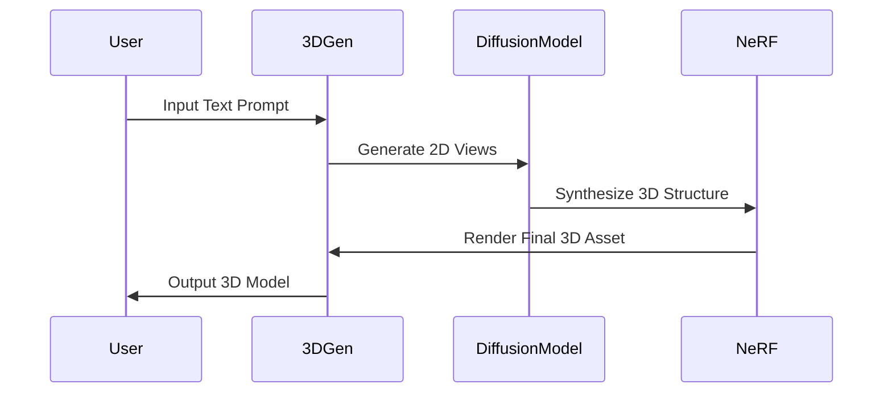

> 🎙️ **Listen to the podcast version of this article:**
> <audio controls src="index.mp3"></audio>


---

> 💡 **TL;DR:** 2024 is shaping up to be a landmark year for AI, with Google’s open-source Gemma LLM, Meta’s text-to-3D generation model, and Real-ESRGAN’s real-time super-resolution tool redefining the boundaries of what’s possible. These innovations democratize access to advanced AI, enhance creative workflows, and push the limits of visual fidelity in real-time applications.

| Metric / Innovation Area | Insight / Takeaway |
|--------------------------|--------------------|
| **Google Gemma** | Open-source LLM with 7B parameters, optimized for efficiency and responsible AI, outperforming larger models in key benchmarks. |
| **Meta 3D Gen** | Text-to-3D generation model creating high-quality 3D assets in under a minute, revolutionizing digital content creation. |
| **Real-ESRGAN** | Real-time super-resolution for images and videos, achieving 4K upscaling with minimal latency, powered by advanced GAN architectures. |

---

### Google’s Gemma: A New Era for Open-Source Large Language Models

In a move that underscores the growing importance of accessibility in AI, Google recently unveiled **Gemma**, a family of lightweight, open-source large language models (LLMs) designed to deliver state-of-the-art performance with remarkable efficiency. Built on the same research and technology that powers Google’s flagship Gemini models, Gemma is available in two sizes: **7B and 2B parameters**, making it ideal for deployment on everything from cloud servers to edge devices.

Gemma’s architecture leverages **decoder-only transformer models**, optimized for both inference and fine-tuning. One of its standout features is its **pre-training on 6 trillion tokens** of diverse text data, followed by fine-tuning for alignment with human values. This ensures not only high performance but also a strong emphasis on **responsible AI**, with built-in safeguards against generating harmful or biased content. Early benchmarks show Gemma-7B outperforming larger models like Mistral-7B and Llama2-13B in tasks such as reasoning, math, and coding, all while maintaining a compact footprint.

```mermaid
flowchart TD
    A[Input Text] --> B[Tokenizer]
    B --> C[Gemma Model
    (Decoder-Only
    Transformer)]
    C --> D[Logits]
    D --> E[Softmax]
    E --> F[Output Text]
    style C fill:#f9f,stroke:#333
```

The model’s efficiency is further enhanced by its compatibility with **JAX, PyTorch, and TensorFlow**, as well as frameworks like Hugging Face Transformers. Developers can fine-tune Gemma for domain-specific applications, from chatbots to code generation, using minimal computational resources. Google has also released a **responsible generative AI toolkit** to help users deploy Gemma safely and ethically.

Why does this matter? Gemma lowers the barrier to entry for high-quality LLM development, enabling startups, researchers, and even hobbyists to experiment with cutting-edge NLP without prohibitive costs. As open-source models continue to close the gap with proprietary ones, we may see a surge in **customized, niche AI applications** tailored to industries like healthcare, finance, and education.

---

### Meta’s 3D Gen: Turning Text into 3D Assets in Seconds

Meta has taken a giant leap in **generative AI for 3D content** with the introduction of **3D Gen**, a model capable of creating high-quality 3D assets from text prompts in under a minute. This innovation addresses a longstanding challenge in digital content creation: the time-consuming and technically complex process of 3D modeling. Whether for gaming, virtual reality, or product design, 3D Gen promises to democratize 3D asset generation, making it as simple as describing an object in plain language.

At its core, 3D Gen combines **diffusion models** with **neural radiance fields (NeRF)** to generate 3D objects with intricate details and realistic textures. The model is trained on a massive dataset of 3D shapes and their corresponding text descriptions, enabling it to understand and interpret prompts like *"a futuristic chair with glowing edges and a metallic finish."* Unlike traditional 3D modeling tools, which require manual input or scripting, 3D Gen automates the entire pipeline, from geometry to material properties.

The technical workflow can be visualized as follows:



One of the most impressive aspects of 3D Gen is its **speed**. Traditional 3D modeling can take hours or even days, depending on complexity. Meta’s model, however, generates a fully textured 3D asset in **less than 60 seconds**, a feat achieved through optimizations in the diffusion process and parallelized rendering. Early demos show the model producing everything from **stylized characters** to **detailed architectural structures**, all with minimal user input.

The implications for industries like **gaming, film, and e-commerce** are profound. Game developers can rapidly prototype environments and characters, while e-commerce platforms can generate 3D product models on-the-fly for virtual try-ons. As Meta continues to refine 3D Gen, we may see integration with its **Metaverse initiatives**, enabling users to populate virtual worlds with AI-generated assets effortlessly.

---

### Real-ESRGAN: Real-Time Super-Resolution for the Masses

In the realm of **computer vision**, **Real-ESRGAN** has emerged as a game-changer for image and video upscaling. Developed by researchers at **Tencent ARC and Shenzhen University**, Real-ESRGAN builds on the success of its predecessor, ESRGAN, by introducing **real-time super-resolution capabilities** that preserve fine details while minimizing artifacts. Whether you’re enhancing low-resolution photos or upscaling vintage footage to 4K, Real-ESRGAN delivers **stunning results with minimal latency**.

The model’s architecture is a **generative adversarial network (GAN)** that employs a **residual-in-residual dense block (RRDB)** to capture intricate textures and patterns. Unlike traditional super-resolution methods, which often produce blurry or overly smoothed outputs, Real-ESRGAN uses a **perceptual loss function** to prioritize visual quality over pixel-wise accuracy. This ensures that upscaled images retain **natural textures and sharp edges**, even at high magnification factors (e.g., 4x or 8x).

Mathematically, the objective function of Real-ESRGAN can be represented as:

$$ \mathcal{L}_{total} = \mathcal{L}_{pixel} + \lambda \mathcal{L}_{perceptual} + \mu \mathcal{L}_{adversarial} $$

Where:
- $ \mathcal{L}_{pixel} $ is the pixel-wise loss (e.g., L1 or L2).
- $ \mathcal{L}_{perceptual} $ is the perceptual loss, computed using a pre-trained VGG network to compare deep features.
- $ \mathcal{L}_{adversarial} $ is the adversarial loss, which encourages the generator to produce realistic outputs that fool the discriminator.

Real-ESRGAN’s real-time performance is achieved through **model distillation and optimization techniques**, such as **knowledge distillation from a teacher GAN** and **efficient inference strategies**. The result is a model that can process **1080p video at 30 FPS** on a single GPU, making it suitable for applications like **video enhancement, medical imaging, and real-time surveillance**.

```python
# Example: Upscaling an image with Real-ESRGAN using Hugging Face
from PIL import Image
import requests
from io import BytesIO
from real_esrgan import RealESRGAN

# Load model
model = RealESRGAN('RealESRGAN_x4plus', half=True)  # x4 upscaling

# Load input image
response = requests.get('https://example.com/low_res_image.jpg')
img = Image.open(BytesIO(response.content))

# Upscale
upscaled_img = model.predict(img)
upscaled_img.save('upscaled_image.jpg')
```

The practical applications of Real-ESRGAN are vast. In **medical imaging**, it can enhance the resolution of MRI or CT scans, aiding in more accurate diagnoses. In **entertainment**, it can restore old films and photos to modern standards, preserving cultural heritage. For **consumers**, it offers a way to breathe new life into low-resolution images from smartphones or social media.

As Real-ESRGAN continues to evolve, we may see integration with **AR/VR systems**, where real-time upscaling could enhance the visual fidelity of virtual environments. The model’s open-source nature also invites contributions from the community, potentially leading to even more advanced iterations.

---

### The Big Picture: Where AI Is Headed in 2024

The innovations highlighted here—**Gemma, 3D Gen, and Real-ESRGAN**—represent a broader trend in AI: the **democratization of cutting-edge tools**. Whether it’s Google making high-performance LLMs accessible to all, Meta simplifying 3D content creation, or Real-ESRGAN enabling real-time super-resolution, the common thread is **lowering barriers to entry** while pushing the boundaries of what’s technically possible.

For **developers and researchers**, these tools provide new avenues for experimentation and innovation. For **businesses**, they offer opportunities to streamline workflows, reduce costs, and create novel products. And for **consumers**, they promise more immersive, personalized, and high-quality digital experiences.

As we move further into 2024, expect to see these technologies **converge in unexpected ways**. Imagine, for instance, a **multimodal AI assistant** that uses Gemma for NLP, 3D Gen for creating visual assets, and Real-ESRGAN for enhancing images—all in a single, cohesive workflow. The possibilities are as limitless as the creativity of the AI community itself.

Written with [Argos](https://github.com/Neilstid/argos)
