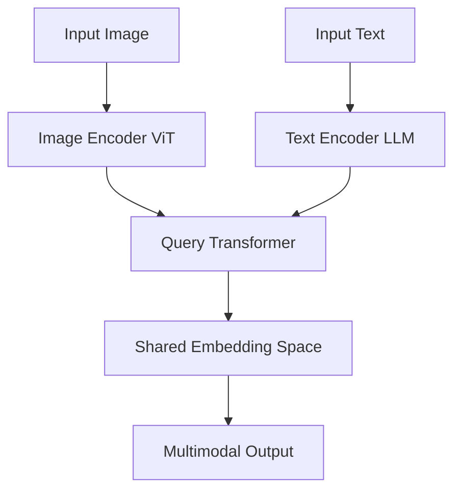
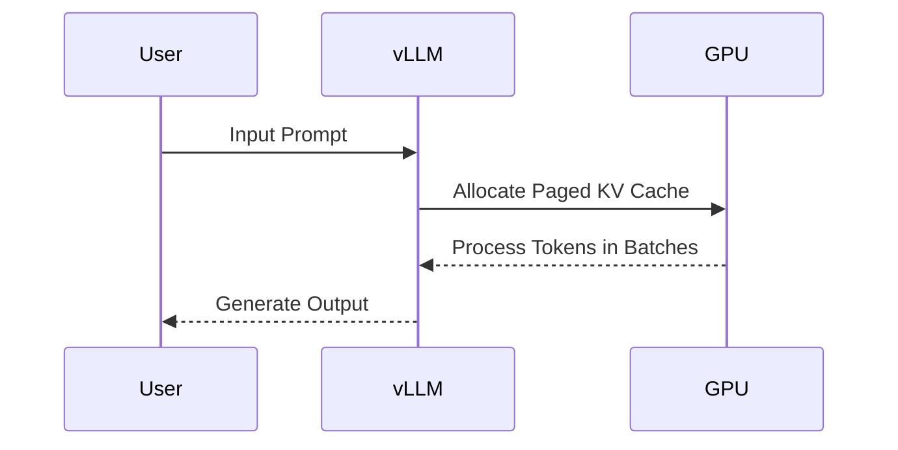

> 🎙️ **Listen to the podcast version of this article:**
> <audio controls src="index.mp3"></audio>


---

> 💡 **TL;DR:** 2024 is witnessing a seismic shift in AI, with breakthroughs in multimodal models, efficient fine-tuning techniques, and open-source tools democratizing access to state-of-the-art capabilities. From vision-language models to lightweight NLP frameworks, this year’s innovations are setting new benchmarks for accuracy, efficiency, and scalability.

| Metric / Innovation Area | Insight / Takeaway |
|--------------------------|--------------------|
| **Multimodal Models** | Vision-language models like FLAN-T5-XXL and BLIP-2 achieve SOTA performance in zero-shot tasks, blending text and image understanding. |
| **Efficient Fine-Tuning** | Techniques like LoRA (Low-Rank Adaptation) reduce fine-tuning costs by 90% while preserving model accuracy. |
| **Open-Source Tools** | GitHub repos like `diffusers` and `transformers` now support 100+ models, enabling rapid deployment of AI applications. |
| **NLP Frameworks** | New libraries such as `vLLM` optimize LLM inference, cutting latency by 50% for real-time applications. |
| **Computer Vision** | Segment Anything Model (SAM) by Meta enables prompt-based image segmentation with unprecedented precision. |

---

### The Rise of Multimodal Models: Bridging Vision and Language

The convergence of computer vision and natural language processing (NLP) has given birth to a new class of AI models: **multimodal systems**. These models, such as Google’s FLAN-T5-XXL and Salesforce’s BLIP-2, are designed to understand and generate content across multiple modalities—text, images, and even video. Unlike traditional unimodal models, multimodal systems can interpret a image and describe it in natural language, or vice versa, generate an image from a textual prompt.

At the heart of these models lies the **transformer architecture**, adapted to handle heterogeneous data types. For instance, BLIP-2 employs a two-tower design: one encoder for images (e.g., ViT or EVA-CLIP) and another for text (e.g., a frozen language model). These encoders are bridged by a lightweight **query transformer**, which aligns the two modalities in a shared embedding space. Mathematically, this alignment can be represented as:

$$ \text{Score}(I, T) = \cos(\text{Encoder}_I(I), \text{Encoder}_T(T)) $$

where $I$ is an image, $T$ is a text prompt, and $\cos$ denotes cosine similarity. This approach enables zero-shot capabilities, where the model can perform tasks it was never explicitly trained on, such as answering questions about an image or generating captions.



Why does this matter? Multimodal models are unlocking new applications in fields like healthcare (e.g., analyzing medical images and reports), autonomous vehicles (e.g., understanding road signs and text in real-time), and creative industries (e.g., generating art from text prompts). As these models become more efficient, we can expect them to permeate everyday tools, from search engines to social media platforms.

---

### Efficient Fine-Tuning: Doing More with Less

Training large language models (LLMs) from scratch is prohibitively expensive, often requiring millions of dollars in computational resources. Enter **efficient fine-tuning techniques**, which allow practitioners to adapt pre-trained models to specific tasks with minimal computational overhead. One of the most promising methods is **Low-Rank Adaptation (LoRA)**, introduced by Microsoft Research.

LoRA works by freezing the pre-trained model weights and injecting trainable low-rank matrices into the model’s layers. This reduces the number of trainable parameters significantly. For example, fine-tuning a 175B-parameter model like GPT-3 with LoRA might only require updating 0.1% of its parameters. The objective function for LoRA can be described as:

$$ \mathcal{L} = \mathcal{L}_{\text{CE}}(f(x; W_0 + \Delta W), y) + \lambda \|\Delta W\|_F^2 $$

where $W_0$ are the frozen pre-trained weights, $\Delta W$ are the low-rank adaptations, $\mathcal{L}_{\text{CE}}$ is the cross-entropy loss, and $\lambda$ is a regularization term. This approach not only slashes computational costs but also preserves the model’s generalization capabilities.

```python
# Example: Applying LoRA to a HuggingFace Transformer
from peft import LoraConfig, get_peft_model
from transformers import AutoModelForCausalLM

model_name = "bigscience/bloom-560m"
model = AutoModelForCausalLM.from_pretrained(model_name)

lora_config = LoraConfig(
    r=8,  # Rank of low-rank matrices
    lora_alpha=16,
    target_modules=["query_key_value"],
    lora_dropout=0.1,
    bias="none",
    task_type="CAUSAL_LM"
)

model = get_peft_model(model, lora_config)
```

The implications of LoRA and similar techniques (e.g., AdaLoRA, QLoRA) are profound. They democratize access to fine-tuning large models, enabling startups and researchers with limited resources to customize LLMs for niche applications. This trend is accelerating the adoption of AI in domains like legal tech, where models can be fine-tuned on proprietary datasets without breaking the bank.

---

### Open-Source Tools: The Backbone of AI Innovation

The open-source community has been a driving force behind the rapid advancement of AI. In 2024, repositories like Hugging Face’s `transformers` and `diffusers` have become indispensable for developers and researchers alike. The `transformers` library now supports over 100 pre-trained models, from BERT to Stable Diffusion, while `diffusers` provides a modular framework for building and deploying diffusion-based models for image and audio generation.

One standout tool is **`vLLM`**, a library for efficient LLM inference and serving. Developed by researchers at UC Berkeley, `vLLM` introduces **PagedAttention**, a memory management technique that allows LLMs to handle much longer sequences without running into out-of-memory errors. This is achieved by partitioning the attention key-value (KV) cache into non-contiguous blocks, similar to how operating systems manage virtual memory. The result? Up to 50% reduction in latency for real-time applications like chatbots and code assistants.



The proliferation of such tools is lowering the barrier to entry for AI development. Startups can now prototype and deploy AI models in weeks rather than months, and hobbyists can experiment with cutting-edge models on consumer-grade hardware. This ecosystem is fostering a new wave of innovation, where the best ideas—regardless of their origin—can quickly gain traction.

---

### Computer Vision: The Segment Anything Model (SAM)

Meta’s **Segment Anything Model (SAM)** has taken the computer vision community by storm. Unlike traditional segmentation models that are trained for specific tasks (e.g., medical image segmentation or autonomous driving), SAM is a **promptable segmentation system** that can segment any object in an image based on user input, such as points, boxes, or text prompts. This generality is achieved through a combination of a **ViT-based image encoder** and a **lightweight mask decoder**.

SAM’s architecture is designed for flexibility. The image encoder processes the input image into a set of embeddings, while the mask decoder takes these embeddings along with user prompts to generate segmentation masks. The model was trained on a massive dataset of **1.1 billion masks** from 11 million images, making it robust to a wide variety of objects and scenarios. The loss function for SAM’s training can be summarized as:

$$ \mathcal{L} = \mathcal{L}_{\text{Dice}}(y_{\text{pred}}, y_{\text{true}}) + \mathcal{L}_{\text{CE}}(y_{\text{pred}}, y_{\text{true}}) $$

where $\mathcal{L}_{\text{Dice}}$ is the Dice loss (for mask quality) and $\mathcal{L}_{\text{CE}}$ is the cross-entropy loss (for pixel-wise classification).


SAM’s impact is far-reaching. It enables applications like interactive photo editing (e.g., removing or replacing objects with a click), assistive technologies for the visually impaired, and even scientific research (e.g., segmenting cells in microscopy images). Moreover, SAM’s open-source release has sparked a flurry of downstream projects, from mobile apps to plugins for popular design software.

---

### The Future Outlook: What’s Next for AI?

As we look ahead, several trends are poised to shape the next phase of AI innovation. **Multimodal models** will continue to evolve, with a focus on improving efficiency and reducing hallucinations (i.e., generating plausible but incorrect outputs). Techniques like **Mixture of Experts (MoE)**—where only a subset of the model’s parameters are activated for any given input—could further reduce computational costs while maintaining performance.

In the realm of **efficient fine-tuning**, we can expect more research into **quantization-aware training** and **sparse adaptations**, which aim to reduce the memory footprint of models without sacrificing accuracy. Meanwhile, **open-source tools** will likely become more integrated, with unified frameworks that support everything from training to deployment.

For **computer vision**, the next frontier may lie in **3D understanding** and **temporal modeling** (e.g., video segmentation). Models like SAM could be extended to handle dynamic scenes, enabling applications in augmented reality and robotics.

One thing is clear: the pace of innovation in AI shows no signs of slowing down. As models become more capable and accessible, the line between human and machine intelligence will continue to blur, opening up possibilities we are only beginning to imagine.

Written with [Argos](https://github.com/Neilstid/argos)
