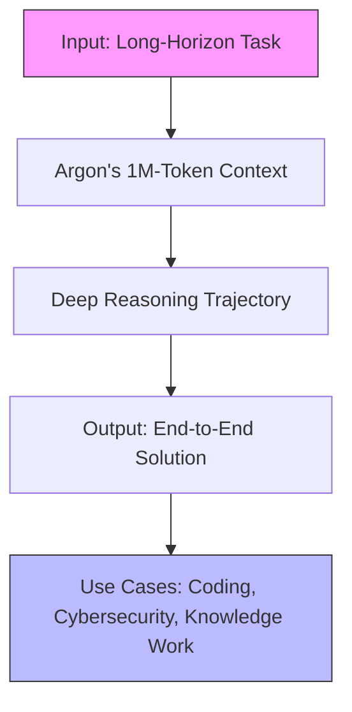

> 🎙️ **Listen to the podcast version of this article:**
> <audio controls src="index.mp3"></audio>


---

> 💡 **TL;DR:** This week marks a watershed moment for AI: Google’s **Gemini 4 Argon** pushes the frontier with 1M-token reasoning for coding and cyber-defense, OpenAI’s **GPT-6.1 Sol** delivers near-Astra performance at a fraction of the cost, and NVIDIA’s **Kumo Tabular** redefines tabular data science with zero-shot, single-pass predictions. These innovations democratize access to cutting-edge AI while raising the bar for safety, scalability, and real-world applicability.

| **Metric / Innovation Area**               | **Insight / Takeaway**                                                                                     |
|------------------------------------------|---------------------------------------------------------------------------------------------------------|
| **Model Context Window**                 | Gemini 4 Argon: 1M tokens; GPT-6.1 Sol: 1.05M tokens; Kumo Tabular: 60K rows × 100 columns (synthetic). |
| **Pricing (Input/Output per 1M tokens)** | GPT-6.1 Sol: $2/$10 (cached input: $0.10); Gemini 4 Argon: $2/$10 (Fairwind Program).                     |
| **Benchmark Leadership**                  | Argon: #1 on DeepSWE (77.9%), Vals Index, CWE-bench (68%); Sol: Near-Astra on DeepSWE at 1/5 cost.     |
| **Tabular AI Revolution**                | Kumo Tabular: No training, no feature engineering; predicts new rows in one forward pass.             |
| **Safety & Accessibility**               | Argon: Phased rollout with cyber-defense focus; Sol: 5× cheaper than Astra; Kumo: OpenMDW-1.1 license.   |

---

### Introduction: Why These Three Stories Matter

The AI landscape is evolving at a breakneck pace, but this week’s announcements from Google, OpenAI, and NVIDIA stand out for their **transformative potential**—not just in raw performance, but in **accessibility, safety, and real-world utility**. 

Gemini 4 Argon isn’t just another frontier model; it’s a **workflow revolutionizer**, capable of sustaining deep reasoning across 1M-token trajectories to tackle problems like quantum algorithm optimization and large-scale codebase migrations. OpenAI’s GPT-6.1 Sol, meanwhile, **democratizes near-Astra-level capabilities** at a price point that could accelerate startup adoption and agentic AI deployment. And NVIDIA’s Kumo Tabular? It **eliminates the friction** in tabular data science, offering zero-shot predictions without the traditional headaches of training or feature engineering.

These aren’t incremental updates—they’re **paradigm shifts**. Let’s break them down.

---

### Section 1: Gemini 4 Argon – Google’s 1M-Token Frontier for Deep Reasoning

#### **Context: The Need for Long-Horizon AI**
Complex workflows—whether in software engineering, enterprise knowledge work, or cybersecurity—often require models to **sustain reasoning over extended sequences** without losing coherence or depth. Previous models hit token limits or struggled with multi-step tasks, forcing users to break problems into chunks or accept shallow outputs. Google’s **Gemini 4 Argon** shatters these constraints with a **1M-token output limit**, enabling end-to-end problem-solving in a single pass.


#### **Tech Deep Dive: Architecture and Capabilities**
Argon is designed for **long-horizon workflows**, excelling in:
- **Software Engineering**: Achieves **77.9% on DeepSWE v1.1**, a benchmark measuring real-world coding tasks. For example, Argon agents optimized a Rust video decoder to run **2.7× faster** than the original Rust port, matching C++ performance while maintaining memory safety.
- **Enterprise Knowledge Work**: Leads the **Vals Index** (economic impact across finance, legal, and tax) and **Harvey’s Legal Agent Benchmark**, demonstrating prowess in multi-step research and drafting.
- **Cybersecurity Defense**: Tops **CWE-bench v1** (68%) and uncovered critical vulnerabilities in healthcare software, outperforming prior models in black-box penetration testing.

The model’s **1M-token output** allows it to:
- Generate and refine codebases (e.g., migrating **800K+ lines** of C/C++ to Rust).
- Analyze long videos (state-of-the-art **91.7% on LVBench**).
- Drive autonomous memory optimizations (saving **300 TiB+** in Google’s data centers).



#### **Safety and Rollout: The Fairwind Program**
Google is taking a **phased approach** to Argon’s release, prioritizing **cyber defenders** via the **Fairwind Program**. Key safeguards include:
1. **Misuse Defense**: Robust refusal mechanisms for CBRN (chemical, biological, radiological, nuclear) and cyberattack prompts.
2. **Prompt Injection Resilience**: Leading performance on **Gray Swan’s IPI benchmark** via adversarial training.
3. **Misalignment Monitoring**: Real-time tracking of chain-of-thought to prevent out-of-bounds actions.
4. **Hardened Systems**: Isolated sandbox environments for high-risk evaluations.


#### **Why It Matters**
Argon’s **1M-token reasoning** and **cross-domain mastery** signal a shift toward **autonomous, high-stakes AI agents**. For enterprises, this means **faster migrations, deeper research, and proactive cybersecurity**. For developers, it’s a glimpse into a future where AI doesn’t just assist but **co-pilots entire projects**.

---

### Section 2: OpenAI GPT-6.1 Sol – Near-Astra Performance at One-Fifth the Cost

#### **Context: The Cost Barrier in Agentic AI**
Agentic AI—where models interact with tools, APIs, and environments—has been **prohibitively expensive** for many startups and small teams. OpenAI’s **GPT-6.1 Sol** changes this by delivering **near-Astra-level performance** at **$2 input / $10 output per 1M tokens** (with cached input at **$0.10**), a **5× reduction** from Astra’s pricing.


#### **Tech Deep Dive: Benchmarks and Pricing**
Sol’s **cost-efficiency** doesn’t come at the expense of performance:
- **Coding**: Matches **GPT-6 Astra on DeepSWE v1.1** (one-fifth the cost) and beats **GPT-6 Sol by 6.4%**.
- **Professional Work**: Outperforms **Claude Opus 5.5** on **GDP.pdf** (complex PDF analysis) and **AutomationBench 1.0.6** (+2.2 points at **1/3 the cost**).
- **Computer Use**: Gains **7 points** over GPT-6 Sol on **OSWorld 2.0**, landing within **2.1 points of Astra** at **1/7 the cost per task**.
- **Science**: Doubles GPT-6 Sol’s score on **Terminal-Bench Science 0.1** ($5.47 avg. cost vs. $23.21 for Opus 5.5).

**Pricing Breakdown (per 1M tokens):**
| **Model**            | **Input** | **Output** | **Cached Input** |
|----------------------|----------|-----------|------------------|
| GPT-6 Astra          | $10      | $50       | $1               |
| **GPT-6.1 Sol**      | **$2**   | **$10**   | **$0.10**        |
| GPT-6 Luna           | $0.10    | $0.50     | $0.01            |

**Key Features:**
- **Context Window**: 1,050,000 tokens.
- **Max Output**: 128,000 tokens.
- **Reasoning Effort**: 5 levels (`low` to `max`).
- **Modalities**: Text + image input; text output.
- **API Availability**: Live in **OpenAI API (`gpt-6.1-sol`)**, **ChatGPT Work**, and **Codex**.

```python
# Example API call for GPT-6.1 Sol
from openai import OpenAI
client = OpenAI()
response = client.chat.completions.create(
    model="gpt-6.1-sol",
    messages=[
        {"role": "system", "content": "You are a coding assistant."},
        {"role": "user", "content": "Write a Python function to optimize a Rust decoder."}
    ],
    reasoning_effort="medium"  # Options: low, medium, high, xhigh, max
)
print(response.choices[0].message.content)
```

#### **Why It Matters**
GPT-6.1 Sol **lowers the barrier to entry** for agentic AI, making it viable for:
- **Startups**: Affordable deployment of **autonomous coding agents**.
- **Enterprises**: Scalable **workflow automation** without budget overruns.
- **Researchers**: Cost-effective **science and analysis** (e.g., Terminal-Bench tasks at **$5.47 vs. $23+**).

The **cached input discount (95% off)** is a game-changer for agents, which often reuse system prompts and tool schemas. This could **accelerate the adoption of AI agents** in production environments.

---

### Section 3: NVIDIA Kumo Tabular – Zero-Shot Tabular Foundation Models

#### **Context: The Tabular Data Science Bottleneck**
Tabular data—structured rows and columns—powers **80% of enterprise AI** (from fraud detection to healthcare analytics). Yet, traditional methods require **feature engineering, hyperparameter tuning, and extensive training**. NVIDIA’s **Kumo Tabular** eliminates these steps with a **single forward pass** approach, leveraging **in-context learning** to predict new rows from labeled examples.


#### **Tech Deep Dive: How Kumo Tabular Works**
Kumo Tabular is a **Transformer-based model** with three key stages:
1. **Cell Embedding**: Numerical/categorical values → learned Fourier features (no imputation for missing values).
2. **Row Embedding**: 
   - **Column Attention**: Induced self-attention (linear cost scaling with rows).
   - **Row Attention**: Rotary positions to learn feature interactions.
   - **Compression**: 4 learnable `[CLS]` tokens per row.
3. **In-Context Learning**: A final Transformer processes row embeddings. Context rows attend to each other; query rows attend **only to context rows** (enabling reuse of precomputed keys/values).

**Mathematical Insight:**
Kumo Tabular scales softmax attention with a **learned temperature** per head to maintain sharpness as the number of keys grows:
$$\text{Attention}(Q, K, V) = \text{softmax}\left(\frac{QK^T}{\sqrt{d_k} \cdot \tau}\right)V$$
where $\tau$ is the learned temperature, growing with $\log(\text{key count})$.

**Model Variants:**
| **Size**  | **Parameters** | **Use Case**          |
|-----------|----------------|-----------------------|
| Small     | ~28M           | Lightweight tasks     |
| Medium    | ~71M           | Balanced performance  |
| Large     | ~215M          | High-accuracy tasks   |

#### **Benchmarks and Licensing**
Kumo Tabular **dominates** tabular AI benchmarks:
- **TabArena**: **#1 (Elo 1950)**.
- **BeyondArena**: **#1 (Elo 1418, Improvability 7.78%)**.
- **TALENT**: **Top overall** (avg. ranks: 6.67 accuracy, 3.98 log-loss, 4.22 RMSE).
- **ScoringBench**: Large and Medium rank **#1 and #2**.

**License Comparison:**
| **Model**       | **License**               | **Commercial Use** |
|-----------------|--------------------------|--------------------|
| Kumo Tabular    | OpenMDW-1.1              | ✅ Yes             |
| TabICLv2        | BSD-3-Clause             | ✅ Yes             |
| TabPFN-3        | TABPFN-3 License v1.0    | ❌ No (Paid)       |
| LimiX-2         | StableAI Non-Commercial  | ❌ No              |
| TabFM           | TabFM Non-Commercial     | ❌ No              |

#### **Code Example: Zero-Shot Prediction**
```python
# Install NVIDIA's SDM library
# pip install structured-data-models
from sklearn.datasets import load_breast_cancer
import sdm

# Load data
df = load_breast_cancer(as_frame=True).frame

# Create TableTensor
table = sdm.TableTensor.from_pandas(
    df=df,
    stypes=sdm.infer_stypes(df, overrides={"target": "categorical"}),
    device="cuda",
)

# Initialize Kumo Tabular
model = sdm.models.KumoTabular(task="classification", device="cuda", size="large")

# Predict probabilities for new rows
probs = model(
    x_context=table[:300].drop_columns("target"),  # Labeled context rows
    y_context=table[:300, "target"],                # Targets for context
    x_query=table[300:].drop_columns("target"),    # Query rows (no labels)
    num_estimators=8,                                # For uncertainty estimation
)
```

#### **Why It Matters**
Kumo Tabular **democratizes tabular AI** by:
- **Eliminating Training**: No need for hyperparameter tuning or feature engineering.
- **Enabling Zero-Shot Predictions**: Predict new rows from **labeled context alone**.
- **Commercial-Friendly License**: **OpenMDW-1.1** allows deployment in production.
- **GPU Optimization**: Runs **17× faster than LimiX-2** on an RTX 6000 Pro.

For data scientists, this means **faster experimentation, lower costs, and broader accessibility**—especially for teams without ML expertise.

---

### Conclusion: The AI Tipping Point

This week’s announcements—**Gemini 4 Argon, GPT-6.1 Sol, and Kumo Tabular**—represent a **tipping point** in AI’s evolution:
1. **Frontier Models** (Argon) are pushing the boundaries of **long-horizon reasoning** and **autonomous problem-solving**.
2. **Cost Efficiency** (Sol) is making **agentic AI** viable for a broader audience.
3. **Zero-Shot Utility** (Kumo) is **removing friction** from tabular data science.

Together, they signal a future where AI isn’t just **powerful** but also **practical, safe, and accessible**. The next wave of innovation won’t just come from labs—it’ll come from **startups, enterprises, and open-source communities** leveraging these tools to solve real-world problems at scale.

The question isn’t *if* AI will transform industries—it’s *how fast* we can adapt.

Written with [Argos](https://github.com/Neilstid/argos)
